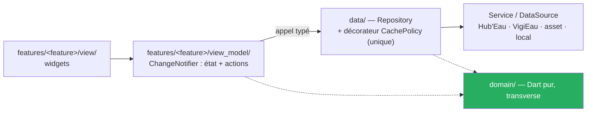

# MartinPêcheur — Claude AI Guidelines

> Application **Flutter** qui informe les usagers d'une rivière française sur son état — **écoulement**, **débit**, **sécheresse** — à partir des APIs publiques **Hub'Eau** et **VigiEau**.
> Carte de la doc : `docs/README.md` · **État vivant (source de vérité des statuts) : `docs/project-state.md`**

> ⚠️ **Ce fichier distingue** ✅ implémenté · 🔄 cible décidée, pas encore codée · 💭 spéculatif. Si ce fichier contredit le code, **le code a raison** : corriger ce fichier dans le même commit.

---

## Où on en est

| Tranche | Prouve | Statut |
|---|---|---|
| **Porte de spike** | Fond IGN affiché (`F1`), exécutable Windows autonome (`F3`) | ✅ **franchie sur Windows, arbitrage du 2026-09-12** (exécution 2026-09-09) — `spike/porte_flutter/COMPTE-RENDU.md`. `F2` (4 150 marqueurs clusterisés) **non tranchée** |
| **T0** | Socle Flutter + carte `flutter_map` + socle domaine + test d'architecture, sur **Windows** | ✅ **clos le 2026-09-13** — `v0.1.0`, **248 tests verts**, porte franchie sur Windows. Plan `docs/superpowers/plans/2026-09-13-t0-socle-flutter.md` : 31 tâches sur 31, 5 Android ⏸ |
| **T1** | Carte, fiches, les 4 avertissements | 🔄 **en cours** — d'abord le réusinage feature-first + MVVM (`ADR-014`, tâches `R1`–`R6`), puis la fiche station |
| **T2** | Sécheresse et restrictions (VigiEau) | 🔄 |
| **T3** | Favoris, filtres, fraîcheur | 🔄 |

**Android ⏸ différé jusqu'à nouvel ordre (arbitrage 2026-09-12).** Dans un plan, une tâche Android est marquée ⏸ : ni supprimée, ni comptée faite. Windows est la **seule cible construite** ; iOS est configuré et **jamais compilé** (aucun hôte macOS).

Le cadrage produit est terminé et vérifié — il ne dépend pas de la technologie. **L'implémentation a son socle** (T0) ; T1 l'ouvre par un réusinage d'architecture avant d'ajouter un écran.

---

## Architecture — feature-first + MVVM (`ADR-014`)

**L'architecture recommandée par l'équipe Flutter**, adoptée par arbitrage du commanditaire le 2026-09-13 : une **tranche par écran**, et dans chaque tranche une **View** (widgets) et un **ViewModel** (`ChangeNotifier`). `domain/` et `data/` sont **partagés**. **Zéro bibliothèque d'état** : `ChangeNotifier` et `ListenableBuilder` sont dans Flutter.

⚠️ **Plus de CQRS, plus de bus.** `Query`/`Command`, le registre `Map<Type, gestionnaire>` et les gestionnaires sont **retirés** (`ADR-014` remplace ce volet d'`ADR-008` et d'`ADR-010`) : un typage perdu à l'envoi, pour une seule forme de lecture et presque aucune écriture. Un ViewModel appelle son dépôt par un **appel typé**, vérifié à la compilation. Pas non plus de couche de cas d'usage — le guide Flutter l'annonce optionnelle, et aucun écran n'orchestre encore deux dépôts.

⚠️ **Pas de backend.** L'app appelle directement les APIs publiques. La seule donnée pré-calculée est un **asset généré hors exécution** (`ADR-003`), pas un service.



### Invariants à ne jamais casser

- **`lib/domain/` ne dépend de rien.** Dart pur : aucun `package:flutter`, `package:latlong2`, `package:http`, `package:drift`, `package:sqflite`, `dart:io`, `dart:ui`. Le verrou est `test/architecture/domain_isolation_test.dart`, **écrit avant la première ligne de `lib/domain/`**. Une dépendance d'infrastructure depuis le domaine est une erreur d'architecture, pas un détail.
- **Un widget n'appelle jamais un dépôt.** Il passe par le ViewModel de son écran, qui expose l'état et les actions. Un widget branche et affiche ; il ne décide pas.
- **Un ViewModel n'importe aucun widget** — ni `package:flutter/material.dart`, ni `widgets.dart`. C'est ce qui le rend testable **sans rendu**. `test/architecture/layers_test.dart` le refuse, comme il refuse `data/ → features/`.
- **La politique de cache vit dans un seul composant** — le décorateur de dépôt `CachePolicy`, sous `lib/data/`, stale-while-revalidate. Jamais recopiée dans un dépôt nu, un ViewModel ou un widget.
- **Les unités sont typées, pas conventionnelles.** Un `double` nu passe en l/s là où on attend des m³/s : utiliser des `extension type` — `LitresPerSecond`, `CubicMetresPerSecond`, `Millimetres`, `Metres`. C'est le bug le plus coûteux du projet (`BR-002`).
- **Aucune valeur brute d'API n'atteint la vue.** La conversion l/s → m³/s et mm → m se fait dans le mapper, une seule fois (`BR-002`).
- **Les trois échelles d'état restent séparées** — écoulement (fait observé), débit (statistique), sécheresse (décision préfectorale). Les fondre dans un champ unique mélangerait trois natures (`BR-008`).
- **Toute nomenclature a une branche par défaut.** `sealed class` + `switch` exhaustif, avec une valeur `Inconnu` : oublier une branche doit être une **erreur de compilation** (`BR-011`).
- **VigiEau ne s'appelle que derrière `RestrictionSource`.** L'API est en version `0.1` : le risque de rupture reste confiné à un module (`ADR-004`).
- **Les quatre avertissements ne sont pas une finition.** Rien ne part en production sans eux (`BR-012`, `BR-013`).

---

## Disposition du dépôt

```
pubspec.yaml                    ← la racine EST le projet Flutter
analysis_options.yaml
lib/
  domain/                       ← Dart pur, transverse (voir invariants)
  data/                         ← dépôts + services : Hub'Eau, VigiEau (derrière RestrictionSource),
                                  asset du référentiel, stockage local, décorateur CachePolicy
  features/map/view/            ← widgets : FlutterMap, TileLayer IGN, marqueurs, attribution
  features/map/view_model/      ← ChangeNotifier : état de l'écran et ses actions, aucun widget
  main.dart                     ← câble dépôts et ViewModels
test/
  architecture/                 ← LE PREMIER TEST À ÉCRIRE — frontières de couches
  domain/  data/  features/     ← features/ contient les tests de view_model (sans rendu)
android/  ios/  windows/        ← versionnés
assets/
  referentiel/stations.json
  percentiles/                  ← produit par le script Dart de génération (ADR-003)
docs/
```

`analysis_options.yaml` : `flutter_lints` + `language: strict-casts, strict-inference, strict-raw-types` + `avoid_dynamic_calls`, `always_declare_return_types`, `prefer_final_locals`. **`dynamic` implicite interdit.**

---

## Stack (état réel par ligne)

| Composant | Techno | État |
|---|---|---|
| Langage | **Dart 3.13.3** | ✅ `flutter --version` le 2026-09-13 (le spike a tourné en 3.13.1) |
| Runtime | **Flutter 3.47.4** stable | ✅ `flutter --version` le 2026-09-13 (le spike a tourné en 3.47.1) |
| Cibles | **Windows en premier**, Android, iOS | Windows ✅ **construite et lancée hors Flutter** (`F3`, 33 Mo, 14 fichiers) · Android ⏸ différé · iOS 🔄 configuré, jamais compilé |
| Carte | **`flutter_map` 8.3.2** · fond **IGN Géoplateforme** (WMTS KVP) · attribution « © IGN Géoplateforme — Licence Ouverte » **affichée** | ✅ **`F1` : le plan IGN s'affiche sur Windows** (2026-09-09). Signatures relevées dans le paquet installé : `TileLayer(urlTemplate:, tileDimension:, maxNativeZoom:, userAgentPackageName:)`, `Marker(point:, width:, height:, child:)`, `MapOptions(initialCenter:, initialZoom:, minZoom:, maxZoom:)`. ⚠️ `tileSize` est `@Deprecated` |
| Marqueurs | `flutter_map_marker_cluster` 8.2.2 lié, `latlong2` 0.9.1 (par contrainte transitive) | ⏸ **`F2` non tranchée** : la mesure du 2026-09-09 donne `raster p90` 16,2 ms (budget ≤ 16,7 ms ✅) mais **jank 8,9 %** pour un seuil < 5 % ❌. **Approche par défaut : marqueurs du viewport plus une marge, sans clustering** (`F2c`), tant qu'aucune mesure ne réhabilite le regroupement |
| Cache de tuiles | **intégré à `flutter_map` depuis 8.2** (`BuiltInMapCachingProvider`, 1 Go), actif par défaut hors web | 🔄 **comportement hors réseau jamais exécuté** — constaté dans la doc seulement. C'est ce que `UC-001 A3` doit décrire |
| Architecture | **feature-first + MVVM**, `ChangeNotifier` par écran (`ADR-014`, arbitrage 2026-09-13) · `CachePolicy` en décorateur de dépôt · **zéro bibliothèque d'état** | 🔄 réusinage en ouverture de T1 (`R1`–`R6`) — le CQRS léger de T0 est retiré |
| HTTP | `package:http` **ou** `dart:io` `HttpClient` | 💭 **à trancher.** Quel que soit le choix : **200 et 206 sont des succès** (`C-06`), retry sur 429/5xx et **jamais** sur 4xx, backoff doublé à chaque essai, à **gigue injectée** (donc testable) |
| Stockage local | `ADR-011` **réservé** — `drift` candidat par défaut ; `sqflite` seul **ne couvre pas Windows** | 💭 à trancher au moment où ça bloque |
| Gestion d'état | `ValueNotifier` + `ListenableBuilder`, zéro dépendance sauf preuve contraire | 💭 |
| Graphes | courbe de débit (`US-11`) | 💭 à trancher |
| Tests | **`flutter test`** — `test/architecture/` d'abord, puis domaine, data, features (dont les `view_model`, sans rendu) | ✅ 248 verts à la clôture de T0 |
| Percentiles | **script Dart** produisant `assets/percentiles/` (`ADR-003`) | 🔄 |

> Toute bibliothèque retenue est vérifiée sur `pub.dev` avant d'être ajoutée : **version, licence compatible GPL-3.0, plateformes — Windows incluse —, date de dernière publication.** On lit la signature dans le paquet installé, on ne l'écrit pas de mémoire.

**Constat ouvert, non diagnostiqué :** sur Windows, **la molette ne zoome pas** ; le glisser déplace bien la carte. À instruire dans le lot clavier/souris.

---

## Sources de données — ce qui est vérifié

Toutes vérifiées **par appels HTTP réels le 2026-07-30**. Détail : `docs/01-analyse.md`.

| Source | Base URL | Rôle |
|---|---|---|
| Hydrométrie **v2** | `https://hubeau.eaufrance.fr/api/v2/hydrometrie` | Débit, hauteur, historique |
| Écoulement ONDE v1 | `https://hubeau.eaufrance.fr/api/v1/ecoulement` | Assecs, écoulement observé |
| VigiEau | `https://api.vigieau.beta.gouv.fr/api` | Restrictions, arrêtés |

### Les pièges qui coûtent une journée

| # | Piège |
|---|---|
| `C-01` | **L'API hydrométrie v1 est arrêtée** depuis le 05/05/2025 → HTTP 403. Seule la **v2** répond |
| `C-02` | **Le débit arrive en l/s, la hauteur en mm.** `53000.0` = 53 m³/s. Diviser par 1000 |
| `C-04` | `obs_elab` **n'a pas de `sort`** — il est ignoré silencieusement et renvoie 1900. Toujours passer `date_debut_obs_elab` |
| `C-05` | Interroger un **code site** (8 car.) renvoie chaque mesure **en double**. N'utiliser que des codes station (10 car.) |
| `C-06` | **HTTP 206 est un succès.** Un client qui n'accepte que 200 casse dès la première pagination |
| `C-10` | Les codes ONDE sont des **chaînes** (`"1a"`, `"1f"`), les libellés de campagne en **minuscules** |
| `C-14` | VigiEau `?commune=` → **HTTP 409**. Toujours `lat`/`lon` |
| `C-15` | **Aucun SLA**, aucun quota chiffré. Mode dégradé obligatoire, throttle client |

---

## La règle qui structure tout le produit

> **On ne qualifie jamais un débit de « suffisant ».**

Aucune API n'expose de seuil réglementaire par station — vérifié sur Hub'Eau, HydroPortail et SANDRE. Le produit sépare donc deux questions et ne les mélange jamais (`ADR-002`) :

| Question | Réponse | Nature |
|---|---|---|
| Ce débit est-il **inhabituel pour la saison** ? | Percentile face à 30 ans d'historique | **Statistique** |
| Qu'est-ce qui est **interdit chez moi** ? | Niveau de gravité, usages restreints, PDF de l'arrêté | **Réglementaire** |

**Mots bannis** pour qualifier un débit : *suffisant, insuffisant, normal, bon, sûr*. Vocabulaire complet : `docs/glossary.md`.

---

## Documentation & Spec

Tout vit dans **ce dépôt** (`docs/`) — code et spec évoluent dans le même commit. Carte complète : `docs/README.md`.

| Artefact | Dossier | Nom | Quand |
|---|---|---|---|
| **Business Rule** | `docs/br/` | `BR-NNN-slug.md` | règle métier invariante |
| **Use Case** | `docs/use-cases/` | `UC-NNN-slug.md` | scénario acteur↔système (mermaid inline) |
| **ADR** | `docs/adr/` | `ADR-NNN-slug.md` | décision technique tranchée + alternatives écartées |

Docs transverses : `docs/glossary.md` · `docs/context-map.md` · `docs/project-state.md`.
Cadrage produit : `docs/01-analyse.md` → `docs/04-ui.md`.

- `NNN` = 3 chiffres séquentiels, jamais réutilisés. `slug` = kebab-case français.
- On **ne supprime pas** un artefact obsolète → statut `Remplacé par …`.
- **Une contrainte d'API subie n'est pas une règle métier** : elle va au tableau `C-xx` de `01-analyse.md`, pas dans `br/`.
- **Diagrammes** : dispersés **à côté** de la sous-partie qu'ils illustrent, jamais en section dédiée. **Mermaid inline** uniquement.
- Templates : `docs/{br,use-cases,adr}/*-template.md`.
- **Trois ADR sont tranchés sans arbitrage du commanditaire** (`ADR-002`, `004`, `006`). Chacun porte une section « Si la décision est revue ». Ne pas les traiter comme définitifs.

---

## Conventions

- **Code :** anglais · **Domaine et documentation :** français
- **Commits :** Conventional Commits — scopes : `domain`, `data`, `ui`, `map`, `hydrometrie`, `ecoulement`, `restrictions`, `avertissement`, `docs`, `ci`. Petits commits, un par tâche du plan
- **Ordre d'implémentation :** `domain/` → `data/` → `features/<feature>/view_model/` → `features/<feature>/view/`
- **TDD** : test rouge avant implémentation. Commencer par la conversion d'unités — c'est le bug le plus coûteux du projet
- **Critère de fin d'étape :** `flutter analyze` **zéro remarque**, `flutter test` **vert**, `dart format` **sans diff**. Montrer les sorties, ne pas les résumer
- **Release Windows :** `flutter build windows --release` → le livrable est le dossier `build/windows/x64/runner/Release/`, lancé **hors** Flutter pour vérification. La commande est **exécutée par le commanditaire**
- **Release Android :** ⏸ différée — rien à préparer tant que l'arbitrage n'est pas levé
- **Dart strict non négociable.** Unités par `extension type`, nomenclatures par `sealed class` closes avec `Inconnu`

### Le poste et le bac à sable

- **Aucun chemin de poste dans le dépôt** : le projet se développe sur plusieurs ordinateurs. `flutter` et `dart` sont sur le PATH ; ce qui est propre à une machine vit dans `CLAUDE.local.md` et `.claude/settings.local.json`, tous deux ignorés par git
- **Le bac à sable de Claude ne construit rien en natif.** `flutter run -d windows` et `flutter build windows` sont lancés **par le commanditaire** : une commande par bloc `bash`, avec le résultat attendu énoncé. Ce résultat est **constaté, jamais supposé**
- Claude lance lui-même `flutter analyze`, `flutter test`, `dart format`
- **Ne rien toucher à Bitdefender ni au système**
- **`gh` est absent du bac à sable** — toute opération qui en dépend est déléguée au commanditaire
---

## Orchestration

Claude est **chef d'orchestre**, pas exécutant solitaire.

- **Déléguer** : `Explore` (haiku) pour la lecture et le repérage · `general-purpose` (sonnet) pour une tâche de TDD cadrée · opus pour un plan, un ADR, une revue
- **Vérifier soi-même** après chaque retour d'agent : `flutter analyze` et `flutter test`. Un rapport d'agent n'est pas une preuve
- **Relire chaque implémentation par un second agent** avant le commit
- **Trois échecs sur le même point : arrêt et question.** Pas de quatrième tentative
- **Solliciter le commanditaire** pour : git destructif · un ADR · l'ajout d'une bibliothèque · un changement de périmètre · tout constat qui ne se voit qu'à l'écran. Toujours par **question fermée avec recommandation**
- **Contrat de sortie — cinq lignes au plus** : ce qui est fait (avec les commits) · ce qui est rouge (avec la sortie) · ce qui est différé · la question ouverte · la commande à lancer

---

## Anti-hallucination

Lire avant d'écrire. Ne jamais inventer une API, un endpoint, un champ, un paquet, une signature ou une volumétrie.

**Sur ce projet, la règle est plus stricte que d'habitude :**

> **Tout fait relatif à une API publique est vérifié par appel réel, et daté.**
> Un fait non vérifié est signalé comme tel, avec l'URL consultée.
> On ne spécifie jamais d'après une documentation seule.

Ce n'est pas de la prudence rédactionnelle : la documentation Hub'Eau est **en écart avec la production** sur au moins quatre points (v1 annoncée vivante mais arrêtée, unités, `code_methode_obs = 8` non documenté, casse des libellés). Le cadrage a déjà évité quatre erreurs bloquantes de cette façon. La même exigence vaut pour une bibliothèque : signature lue dans le paquet installé, version relevée, date notée.

Distinguer **implémenté** ✅ / **décidé mais pas codé** 🔄 / **spéculatif** 💭 — ne jamais compter du 🔄 comme un acquis. Toujours exposer les alternatives avant de recommander. **Ce fichier inclus** : dès qu'il diverge du code, le corriger dans le même commit.

**Ne jamais inventer un seuil hydrologique.** C'est la faute la plus grave possible sur ce produit.
