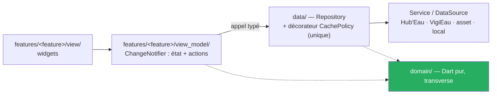

# MartinPêcheur — Claude AI Guidelines

> Application **Flutter** qui informe les usagers d'une rivière française sur son état — **écoulement**, **débit**, **sécheresse** — à partir des APIs publiques **Hub'Eau** et **VigiEau**.
> Carte de la doc : `docs/README.md` · **État vivant (source de vérité des statuts) : `docs/project-state.md`**

> ⚠️ **Ce fichier distingue** ✅ implémenté · 🔄 cible décidée, pas encore codée · 💭 spéculatif. Si ce fichier contredit le code, **le code a raison** : corriger ce fichier dans le même commit.

---

## Où on en est

| Tranche | Prouve | Statut |
|---|---|---|
| **Porte de spike** | Fond IGN affiché (`F1`), exécutable Windows autonome (`F3`) | ✅ **franchie sur Windows, arbitrage du 2026-09-12** (exécution 2026-09-09) — `spike/porte_flutter/COMPTE-RENDU.md`. `F2` (4 150 marqueurs clusterisés) **non tranchée par la mesure** ; approche tranchée par `ADR-015` (2026-09-22) |
| **T0** | Socle Flutter + carte `flutter_map` + socle domaine + test d'architecture, sur **Windows** | ✅ **clos le 2026-09-13** — `v0.1.0`, **248 tests verts**, porte franchie sur Windows. Plan `docs/superpowers/plans/2026-09-13-t0-socle-flutter.md` : 31 tâches sur 31. Les **5 tâches Android** sont hors de ce décompte (« 31 tâches actives, 5 différées ») ; depuis la levée du 2026-09-18 elles ne sont plus toutes différées — `A⏸1` faite, `A⏸2` 🔄, `A⏸3`→`A⏸5` toujours ⏸ |
| **T1** | Carte, fiches, modal et contrôle « ⚠ Avertissement » (carte et chaque fiche, il remplace bandeau et encart daté le 2026-09-23, `W3c`) — encart renforcé (`BR-013`) en T2 | 🔄 en cours — plan révisé le 2026-09-22 (**42 tâches actives**, `H1`, `H2`, `W2b`, `W3b` et `W3c` insérées, heure affichée en heure locale sans suffixe, lot 4 bis `Z1`→`Z4` de regroupement par zone administrative, `ADR-015`) ; réusinage MVVM clos et relu ; lot 1 (données : fixtures ONDE, domaine, mapper, URI, dépôts hydro et ONDE, caches) clos ; lots 2 (`V1`→`V4`) et 3 (`U1`→`U6`, les vues) clos le 2026-09-14, **lot 3 constaté à l'écran sur Windows le 2026-09-22** ; **lot 4 terminé le 2026-09-23** (`W1`→`W5`, `W2b`, `W3b`, `W3c`, `H1`), `H2` fait (`0cc8437`) ; restent le lot 4 bis (`Z2`→`Z4`), `K1`→`K3` et les lots 6 et 7 (dont `X5`, purge React Native en fin de T1) |
| **T2** | Sécheresse et restrictions (VigiEau) | 🔄 |
| **T3** | Favoris, filtres, fraîcheur | 🔄 |

**Android réactivé le 2026-09-18** — l'arbitrage du 2026-09-12 qui le différait « jusqu'à nouvel ordre » est **levé par le commanditaire** (amendement d'`ADR-013`).

- **Ce qui est constaté le 2026-09-18 :** `flutter doctor` rend « [√] Android toolchain - develop for Android devices (Android SDK version 36.0.0) » ; le gabarit `android/` est généré par `flutter create` ; l'émulateur `Pixel_7` (seul listé par `flutter emulators`) a démarré, `adb devices` le voit `emulator-5554 device` et `sys.boot_completed=1`.
- **Ce qui ne l'est pas :** **rien n'a été construit ni lancé sur Android.** Le bac à sable ne compile pas de natif ; `flutter run -d emulator-5554` est à lancer **par le commanditaire**, et **aucun écran de l'app n'a été vu sur Android sous Flutter**.
- **La marque ⏸ ne vaut plus que pour ce qui reste explicitement différé** : `A⏸3` (signature de publication), `A⏸4` (appareil réel), `A⏸5` (publication d'une préversion). Une tâche marquée ⏸ reste listée, ni supprimée ni comptée faite.

Windows reste la **première cible construite** ; iOS est configuré et **jamais compilé** (aucun hôte macOS).

Le cadrage produit est terminé et vérifié — il ne dépend pas de la technologie. **L'implémentation a son socle** (T0), et T1 s'est ouvert par le réusinage d'architecture : il est fait et relu, le premier écran de T1 s'écrit dessus.

---

## Architecture — feature-first + MVVM (`ADR-014`)

**L'architecture recommandée par l'équipe Flutter**, adoptée par arbitrage du commanditaire le 2026-09-13 : une **tranche par écran**, et dans chaque tranche une **View** (widgets) et un **ViewModel** (`ChangeNotifier`). `domain/` et `data/` sont **partagés**. **Zéro bibliothèque d'état** : `ChangeNotifier` et `ListenableBuilder` sont dans Flutter.

⚠️ **Plus de CQRS, plus de bus.** `Query`/`Command`, le registre `Map<Type, gestionnaire>` et les gestionnaires sont **retirés** (`ADR-014` remplace ce volet d'`ADR-008` et d'`ADR-010`) : un typage perdu à l'envoi, pour une seule forme de lecture et presque aucune écriture. Un ViewModel appelle son dépôt par un **appel typé**, vérifié à la compilation. Pas non plus de couche de cas d'usage — le guide Flutter l'annonce optionnelle, et aucun écran n'orchestre encore deux dépôts.

⚠️ **Pas de backend.** L'app appelle directement les APIs publiques. La seule donnée pré-calculée est un **asset généré hors exécution** (`ADR-003`), pas un service.



### Invariants à ne jamais casser

- **`lib/domain/` ne dépend de rien.** Dart pur : aucun `package:flutter`, `package:latlong2`, `package:http`, `package:drift`, `package:sqflite`, `dart:io`, `dart:ui`. Le verrou est `test/architecture/domain_isolation_test.dart`, **écrit avant la première ligne de `lib/domain/`**. Une dépendance d'infrastructure depuis le domaine est une erreur d'architecture, pas un détail.
- **Un widget n'appelle jamais un dépôt.** Il passe par le ViewModel de son écran, qui expose l'état et les actions. Un widget branche et affiche ; il ne décide pas.
- **Un ViewModel n'importe aucun widget** — ni `package:flutter/material.dart`, ni `widgets.dart`. C'est ce qui le rend testable **sans rendu**. La règle vaut pour tout fichier sous `view_model/` **et** pour tout `*_view_model.dart` posé à plat : on ne la contourne pas en déplaçant le fichier.
- **Aucun fichier sous `lib/features/` n'importe `lib/data/`** — ni la vue, ni le ViewModel. Un ViewModel dépend d'une **interface** de dépôt déclarée dans `domain/` ; c'est ce qui rend l'écran testable avec un double en mémoire. `main.dart` en est exempt, et lui seul : la racine de composition choisit les implémentations concrètes. `test/architecture/layers_test.dart` porte les **sept** règles (`domaine-ferme`, `data-vers-features`, `view-model-sans-widget`, `feature-vers-feature`, `features-vers-data`, `shared-sans-tranche`, `features-sans-fichier-a-plat`) et résout aussi les imports **relatifs** — `import '../../data/x.dart'` est la même dépendance que la forme `package:`.
- **Un widget partagé par plusieurs tranches vit dans `lib/features/shared/`** (arbitrage du 2026-09-18, amendement d'`ADR-014`) : importable par toute tranche, n'importe **aucune** tranche — règle `shared-sans-tranche`. 🔄 Le dossier n'existe pas encore ; sa première occupation est l'encart d'avertissement de `W4`.
- **Une emprise (`Bounds`) vit dans `lib/domain/geo/bounds.dart`**, pas dans le fichier des contrats de dépôt : la vue en construit une à chaque relâchement de geste et n'a pas à importer `StationRepository` pour cela.
- **La politique de cache vit dans un seul composant** — le décorateur de dépôt `CachePolicy`, sous `lib/data/`, stale-while-revalidate. Jamais recopiée dans un dépôt nu, un ViewModel ou un widget.
- **Les unités sont typées, pas conventionnelles.** Un `double` nu passe en l/s là où on attend des m³/s : utiliser des `extension type` — `LitresPerSecond`, `CubicMetresPerSecond`, `Millimetres`, `Metres`. C'est le bug le plus coûteux du projet (`BR-002`).
- **Aucune valeur brute d'API n'atteint la vue.** La conversion l/s → m³/s et mm → m se fait dans le mapper, une seule fois (`BR-002`).
- **Les trois échelles d'état restent séparées** — écoulement (fait observé), débit (statistique), sécheresse (décision préfectorale). Les fondre dans un champ unique mélangerait trois natures (`BR-008`).
- **Toute nomenclature a une branche par défaut.** `sealed class` + `switch` exhaustif, avec une valeur `Inconnu` : oublier une branche doit être une **erreur de compilation** (`BR-011`).
- **VigiEau ne s'appelle que derrière `RestrictionSource`.** L'API est en version `0.1` : le risque de rupture reste confiné à un module (`ADR-004`).
- **Les quatre avertissements ne sont pas une finition.** Rien ne part en production sans eux (`BR-012`, `BR-013`). Depuis l'arbitrage du 2026-09-23 (`W3c`), les emplacements 2 et 3 (carte, fiches) ont la forme d'un contrôle « ⚠ Avertissement » **toujours présent**, qui ouvre le texte du modal initial complété, sur une fiche datée, par sa phrase datée : cette forme change, l'obligation non — un écran de carte ou de fiche sans ce contrôle ne part pas. L'encart renforcé de `BR-013` est **reporté en T2** (arbitrage du 2026-09-22 : aucun écran de T1 n'est un écran de ressource) : **aucune mise en production n'a donc lieu avant T2**.

---

## Disposition du dépôt

```
pubspec.yaml                    ← la racine EST le projet Flutter
analysis_options.yaml
lib/
  domain/                       ← Dart pur, transverse (voir invariants) ; geo/bounds.dart y porte
                                  l'emprise, hors des contrats de dépôt
  data/                         ← dépôts + services : Hub'Eau, VigiEau (derrière RestrictionSource),
                                  asset du référentiel, stockage local, décorateur CachePolicy
  features/map/view/            ← widgets : FlutterMap, TileLayer IGN, marqueurs, attribution
  features/map/view_model/      ← ChangeNotifier : état de l'écran et ses actions, aucun widget
  features/{station_sheet,onde_sheet}/{view,view_model}/ ← fiches (T1, lot 3) ; features/warnings/view_model/ (sa view/ arrive en W2)
  features/map/view/            ← + station_marker, onde_marker, map_legend, map_empty_states (lot 3)
  main.dart                     ← câble dépôts et ViewModels ; SEUL fichier autorisé à importer data/
test/
  architecture/                 ← LE PREMIER TEST À ÉCRIRE — frontières de couches
  domain/  data/  features/     ← features/ contient les tests de view_model (sans rendu)
  project/                      ← non-régression sur la doc et la configuration : domain-model.md,
                                  nfr.md, CHANGELOG, identifiant de bundle iOS. `dart:io` y est
                                  autorisé, jamais sous lib/domain/
  fixtures/                     ← réponses d'API et extraits de référentiel réels, datés dans leur
                                  nom : une fixture est un fait constaté, jamais une invention
android/  ios/  windows/        ← versionnés. android/ redevient versionné le 2026-09-18 (levée du
                                  différé, amendement d'ADR-013) : le GABARIT Flutter de plateforme
                                  seulement — les caches de construction (Gradle, build/) restent
                                  hors dépôt et ne se committent jamais
assets/
  referentiel/stations.json
  percentiles/                  ← produit par le script Dart de génération (ADR-003)
docs/
```

`analysis_options.yaml` : `flutter_lints` + `language: strict-casts, strict-inference, strict-raw-types` + `avoid_dynamic_calls`, `always_declare_return_types`, `prefer_final_locals`. **`dynamic` implicite interdit.**

---

## Stack (état réel par ligne)

| Composant | Techno | État |
|---|---|---|
| Langage | **Dart 3.13.3** | ✅ `flutter --version` le 2026-09-13 (le spike a tourné en 3.13.1) |
| Runtime | **Flutter 3.47.4** stable | ✅ `flutter --version` le 2026-09-13 (le spike a tourné en 3.47.1) |
| Cibles | **Windows en premier**, Android, iOS | Windows ✅ **construite et lancée hors Flutter** (`F3`, 33 Mo, 14 fichiers) · Android 🔄 **réactivée le 2026-09-18** (levée du différé du 2026-09-12) — chaîne d'outils vue par `flutter doctor` (« Android SDK version 36.0.0 »), gabarit `android/` généré, émulateur `Pixel_7` démarré et vu `emulator-5554 device` ; **jamais construite, jamais lancée**, aucun écran constaté · iOS 🔄 configuré, jamais compilé |
| Carte | **`flutter_map` 8.3.2** · fond **IGN Géoplateforme** (WMTS KVP) · attribution « © IGN Géoplateforme — Licence Ouverte » **affichée** | ✅ **`F1` : le plan IGN s'affiche sur Windows** (2026-09-09). Signatures relevées dans le paquet installé : `TileLayer(urlTemplate:, tileDimension:, maxNativeZoom:, userAgentPackageName:)`, `Marker(point:, width:, height:, child:)`, `MapOptions(initialCenter:, initialZoom:, minZoom:, maxZoom:)`. ⚠️ `tileSize` est `@Deprecated` |
| Marqueurs | **Regroupement par zone administrative** (`ADR-015`), sans bibliothèque · `latlong2` 0.9.1 (par contrainte transitive) · `flutter_map_marker_cluster` 8.2.2 lié **au spike seulement**, absent de `pubspec.yaml` | 🔄 **décidé, pas encore codé** (lot 4 bis de T1, `Z2`→`Z4`) — **`F2` tranchée par `ADR-015` pour les zooms < 9**, arbitrage du 2026-09-22 : une pastille par **région** sous le zoom 7, par **département** de 7 à 9 (barycentre, compte, symbole existant de l'état le plus sévère, `BR-009`) ; **`F2c`** (viewport plus marge, sans regroupement) **au-delà du zoom 9**. La mesure du 2026-09-09 (`raster p90` 16,2 ms ✅, **jank 8,9 %** ❌ au seuil de 5 %) reste celle du regroupement par proximité, écarté ; `NFR-01` est à mesurer en `X3` |
| Cache de tuiles | **intégré à `flutter_map` depuis 8.2** (`BuiltInMapCachingProvider`, 1 Go), actif par défaut hors web | ✅ **hors réseau constaté à l'écran le 2026-09-13** sur les zones déjà parcourues (`NV-W2`, `docs/nfr.md`). ⚠️ Une zone jamais chargée n'a pas été constatée ; aucun téléchargement de zone (`UC-005` non livré) |
| Architecture | **feature-first + MVVM**, `ChangeNotifier` par écran (`ADR-014`, arbitrage 2026-09-13) · `CachePolicy` en décorateur de dépôt · **zéro bibliothèque d'état** | ✅ **réusinage fait** (`R1`–`R6`, 2026-09-13) et relu : le CQRS léger de T0 est retiré (`grep 'Bus\|Query<\|Command<' lib/` vide), `MapViewModel` appelle son dépôt par un appel typé, `test/architecture/layers_test.dart` verrouille sept règles de couches (les deux dernières, `shared-sans-tranche` et `features-sans-fichier-a-plat`, ajoutées le 2026-09-18) |
| HTTP | **`package:http`** `^1.6.0` (`pubspec.yaml`) | ✅ **retenu** — client Hub'Eau livré en T0 (`N4`), partagé par hydrométrie v2 et ONDE v1 : **200 et 206 sont des succès** (`C-06`), retry sur 429/5xx et **jamais** sur 4xx, backoff doublé à chaque essai, à **gigue injectée** (donc testable) |
| Stockage local | **`shared_preferences` 2.5.5** pour la **préférence simple** (`ADR-011`, arbitrage du 2026-09-18 ; BSD-3-Clause, Windows couvert, relevé sur pub.dev le jour même) · moteur **structuré** non tranché — `drift` candidat par défaut ; `sqflite` seul **ne couvre pas Windows** | ✅ **dans `pubspec.yaml`** (`^2.5.5`, résolue 2.5.5) et réalisée par `SharedPreferencesAcknowledgementRepository` (tâche `W1`, 2026-09-22) ; pas encore câblée dans `main.dart` (`W2`) · 💭 moteur structuré à trancher au moment où ça bloque |
| Gestion d'état | **`ChangeNotifier` + `ListenableBuilder`**, zéro dépendance | ✅ `MapViewModel`, `StationSheetViewModel`, `OndeSheetViewModel` (`ADR-014`) |
| Graphes | courbe de débit (`US-11`) | 💭 à trancher |
| Tests | **`flutter test`** — `test/architecture/` d'abord, puis domaine, data, features (dont les `view_model`, sans rendu), plus `test/project/` sur la doc et la configuration | ✅ **778 tests, 778 verts sur ce poste** (`+778`, « All tests passed! », le 2026-09-18) — première suite entièrement verte depuis T0 : l'alignement Android en TDD du 2026-09-18 retire de `ios_bundle_identifier_test` l'affirmation « le dossier `android/` n'existe pas » et ajoute `test/project/android_configuration_test.dart` (identifiant `fr.martinpecheur.app`, permission réseau dans le manifeste principal, libellé, NDK sans épingle). Repères antérieurs : 773 dont 772 verts le 2026-09-18 avant ce retrait (le seul rouge était précisément cette affirmation), 764 à la clôture du lot 3 le 2026-09-14, 20 goldens compris — 248 à la clôture de T0, 244 après le réusinage MVVM, 411 à la clôture du lot 1 de T1 |
| Percentiles | **script Dart** produisant `assets/percentiles/` (`ADR-003`) | 🔄 |

> Toute bibliothèque retenue est vérifiée sur `pub.dev` avant d'être ajoutée : **version, licence compatible GPL-3.0, plateformes — Windows incluse —, date de dernière publication.** On lit la signature dans le paquet installé, on ne l'écrit pas de mémoire.

**Constat clos le 2026-09-13 :** la molette **zoome** sur Windows et le glisser déplace la carte, constaté à l'écran à l'exécution de T0 (`NV-W1`, `docs/nfr.md`). Le constat contraire du spike n'est pas reproduit, cause non établie.

---

## Sources de données — ce qui est vérifié

Toutes vérifiées **par appels HTTP réels le 2026-07-30**. Détail : `docs/01-analyse.md`.

| Source | Base URL | Rôle |
|---|---|---|
| Hydrométrie **v2** | `https://hubeau.eaufrance.fr/api/v2/hydrometrie` | Débit, hauteur, historique |
| Écoulement ONDE v1 | `https://hubeau.eaufrance.fr/api/v1/ecoulement` | Assecs, écoulement observé |
| VigiEau | `https://api.vigieau.beta.gouv.fr/api` | Restrictions, arrêtés |

### Les pièges qui coûtent une journée

| # | Piège |
|---|---|
| `C-01` | **L'API hydrométrie v1 est arrêtée** depuis le 05/05/2025 → HTTP 403. Seule la **v2** répond |
| `C-02` | **Le débit arrive en l/s, la hauteur en mm.** `53000.0` = 53 m³/s. Diviser par 1000 |
| `C-04` | `obs_elab` **n'a pas de `sort`** — il est ignoré silencieusement et renvoie 1900. Toujours passer `date_debut_obs_elab` |
| `C-05` | Interroger un **code site** (8 car.) renvoie chaque mesure **en double**. N'utiliser que des codes station (10 car.) |
| `C-06` | **HTTP 206 est un succès.** Un client qui n'accepte que 200 casse dès la première pagination |
| `C-10` | Les codes ONDE sont des **chaînes** (`"1a"`, `"1f"`), les libellés de campagne en **minuscules** |
| `C-14` | VigiEau `?commune=` → **HTTP 409**. Toujours `lat`/`lon` |
| `C-15` | **Aucun SLA**, aucun quota chiffré. Mode dégradé obligatoire, throttle client |

---

## La règle qui structure tout le produit

> **On ne qualifie jamais un débit de « suffisant ».**

Aucune API n'expose de seuil réglementaire par station — vérifié sur Hub'Eau, HydroPortail et SANDRE. Le produit sépare donc deux questions et ne les mélange jamais (`ADR-002`) :

| Question | Réponse | Nature |
|---|---|---|
| Ce débit est-il **inhabituel pour la saison** ? | Percentile face à 30 ans d'historique | **Statistique** |
| Qu'est-ce qui est **interdit chez moi** ? | Niveau de gravité, usages restreints, PDF de l'arrêté | **Réglementaire** |

**Mots bannis** pour qualifier un débit : *suffisant, insuffisant, normal, bon, sûr*. Vocabulaire complet : `docs/glossary.md`.

---

## Documentation & Spec

Tout vit dans **ce dépôt** (`docs/`) — code et spec évoluent dans le même commit. Carte complète : `docs/README.md`.

| Artefact | Dossier | Nom | Quand |
|---|---|---|---|
| **Business Rule** | `docs/br/` | `BR-NNN-slug.md` | règle métier invariante |
| **Use Case** | `docs/use-cases/` | `UC-NNN-slug.md` | scénario acteur↔système (mermaid inline) |
| **ADR** | `docs/adr/` | `ADR-NNN-slug.md` | décision technique tranchée + alternatives écartées |

Docs transverses : `docs/glossary.md` · `docs/context-map.md` · `docs/project-state.md`.
Cadrage produit : `docs/01-analyse.md` → `docs/04-ui.md`.

- `NNN` = 3 chiffres séquentiels, jamais réutilisés. `slug` = kebab-case français.
- On **ne supprime pas** un artefact obsolète → statut `Remplacé par …`.
- **Une contrainte d'API subie n'est pas une règle métier** : elle va au tableau `C-xx` de `01-analyse.md`, pas dans `br/`.
- **Diagrammes** : dispersés **à côté** de la sous-partie qu'ils illustrent, jamais en section dédiée. **Mermaid inline** uniquement.
- Templates : `docs/{br,use-cases,adr}/*-template.md`.
- **Trois ADR sont tranchés sans arbitrage du commanditaire** (`ADR-002`, `004`, `006`). Chacun porte une section « Si la décision est revue ». Ne pas les traiter comme définitifs.
- **`ADR-013` et `ADR-014` sont, eux, des arbitrages du commanditaire** — bascule Flutter et Windows première cible (2026-09-12, écrit a posteriori le 2026-09-13), feature-first + MVVM (2026-09-13). Ils ne se révisent pas par défaut. **`ADR-015`** (2026-09-22, regroupement des marqueurs par zone administrative sous le zoom 9) est aussi un arbitrage du commanditaire ; seuls ses **seuils de zoom** (7 et 9) sont révisables, sur constat d'écran. `ADR-011` (2026-09-18) est aussi un arbitrage du commanditaire, **limité à la préférence simple** : le moteur de donnée structurée reste ouvert. Dans `ADR-006`, **seul** le libellé « Non renseigné » est arbitré (2026-09-18) ; le reste garde son statut par défaut.

---

## Conventions

- **Code :** anglais · **Domaine et documentation :** français
- **Commits :** Conventional Commits — scopes : `domain`, `data`, `ui`, `map`, `hydrometrie`, `ecoulement`, `restrictions`, `avertissement`, `docs`, `ci`. Petits commits, un par tâche du plan
- **Ordre d'implémentation :** `domain/` → `data/` → `features/<feature>/view_model/` → `features/<feature>/view/`
- **TDD** : test rouge avant implémentation. Commencer par la conversion d'unités — c'est le bug le plus coûteux du projet
- **Critère de fin d'étape :** `flutter analyze` **zéro remarque**, `flutter test` **vert**, `dart format` **sans diff**. Montrer les sorties, ne pas les résumer
- **Release Windows :** `flutter build windows --release` → le livrable est le dossier `build/windows/x64/runner/Release/`, lancé **hors** Flutter pour vérification. La commande est **exécutée par le commanditaire**
- **Release Android :** ⏸ **la publication reste différée** (`A⏸3` signature, `A⏸5` préversion) — mais la **cible est active en débogage** depuis la levée du 2026-09-18 : `flutter run -d emulator-5554`, **exécuté par le commanditaire**. Aucune construction Android n'est encore constatée
- **Dart strict non négociable.** Unités par `extension type`, nomenclatures par `sealed class` closes avec `Inconnu`
- **SOLID et YAGNI, dans cet ordre de priorité quand ils semblent se contredire.** Rien qui ne soit exigé par une tâche du plan : pas de dépôt générique, pas d'abstraction « pour plus tard », pas de paramètre inutilisé. Mais ce qui est construit respecte une responsabilité par classe, des dépendances sur des interfaces (`StationRepository`, `RestrictionSource`), l'extension par ajout (une nomenclature gagne une branche, elle ne modifie pas un `switch` ailleurs) et l'inversion des dépendances que `test/architecture/layers_test.dart` verrouille. **L'architecture (`ADR-014`, feature-first + MVVM) n'est pas négociable au niveau d'une tâche** : ce qui ne rentre pas dans View / ViewModel / Repository remonte au commanditaire, il ne contourne pas. Toute relecture vérifie explicitement ces trois points : SOLID, YAGNI, conformité à l'architecture

### Le poste et le bac à sable

- **Aucun chemin de poste dans le dépôt** : le projet se développe sur plusieurs ordinateurs. `flutter` et `dart` sont sur le PATH ; ce qui est propre à une machine vit dans `CLAUDE.local.md` et `.claude/settings.local.json`, tous deux ignorés par git
- **Le bac à sable de Claude ne construit rien en natif.** `flutter run -d windows`, `flutter build windows` et — depuis la levée du différé Android du 2026-09-18 — `flutter run -d emulator-5554` sont lancés **par le commanditaire** : une commande par bloc `bash`, avec le résultat attendu énoncé. Ce résultat est **constaté, jamais supposé**
- Claude lance lui-même `flutter analyze`, `flutter test`, `dart format`
- **Ne rien toucher à Bitdefender ni au système**
- **`gh` est absent du bac à sable** — toute opération qui en dépend est déléguée au commanditaire
---

## Orchestration

Claude est **chef d'orchestre**, pas exécutant solitaire.

- **Déléguer** : `Explore` (haiku) pour la lecture et le repérage · `general-purpose` (sonnet) pour une tâche de TDD cadrée · opus pour un plan, un ADR, une revue
- **Vérifier soi-même** après chaque retour d'agent : `flutter analyze` et `flutter test`. Un rapport d'agent n'est pas une preuve
- **Relire chaque implémentation par un second agent** avant le commit
- **Trois échecs sur le même point : arrêt et question.** Pas de quatrième tentative
- **Solliciter le commanditaire** pour : git destructif · un ADR · l'ajout d'une bibliothèque · un changement de périmètre · tout constat qui ne se voit qu'à l'écran. Toujours par **question fermée avec recommandation**
- **Contrat de sortie — cinq lignes au plus** : ce qui est fait (avec les commits) · ce qui est rouge (avec la sortie) · ce qui est différé · la question ouverte · la commande à lancer

---

## Anti-hallucination

Lire avant d'écrire. Ne jamais inventer une API, un endpoint, un champ, un paquet, une signature ou une volumétrie.

**Sur ce projet, la règle est plus stricte que d'habitude :**

> **Tout fait relatif à une API publique est vérifié par appel réel, et daté.**
> Un fait non vérifié est signalé comme tel, avec l'URL consultée.
> On ne spécifie jamais d'après une documentation seule.

Ce n'est pas de la prudence rédactionnelle : la documentation Hub'Eau est **en écart avec la production** sur au moins quatre points (v1 annoncée vivante mais arrêtée, unités, `code_methode_obs = 8` non documenté, casse des libellés). Le cadrage a déjà évité quatre erreurs bloquantes de cette façon. La même exigence vaut pour une bibliothèque : signature lue dans le paquet installé, version relevée, date notée.

Distinguer **implémenté** ✅ / **décidé mais pas codé** 🔄 / **spéculatif** 💭 — ne jamais compter du 🔄 comme un acquis. Toujours exposer les alternatives avant de recommander. **Ce fichier inclus** : dès qu'il diverge du code, le corriger dans le même commit.

**Ne jamais inventer un seuil hydrologique.** C'est la faute la plus grave possible sur ce produit.
