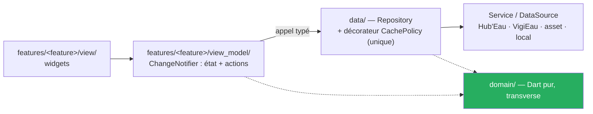

# MartinPêcheur — Claude AI Guidelines

> Application **Flutter** qui informe les usagers d'une rivière française sur son état — **écoulement**, **débit**, **sécheresse** — à partir des APIs publiques **Hub'Eau** et **VigiEau**.
> Carte de la doc : `docs/README.md` · **État vivant (source de vérité des statuts) : `docs/project-state.md`**

> ⚠️ **Ce fichier distingue** ✅ implémenté · 🔄 cible décidée, pas encore codée · 💭 spéculatif. Si ce fichier contredit le code, **le code a raison** : corriger ce fichier dans le même commit.

---

## Où on en est

| Tranche | Prouve | Statut |
|---|---|---|
| **Porte de spike** | Fond IGN affiché (`F1`), exécutable Windows autonome (`F3`) | ✅ **franchie sur Windows, arbitrage du 2026-09-12** (exécution 2026-09-09) — `spike/porte_flutter/COMPTE-RENDU.md`. `F2` (4 150 marqueurs clusterisés) **non tranchée par la mesure** ; approche tranchée par `ADR-015` (2026-09-22) |
| **T0** | Socle Flutter + carte `flutter_map` + socle domaine + test d'architecture, sur **Windows** | ✅ **clos le 2026-09-13** — `v0.1.0`, **248 tests verts**, porte franchie sur Windows. Plan `docs/superpowers/plans/2026-09-13-t0-socle-flutter.md` : 31 tâches sur 31. Les **5 tâches Android** sont hors de ce décompte (« 31 tâches actives, 5 différées ») ; depuis la levée du 2026-09-18 elles ne sont plus toutes différées — `A⏸1` faite, `A⏸2` 🔄, `A⏸3`→`A⏸5` toujours ⏸ |
| **T1** | Carte, fiches, modal et contrôle « ⚠ Avertissement » (carte et chaque fiche, il remplace bandeau et encart daté le 2026-09-23, `W3c`) — encart renforcé (`BR-013`) en T2 | ✅ **clos le 2026-09-27** — `v0.2.0` (tag sur `a664783`, PR #14 fusionnée sur `dev`), **42 tâches sur 42**, porte franchie sur Windows — plan révisé le 2026-09-22 (**42 tâches actives**). **Lots 1 à 5 clos** : lot 1 (données), lots 2 (`V1`→`V4`) et 3 (`U1`→`U6`) le 2026-09-14, **lot 3 constaté à l'écran sur Windows le 2026-09-22** ; lot 4 (`W1`→`W5`, `W2b`, `W3b`, `W3c`, `H1`) et `H2` clos le 2026-09-23, `W3c` constaté à l'écran, PR #12 fusionnée sur `dev` (`5f02d3e`) ; lot 4 bis (`Z1`→`Z4`, `ADR-015`) clos le 2026-09-23, `Z4` constatée à l'écran ; lot 5 (`K1`→`K3`) clos le 2026-09-23, `K2` et `K3` constatées à l'écran **en release**. **Lot 6 clos le 2026-09-27** : `X1`, `X2`, `X4`, `X5` faites ; `X3` mesurée par le commanditaire en `--profile` — `NFR-01` **tenu** sur les trois gestes, `NV-W6` clos sans anti-rebond (`docs/nfr.md`). **Lot 7** : `P1` faite le 2026-09-27 — **porte de T1 franchie sur Windows** (exécutable `0.2.0` hors Flutter, 33 Mo, cinq constats d'écran, hors réseau). `P2` : version datée et taguée `v0.2.0` le 2026-09-27 |
| **T2** | Sécheresse et restrictions (VigiEau) | 🔄 **en cours** — ~~sur `feat/t2-domaine` (poussée sur `origin`, non fusionnée sur `dev` ; PR #17 ouverte **en brouillon** : `gh pr view 17`, 2026-10-04)~~ ✅ **PR #17 fusionnée sur `dev` le 2026-10-06 à 16:34** (`ff3d108`, squash, `gh pr view 17`, fusion faite sous le compte `oliver254` ; `feat/t2-domaine` n'est plus sur `origin`), **la porte de T2 n'étant pas franchie** ; ~~**travail en cours sur `fix/suites-relecture-pr17`** (depuis `dev` à `ff3d108` ; **PR #18 ouverte en brouillon** vers `dev` le 2026-10-06 au soir ;~~ ✅ **PR #18 fusionnée sur `dev` le 2026-10-06 à 18:00, heure de Paris** (`0a1fb6f`, squash, `gh pr view 18`, fusion faite sous le compte `oliver254` ; `fix/suites-relecture-pr17`, partie de `dev` à `ff3d108` et ouverte en brouillon le même soir, n'est plus sur `origin`) ; ~~**travail en cours sur `feat/t2-porte`**~~ ✅ **PR #19 fusionnée sur `dev` le 2026-10-06 à 20:16, heure de Paris** (`b95f1eb`, squash, `gh pr view 19`, fusion faite sous le compte `oliver254` ; lancée par la boucle principale, à la demande du commanditaire (« fusionner et ajouter le tag »), la PR ayant été sortie du brouillon juste avant (`gh pr ready 19`) ; sept commits, `e27a6ac`, `6dbe8b2`, `39b462e`, `8730475`, `9cecb8a`, `61a80e8`, `4c5a91a`, l'arbre de `b95f1eb` étant identique à celui de `feat/t2-porte` à son sommet `4c5a91a` ; le message du commit de fusion, écrit à partir des sept messages, porte les décomptes justes ; `feat/t2-porte` existe encore, en local et sur `origin` : la supprimer revient au commanditaire), **la porte de T2 n'étant pas franchie** ; **branche de travail depuis le 2026-10-07 : `feat/t2-cloture`** (créée depuis `dev` à `b95f1eb`, ~~locale, non poussée, sans PR~~ **poussée sur `origin` le 2026-10-07, PR #20 ouverte vers `dev` le même jour** (**incomplète à ce jour : `P3` doit encore s'y ajouter après la porte** ; état courant de la branche et de sa PR : en-tête « Mis à jour » de `docs/project-state.md`, seul endroit tenu à jour — `gh pr view 20` fait foi) ; elle sert à clore `0.3.0` à `P3`, après la porte) ; avant la fusion, `feat/t2-porte` (créée depuis `dev` à `0a1fb6f` le 2026-10-06 au soir, ~~locale, non poussée, sans PR~~ **poussée sur `origin` le 2026-10-06 au soir et PR #19 ouverte en brouillon vers `dev`** (`gh pr list --head feat/t2-porte --state all` : `OPEN`, brouillon, base `dev`, sommet `9cecb8a` à l'ouverture ; ouverte à 17:17:40 UTC, `gh pr view 19`) — le brouillon est un choix de la boucle principale, sur le précédent des PR #17 et #18, le commanditaire ayant demandé « la PR » sans dire brouillon ou non, réversible : elle servait à franchir la porte de T2 et à clore `0.3.0` ; ~~quatre commits locaux depuis~~ **cinq commits à l'ouverture de la PR**, le même soir : `e27a6ac`, `6dbe8b2`, `39b462e`, `8730475`, `9cecb8a` — des commits de documents ont suivi sur la même PR (un document ne peut pas citer le commit qui le porte) : `61a80e8`, relu par un second agent le 2026-10-06 au soir (bon, un manque mineur, corrigé par `4c5a91a`), puis `4c5a91a`, **non relu par un second agent** ; `gh pr view 19` fait foi ; ~~rien n'est fusionné~~ **la PR #19 est fusionnée** (voir plus haut), **aucun tag n'est posé** : question fermée posée au commanditaire le 2026-10-06 au soir, réponse « Après la porte » — `v0.3.0` se posera à `P3`, une fois le `CHANGELOG` daté d'après ses constats ; `git tag --list` : `v0.1.0`, `v0.2.0`) ; la PR #18 portait onze commits, dont six, `9f81d8c` → `6b06f6f`, issus d'une seconde relecture de la PR #17 : ~~**aucun relu par un second agent**~~ **relus le soir même par trois seconds agents (fusionnables, aucun défaut de code)**, puis retouchés par `83dac21`, `d2cb638` et `81a0b78`, **eux entrés dans `dev` par la fusion sans qu'une relecture par un second agent soit consignée** ~~(la question de les faire relire est posée au commanditaire le 2026-10-06 au soir, sans réponse à l'écriture)~~ **puis relus le soir même par un second agent, dans une copie isolée, mutations à l'appui : les trois sont fusionnables** (réponse du commanditaire : « oui, avant la porte » ; un commentaire de test faux, « vérifié à 2 ms », et cinq des sept remarques mineures de rédaction — quatre commentaires et un titre de test — sont corrigés par `8730475`, commentaires et un titre de test seulement, le délai réel du test restant de 50 ms ; les deux autres ne se corrigent pas par des commentaires : le message de `81a0b78`, qui ne dit pas qu'un test est passé de `testWidgets` à `testWidgetsOnWindows`, et l'assertion de `openDocument`, gardée telle quelle, décision de la boucle principale, réversible) ; vérifiés par test seulement, **rien constaté à l'écran** ; `docs/project-state.md`, point 59) — plan `docs/superpowers/plans/2026-09-27-t2-secheresse-et-restrictions.md`, **24 tâches closes sur 29** au 2026-10-04, après `X4` (`E4` est codée (`bbdfdc1`) mais son constat d'écran n'est fait que pour quatre points sur six — par le commanditaire, le 2026-10-04, en débogage sur Windows : elle reste ouverte et n'est pas comptée). **Codé et vérifié par test (~~2 315~~ ~~2 318~~ 2 328 tests verts, 2026-10-06 au soir, sur `feat/t2-porte` après `39b462e` — « +2328: All tests passed! », quatre tests d'écran (`e27a6ac`, `6dbe8b2`) et six du transport (`39b462e`) de plus —, `flutter analyze` « No issues found! », `dart format` « Formatted 205 files (0 changed) » ; 2 318 au sommet `81a0b78` de `fix/suites-relecture-pr17`, puis 2 318 de même au sommet `0a1fb6f` de `dev` après la fusion de la PR #18, le soir même ; 2 315 plus tôt le même soir, au sommet `6b06f6f` ; 2 292 plus tôt le même jour, après la contrainte de caméra ; 2 274 au sommet `454935e` ; 2 132 le 2026-10-04) :** domaine des restrictions, source VigiEau (un appel par point sans `profil`, cache de session de 6 h), `RestrictionsViewModel`, écran plein « Sécheresse et restrictions » avec l'**encart renforcé** (quatrième avertissement, `BR-013`, posé dans le code depuis `bbdfdc1`), désignation d'un point (choix « Restrictions » du sélecteur puis bouton, appui long, clic droit), écran « D'où vient cette donnée ? », `ExternalLinkOpener` / `url_launcher`. La version `0.3.0` est **ouverte** (`X4` : `CHANGELOG.md` « à publier », `pubspec.yaml` en `0.3.0+3`), **non publiée**. ~~La PR #17 reste **en brouillon tant que la porte n'est pas franchie**.~~ La PR #17 est **fusionnée** (voir plus haut), la porte restant due. 🔧 **La revue de code de la PR #17 (postée le 2026-10-04) est traitée en grande partie le 2026-10-06**, avant la porte et sur demande du commanditaire, **en commits** (`dd09e8f` → `7a19141`, **poussés sur `origin` le 2026-10-06 à 12:41**, puis `576b98e`, ~~non poussé à l'écriture~~ **poussé à 13:28**, avec deux commits de documentation, `origin/feat/t2-domaine` au sommet `454935e`) : délai d'attente HTTP de **10 s par tentative** (~~10 s partout~~ **20 s pour Hub'Eau depuis le 2026-10-06 au soir, 10 s pour VigiEau**, `39b462e` ; ligne HTTP du tableau « Stack »), sur Windows les surcouches de la carte rendent les gestes à la carte, l'écran des restrictions ne se vide plus à sa sortie, texte « sans zone d'eaux superficielles » — **aucune tâche n'est close par ce traitement**, ces correctifs sont vérifiés par test et **aucun n'est constaté à l'écran** ; **l'après-midi, la caméra de la carte est contrainte au monde** (arbitrage du commanditaire : `cameraConstraint: containLatitude()` dans `_mapOptions` de `map_view.dart`, `acb83f3`, poussé le 2026-10-06 à 14:20 ; vérifiée par test, non constatée à l'écran) ; ~~décisions à confirmer et questions ouvertes~~ **décisions des points 50 et 58 confirmées par le commanditaire le 2026-10-06 au soir, délai tranché** : `docs/project-state.md`, points 50, 57 et 58 ; **seconde relecture** (2026-10-06, fin d'après-midi) : quinze constats, appliqués en partie sur `fix/suites-relecture-pr17`, **fusionnée sur `dev` par la PR #18 le 2026-10-06 au soir** — point 59 ; **trois sujets non appliqués de cette relecture sont laissés en dette pour T3** (décision du commanditaire du 2026-10-06 au soir, hors périmètre de la porte : les tests en plateforme Android par défaut, les décisions métier prises dans la vue, la barre de titre d'écran plein écrite deux fois). **Appliqués depuis, sur `feat/t2-porte`, le 2026-10-06 au soir, puis entrés dans `dev` par la fusion de la PR #19** (vérifiés par test, **non constatés à l'écran**, relus par un second agent) : « S'applique à la même zone » ne reste que si le point ne porte qu'un seul arrêté de restriction, avec plusieurs la carte de l'arrêté-cadre liste ses zones (`e27a6ac`) ; la phrase de `BR-007` écrite deux fois est verrouillée par un test (`6dbe8b2`) ; le délai Hub'Eau passe à 20 s (`39b462e`). **Reste :** `A1` (construction Android, commanditaire : **aucune construction Android n'est consignée ni constatée à l'écran** ; un APK de débogage de `0.2.0` daté du 2026-09-27 est présent sur un poste, et des traces de construction du 2026-09-29 sans APK ; qui l'a lancé, et ce qui a été vu, n'est écrit nulle part — question posée au commanditaire le 2026-10-04), les deux constats manquants de `E4` (aucun profil présélectionné puis les usages cités ; un point en mer et sa phrase d'absence) et la réserve de son point 2 (« non repliable »), la porte `P1` (Windows, release) à `P3` (Android émulateur, version close). 🚨 **Les écrans de T2 ne sont constatés qu'en partie** : par le commanditaire, en débogage, sur Windows, le 2026-10-04 (`docs/project-state.md`, point 48), **rien en release, rien sur Android**. Le défilement à la molette de l'écran des restrictions avait déjà été constaté le 2026-09-29. **Mise en production : toujours non**. Hors T2, dits tels : position de l'appareil, échelle sécheresse sur la carte, repli data.gouv, conservation au-delà de la session. Détail et points ouverts : `docs/project-state.md` (points 48 à 59) |
| **T3** | Favoris, filtres, fraîcheur | 🔄 |
| **T4** | Crues : lire la vigilance publiée par Vigicrues, sur la carte (quatrième lecture) et dans une fiche tronçon | 🔄 **prévue le 2026-10-03** (arbitrage du commanditaire), **après T3**, non cadrée en détail — 💭 **aucun fait Vigicrues n'est vérifié par appel réel** ; nouvelle source, ADR à écrire. Cadrage : `docs/superpowers/specs/2026-10-03-cadrage-t4-t5-crues-design.md` |
| **T5** | Être prévenu : avis sur les lieux suivis (vigilance crues, gravité sécheresse), sans serveur ni compte | 🔄 **prévue le 2026-10-03**, **après T4**, non cadrée en détail — dépend des favoris de T3 et d'un moteur de stockage structuré ; 💭 notifications en tâche de fond **jamais essayées**, sur aucune cible |

**Android réactivé le 2026-09-18** — l'arbitrage du 2026-09-12 qui le différait « jusqu'à nouvel ordre » est **levé par le commanditaire** (amendement d'`ADR-013`).

- **Ce qui est constaté le 2026-09-18 :** `flutter doctor` rend « [√] Android toolchain - develop for Android devices (Android SDK version 36.0.0) » ; le gabarit `android/` est généré par `flutter create` ; l'émulateur `Pixel_7` (seul listé par `flutter emulators`) a démarré, `adb devices` le voit `emulator-5554 device` et `sys.boot_completed=1`.
- **Ce qui ne l'est pas :** **rien n'a été construit ni lancé sur Android.** Le bac à sable ne compile pas de natif ; `flutter run -d emulator-5554` est à lancer **par le commanditaire**, et **aucun écran de l'app n'a été vu sur Android sous Flutter**. **2026-10-04 :** un APK de débogage de `0.2.0` (`versionCode 2`) daté du 2026-09-27 est présent sur un poste (`build/app/outputs/flutter-apk/app-debug.apk`, ignoré par git), avec des traces de construction du 2026-09-29 sans nouvel APK ; qui l'a lancé, et ce qui a été vu, n'est écrit nulle part — question posée au commanditaire, voir `docs/project-state.md`, point 9.
- **La marque ⏸ ne vaut plus que pour ce qui reste explicitement différé** : `A⏸3` (signature de publication), `A⏸4` (appareil réel), `A⏸5` (publication d'une préversion). Une tâche marquée ⏸ reste listée, ni supprimée ni comptée faite.

Windows reste la **première cible construite** ; iOS est configuré et **jamais compilé** (aucun hôte macOS).

Le cadrage produit **de T0 à T3** est terminé et vérifié — il ne dépend pas de la technologie. T4 et T5, prévues le 2026-10-03, ne sont **pas cadrées en détail**. **L'implémentation a son socle** (T0), et T1 s'est ouvert par le réusinage d'architecture (fait et relu) ; les écrans de T1 — carte, fiches, avertissements — sont écrits dessus.

---

## Architecture — feature-first + MVVM (`ADR-014`)

**L'architecture recommandée par l'équipe Flutter**, adoptée par arbitrage du commanditaire le 2026-09-13 : une **tranche par écran**, et dans chaque tranche une **View** (widgets) et un **ViewModel** (`ChangeNotifier`). `domain/` et `data/` sont **partagés**. **Zéro bibliothèque d'état** : `ChangeNotifier` et `ListenableBuilder` sont dans Flutter.

⚠️ **Plus de CQRS, plus de bus.** `Query`/`Command`, le registre `Map<Type, gestionnaire>` et les gestionnaires sont **retirés** (`ADR-014` remplace ce volet d'`ADR-008` et d'`ADR-010`) : un typage perdu à l'envoi, pour une seule forme de lecture et presque aucune écriture. Un ViewModel appelle son dépôt par un **appel typé**, vérifié à la compilation. Pas non plus de couche de cas d'usage — le guide Flutter l'annonce optionnelle, et aucun écran n'orchestre encore deux dépôts.

⚠️ **Pas de backend.** L'app appelle directement les APIs publiques. La seule donnée pré-calculée est un **asset généré hors exécution** (`ADR-003`), pas un service.


```mermaid
flowchart LR
    V["features/&lt;feature&gt;/view/<br/>widgets"] --> VM["features/&lt;feature&gt;/view_model/<br/>ChangeNotifier : état + actions"]
    VM -->|appel typé| R["data/ — Repository<br/>+ décorateur CachePolicy (unique)"]
    R --> S["Service / DataSource<br/>Hub'Eau · VigiEau · asset · local"]
    VM -.-> D["domain/ — Dart pur, transverse"]
    R -.-> D
    style D fill:#27ae60,color:#fff
```

### Invariants à ne jamais casser

- **`lib/domain/` ne dépend de rien.** Dart pur : aucun `package:flutter`, `package:latlong2`, `package:http`, `package:drift`, `package:sqflite`, `dart:io`, `dart:ui`. Le verrou est `test/architecture/domain_isolation_test.dart`, **écrit avant la première ligne de `lib/domain/`**. Une dépendance d'infrastructure depuis le domaine est une erreur d'architecture, pas un détail.
- **Un widget n'appelle jamais un dépôt.** Il passe par le ViewModel de son écran, qui expose l'état et les actions. Un widget branche et affiche ; il ne décide pas.
- **Un ViewModel n'importe aucun widget** — ni `package:flutter/material.dart`, ni `widgets.dart`. C'est ce qui le rend testable **sans rendu**. La règle vaut pour tout fichier sous `view_model/` **et** pour tout `*_view_model.dart` posé à plat : on ne la contourne pas en déplaçant le fichier.
- **Aucun fichier sous `lib/features/` n'importe `lib/data/`** — ni la vue, ni le ViewModel. Un ViewModel dépend d'une **interface** de dépôt déclarée dans `domain/` ; c'est ce qui rend l'écran testable avec un double en mémoire. `main.dart` en est exempt, et lui seul : la racine de composition choisit les implémentations concrètes. `test/architecture/layers_test.dart` porte les **sept** règles (`domaine-ferme`, `data-vers-features`, `view-model-sans-widget`, `feature-vers-feature`, `features-vers-data`, `shared-sans-tranche`, `features-sans-fichier-a-plat`) et résout aussi les imports **relatifs** — `import '../../data/x.dart'` est la même dépendance que la forme `package:`.
- **Un widget partagé par plusieurs tranches vit dans `lib/features/shared/`** (arbitrage du 2026-09-18, amendement d'`ADR-014`) : importable par toute tranche, n'importe **aucune** tranche — règle `shared-sans-tranche`. ✅ Le dossier existe et porte six fichiers : `warning_link.dart` (`WarningLink`, `WarningWindow`, `W3c`), `tap_target.dart` (cible de 44 pt, 48 sur Android, `K1` puis `T2-K4`), `keyboard_focus_ring.dart` (`K2`), `action_color.dart` (couleur des actions principales, refonte du 2026-09-29), `data_sources_view.dart` (`DataSourcesView`, `DataSourcesLink`, `T2-S1`), `screen_layout.dart` (`WheelScrollsScreen`, `readingColumnWidth`, `readingColumnGutter`, `T2-S1`) ; l'encart de `W4`, premier occupant, est supprimé par `W3c`.
- **Une emprise (`Bounds`) vit dans `lib/domain/geo/bounds.dart`**, pas dans le fichier des contrats de dépôt : la vue en construit une à chaque relâchement de geste et n'a pas à importer `StationRepository` pour cela.
- **La politique de cache vit dans un seul composant** — le décorateur de dépôt `CachePolicy`, sous `lib/data/`, stale-while-revalidate. Jamais recopiée dans un dépôt nu, un ViewModel ou un widget.
- **Les unités sont typées, pas conventionnelles.** Un `double` nu passe en l/s là où on attend des m³/s : utiliser des `extension type` — `LitresPerSecond`, `CubicMetresPerSecond`, `Millimetres`, `Metres`. C'est le bug le plus coûteux du projet (`BR-002`).
- **Aucune valeur brute d'API n'atteint la vue.** La conversion l/s → m³/s et mm → m se fait dans le mapper, une seule fois (`BR-002`).
- **Les trois échelles d'état restent séparées** — écoulement (fait observé), débit (statistique), sécheresse (décision préfectorale). Les fondre dans un champ unique mélangerait trois natures (`BR-008`).
- **Toute nomenclature a une branche par défaut.** `sealed class` + `switch` exhaustif, avec une valeur `Inconnu` : oublier une branche doit être une **erreur de compilation** (`BR-011`).
- **VigiEau ne s'appelle que derrière `RestrictionSource`.** L'API est en version `0.1` : le risque de rupture reste confiné à un module (`ADR-004`).
- **Les quatre avertissements ne sont pas une finition.** Rien ne part en production sans eux (`BR-012`, `BR-013`). Depuis l'arbitrage du 2026-09-23 (`W3c`), les emplacements 2 et 3 (carte, fiches) ont la forme d'un contrôle « ⚠ Avertissement » **toujours présent**, qui ouvre le texte du modal initial complété, sur une fiche datée, par sa phrase datée : cette forme change, l'obligation non — un écran de carte ou de fiche sans ce contrôle ne part pas. L'encart renforcé de `BR-013` est **reporté en T2** (arbitrage du 2026-09-22 : aucun écran de T1 n'est un écran de ressource) : **aucune mise en production n'a donc lieu avant T2**. ✅ **Posé dans le code le 2026-09-29** (`bbdfdc1`, `E4` de T2) : l'encart renforcé est en tête de l'écran des restrictions, non repliable, dans tous les états — les quatre emplacements sont écrits. Pour T2, seul l'encart renforcé est vu, et en partie : **vu en tête de l'écran des restrictions le 2026-10-04, par le commanditaire, en débogage sur Windows** (« non repliable » non constaté ; rien en release ni sur Android) ; le contrôle « ⚠ Avertissement » a mené à l'écran des sources le même jour, sans que la fenêtre d'origine (carte ou fiche) soit dite, et rien n'est dit du modal. La publication Android n'est pas faite : toujours pas de mise en production. ⚠️ `BR-012` n'est le texte que du modal du premier lancement : l'étiquette « `BR-012`, `BR-013` » pour les quatre avertissements est un point ouvert (`docs/project-state.md`, point 52).

---

## Disposition du dépôt

```
pubspec.yaml                    ← la racine EST le projet Flutter
analysis_options.yaml
lib/
  domain/                       ← Dart pur, transverse (voir invariants) ; geo/bounds.dart y porte
                                  l'emprise, hors des contrats de dépôt, et (T2) geo/geo_point.dart le
                                  point désigné
  domain/restrictions/          ← (T2) zones d'alerte, arrêtés, usages cités, nomenclatures closes,
                                  RestrictionSource et ses trois échecs
  domain/links/                 ← (T2) le port ExternalLinkOpener, sans bibliothèque
  data/                         ← dépôts + services : Hub'Eau, VigiEau (derrière RestrictionSource),
                                  asset du référentiel, stockage local, décorateur CachePolicy
  data/restrictions/            ← (T2) VigieauRestrictionSource, mapper (seul point de conversion),
                                  URI, CachedRestrictionSource (cache de session, 6 h)
  data/links/                   ← (T2) l'implémentation du port, autour de url_launcher
  features/map/view/            ← widgets : FlutterMap, TileLayer IGN, marqueurs, pastilles de zone,
                                  légende, puces d'échelle, contrôles de zoom, avis vides, attribution
  features/map/view_model/      ← ChangeNotifier : état de l'écran et ses actions, aucun widget
  features/{station_sheet,onde_sheet}/{view,view_model}/ ← fiches (T1, lot 3)
  features/warnings/{view,view_model}/ ← écran du premier lancement (T1, lot 4)
  features/restrictions/{view,view_model}/ ← (T2) écran « Sécheresse et restrictions », encart renforcé,
                                  badge de gravité ; RestrictionsViewModel
  features/shared/              ← widgets communs à plusieurs tranches, n'importent aucune tranche
  diagnostics/                  ← sonde de fluidité (X3), inerte sans --dart-define=FLUIDITY_PROBE=true ;
                                  seul main.dart l'importe (convention, aucune règle de layers_test)
  main.dart                     ← câble dépôts et ViewModels ; SEUL fichier autorisé à importer data/
test/
  architecture/                 ← LE PREMIER TEST À ÉCRIRE — frontières de couches
  domain/  data/  features/     ← features/ contient les tests de view_model (sans rendu) et goldens/
  diagnostics/                  ← calcul de la sonde et câblage derrière le drapeau
  project/                      ← non-régression sur la doc et la configuration : domain-model.md,
                                  nfr.md, CHANGELOG, Gherkin, traçabilité, vocabulaire, textes
                                  d'avertissement, identifiants iOS et Android, taille minimale
                                  Windows. `dart:io` y est autorisé, jamais sous lib/domain/
  fixtures/                     ← réponses d'API et extraits de référentiel réels, datés dans leur
                                  nom : une fixture est un fait constaté, jamais une invention
android/  ios/  windows/        ← versionnés. android/ redevient versionné le 2026-09-18 (levée du
                                  différé, amendement d'ADR-013) : le GABARIT Flutter de plateforme
                                  seulement — les caches de construction (Gradle, build/) restent
                                  hors dépôt et ne se committent jamais
assets/
  referentiel/stations.json
  percentiles/                  ← 🔄 n'existe pas : produit par le futur script Dart (ADR-003), hors T1
docs/
  acceptance/                   ← critères d'acceptation en Gherkin français (X1), vérifiés par test ;
                                  restrictions.feature depuis T2 (30 scénarios, 29 avant `e27a6ac` ; jamais exécutés)
  tracabilite.md                ← matrice US, BR, UC et tests (X2), maintenue à la main, vérifiée par test
```

`analysis_options.yaml` : `flutter_lints` + `language: strict-casts, strict-inference, strict-raw-types` + `avoid_dynamic_calls`, `always_declare_return_types`, `prefer_final_locals`. **`dynamic` implicite interdit.**

---

## Stack (état réel par ligne)

| Composant | Techno | État |
|---|---|---|
| Langage | **Dart 3.13.3** | ✅ `flutter --version` le 2026-09-13 (le spike a tourné en 3.13.1) |
| Runtime | **Flutter 3.47.4** stable | ✅ `flutter --version` le 2026-09-13 (le spike a tourné en 3.47.1) |
| Cibles | **Windows en premier**, Android, iOS | Windows ✅ **construite et lancée hors Flutter** (`F3`, 33 Mo, 14 fichiers ; `0.1.0` : 31 Mo) ; code de T1 construit en release et constaté à l'écran le 2026-09-23 (`K2`, `K3`), exécutable `0.2.0` ✅ **construit en release et lancé hors Flutter le 2026-09-27** (`P1`, 33 Mo, 14 fichiers, cinq constats d'écran, hors réseau conforme) · Android 🔄 **réactivée le 2026-09-18** (levée du différé du 2026-09-12) — chaîne d'outils vue par `flutter doctor` (« Android SDK version 36.0.0 »), gabarit `android/` généré, émulateur `Pixel_7` démarré et vu `emulator-5554 device` ; **jamais construite, jamais lancée**, aucun écran constaté · iOS 🔄 configuré, jamais compilé |
| Carte | **`flutter_map` 8.3.2** · fond **IGN Géoplateforme** (WMTS KVP) · attribution « © IGN Géoplateforme — Licence Ouverte » **affichée** | ✅ **`F1` : le plan IGN s'affiche sur Windows** (2026-09-09). Signatures relevées dans le paquet installé : `TileLayer(urlTemplate:, tileDimension:, maxNativeZoom:, userAgentPackageName:)`, `Marker(point:, width:, height:, child:)`, `MapOptions(initialCenter:, initialZoom:, minZoom:, maxZoom:)`. ⚠️ `tileSize` est `@Deprecated` |
| Marqueurs | **Regroupement par zone administrative** (`ADR-015`), sans bibliothèque · `latlong2` 0.9.1 (par contrainte transitive) · `flutter_map_marker_cluster` 8.2.2 lié **au spike seulement**, absent de `pubspec.yaml` | ✅ **codé** (lot 4 bis de T1, `Z2`→`Z4`) **et constaté à l'écran sur Windows le 2026-09-23** — **`F2` tranchée par `ADR-015` pour les zooms < 9**, arbitrage du 2026-09-22 : une pastille par **région** sous le zoom 7, par **département** de 7 à 9 (barycentre, compte, symbole existant de l'état le plus sévère, `BR-009`) ; **`F2c`** (viewport plus marge, sans regroupement) **à partir du zoom 9**. Seuils 7 et 9 gardés au constat ; chevauchement des pastilles d'Île-de-France accepté pour T1. La mesure du 2026-09-09 (`raster p90` 16,2 ms ✅, **jank 8,9 %** ❌ au seuil de 5 %) reste celle du regroupement par proximité, écarté ; `NFR-01` **mesuré sur Windows le 2026-09-27** (`X3`, `--profile`, carte regroupée par zone) : rastérisation p90 ≤ 6,4 ms et trames en retard ≤ 2,5 % sur les trois gestes, seuils tenus |
| Cache de tuiles | **intégré à `flutter_map` depuis 8.2** (`BuiltInMapCachingProvider`, 1 Go), actif par défaut hors web | ✅ **hors réseau constaté à l'écran le 2026-09-13** sur les zones déjà parcourues (`NV-W2`, `docs/nfr.md`). ⚠️ Une zone jamais chargée n'a pas été constatée ; aucun téléchargement de zone (`UC-005` non livré) |
| Architecture | **feature-first + MVVM**, `ChangeNotifier` par écran (`ADR-014`, arbitrage 2026-09-13) · `CachePolicy` en décorateur de dépôt · **zéro bibliothèque d'état** | ✅ **réusinage fait** (`R1`–`R6`, 2026-09-13) et relu : le CQRS léger de T0 est retiré (`grep 'Bus\|Query<\|Command<' lib/` vide), `MapViewModel` appelle son dépôt par un appel typé, `test/architecture/layers_test.dart` verrouille sept règles de couches (les deux dernières, `shared-sans-tranche` et `features-sans-fichier-a-plat`, ajoutées le 2026-09-18) |
| HTTP | **`package:http`** `^1.6.0` (`pubspec.yaml`) | ✅ **retenu** — client Hub'Eau livré en T0 (`N4`), partagé par hydrométrie v2 et ONDE v1 : **200 et 206 sont des succès** (`C-06`), retry sur 429/5xx et **jamais** sur 4xx, backoff doublé à chaque essai, à **gigue injectée** (donc testable) ; **depuis T2 (`D1`) le transport à rejeu est extrait dans `JsonHttpClient`** (`lib/data/http/json_http_client.dart`), partagé avec VigiEau — `HubEauClient` y délègue ; **depuis le 2026-10-06 chaque tentative est bornée** : ~~à 10 s~~ **à 20 s pour Hub'Eau** (hydrométrie v2 et écoulement ONDE v1 : constante `hubEauRequestTimeout` de `lib/data/http/hub_eau_client.dart`, passée par `HubEauClient` à son `JsonHttpClient` ; arbitrage du commanditaire du 2026-10-06 au soir, `39b462e`) **et à 10 s pour VigiEau** (`defaultRequestTimeout`, arbitrage du commanditaire du 2026-10-06), rejouée comme une panne réseau : pire cas avant l'échec ~~43,5 à 47 s~~ **83,5 à 87 s pour Hub'Eau** (4 × 20 s + 3,5 à 7 s de recul), **43,5 à 47 s inchangé pour VigiEau** ; ~~une tentative abandonnée n'est pas annulée~~ **une tentative abandonnée au délai est annulée** (`AbortableRequest` par `Client.send`, `package:http` 1.6.0 ; `9f81d8c`, 2026-10-06, sur `fix/suites-relecture-pr17`, puis sur `dev` par la PR #18, `0a1fb6f`) **sauf sa phase de connexion** (DNS, connexion TCP, poignée de main TLS : non annulée) **et sauf une redirection suivie vers une autre origine** (autre hôte, autre port ou autre schéma : non annulée tant que les en-têtes de la réponse redirigée ne sont pas arrivés ; constaté contre deux serveurs locaux le 2026-10-06 ; aucune source appelée ne redirige à ce jour), établi contre un serveur local, jamais sur une API réelle (`docs/nfr.md`, `NFR-07`) ; ⚠️ ~~10 s est trop court pour le balayage ONDE national mesuré à 10,26 s (`docs/sources/onde.md`, `T-17`) : depuis `9f81d8c` le client ferme la connexion à 10 s au lieu de la laisser finir ; question ouverte~~ **tranché le 2026-10-06 au soir (`docs/project-state.md`, point 59) : à 20 s le balayage ONDE national mesuré à 10,26 s (`docs/sources/onde.md`, `T-17`) passe ; les trois appels de `T-17` restés sans réponse à plus de 60 s et l'appel écoulement de `T-18` sans réponse en 20 s seraient encore coupés** (depuis `9f81d8c` le client ferme la connexion au délai au lieu de la laisser finir ; latences d'appels uniques : `docs/sources/onde.md`, `T-18`) ; **vérifié par test en temps simulé (horloge de test `test/support/simulated_clock.dart`), jamais éprouvé contre l'API réelle** ; la composition réelle de `main.dart`, qui ne passe aucun délai, n'est éprouvée par aucun test (lue seulement) |
| Stockage local | **`shared_preferences` 2.5.5** pour la **préférence simple** (`ADR-011`, arbitrage du 2026-09-18 ; BSD-3-Clause, Windows couvert, relevé sur pub.dev le jour même) · moteur **structuré** non tranché — `drift` candidat par défaut ; `sqflite` seul **ne couvre pas Windows** | ✅ **dans `pubspec.yaml`** (`^2.5.5`, résolue 2.5.5) et réalisée par `SharedPreferencesAcknowledgementRepository` (tâche `W1`, 2026-09-22), **câblée dans `main.dart`** (`W2`) pour l'acquittement de l'avertissement · 💭 moteur structuré à trancher au moment où ça bloque |
| Ouverture de lien | **`url_launcher` ^6.3.2** (résolue **6.3.2**, `pubspec.lock`), **derrière le port `ExternalLinkOpener`** : seul `lib/data/links/url_launcher_external_link_opener.dart` l'importe, mode « hors de l'application » | ✅ **dans `pubspec.yaml`** depuis `B2` (`c6f0f4e`) : publiée le **2025-07-10**, **BSD-3-Clause**, éditeur `flutter.dev`, Windows et Android couverts — relevé sur pub.dev le 2026-09-27 (`B-01`, plan de T2), arbitré par le commanditaire le même jour ; le manifeste Android porte l'élément `<queries>` pour l'intention `VIEW`. ⚠️ **L'ouverture n'est éprouvée que par une fonction de lancement injectée** : `launchUrl` n'a jamais ouvert un arrêté sur une cible, et l'application n'a jamais été construite sur Android avec cette bibliothèque |
| Gestion d'état | **`ChangeNotifier` + `ListenableBuilder`**, zéro dépendance | ✅ `MapViewModel`, `StationSheetViewModel`, `OndeSheetViewModel`, `WarningsViewModel`, `RestrictionsViewModel` (`ADR-014`) |
| Graphes | courbe de débit (`US-11`) | 💭 à trancher |
| Tests | **`flutter test`** — `test/architecture/` d'abord, puis domaine, data, features (dont les `view_model`, sans rendu), plus `test/project/` sur la doc et la configuration | ✅ ~~**2 318 tests verts sur ce poste**~~ **2 328 tests verts sur ce poste** (`flutter test`, le 2026-10-06 au soir, sur `feat/t2-porte` après `39b462e` : « +2328: All tests passed! », quatre tests d'écran (`e27a6ac`, `6dbe8b2`) et six du transport (`39b462e`) de plus ; `flutter analyze` « No issues found! », `dart format` « Formatted 205 files (0 changed) » ; 2 318 le 2026-10-06, au sommet `81a0b78` de `fix/suites-relecture-pr17`, après la seconde relecture de la PR #17 et les retouches de sa relecture, puis 2 318 de même au sommet `0a1fb6f` de `dev` après la fusion de la PR #18, le soir même ; 2 315 plus tôt le même soir, au sommet `6b06f6f` ; 2 292 plus tôt le même jour, après la contrainte de caméra ; 2 274 au sommet `454935e`, après le traitement de la première revue ; **2 132 le 2026-10-04**, « All tests passed! », `X4` dans l'arbre ; 2 126 avec `X3`, 2 125 au sommet `3ba3f0f` de `feat/t2-domaine` : `test/project/tracabilite_test.dart` compte un cas par fichier cité par `docs/tracabilite.md`, et `X3` en cite un de plus ; `X4` ajoute six cas nets à `test/project/changelog_test.dart`). ⚠️ **Deux fichiers mesurent en Roboto**, chargée depuis le SDK Flutter (`FLUTTER_ROOT`), et non en police de test : `test/features/map/view/map_overlays_phone_test.dart` (échoue toujours si la police manque) et `test/features/restrictions/view/restrictions_scale_text_test.dart` (ignoré, `markTestSkipped`, si `FLUTTER_ROOT` manque hors intégration continue) ; Windows rend en Segoe UI, non mesurée. Depuis le 2026-10-06 les verrous de gestes de la carte et du défilement de l'écran des restrictions sont rejoués **en plateforme Windows** (la barre de défilement automatique du bureau y change ce que reçoit la carte), largeurs mesurées en Roboto enregistrée sous le nom « Segoe UI », un substitut. Repère du 2026-09-29 : 1 710 (`+1710`, `bc81efe`, refonte visuelle de T2). Repère de T1 : 1 189 (`+1189`, le 2026-09-27, `P2`). Repère du 2026-09-23 : 1 188 (`X4`). Repères du 2026-09-23 : 908 à la clôture du lot 4, 998 du lot 4 bis, 1 077 du lot 5, 1 185 après `X3`. Repère du 2026-09-18 : 778 tests, 778 verts — première suite entièrement verte depuis T0 : l'alignement Android en TDD du 2026-09-18 retire de `ios_bundle_identifier_test` l'affirmation « le dossier `android/` n'existe pas » et ajoute `test/project/android_configuration_test.dart` (identifiant `fr.martinpecheur.app`, permission réseau dans le manifeste principal, libellé, NDK sans épingle). Repères antérieurs : 773 dont 772 verts le 2026-09-18 avant ce retrait (le seul rouge était précisément cette affirmation), 764 à la clôture du lot 3 le 2026-09-14, 20 goldens compris — 248 à la clôture de T0, 244 après le réusinage MVVM, 411 à la clôture du lot 1 de T1 |
| Percentiles | **script Dart** produisant `assets/percentiles/` (`ADR-003`) | 🔄 |

> Toute bibliothèque retenue est vérifiée sur `pub.dev` avant d'être ajoutée : **version, licence compatible GPL-3.0, plateformes — Windows incluse —, date de dernière publication.** On lit la signature dans le paquet installé, on ne l'écrit pas de mémoire.

**Constat clos le 2026-09-13 :** la molette **zoome** sur Windows et le glisser déplace la carte, constaté à l'écran à l'exécution de T0 (`NV-W1`, `docs/nfr.md`). Le constat contraire du spike n'est pas reproduit, cause non établie.

---

## Sources de données — ce qui est vérifié

Toutes vérifiées **par appels HTTP réels le 2026-07-30**. Détail : `docs/01-analyse.md`.

| Source | Base URL | Rôle |
|---|---|---|
| Hydrométrie **v2** | `https://hubeau.eaufrance.fr/api/v2/hydrometrie` | Débit, hauteur, historique |
| Écoulement ONDE v1 | `https://hubeau.eaufrance.fr/api/v1/ecoulement` | Assecs, écoulement observé |
| VigiEau | `https://api.vigieau.beta.gouv.fr/api` | Restrictions, arrêtés |

### Les pièges qui coûtent une journée

| # | Piège |
|---|---|
| `C-01` | **L'API hydrométrie v1 est arrêtée** depuis le 05/05/2025 → HTTP 403. Seule la **v2** répond |
| `C-02` | **Le débit arrive en l/s, la hauteur en mm.** `53000.0` = 53 m³/s. Diviser par 1000 |
| `C-04` | `obs_elab` **n'a pas de `sort`** — il est ignoré silencieusement et renvoie 1900. Toujours passer `date_debut_obs_elab` |
| `C-05` | Interroger un **code site** (8 car.) renvoie chaque mesure **en double**. N'utiliser que des codes station (10 car.) |
| `C-06` | **HTTP 206 est un succès.** Un client qui n'accepte que 200 casse dès la première pagination |
| `C-10` | Les codes ONDE sont des **chaînes** (`"1a"`, `"1f"`), les libellés de campagne en **minuscules** |
| `C-14` | VigiEau `?commune=` → **HTTP 409**. Toujours `lat`/`lon` |
| `C-15` | **Aucun SLA**, aucun quota chiffré. Mode dégradé obligatoire, throttle client |

---

## La règle qui structure tout le produit

> **On ne qualifie jamais un débit de « suffisant ».**

Aucune API n'expose de seuil réglementaire par station — vérifié sur Hub'Eau, HydroPortail et SANDRE. Le produit sépare donc deux questions et ne les mélange jamais (`ADR-002`) :

| Question | Réponse | Nature |
|---|---|---|
| Ce débit est-il **inhabituel pour la saison** ? | Percentile face à 30 ans d'historique | **Statistique** |
| Qu'est-ce qui est **interdit chez moi** ? | Niveau de gravité, usages restreints, PDF de l'arrêté | **Réglementaire** |

**Mots bannis** pour qualifier un débit : *suffisant, insuffisant, normal, bon, sûr*. Vocabulaire complet : `docs/glossary.md`.

---

## Documentation & Spec

Tout vit dans **ce dépôt** (`docs/`) — code et spec évoluent dans le même commit. Carte complète : `docs/README.md`.

| Artefact | Dossier | Nom | Quand |
|---|---|---|---|
| **Business Rule** | `docs/br/` | `BR-NNN-slug.md` | règle métier invariante |
| **Use Case** | `docs/use-cases/` | `UC-NNN-slug.md` | scénario acteur↔système (mermaid inline) |
| **ADR** | `docs/adr/` | `ADR-NNN-slug.md` | décision technique tranchée + alternatives écartées |

Docs transverses : `docs/glossary.md` · `docs/context-map.md` · `docs/project-state.md`.
Cadrage produit : `docs/01-analyse.md` → `docs/04-ui.md`.

- `NNN` = 3 chiffres séquentiels, jamais réutilisés. `slug` = kebab-case français.
- On **ne supprime pas** un artefact obsolète → statut `Remplacé par …`.
- **Une contrainte d'API subie n'est pas une règle métier** : elle va au tableau `C-xx` de `01-analyse.md`, pas dans `br/`.
- **Diagrammes** : dispersés **à côté** de la sous-partie qu'ils illustrent, jamais en section dédiée. **Mermaid inline** uniquement.
- Templates : `docs/{br,use-cases,adr}/*-template.md`.
- **Trois ADR ont été tranchés sans arbitrage du commanditaire** (`ADR-002`, `004`, `006`). Chacun porte une section « Si la décision est revue ». Ne pas les traiter comme définitifs. **`ADR-004` est en partie arbitré le 2026-09-27** (cadrage de T2) : chemin nominal VigiEau sans repli data.gouv, eaux superficielles d'abord et autres zones nommées, un seul appel par point filtré par profil dans le domaine ; ses autres choix restent proposés.
- **`ADR-013` et `ADR-014` sont, eux, des arbitrages du commanditaire** — bascule Flutter et Windows première cible (2026-09-12, écrit a posteriori le 2026-09-13), feature-first + MVVM (2026-09-13). Ils ne se révisent pas par défaut. **`ADR-015`** (2026-09-22, regroupement des marqueurs par zone administrative sous le zoom 9) est aussi un arbitrage du commanditaire ; seuls ses **seuils de zoom** (7 et 9) sont révisables, sur constat d'écran. `ADR-011` (2026-09-18) est aussi un arbitrage du commanditaire, **limité à la préférence simple** : le moteur de donnée structurée reste ouvert. Dans `ADR-006`, **seul** le libellé « Non renseigné » est arbitré (2026-09-18) ; le reste garde son statut par défaut.

---

## Conventions

- **Code :** anglais · **Domaine et documentation :** français
- **Commits :** Conventional Commits — scopes : `domain`, `data`, `ui`, `map`, `hydrometrie`, `ecoulement`, `restrictions`, `avertissement`, `docs`, `ci`. Petits commits, un par tâche du plan
- **Ordre d'implémentation :** `domain/` → `data/` → `features/<feature>/view_model/` → `features/<feature>/view/`
- **TDD** : test rouge avant implémentation. Commencer par la conversion d'unités — c'est le bug le plus coûteux du projet
- **Critère de fin d'étape :** `flutter analyze` **zéro remarque**, `flutter test` **vert**, `dart format` **sans diff**. Montrer les sorties, ne pas les résumer
- **Release Windows :** `flutter build windows --release` → le livrable est le dossier `build/windows/x64/runner/Release/`, lancé **hors** Flutter pour vérification. La commande est **exécutée par le commanditaire**
- **Release Android :** ⏸ **la publication reste différée** (`A⏸3` signature, `A⏸5` préversion) — mais la **cible est active en débogage** depuis la levée du 2026-09-18 : `flutter run -d emulator-5554`, **exécuté par le commanditaire**. Aucune construction Android n'est encore constatée
- **Dart strict non négociable.** Unités par `extension type`, nomenclatures par `sealed class` closes avec `Inconnu`
- **SOLID et YAGNI, dans cet ordre de priorité quand ils semblent se contredire.** Rien qui ne soit exigé par une tâche du plan : pas de dépôt générique, pas d'abstraction « pour plus tard », pas de paramètre inutilisé. Mais ce qui est construit respecte une responsabilité par classe, des dépendances sur des interfaces (`StationRepository`, `RestrictionSource`), l'extension par ajout (une nomenclature gagne une branche, elle ne modifie pas un `switch` ailleurs) et l'inversion des dépendances que `test/architecture/layers_test.dart` verrouille. **L'architecture (`ADR-014`, feature-first + MVVM) n'est pas négociable au niveau d'une tâche** : ce qui ne rentre pas dans View / ViewModel / Repository remonte au commanditaire, il ne contourne pas. Toute relecture vérifie explicitement ces trois points : SOLID, YAGNI, conformité à l'architecture

### Le poste et le bac à sable

- **Aucun chemin de poste dans le dépôt** : le projet se développe sur plusieurs ordinateurs. `flutter` et `dart` sont sur le PATH ; ce qui est propre à une machine vit dans `CLAUDE.local.md` et `.claude/settings.local.json`, tous deux ignorés par git
- **Le bac à sable de Claude ne construit rien en natif.** `flutter run -d windows`, `flutter build windows` et — depuis la levée du différé Android du 2026-09-18 — `flutter run -d emulator-5554` sont lancés **par le commanditaire** : une commande par bloc `bash`, avec le résultat attendu énoncé. Ce résultat est **constaté, jamais supposé**
- Claude lance lui-même `flutter analyze`, `flutter test`, `dart format`
- **Ne rien toucher à Bitdefender ni au système**
- **`gh` dépend du poste** — constater par `command -v gh` (ou le chemin d'installation) et `gh auth status` avant de déléguer une opération GitHub au commanditaire ; sa présence se note dans `CLAUDE.local.md`, pas ici. Constaté le 2026-09-27 sur un poste : installé et authentifié (PR #14 ouverte avec lui)
---

## Orchestration

Claude est **chef d'orchestre**, pas exécutant solitaire.

- **Déléguer** : `Explore` (haiku) pour la lecture et le repérage · `general-purpose` (sonnet) pour une tâche de TDD cadrée · opus pour un plan, un ADR, une revue
- **Vérifier soi-même** après chaque retour d'agent : `flutter analyze` et `flutter test`. Un rapport d'agent n'est pas une preuve
- **Relire chaque implémentation par un second agent** avant le commit
- **Trois échecs sur le même point : arrêt et question.** Pas de quatrième tentative
- **Solliciter le commanditaire** pour : git destructif · un ADR · l'ajout d'une bibliothèque · un changement de périmètre · tout constat qui ne se voit qu'à l'écran. Toujours par **question fermée avec recommandation**
- **Contrat de sortie — cinq lignes au plus** : ce qui est fait (avec les commits) · ce qui est rouge (avec la sortie) · ce qui est différé · la question ouverte · la commande à lancer

---

## Anti-hallucination

Lire avant d'écrire. Ne jamais inventer une API, un endpoint, un champ, un paquet, une signature ou une volumétrie.

**Sur ce projet, la règle est plus stricte que d'habitude :**

> **Tout fait relatif à une API publique est vérifié par appel réel, et daté.**
> Un fait non vérifié est signalé comme tel, avec l'URL consultée.
> On ne spécifie jamais d'après une documentation seule.

Ce n'est pas de la prudence rédactionnelle : la documentation Hub'Eau est **en écart avec la production** sur au moins quatre points (v1 annoncée vivante mais arrêtée, unités, `code_methode_obs = 8` non documenté, casse des libellés). Le cadrage a déjà évité quatre erreurs bloquantes de cette façon. La même exigence vaut pour une bibliothèque : signature lue dans le paquet installé, version relevée, date notée.

Distinguer **implémenté** ✅ / **décidé mais pas codé** 🔄 / **spéculatif** 💭 — ne jamais compter du 🔄 comme un acquis. Toujours exposer les alternatives avant de recommander. **Ce fichier inclus** : dès qu'il diverge du code, le corriger dans le même commit.

**Ne jamais inventer un seuil hydrologique.** C'est la faute la plus grave possible sur ce produit.
