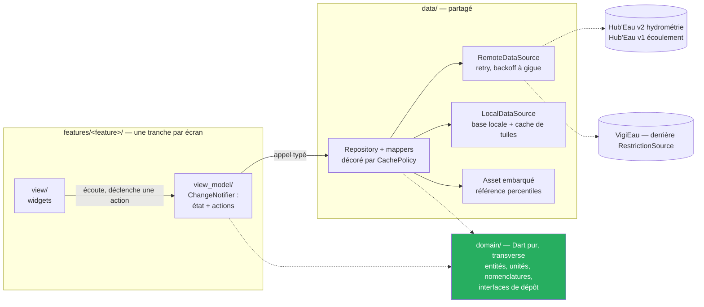

# 03 — Conception

**Cible** : **Flutter / Dart**, **Windows en première cible construite** ([`ADR-013`](adr/ADR-013-bascule-flutter-cible-windows.md)) ; Android réactivé le 2026-09-18 (jamais construit ni lancé), iOS configuré (jamais compilé).

> ⚠️ **Deux bascules de stack avant celle-ci.** Ce document décrivait d'abord .NET MAUI, puis React
> Native + MapLibre : [`ADR-005`](adr/ADR-005-stack-maui-blazor-hybrid.md), [`ADR-008`](adr/ADR-008-cqrs-leger-et-cache-en-pipeline.md),
> [`ADR-009`](adr/ADR-009-cible-windows.md) et [`ADR-010`](adr/ADR-010-react-native.md) racontent
> pourquoi chacune a été abandonnée. La cible actuelle est tranchée par [`ADR-013`](adr/ADR-013-bascule-flutter-cible-windows.md)
> (arbitrage du commanditaire du 2026-09-12).

## 1. Stack

### 1.1 Ce qui a été éliminé

Deux bibliothèques de carte liées à une plateforme native (`Microsoft.Maui.Controls.Maps`, puis
`react-native-maps`) ont été écartées avant Flutter : incompatibles avec des **tuiles
personnalisées** et avec le **hors-ligne**, deux exigences du produit — la contrainte vient du
produit, pas de la technologie. Sur Flutter, `flutter_map` (retenu, voir `CLAUDE.md` § Stack) répond
aux deux.

### 1.2 Le choix — [`ADR-013`](adr/ADR-013-bascule-flutter-cible-windows.md), [`ADR-014`](adr/ADR-014-feature-first-mvvm.md)

**`flutter_map`**, fond de tuiles raster IGN Géoplateforme (WMTS KVP).

| Besoin | Couverture |
|---|---|
| Regroupement de ~4 150 points | Regroupement par zone administrative sous le zoom 9, sans bibliothèque ([`ADR-015`](adr/ADR-015-regroupement-par-zone-administrative.md)) |
| Tuiles WMTS personnalisées | `TileLayer(urlTemplate: …)`, gabarit KVP passé tel quel |
| **Hors-ligne** | Cache de tuiles **intégré à `flutter_map` depuis 8.2** pour les zones déjà parcourues ; aucun téléchargement de zone à la demande — le `Must` d'[`UC-005`](use-cases/UC-005-consulter-la-carte-hors-ligne.md) reste non livré |
| Rendu | Widgets Flutter, compilés nativement sur chaque cible |

**Fond de carte** : IGN Géoplateforme WMTS (Licence Ouverte, cohérent avec des données françaises), OSM en repli (ODbL). *Inchangé à travers les trois stacks — ce choix ne dépendait d'aucune d'elles.*
**Stockage local** : `shared_preferences` pour la préférence simple ([`ADR-011`](adr/ADR-011-stockage-local.md)) ; moteur structuré (favoris, cache persistant) encore à trancher.

## 2. Architecture

> ⚠️ **Cette section est réécrite le 2026-09-13** ([`ADR-014`](adr/ADR-014-feature-first-mvvm.md), arbitrage du commanditaire). Elle décrivait une architecture en couches avec un contrat `Query`/`Command` et un registre de gestionnaires, repris d'[`ADR-008`](adr/ADR-008-cqrs-leger-et-cache-en-pipeline.md) : ce volet est abandonné.

**Feature-first + MVVM**, l'architecture recommandée par l'équipe Flutter (guide lu le 2026-09-13). Deux couches, et une **tranche par écran** :

| Élément | Où | Rôle |
|---|---|---|
| **View** | `lib/features/<feature>/view/` | widgets. Elle branche et affiche ; elle ne décide pas, et **n'appelle jamais un dépôt** |
| **ViewModel** | `lib/features/<feature>/view_model/` | un `ChangeNotifier` par écran : il expose l'état et les actions, et appelle les dépôts par des **appels typés**. Il **n'importe aucun widget** — c'est ce qui le rend testable sans rendu |
| **Repository** | `lib/data/` | source de vérité d'une donnée, décorée par `CachePolicy`. Produit des objets de domaine, jamais des valeurs brutes d'API |
| **Service / DataSource** | `lib/data/` | enveloppe une source : Hub'Eau v2, ONDE v1, VigiEau derrière `RestrictionSource`, asset des percentiles, stockage local |
| **`domain/`** | `lib/domain/` | Dart pur, **transverse** : entités, unités typées, nomenclatures, interfaces de dépôt. Ne dépend de rien |

**Zéro bibliothèque de gestion d'état** : `ChangeNotifier` et `ListenableBuilder` sont dans Flutter. **Aucune couche de cas d'usage** non plus — le guide l'annonce optionnelle, et aucun des six cas d'usage n'orchestre encore deux dépôts ; elle se réintroduirait **entre** ViewModel et dépôt, sans rien défaire.

Tranches prévues : `features/{map,station_detail,onde,restrictions,favorites,settings}`, plus `data/` et `domain/` partagés.



**Le sens des dépendances est verrouillé par un test**, pas seulement écrit : `data/` n'importe jamais `features/`, `domain/` n'importe aucune infrastructure, et un `view_model` n'importe ni `material.dart` ni `widgets.dart`.

**Isolation du risque VigiEau** : une seule interface `RestrictionSource`, deux implémentations (API, puis export data.gouv en repli). Une rupture de l'API `0.1` n'impacte qu'une classe.

## 3. Modèle de données local

> Les trois échelles d'état sont **séparées**. Les fondre dans un champ unique (`normal/alerte/assec/crise`) mélangerait un fait observé, une statistique et une décision préfectorale — trois natures différentes, trois responsabilités différentes.

| Entité | Champs | Relations |
|---|---|---|
| `Departement` | `Code` (PK), `Nom`, `CodeRegion` | Asset embarqué, jamais rafraîchi |
| `Station` | `CodeStation` (PK, 10 car.), `LibelleStation`, `Latitude`, `Longitude`, `CodeDepartement` (idx), `LibelleCoursEau`, `EnService`, `DateMajReferentiel` | → `Departement` |
| `ObservationHydro` | `Id` (PK), `CodeStation` (idx), `DateObs`, `GrandeurHydro` (`H`\|`Q`), `ValeurM3S`, `ValeurM`, `CodeStatut`, `LibelleStatut`, `CodeQualification`, `LibelleQualification` | → `Station` |
| `SerieDebitJournaliere` | `Id` (PK), `CodeStation` (idx), `DateObs`, `ValeurM3S` | → `Station` — issue d'`obs_elab/QmnJ` |
| `NiveauDebitCalcule` | `CodeStation` (PK), `Classe` (`TresBas`…`TresHaut`\|`Indetermine`), `Percentile`, `DateCalcul`, `NbAnneesReference` | → `Station` — **échelle 2** |
| `ReferencePercentile` | `CodeStation` + `Quinzaine` (PK composite), `P10`, `P25`, `P50`, `P75`, `P90`, `NbAnnees` | **Asset embarqué en lecture seule**, `DateGeneration` en métadonnée |
| `PointOnde` | `CodeStation` (PK), `LibelleStation`, `Latitude`, `Longitude`, `CodeDepartement` (idx), `LibelleCoursEau` | → `Departement` |
| `CampagneOnde` | `CodeCampagne` (PK), `DateCampagne`, `TypeCampagne` (minuscules) | — |
| `ObservationOnde` | `Id` (PK), `CodeStation` (idx), `CodeCampagne` (idx), `CodeEcoulement` (**string**), `LibelleEcoulement`, `Categorie` (`Normal`\|`Faible`\|`NonVisible`\|`Assec`\|`NonObserve`), `DateObservation` | → `PointOnde`, `CampagneOnde` — **échelle 1** |
| `ZoneRestriction` | `IdZone` (PK), `CodeDepartement` (idx), `Nom`, `TypeZone` (`SUP`\|`SOU`\|`AEP`), `NiveauGravite`, `DateDebut`, `DateFin`, `UrlArrete`, `UrlArreteCadre` | **échelle 3** — filtrée sur `SUP` pour l'usage rivière |
| `UsageRestreint` | `Id` (PK), `IdZone` (idx), `Nom`, `Thematique`, `Description`, `ConcerneParticulier`, `ConcerneExploitation`, `ConcerneCollectivite`, `ConcerneEntreprise` | → `ZoneRestriction` |
| `Favori` | `CodeEntite` (PK), `TypeEntite`, `DateAjout` | Polymorphe |
| `CacheMeta` | `CleCache` (PK), `TypeDonnee`, `DateRecuperation`, `TtlSecondes`, `TailleOctets` | Pilote la purge |
| `DerniereVueCarte` | `Id` (PK, unique), `BboxMinLat/Lon`, `BboxMaxLat/Lon`, `Zoom`, `DateSnapshot` | Ancre du hors-ligne |
| `TuilePack` | `Id` (PK), `BboxRef`, `ZoomMin`, `ZoomMax`, `CheminFichier`, `DateTelechargement` | Fichiers hors base |

## 4. Cache et rafraîchissement

### 4.1 Politique par type de donnée

| Donnée | TTL | Stratégie | Purge |
|---|---|---|---|
| Référentiel stations (6 454 lignes) | 30 j | Préchargement au 1er lancement, puis SWR | Remplacement en bloc |
| Référentiel points ONDE (3 548) | 30 j | Idem | Remplacement en bloc |
| `observations_tr` | **20 min** | Cache affiché immédiatement, rafraîchissement en tâche de fond si TTL dépassé **et** réseau disponible | Dernière valeur toujours conservée |
| `obs_elab` (courbe) | 12 h | À la demande à l'ouverture de la fiche | LRU par (station, fenêtre) |
| Campagnes ONDE | **30 j en saison (mai-sept), 90 j hors saison** | Vérification d'une nouvelle campagne au lancement | 2 dernières campagnes conservées |
| Zones de restriction | **6 h** | SWR + badge horodaté | Remplacement en bloc |
| `ReferencePercentile` | ∞ | Asset embarqué, jamais d'appel réseau | Remplacé à chaque release |
| Départements | ∞ | Asset embarqué | — |
| Tuiles | LRU, plafond **150 Mo** configurable | Pack local pour la bbox visitée | Auto au-delà du plafond, ou manuelle |

**Règle générale** : lecture du cache → rendu immédiat → si TTL dépassé et réseau disponible, rafraîchissement en tâche de fond → sinon, badge « données du JJ/MM à HH:MM ».

> ⚠️ **Deux âges distincts, à ne pas confondre** — corrigé le 2026-08-01, ce paragraphe les mélangeait.
>
> | Âge | Mesuré sur | Seuils | Effet |
> |---|---|---|---|
> | **Fraîcheur du cache** | date de récupération | le TTL du tableau ci-dessus | déclenche le rafraîchissement en tâche de fond |
> | **Âge de la mesure** (`BR-005`) | **`date_obs`** | **2 h** puis **24 h**, absolus | mention « il y a N h », puis marqueur atténué |
>
> Une observation peut être **fraîchement téléchargée et vieille de neuf jours** : c'est le cas en production (`BR-001`). Appliquer « 2 × TTL » à l'âge de la mesure déclarerait périmée une observation de 40 minutes, à qui `BR-005` laisse 24 heures.

> Cette règle est portée par **un composant unique** — le décorateur de dépôt `CachePolicy`, sous `lib/data/` ([`ADR-014`](adr/ADR-014-feature-first-mvvm.md) ; le principe « un seul endroit » vient d'[`ADR-008`](adr/ADR-008-cqrs-leger-et-cache-en-pipeline.md), son véhicule a changé) — jamais recopiée dans un dépôt nu, un ViewModel ou un widget.

### 4.2 Implémentation — client HTTP

- Client `package:http` par source, avec **retry et backoff exponentiel à gigue** sur 429, 5xx et erreurs réseau transitoires ([`CLAUDE.md`](../CLAUDE.md) § HTTP) — ✅ livré en T0 (`N4`).
- **206 doit être traité comme un succès** (`C-06`) : normaliser 200 et 206 au même endroit, jamais un test `status == 200` seul qui casse dès la première pagination.
- Throttle client global : Hub'Eau n'annonce aucun quota, et l'app n'a pas de proxy pour mutualiser la charge de sa base installée (`C-15`).
- Conversion l/s → m³/s **et** mm → m dans le mapper uniquement, couverte par test unitaire (`BR-002`). **`extension type`** (`LitresPerSecond`, `CubicMetresPerSecond`, `Millimetres`, `Metres`) pour empêcher qu'un `double` nu en l/s soit passé là où on attend des m³/s — Dart les ferme dans les deux sens.
- Toute nomenclature porte une branche `Inconnu`, garantie par un `sealed class` + `switch` exhaustif — oublier une branche est une erreur de compilation (`BR-011`).

### 4.3 Hors-ligne « dernière carte consultée » — 💭 non livré, mécanisme à trancher

Cette section décrit un **besoin**, pas un mécanisme retenu : le hors-ligne cartographique a
échoué sur la stack précédente ([`ADR-012`](adr/ADR-012-hors-ligne-cartographique-bloque.md)) et
n'a pas été repris depuis la bascule Flutter. Sur `flutter_map`, seul le cache de tuiles déjà
parcourues sert hors réseau (constaté le 2026-09-13, `NV-W2`) ; aucun téléchargement de zone à la
demande n'existe. Le besoin fonctionnel reste :

1. À chaque stabilisation de la carte, retenir la dernière bbox + zoom consultés.
2. Les stations et points ONDE de cette bbox, avec leur dernière observation connue, doivent être
   disponibles hors réseau — sans duplication avec le cache déjà en mémoire.
3. Un mécanisme de téléchargement explicite pour la bbox ± marge reste **à concevoir** : aucune
   bibliothèque de tuiles hors-ligne n'est retenue à ce jour.
4. Au lancement sans réseau : centrage sur la dernière vue → marqueurs au dernier état connu →
   bandeau persistant « Mode hors-ligne — données du JJ/MM/AAAA à HH:MM ».

Le `Must` d'[`UC-005`](use-cases/UC-005-consulter-la-carte-hors-ligne.md) reste **non livré**.

## 5. Arborescence des écrans

```
Navigateur racine
├── Avertissement initial (modal bloquant, hors navigation, acquittement requis)
├── Carte ......................... écran d'accueil
│   ├── Recherche (station / cours d'eau)
│   ├── Filtres (feuille) : type · état · département · fraîcheur
│   ├── Légende de l'échelle active
│   ├── Contrôle « ⚠ Avertissement » → fenêtre (remplace le bandeau permanent, W3c, 2026-09-23)
│   └── Résumé au tap (feuille) → fiche
├── Fiche station hydrométrique .... route paramétrée par CodeStation
│   ├── Débit (m³/s) + date + statut de qualification
│   ├── Niveau relatif à l'historique + limites
│   ├── Courbe 7 / 30 / 90 j
│   └── Actions : favori, télécharger la zone, partager
├── Fiche point ONDE ............... route paramétrée par CodeStation
│   ├── Catégorie + modalité officielle + date de campagne
│   ├── Historique des campagnes
│   └── Avertissement renforcé
├── Sécheresse et restrictions ..... avertissement renforcé en tête
│   ├── Zone géolocalisée + niveau de gravité
│   ├── Usages restreints (filtrables par profil)
│   └── PDF de l'arrêté + arrêté-cadre
├── Favoris
├── D'où vient cette donnée ? ...... limites L-01 à L-06, glossaire
└── Réglages
    ├── Cache et zones hors-ligne
    └── À propos — sources, licences, date de génération de l'asset
```

## 6. Points de vigilance

| Sujet | Vigilance |
|---|---|
| Pagination | Curseur sur `observations_tr` et `obs_elab` ; `page`+`size` ailleurs, avec `page × size ≤ 20 000`. Segmenter par département, jamais de dump national |
| `obs_elab` | Aucun `sort` : toujours passer `date_debut_obs_elab`, sinon la réponse commence en 1900 |
| Codes station | Interroger des codes à 10 caractères, jamais des codes site — sinon doublons |
| Volume de marqueurs | Clustering obligatoire dès le zoom départemental ; chargement par viewport avec anti-rebond de 300–500 ms |
| Batterie et GPS | Géolocalisation ponctuelle uniquement, précision approximative, aucun suivi continu ni tâche de fond |
| WebView | Mémoire et temps de démarrage à mesurer sur Android d'entrée de gamme, dans le spike |
| Référentiel | Filtrer `EnService = false` et les coordonnées absentes avant affichage |
| Asset percentiles | Le script de build est un livrable versionné, avec sa procédure de régénération documentée |
