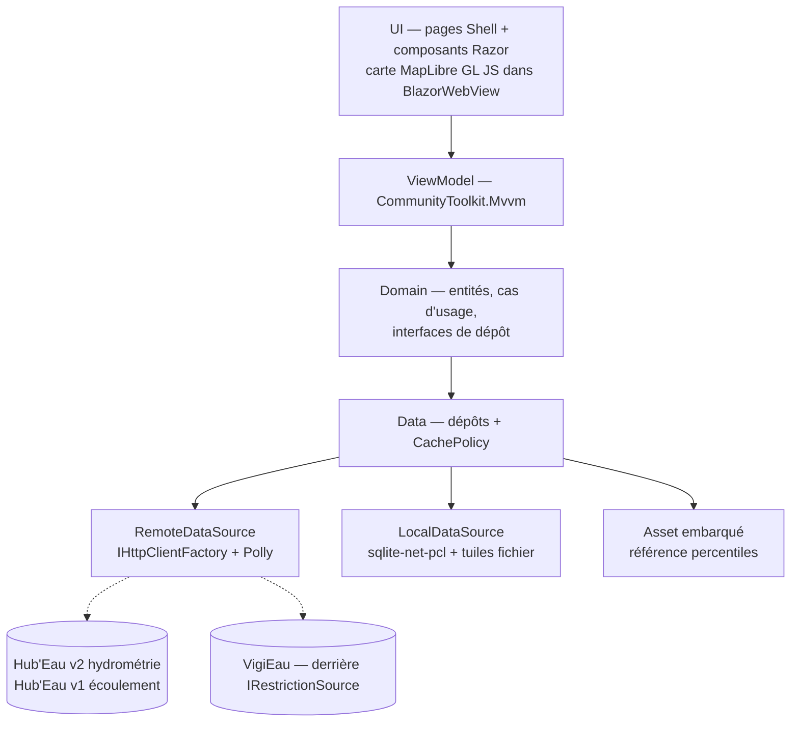

# 03 — Conception

**Cible** : .NET 9/10, .NET MAUI, **iOS et Android uniquement** en v1. Solution `MartinPecheur.sln` existante.

## 1. Stack

### 1.1 Le contrôle standard est éliminé d'emblée

`Microsoft.Maui.Controls.Maps` ne permet **ni clustering, ni source de tuiles personnalisée (WMTS/XYZ), ni cache hors-ligne, ni marqueurs réellement personnalisés**. L'écran principal du produit est une carte de plusieurs milliers de points sur fond IGN, utilisable hors ligne : le contrôle standard ne couvre aucune de ces trois exigences.

### 1.2 Les deux options

| Critère | **A — MAUI natif** (XAML + CommunityToolkit.Mvvm) | **B — MAUI Blazor Hybrid** (Razor dans `BlazorWebView`) |
|---|---|---|
| Moteur carto | **Mapsui** (SkiaSharp + BruTile) | **MapLibre GL JS** dans le WebView |
| Clustering | À implémenter (agrégation par grille) — **du code à écrire** | Clustering natif de la source, **éprouvé** sur gros volumes |
| Tuiles WMTS/XYZ | Via BruTile, sources HTTP et fichier local | Natif dans la bibliothèque |
| Marqueurs riches | C#/Skia, contrôle total, plus de code | HTML/CSS/SVG, très flexible |
| Graphes | LiveChartsCore (SkiaSharp) | Chart.js via interop |
| Risque | Bibliothèque peu répandue en MAUI, communauté restreinte | Pont JS-interop, mémoire du WebView |

**Fond de carte** : IGN Géoplateforme WMTS (Licence Ouverte, cohérent avec des données françaises), OSM en repli (ODbL, self-hosting recommandé à l'échelle). Google/Apple Maps écartés : incompatibles avec les tuiles personnalisées et le hors-ligne.
**Stockage** : `sqlite-net-pcl` (micro-ORM suffisant pour ce modèle) ; tuiles en fichiers dans `FileSystem.CacheDirectory`, hors base.

### 1.3 Choix — [`ADR-005`](adr/ADR-005-stack-maui-blazor-hybrid.md)

**Option B, MAUI Blazor Hybrid + MapLibre GL JS.** Le point le plus risqué du projet est la carte, et B apporte un clustering et une gestion de tuiles **éprouvés** là où A demande de les construire. La logique métier, l'état et l'accès aux données restent en C# partagé : seul le rendu cartographique passe par le WebView. Le coût accepté est le pont d'interopérabilité et l'empreinte mémoire du WebView. **Un spike de 2 à 3 jours doit valider la fluidité du clustering et la mémoire sur un Android d'entrée de gamme avant d'engager le choix.**

> **Risque assumé, à ne pas masquer** : l'écosystème cartographique .NET mobile est objectivement moins mature que celui de Flutter ou React Native pour ce cas d'usage. Il n'existe pas d'équivalent .NET du couple MapLibre GL Native + clustering natif. C'est le prix de la contrainte .NET, et il se paie surtout sur le hors-ligne (§ 4.3).

## 2. Architecture

Couches : **UI** (composants Razor + pages Shell) → **ViewModel** (`ObservableObject`, `RelayCommand`) → **Domain** (entités, cas d'usage, interfaces de dépôt — sans dépendance UI) → **Data** (dépôts, sources distantes et locales, mappers, politique de cache).

Injection dans `MauiProgram.cs` (`IServiceCollection`) : clients HTTP typés via `IHttpClientFactory`, dépôts, connexion SQLite, ViewModels. Navigation par **Shell**, routes paramétrées.

Modules : `Core/{Network,Cache,Data,Geo}` · `Features/{Map,StationDetail,Onde,Restrictions,Favorites,Settings}`.



**Isolation du risque VigiEau** : une seule interface `IRestrictionSource`, deux implémentations (API, puis export data.gouv en repli). Une rupture de l'API `0.1` n'impacte qu'une classe.

## 3. Modèle de données local

> Les trois échelles d'état sont **séparées**. Les fondre dans un champ unique (`normal/alerte/assec/crise`) mélangerait un fait observé, une statistique et une décision préfectorale — trois natures différentes, trois responsabilités différentes.

| Entité | Champs | Relations |
|---|---|---|
| `Departement` | `Code` (PK), `Nom`, `CodeRegion` | Asset embarqué, jamais rafraîchi |
| `Station` | `CodeStation` (PK, 10 car.), `LibelleStation`, `Latitude`, `Longitude`, `CodeDepartement` (idx), `LibelleCoursEau`, `EnService`, `DateMajReferentiel` | → `Departement` |
| `ObservationHydro` | `Id` (PK), `CodeStation` (idx), `DateObs`, `GrandeurHydro` (`H`\|`Q`), `ValeurM3S`, `ValeurM`, `CodeStatut`, `LibelleStatut`, `CodeQualification`, `LibelleQualification` | → `Station` |
| `SerieDebitJournaliere` | `Id` (PK), `CodeStation` (idx), `DateObs`, `ValeurM3S` | → `Station` — issue d'`obs_elab/QmnJ` |
| `NiveauDebitCalcule` | `CodeStation` (PK), `Classe` (`TresBas`…`TresHaut`\|`Indetermine`), `Percentile`, `DateCalcul`, `NbAnneesReference` | → `Station` — **échelle 2** |
| `ReferencePercentile` | `CodeStation` + `Quinzaine` (PK composite), `P10`, `P25`, `P50`, `P75`, `P90`, `NbAnnees` | **Asset embarqué en lecture seule**, `DateGeneration` en métadonnée |
| `PointOnde` | `CodeStation` (PK), `LibelleStation`, `Latitude`, `Longitude`, `CodeDepartement` (idx), `LibelleCoursEau` | → `Departement` |
| `CampagneOnde` | `CodeCampagne` (PK), `DateCampagne`, `TypeCampagne` (minuscules) | — |
| `ObservationOnde` | `Id` (PK), `CodeStation` (idx), `CodeCampagne` (idx), `CodeEcoulement` (**string**), `LibelleEcoulement`, `Categorie` (`Normal`\|`Faible`\|`NonVisible`\|`Assec`\|`NonObserve`), `DateObservation` | → `PointOnde`, `CampagneOnde` — **échelle 1** |
| `ZoneRestriction` | `IdZone` (PK), `CodeDepartement` (idx), `Nom`, `TypeZone` (`SUP`\|`SOU`\|`AEP`), `NiveauGravite`, `DateDebut`, `DateFin`, `UrlArrete`, `UrlArreteCadre` | **échelle 3** — filtrée sur `SUP` pour l'usage rivière |
| `UsageRestreint` | `Id` (PK), `IdZone` (idx), `Nom`, `Thematique`, `Description`, `ConcerneParticulier`, `ConcerneExploitation`, `ConcerneCollectivite`, `ConcerneEntreprise` | → `ZoneRestriction` |
| `Favori` | `CodeEntite` (PK), `TypeEntite`, `DateAjout` | Polymorphe |
| `CacheMeta` | `CleCache` (PK), `TypeDonnee`, `DateRecuperation`, `TtlSecondes`, `TailleOctets` | Pilote la purge |
| `DerniereVueCarte` | `Id` (PK, unique), `BboxMinLat/Lon`, `BboxMaxLat/Lon`, `Zoom`, `DateSnapshot` | Ancre du hors-ligne |
| `TuilePack` | `Id` (PK), `BboxRef`, `ZoomMin`, `ZoomMax`, `CheminFichier`, `DateTelechargement` | Fichiers hors base |

## 4. Cache et rafraîchissement

### 4.1 Politique par type de donnée

| Donnée | TTL | Stratégie | Purge |
|---|---|---|---|
| Référentiel stations (6 454 lignes) | 30 j | Préchargement au 1er lancement, puis SWR | Remplacement en bloc |
| Référentiel points ONDE (3 548) | 30 j | Idem | Remplacement en bloc |
| `observations_tr` | **20 min** | Cache affiché immédiatement, rafraîchissement en tâche de fond si TTL dépassé **et** réseau disponible | Dernière valeur toujours conservée |
| `obs_elab` (courbe) | 12 h | À la demande à l'ouverture de la fiche | LRU par (station, fenêtre) |
| Campagnes ONDE | **30 j en saison (mai-sept), 90 j hors saison** | Vérification d'une nouvelle campagne au lancement | 2 dernières campagnes conservées |
| Zones de restriction | **6 h** | SWR + badge horodaté | Remplacement en bloc |
| `ReferencePercentile` | ∞ | Asset embarqué, jamais d'appel réseau | Remplacé à chaque release |
| Départements | ∞ | Asset embarqué | — |
| Tuiles | LRU, plafond **150 Mo** configurable | Pack local pour la bbox visitée | Auto au-delà du plafond, ou manuelle |

**Règle générale** : lecture du cache → rendu immédiat → si TTL dépassé et réseau disponible, rafraîchissement en tâche de fond → sinon, badge « données du JJ/MM à HH:MM ». Au-delà de **2 × TTL**, le marqueur est atténué (`BR-005`).

### 4.2 Implémentation .NET

- `HttpClient` nommé par source via `IHttpClientFactory`, pipeline **Polly** (`AddPolicyHandler`) : retry, backoff exponentiel avec gigue, sur 429, 5xx et erreurs transitoires.
- **`HttpClient` ne traite pas 206 comme un succès par défaut** : un `DelegatingHandler` normalise 200 et 206 (`C-06`).
- `Connectivity.Current.NetworkAccess` vérifié avant toute tentative réseau.
- Throttle client global (jeton de concurrence) : Hub'Eau n'annonce aucun quota, et l'app n'a pas de proxy pour mutualiser la charge de sa base installée.
- Le calcul de `NiveauDebitCalcule` s'exécute via `Task.Run`, hors thread UI.
- Conversion l/s → m³/s dans le mapper uniquement, couverte par test unitaire (`BR-002`).

### 4.3 Hors-ligne « dernière carte consultée »

1. À chaque stabilisation de la carte, `DerniereVueCarte` est mise à jour (bbox + zoom).
2. Les `Station` et `PointOnde` de cette bbox, avec leur dernière observation connue, sont déjà en base : aucune duplication.
3. Un pack de tuiles est téléchargé pour la bbox ± marge, sur le zoom courant ± 2 niveaux.
4. Au lancement sans réseau : lecture de `DerniereVueCarte` → centrage → tuiles locales servies au WebView via un gestionnaire de schéma personnalisé → marqueurs au dernier état connu → bandeau persistant « Mode hors-ligne — données du JJ/MM/AAAA à HH:MM ».

> **Point faible assumé.** Il n'existe côté .NET aucune fonction « télécharger cette région » clé en main. L'énumération des tuiles XYZ couvrant la bbox, leur téléchargement limité en débit et leur écriture locale sont **à développer spécifiquement**. À chiffrer comme un lot de développement, pas comme un réglage. C'est la conséquence directe de [`ADR-005`](adr/ADR-005-stack-maui-blazor-hybrid.md).

## 5. Arborescence des écrans

```
AppShell
├── Avertissement initial (modal bloquant, hors Shell, acquittement requis)
├── Carte ......................... écran d'accueil
│   ├── Recherche (station / cours d'eau)
│   ├── Filtres (feuille) : type · état · département · fraîcheur
│   ├── Légende de l'échelle active
│   ├── Bandeau d'avertissement permanent
│   └── Résumé au tap (feuille) → fiche
├── Fiche station hydrométrique .... route paramétrée par CodeStation
│   ├── Débit (m³/s) + date + statut de qualification
│   ├── Niveau relatif à l'historique + limites
│   ├── Courbe 7 / 30 / 90 j
│   └── Actions : favori, télécharger la zone, partager
├── Fiche point ONDE ............... route paramétrée par CodeStation
│   ├── Catégorie + modalité officielle + date de campagne
│   ├── Historique des campagnes
│   └── Avertissement renforcé
├── Sécheresse et restrictions ..... avertissement renforcé en tête
│   ├── Zone géolocalisée + niveau de gravité
│   ├── Usages restreints (filtrables par profil)
│   └── PDF de l'arrêté + arrêté-cadre
├── Favoris
├── D'où vient cette donnée ? ...... limites L-01 à L-06, glossaire
└── Réglages
    ├── Cache et zones hors-ligne
    └── À propos — sources, licences, date de génération de l'asset
```

## 6. Points de vigilance

| Sujet | Vigilance |
|---|---|
| Pagination | Curseur sur `observations_tr` et `obs_elab` ; `page`+`size` ailleurs, avec `page × size ≤ 20 000`. Segmenter par département, jamais de dump national |
| `obs_elab` | Aucun `sort` : toujours passer `date_debut_obs_elab`, sinon la réponse commence en 1900 |
| Codes station | Interroger des codes à 10 caractères, jamais des codes site — sinon doublons |
| Volume de marqueurs | Clustering obligatoire dès le zoom départemental ; chargement par viewport avec anti-rebond de 300–500 ms |
| Batterie et GPS | Géolocalisation ponctuelle uniquement, précision approximative, aucun suivi continu ni tâche de fond |
| WebView | Mémoire et temps de démarrage à mesurer sur Android d'entrée de gamme, dans le spike |
| Référentiel | Filtrer `EnService = false` et les coordonnées absentes avant affichage |
| Asset percentiles | Le script de build est un livrable versionné, avec sa procédure de régénération documentée |
