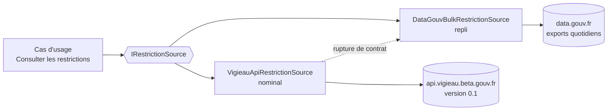

# ADR-004 — Intégrer VigiEau derrière une abstraction

- **Statut :** Accepté · *tranché par défaut, sans arbitrage du commanditaire*
- **Date :** 2026-07-30

## Contexte

Les personas agriculteur/irrigant et élu ont besoin de savoir **ce qui est restreint**. Aucune API Hub'Eau ne porte cette information.

Vérifications du 2026-07-30 sur `https://api.vigieau.beta.gouv.fr/api` :

| Point | Constat |
|---|---|
| Swagger | `swagger-json` → HTTP 200, `title: "API VigiEau"`, **`version: 0.1`** |
| `/zones?lat=&lon=&profil=` | 200, renvoie `niveauGravite`, `type` (`SUP`/`SOU`/`AEP`), `arrete.cheminFichier` (PDF), et la liste des `usages[]` avec leur applicabilité par profil |
| `/departements` | 200, 101 départements avec `niveauGraviteSupMax` |
| `/arretes_restrictions` | Renvoie `[]` avec `departement=03`. **Sémantique du paramètre non élucidée** |
| CORS | `Access-Control-Allow-Origin: *` |
| Rate limit | `X-RateLimit-Limit: 300` présent ; **fenêtre non déterminée** |
| Auth | Aucune |
| Licence | Licence Ouverte 2.0 (jeu data.gouv associé) |
| Code | `github.com/MTES-MCT/vigieau-api`, dernier push 2026-07-25, actif, **sans fichier LICENSE** |

Deux forces s'opposent : c'est la **seule** source exploitable du volet sécheresse, et elle est en **version 0.x sur un domaine `beta.gouv.fr`**, donc susceptible de rompre sans préavis.

Propluvia, envisagé au cadrage, est **remplacé par VigiEau**. À ne pas implémenter.

## Décision

VigiEau est intégré en v1, **derrière une interface unique `IRestrictionSource`**, avec deux implémentations :

1. `VigieauApiRestrictionSource` — chemin nominal, requêtes par `lat`/`lon` ;
2. `DataGouvBulkRestrictionSource` — repli sur les exports quotidiens data.gouv (arrêtés CSV, zones GeoJSON/PMTiles), déclenché si la désérialisation échoue.

Contraintes d'appel : **toujours `lat`/`lon`, jamais `commune`** — `?commune=45210` renvoie **HTTP 409** quand la commune porte plusieurs zones. Filtrage sur `type = "SUP"` (eaux superficielles) pour la pertinence rivière.

## Conséquences

- ➕ Le besoin des personas P2 et P5 est couvert : niveau de gravité, usages restreints par profil, PDF de l'arrêté.
- ➕ Le risque de rupture est confiné à **une seule classe**.
- ➖ Dépendance à une API `0.x` sans SLA ni engagement de stabilité.
- ➖ Le repli data.gouv ne rend pas le même service : pas de réponse géolocalisée immédiate, pas de filtrage par profil d'usager. C'est un mode dégradé, pas un équivalent.
- ➖ Le niveau `vigilance` **n'a pas été observé** dans l'échantillon du 2026-07-30 (seuls `alerte`, `alerte_renforcee`, `crise`). Son existence est attendue mais **non vérifiée** : la nomenclature doit tolérer une valeur inconnue (`BR-011`).

## Alternatives écartées

- **Lien externe seul vers vigieau.gouv.fr** : aucune dépendance fragile, mais le volet sécheresse du produit disparaît — soit l'essentiel du besoin de P2 et P5.
- **Exports data.gouv uniquement** : plus stable et cartographiable hors ligne, mais perd la réponse géolocalisée immédiate et le filtrage par profil. Conservé comme repli, pas comme chemin nominal.

## Si la décision est revue

Si l'API rompt durablement, `DataGouvBulkRestrictionSource` devient le chemin nominal — aucun autre changement. Si le volet sécheresse est abandonné, les écrans Restrictions et l'échelle 3 de la carte disparaissent ; `UC-002` est supprimé ; `BR-004` (avertissement renforcé) reste applicable aux écrans de débit en période d'étiage.
