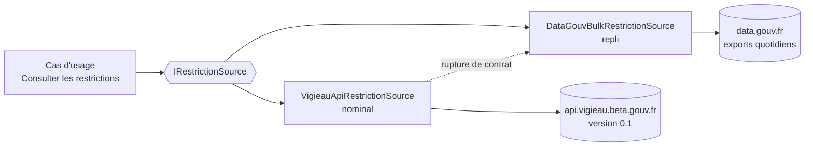
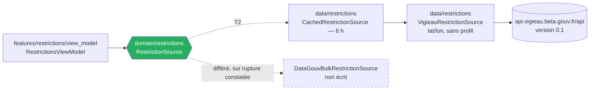

# ADR-004 — Intégrer VigiEau derrière une abstraction

- **Statut :** Accepté.
  - La décision d'origine du 2026-07-30 était *tranchée par défaut, sans arbitrage du commanditaire*.
  - **Amendée le 2026-09-27.** Sont **arbitrés par le commanditaire** ce jour-là :
    - **Q3** : chemin nominal confirmé, repli data.gouv différé ;
    - **Q5** : `SUP` d'abord, `SOU`/`AEP` signalés et nommés ([cadrage T2 § 6](../superpowers/specs/2026-09-27-cadrage-t2-design.md)) ;
    - l'**acceptation de l'amendement**, qui porte explicitement ses points 2 (appel unique sans `profil`) et 4 (confinement redéfini) ;
    - le « tout ou rien » d'une réponse illisible ;
    - le service daté d'une entrée de cache de plus de 6 h.
  - Les points **1, 3 et 5** de l'amendement (noms et emplacements Dart, échecs distinguables, transport HTTP partagé) sont des choix d'architecture **proposés**, non couverts par un arbitrage distinct : ils restent *tranchés par défaut*, révisables par un nouvel amendement (voir « Amendement du 2026-09-27 »).
- **Date :** 2026-07-30 · **amendé le 2026-09-27**
- **Faits en vigueur :** [`docs/sources/vigieau.md`](../sources/vigieau.md), capture réelle du 2026-09-27, 16 fixtures datées sous `test/fixtures/vigieau/`. Le tableau du contexte ci-dessous date du 2026-07-30 et se lit comme un **historique**.

## Contexte

Les personas agriculteur/irrigant et élu ont besoin de savoir **ce qui est restreint**. Aucune API Hub'Eau ne porte cette information.

Vérifications du 2026-07-30 sur `https://api.vigieau.beta.gouv.fr/api` :

| Point | Constat |
|---|---|
| Swagger | `swagger-json` → HTTP 200, `title: "API VigiEau"`, **`version: 0.1`** — ⚠️ *le 2026-09-27, `/api/swagger-json` répond `404` ; le schéma est servi à la racine, `https://api.vigieau.beta.gouv.fr/swagger-json`, toujours en `0.1` (`vigieau.md`, `VG-01`)* |
| `/zones?lat=&lon=&profil=` | 200, renvoie `niveauGravite`, `type` (`SUP`/`SOU`/`AEP`), `arrete.cheminFichier` (PDF), et la liste des `usages[]` avec leur applicabilité par profil |
| `/departements` | 200, 101 départements avec `niveauGraviteSupMax` |
| `/arretes_restrictions` | Renvoie `[]` avec `departement=03`. **Sémantique du paramètre non élucidée** — *identique le 2026-09-27* |
| CORS | `Access-Control-Allow-Origin: *` |
| Rate limit | `X-RateLimit-Limit: 300` présent ; **fenêtre non déterminée** — *`X-RateLimit-Reset: 1` vu le 2026-09-27, unité toujours non déterminée* |
| Auth | Aucune |
| Licence | Licence Ouverte 2.0 (jeu data.gouv associé) |
| Code | `github.com/MTES-MCT/vigieau-api`, dernier push 2026-07-25, actif, **sans fichier LICENSE** |

Deux forces s'opposent : c'est la **seule** source exploitable du volet sécheresse, et elle est en **version 0.x sur un domaine `beta.gouv.fr`**, donc susceptible de rompre sans préavis.

Propluvia, envisagé au cadrage, est **remplacé par VigiEau**. À ne pas implémenter.

## Décision

VigiEau est intégré en v1, **derrière une interface unique ~~`IRestrictionSource`~~ `RestrictionSource`** (Dart, déclarée sous `lib/domain/restrictions/` — amendement du 2026-09-27), ~~avec deux implémentations~~ **avec une implémentation en T2 et une seconde différée** (amendement du 2026-09-27, Q3) :

1. ~~`VigieauApiRestrictionSource`~~ **`VigieauRestrictionSource`** (`lib/data/restrictions/`) — chemin nominal, requêtes par `lat`/`lon` ;
2. ~~`DataGouvBulkRestrictionSource` — repli sur les exports quotidiens data.gouv (arrêtés CSV, zones GeoJSON/PMTiles), déclenché si la désérialisation échoue.~~ **Différé (Q3-B, arbitré le 2026-09-27)** : il ne s'écrit que sur une rupture **constatée**. D'ici là, une rupture donne un échec nommé et un lien vers le site public `https://vigieau.gouv.fr/` (vérifié le 2026-09-27, `vigieau.md`).

> Diagramme d'origine (2026-07-30), conservé pour l'historique. Le nœud « Cas d'usage » date de l'architecture CQRS, retirée par `ADR-014`, et le repli n'est plus câblé. La forme en vigueur est au § « Amendement du 2026-09-27 ».

```mermaid
flowchart LR
    UC[Cas d'usage<br/>Consulter les restrictions] --> I{{IRestrictionSource}}
    I --> A[VigieauApiRestrictionSource<br/>nominal]
    I --> B[DataGouvBulkRestrictionSource<br/>repli]
    A -.rupture de contrat.-> B
    A --> V[(api.vigieau.beta.gouv.fr<br/>version 0.1)]
    B --> D[(data.gouv.fr<br/>exports quotidiens)]
```

Contraintes d'appel : **toujours `lat`/`lon`, jamais `commune`** — `?commune=45210` renvoie **HTTP 409** quand la commune porte plusieurs zones (reconfirmé le 2026-09-27). ~~Filtrage sur `type = "SUP"` (eaux superficielles) pour la pertinence rivière.~~ **Toutes les zones du point sont gardées, `SUP` présentée en premier, `SOU` et `AEP` signalées et nommées** (Q5-B, arbitré le 2026-09-27).

## Conséquences

- ➕ Le besoin des personas P2 et P5 est couvert : niveau de gravité, usages restreints par profil, PDF de l'arrêté.
- ➕ Le risque de rupture est confiné à ~~**une seule classe**~~ **un seul module** : `lib/data/restrictions/`, où vivent l'implémentation, les URI et le mapper, derrière le contrat de `lib/domain/restrictions/` (amendement du 2026-09-27).
- ➖ Dépendance à une API `0.x` sans SLA ni engagement de stabilité.
- ➖ Le repli data.gouv ne rend pas le même service : pas de réponse géolocalisée immédiate, pas de filtrage par profil d'usager. C'est un mode dégradé, pas un équivalent. *Depuis le 2026-09-27, il n'est plus écrit du tout (Q3-B).*
- ➖ ~~Le niveau `vigilance` **n'a pas été observé** dans l'échantillon du 2026-07-30 (seuls `alerte`, `alerte_renforcee`, `crise`). Son existence est attendue mais **non vérifiée** : la nomenclature doit tolérer une valeur inconnue (`BR-011`).~~ **`vigilance` est observé le 2026-09-27** (Paris, et trois départements dans `/departements`, `VG-04`). La nomenclature reste tolérante à une valeur inconnue (`BR-011`) : c'est une API `0.1`.

## Alternatives écartées

- **Lien externe seul vers vigieau.gouv.fr** : aucune dépendance fragile, mais le volet sécheresse du produit disparaît — soit l'essentiel du besoin de P2 et P5.
- **Exports data.gouv uniquement** : plus stable et cartographiable hors ligne, mais perd la réponse géolocalisée immédiate et le filtrage par profil. Conservé comme repli, pas comme chemin nominal. *Le repli lui-même est différé depuis le 2026-09-27 (Q3-B).*

## Si la décision est revue

> Version du 2026-07-30, conservée : ~~Si l'API rompt durablement, `DataGouvBulkRestrictionSource` devient le chemin nominal — aucun autre changement. Si le volet sécheresse est abandonné, les écrans Restrictions et l'échelle 3 de la carte disparaissent ; `UC-002` est supprimé ; `BR-004` (avertissement renforcé) reste applicable aux écrans de débit en période d'étiage.~~

**Version en vigueur (2026-09-27) :**

- **Si l'API rompt** (réponse illisible, endpoint déplacé comme l'a été le Swagger, `4xx` durable) : l'écran affiche déjà la source nommée injoignable et un lien vers `https://vigieau.gouv.fr/`. **Aucune autre implémentation n'est à écrire dans l'urgence.** Si la rupture **dure**, on écrit `DataGouvBulkRestrictionSource` comme seconde implémentation de `RestrictionSource`, sur des exports **vérifiés par appel réel à ce moment-là** (`VG-13`, jamais vérifié). La tranche `features/restrictions/` ne change pas : seul `main.dart` câble l'autre implémentation. Le mode dégradé perd le filtrage par profil : il se signale.
- **Si le filtrage par profil côté domaine s'écarte du filtrage serveur** (test d'équivalence obligatoire de la spec du 2026-09-27, § 10) : on revient à un appel par profil. La valeur envoyée pour les collectivités est alors **`collectivite` sans accent**, puisque `collectivité`, la valeur du schéma, rend zéro usage sans erreur (`VG-05`). Seul `lib/data/restrictions/` change.
- **Si Q5 est revu** (retour à `SUP` seul) : seule la partition de `ZonesAtPoint` change, mais le risque d'omission silencieuse revient. `VG-11` : `SOU`/`AEP` présents aux **4 points sur 4** interrogés qui portent une zone — Ain, Corse, Paris, Ariège —, avec un niveau parfois plus sévère. À ne pas faire sans nouvel arbitrage.
- **Si le volet sécheresse est abandonné** : l'écran « Sécheresse et restrictions » disparaît, `UC-002` passe au statut « Remplacé » ou « Abandonné » (on ne supprime pas un artefact), et **`BR-013`** (avertissement renforcé) reste applicable à tout écran présentant la disponibilité de la ressource, y compris les écrans de débit en période d'étiage.

---

## Amendement du 2026-09-27

**Déclencheur :** ouverture de T2 (sécheresse et restrictions). Deux arbitrages du commanditaire (Q3, Q5), des faits recapturés par appel réel (`docs/sources/vigieau.md`), et le déplacement du contrat vers le domaine (point 35 de `project-state.md`). Conception détaillée : [`2026-09-27-modele-restrictions-t2-design.md`](../superpowers/specs/2026-09-27-modele-restrictions-t2-design.md).

### Ce qui est arbitré par le commanditaire (2026-09-27)

| # | Arbitrage | Effet sur cet ADR |
|---|---|---|
| Q3 | **B** — chemin nominal VigiEau et interface confirmés ; repli data.gouv **différé** | l'implémentation `DataGouvBulkRestrictionSource` n'est pas écrite en T2 ; une rupture donne un échec nommé et un lien vers le site public (dernière branche d'`UC-002`) |
| Q5 | **B** — `SUP` en premier ; les autres types présents au point sont signalés, nommés en clair, avec leur niveau et leur arrêté, **sous réserve de `VG-11`** | la réserve est levée : `VG-11` est confirmé aux **4 points sur 4** interrogés qui portent une zone (Ain, Corse et Paris : `SUP`, `SOU`, `AEP` ; Ariège : `AEP`, `SUP`). Le filtrage `type = "SUP"` de la décision d'origine est **remplacé** |
| AR-1 | **Amendement accepté** : appel unique `/zones?lat=&lon=` sans `profil`, filtrage dans le domaine par les booléens `concerne*`, confinement redéfini (points 2 et 4 ci-dessous) | la boucle principale a vérifié que, sur la fixture de l'Ain, les listes complètes sont égales pour les 4 profils sur les 3 zones. Ce n'est qu'un point : le test d'équivalence de la spec reste **obligatoire** |
| AR-2 | Réponse illisible en **tout ou rien** | un champ obligatoire manquant dans une seule zone rend toute la réponse illisible : échec nommé, aucune zone affichée |
| AR-3 | Une entrée de plus de 6 h est **servie, datée**, pendant le rafraîchissement | stale-while-revalidate commun de `CachePolicy`, sans nouveau mode |

### Les points de l'amendement

Les points 2 et 4 sont **arbitrés** (AR-1). Les points 1, 3 et 5 sont **proposés** : choix d'architecture de `harold`, acceptés avec l'amendement mais sans arbitrage distinct.

1. *Proposé.* **Noms et emplacements Dart.** Le contrat s'appelle `RestrictionSource` (et non `IRestrictionSource`, un reliquat .NET). Il est déclaré dans `lib/domain/restrictions/restriction_source.dart`, ce qui le déplace de `lib/data/restrictions/`. Sans ce déplacement, un ViewModel ne pourrait pas l'importer (règle `features-vers-data`). L'implémentation `VigieauRestrictionSource` et son décorateur de cache `CachedRestrictionSource` (6 h, Q7-A, par `withCachePolicy`) vivent sous `lib/data/restrictions/`.
2. *Arbitré (AR-1).* **Un seul appel par point, sans `profil`.** Les usages sont filtrés par profil dans le domaine, sur les booléens `concerne*` que la réponse porte déjà (`VG-05`, `VG-06`). Ce choix est gardé par un test d'équivalence obligatoire avec le filtrage serveur, sur les fixtures du 2026-09-27. Il évite par construction le piège `collectivité` accentué.
3. *Proposé.* **Échecs distinguables.** `RestrictionSource.zonesAt` lève un type fermé à trois branches (source injoignable, requête refusée, réponse illisible). « Aucune zone » (`200 []`, `VG-03`) n'en fait **pas** partie : c'est une réponse vide (`BR-007`).
4. *Arbitré (AR-1).* **Confinement redéfini.** Le verrou de `test/data/restrictions/restriction_source_test.dart` interdisait `vigieau|beta\.gouv|restriction` hors de `lib/data/restrictions/`. Il devient ceci :
   - le **vocabulaire technique de l'API** reste confiné à `lib/data/restrictions/` : hôte `beta.gouv`, noms de champs (`niveauGravite`, `cheminFichier`, `concerneParticulier`…) et valeurs filaires (`alerte_renforcee`…) ;
   - le mot **« restriction »** est libéré : c'est le vocabulaire du domaine (contexte `Restrictions`, `glossary.md`) ;
   - le nom affiché **« VigiEau »** et l'adresse du site public **`https://vigieau.gouv.fr/`** (sans `www`, qui ne se résout pas ; constaté le 2026-09-27 à 11:45 UTC, `vigieau.md`) sont admis dans `lib/domain/sources/source_names.dart`, et nulle part ailleurs hors du module. L'écran d'échec nomme sa source (`BR-007`), et le lien de repli doit rester disponible quand la source ne répond pas ;
   - **`lib/main.dart` est exempté** : racine de composition, il importe et nomme `VigieauRestrictionSource`, comme il est exempté de la règle `features-vers-data`.

   Le risque de rupture reste confiné à un module, ce que cet ADR voulait dès l'origine. Seul le vocabulaire **métier** en sort.
5. *Proposé.* **Transport HTTP partagé.** La boucle de rejeu de `HubEauClient` est extraite dans `lib/data/http/` et partagée, pour ne pas la recopier. `HubEauClient` garde son contrat.

```mermaid
flowchart LR
    VM["features/restrictions/view_model<br/>RestrictionsViewModel"] --> I{{"domain/restrictions<br/>RestrictionSource"}}
    I -.T2.-> C["data/restrictions<br/>CachedRestrictionSource — 6 h"]
    C --> A["data/restrictions<br/>VigieauRestrictionSource<br/>lat/lon, sans profil"]
    A --> V[("api.vigieau.beta.gouv.fr/api<br/>version 0.1")]
    I -.différé, sur rupture constatée.-> B["DataGouvBulkRestrictionSource<br/>non écrit"]
    style I fill:#27ae60,color:#fff
    style B stroke-dasharray: 5 5
```

### Faits reconfirmés, précisés ou contredits le 2026-09-27

Le détail et les fixtures sont dans [`docs/sources/vigieau.md`](../sources/vigieau.md). Les points qui touchent cette décision :

- Le Swagger a changé d'adresse (`/swagger-json` à la racine) ; la version reste `0.1`.
- `vigilance` est observé.
- Il y a plusieurs zones au même point (`SUP`, `SOU`, `AEP`), avec des niveaux et des usages propres ; leur ordre varie d'une réponse à l'autre.
- `code` peut être `null`.
- L'arrêté porte deux dates (`dateDebutValidite`, `dateFinValidite`).
- `cheminFichier` est une URL absolue.
- `profil=collectivité` accentué rend zéro usage, `collectivite` sans accent fonctionne.
- Aucune zone donne `200 []`.
- Coordonnées hors plage donnent `400`.
- Le site public répond à `https://vigieau.gouv.fr/` ; `www.vigieau.gouv.fr` ne se résout pas.

⚠️ `vigieau.md` dit « cinq points » pour `VG-11`, mais n'en nomme que quatre. Cet ADR retient **4 sur 4**.

### Correction de référence

« `BR-004` (avertissement renforcé) », dans l'ancienne section « Si la décision est revue », désignait en réalité **`BR-013`**. `BR-004` traite de l'historique insuffisant (`Indéterminé`). La référence est corrigée dans la version en vigueur de cette section.

### Documents qui citent encore la décision d'origine

Non modifiés par cet amendement, à aligner :
- `UC-002` : étape 2, `A2` et diagramme ;
- `BR-011` : dernier invariant, qui renvoie au repli ;
- `03-conception.md` : lignes 46 et 81 ;
- `context-map.md` : ligne 86.
