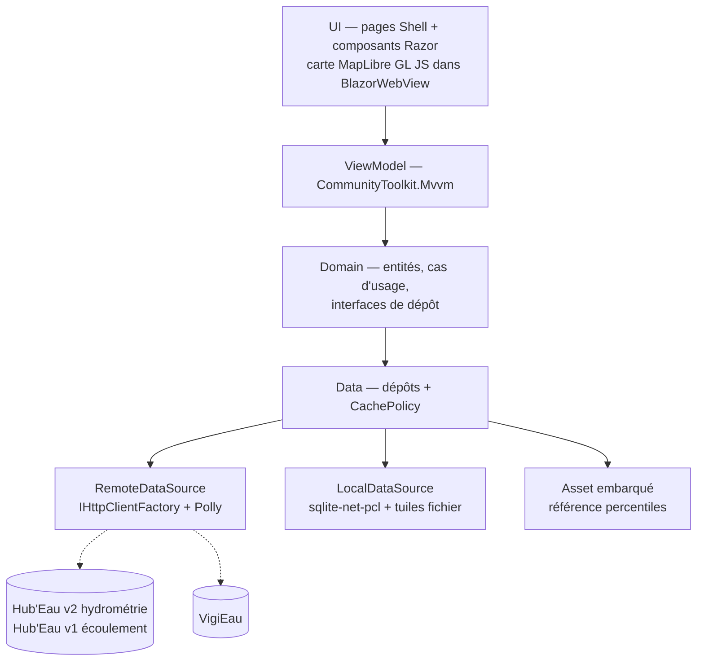

# ADR-005 — .NET MAUI Blazor Hybrid + MapLibre GL JS

- **Statut :** Proposé — **conditionné à un spike de validation** · *tranché par défaut, sans arbitrage du commanditaire*
- **Date :** 2026-07-30

## Contexte

Le dépôt est une solution Visual Studio (`MartinPecheur.sln`, vide au 2026-07-30). Le commanditaire a arbitré : **la stack reste dans l'écosystème .NET**. Cible : .NET 9/10, iOS et Android uniquement.

> **Mise à jour du 2026-07-30** — [`ADR-008`](ADR-008-cqrs-leger-et-cache-en-pipeline.md) fixe le runtime à **.NET 10** : `BrilliantMediator` 3.0.0 cible `net10.0`. Le reste de cette décision est inchangé.

> **Mise à jour du 2026-07-31** — [`ADR-009`](ADR-009-cible-windows.md) ajoute **Windows** aux cibles, sur demande du commanditaire. Le « iOS et Android uniquement » ci-dessus ne vaut plus. Le reste de cette décision — Blazor Hybrid, MapLibre GL JS, fond IGN — est inchangé, **y compris les seuils de recette du spike, qui restent mesurés sur un Android d'entrée de gamme**.

L'écran principal est une carte de **plusieurs milliers de marqueurs** (6 454 stations hydrométriques, dont 4 140 en service ; 3 548 points ONDE), sur fond IGN, **utilisable hors ligne**.

`Microsoft.Maui.Controls.Maps` ne permet **ni clustering, ni source de tuiles personnalisée (WMTS/XYZ), ni cache hors-ligne, ni marqueurs réellement personnalisés**. Il est éliminé d'emblée : il ne couvre aucune des trois exigences.

| Critère | **A — MAUI natif** (XAML + CommunityToolkit.Mvvm) | **B — MAUI Blazor Hybrid** (Razor dans `BlazorWebView`) |
|---|---|---|
| Moteur carto | Mapsui (SkiaSharp + BruTile) | MapLibre GL JS dans le WebView |
| Clustering | **À implémenter** (agrégation par grille) | **Natif à la source**, éprouvé sur gros volumes |
| Tuiles WMTS/XYZ | Via BruTile, HTTP et fichier local | Natif |
| Marqueurs riches | C#/Skia, contrôle total, plus de code | HTML/CSS/SVG |
| Graphes | LiveChartsCore | Chart.js via interop |
| Risque | Bibliothèque peu répandue en MAUI | Pont JS-interop, mémoire du WebView |

## Décision

**Option B : MAUI Blazor Hybrid + MapLibre GL JS.** Le rendu cartographique passe par le WebView ; la logique métier, l'état et l'accès aux données restent en **C# partagé**.

Fond de carte : **IGN Géoplateforme (WMTS, Licence Ouverte)**, OSM en repli (ODbL). Google et Apple Maps écartés — incompatibles avec les tuiles personnalisées et le hors-ligne.
Stockage : `sqlite-net-pcl` ; tuiles en fichiers dans `FileSystem.CacheDirectory`, hors base.

**Cette décision reste `Proposé` jusqu'à un spike de 2 à 3 jours** validant, sur un Android d'entrée de gamme : la fluidité du clustering au volume réel, l'empreinte mémoire du `BlazorWebView`, et le temps de démarrage à froid.

## Conséquences

- ➕ Le clustering et la gestion de tuiles sont **éprouvés** plutôt qu'à construire — sur le point le plus risqué du projet.
- ➕ Écosystème de rendu carto riche, sans quitter C# pour le métier.
- ➖ Pont JS-interop : latence, débogage plus difficile, contrat à maintenir entre C# et JS.
- ➖ Empreinte mémoire et temps de démarrage du WebView, particulièrement sur Android d'entrée de gamme.
- ➖ **Risque assumé et non masqué** : l'écosystème cartographique .NET mobile est objectivement moins mature que Flutter ou React Native pour ce cas d'usage. Il n'existe pas d'équivalent .NET du couple MapLibre GL Native + clustering natif. C'est le prix de la contrainte .NET, et il se paie surtout sur le hors-ligne.
- ➖ **Le téléchargement de tuiles hors-ligne est à développer spécifiquement.** Aucune fonction « télécharger cette région » clé en main n'existe côté .NET. À chiffrer comme un lot de développement, pas comme un réglage.

## Alternatives écartées

- **`Microsoft.Maui.Controls.Maps`** : ne couvre ni le clustering, ni les tuiles personnalisées, ni le hors-ligne. Éliminé d'emblée.
- **Option A, Mapsui** : viable, et sans pont JS. Mais le clustering et la gestion du pack de tuiles sont à écrire, sur le composant le plus critique et le plus visible du produit. Risque calendaire jugé supérieur.
- **Flutter / React Native** : meilleurs sur ce cas d'usage précis, mais **hors périmètre** — le commanditaire a arbitré .NET le 2026-07-30.

## Si la décision est revue

Si le spike invalide l'option B (mémoire ou fluidité insuffisantes), bascule sur l'**option A (Mapsui)** : le clustering devient un lot de développement, et l'arborescence d'écrans passe de composants Razor à des pages XAML. **Les couches Domain et Data sont inchangées** — c'est précisément pourquoi elles ne dépendent pas de l'UI.
