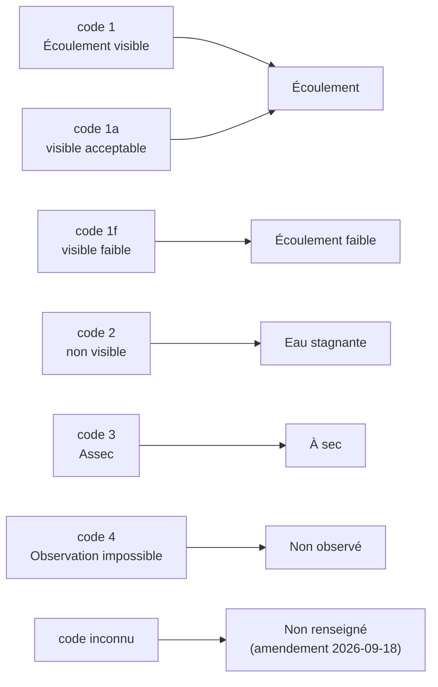

# ADR-006 — Afficher l'écoulement ONDE en 4 catégories

- **Statut :** Accepté · *tranché par défaut, sans arbitrage du commanditaire* — **sauf le
  traitement du code inconnu, arbitré par le commanditaire le 2026-09-18** (voir
  « [Amendement du 2026-09-18](#amendement-du-2026-09-18--le-code-inconnu-garde-son-propre-libellé) »).
  Le **reste** de cet ADR — le regroupement en quatre catégories, les libellés de carte, la
  palette — garde son statut : tranché par défaut, réversible, sans arbitrage.
- **Date :** 2026-07-30 · **amendé le 2026-09-18**

## Contexte

Le cadrage annonçait **3 modalités** ONDE. La lecture du référentiel et le comptage des observations réelles depuis le 2026-01-01 en montrent **six** :

| `code_ecoulement` | `libelle_ecoulement` | Occurrences depuis 2025-01-01 |
|---|---|---|
| `1` | Écoulement visible | 2 740 |
| `1a` | Écoulement visible acceptable | 17 523 |
| `1f` | Écoulement visible faible | 7 879 |
| `2` | Écoulement non visible | 2 176 |
| `3` | Assec | 4 815 |
| `4` | Observation impossible | 27 |

Les codes sont des **chaînes** (`"1a"`, `"1f"`), pas des entiers.

Six états à distinguer sur une carte, en extérieur, sans coder l'information par la seule couleur, est difficilement lisible. Les fondre en trois ferait disparaître **« écoulement visible faible »** — soit **7 879 observations, environ un quart du total**, et le principal signal précurseur d'assèchement.

Le champ `nombre_modalite_ecoulement` des campagnes vaut 4 ou 5 selon le protocole. Le mapping exact protocole ↔ modalités disponibles **n'est pas documenté** — non vérifié.

## Décision

**Quatre catégories d'affichage**, plus un état d'absence :

| Catégorie affichée | Codes source | Libellé carte |
|---|---|---|
| Écoulement | `1`, `1a` | Eau qui coule |
| Écoulement faible | `1f` | Écoulement faible |
| Non visible | `2` | Eau stagnante |
| À sec | `3` | À sec |
| *(absence)* Non observé | `4` | Non observé |

**La modalité officielle exacte reste affichée sur la fiche** (« code 3 — Assec »). Le regroupement sert la lisibilité de la carte ; il ne se substitue jamais à la source.

### Amendement du 2026-09-18 — le code inconnu garde son propre libellé

**Arbitrage du commanditaire du 2026-09-18.** Un code d'écoulement **inconnu de l'application**
(`Inconnu`) est annoncé **« Non renseigné »**, **sixième libellé de légende**, distinct de
**« Non observé »** (code `4`).

| Catégorie | Code source | Libellé | Nature |
|---|---|---|---|
| *(absence)* Non observé | `4` | **Non observé** | un **fait de terrain** : l'observation était impossible |
| *(absence)* Non renseigné | *aucun code, ou code non reconnu* | **Non renseigné** | **notre propre ignorance** d'un code |

**Motif — [`BR-007`](../br/BR-007-absence-de-donnee-jamais-neutre.md), « L'absence de donnée n'est
jamais un état neutre » :** un fait constaté et notre ignorance ne portent jamais le même mot.
C'est déjà ce que dit `lib/domain/nomenclature/flow_category.dart` de `NonObserve` : *« Un fait de
terrain (observation impossible), jamais confondu avec `Inconnu` qui est notre propre ignorance
d'un code (BR-007). »* — et ce que produit `flowCategoryLabel` :
`Inconnu() => 'Non renseigné'`.

**Le rendu visuel ne change pas** : « Non renseigné » garde **la teinte, la forme et le motif** de
« Non observé », tels que cet ADR et [`04-ui.md § 2`](../04-ui.md) les fixent. Ce qui se sépare est
le **mot**, pas le symbole — la carte reste lisible à quatre états plus une absence, la légende en
nomme six.

Cette déviation était signalée « à acter » dans le code depuis le 2026-09-14 ; elle est désormais
**arbitrée**. Le ➖ ci-dessous — *« Un code futur ajouté au référentiel tombera en "Non observé" »* —
se lit donc **« tombera en "Non renseigné" »**.

## Conséquences

- ➕ Le signal précurseur d'assèchement (`1f`) reste visible, distinct de l'écoulement franc.
- ➕ Quatre états restent distinguables par forme et motif, y compris en niveaux de gris.
- ➖ C'est une **interprétation de notre part**, pas une classification officielle de l'OFB. Elle doit être documentée dans « D'où vient cette donnée ? ».
- ➖ Un code futur ajouté au référentiel tombera en « Non observé » tant que le mapping n'est pas mis à jour (`BR-011`).

## Alternatives écartées

- **Les 6 modalités officielles** : fidélité totale, aucune interprétation. Mais six états à distinguer visuellement sur une carte, en plein soleil, au détriment de la lisibilité — qui est l'exigence première de l'écran principal.
- **3 catégories, comme au cadrage** : le plus simple à lire, mais fait disparaître `1f`, soit un quart des observations et le principal signal d'alerte précoce. Écarté comme une perte d'information métier.

## Si la décision est revue

Le mapping est une seule fonction de projection, dans la couche Domain. Passer à 3 ou 6 catégories n'impacte que cette fonction, la palette de `04-ui.md § 2` et les libellés de filtre. Le modèle de données conserve `CodeEcoulement` brut : **aucune information n'est perdue au stockage**, la projection est réversible.
