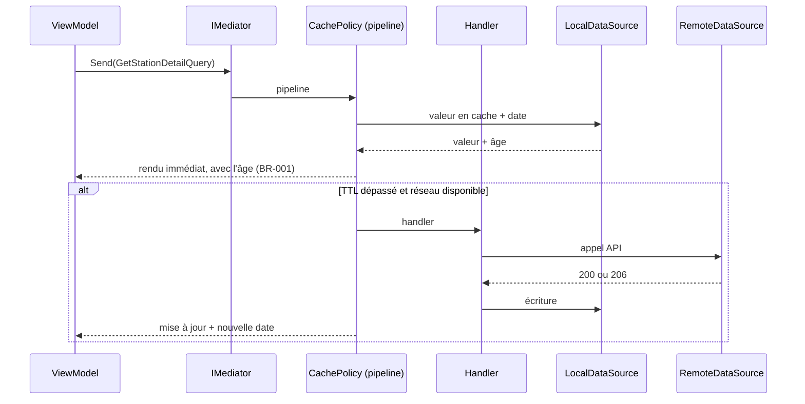

# ADR-008 — CQRS léger et politique de cache en pipeline

- **Statut :** **Remplacé par [`ADR-014`](ADR-014-feature-first-mvvm.md)** le 2026-09-13 — le **CQRS léger lui-même** est abandonné : plus de `Query`/`Command`, plus de registre de gestionnaires. Le projet passe à *feature-first* + **MVVM**. ⚠️ **Seul survivant : la politique de cache dans un composant unique**, qui devient un **décorateur de dépôt** sous `lib/data/`. Tout ce qui suit est conservé comme **trace historique**, pas comme consigne.
- **Statut précédent :** Remplacé par [`ADR-010`](ADR-010-react-native.md) le 2026-07-31 — le véhicule (`BrilliantMediator`, .NET 10, décorateur `IQueryHandler<,>`) disparaît avec la bascule React Native. ⚠️ **Le principe est repris tel quel** dans `ADR-010` : CQRS léger, et la politique de cache dans **un seul** composant. Le raisonnement ci-dessous reste sa justification.
- **Date :** 2026-07-30 · *réserve sur les behaviors levée le 2026-07-31 — décorateur retenu*
- **Corrige :** la position initiale « pas de CQRS » de [`03-conception.md § 2`](../03-conception.md), qui n'avait pas fait l'objet d'un ADR — c'est précisément pourquoi elle a pu passer sans être examinée
- **Complète :** [`ADR-005`](ADR-005-stack-maui-blazor-hybrid.md) sur le runtime — la cible passe de « .NET 9 ou 10 » à **.NET 10**

## Contexte

La conception initiale écartait CQRS au motif que l'application est en lecture seule sur des sources externes. Ce motif était **partiellement faux**.

**Il y a bien des écritures**, même si elles sont locales et sans appel réseau :

| Commande | Contexte borné |
|---|---|
| Ajouter / retirer un favori | Referentiel |
| Acquitter l'avertissement initial | Avertissement (`BR-012`) |
| Enregistrer `DerniereVueCarte` | Carte (`UC-005`) |
| Télécharger une zone hors-ligne | Carte |
| Purger le cache | Carte |

**Et surtout, la politique de cache doit vivre quelque part.** Le stale-while-revalidate décrit en [`03-conception.md § 4`](../03-conception.md) — lire le cache, rendre immédiatement, rafraîchir si le TTL est dépassé et le réseau disponible, marquer l'âge, atténuer au-delà de 2 × TTL (`BR-005`) — est une logique **transverse à toutes les lectures**. Sans point unique, elle se duplique dans chaque dépôt, ou pire, dans chaque ViewModel.

L'objection retenue contre un médiateur était le coût du **trimming et de l'AOT sur mobile**, et l'impact sur le démarrage à froid — précisément la métrique que le spike T0 doit mesurer.

**Vérification du 2026-07-30 sur NuGet :**

| Paquet | Version | Fait vérifié |
|---|---|---|
| `BrilliantMediator` | 3.0.0 (23/03/2026) | Décrit comme **« zero-reflection »**. Cible **`net10.0`**, compatible `net10.0-android` et `net10.0-ios`. Dépendance unique : `Microsoft.Extensions.DependencyInjection.Abstractions` |
| `BrilliantMediator.SourceGenerator` | 3.0.0 (23/03/2026) | **« Zero-reflection handler registration at compile time »**. Cible `netstandard2.0` |

L'objection AOT tombe donc largement : l'enregistrement des handlers est **généré à la compilation**, pas résolu par réflexion.

## Décision

**CQRS léger**, avec `BrilliantMediator` + son générateur de source, et **la politique de cache en pipeline**.

- Le ViewModel n'appelle **jamais** un dépôt. Il envoie une requête ou une commande.
- Les handlers portent l'orchestration ; les dépôts restent bêtes (aller chercher, ranger).
- **Un seul composant porte le stale-while-revalidate**, en amont des handlers de lecture.



**Conséquence sur le runtime** : `BrilliantMediator` 3.0.0 cible `net10.0`. Le projet est donc en **.NET 10**, plus « .NET 9 ou 10 ».

## Conséquences

- ➕ La politique de cache est à **un seul endroit**, testable isolément, au lieu d'être dispersée dans chaque dépôt et chaque ViewModel.
- ➕ Les écritures locales cessent d'être des cas particuliers glissés dans des dépôts de lecture.
- ➕ **Cohérence avec Kairior** : mêmes réflexes, même vocabulaire, moins de coût cognitif entre les deux projets.
- ➕ Le ViewModel ne connaît plus la couche Data — seulement des requêtes et des commandes.
- ➖ Une indirection de plus, pour six cas d'usage. C'est peu de matière pour l'outillage.
- ➖ Le runtime est contraint à **.NET 10**.
- ➖ Une dépendance supplémentaire dans une application qui n'en a presque aucune.

## Alternatives écartées

- **Aucun médiateur, dépôts appelés directement par le ViewModel** : le moins de cérémonie, mais la politique de cache se duplique sur chaque écran. C'était la position initiale ; elle ne tient pas dès qu'on regarde où vit le stale-while-revalidate.
- **`IQueryHandler<TQuery, TResult>` maison, résolu par DI** : 90 % du bénéfice, zéro dépendance, zéro risque AOT — mais le pipeline (behaviors) est alors à écrire soi-même, et l'on perd la cohérence avec Kairior. **C'est le repli si la réserve ci-dessous n'est pas levée.**
- **MediatR** : réflexion au runtime, mauvais candidat sur mobile trimmé.
- **CQRS complet avec modèles de lecture et d'écriture séparés** : sans objet. Il n'y a pas deux modèles ici, et aucun event sourcing (voir [`context-map.md`](../context-map.md)).

## Réserve levée le 2026-07-31 — pas de behaviors, décorateur retenu

**Vérifié sur le dépôt source** [`github.com/Monbsoft/BrilliantMediator`](https://github.com/Monbsoft/BrilliantMediator) (branche `dev`, README et arborescence complète) : **BrilliantMediator 3.x n'expose aucun mécanisme d'interception.** Ni `IPipelineBehavior`, ni middleware, ni pipeline. Aucun type `*Behavior*`, `*Middleware*` ou `*Pipeline*` dans le code.

API publique réelle, namespace `Monbsoft.BrilliantMediator.*` :

```
ICommand · ICommand<TResponse> · IQuery<TResponse> · IEvent
ICommandHandler<TCommand> · ICommandHandler<TCommand,TResponse>
IQueryHandler<TQuery,TResponse> · IEventHandler<TEvent>
IMediator — DispatchAsync, SendAsync, PublishAsync
```

Enregistrement, par builder fluide :

```csharp
services.AddBrilliantMediator()
        .AddGeneratedHandlers()   // générateur de source
        .Build();
serviceProvider.UseBrilliantMediator();
```

**Le repli prévu s'applique, sans réouvrir la décision de fond.** La politique de cache passe par un **décorateur de `IQueryHandler<,>`** enregistré en DI, et non par un behavior :

```
IQueryHandler<TQuery,TResult>
  └─ CachingQueryHandler<TQuery,TResult>   ← décorateur : SWR, âge, atténuation
       └─ handler concret
```

Le contrat, les handlers et les dépôts sont identiques. Seul le point d'accrochage change : un décorateur au lieu d'un behavior. Le décorateur reste **un seul composant**, ce qui satisfait l'objectif de la décision.

> `IEvent` et `IEventHandler` existent dans la bibliothèque : **ils ne sont pas utilisés.** Le produit n'a aucun événement de domaine (voir [`context-map.md`](../context-map.md)). Ne pas les introduire.

### Reste à vérifier au spike T0

| # | Point | Comment |
|---|---|---|
| 1 | Compatibilité **AOT et trimming** | « Zero-reflection » la rend probable, mais **elle n'est pas annoncée**. À constater par un build Release trimmé sur Android, pas à supposer |
| 2 | Impact sur le **démarrage à froid** | Mesure avec et sans médiateur, sur l'Android d'entrée de gamme du spike (`ADR-005`) |

## Si la décision est revue

Le contrat `IQuery`/`ICommand` est indépendant du médiateur retenu. Retirer `BrilliantMediator` revient à remplacer l'enregistrement dans `MauiProgram.cs` et l'appel `Send` par une résolution DI directe. **Les handlers, les dépôts et le Domain ne bougent pas** — c'est la raison d'être de cette forme légère.

## Liens

- Décisions liées : [`ADR-005`](ADR-005-stack-maui-blazor-hybrid.md) (stack), [`ADR-003`](ADR-003-reference-percentiles-en-asset.md) (asset en lecture seule, hors pipeline)
- Règles portées par le pipeline : [`BR-001`](../br/BR-001-date-de-mesure-obligatoire.md), [`BR-005`](../br/BR-005-donnee-perimee-signalee.md)
- Conception : [`03-conception.md § 4`](../03-conception.md)

**Sources vérifiées le 2026-07-30 :**
[BrilliantMediator sur NuGet](https://www.nuget.org/packages/BrilliantMediator) ·
[BrilliantMediator.SourceGenerator sur NuGet](https://www.nuget.org/packages/BrilliantMediator.SourceGenerator)
