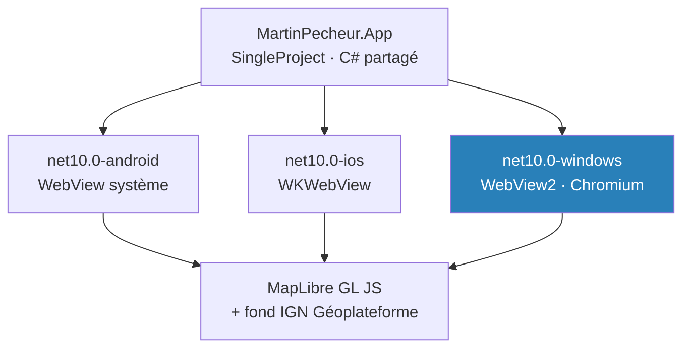

# ADR-009 — Ajouter Windows aux cibles de la v1

- **Statut :** **Remplacé par [`ADR-010`](ADR-010-react-native.md)** le 2026-07-31 — **Windows est abandonné le jour même de son ajout**, la bascule sur React Native ne couvrant qu'Android et iOS. Décision conservée pour l'historique : elle documente pourquoi Windows a été demandé, et ce que son abandon coûte.
- **Date :** 2026-07-31
- **Modifie :** [`ADR-005`](ADR-005-stack-maui-blazor-hybrid.md), dont le contexte fixait « iOS et Android uniquement ». Le reste d'`ADR-005` — Blazor Hybrid, MapLibre GL JS, fond IGN — est inchangé.

## Contexte

`ADR-005` énonçait, au titre d'un arbitrage du commanditaire du 2026-07-30 : *« Cible : .NET 9/10, iOS et Android uniquement. »* Le même périmètre était repris dans [`03-conception.md`](../03-conception.md) et dans `CLAUDE.md`.

**Le commanditaire a demandé l'ajout d'une application Windows le 2026-07-31.** Cette décision révise donc un arbitrage antérieur du commanditaire : elle n'est pas tranchée par défaut.

MAUI produit les trois cibles depuis le même projet `SingleProject`. Sur Windows, l'hôte du `BlazorWebView` est **WebView2 (Chromium)**, là où Android utilise le WebView système et iOS `WKWebView`. MapLibre GL JS, retenu par `ADR-005`, s'exécute sur les trois.

**Constats de build du 2026-07-31**, sur le poste de développement (Windows 11, SDK .NET 10.0.302, charges de travail `android` 36.1.43, `ios` 26.5.10284, `maui-windows` 10.0.20) :

| Cible | Build Release | Artefact produit |
|---|---|---|
| `net10.0-android` | ✅ **0 avertissement, 0 erreur** (8 min 13 s) | `fr.martinpecheur.app-Signed.apk` |
| `net10.0-windows10.0.19041.0` | ✅ **0 avertissement, 0 erreur** (1 min 29 s) | `MartinPecheur.App.exe` (`win-x64`) |
| `net10.0-ios` | ✅ **0 avertissement, 0 erreur** (38 s) | `MartinPecheur.App.dll` **seulement** |

> ⚠️ **La cible iOS n'est que partiellement vérifiée.** Le build sur Windows produit l'assembly managée, **pas de bundle `.app`** : l'AOT, l'édition de liens native et la signature exigent un hôte macOS. Le vert iOS ci-dessus atteste la compilation, **pas la production d'un paquet installable**. À lever sur un Mac, pas à supposer.

## Décision

**Les cibles de la v1 sont Android, iOS et Windows.** macOS et Mac Catalyst restent hors périmètre.

- `TargetFrameworks` = `net10.0-android;net10.0-ios`, plus `net10.0-windows10.0.19041.0` **sous condition `IsOSPlatform('windows')`** — sans quoi un build sur macOS ou Linux échouerait.
- `WindowsPackageType` = `None` : application **non empaquetée**, pas de dépendance au Microsoft Store.
- Le dossier `Platforms/MacCatalyst` généré par le gabarit est **supprimé**.
- Version minimale Windows : `10.0.17763.0`.

## Conséquences

- ➕ **Le spike carte (`ADR-005`) devient bien moins coûteux à itérer.** WebView2 se débogue avec les outils Chromium, sur le poste, sans cycle de déploiement mobile.
- ➕ Un poste de développement Windows suffit pour voir tourner la carte. Le socle Domain/Data était déjà indépendant de l'UI ; l'écran l'est maintenant aussi.
- ➖ **Les seuils de recette d'`ADR-005` restent inchangés et restent mesurés sur un Android d'entrée de gamme réel.** Un vert sur WebView2 ne préjuge de rien : c'est le moteur le plus favorable des trois. Mesurer sur Windows et en conclure quoi que ce soit sur Android serait une faute de méthode.
- ➖ **La spec d'UI est écrite pour le mobile.** Les wireframes de [`04-ui.md`](../04-ui.md) supposent un écran étroit et le tactile. Le portage Windows demande un lot de responsive et un traitement clavier/souris — à chiffrer, pas à supposer acquis.
- ➖ Trois moteurs de WebView à supporter au lieu de deux, donc trois comportements possibles sur le rendu carto.
- ➖ La géolocalisation est moins précise et plus souvent refusée sur poste fixe. [`UC-001`](../use-cases/UC-001-consulter-la-carte-autour-de-moi.md) doit conserver un chemin alternatif sans position — il en a déjà un.
- ➖ Le hors-ligne (`UC-005`) garde tout son sens sur Windows, mais `FileSystem.CacheDirectory` y a une sémantique différente d'un cache mobile purgeable par l'OS.

**Sans changement :** les quatre avertissements (`BR-012`, `BR-013`) s'appliquent à Windows exactement comme au mobile. Rien ne part en production sans eux, sur aucune cible.

## Alternatives écartées

- **Rester sur iOS + Android, et livrer Windows en v2** : c'était le périmètre d'`ADR-005`. Écarté sur demande explicite du commanditaire.
- **Ajouter aussi macOS / Mac Catalyst, tant qu'à ouvrir le bureau** : aucune demande, et le poste de développement ne permet pas de le vérifier. Ajouter une cible qu'on ne peut pas construire reviendrait à afficher un support non vérifié.
- **Un projet Windows distinct (WinUI 3) plutôt qu'une cible MAUI** : dupliquerait l'UI sans bénéfice, alors que `SingleProject` livre la cible sans code supplémentaire.

## Si la décision est revue

Retirer Windows revient à supprimer une ligne `TargetFrameworks` conditionnelle, la propriété `WindowsPackageType` et le dossier `Platforms/Windows`. **Rien d'autre ne bouge** : ni le Domain, ni la couche Data, ni les composants Razor. C'est la propriété du `SingleProject` — la cible est additive.

## Liens

- Décisions liées : [`ADR-005`](ADR-005-stack-maui-blazor-hybrid.md) (stack et spike), [`ADR-008`](ADR-008-cqrs-leger-et-cache-en-pipeline.md) (runtime .NET 10)
- Spec impactée : [`04-ui.md`](../04-ui.md) — wireframes mobile, lot responsive à chiffrer
- Tâche d'origine : `A1` du plan [`T0`](../superpowers/plans/2026-07-30-t0-spike-carte-et-socle.md)
