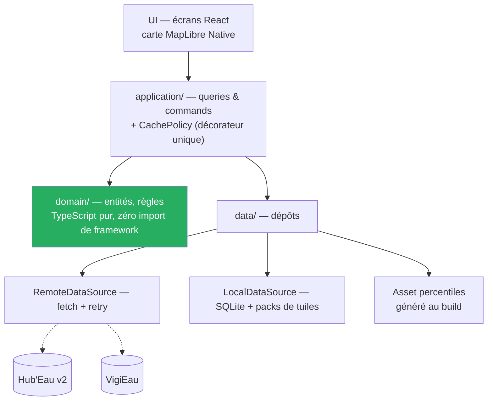

# ADR-010 — React Native, abandon de MAUI et de la cible Windows

- **Statut :** Accepté — **arbitrage du commanditaire du 2026-07-31** · ⚠️ **volet architecture applicative remplacé par [`ADR-014`](ADR-014-feature-first-mvvm.md)** le 2026-09-13 : le § « L'architecture en couches est conservée » ci-dessous, avec son `application/` et ses `Query`/`Command`, ne fait plus foi — le projet est en *feature-first* + **MVVM**, et le cache est un décorateur de dépôt. Le reste de cette décision est **également caduc** quant à la stack, arbitrée à nouveau le 2026-09-12 (bascule Flutter, cible Windows) ; il est conservé comme trace historique.
- **Date :** 2026-07-31
- **Remplace :** [`ADR-005`](ADR-005-stack-maui-blazor-hybrid.md) (MAUI Blazor Hybrid), [`ADR-008`](ADR-008-cqrs-leger-et-cache-en-pipeline.md) (CQRS léger porté par `BrilliantMediator`), [`ADR-009`](ADR-009-cible-windows.md) (cible Windows)

## Contexte

Le 2026-07-30, le commanditaire avait arbitré que **la stack reste dans l'écosystème .NET**. `ADR-005` en a tiré MAUI Blazor Hybrid, tout en actant noir sur blanc le coût de cette contrainte :

> *« L'écosystème cartographique .NET mobile est objectivement moins mature que Flutter ou React Native pour ce cas d'usage. Il n'existe pas d'équivalent .NET du couple MapLibre GL Native + clustering natif. C'est le prix de la contrainte .NET, et il se paie surtout sur le hors-ligne. »*

C'est pourquoi `ADR-005` est resté `Proposé`, conditionné à un spike. Le 2026-07-31, le commanditaire a d'abord **ajouté Windows** (`ADR-009`), puis, au vu de la comparaison des deux écosystèmes, **révisé l'arbitrage .NET** : abandon de Windows et passage à React Native.

**Vérifications du 2026-07-31**, faites avant d'acter :

| Fait | Source | Constat |
|---|---|---|
| Packs hors-ligne en API native | [`OfflineManager`](https://maplibre.org/maplibre-react-native/docs/modules/offline-manager/) | ✅ `createPack` télécharge les ressources d'une région pour un usage hors réseau ; options de **région et de niveaux de zoom**. Téléchargement asynchrone, suivi par callbacks de progression |
| Rupture d'API récente | [Release v11.0.0](https://github.com/maplibre/maplibre-react-native/releases/tag/v11.0.0) | ⚠️ En v11+, les packs sont identifiés par **id auto-généré** et non plus par nom ; `subscribe`/`unsubscribe` deviennent `addListener`/`removeListener`. Cibler la v11+ d'emblée |
| Plateformes | [dépôt GitHub](https://github.com/maplibre/maplibre-react-native) | ✅ **Android et iOS uniquement.** Pas de Windows — cohérent avec l'abandon de cette cible |
| Compatibilité Expo | idem | ✅ Annoncée : *« in Expo and React Native »* |

**Le point décisif est là.** `ADR-005` annonçait le téléchargement de tuiles hors-ligne comme un **lot de développement à chiffrer**, faute de fonction clé en main côté .NET. En React Native, c'est une **API fournie**. Or le hors-ligne est un `Must` du produit ([`UC-005`](../use-cases/UC-005-consulter-la-carte-hors-ligne.md), `US-10`).

## Décision

**React Native + TypeScript**, carte par **MapLibre Native** via `@maplibre/maplibre-react-native` (v11+). Cibles **Android et iOS**. **Windows est abandonné.**

| Composant | Retenu | Remplace |
|---|---|---|
| Langage | **TypeScript**, `strict` | C# |
| Runtime | React Native | .NET 10 / MAUI |
| Carte | `@maplibre/maplibre-react-native` — **MapLibre Native**, rendu GPU | MapLibre GL **JS** dans un `BlazorWebView` |
| Hors-ligne carto | `OfflineManager.createPack` | lot à développer |
| Fond de carte | **IGN Géoplateforme (WMTS)**, OSM en repli | *inchangé* |
| État / vues | Composants React | XAML + `CommunityToolkit.Mvvm` |

**Sous-décision, tranchée par défaut :** **Expo avec *development builds*** plutôt que React Native nu. `maplibre-react-native` requiert du code natif, donc Expo Go ne suffit pas, mais les *dev builds* et EAS couvrent le besoin sans imposer `eject`. À revoir si la chaîne de build native devient contraignante.

### L'architecture en couches est conservée

`ADR-008` disparaît **en tant que véhicule**, pas en tant que principe. Le CQRS léger et la politique de cache unique survivent, réécrits en TypeScript sans bibliothèque de médiateur :

**Les invariants ne changent pas :** le `domain/` ne dépend de rien, la vue n'appelle jamais un dépôt, la politique de cache vit dans **un seul** composant, la conversion d'unités se fait une seule fois dans le mapper.

## Conséquences

- ➕ **Le hors-ligne cartographique cesse d'être un risque** : API fournie au lieu d'un lot à chiffrer.
- ➕ **Le rendu carto est natif et accéléré**, plus un WebView à nourrir. Le risque que le spike T0 devait lever — fluidité et mémoire sur Android d'entrée de gamme — descend nettement.
- ➕ Clustering et sources de tuiles personnalisées sont des cas d'usage courants de l'écosystème, pas des contournements.
- ➖ **Le code écrit est jeté** : `A1` (projet MAUI, 3 cibles vertes), `B1` (Domain/Application/Data) et `B3a` (`MeasurementUnits`, 8 tests verts). Deux commits, `696be3a` et `22e9850`.
- ➖ **Windows est perdu**, un jour après avoir été demandé et livré.
- ➖ **TypeScript est structurellement plus faible que C# sur les invariants dont ce produit dépend** : `BR-011` (toute nomenclature tolère l'inconnu) et `BR-002` (unités) reposaient sur l'exhaustivité au compilateur. Parade obligatoire : `strict`, types *branded* pour les unités (`type M3S = number & {__brand}`), et `switch` exhaustifs gardés par `never`. **Ce n'est pas automatique — c'est une discipline à tenir.**
- ➖ La v11 a changé son API hors-ligne récemment : signal d'un composant encore en mouvement.
- ➖ Perte de l'aisance .NET si c'est l'écosystème habituel de l'équipe.

**Ce qui n'est pas affecté** — et c'est l'essentiel du travail fait : les 4 documents de cadrage, les **14 règles métier**, les **6 cas d'usage**, l'analyse des APIs et ses **17 contraintes vérifiées**, et les ADR `001`, `002`, `003`, `004`, `006`, `007`. Le produit ne change pas ; seul son véhicule change.

## Alternatives écartées

- **Rester sur MAUI Blazor Hybrid et faire le spike** : c'était ma recommandation, au motif que Windows venait d'entrer au périmètre et que le repli Mapsui restait en .NET. Écarté par arbitrage du commanditaire.
- **Flutter** : au moins aussi bon que React Native sur la carte, mais aucune demande en ce sens.
- **Garder Windows via React Native Windows** : support en retrait, et la carto Windows n'est pas couverte par `maplibre-react-native`. Ajouter une cible non supportée par le composant central serait afficher un support qu'on ne peut pas tenir.

## Points à vérifier avant de coder

Aucun n'est bloquant, tous sont à constater et non à supposer :

| # | Point | État au 2026-08-15 |
|---|---|---|
| 1 | Bibliothèque SQLite retenue (`expo-sqlite` ou `op-sqlite`) et son comportement en volume | 🔄 à trancher (`ADR-011`, tâche `S5`) |
| 2 | Consommation d'un **WMTS IGN** comme source raster MapLibre, et son interaction avec `createPack` | ⚠️ **Moitié constatée.** Le WMTS IGN s'affiche (`M2`, 2026-08-15). L'interaction avec `createPack` **ne peut pas être constatée** : l'appel plante |
| 3 | Poids réel d'un pack hors-ligne pour une emprise départementale (`ADR-003` mesure déjà l'asset percentiles) | 🚨 **Non mesurable** — aucun octet n'a pu être relevé |
| 4 | Bibliothèque de graphes pour la courbe de débit (`US-11`) | 🔄 à trancher |
| 5 | Que `createPack` accepte bien une source raster WMTS et pas seulement des tuiles vectorielles | 🚨 **Ni confirmé, ni infirmé** — voir ci-dessous |

### 🚨 Le point 5 a été exécuté le 2026-08-15, et il met en défaut un appui de cet ADR

Cet ADR affirmait que le hors-ligne cartographique n'était plus un risque, `OfflineManager.createPack`
le fournissant. **Cet appui n'est pas vérifié.** Constaté sur émulateur Android API 36 avec
`@maplibre/maplibre-react-native@11.3.6` — la **dernière version publiée** :

`createPack` **tue le processus** environ 0,7 s après la création du pack, par un `SIGABRT` levé sur
une `std::regex_error` non rattrapée dans le fil `DatabaseFileSource`. **4 essais sur 4**, base
vierge comprise, et **avec le style vectoriel de démonstration de MapLibre** — le défaut n'est donc
ni l'IGN, ni le raster.

Le plantage survient **avant** qu'une seule tuile soit téléchargée : `NV-1` n'est ni confirmé ni
infirmé, et `NV-3`, `NV-4`, `NV-6` restent bloqués.

**Ce que cela ne remet pas en cause :** le choix de React Native. Le même `OfflineManager` sert le
monde natif comme le monde React Native — le défaut n'est pas dans le pont.

**Ce que cela remet en cause :** que le lot « téléchargement et stockage des tuiles » soit
réellement supprimé. Arbitrage soumis au commanditaire dans
[`ADR-012`](ADR-012-hors-ligne-cartographique-bloque.md).

## Si la décision est revue

Un retour à .NET implique de refaire l'intégralité du code applicatif — il n'y a pas de socle partagé entre les deux mondes. Les deux commits .NET restent dans l'historique git (`696be3a`, `22e9850`) et sont récupérables. **Le cadrage produit, lui, est indépendant de la stack et n'aurait pas à être refait.**

## Liens

- Remplace : [`ADR-005`](ADR-005-stack-maui-blazor-hybrid.md), [`ADR-008`](ADR-008-cqrs-leger-et-cache-en-pipeline.md), [`ADR-009`](ADR-009-cible-windows.md)
- Toujours en vigueur : [`ADR-001`](ADR-001-api-hydrometrie-v2.md), [`ADR-002`](ADR-002-qualification-du-debit.md), [`ADR-003`](ADR-003-reference-percentiles-en-asset.md), [`ADR-004`](ADR-004-integration-vigieau.md), [`ADR-006`](ADR-006-onde-quatre-categories.md), [`ADR-007`](ADR-007-ecarter-qualite-eau.md)
- Cas d'usage débloqué : [`UC-005`](../use-cases/UC-005-consulter-la-carte-hors-ligne.md)

**Sources vérifiées le 2026-07-31 :**
[OfflineManager](https://maplibre.org/maplibre-react-native/docs/modules/offline-manager/) ·
[maplibre-react-native](https://github.com/maplibre/maplibre-react-native) ·
[Release v11.0.0](https://github.com/maplibre/maplibre-react-native/releases/tag/v11.0.0)
