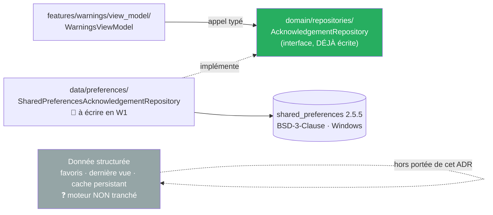

# ADR-011 — Stockage local : `shared_preferences` pour la préférence simple

- **Statut :** **Accepté — arbitrage du commanditaire du 2026-09-18**, **portée limitée**
- **Date :** 2026-09-18
- **Portée :** la **préférence simple** — une clé, une chaîne. Le **moteur de donnée structurée**
  (favoris, dernière vue, cache d'observations persistant) **n'est pas tranché par cet ADR** : il
  reste ouvert, `drift` candidat par défaut.
- **État du code :** 🔄 **décidé, pas encore codé.** Au 2026-09-18, `shared_preferences`
  **n'est pas** dans `pubspec.yaml` et **aucun fichier de `lib/` ne l'utilise** (constaté par
  lecture de `pubspec.yaml` et `grep` sur `lib/` et `test/`). L'ajout du paquet et
  l'implémentation sont la tâche `W1` du plan T1.

---

## Contexte

Le numéro `ADR-011` était **réservé** depuis T0 au choix d'un moteur de stockage local, à trancher
« quand un écran en aura besoin ». Cet écran arrive : `BR-012` exige un avertissement initial
acquitté, et `UC-006 A3` exige que l'avertissement soit **relu** quand son texte change. Il faut
donc persister une **version de texte acquittée** — une chaîne — d'un lancement à l'autre.

### Ce que le code demande, exactement

L'interface est **déjà déclarée**, dans `lib/domain/repositories/repositories.dart` (posée en `V4`
le 2026-09-14, lue le 2026-09-18) :

```dart
abstract interface class AcknowledgementRepository {
  Future<String?> readAcknowledgedVersion();
  Future<void> writeAcknowledgedVersion(String version);
}
```

Deux méthodes, une clé, une chaîne. `readAcknowledgedVersion` rend `null` quand rien n'a jamais été
écrit — le premier lancement. C'est tout ce que T1 persiste : **aucune collection, aucune requête,
aucun schéma, aucune migration.**

### Ce qui reste hors de portée

Les besoins de stockage **structuré** existent dans le cadrage mais **aucun écran ne les a encore
formulés** : favoris (T3), dernière vue de carte, cache d'observations survivant à la fermeture de
l'application. Trancher leur moteur aujourd'hui serait décider d'après un besoin que personne n'a
écrit.

### Les faits relevés sur le paquet, datés

> **Relevé par appel réel le 2026-09-18 à 09:00 UTC** sur
> `https://pub.dev/api/packages/shared_preferences` et les pages pub.dev correspondantes.
> `CLAUDE.md` l'exige avant toute dépendance : version, licence, plateformes — Windows incluse —,
> date de dernière publication.

| Fait | Valeur relevée le 2026-09-18 |
|---|---|
| Version | **2.5.5** |
| Date de publication | **2026-03-25** |
| Licence | **BSD-3-Clause** |
| Éditeur | **flutter.dev**, éditeur **vérifié** |
| Plateformes | Android, iOS, Linux, macOS, Web, **Windows** |
| Contrainte Dart | `^3.9.0` — le projet est en **Dart 3.13.3** : **satisfaite** |
| Contrainte Flutter | `>=3.35.0` — le projet est en **Flutter 3.47.4** : **satisfaite** |
| Implémentation Windows | **`shared_preferences_windows` 2.4.1**, publiée le **2024-08-09**, **BSD-3-Clause**, dépend de **`path_provider_windows`** (BSD-3-Clause) |

**Sur la licence :** BSD-3-Clause est une licence permissive, compatible avec une distribution sous
GPL-3.0. ⚠️ Ceci est une **connaissance générale**, pas un relevé daté — contrairement aux lignes
du tableau ci-dessus.

---

## Décision

**`shared_preferences` est retenu pour la préférence simple.** Aujourd'hui, **une seule clé** : la
version d'avertissement acquittée (`BR-012`, tâche `W1`).

**Le moteur de donnée structurée reste à trancher** — favoris, dernière vue, cache d'observations
persistant. Il sera tranché **quand un écran en aura besoin**, pas avant. `drift` reste le candidat
par défaut ; **`sqflite` seul ne couvre pas Windows**, ce qui le disqualifie sur la seule cible
construite.

### Ce que la décision fixe

- L'interface `AcknowledgementRepository` **vit dans `lib/domain/repositories/repositories.dart`**
  et n'y bouge pas. Elle est déjà écrite : `W1` la **réalise**, ne la redéclare pas.
- L'implémentation concrète va sous **`lib/data/preferences/`**. Aucun ViewModel, aucune vue ne
  connaît `shared_preferences` — l'invariant `features-vers-data` de
  `test/architecture/layers_test.dart` l'interdit, et `domain_isolation_test.dart` interdit au
  domaine de le connaître.
- On persiste une **chaîne de version, jamais un booléen.** Un booléen ne distinguerait jamais
  « acquitté une fois » de « acquitté **cette** version » ; c'est ce qui permet de faire relire un
  avertissement dont le texte a changé (`UC-006 A3`).
- Le dépôt reste **bête** : une valeur stockée inattendue — une chaîne vide, par exemple — est
  rendue telle quelle. C'est `WarningsViewModel` qui décide de son sens, jamais le dépôt.



---

## Conséquences

- ➕ **Une dépendance minuscule pour un besoin minuscule.** Une clé, une chaîne : aucun schéma,
  aucune migration, aucune requête à écrire ni à relire.
- ➕ **Windows est couverte par une implémentation publiée**, et l'éditeur est `flutter.dev` — pas
  un paquet tiers à surveiller.
- ➕ **Le moteur reste remplaçable sans toucher à un écran.** L'interface est dans le domaine :
  changer de moteur ne change qu'une classe de `lib/data/`.
- ➖ **Une deuxième décision de stockage viendra.** Le jour où un écran demande des favoris ou un
  cache persistant, il faudra trancher un moteur structuré — et le projet aura alors **deux**
  mécanismes de persistance. C'est assumé : un moteur de base pour une chaîne coûterait plus cher,
  tout de suite, que cette double appartenance plus tard.
- ➖ **Deux paquets transitifs entrent sur Windows** — `shared_preferences_windows` et
  `path_provider_windows` — dont le premier n'a pas été republié depuis le **2024-08-09**. Ce n'est
  pas une panne constatée, c'est un fait relevé.
- ➖ ⚠️ **Rien n'est constaté à l'exécution.** Au 2026-09-18, le paquet n'est pas lié, aucun test ne
  tourne dessus, et **la persistance n'a jamais été vue fonctionner sur Windows dans ce projet**.
  La décision repose sur des relevés pub.dev, pas sur un lancement. `W1` doit le constater.

---

## Alternatives écartées

- **`drift` dès maintenant.** C'est le candidat par défaut du stockage structuré, et il couvre
  Windows. Écarté **pour ce besoin-ci** : de la génération de code et un SQLite natif à construire
  sur trois plateformes — dont deux ne sont pas éprouvées — pour persister **un seul entier ou une
  seule chaîne**. Il redeviendra la bonne réponse le jour où un écran demande de la donnée
  structurée, et **cet ADR ne le disqualifie pas** : il ne le convoque pas encore.
- **Un fichier JSON écrit à la main.** Zéro dépendance en apparence. En réalité, il exige quand
  même `path_provider` pour connaître le dossier d'application par plateforme, **plus** une écriture
  atomique maison (fichier temporaire, renommage) pour ne pas corrompre la préférence sur une
  fermeture brutale. C'est du code à écrire et à tester pour obtenir moins bien ce que
  `shared_preferences` fournit déjà.
- **`sqflite`.** Écarté sur un fait, pas sur un goût : **`sqflite` seul ne couvre pas Windows**, la
  seule cible construite du projet (`ADR-013`).

---

## Si la décision est revue

- **Ce qui bascule : une seule classe**, sous `lib/data/preferences/`, plus la ligne de
  `pubspec.yaml`. L'interface `AcknowledgementRepository` ne bouge pas, **aucun ViewModel ne
  change**, aucune vue ne change, aucun test de ViewModel ne change — ils ne connaissent que
  l'interface et se testent avec un double en mémoire.
- **Ce qui n'est pas impacté :** `lib/domain/` en entier, les règles métier, les quatre
  avertissements et leurs textes. La façon de stocker une chaîne n'est pas une règle métier.
- **Ce que la révision devra rouvrir malgré tout :** la valeur déjà écrite chez les usagers. Changer
  de moteur sans migration ferait réapparaître l'avertissement initial — ce qui est **acceptable**
  (`BR-012` préfère un avertissement de trop à un avertissement manquant), mais doit être dit et
  non subi.
- **Le moteur structuré, lui, n'a rien à défaire** : il n'est pas tranché ici.

---

## Liens

- **Règles :** [`BR-012`](../br/BR-012-acquittement-au-premier-lancement.md) — l'avertissement
  initial et son acquittement
- **Cas d'usage :** [`UC-006`](../use-cases/UC-006-acquitter-l-avertissement-initial.md),
  variante `A3` — *« la version stockée ne correspond plus, l'écran est réaffiché. Un simple
  booléen ne suffit pas. »*
- **Architecture :** [`ADR-014`](ADR-014-feature-first-mvvm.md) — l'interface dans `domain/`,
  l'implémentation dans `data/`, verrouillées par `test/architecture/layers_test.dart`
- **Cible :** [`ADR-013`](ADR-013-bascule-flutter-cible-windows.md) — Windows est la seule cible
  construite ; c'est ce qui disqualifie `sqflite`
- **Plan :** [T1, tâche `W1`](../superpowers/plans/2026-09-13-t1-fiche-station-et-avertissements.md)
  — ajout du paquet, test rouge, implémentation
- **Source relevée le 2026-09-18 à 09:00 UTC :**
  [`pub.dev/api/packages/shared_preferences`](https://pub.dev/api/packages/shared_preferences) ·
  [`pub.dev/packages/shared_preferences`](https://pub.dev/packages/shared_preferences) ·
  [`pub.dev/packages/shared_preferences_windows`](https://pub.dev/packages/shared_preferences_windows)
