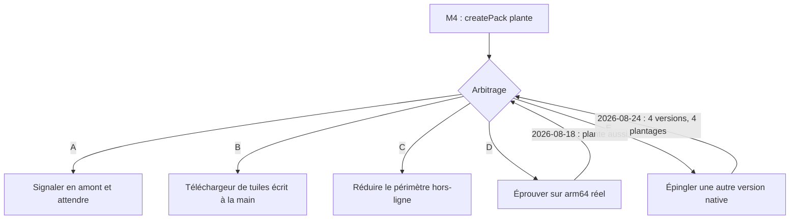

# ADR-012 — Le hors-ligne cartographique est bloqué par un défaut de MapLibre

- **Statut :** 🚨 **E exécutée le 2026-08-24 — épuisée. Le plantage survit à toutes les versions compatibles du SDK natif.** L'arbitrage entre **A, B et C** revient donc intact, et sans l'échappatoire bon marché qu'on espérait. Voir « Résultat de E ».
- **Option E retenue le 2026-08-18** — épingler une autre version du SDK natif avant d'arbitrer A, B ou C. Voir « Option E » pour ce qui était établi et le piège de clé Gradle.
- **D exécutée le 2026-08-18 — le plantage se reproduit sur `arm64` réel.** La branche favorable est écartée. Voir « Résultat de D », et la réserve sur le niveau de preuve.
- **Arbitré en première instance le 2026-08-15** — option **D** retenue.
- **Date :** 2026-08-15

> `ADR-011` est **réservé** à la bibliothèque SQLite (tâche `S5` du plan T0). Ce numéro-ci prend
> donc le suivant. Les numéros ne sont jamais réutilisés.

## Contexte

[`ADR-010`](ADR-010-react-native.md) a retenu React Native en tenant pour acquis que
`OfflineManager.createPack` fournirait le hors-ligne cartographique, qui est un **`Must`** du
produit ([`UC-005`](../use-cases/UC-005-consulter-la-carte-hors-ligne.md), `US-10`). Cette
hypothèse — `NV-1` du plan T0 — reposait sur une **lecture de code source**, jamais sur une
exécution :

- `offline_download.cpp` de `maplibre-native` traite `SourceType::Raster` exactement comme
  `SourceType::Vector` (lignes 191, 304, 451, lues le 2026-07-31) ;
- mais `test/storage/offline_download.test.cpp` ne contient **aucune** occurrence de « raster » —
  le chemin n'a pas de test amont (`NV-6`).

La tâche `M4` devait lever ces doutes par l'exécution. **Elle les a remplacés par un fait plus
grave.**

### Ce qui a été constaté, le 2026-08-15

Environnement : émulateur Android `sdk_gphone64_x86_64`, **API 36**, `x86_64` ·
`@maplibre/maplibre-react-native@11.3.6` · `expo@57.0.13` · `react-native@0.86.2`.

> **`11.3.6` est la dernière version publiée** au 2026-08-15 (`npm view` — versions `11.2.1` à
> `11.3.6`). Il n'existe pas de mise à jour vers laquelle se replier.

**`OfflineManager.createPack` tue le processus.** Environ **0,7 s** après la création du pack :

```
E libc++abi: terminating due to uncaught exception of type std::__ndk1::regex_error:
             The expression contained an invalid range in a {} expression.
F libc    : Fatal signal 6 (SIGABRT), code -1 (SI_QUEUE) in tid 5951 (DatabaseFileSou)
I ActivityManager: Process fr.martinpecheur.app has died
```

| Ce qui a été écarté | Comment |
|---|---|
| Un défaut de **notre fond IGN** | Reproduit avec le style de démonstration de MapLibre, `https://demotiles.maplibre.org/style.json` |
| Un défaut du **raster** | Ce style de démonstration est **vectoriel** |
| Une **base de données corrompue** par nos essais | Reproduit après `adb shell pm clear`, base vierge |
| Un **hasard** | **4 plantages sur 4 essais** |
| Une **permission manquante** | Une permission produit une `SecurityException` Java, pas une `std::regex_error` C++. L'application affichait des tuiles IGN depuis 690 s au moment du plantage |

La pile des 22 trames est **entièrement dans `libmaplibre.so`, symboles retirés** : la fonction
fautive n'est pas identifiable depuis ce poste, et elle n'est pas devinée ici. Le fil s'appelle
`DatabaseFileSource` et l'exception est une `std::regex_error` sur une expression `{}` — deux faits,
pas une explication.

### Trois autres erreurs d'API, découvertes en chemin

Le plan T0 s'était déjà trompé trois fois sur l'API MapLibre. En voici trois de plus, toutes
constatées par exécution le 2026-08-15 :

| # | Le plan T0 écrivait | Le constat |
|---|---|---|
| 1 | `mapStyle: JSON.stringify(ignRasterStyle)` | `mapStyle` est une **URL de style**. Côté Android, il alimente `OfflineTilePyramidRegionDefinition(styleURL, …)`. Un style sérialisé produit `Unable to parse resourceUrl {"version":8,…` |
| 2 | — | Une URI **`data:`** n'est pas résolue : la région passe à l'état `active` et reste à `tuiles=0`, **sans aucune erreur**. Un échec parfaitement silencieux |
| 3 | — | Le plafond de tuiles par défaut est **6000** ; le dépasser **interrompt** le téléchargement (`mapboxTileCountLimitExceeded`, `MLRNOfflineModule.kt:525`) et laisse un pack tronqué. Une emprise départementale en raster 256 px est de cet ordre de grandeur (`NV-4`) |

Conséquence pratique du point 1 : **le fond IGN ne peut pas être passé à `createPack` en l'état**,
puisqu'il n'existe qu'en mémoire. Le poser sur une URL `file://` exigerait un module de système de
fichiers, que le projet n'embarque pas.

### Ce que cela laisse ouvert

| Non vérifié | État |
|---|---|
| `NV-1` — que `createPack` télécharge les tuiles d'un WMTS IGN | **Non levé, et non testable** : le plantage survient avant qu'une seule tuile soit téléchargée. **Ni confirmé, ni infirmé** |
| `NV-3` — que `tileset.tiles[0]` suffise | Non levé, bloqué par le même plantage |
| `NV-4` — volume d'un pack départemental | Non levé, **aucun chiffre mesuré** |
| `NV-6` — absence de test amont du chemin raster | Non levé |

> ⚠️ **On ne sait toujours pas si le hors-ligne raster fonctionne.** On sait que le chemin qui y
> mène plante. La nuance compte : elle interdit de conclure que le raster est en cause, et elle
> interdit tout autant de considérer `NV-1` comme acquis.

## Décision

**Option D — reproduire le plantage sur un Android `arm64` réel avant de trancher quoi que ce
soit.** Arbitrage du commanditaire, le 2026-08-15.

`ADR-010` a été tranché *par arbitrage du commanditaire* sur la foi d'un hors-ligne réputé fourni.
Ce fondement n'est pas vérifié, et le lot de travail qu'`ADR-010` pensait avoir supprimé — écrire
soi-même le téléchargement et le stockage des tuiles — est susceptible de revenir. La décision de
fond appartient donc à celui qui a arbitré `ADR-010` ; elle est **suspendue au résultat de D**.

### Ce que D doit produire

Le constat actuel porte sur **un seul environnement** : un émulateur `x86_64`. Rien ne dit encore si
le défaut est celui de la bibliothèque ou celui de l'émulateur, et l'écart entre les deux réponses
est celui entre « le hors-ligne fonctionne » et « le lot est à réécrire ».

Marche à suivre, et lecture du résultat :

| Ce qu'on observe sur `arm64` réel | Ce qu'on en conclut |
|---|---|
| Même `SIGABRT` / `regex_error` | Le défaut est réel. **A, B ou C** s'imposent, et le rapport amont est solide |
| Pas de plantage, `tuiles` monte | **Le problème était l'émulateur.** `M4` reprend, `NV-1`, `NV-3` et `NV-4` se mesurent enfin |
| Pas de plantage, `tuiles` reste à 0 | Le hors-ligne raster échoue pour une autre cause — reste à chercher, mais avec un chemin vivant |

Le cas de reproduction tient en un appui : `src/features/map/OfflinePackProbe.tsx`. La marche à
suivre complète — installation, relevé du journal, lecture du résultat — est dans
[`guide-test-appareil.md`](../guide-test-appareil.md).

⚠️ **La preuve est dans le journal, pas à l'écran.** « L'application s'est fermée » est une
impression ; c'est la ligne `regex_error` qui distingue ce plantage-ci de n'importe quel autre.

> ⚠️ **Même dans le cas favorable, le hors-ligne ne sera pas livrable le jour même.** Il restera à
> fournir le style IGN sous forme d'**URL** — `mapStyle` n'accepte pas un style en mémoire, et le
> projet n'embarque aucun module de système de fichiers. Voir le point 1 des erreurs d'API
> ci-dessus.

> 🔧 **Le même appareil débloque trois tâches** : `M4` (ce point), `M5` (tenue de 4 150 marqueurs,
> `NV-5`) et le critère « entrée de gamme » de `S5` (bibliothèque SQLite). Un seul téléphone en USB.



## Résultat de D — constaté le 2026-08-18

> **Le plantage se reproduit sur `arm64` réel. Ce n'était pas l'émulateur.**

| | |
|---|---|
| Appareil | **Samsung Galaxy A54 5G** — `SM-A546E`, nom de code `a54x`, **Android 16** |
| Architecture | **`arm64-v8a`**, lue par `getprop ro.product.cpu.abi` |
| Binaire | APK **release** du 2026-08-15, posé par `adb install -r` (`Success`). Son bundle Hermes a été ouvert **avant** l'essai pour vérifier qu'il portait bien l'écran courant — libellé exact du bouton retrouvé à l'offset 1334044, en UTF-16 |
| Observation | À l'appui sur le bouton, **l'application quitte l'écran** et ne se rétablit pas d'elle-même |
| Essais | **1** — contre 4 sur émulateur |

### ⚠️ Le niveau de preuve est inférieur à celui du constat du 2026-08-15

Cet ADR pose lui-même la règle, plus haut : *« c'est la ligne `regex_error` qui distingue ce
plantage-ci de n'importe quel autre »*. **Cette ligne n'a pas été relevée sur `arm64`.**

La cause est l'appareil, pas la procédure. `Poincaré` applique une politique de terminal
(Knox/MDM) qui **révoque `adbd` en quelques dizaines de secondes** : la session tient assez pour
une commande enchaînée sans aller-retour — c'est ainsi que l'installation est passée — mais pas
pour un `logcat -d` après le plantage. Quatre tentatives de reconnexion ont échoué, l'appareil
retombant en `offline` puis absent. Le tampon circulaire a défilé.

| Ce que D devait trancher | Réponse au 2026-08-18 |
|---|---|
| Le défaut est-il celui de l'émulateur `x86_64` ? | **Non.** C'est la question centrale de D, et elle est tranchée : la branche « pas de plantage, `tuiles` monte » est **exclue** |
| Est-ce le **même** défaut — `std::regex_error` sur le fil `DatabaseFileSource` ? | **Non établi.** Signature non relevée. Un plantage d'autre nature n'est pas exclu par cette seule observation |
| Le rapport amont est-il solide ? | **Pas encore.** Il lui manque une pile constatée sur `arm64` |

**Ce qui reste à faire pour combler l'écart :** une seule capture `logcat` réussie, sur un Android
`arm64` **sans politique de terminal** — n'importe quel téléphone personnel non administré fait
l'affaire. C'est une minute d'exécution, pas un lot de travail.

### Ce que le même essai a établi par ailleurs

➕ **MapLibre v11 et le fond IGN fonctionnent sur `arm64` réel, sous Android 16.** Carte affichée,
tuiles WMTS chargées sur réseau mobile, clustering `M3` visible et manipulable. `M1`, `M2` et `M3`
n'étaient constatés que sur émulateur `x86_64` : ils le sont désormais sur matériel.

➖ **`M5` n'a pas pu être mesurée.** `dumpsys gfxinfo` a rapporté `Total frames rendered: 0` après
une séquence de déplacement pourtant effectuée — percentiles à la valeur sentinelle `4950ms`,
c'est-à-dire un histogramme vide. La cause n'est **pas** un rendu hors HWUI : `Map.d.ts:364` établit
que la v11 rend par **TextureView par défaut** sur Android. L'hypothèse restante, non vérifiée, est
un décalage de profil utilisateur — le shell `adb` opère sur `user 0` et s'est vu refuser l'accès à
`user 150` (`SecurityException` sur `pm list packages`), ce qui laisse penser que l'instance
manipulée n'était pas celle qui a été mesurée. **`NV-5` reste ouvert.**

## Option E — épingler une autre version du SDK natif

**Retenue par arbitrage du commanditaire le 2026-08-18**, à l'issue de D. Elle n'existait pas dans
la liste soumise le 2026-08-15 ; elle vient d'une lecture du paquet faite le 2026-08-18.

### Ce qui est établi

La pile du plantage est **entièrement dans `libmaplibre.so`** — donc dans le SDK natif Android, pas
dans l'enrobage React Native. Or ce SDK n'est pas figé par la version npm :

| Fait | Source, lue le 2026-08-18 |
|---|---|
| Le moteur natif est `org.maplibre.gl:android-sdk-opengl:13.2.0` | `node_modules/@maplibre/maplibre-react-native/android/gradle.properties:8` |
| Il est injecté par une propriété, pas codé en dur | `…/android/build.gradle:93` — `implementation "org.maplibre.gl:android-sdk-${nativeVariant}:${nativeVersion}"` |
| Seul `13.2.0` est présent dans le cache Gradle local | `~/.gradle/caches/modules-2/files-2.1/org.maplibre.gl/` |

**Changer de version est donc un changement de propriété, pas un lot de code.** C'est ce qui
distingue E de B.

### 🚨 Le piège : deux fonctions de lecture, deux clés différentes

`android/build.gradle` du paquet expose **deux** lecteurs qui ne cherchent pas la même chose :

| Fonction | Clé cherchée dans `rootProject.ext` | Lignes |
|---|---|---|
| `getExtOrDefault` | le nom **nu** — `kotlinVersion` | 2–4 |
| `getConfigurableExtOrDefault` | le nom **préfixé** — `org.maplibre.reactnative.nativeVersion` | 28–30 |

`nativeVersion` passe par la **seconde**. Écrire `ext.nativeVersion = "…"` **ne produirait aucun
effet** : Gradle retomberait sans bruit sur `13.2.0`, et le build réussirait en donnant l'illusion
d'un essai concluant. La forme juste est :

```gradle
ext["org.maplibre.reactnative.nativeVersion"] = "X.Y.Z"
```

⚠️ **C'est exactement la classe de panne silencieuse que ce projet refuse.** Tout essai de E doit
donc **vérifier la version réellement liée** — par exemple en lisant l'arbre des dépendances Gradle,
et non en supposant que la propriété a été prise.

Comme `android/` est régénéré par `prebuild`, la surcharge ne peut pas vivre dans `android/` : elle
passe par un *config plugin* Expo versionné. Le précédent existe — `plugins/withReleaseSigning.js`.

### Ce qui reste à faire, dans l'ordre

| # | Étape | Bloqué par |
|---|---|---|
| 1 | **Établir la liste des versions publiées** de `org.maplibre.gl:android-sdk-opengl` | Réseau — **non fait au 2026-08-18** |
| 2 | Écrire le *config plugin* qui pose la propriété, et **vérifier la version liée** | — |
| 3 | Reconstruire le natif | Ne peut pas tourner dans le bac à sable de l'agent (`Selector.open()` / AF_UNIX) — à lancer depuis un terminal utilisateur |
| 4 | Rejouer `M4` **avec capture `logcat`** | Exige un Android `arm64` **non administré** : sans signature, on ne peut pas comparer avant/après |

> ⚠️ **E n'est pas vérifiée, et rien n'assure qu'une autre version corrige le défaut.** Son seul
> avantage établi est son coût : une propriété contre un lot de code. Si E échoue, l'arbitrage entre
> A, B et C revient intact.

## Résultat de E — constaté le 2026-08-24

> **Aucune version publiée du SDK natif ne corrige le défaut. E est épuisée.**

Environnement : émulateur `Pixel_7`, `sdk_gphone64_x86_64`, **Android 16**, `x86_64`. Le même geste,
sur le même émulateur, base effacée par `pm clear` avant chaque essai — **seule la version native
change**.

### Étape 1 — la liste des versions publiées, enfin établie

Bloquée sur le réseau depuis le 2026-08-18. Levée par appel réel le 2026-08-24 :
`https://repo1.maven.org/maven2/org/maplibre/gl/android-sdk-opengl/maven-metadata.xml` → **HTTP 200**,
53 versions, `<latest>13.5.1</latest>`, `<lastUpdated>20260821152717</lastUpdated>`.

🚨 **`13.2.0` — la version que le paquet épingle — n'est pas la dernière.** Six versions stables
l'ont suivie : `13.3.0`, `13.3.1`, `13.4.0`, `13.4.1`, `13.5.0`, `13.5.1`, cette dernière publiée
**le 2026-08-21**, soit trois jours avant cet essai. C'est très exactement le cas de figure sur
lequel E reposait.

### 🚨 E a un plancher : l'enrobage ne compile pas sous `12.x`

`12.0.0` **ne construit pas**. `maplibre-react-native@11.3.6` référence une classe absente du SDK
natif 12 :

```
e: node_modules/@maplibre/maplibre-react-native/android/src/main/java/org/maplibre/reactnative/
   components/layer/MLRNLayer.kt:13:42 Unresolved reference 'ColorReliefLayer'
```

**L'espace de recherche de E n'est donc pas « les 53 versions » : c'est `[13.0.0 … 13.5.1]`.** Ce
plancher n'avait pas été anticipé le 2026-08-18, et il réduit E à une quinzaine de candidates.

### Étape 2 — la propriété est bien prise (pas de faux positif)

Le piège de clé décrit plus haut est évité, et **vérifié plutôt que supposé**, comme cet ADR
l'exige :

```
$ ./gradlew -p android :maplibre_maplibre-react-native:dependencies     --configuration debugRuntimeClasspath -PMARTINPECHEUR_MAPLIBRE_NATIVE_VERSION=13.5.1
+--- org.maplibre.gl:android-sdk-opengl:13.5.1
```

Le *config plugin* est `plugins/withMapLibreNativeVersion.js` (14 tests verts avec
`withReleaseSigning`). Il **ne choisit aucune version** : son défaut est `13.2.0`, la valeur
constatée du paquet.

### Étapes 3 et 4 — quatre versions, quatre fois le même plantage

| Version native | Construit | `M4` | Délai après `pack cree` |
|---|---|---|---|
| `12.0.0` | ❌ **non** — `ColorReliefLayer` introuvable | — | — |
| `13.0.0` — plancher compatible | ✅ | 🚨 **plante** | ~3 s observés |
| `13.1.0` | ✅ | 🚨 **plante** | 0,752 s |
| `13.2.0` — défaut du paquet | ✅ | 🚨 **plante** | 1,112 s |
| `13.5.1` — dernière publiée | ✅ | 🚨 **plante** | 0,722 s |

**La signature est identique dans les quatre cas** — ce n'est pas « un plantage » à chaque fois,
c'est *le même* :

```
E libc++abi: terminating due to uncaught exception of type std::__ndk1::regex_error:
             The expression contained an invalid range in a {} expression.
F libc    : Fatal signal 6 (SIGABRT), code -1 (SI_QUEUE) in tid … (DatabaseFileSou)
F DEBUG   : 22 total frames        ← toutes dans libmaplibre.so
```

⚠️ **Huit versions restent formellement non essayées** (`13.0.1`, `13.0.2`, `13.3.0`, `13.3.1`,
`13.4.0`, `13.4.1`, `13.5.0`, et les `-pre`). Les deux bornes de l'intervalle compatible et deux
points intérieurs échouent à l'identique : qu'une version intercalaire fonctionne est possible,
mais peu probable. **E est réputée épuisée, pas démontrée épuisée** — la nuance est celle entre
quatre mesures et quinze.

### ➕ Ce que ces essais ont établi par ailleurs

**`NV-1` est tranché par le journal, non plus par déduction.** Sur une capture `logcat` complète
(`*:V`), entre `M4 pack cree` et le `SIGABRT`, le compte de lignes `Mbgl-HttpRequest` est **zéro**.
Le processus meurt avant qu'une seule tuile soit *demandée* — `NV-1` n'est donc ni confirmé ni
infirmé, mais on sait désormais **pourquoi** il ne peut pas l'être.

**Le plantage laisse un pack fantôme en base.** Après relance, l'application affiche
`M4 packs=1 statuts=1 tuiles=0 octets=0` et démarre normalement : la base n'est pas corrompue, mais
une ligne de pack est écrite avant la mort. Conséquence opératoire : **un second essai ne part pas
d'une base vierge** sans `adb shell pm clear fr.martinpecheur.app`. Les quatre essais ci-dessus
l'appliquent tous.

**L'émulateur est de nouveau utilisable.** La panne des ~11 s du 2026-08-18 ne se reproduit pas
(boot en 38 s, sessions de plus de 15 min). Aucune action n'ayant été menée sur Bitdefender, la
cause de la disparition n'est **pas** établie.

### 💭 Une piste pour le rapport amont — non vérifiée

« invalid range in a `{}` expression » est l'erreur que `libc++` lève à la **compilation** d'un
motif dont le quantificateur d'accolades est mal borné. Or les gabarits d'URL de tuiles de MapLibre
contiennent littéralement `{z}`, `{x}`, `{y}` — qu'un moteur d'expressions régulières peut prendre
pour un quantificateur invalide. Le fil fautif, `DatabaseFileSource`, est précisément celui qui
résout les URL de tuiles pour le téléchargement hors ligne.

⚠️ **Ce n'est qu'une hypothèse.** `libmaplibre.so` est livré **sans symboles** : les 22 trames ne
donnent que des offsets, et le motif fautif n'est pas identifiable depuis ce poste. À proposer comme
piste dans un rapport amont, **jamais à présenter comme la cause**.

### Ce que E ne remplace pas

La signature sur **`arm64` réel** manque toujours au dossier — ces quatre essais sont tous sur
émulateur `x86_64`. Ils suffisent à trancher E, parce qu'ils comparent des builds *entre eux* sur un
socle dont la ligne de base est solide (5 plantages sur 5). Ils ne comblent pas l'écart de preuve
signalé au « Résultat de D ».

## Options soumises à l'arbitrage

- **A — Signaler le défaut en amont et attendre.** Coût immédiat quasi nul ; échéance non
  maîtrisée, et `11.3.6` est déjà la dernière version. Le hors-ligne reste indisponible sans date.
- **B — Écrire le téléchargeur de tuiles et son stockage.** Rend le hors-ligne indépendant de
  `OfflineManager` et du format de base MapLibre. C'est **exactement le lot qu'`ADR-010` comptait
  supprimer** : parcours des tuiles d'une emprise, file d'attente, reprise, quotas — et le respect
  des conditions d'usage de l'IGN à vérifier avant d'aspirer un département.
- **C — Réduire le périmètre.** Sortir le hors-ligne cartographique de la version 1. Il faudrait
  alors le retirer explicitement d'[`UC-005`](../use-cases/UC-005-consulter-la-carte-hors-ligne.md)
  et d'`US-10`, où il est un `Must` — c'est une réduction de promesse, pas un détail technique.
- **D — Éprouver ailleurs avant de trancher.** Le constat porte sur **un seul environnement** : un
  émulateur `x86_64`. Un appareil `arm64` réel n'a pas été essayé, ni iOS. Un plantage propre à
  `x86_64` changerait complètement la portée du problème, et c'est l'essai le moins cher des
  quatre.

> **Aucune de ces options n'est recommandée ici**, l'arbitrage n'étant pas technique.
>
> ⚠️ **Cette liste date du 2026-08-15 et ses deux échappatoires sont maintenant fermées.** D est
> exécutée (le défaut n'était pas l'émulateur) et E est épuisée (aucune version compatible ne le
> corrige). La remarque d'origine — « D est le préalable de A, B et C » — est **périmée** : ce
> préalable est levé. **L'arbitrage entre A, B et C est ouvert, et il n'attend plus rien.**

## Conséquences

- ➖ **Le `Must` hors-ligne n'a aucun chemin vérifié.** `UC-005` et `US-10` ne sont pas livrables en
  l'état.
- ➖ **`ADR-010` perd un de ses appuis.** Son point « le hors-ligne n'est plus un risque » est
  démenti par l'exécution. Cela ne remet pas en cause React Native : le défaut est dans une
  bibliothèque, et le même `OfflineManager` sert le monde React Native comme le monde natif.
- ➕ **Le défaut est découvert en T0**, avant que des écrans en dépendent — c'est précisément le rôle
  qu'`M4` avait dans le plan, et la raison pour laquelle il ne fallait pas la repousser.
- ➕ **Un cas de reproduction minimal existe au dépôt** : `src/features/map/OfflinePackProbe.tsx`,
  un appui suffit.

## Si la décision est revue

Si le défaut amont est corrigé, `M4` reprend **là où elle s'est arrêtée** : le code de
`src/features/map/` est écrit et testé (13 + 6 tests), et il porte déjà les trois erreurs d'API
corrigées. Restera à fournir une **URL** de style — la question ouverte par le point 1 ci-dessus —
puis à mesurer `completedTileCount`, `completedTileSize` et la durée, et à constater le mode avion.

**Ce qui n'est pas impacté :** le cadrage produit, le domaine, la couche données, le fond de carte
en ligne (`M2`, constaté le 2026-08-15 et reconduit depuis).

## Liens

- Met en défaut un appui de : [`ADR-010`](ADR-010-react-native.md)
- Cas d'usage menacé : [`UC-005`](../use-cases/UC-005-consulter-la-carte-hors-ligne.md)
- Tâche : `M4` du [plan T0](../superpowers/plans/2026-07-31-t0-socle-react-native.md)
- Code : `src/features/map/offlinePack.ts`, `offlinePackOptions.ts`, `OfflinePackProbe.tsx`

**Sources lues le 2026-08-15 :** `node_modules/@maplibre/maplibre-react-native/android/src/main/java/org/maplibre/reactnative/modules/MLRNOfflineModule.kt`
(lignes 49, 423, 525, 549, 656) · `lib/typescript/module/modules/offline/{OfflineManager,OfflinePack}.d.ts` ·
`npm view @maplibre/maplibre-react-native versions`
