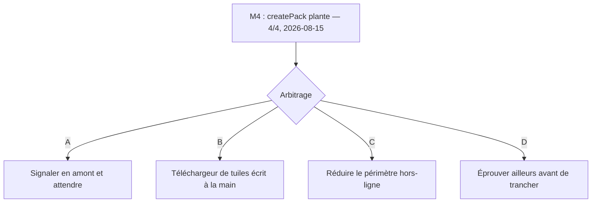

# ADR-012 — Le hors-ligne cartographique est bloqué par un défaut de MapLibre

- **Statut :** Proposé — **arbitrage du commanditaire requis**
- **Date :** 2026-08-15

> `ADR-011` est **réservé** à la bibliothèque SQLite (tâche `S5` du plan T0). Ce numéro-ci prend
> donc le suivant. Les numéros ne sont jamais réutilisés.

## Contexte

[`ADR-010`](ADR-010-react-native.md) a retenu React Native en tenant pour acquis que
`OfflineManager.createPack` fournirait le hors-ligne cartographique, qui est un **`Must`** du
produit ([`UC-005`](../use-cases/UC-005-consulter-la-carte-hors-ligne.md), `US-10`). Cette
hypothèse — `NV-1` du plan T0 — reposait sur une **lecture de code source**, jamais sur une
exécution :

- `offline_download.cpp` de `maplibre-native` traite `SourceType::Raster` exactement comme
  `SourceType::Vector` (lignes 191, 304, 451, lues le 2026-07-31) ;
- mais `test/storage/offline_download.test.cpp` ne contient **aucune** occurrence de « raster » —
  le chemin n'a pas de test amont (`NV-6`).

La tâche `M4` devait lever ces doutes par l'exécution. **Elle les a remplacés par un fait plus
grave.**

### Ce qui a été constaté, le 2026-08-15

Environnement : émulateur Android `sdk_gphone64_x86_64`, **API 36**, `x86_64` ·
`@maplibre/maplibre-react-native@11.3.6` · `expo@57.0.13` · `react-native@0.86.2`.

> **`11.3.6` est la dernière version publiée** au 2026-08-15 (`npm view` — versions `11.2.1` à
> `11.3.6`). Il n'existe pas de mise à jour vers laquelle se replier.

**`OfflineManager.createPack` tue le processus.** Environ **0,7 s** après la création du pack :

```
E libc++abi: terminating due to uncaught exception of type std::__ndk1::regex_error:
             The expression contained an invalid range in a {} expression.
F libc    : Fatal signal 6 (SIGABRT), code -1 (SI_QUEUE) in tid 5951 (DatabaseFileSou)
I ActivityManager: Process fr.martinpecheur.app has died
```

| Ce qui a été écarté | Comment |
|---|---|
| Un défaut de **notre fond IGN** | Reproduit avec le style de démonstration de MapLibre, `https://demotiles.maplibre.org/style.json` |
| Un défaut du **raster** | Ce style de démonstration est **vectoriel** |
| Une **base de données corrompue** par nos essais | Reproduit après `adb shell pm clear`, base vierge |
| Un **hasard** | **4 plantages sur 4 essais** |
| Une **permission manquante** | Une permission produit une `SecurityException` Java, pas une `std::regex_error` C++. L'application affichait des tuiles IGN depuis 690 s au moment du plantage |

La pile des 22 trames est **entièrement dans `libmaplibre.so`, symboles retirés** : la fonction
fautive n'est pas identifiable depuis ce poste, et elle n'est pas devinée ici. Le fil s'appelle
`DatabaseFileSource` et l'exception est une `std::regex_error` sur une expression `{}` — deux faits,
pas une explication.

### Trois autres erreurs d'API, découvertes en chemin

Le plan T0 s'était déjà trompé trois fois sur l'API MapLibre. En voici trois de plus, toutes
constatées par exécution le 2026-08-15 :

| # | Le plan T0 écrivait | Le constat |
|---|---|---|
| 1 | `mapStyle: JSON.stringify(ignRasterStyle)` | `mapStyle` est une **URL de style**. Côté Android, il alimente `OfflineTilePyramidRegionDefinition(styleURL, …)`. Un style sérialisé produit `Unable to parse resourceUrl {"version":8,…` |
| 2 | — | Une URI **`data:`** n'est pas résolue : la région passe à l'état `active` et reste à `tuiles=0`, **sans aucune erreur**. Un échec parfaitement silencieux |
| 3 | — | Le plafond de tuiles par défaut est **6000** ; le dépasser **interrompt** le téléchargement (`mapboxTileCountLimitExceeded`, `MLRNOfflineModule.kt:525`) et laisse un pack tronqué. Une emprise départementale en raster 256 px est de cet ordre de grandeur (`NV-4`) |

Conséquence pratique du point 1 : **le fond IGN ne peut pas être passé à `createPack` en l'état**,
puisqu'il n'existe qu'en mémoire. Le poser sur une URL `file://` exigerait un module de système de
fichiers, que le projet n'embarque pas.

### Ce que cela laisse ouvert

| Non vérifié | État |
|---|---|
| `NV-1` — que `createPack` télécharge les tuiles d'un WMTS IGN | **Non levé, et non testable** : le plantage survient avant qu'une seule tuile soit téléchargée. **Ni confirmé, ni infirmé** |
| `NV-3` — que `tileset.tiles[0]` suffise | Non levé, bloqué par le même plantage |
| `NV-4` — volume d'un pack départemental | Non levé, **aucun chiffre mesuré** |
| `NV-6` — absence de test amont du chemin raster | Non levé |

> ⚠️ **On ne sait toujours pas si le hors-ligne raster fonctionne.** On sait que le chemin qui y
> mène plante. La nuance compte : elle interdit de conclure que le raster est en cause, et elle
> interdit tout autant de considérer `NV-1` comme acquis.

## Décision

**Aucune. Ce point relève du commanditaire, pas de l'exécution.**

`ADR-010` a été tranché *par arbitrage du commanditaire* sur la foi d'un hors-ligne réputé fourni.
Ce fondement n'est pas vérifié, et le lot de travail qu'`ADR-010` pensait avoir supprimé — écrire
soi-même le téléchargement et le stockage des tuiles — est susceptible de revenir. La décision
appartient donc à celui qui a arbitré `ADR-010`.



## Options soumises à l'arbitrage

- **A — Signaler le défaut en amont et attendre.** Coût immédiat quasi nul ; échéance non
  maîtrisée, et `11.3.6` est déjà la dernière version. Le hors-ligne reste indisponible sans date.
- **B — Écrire le téléchargeur de tuiles et son stockage.** Rend le hors-ligne indépendant de
  `OfflineManager` et du format de base MapLibre. C'est **exactement le lot qu'`ADR-010` comptait
  supprimer** : parcours des tuiles d'une emprise, file d'attente, reprise, quotas — et le respect
  des conditions d'usage de l'IGN à vérifier avant d'aspirer un département.
- **C — Réduire le périmètre.** Sortir le hors-ligne cartographique de la version 1. Il faudrait
  alors le retirer explicitement d'[`UC-005`](../use-cases/UC-005-consulter-la-carte-hors-ligne.md)
  et d'`US-10`, où il est un `Must` — c'est une réduction de promesse, pas un détail technique.
- **D — Éprouver ailleurs avant de trancher.** Le constat porte sur **un seul environnement** : un
  émulateur `x86_64`. Un appareil `arm64` réel n'a pas été essayé, ni iOS. Un plantage propre à
  `x86_64` changerait complètement la portée du problème, et c'est l'essai le moins cher des
  quatre.

> **Aucune de ces options n'est recommandée ici**, l'arbitrage n'étant pas technique. La seule
> remarque d'exécution : **D est le préalable de A, B et C** — il coûte un appareil Android réel et
> il peut réduire le problème à néant.

## Conséquences

- ➖ **Le `Must` hors-ligne n'a aucun chemin vérifié.** `UC-005` et `US-10` ne sont pas livrables en
  l'état.
- ➖ **`ADR-010` perd un de ses appuis.** Son point « le hors-ligne n'est plus un risque » est
  démenti par l'exécution. Cela ne remet pas en cause React Native : le défaut est dans une
  bibliothèque, et le même `OfflineManager` sert le monde React Native comme le monde natif.
- ➕ **Le défaut est découvert en T0**, avant que des écrans en dépendent — c'est précisément le rôle
  qu'`M4` avait dans le plan, et la raison pour laquelle il ne fallait pas la repousser.
- ➕ **Un cas de reproduction minimal existe au dépôt** : `src/features/map/OfflinePackProbe.tsx`,
  un appui suffit.

## Si la décision est revue

Si le défaut amont est corrigé, `M4` reprend **là où elle s'est arrêtée** : le code de
`src/features/map/` est écrit et testé (13 + 6 tests), et il porte déjà les trois erreurs d'API
corrigées. Restera à fournir une **URL** de style — la question ouverte par le point 1 ci-dessus —
puis à mesurer `completedTileCount`, `completedTileSize` et la durée, et à constater le mode avion.

**Ce qui n'est pas impacté :** le cadrage produit, le domaine, la couche données, le fond de carte
en ligne (`M2`, constaté le 2026-08-15 et reconduit depuis).

## Liens

- Met en défaut un appui de : [`ADR-010`](ADR-010-react-native.md)
- Cas d'usage menacé : [`UC-005`](../use-cases/UC-005-consulter-la-carte-hors-ligne.md)
- Tâche : `M4` du [plan T0](../superpowers/plans/2026-07-31-t0-socle-react-native.md)
- Code : `src/features/map/offlinePack.ts`, `offlinePackOptions.ts`, `OfflinePackProbe.tsx`

**Sources lues le 2026-08-15 :** `node_modules/@maplibre/maplibre-react-native/android/src/main/java/org/maplibre/reactnative/modules/MLRNOfflineModule.kt`
(lignes 49, 423, 525, 549, 656) · `lib/typescript/module/modules/offline/{OfflineManager,OfflinePack}.d.ts` ·
`npm view @maplibre/maplibre-react-native versions`
