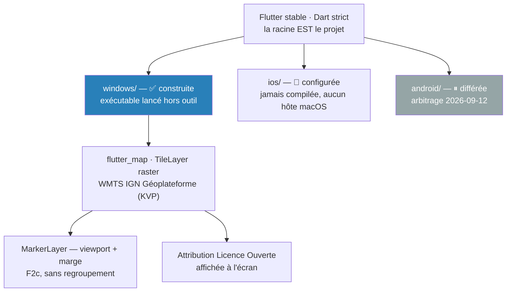

# ADR-013 — Bascule vers Flutter, et Windows en première cible construite

- **Statut :** **Accepté — arbitrage du commanditaire du 2026-09-12** (porte de spike franchie sur `F1` et `F3`), **Android différé le même jour**
- **Date :** 2026-09-13
- **Remplace :** [`ADR-010`](ADR-010-react-native.md) (React Native, abandon de MAUI et de Windows)
- **Rétablit l'intention de :** [`ADR-009`](ADR-009-cible-windows.md) — **sans le réactiver.** `ADR-009` reste « Remplacé par `ADR-010` » : il décrivait une cible Windows **MAUI `SingleProject`**, avec `TargetFrameworks`, `WindowsPackageType` et `Platforms/Windows`. Rien de cela ne survit. Ce qui revient, c'est **le besoin** qu'`ADR-009` documentait — voir son propre Contexte — pas sa mise en œuvre

> ⚠️ **Cet ADR est écrit a posteriori.** La porte de spike a été exécutée le **2026-09-09**, la
> décision arbitrée le **2026-09-12**, ce document rédigé le **2026-09-13** (et versionné sur `feat/t1-mvvm-fiche-station` le **2026-09-14**), après la livraison de
> T0. Le plan T0 l'annonçait explicitement dans sa section « Ce que T0 ne fait pas » : *« Aucun
> `ADR-013` (bascule de stack et cible unique). Il reste à écrire ; `.gitignore` le cite déjà comme
> la décision qui rend `windows/` et `ios/` versionnés. »* Il ne crée donc aucune décision : il
> consigne celle qui a été prise, et les faits datés qui l'ont produite.

---

## Contexte

### La chaîne des faits, datée

| Date | Fait | Source |
|---|---|---|
| 2026-07-31 | [`ADR-010`](ADR-010-react-native.md) retient **React Native** et **abandonne Windows**, un jour après l'avoir ajouté (`ADR-009`). L'appui décisif est le hors-ligne cartographique : `OfflineManager.createPack` est réputé **fourni**, là où .NET exigeait un lot à chiffrer | `ADR-010` |
| 2026-08-15 | **`createPack` tue le processus** — `SIGABRT` sur une `std::regex_error` non rattrapée dans le fil `DatabaseFileSource`, ~0,7 s après la création du pack, **4 essais sur 4**, base vierge comprise, et avec le **style vectoriel de démonstration** de MapLibre (donc ni l'IGN, ni le raster). `11.3.6` était déjà la dernière version publiée | [`ADR-012`](ADR-012-hors-ligne-cartographique-bloque.md) |
| 2026-08-18 | **Option D** — le plantage **se reproduit sur `arm64` réel** (Samsung Galaxy A54, `SM-A546E`, Android 16, `arm64-v8a`). Ce n'était pas l'émulateur. ⚠️ La signature `regex_error` **n'a pas été relevée** sur cet appareil (politique de terminal Knox/MDM révoquant `adbd`) : le niveau de preuve y est inférieur à celui du 2026-08-15 | `ADR-012` § « Résultat de D » |
| 2026-08-24 | **Option E épuisée** — le SDK natif est épinglable par propriété Gradle, et **quatre versions essayées donnent quatre fois le même plantage** : `13.0.0`, `13.1.0`, `13.2.0` (défaut du paquet), `13.5.1` (dernière publiée). `12.0.0` **ne compile pas** (`ColorReliefLayer` introuvable), ce qui borne l'espace de recherche à `[13.0.0 … 13.5.1]`. ⚠️ Huit versions intercalaires restent formellement non essayées : **E est réputée épuisée, pas démontrée épuisée** | `ADR-012` § « Résultat de E » |
| 2026-09-09 | **Porte de spike Flutter exécutée** — `F1` ✅ sur Windows, `F3` ✅, `F2` **rouge** sur la règle fixée d'avance (chiffres ci-dessous) | [`COMPTE-RENDU.md`](../../spike/porte_flutter/COMPTE-RENDU.md) |
| 2026-09-12 | **Arbitrage du commanditaire** : verdict favorable sur `F1` + `F3`, `F2c` retenue par défaut, **Android ⏸ différé jusqu'à nouvel ordre**, arbre git frais | [`project-state.md`](../project-state.md) § Arbitrages récents |
| 2026-09-13 | **T0 livrée** — 31 tâches sur 31, PR #11 fusionnée sur `dev` (`015a245`), version `0.1.0`, **248 tests** (247 du plan + `changelog_test`), constatés par `flutter test` le 2026-09-13, tag `v0.1.0` posé localement (non poussé) | plan T0 § Avancement, [`CHANGELOG.md`](../../CHANGELOG.md) |

> Le tag `archive/pre-flutter-2026-09-09`, cité par `project-state.md` comme portant le spike et
> l'outillage précédent, **n'est pas présent dans ce clone** (`git tag` ne liste que `v0.1.0`).

### Ce que la porte de spike a mesuré, le 2026-09-09

| Épreuve | Cible | Résultat |
|---|---|---|
| `F1` — le fond IGN s'affiche | Windows, `flutter run -d windows` | ✅ **le plan IGN s'affiche**, le glisser déplace la carte. ⚠️ à cette date, **la molette ne zoomait pas** (voir « Conséquences ») |
| `F2` — 4 150 marqueurs clusterisés | émulateur `Pixel_7`, `x86_64`, Android 16 | ⚠️ **rouge sur la règle fixée d'avance, non tranchée** — `trames 213` · `raster p50 1,9 ms` · **`p90 16,2 ms`** (budget ≤ 16,7 ms ✅) · `p99 143,1 ms` · `build p90 1,5 ms` · **`jank 19, soit 8,9 %`** pour un seuil < 5 % ❌ |
| `F3` — exécutable Windows autonome | `flutter build windows --release`, binaire lancé **seul** | ✅ la fenêtre s'ouvre hors de Flutter et affiche la carte. Dossier `Release` : **33 Mo, 14 fichiers**, dont `flutter_windows.dll` 20,3 Mo |

Le verdict de `F2` est **rouge, pas nul** : le budget de rastérisation tient, c'est le taux de trames
en retard qui dépasse. Les deux variantes de remesure (`F2b` sans animations, `F2c` sans
regroupement) sont codées au commit `207edec` et **n'ont jamais été mesurées** — elles attendaient
Android, qui a été différé le 2026-09-12.

### Versions réellement liées

Relevées le 2026-09-09 par `flutter pub deps --style=compact` dans le projet de spike, puis le
2026-09-13 dans `pubspec.yaml` à la racine. **On vérifie ce qui est lié, on ne le suppose pas** —
c'est la leçon de l'option E d'`ADR-012`, où une propriété Gradle mal nommée aurait donné l'illusion
d'un essai concluant.

| Composant | Au spike (2026-09-09) | Dans le projet (2026-09-13) | Licence |
|---|---|---|---|
| Flutter | **3.47.1** stable (revision `6655482ec0`) | **3.47.4** stable (`flutter --version`) | BSD-3-Clause |
| Dart | **3.13.1** | **3.13.3** — `environment: sdk ^3.13.3` | BSD-3-Clause |
| `flutter_map` | **8.3.2** liée | `^8.3.2` | BSD-3-Clause |
| `latlong2` | **0.9.1** (par contrainte transitive ; pub.dev publie `0.10.1`) | `^0.9.1` | Apache-2.0 |
| `http` | — | `^1.6.0` | BSD-3-Clause |
| `flutter_lints` | — | `^6.0.0` | — |
| `flutter_map_marker_cluster` | **8.2.2** liée dans le spike | **absente du projet** — `F2c` n'en a pas besoin | BSD-3-Clause |

---

## Décision

**Le projet passe à Flutter, et Windows redevient la première — et pour l'instant la seule — cible
construite.**

| Composant | Retenu | Remplace (`ADR-010`) |
|---|---|---|
| Langage | **Dart**, `strict-casts` / `strict-inference` / `strict-raw-types` | TypeScript `strict` |
| Runtime | **Flutter stable** | React Native + Expo |
| Carte | **`flutter_map`**, tuiles **raster WMTS IGN Géoplateforme** (KVP) | MapLibre Native via `@maplibre/maplibre-react-native` |
| Marqueurs | **viewport plus une marge, sans regroupement** (`F2c`) | clustering natif MapLibre |
| Hors-ligne carto | **cache de tuiles intégré à `flutter_map`** (voir ➖ ci-dessous) | `OfflineManager.createPack` — en panne (`ADR-012`) |
| Attribution | « © IGN Géoplateforme — Licence Ouverte », **affichée à l'écran** | *inchangé* |

### Les cibles, et leur état réel

| Cible | État |
|---|---|
| **Windows** | ✅ **la seule construite.** `flutter build windows --release` produit un exécutable **lancé hors outil de développement** par le commanditaire le 2026-09-13 |
| **iOS** | 🔄 **configuré, jamais compilé** — aucun hôte macOS. Le `bundleIdentifier` est aligné et verrouillé par un test (`test/project/ios_bundle_identifier_test.dart`) ; rien de plus n'est affiché comme acquis |
| **Android** | ⏸ **différé jusqu'à nouvel ordre** (arbitrage du 2026-09-12). Dans un plan, une tâche Android est marquée ⏸ : ni supprimée, ni comptée faite |

### L'approche par défaut de la carte

**Marqueurs du viewport plus une marge proportionnelle, sans regroupement** — la variante `F2c`. Elle
est retenue **tant qu'aucune mesure ne réhabilite le clustering**, pas parce que le regroupement
serait disqualifié : `F2` n'est pas tranchée, elle est rouge sur un seul relevé, sur émulateur
`x86_64`, dans un mode d'exécution (`--profile`) que le commanditaire n'a pas confirmé.

⚠️ **Le prix est réel et assumé :** au zoom national, la France entière est visible et les **4 150
stations sont toutes dessinées**. Ce n'est pas un défaut caché, c'est le coût de l'approche.

### Conséquences sur le dépôt

- **La racine EST le projet Flutter** : `pubspec.yaml`, `analysis_options.yaml` et `lib/` à la racine,
  plus de sous-dossier d'application.
- **`windows/` et `ios/` sont versionnés** — ils se modifient à la main. C'est ce que `.gitignore`
  annonce depuis sa troisième ligne : *« `android/`, `ios/` et `windows/` sont VERSIONNÉS : ils se
  modifient à la main et portent la signature de release (ADR-013). »*
  ⚠️ **Écart constaté le 2026-09-13** : `git ls-files` ne suit que `ios/` et `windows/`. **Aucune
  plateforme Android Flutter n'est générée ni versionnée** ; un résidu non suivi de l'ancienne stack
  (dossier `android/` daté du 2026-08-24) peut subsister sur un poste — à supprimer, jamais à
  commiter (`CHANGELOG.md` § Différé) — le commentaire de `.gitignore` anticipe la levée de
  l'arbitrage ⏸, il ne décrit pas l'état du dépôt.
- **Dart strict non négociable** : `flutter_lints`, `language: strict-casts, strict-inference,
  strict-raw-types`, `avoid_dynamic_calls`, `always_declare_return_types`, `prefer_final_locals`.
  `dynamic` implicite interdit.
- **Plus d'outillage Node.** Le générateur de percentiles d'[`ADR-003`](ADR-003-reference-percentiles-en-asset.md)
  sera un **script Dart** (arbitrage du 2026-09-12).

### Ce que la bascule ne touche pas

Le **cadrage produit est indépendant de la stack** et n'a pas été refait : les quatre documents de
cadrage, les **14 règles métier**, les **6 cas d'usage**, les **17 contraintes d'API vérifiées**, et
les ADR [`001`](ADR-001-api-hydrometrie-v2.md), [`002`](ADR-002-qualification-du-debit.md),
[`003`](ADR-003-reference-percentiles-en-asset.md), [`004`](ADR-004-integration-vigieau.md),
[`006`](ADR-006-onde-quatre-categories.md), [`007`](ADR-007-ecarter-qualite-eau.md). Les quatre
avertissements (`BR-012`, `BR-013`) restent une condition de mise en production, sur toute cible.

---

## Conséquences

### ➕

- **Le blocage d'`ADR-012` cesse d'être la question centrale.** `createPack` n'est plus sur le chemin
  critique : l'arbitrage entre A, B et C ne porte plus que sur le **téléchargement de zone**
  (`UC-005`), pas sur la faisabilité de la carte.
- **Windows revient, et il est *construit*.** Le besoin qu'`ADR-009` documentait — déboguer la carte
  sur le poste, sans cycle de déploiement mobile — est satisfait, cette fois avec un binaire
  **lancé hors outil** : dossier de publication **31 Mo** pour un budget de 60 Mo, dont
  `flutter_windows.dll` 21 Mo et le référentiel 6,4 Mo (constaté le 2026-09-13, `CHANGELOG.md` — le
  nombre de fichiers n'y est pas relevé).
- **Le rendu carto est natif**, sans WebView à nourrir : `flutter_map` dessine dans le moteur Flutter.
- **Dart rend au compilateur ce que TypeScript exigeait en discipline.** `ADR-010` notait que `BR-011`
  (nomenclature tolérante à l'inconnu) et `BR-002` (unités) reposaient en TypeScript sur des
  `switch` gardés par `never` et des types *branded* — « une discipline à tenir », écrivait-il. En
  Dart, ce sont des `sealed class` à `switch` exhaustif et des `extension type` : **oublier une
  branche est une erreur de compilation**.
- **Zéro bibliothèque hors des quatre déclarées.** `flutter_map`, `latlong2`, `http`, `flutter_lints`.

### ➖

- **Le code React Native est jeté. C'est la deuxième bascule de stack du projet** — .NET MAUI le
  2026-07-31, React Native le 2026-09-12 — et donc le deuxième socle applicatif abandonné en six
  semaines. Le cadrage produit, lui, n'a été refait ni l'une ni l'autre fois : c'est précisément ce
  qui rend ces bascules soutenables, et il ne faut pas en conclure qu'elles sont bon marché.
- **Le hors-ligne cartographique n'est pas réglé.** `flutter_map` embarque un cache de tuiles depuis
  la 8.2 (`BuiltInMapCachingProvider`, 1 Go, actif par défaut hors web) — **constaté dans la
  documentation seulement au spike**, puis **constaté à l'écran le 2026-09-13** : carte réseau
  désactivée, la carte s'ouvre et le fond s'affiche **sur les zones déjà parcourues** (`NV-W2`,
  [`docs/nfr.md`](../nfr.md)). ⚠️ Une zone **jamais chargée** n'a pas été constatée, et **aucun
  téléchargement de zone à la demande n'existe** : le `Must` d'[`UC-005`](../use-cases/UC-005-consulter-la-carte-hors-ligne.md)
  et d'`US-10` reste **non livré**. Un cache opportuniste n'est pas un pack hors-ligne.
- **`F2` n'est pas tranchée, et aucune mesure de fluidité n'existe sur Windows.** `NFR-01`
  (rastérisation `p90` ≤ 16,7 ms, trames en retard < 5 %) est **non mesuré** sur la seule cible
  construite — `NV-W3` dans `docs/nfr.md`, ouvert sans date. Le binaire de T0 a été jugé à l'œil, pas
  au chiffre.
- **iOS n'a jamais été compilé, et Android est différé.** Deux des trois cibles déclarées ne sont
  adossées à aucune exécution. Les dettes Android du spike restent dues : NDK 28.2 absent (épingle
  `27.1.12297006`), `adb` ne voyant pas le Galaxy A54, `NV-5` (tenue sur Android réel) ouvert.
- **La spec d'UI est écrite pour le mobile.** [`04-ui.md`](../04-ui.md) suppose un écran étroit et le
  tactile ; le lot clavier/souris et responsive qu'`ADR-009` signalait comme à chiffrer reste dû. Premier élément
  de ce lot déjà instruit : la molette. Elle **ne zoomait pas** au spike (2026-09-09) ; elle **zoome**
  à l'exécution de T0 (2026-09-13). `NV-W1` est **clos** dans `docs/nfr.md`, mais la cause de l'écart
  **n'est pas établie** — seule sa disparition est constatée.

---

## Alternatives écartées

- **Rester sur React Native et arbitrer entre les options A, B ou C d'[`ADR-012`](ADR-012-hors-ligne-cartographique-bloque.md).**
  Les trois restaient ouvertes, D ayant reproduit le plantage sur `arm64` réel et E étant épuisée :
  - **A — signaler le défaut en amont et attendre.** Coût immédiat quasi nul, **échéance non
    maîtrisée**, et `11.3.6` était déjà la dernière version publiée : rien vers quoi se replier. Le
    hors-ligne serait resté indisponible sans date.
  - **B — écrire le téléchargeur de tuiles et son stockage.** C'est **exactement le lot qu'`ADR-010`
    comptait supprimer**, et le seul motif qui avait fait préférer React Native à .NET : parcours des
    tuiles d'une emprise, file d'attente, reprise, quotas, et les conditions d'usage de l'IGN à
    vérifier avant d'aspirer un département. Retenir B, c'était garder la stack en ayant perdu la
    raison de l'avoir choisie.
  - **C — sortir le hors-ligne cartographique de la v1.** Il faudrait le retirer explicitement
    d'`UC-005` et d'`US-10`, où il est un `Must` : **une réduction de promesse produit**, pas un
    arbitrage technique.

  Écartées par l'arbitrage du 2026-09-12. ⚠️ **À noter honnêtement : la bascule Flutter ne tranche
  aucune des trois.** Elle déplace la question — le hors-ligne de zone reste à traiter, et l'option
  B, si elle revient, coûtera en Dart ce qu'elle aurait coûté en TypeScript.
- **Revenir à .NET MAUI ([`ADR-005`](ADR-005-stack-maui-blazor-hybrid.md)).** Écarté par l'arbitrage
  du commanditaire du 2026-07-31, qui a révisé la contrainte « la stack reste dans l'écosystème
  .NET ». `ADR-005` actait lui-même le coût de cette contrainte sur la carto mobile. Aucun fait
  nouveau ne la rouvre.
- **Flutter avec MapLibre natif** plutôt que `flutter_map` en raster. **Non essayé** : aucun spike,
  aucune version relevée, aucune mesure. Ce n'est donc pas une option écartée sur preuve, mais une
  **piste non instruite** — à ouvrir par un spike si la tenue en charge ou le hors-ligne de zone
  l'exigent, jamais à présenter comme évaluée.

---

## Si la décision est revue

- **Le cadrage produit ne bouge pas** — il ne dépend d'aucune technologie : `BR-001` à `BR-014`,
  `UC-001` à `UC-006`, `ADR-001`, `002`, `003`, `004`, `006`, `007`, et les 17 contraintes d'API.
- **`lib/domain/` est du Dart pur** et se porte tel quel vers tout hôte Dart. Le verrou est
  `test/architecture/domain_isolation_test.dart`, qui interdit sous `lib/domain/` tout
  `package:flutter`, `package:flutter_map`, `package:latlong2`, `package:http`, `package:drift`,
  `package:sqflite`, `dart:io` et `dart:ui`.
- **Les fixtures de `test/fixtures/` sont indépendantes de la stack** : ce sont des réponses d'API
  capturées et datées (`test/fixtures/CAPTURES.md`). Elles survivraient à une troisième bascule.
- **Ce qui serait à refaire :** l'intégralité de `lib/data/`, `lib/features/`, `lib/main.dart`, les
  dossiers de plateforme, et la chaîne de build. Le code reste dans l'historique git — T0 est
  fusionnée sous `015a245` (PR #11), version `0.1.0`.

---

## Liens

- **Remplace :** [`ADR-010`](ADR-010-react-native.md)
- **Rétablit l'intention de :** [`ADR-009`](ADR-009-cible-windows.md) — sans le réactiver
- **Antérieurs :** [`ADR-005`](ADR-005-stack-maui-blazor-hybrid.md) (MAUI, écarté le 2026-07-31),
  [`ADR-012`](ADR-012-hors-ligne-cartographique-bloque.md) (le blocage qui a déclenché le spike)
- **Complété par :** [`ADR-014`](ADR-014-feature-first-mvvm.md) — feature-first + MVVM, qui retire le
  volet CQRS léger hérité d'[`ADR-008`](ADR-008-cqrs-leger-et-cache-en-pipeline.md)
- **Toujours en vigueur :** [`ADR-001`](ADR-001-api-hydrometrie-v2.md),
  [`ADR-002`](ADR-002-qualification-du-debit.md), [`ADR-003`](ADR-003-reference-percentiles-en-asset.md),
  [`ADR-004`](ADR-004-integration-vigieau.md), [`ADR-006`](ADR-006-onde-quatre-categories.md),
  [`ADR-007`](ADR-007-ecarter-qualite-eau.md)
- **Réservé :** `ADR-011` — stockage local, `drift` candidat par défaut ; `sqflite` seul **ne couvre
  pas Windows**. À trancher quand un écran en aura besoin
- **Preuves :** [`spike/porte_flutter/COMPTE-RENDU.md`](../../spike/porte_flutter/COMPTE-RENDU.md)
  (2026-09-09) · [plan T0](../superpowers/plans/2026-09-13-t0-socle-flutter.md) ·
  [`docs/nfr.md`](../nfr.md) (`NFR-01`, `NV-W1`, `NV-W2`, `NV-W3`) ·
  [`CHANGELOG.md`](../../CHANGELOG.md) § `[0.1.0]` · [`project-state.md`](../project-state.md)
