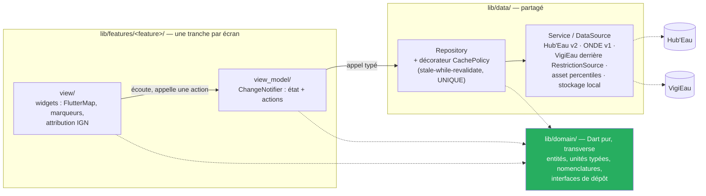

# ADR-014 — Feature-first + MVVM, à la place du CQRS léger

- **Statut :** **Accepté** — **arbitrage du commanditaire du 2026-09-13**
- **Date :** 2026-09-13
- **Remplace, sur le seul volet architecture applicative :** [`ADR-008`](ADR-008-cqrs-leger-et-cache-en-pipeline.md) (CQRS léger et cache en pipeline) et le § « L'architecture en couches est conservée » d'[`ADR-010`](ADR-010-react-native.md). Les deux ADR restent en place, statut annoté en tête — on ne supprime pas un artefact.
- **N'affecte pas :** `lib/domain/`, `lib/data/`, ni aucune règle métier. [`ADR-001`](ADR-001-api-hydrometrie-v2.md), [`ADR-002`](ADR-002-qualification-du-debit.md), [`ADR-003`](ADR-003-reference-percentiles-en-asset.md), [`ADR-004`](ADR-004-integration-vigieau.md), [`ADR-006`](ADR-006-onde-quatre-categories.md), [`ADR-007`](ADR-007-ecarter-qualite-eau.md) sont intacts.

## Contexte

### Ce que T0 a construit

T0 est clos le 2026-09-13 (`v0.1.0`, **248 tests verts**, porte franchie sur Windows). Il a livré,
entre autres, une couche `lib/application/` fidèle à `ADR-008` :

| Fichier | Rôle |
|---|---|
| `messages.dart` | `Message<R>`, `Query<R>`, `Command<R>` en `abstract interface class`, plus trois requêtes |
| `bus.dart` | registre explicite `Map<Type, gestionnaire>`, sans bibliothèque de médiateur ni réflexion |
| `handlers.dart` | les gestionnaires, câblés dans `main.dart` |
| `cache_policy.dart` | `withCachePolicy`, stale-while-revalidate, **un seul endroit** |

L'écran carte n'appelait donc jamais son dépôt : il envoyait une `StationPointsWithinBoundsQuery`
au bus, via un `MapStationsController`.

### Ce que la relecture a montré

Trois constats, relevés dans le code de T0 :

1. **Le typage est perdu à l'envoi.** `Bus.register<M extends Message<R>, R>` efface le type dans
   une fermeture ; `Bus.send<R>` conclut par un `response as R`. Un `R` incohérent entre le message
   et son gestionnaire **ne se voit pas à l'enregistrement** : il se paie en **`TypeError` à
   l'exécution**. Le commentaire de `bus.dart` le dit déjà noir sur blanc. C'est l'inverse de ce que
   ce projet attend de son outillage — `CLAUDE.md` demande qu'un oubli soit une **erreur de
   compilation**, et `BR-011` en fait une règle.
2. **Une dépendance de couche part à l'envers.** `lib/application/handlers.dart` importe
   `package:martinpecheur/features/map/viewport_filter.dart` : la couche censée être en amont
   dépend d'une tranche d'écran. Rien ne l'interdisait, aucun test ne le voyait.
3. **Le bus est une indirection sans bénéfice ici.** Pas de backend, presque aucune écriture
   (les commandes de `ADR-008` — favori, acquittement, dernière vue — sont toutes locales et
   encore à écrire), **une seule forme de lecture**, et un seul gestionnaire par requête. Le
   registre n'apporte ni découplage utile, ni découverte, ni pipeline : le décorateur de cache,
   lui, n'a jamais eu besoin du bus pour être unique.

Le motif qui avait fait retenir CQRS dans `ADR-008` était **« la politique de cache doit vivre
quelque part »**. Ce motif est satisfait sans bus : un décorateur de **dépôt** est aussi unique
qu'un décorateur de gestionnaire.

### Ce que l'équipe Flutter recommande

Lu le **2026-09-13** sur [docs.flutter.dev/app-architecture](https://docs.flutter.dev/app-architecture)
et [docs.flutter.dev/app-architecture/guide](https://docs.flutter.dev/app-architecture/guide) :
le guide découpe l'application en **deux couches**, *UI layer* (**views** et **view models**) et
*Data layer* (**repositories**, source de vérité qui produit les *domain models*, et **services**,
qui enveloppent un endpoint et rendent des `Future`/`Stream`). Le flux est
**View → ViewModel → Repository → Service**, une *view* pour un *view model*, et une *domain layer*
de *use-cases* est présentée comme **optionnelle**. Le guide annonce explicitement que la logique
d'interface se teste **indépendamment des widgets**.

> ⚠️ Deux précisions, pour ne pas se tromper de vocabulaire :
> le guide appelle **commands** les rappels qu'un *view model* expose à sa *view* — ce n'est **pas**
> la `Command` de `ADR-008`, qui était un message. Et le guide **ne prescrit aucune** bibliothèque
> d'état : `ChangeNotifier` est notre choix, pas une obligation du guide.

## Décision

**Feature-first + MVVM**, l'architecture recommandée par l'équipe Flutter, **zéro bibliothèque
d'état** : `ChangeNotifier` est fourni par le framework.

- **View** = widgets. Elle branche, elle affiche, elle ne décide pas. Elle **n'appelle jamais un
  dépôt** : elle passe par son ViewModel.
- **ViewModel** = un `ChangeNotifier` **par écran**. Il expose l'état de l'écran et ses actions, et
  appelle les dépôts par des **appels typés** — vérifiés à la compilation, plus aucun `as R`.
- **Repository / Service** vivent dans `lib/data/`, inchangés. Le dépôt reste la source de vérité ;
  le service enveloppe la source distante, l'asset ou le stockage local.
- **`lib/domain/`** est **inchangé** : Dart pur, transverse, ne dépend de rien. C'est là que vivent
  les invariants et l'essentiel des tests — rien de ce qui suit ne les touche.
- **`CachePolicy` devient un décorateur de dépôt**, dans `lib/data/`. Le principe « un seul
  endroit » survit ; seul le point d'accrochage change.
- Le *domain layer* de *use-cases* du guide reste **écarté** : six cas d'usage, aucun n'orchestre
  plusieurs dépôts pour l'instant. À réintroduire si un écran le réclame, pas avant.



### Disposition cible

```
lib/
  features/<feature>/view/        ← widgets (map/ d'abord)
  features/<feature>/view_model/  ← ChangeNotifier, aucun widget importé
  data/                           ← dépôts, services, décorateur CachePolicy
  domain/                         ← Dart pur, transverse
  main.dart                       ← câble dépôts et ViewModels
```

`lib/application/` **disparaît**.

### La règle des imports, et son verrou

Un test d'architecture, `test/architecture/layers_test.dart`, refuse :

| Interdit | Motif |
|---|---|
| `lib/data/` → `lib/features/` | c'est le défaut relevé sur `handlers.dart` : une couche partagée ne dépend jamais d'une tranche d'écran |
| `lib/domain/` → quoi que ce soit d'infrastructure | invariant existant, déjà tenu par `domain_isolation_test.dart` |
| un `view_model` → `package:flutter/material.dart` ou `widgets.dart` | **un ViewModel ne connaît pas de widget** ; c'est ce qui le rend testable sans rendu |

Dart n'offre aucun lint de restriction d'import par dossier : ce test est le **seul** verrou
mécanique, et il tourne à chaque `flutter test`.

## Conséquences

**Ce qui est retiré** — `lib/application/messages.dart`, `bus.dart`, `handlers.dart` et leurs
tests. Avec eux disparaissent `Message<R>`, `Query<R>`, `Command<R>`, le registre `Map<Type,
gestionnaire>` et le `response as R` qui le concluait.

**Ce qui reste** — tout le reste. `lib/domain/` et `lib/data/` ne bougent pas, les mappers non plus,
la conversion d'unités reste à son unique endroit, et `withCachePolicy` garde son comportement :
seul son dossier change.

- ➕ **Le typage redevient statique.** Un écran qui demande la mauvaise chose ne compile pas, au lieu
  de lever un `TypeError` sous les yeux de l'usager.
- ➕ **Une tranche est lisible de bout en bout** : `features/map/view` et `features/map/view_model`,
  au lieu d'un écran dont la moitié de la logique est rangée deux dossiers plus haut.
- ➕ **Le sens des dépendances est verrouillé**, pas seulement écrit : le défaut
  `application → features` n'aurait pas survécu à `layers_test.dart`.
- ➕ **Un ViewModel se teste sans rendu** — on observe un `ChangeNotifier`, on ne monte pas de
  `FlutterMap`. C'est déjà ce que faisait `MapStationsController` ; MVVM en fait la norme.
- ➕ **Alignement sur la recommandation de l'éditeur du framework**, donc sur la documentation, les
  exemples et les futures recrues du projet.
- ➖ **Du code de T0 est jeté** : trois fichiers d'application et leurs tests, écrits et verts le
  jour même. Le socle domaine et données, lui, est intégralement conservé.
- ➖ **Un réusinage en ouverture de T1**, avant la première fiche station. Coût estimé : une
  demi-journée.
- ➖ `ChangeNotifier` **notifie sans dire quoi** : un écran chargé peut se reconstruire plus que
  nécessaire. Le remède est de découper les ViewModels par écran et d'écouter finement, pas
  d'ajouter une bibliothèque.
- ➖ Les écritures locales à venir (favori, acquittement, dernière vue) n'ont plus de type commun.
  Elles deviennent des **méthodes de dépôt** appelées par un ViewModel — ce qui est exactement ce
  que `ADR-008` refusait, et que l'absence de backend rend acceptable.

## Alternatives écartées

- **Garder le bus `Map<Type, gestionnaire>`.** C'est la position de `ADR-008`, et elle a été tenue
  jusqu'au bout de T0. Écartée : le bénéfice annoncé — cache unique, dépôts bêtes — s'obtient sans
  lui, et le prix est un typage perdu à l'envoi plus une couche de plus à traverser pour une seule
  forme de lecture. Ce n'est pas un mauvais patron, c'est un patron sans emploi ici.
- **MVVM avec une bibliothèque de gestion d'état.** Deux candidats existent et sont largement
  employés dans l'écosystème — `provider` et `riverpod` — et **aucun des deux n'est recommandé
  ici** : ils ne sont ni évalués, ni vérifiés sur `pub.dev` pour ce projet (version, licence,
  Windows, date de publication), et `ChangeNotifier` + `ListenableBuilder` couvrent le besoin
  constaté sans rien ajouter. `CLAUDE.md` exige une preuve avant toute dépendance ; il n'y en a
  pas. À réexaminer si un écran devient ingérable sans injection de portée.
- **Clean Architecture en couches strictes, avec des cas d'usage.** Une couche `application/` de
  *use-cases* (un objet par intention, appelé par le ViewModel) garderait la séparation sans le bus.
  Écartée : c'est la *domain layer* que le guide Flutter annonce **optionnelle**, et sur six cas
  d'usage dont aucun n'orchestre plusieurs dépôts, elle ajouterait une classe par écran pour
  déléguer immédiatement. Elle redeviendra la bonne réponse le jour où un écran croisera
  hydrométrie, écoulement et restrictions — et elle se réintroduira alors **entre** ViewModel et
  dépôt, sans rien défaire de cette décision.
- **Passer les dépôts directement aux widgets, sans ViewModel.** Le moins de cérémonie possible,
  mais l'état d'écran retourne dans des `State` de widgets, et la logique redevient intestable sans
  rendu. C'est l'erreur que `ADR-008` avait raison de refuser.

## Si la décision est revue

Cette décision est **arbitrée par le commanditaire** ; la section reste pour dire ce qu'il faudrait
défaire.

- Revenir à un bus suppose de recréer `messages.dart`, `bus.dart` et `handlers.dart` — ils sont dans
  l'historique git, sous le tag `v0.1.0` — et de réintroduire l'effacement de type. Les ViewModels
  deviendraient des émetteurs de messages ; leur état et leurs tests ne changeraient pas.
- **Ce qui n'est pas impacté, quoi qu'il arrive :** `lib/domain/`, `lib/data/`, les mappers, la
  conversion d'unités, les 14 règles métier, les 6 cas d'usage et les fiches de sources. Le produit
  ne change pas ; seule la façon dont un écran demande une donnée change.
- `CachePolicy` est le seul composant à double appartenance : décorateur de dépôt ici, décorateur de
  gestionnaire dans `ADR-008`. Son comportement — stale-while-revalidate, déduplication des
  rafraîchissements en vol, dernière valeur conservée en cas d'échec — est indépendant des deux.

## Liens

- Remplacés sur le volet architecture : [`ADR-008`](ADR-008-cqrs-leger-et-cache-en-pipeline.md),
  [`ADR-010`](ADR-010-react-native.md)
- Conception : [`03-conception.md § 2`](../03-conception.md) · carte des contextes :
  [`context-map.md`](../context-map.md) · étages de test :
  [`plan-de-tests.md`](../plan-de-tests.md)
- Règles portées par le décorateur de cache : [`BR-001`](../br/BR-001-date-de-mesure-obligatoire.md),
  [`BR-005`](../br/BR-005-donnee-perimee-signalee.md)
- Réusinage : plan T0, § « Suite immédiate de T0 »
  ([`2026-09-13-t0-socle-flutter.md`](../superpowers/plans/2026-09-13-t0-socle-flutter.md)),
  tâches `R1` à `R6`

**Source lue le 2026-09-13 :**
[Guide to app architecture](https://docs.flutter.dev/app-architecture/guide) ·
[App architecture](https://docs.flutter.dev/app-architecture)
