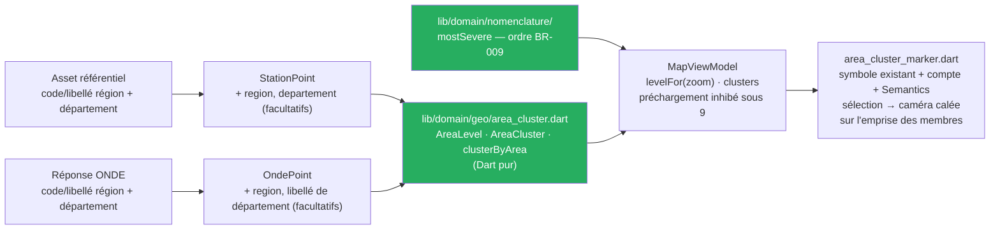

# ADR-015 — Regrouper les marqueurs par zone administrative sous le zoom 9

- **Statut :** **Accepté** — **arbitrage du commanditaire du 2026-09-22** (validé en deux sections : comportement, puis architecture)
- **Date :** 2026-09-22
- **Remplace, sous le zoom 9 seulement :** l'approche par défaut `F2c` d'[`ADR-013`](ADR-013-bascule-flutter-cible-windows.md) (§ « L'approche par défaut de la carte »). Au zoom 9 et au-delà, `F2c` est **inchangée**.
- **Amende :** [`04-ui.md § 4`](../04-ui.md) — les agrégats des niveaux national, régional et départemental sont des **zones administratives**, pas des regroupements par proximité.
- **N'affecte pas :** l'architecture ([`ADR-014`](ADR-014-feature-first-mvvm.md) — `lib/domain/` pur, les sept règles de couches), les règles métier ([`BR-009`](../br/BR-009-cluster-porte-l-etat-le-plus-severe.md) est **appliquée**, pas modifiée), la palette ([`04-ui.md § 2`](../04-ui.md), [`ADR-006`](ADR-006-onde-quatre-categories.md)), aucune dépendance (`pubspec.yaml` inchangé).

## Contexte

### `F2` n'a jamais été tranchée

| Date | Fait | Source |
|---|---|---|
| 2026-09-09 | **`F2` — 4 150 marqueurs regroupés par `flutter_map_marker_cluster` 8.2.2**, sur émulateur `Pixel_7` `x86_64` (commande donnée en `--profile`, mode non confirmé) : `raster p90` **16,2 ms** (budget ≤ 16,7 ms ✅), **`jank` 19 trames sur 213, soit 8,9 %** pour un seuil < 5 % ❌, `p99` **143,1 ms**. Rouge sur la règle fixée d'avance, **un seul relevé** | [`COMPTE-RENDU.md`](../../spike/porte_flutter/COMPTE-RENDU.md) § 2 |
| 2026-09-09 | Déduction **non vérifiée** du compte rendu : le coût est concentré sur quelques trames, vraisemblablement le **recalcul des regroupements** à chaque zoom ou l'animation de dégroupage | idem, « Ce que les chiffres de `F2` disent » |
| 2026-09-12 | Arbitrage : **`F2c` par défaut** — marqueurs du viewport plus une marge, **sans regroupement**, « tant qu'aucune mesure ne réhabilite le clustering ». `F2b` et `F2c` codées (`207edec`), **jamais mesurées** | [`ADR-013`](ADR-013-bascule-flutter-cible-windows.md) |
| 2026-09-18 | Android réactivé ; l'amendement d'`ADR-013` précise que **`F2` n'est pas rouverte** | `ADR-013`, amendement du 2026-09-18 |

`ADR-013` l'écrivait déjà : *au zoom national, la France entière est visible et les 4 150 stations
sont toutes dessinées. Ce n'est pas un défaut caché, c'est le coût de l'approche.*

### Ce que l'écran a montré le 2026-09-22

Le lot 3 de T1 a été **constaté à l'écran sur Windows** le 2026-09-22
([`project-state.md`](../project-state.md), point 36, « Vu aussi »). **Constat du commanditaire :**
au zoom national, `F2c` dessine les 4 150 pastilles de l'échelle « débit » (et les points ONDE de
l'emprise sur l'échelle « écoulement ») et les marqueurs se recouvrent en une **nappe illisible**.

### Le tap tombe au hasard entre marqueurs superposés (point 30)

Au zoom national, 4 150 zones de tap de 44 pt se chevauchent. `flutter_map` 8.3.2 empile les
marqueurs dans l'ordre de la liste (`lib/src/layer/marker_layer/marker_layer.dart` l. 101-177 du
paquet installé, lu le 2026-09-14) et le hit-test d'un `Stack` va du dernier au premier : le
marqueur qui reçoit le tap est **le plus tardif dans l'ordre de l'asset**, pas le plus proche du
doigt. `04-ui.md § 3` demande que deux marqueurs dont les zones de tap se chevauchent soient
regroupés. L'écart a été **accepté pour T1** par le commanditaire le 2026-09-18, « à reprendre avec
`X3` et `F2` » (`project-state.md`, point 30).

### Ce que les données portent déjà — vérifié le 2026-09-22

| Source | Constat |
|---|---|
| Asset `assets/referentiel/stations.json` (6 604 249 octets, 4 150 entités) | `code_region`, `libelle_region`, `code_departement`, `libelle_departement` présents sur **4 113** entités, absents ensemble sur les **37** autres. **18 régions** distinctes — 13 hexagonales, Corse comprise, et 5 d'outre-mer (Guadeloupe `01`, Martinique `02`, Guyane `03`, La Réunion `04`, Mayotte `06`) — et **101 départements**. Libellés en **capitales sans accent** (`OCCITANIE`, `PROVENCE-ALPES-COTE D'AZUR`, `LOIR-ET-CHER`). Aucun département n'est rattaché à deux régions. Occitanie (`76`) compte **753** stations |
| Les 37 entités sans rattachement | Stations transfrontalières (Rhin en Suisse et en Allemagne, Semois et Viroin en Belgique, Rhône et Léman en Suisse…) plus quatre stations françaises (deux sur la Liane à Boulogne-sur-Mer, deux en Corse). Elles sont **écartées des `Station`** (fiche, `stationsSkipped` = 37) mais **restent des `StationPoint`** : la carte les dessine (`main.dart` alimente la carte avec `stationsRead.points`, 4 150) |
| Réponse ONDE `/v1/ecoulement/observations` | Porte `code_region`, `libelle_region`, `code_departement`, `libelle_departement` quand `fields` ne les filtre pas : **30 lignes sur 30** dans `test/fixtures/onde/observations_bbox_loire_2026-09-13.json` (`24` « Centre-Val de Loire », libellés en casse mixte), **300 sur 300** dans `observations_departement_41_2026-09-13.json`. ⚠️ Les **trois** fixtures capturées **avec** `fields` (`observations_station_*_2026-09-14.json`) n'en portent aucun : la liste `_observationFields` de `lib/data/http/onde_uris.dart` ne les demande pas aujourd'hui |

## Décision

**Sous le zoom 9, la carte regroupe ses marqueurs par zone administrative ; au zoom 9 et
au-delà, `F2c` est inchangée.**

| Zoom `flutter_map` | Ce qui est dessiné |
|---|---|
| `zoom < 7` | **une pastille par région** |
| `7 ≤ zoom < 9` | **une pastille par département** |
| `zoom ≥ 9` | **marqueurs individuels** — `F2c`, viewport plus marge, inchangé |

- **Les seuils sont des constantes nommées**, ajustables après constat d'écran, jamais des nombres
  posés dans un `if`. Ils sont choisis sur un seul constat d'écran ; ils ne prétendent à rien de
  plus.
- **Membres d'une pastille** : pour les **stations**, l'asset **entier** (4 150 points, déjà en
  mémoire) — le compte et le barycentre sont vrais quel que soit le bord de l'écran ; pour **ONDE**,
  dont les données viennent du réseau par emprise, les points **chargés** pour la vue courante.
- **Position** : le **barycentre calculé des membres** — aucun centroïde administratif
  inventé ni recopié. Une région d'outre-mer tombe donc sur son territoire (La Réunion : barycentre
  de ses 51 stations, `-21,07 ; 55,52`).
- **Contenu d'une pastille** :
  - sur l'échelle **écoulement** : le **compte** des points et le **symbole existant** de l'état le
    plus sévère (`BR-009`) — À sec > Non visible > Écoulement faible > Écoulement ; « Non observé »
    et « Non renseigné » ne participent pas au classement et ne portent la pastille que si aucun
    membre n'est observé, « Non observé » avant « Non renseigné » (un fait de terrain avant notre
    ignorance d'un code, `BR-007`). Le symbole prend l'**âge** (`BR-010`) du membre **le plus
    récent** de la catégorie la plus sévère. **Aucune teinte, aucune forme nouvelle** : ce sont les symboles d'`ADR-006`
    et de `04-ui.md § 2`, déjà dessinés par `onde_marker.dart` ;
  - sur l'échelle **débit** : sans percentile (`ADR-003` hors T1), toute station est
    `Indéterminé` (`BR-004`) — le classement de `BR-009` n'a rien à départager. La pastille porte le
    **compte seul**, sur la forme ◇ neutre existante (`station_marker.dart`, `#767676`).
- **Sélection d'une pastille** : la caméra **se cale sur l'emprise de ses membres** (API de caméra
  de `flutter_map` 8.3.2 à lire dans le paquet installé) ; une emprise plate (un seul membre) centre
  la carte sur le barycentre au zoom 9.
  Elle n'ouvre **aucune fiche** (`BR-009` : « le tap sur un cluster zoome »).
- **Lecteur d'écran** : la pastille est un nœud unique, préfixé par l'échelle (`BR-008`) — par
  exemple « Écoulement : Centre-Val de Loire, 15 points d'observation sur cette vue, état le plus
  sévère : À sec » — « sur cette vue » parce que le compte ONDE ne porte que sur les points chargés —
  et « Débit relatif à l'historique : OCCITANIE, 753 stations ».
- **Un point sans région reste affiché individuellement**, à tous les zooms, sans rattachement
  inventé (`BR-007`). Aujourd'hui : les 37 `StationPoint` décrits ci-dessus, et toute ligne ONDE
  qui viendrait sans `code_region`.
- **Le préchargement des débits** (20 stations, 200 ms, `NFR-07`) n'a lieu **qu'au niveau
  individuel** : une pastille ne montre aucun état de station, précharger sous le zoom 9 serait du
  travail réseau sans destinataire à l'écran.

### Où cela vit — feature-first + MVVM, sans rien ajouter

- **Domaine, Dart pur** : `StationPoint` gagne sa région et son département, `OndePoint` sa
  région et le libellé de son département — **un seul type** de zone administrative (code et
  libellé), le même pour les deux niveaux et les deux points ; `lib/domain/geo/area_cluster.dart` porte `AreaLevel { region,
  departement }`, `AreaCluster` (zone, barycentre, compte, emprise des membres — nulle si plate) et la fonction pure
  `clusterByArea` ; `mostSevere(Iterable<FlowCategory>)` vit sous `lib/domain/nomenclature/`,
  `switch` exhaustif sur la `sealed class` (`BR-011`).
- **Données** : l'analyse de l'asset et le mapper ONDE lisent la région et le département — **champ facultatif**,
  une absence reste une absence. Le contrat `StationPointRepository` gagne `all()` : tous les
  points du référentiel, que le dépôt d'asset rend sans copie.
- **ViewModel** : `MapViewModel` reçoit le zoom avec l'emprise, expose `levelFor(zoom)` et
  `clusters` (vide au niveau individuel). Il dépend de `H2`, qui rapatrie le préchargement dans le
  ViewModel.
- **Vue** : `lib/features/map/view/area_cluster_marker.dart` — symbole existant, badge de compte,
  `Semantics` ; la sélection cale la caméra sur l'emprise des membres.

Précisions **acceptées par le coordinateur le 2026-09-22** : stations regroupées sur l'asset
entier (`all()`), ONDE sur les points chargés ; « Non observé » avant « Non renseigné » ; âge du
membre le plus récent de la catégorie la plus sévère ; libellés de zone tels que reçus.

Tâches : **lot 4 bis** du plan T1, `Z1` → `Z4`
([`2026-09-13-t1-fiche-station-et-avertissements.md`](../superpowers/plans/2026-09-13-t1-fiche-station-et-avertissements.md)).

## Conséquences

- ➕ **La carte redevient lisible au zoom national** : 18 pastilles régionales au plus (plus les
  points sans rattachement) au lieu de 4 150 marqueurs superposés.
- ➕ **Le point 30 est résolu sous le zoom 9** : une pastille par zone, plus de zones de tap
  empilées entre lesquelles le hasard de l'ordre de l'asset choisit. Au-delà du zoom 9, l'écart
  accepté le 2026-09-18 **demeure** là où des stations restent proches.
- ➕ **`BR-009` trouve enfin son porteur** : l'assec reste visible au zoom national, jamais noyé dans
  une moyenne.
- ➕ **Aucune dépendance ajoutée**, aucun recalcul de proximité à chaque trame : le rattachement est
  lu une fois dans la donnée, le regroupement est un simple partitionnement.
- ➖ **Une zone administrative n'est pas une zone hydrographique.** Un bassin versant traverse
  plusieurs départements ; la pastille dit « dans ce département », jamais « sur cette rivière ».
- ➖ **Sur l'échelle écoulement, la pastille ne compte que les points ONDE chargés** pour l'emprise
  de la requête : une région coupée par le bord de l'écran affiche un compte partiel et un
  barycentre décalé vers la partie visible. L'annonce le dit (« … sur cette vue »). Assumé et écrit,
  pas masqué. Les **stations**, elles, sont regroupées sur l'asset entier : leur compte est vrai
  hors écran.
- ➖ **Sur l'échelle débit, la pastille ne dit que le compte** jusqu'à l'arrivée des percentiles
  (`ADR-003`, hors T1). Elle se couvrira de l'état le plus sévère le jour où il existera.
- ➖ **Les libellés de zone diffèrent de casse selon la source** : capitales sans accent dans l'asset
  (`OCCITANIE`), casse mixte accentuée dans ONDE (`Centre-Val de Loire`). Ils sont affichés **tels
  que reçus** ; une table de correspondance serait une donnée inventée, non vérifiée par appel.
- ➖ **Les seuils 7 et 9 viennent d'un constat d'écran**, sur Windows, à une taille de fenêtre. Ils
  se révisent sur constat, pas sur opinion.
- ➖ **`NFR-01` reste non mesuré** : ce regroupement ne réhabilite ni ne condamne rien de `F2`. La
  mesure `X3` se fait **avec** le regroupement en place.

## Alternatives écartées

- **A — Garder `F2c` à tous les zooms.** C'est l'état actuel. Écarté : illisible au zoom national,
  constaté à l'écran le 2026-09-22, et le point 30 y reste entier.
- **B — Regroupement par proximité, via une bibliothèque** (`flutter_map_marker_cluster`, liée au
  spike en 8.2.2). Écarté : **ajout de dépendance** (vérification `pub.dev` et arbitrage requis), et
  c'est précisément l'approche **mesurée au rouge** — jank 8,9 % au seuil de 5 %, `p99` 143 ms.
  Le regroupement par proximité recalcule ses groupes à chaque zoom ; le rattachement
  administratif ne se calcule jamais, il se lit.
- **C — Un seuil de zoom en dessous duquel rien n'est dessiné, avec un message** (« Zoomez pour
  voir les stations »). Écarté : **masque les assecs** au zoom national — exactement ce que `BR-009`
  interdit — et une carte vide se lit comme « rien à signaler » (`BR-007`).
- **D — Attendre la mesure `X3`** avant de décider. Écarté : `X3` mesure la **fluidité**, pas la
  **lisibilité** ni l'ambiguïté du tap ; aucun chiffre de trame ne rendra lisibles 4 150 marqueurs
  superposés. La mesure se fait après, sur la carte telle qu'elle sera livrée.

## Si la décision est revue

Cette décision est **arbitrée par le commanditaire** ; la section reste pour dire ce qu'il faudrait
défaire.

- **Ajuster un seuil** : changer une constante nommée et ses cas de test aux bornes (6,9 / 7 / 8,9 /
  9). Rien d'autre.
- **Revenir à `F2c` partout** : `MapViewModel.levelFor` rend toujours le niveau individuel, la vue
  cesse de dessiner les pastilles. Les champs de région et de département de `StationPoint` et
  d'`OndePoint` peuvent rester — ils ne coûtent rien et ne mentent pas.
- **Passer au regroupement par proximité** (option B) : suppose un arbitrage de dépendance et une
  remesure de `F2b`. `mostSevere` et `area_cluster_marker.dart` se réemploient tels quels ;
  `clusterByArea` serait remplacé.
- **Ce qui n'est pas impacté, quoi qu'il arrive :** `BR-009` (l'ordre de sévérité ne dépend pas de la
  forme du regroupement), la palette, la fiche station, la fiche ONDE, le niveau individuel au-delà
  du zoom 9.

## Liens

- Remplace sous le zoom 9 : [`ADR-013`](ADR-013-bascule-flutter-cible-windows.md), approche `F2c`
- Amende : [`04-ui.md § 4`](../04-ui.md)
- Règles : [`BR-007`](../br/BR-007-absence-de-donnee-jamais-neutre.md),
  [`BR-008`](../br/BR-008-une-seule-echelle-a-la-fois.md),
  [`BR-009`](../br/BR-009-cluster-porte-l-etat-le-plus-severe.md),
  [`BR-011`](../br/BR-011-nomenclature-tolerante-a-l-inconnu.md)
- Mesure : [`COMPTE-RENDU.md`](../../spike/porte_flutter/COMPTE-RENDU.md), `F2` et `F2c`
- État : [`project-state.md`](../project-state.md), points 30 et 36
