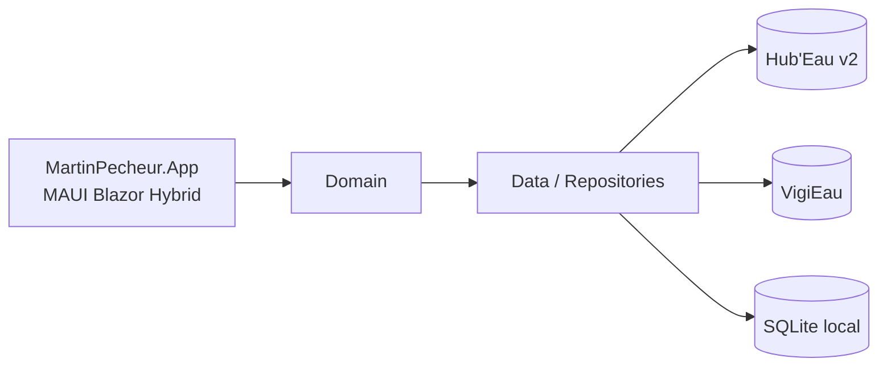

<!--
Copier ce fichier en `ADR-NNN-slug.md` (ex: ADR-008-cache-tuiles-mbtiles.md).
Modèle aligné sur ADR-001. Supprimer ces commentaires une fois rempli.
-->

# ADR-NNN — Titre de la décision

- **Statut :** Proposé | Accepté | Remplacé par ADR-0xx | Déprécié
- **Date :** AAAA-MM-JJ

## Contexte

Le problème à trancher, les forces en jeu (contraintes, coût, équipe, échéances).
Factuel — pas encore de décision ici.

> Règle propre à ce projet : tout fait relatif à une API publique est **vérifié par appel
> réel** et **daté**. Un fait non vérifié est signalé comme tel. On ne spécifie jamais
> d'après une documentation seule.

## Décision

Ce qu'on choisit, énoncé clairement et au présent. Lister les points concrets.

<!-- Intégrer un diagramme mermaid ICI si un schéma complète la décision (composants, flux) -->

## Conséquences

- ➕ Bénéfices obtenus.
- ➖ Coûts / dettes / risques acceptés.

## Alternatives écartées

- **Option X** : pourquoi non.
- **Option Y** : pourquoi non.

## Si la décision est revue

Ce qu'il faut défaire, et ce qui n'est **pas** impacté.
Section obligatoire pour toute décision tranchée sans arbitrage du commanditaire.
