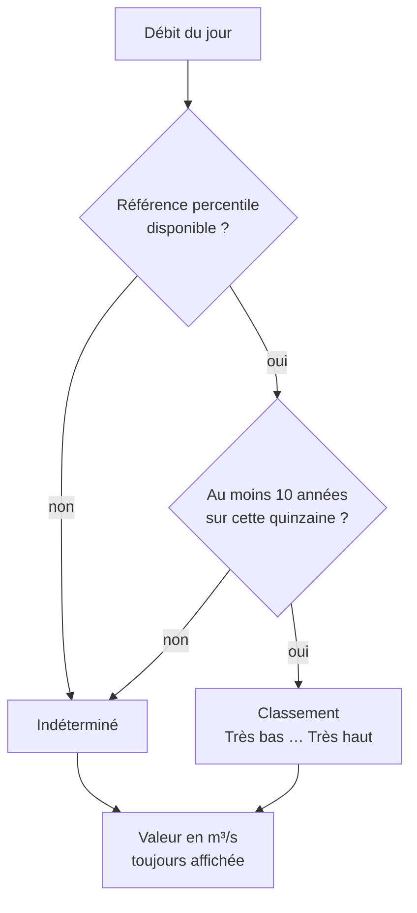

# BR-004 — Historique insuffisant : le niveau est « Indéterminé »

- **Statut :** Accepté
- **Date :** 2026-07-30
- **Contexte borné :** Hydrometrie

## Règle

> Une station comptant **moins de 10 années** de relevés sur la quinzaine calendaire
> considérée est classée **« Indéterminé »**. Son niveau n'est jamais approximé,
> extrapolé, ni emprunté à une station voisine.

## Justification

Un percentile calculé sur 3 ou 4 années n'a pas de sens statistique : la variabilité interannuelle des débits d'étiage est telle qu'un tel échantillon produirait des classements arbitraires. Afficher « Très bas » sur cette base serait un faux signal, sur une donnée que l'usager traiterait comme une alerte.

Le seuil de 10 ans est un choix de prudence, pas une norme hydrologique. Il est explicite et ajustable.

## Invariants & cas limites

- Le décompte porte sur la **quinzaine calendaire** considérée, pas sur l'historique total : une station ouverte en 1990 mais sans relevés d'août reste « Indéterminé » en août.
- « Indéterminé » est un **état affiché**, avec sa forme et son libellé propres (`04-ui.md § 2`, échelle 2) — jamais une absence de marqueur.
- Le libellé long l'explique : *« Pas assez de mesures passées à cette station pour situer la valeur d'aujourd'hui. »*
- La valeur de débit **reste affichée** : c'est la qualification qui est indéterminée, pas la mesure.
- Aucune interpolation spatiale. Deux stations sur le même cours d'eau ne se prêtent pas leur historique.

## Vérifiable par

Test unitaire sur le classificateur : `NbAnnees = 9` renvoie `Indetermine` quelle que soit la valeur ; `NbAnnees = 10` classe normalement. Test aux bornes.

## Liens

- Use cases : `UC-003`
- ADR liés : `ADR-002`, `ADR-003`
- Voir aussi : `BR-003`, `BR-007`
