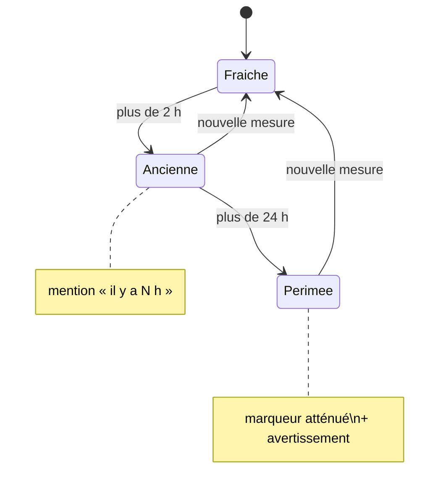

# BR-005 — Une donnée périmée est signalée et visuellement atténuée

- **Statut :** Accepté
- **Date :** 2026-07-30
- **Contexte borné :** Hydrometrie · Carte

## Règle

> Une observation de plus de **2 heures** est signalée « ancienne ».
> Au-delà de **24 heures**, le marqueur est **visuellement atténué** et la valeur est
> assortie d'un avertissement explicite indiquant depuis quand la station n'a rien
> transmis.

## Justification

Hub'Eau annonce une mise à jour toutes les 5 minutes, mais la réalité mesurée le 2026-07-30 va de **7 minutes à 9 jours** selon la station (voir `BR-001`). Une valeur de 9 jours affichée à l'identique d'une valeur de 7 minutes laisse croire à un état courant.

L'atténuation visuelle porte l'information **avant la lecture du texte** : sur une carte parcourue du regard, la dégradation graphique est le seul signal qui passe.

## Invariants & cas limites

- L'âge se calcule sur `date_obs`, **jamais** sur la date de récupération.
- Les seuils s'appliquent aux observations hydrométriques temps réel. Les observations ONDE relèvent de `BR-010` — une campagne de 3 semaines est normale, pas périmée.
- En mode hors ligne, l'atténuation s'applique de la même façon : l'absence de réseau n'excuse pas l'absence de signalement.
- L'atténuation ne doit pas dégrader le contraste sous les seuils de `04-ui.md § 3` : elle réduit la saturation, pas la lisibilité.
- Une station sans aucune observation n'est pas « périmée » : voir `BR-007`.

## Vérifiable par

Test unitaire sur le calcul d'âge aux bornes : 1 h 59 → fraîche, 2 h 01 → ancienne, 23 h 59 → ancienne, 24 h 01 → périmée. Test visuel de non-régression sur le contraste du marqueur atténué.

## Liens

- Use cases : `UC-003`, `UC-005`
- ADR liés : `ADR-001`
- Voir aussi : `BR-001`, `BR-010`
