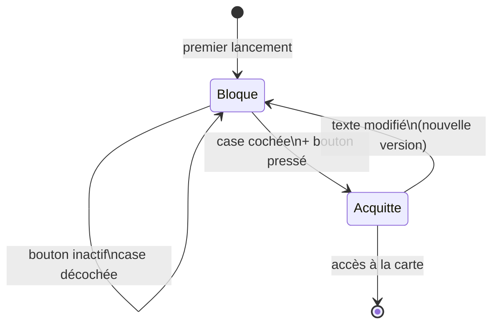

# BR-012 — L'avertissement initial exige un acquittement explicite

- **Statut :** Accepté
- **Date :** 2026-07-30
- **Contexte borné :** Avertissement

## Règle

> Au premier lancement, l'application affiche un écran **bloquant** présentant les
> limites des données. L'accès n'est ouvert qu'après une action **explicite et
> délibérée** : une case à cocher, puis un bouton qui reste inactif tant qu'elle ne
> l'est pas.

## Justification

Le produit informe sur une ressource dont l'état conditionne des décisions d'irrigation, de navigation, de baignade et de franchissement. Les données sont partielles, non validées en temps réel, et **ne reflètent ni les lâchers ni les manœuvres de barrages**.

Un bandeau seul serait ignoré. L'acquittement n'est pas un artifice juridique : c'est le seul moment où l'usager lit réellement les limites, avant d'avoir une carte sous les yeux.

## Invariants & cas limites

- Le bouton est **désactivé** tant que la case n'est pas cochée. Pas de pré-cochage.
- Le libellé du bouton engage : **« J'ai compris ces limites »**, jamais « OK », « Continuer » ni « Fermer ».
- Aucune fonctionnalité n'est accessible avant acquittement — y compris par lien profond ou notification.
- L'acquittement est **persistant** : il n'est pas redemandé à chaque lancement.
- Il est **redemandé** si le texte de l'avertissement change de façon substantielle : la version acquittée est stockée, pas un simple booléen.
- Un lien « Relire le détail des sources » est disponible depuis l'écran, et reste accessible ensuite depuis « D'où vient cette donnée ? ».
- L'écran est accessible au lecteur d'écran, et le texte n'est jamais tronqué à 200 % de taille de police.

## Vérifiable par

Test d'interface : le bouton est inactif à l'ouverture ; il s'active au cochage ; la navigation vers la carte est impossible avant acquittement. Test de persistance : relancer l'app ne réaffiche pas l'écran ; incrémenter la version du texte le réaffiche.

## Liens

- Use cases : `UC-006`
- Écran : [`04-ui.md § 1`](../04-ui.md) et [`§ 5`](../04-ui.md)
- Voir aussi : `BR-013`, `BR-014`
