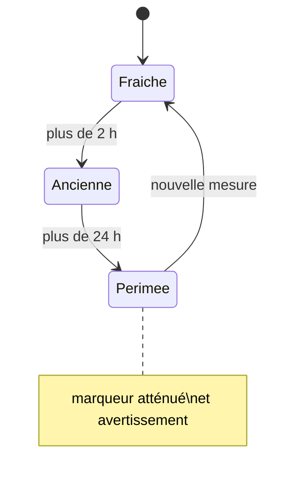

<!--
Copier ce fichier en `BR-NNN-slug.md` (ex: BR-015-purge-cache-tuiles.md).
Une règle métier = un fichier. Supprimer ces commentaires une fois rempli.
-->

# BR-NNN — Titre court de la règle

- **Statut :** Proposé | Accepté | Remplacé par BR-0xx
- **Date :** AAAA-MM-JJ
- **Contexte borné :** Referentiel | Hydrometrie | Ecoulement | Restrictions | Carte | Avertissement

## Règle

> Énoncé impératif, sans ambiguïté, formulé côté métier (pas d'implémentation).
> Ex : « Aucune valeur mesurée n'est affichée sans sa date de mesure. »

## Justification

Pourquoi cette règle existe : raison métier, contrainte produit, ou enjeu de
responsabilité. Sur ce projet, beaucoup de règles existent parce qu'une donnée mal
présentée peut induire une décision d'irrigation ou de sécurité. Le dire explicitement.

## Invariants & cas limites

- Quand la règle s'applique-t-elle ? Quand **ne** s'applique-t-elle **pas** ?
- Que se passe-t-il à la violation ? (rejet, message, état d'erreur)
- Valeurs frontières / égalités / collections vides.

<!-- Intégrer un diagramme mermaid ICI si un schéma complète la règle (ex. cycle de vie) -->

## Vérifiable par

Le test qui prouve la règle. Une règle non testable est une intention, pas une règle.

## Liens

- Use cases concernés : `UC-0xx`
- ADR liés : `ADR-0xx`
- Contrainte d'API associée : `C-xx` (voir [`01-analyse.md`](../01-analyse.md))
