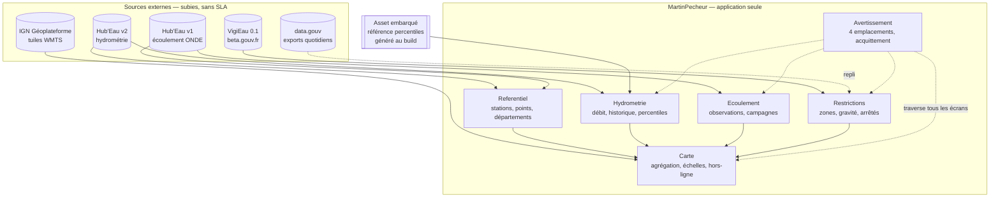

# Carte des contextes

Six contextes bornés, aucun backend. Toutes les sources sont des **APIs publiques
externes**, sans authentification et **sans SLA** — le contrat est subi, jamais négocié.

## Relations entre contextes

| Amont → Aval | Nature | Contrat |
|---|---|---|
| `Referentiel` → `Carte` | Fournisseur | Position et identité des points. Quasi-statique |
| `Hydrometrie` → `Carte` | Fournisseur | Échelle 2 (niveau de débit) |
| `Ecoulement` → `Carte` | Fournisseur | Échelle 1 (écoulement) |
| `Restrictions` → `Carte` | Fournisseur | Échelle 3 (sévérité sécheresse) |
| `Avertissement` → tous | **Transverse, non négociable** | Aucun écran ne s'affranchit de `BR-012` / `BR-013` |
| Asset percentiles → `Hydrometrie` | Fournisseur, lecture seule | Généré hors application (`ADR-003`) |

**Les trois échelles ne fusionnent jamais** (`BR-008`) : un fait observé, une statistique
et une décision préfectorale sont trois natures distinctes.

## Couches anticorruption

| Source | Protection | Motif |
|---|---|---|
| VigiEau | **`IRestrictionSource`**, deux implémentations | API en version `0.1` sur `beta.gouv.fr`, rupture possible sans préavis (`ADR-004`) |
| Hub'Eau | Mappers dédiés par endpoint | Unités trompeuses, nomenclatures incomplètes, doublons site/station (`BR-002`, `BR-011`) |
| Toutes | `BR-011` — branche par défaut obligatoire | Sources publiques sans engagement de stabilité |

## Ce qui n'existe pas, et pourquoi

| Absent | Motif |
|---|---|
| Backend, base serveur | Hors périmètre v1. Contourné par un asset généré au build (`ADR-003`) |
| Compte utilisateur | Hors périmètre v1. Les favoris sont locaux |
| Catalogue d'événements | Aucun événement de domaine, aucun event sourcing, aucune projection. Le CQRS d'[`ADR-008`](adr/ADR-008-cqrs-leger-et-cache-en-pipeline.md) se limite à `IQuery`/`ICommand` + handlers + pipeline : il n'introduit **pas** d'`IEvent` |
| Contexte `Qualite` | Écarté (`ADR-007`) |
