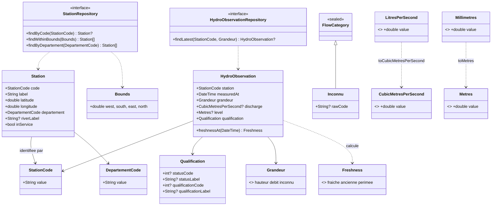

# Modèle de domaine

**Statut** : Accepté · **2026-09-13**

**Portée** : ce document décrit ce qui est **écrit** sous `lib/domain/` à la fin de T0 (D7
compris) — pas une cible, un état. Le vocabulaire suit `docs/glossary.md`.

⚠️ Ce document décrit le **code**, pas la persistance. `docs/03-conception.md § 3` nomme une
table `ObservationHydro` portant `ValeurM3S` ; le code porte `HydroObservation` et
`CubicMetresPerSecond`. Les deux vocabulaires coexistent volontairement — l'un décrit un futur
schéma de stockage, l'autre le domaine Dart.

## Objets-valeur

Immuables, sans identité — deux instances aux mêmes champs sont interchangeables.

| Type | Rôle |
|---|---|
| `LitresPerSecond`, `Millimetres`, `CubicMetresPerSecond`, `Metres` | Les quatre unités (`lib/domain/units/quantities.dart`). Aucune validation : elles **nomment**, elles ne refusent rien. `extension type` : s'effacent à l'exécution, ferment les deux sens (un `double` nu ne devient pas une unité), `.value` est la seule sortie explicite. |
| `StationCode` | Code station à dix caractères. Refuse un code site à huit caractères (`C-05`) — une classe, pas un `extension type`, parce qu'elle **valide**. |
| `DepartementCode` | Code département en chaîne. Refuse un entier déguisé : `"01"` interprété comme un nombre deviendrait `1`, et la Corse (`2A`/`2B`) rendrait la conversion impossible de toute façon. |
| `Qualification` | Statut et qualification d'une observation, transportés tels quels (`BR-006`) — aucun champ n'est interprété ni filtré ici. |
| `Bounds` | Emprise rectangulaire WGS 84. Refuse une emprise inversée (`west >= east` ou `south >= north`) à la construction. |

`StationCode`, `DepartementCode`, `Qualification` et `Bounds` sont des classes, et non des
`extension type` comme les unités, précisément **parce qu'elles valident**.

## Nomenclatures closes

`sealed class` ou `enum` + `switch` exhaustif : une branche par défaut est obligatoire
(`BR-011`), oublier un cas est une erreur de compilation.

- `Freshness` — fraîcheur d'une observation, calculée (`fraiche` / `ancienne` / `perimee`), sans
  objet propre.
- `Grandeur` — hauteur / débit / **`inconnu`** : un code non reconnu ne s'assimile jamais à
  `debit`, ce qui afficherait des mètres comme des m³/s.
- `FlowCategory` — sealed, branche par défaut `Inconnu`, porteur du code brut reçu (`rawCode`) —
  une valeur d'`enum` ne saurait pas le faire.

⚠️ `NonObserve` (fait de terrain constaté — code `4`) et `Inconnu` (notre propre ignorance d'un
code) restent deux branches distinctes (`BR-007`) : les confondre transformerait une absence de
mesure en un défaut d'implémentation, ou l'inverse.

## Entités

Identité + cycle de vie, à la différence des objets-valeur.

- **`Station`** — identité : `StationCode`. `riverLabel` peut être absent (`null`), jamais une
  chaîne vide (`BR-007`).
- **`HydroObservation`** — identité : `StationCode` + `measuredAt`. Jamais de valeur sans sa
  date de mesure (`BR-001`). `discharge` et `level` sont déjà convertis (`BR-002`) : aucun
  `double` nu. `null` ≠ zéro (`BR-007`) — un zéro mesuré est un assec, une absence est une
  absence. `level` traverse sans contrôle de signe : une hauteur négative est possible.

## Agrégats

- **Station observée** — racine `Station`, dernière observation connue par `Grandeur`. Une
  station sans observation est un état valide, affiché comme tel (`BR-007`) — jamais masqué.
- **Emprise** — racine `Bounds`, unité de chargement des stations : jamais les 4 150 d'un coup
  (`StationRepository.findWithinBounds`).

Il n'existe **pas** d'agrégat « état de la rivière » : écoulement (fait observé), débit
(statistique) et sécheresse (décision préfectorale) restent trois échelles séparées, jamais
fondues dans un champ unique (`BR-008`).

## Les unités, et le seul endroit où elles changent

`toCubicMetresPerSecond` et `toMetres` (`lib/domain/units/conversions.dart`) sont les deux
seules conversions du projet, dans un seul fichier (`BR-002`). Une absence en entrée reste une
absence en sortie (`BR-007`) ; une valeur non finie lève, ce n'est pas une absence mais un
défaut.

## Ce que le domaine ne contient pas

- Aucun type de réponse d'API — la traduction est au mapper (`data/`), pas ici.
- Aucun accès réseau, disque ou écran — verrouillé par
  `test/architecture/domain_isolation_test.dart`.
- Aucune politique de cache — un seul décorateur `CachePolicy`, en couche application.
- **Aucun seuil hydrologique** (`ADR-002`, `BR-003`) — la faute la plus grave possible sur ce
  produit.

## Diagramme

