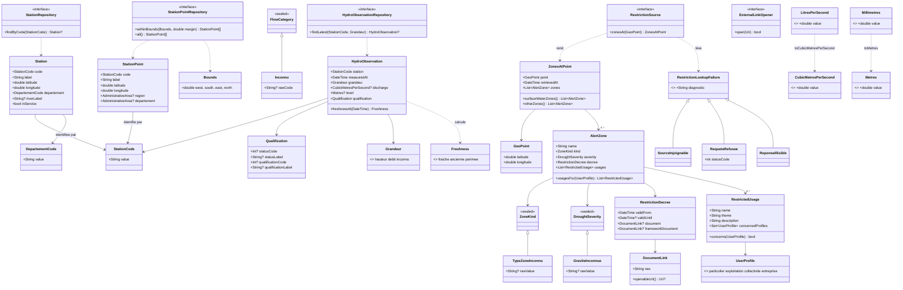

# Modèle de domaine

**Statut** : Accepté · **2026-09-13**

**Portée** : ce document décrit ce qui est **écrit** sous `lib/domain/` à la fin de T0 (D7
compris) — pas une cible, un état. Le vocabulaire suit `docs/glossary.md`.

⚠️ Ce document décrit le **code**, pas la persistance. `docs/03-conception.md § 3` nomme une
table `ObservationHydro` portant `ValeurM3S` ; le code porte `HydroObservation` et
`CubicMetresPerSecond`. Les deux vocabulaires coexistent volontairement — l'un décrit un futur
schéma de stockage, l'autre le domaine Dart.

## Objets-valeur

Immuables, sans identité — deux instances aux mêmes champs sont interchangeables.

| Type | Rôle |
|---|---|
| `LitresPerSecond`, `Millimetres`, `CubicMetresPerSecond`, `Metres` | Les quatre unités (`lib/domain/units/quantities.dart`). Aucune validation : elles **nomment**, elles ne refusent rien. `extension type` : s'effacent à l'exécution, ferment les deux sens (un `double` nu ne devient pas une unité), `.value` est la seule sortie explicite. |
| `StationCode` | Code station à dix caractères. Refuse un code site à huit caractères (`C-05`) — une classe, pas un `extension type`, parce qu'elle **valide**. |
| `DepartementCode` | Code département en chaîne. Refuse un entier déguisé : `"01"` interprété comme un nombre deviendrait `1`, et la Corse (`2A`/`2B`) rendrait la conversion impossible de toute façon. |
| `Qualification` | Statut et qualification d'une observation, transportés tels quels (`BR-006`) — aucun champ n'est interprété ni filtré ici. |
| `Bounds` | Emprise rectangulaire WGS 84 (`lib/domain/geo/bounds.dart`). Refuse une emprise inversée (`west >= east` ou `south >= north`) à la construction. Rangée sous `geo/` et non dans le fichier des contrats de dépôt : la vue en construit une à chaque relâchement de geste, et elle n'a pas à importer `StationRepository` pour cela. |
| `GeoPoint` | Point désigné par l'usager sur la carte (`lib/domain/geo/geo_point.dart`, T2). Refuse une latitude hors `[-90, 90]`, une longitude hors `[-180, 180]`, `NaN` ou une valeur infinie sur l'une ou l'autre — à la construction, aucun arrondi. Seule entrée géographique de T2 (Q1-A) : une paire de `double` nus ouvrirait la porte à une inversion latitude/longitude. |

`StationCode`, `DepartementCode`, `Qualification`, `Bounds` et `GeoPoint` sont des classes, et
non des `extension type` comme les unités, précisément **parce qu'elles valident**.

## Nomenclatures closes

`sealed class` ou `enum` + `switch` exhaustif : une branche par défaut est obligatoire
(`BR-011`), oublier un cas est une erreur de compilation.

- `Freshness` — fraîcheur d'une observation, calculée (`fraiche` / `ancienne` / `perimee`), sans
  objet propre.
- `Grandeur` — hauteur / débit / **`inconnu`** : un code non reconnu ne s'assimile jamais à
  `debit`, ce qui afficherait des mètres comme des m³/s.
- `FlowCategory` — sealed, branche par défaut `Inconnu`, porteur du code brut reçu (`rawCode`) —
  une valeur d'`enum` ne saurait pas le faire.

⚠️ `NonObserve` (fait de terrain constaté — code `4`) et `Inconnu` (notre propre ignorance d'un
code) restent deux branches distinctes (`BR-007`) : les confondre transformerait une absence de
mesure en un défaut d'implémentation, ou l'inverse.

Contexte Restrictions (`lib/domain/restrictions/`, T2) :

- `DroughtSeverity` — sealed, échelle 3 de `04-ui.md § 2` : `Vigilance`, `Alerte`,
  `AlerteRenforcee`, `Crise`, branche par défaut **`GraviteInconnue`**, porteuse de la valeur
  brute (`rawValue`). `droughtSeverityScale` rend les quatre niveaux dans l'ordre, **sans** la
  branche inconnue ; `droughtSeverityLabel` est le seul libellé de l'échelle (« Non renseigné »
  pour l'inconnue). **Aucun rang de sévérité** : T2 ne compare jamais deux zones (YAGNI).
- `ZoneKind` — sealed : `EauxSuperficielles` (`SUP`), `EauxSouterraines` (`SOU`), `EauPotable`
  (`AEP`), branche par défaut **`TypeZoneInconnu`**, porteuse de la valeur brute. Libellés
  fixés par la conception d'écran, pas ici.
- `UserProfile` — `enum` fermé (`particulier`, `exploitation`, `collectivite`, `entreprise`, ordre
  d'`UC-002`), **sans** branche inconnue : le profil est choisi par l'usager, jamais reçu d'une
  API — ce n'est pas un écart à `BR-011`.

Les branches inconnues s'appellent `GraviteInconnue` et `TypeZoneInconnu`, et non `Inconnu`,
déjà pris par `FlowCategory` : deux classes homonymes rendraient ambigu tout fichier qui importe
deux échelles. Branches connues égales **par type**, branches inconnues **par valeur brute**.

## Entités

Identité + cycle de vie, à la différence des objets-valeur.

- **`Station`** — identité : `StationCode`. `riverLabel` peut être absent (`null`), jamais une
  chaîne vide (`BR-007`).
- **`StationPoint`** — la **projection** de `Station` que la carte dessine : code, libellé,
  latitude, longitude, et depuis `ADR-015` (2026-09-22) `region` et `departement`
  (`AdministrativeArea?`, facultatifs) — le rattachement administratif que le regroupement de la
  carte utilise sous le zoom 9. Volontairement distincte de `Station` malgré tout : au zoom
  national les 4 150 points sont tous dessinés, et porter le cours d'eau ou l'état de service dans
  chacun ne servirait aucun pixel (`NFR-01`) — ce sont eux, pas la zone administrative, que
  `StationPoint` ne transporte pas. Son dépôt est `StationPointRepository`, séparé de
  `StationRepository` par ségrégation d'interface. `region`/`departement` valent `null` sur les 37
  stations sans rattachement du référentiel — jamais une zone inventée (`BR-007`).
- **`AdministrativeArea`** — un code et un libellé de zone administrative (région ou
  département), le même type des deux côtés (`ADR-015`). Ni `Station`, ni `Qualification` :
  aucune validation propre, elle ne fait que porter le couple une fois la valeur acceptée par
  `DepartementCode` (département) ou lue telle quelle (région, aucun type dédié).
- **`OndePoint`** — la projection du référentiel ONDE (écoulement) : code, libellé, coordonnées,
  cours d'eau, et depuis `ADR-015` `region` et `departement` en `AdministrativeArea?` (`departement`
  portait un `DepartementCode?` nu avant Z2 — un seul type de zone désormais, partagé avec
  `StationPoint`).
- **`HydroObservation`** — identité : `StationCode` + `measuredAt`. Jamais de valeur sans sa
  date de mesure (`BR-001`). `discharge` et `level` sont déjà convertis (`BR-002`) : aucun
  `double` nu. `null` ≠ zéro (`BR-007`) — un zéro mesuré est un assec, une absence est une
  absence. `level` traverse sans contrôle de signe : une hauteur négative est possible.

## Contexte Restrictions — la réponse datée au point (T2, M3)

Objets-valeur immuables, à égalité structurelle. Rien n'a de cycle de vie dans l'app : une
réponse est un **instantané daté**, pas une entité suivie — il n'y a donc pas d'agrégat à racine
persistante ici. Le seul regroupement porteur d'invariant est `ZonesAtPoint` (conception T2 § 2.3
et § 5). Toutes les collections (`usages`, `concernedProfiles`, `zones`) sont copiées et rendues
non modifiables à la construction ; l'égalité de liste et de set (et la validation UTC partagée)
sont écrites à la main dans `lib/domain/restrictions/value_equality.dart`, factorisées entre
`alert_zone.dart` et `zones_at_point.dart` — `package:flutter/foundation.dart` et
`package:collection` restent interdits ici comme partout sous `lib/domain/`.

- `DocumentLink` — un lien vers un PDF (arrêté ou arrêté-cadre), affiché **tel que reçu**
  (`raw`), jamais décodé ni « réparé » (`BR-014`) : l'adresse de Paris contient
  `sign%C3%83%C2%A9` et le reste. `openableUri` rend une `Uri` seulement pour une URL absolue en
  `http` ou `https` ; sinon `null` — le lien reste affiché, aucune action d'ouverture n'est
  proposée.
- `RestrictionDecree` — l'arrêté d'une zone : `validFrom` (non optionnel, `BR-001`), `validUntil`
  (optionnel), `document` et `frameworkDocument` (`DocumentLink?`). Les deux dates sont des dates
  calendaires vues à minuit **UTC** ; un `DateTime` local à la construction lève une
  `ArgumentError`.
- `RestrictedUsage` — un usage restreint, **cité tel quel** (`name`, `theme`, `description` :
  les mots du préfet, jamais reformulés — l'exception voulue à « aucune valeur brute d'API
  n'atteint la vue », qui vise les codes et les unités, pas une citation). `concernedProfiles`
  (`Set<UserProfile>`, non modifiable) et `concerns(UserProfile)` filtrent par profil.
- `AlertZone` — une zone d'alerte : `name`, `kind` (`ZoneKind`), `severity` (`DroughtSeverity`),
  `decree` (`RestrictionDecree`), `usages` (non modifiable, ordre de la source).
  `usagesFor(profile)` rend les usages qui concernent ce profil, dans l'ordre de la source, sans
  tri ni dédoublonnage. Aucun `id`, aucun `code`, aucun `departement` : aucune US de T2 ne les
  affiche.
- `ZonesAtPoint` — la réponse au point : `point` (`GeoPoint`), `retrievedAt` (instant UTC de la
  réponse, voyage **avec** la valeur et non dans le cache, `AR-3`), `zones` (non modifiable, vide
  = « aucune zone », `BR-007`). `surfaceWaterZones` et `otherZones` forment une **partition sans
  perte** de `zones` : `surfaceWaterZones` isole les zones `EauxSuperficielles` dans l'ordre de
  la source, `otherZones` garde toutes les autres dans un **ordre fixe par type**
  (`EauxSouterraines`, puis `EauPotable`, puis `TypeZoneInconnu`) et dans l'ordre de la source à
  l'intérieur d'un même type. **Aucun tri par sévérité** : chaque zone régit ses propres usages,
  rien ne fonde une zone « principale » (`Q5-B`).
- `RestrictionSource` — le contrat qui rend un `ZonesAtPoint` pour un `GeoPoint` (T2, M4). Passé au
  domaine depuis `lib/data/` (`ADR-014`, règle `features-vers-data`) : un ViewModel ne pouvait pas
  l'importer autrement. L'ancienne couture `lib/data/restrictions/restriction_source.dart`
  (`SurfaceWaterRestriction`, `ADR-004` T0) est supprimée par cette tâche — elle n'avait aucun
  appelant. `RestrictionSource` garde son nom : cité dans l'invariant de `CLAUDE.md`, `ADR-004` et
  `context-map.md` ; « source » dit ce que les autres dépôts ne disent pas, la frontière d'un
  service externe en version 0.1 (`C-16`).
- `RestrictionLookupFailure` — `sealed class`, fermée à **trois** branches (`BR-011`) : un `switch`
  exhaustif est une erreur de compilation tant qu'une branche manque. Toujours **levée**, jamais
  rendue comme une valeur : `withCachePolicy` n'écrit en cache que ce que `load` rend, jamais ce
  qu'il lève — un échec rendu serait servi jusqu'à expiration de la clé. « Aucune zone » n'est pas
  un échec : `200 []` rend un `ZonesAtPoint` à `zones` vide (`BR-007`).
  - `SourceInjoignable` — la source n'a pas répondu : panne réseau/TLS, ou `429`/`5xx` persistant
    après les rejeux du transport partagé.
  - `RequeteRefusee` — la source a répondu mais a refusé ce point : `statusCode` porte le statut
    HTTP tel que reçu (`400`, `404`, `409`…).
  - `ReponseIllisible` — la réponse ne se laisse pas lire : corps non JSON, racine non tableau, ou
    champ obligatoire absent/mal typé (§ 4.4, tout ou rien — `AR-2`).
- `ExternalLinkOpener` — le port d'ouverture d'une adresse **hors de l'application** (T2, `B2`) :
  `open(Uri) → Future<bool>`, vrai si la plateforme a accepté d'ouvrir. Déclaré dans le domaine
  (`lib/domain/links/`) pour qu'un ViewModel l'appelle sans importer la bibliothèque ; implémenté
  sous `lib/data/links/` autour de `url_launcher`, choisi par `main.dart`. Un échec d'ouverture
  est un **résultat** (`false`), jamais une exception : l'adresse brute reste à l'écran
  (`UC-002 A6`).

## Agrégats

- **Station observée** — racine `Station`, dernière observation connue par `Grandeur`. Une
  station sans observation est un état valide, affiché comme tel (`BR-007`) — jamais masqué.
- **Emprise** — racine `Bounds`, unité de chargement des points de carte : jamais les 4 150 d'un
  coup (`StationPointRepository.withinBounds`, marge proportionnelle comprise).
  `StationRepository` ne porte **plus** de recherche par emprise ni par département depuis la
  relecture du 2026-09-13 : rien ne les appelait, et la carte lit des `StationPoint`, pas des
  `Station` complètes. `StationPointRepository` gagne `all()` (`ADR-015`, 2026-09-22) : tous les
  points du référentiel, sans filtre d'emprise — le regroupement par zone administrative porte
  sur l'asset entier, pour que le compte et le barycentre d'une pastille ne dépendent pas du bord
  de l'écran.

Il n'existe **pas** d'agrégat « état de la rivière » : écoulement (fait observé), débit
(statistique) et sécheresse (décision préfectorale) restent trois échelles séparées, jamais
fondues dans un champ unique (`BR-008`).

## Les unités, et le seul endroit où elles changent

`toCubicMetresPerSecond` et `toMetres` (`lib/domain/units/conversions.dart`) sont les deux
seules conversions du projet, dans un seul fichier (`BR-002`). Une absence en entrée reste une
absence en sortie (`BR-007`) ; une valeur non finie lève, ce n'est pas une absence mais un
défaut.

## Ce que le domaine ne contient pas

- Aucun type de réponse d'API — la traduction est au mapper (`data/`), pas ici.
- Aucun accès réseau, disque ou écran — verrouillé par
  `test/architecture/domain_isolation_test.dart`.
- Aucune politique de cache — un seul décorateur de dépôt `CachePolicy`, sous `data/`
  (`ADR-014`).
- **Aucun seuil hydrologique** (`ADR-002`, `BR-003`) — la faute la plus grave possible sur ce
  produit.

## Diagramme

```mermaid
classDiagram
    class Station {
        +StationCode code
        +String label
        +double latitude
        +double longitude
        +DepartementCode departement
        +String? riverLabel
        +bool inService
    }
    class HydroObservation {
        +StationCode station
        +DateTime measuredAt
        +Grandeur grandeur
        +CubicMetresPerSecond? discharge
        +Metres? level
        +Qualification qualification
        +freshnessAt(DateTime) Freshness
    }
    class Qualification {
        +int? statusCode
        +String? statusLabel
        +int? qualificationCode
        +String? qualificationLabel
    }
    class StationCode { +String value }
    class DepartementCode { +String value }
    class Bounds { +double west, south, east, north }
    class FlowCategory { <<sealed>> }
    class Inconnu { +String? rawCode }
    class Grandeur { <<enumeration>> hauteur debit inconnu }
    class Freshness { <<enumeration>> fraiche ancienne perimee }
    class StationPoint {
        +StationCode code
        +String label
        +double latitude
        +double longitude
        +AdministrativeArea? region
        +AdministrativeArea? departement
    }
    class StationRepository {
        <<interface>>
        +findByCode(StationCode) Station?
    }
    class StationPointRepository {
        <<interface>>
        +withinBounds(Bounds, double margin) StationPoint[]
        +all() StationPoint[]
    }
    class HydroObservationRepository {
        <<interface>>
        +findLatest(StationCode, Grandeur) HydroObservation?
    }
    class GeoPoint {
        +double latitude
        +double longitude
    }
    class ZonesAtPoint {
        +GeoPoint point
        +DateTime retrievedAt
        +List~AlertZone~ zones
        +surfaceWaterZones() List~AlertZone~
        +otherZones() List~AlertZone~
    }
    class AlertZone {
        +String name
        +ZoneKind kind
        +DroughtSeverity severity
        +RestrictionDecree decree
        +List~RestrictedUsage~ usages
        +usagesFor(UserProfile) List~RestrictedUsage~
    }
    class RestrictionDecree {
        +DateTime validFrom
        +DateTime? validUntil
        +DocumentLink? document
        +DocumentLink? frameworkDocument
    }
    class DocumentLink {
        +String raw
        +openableUri() Uri?
    }
    class RestrictedUsage {
        +String name
        +String theme
        +String description
        +Set~UserProfile~ concernedProfiles
        +concerns(UserProfile) bool
    }
    class RestrictionSource {
        <<interface>>
        +zonesAt(GeoPoint) ZonesAtPoint
    }
    class RestrictionLookupFailure { <<sealed>> +String diagnostic }
    class ExternalLinkOpener {
        <<interface>>
        +open(Uri) bool
    }
    class SourceInjoignable
    class RequeteRefusee { +int statusCode }
    class ReponseIllisible
    class DroughtSeverity { <<sealed>> }
    class GraviteInconnue { +String? rawValue }
    class ZoneKind { <<sealed>> }
    class TypeZoneInconnu { +String? rawValue }
    class UserProfile { <<enumeration>> particulier exploitation collectivite entreprise }
    class LitresPerSecond { <<extension type>> +double value }
    class CubicMetresPerSecond { <<extension type>> +double value }
    class Millimetres { <<extension type>> +double value }
    class Metres { <<extension type>> +double value }
    Station --> StationCode : identifiee par
    Station --> DepartementCode
    HydroObservation --> StationCode
    HydroObservation --> Qualification
    HydroObservation --> Grandeur
    HydroObservation ..> Freshness : calcule
    FlowCategory <|-- Inconnu
    StationPoint --> StationCode : identifie par
    StationRepository ..> Station
    StationPointRepository ..> StationPoint
    StationPointRepository ..> Bounds
    HydroObservationRepository ..> HydroObservation
    LitresPerSecond ..> CubicMetresPerSecond : toCubicMetresPerSecond
    Millimetres ..> Metres : toMetres
    ZonesAtPoint --> GeoPoint
    ZonesAtPoint --> "0..*" AlertZone
    AlertZone --> ZoneKind
    AlertZone --> DroughtSeverity
    AlertZone --> RestrictionDecree
    AlertZone --> "0..*" RestrictedUsage
    RestrictionDecree --> DocumentLink
    RestrictedUsage --> UserProfile
    DroughtSeverity <|-- GraviteInconnue
    ZoneKind <|-- TypeZoneInconnu
    RestrictionSource ..> ZonesAtPoint : rend
    RestrictionSource ..> RestrictionLookupFailure : lève
    RestrictionLookupFailure <|-- SourceInjoignable
    RestrictionLookupFailure <|-- RequeteRefusee
    RestrictionLookupFailure <|-- ReponseIllisible
```
