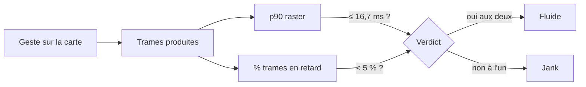

# Exigences non fonctionnelles

**Statut :** Accepté · **Date :** 2026-09-13 · **Portée :** T0 — cible **Windows**. Les seuils
s'appliqueront tels quels aux autres cibles, le jour où elles seront construites : rien n'indique
qu'un budget d'image ou une taille d'exécutable doive changer avec la plateforme.

> Une exigence non fonctionnelle **sans chiffre** est une intention : on ne peut ni la tenir ni
> constater qu'on l'a manquée. Chaque ligne ci-dessous porte donc un **seuil** et **la façon de le
> constater**. ⚠️ Les seuils sont fixés **avant** la mesure. Les déplacer après une mesure
> décevante est la seule façon certaine de ne jamais rien apprendre.

## Exigences

| # | Exigence | Seuil | Constaté par | État |
|---|---|---|---|---|
| `NFR-01` | Fluidité de la carte pendant un geste | rastérisation **p90 ≤ 16,7 ms** et trames en retard **< 5 %** | relevé de percentiles de trame pendant des gestes définis d'avance | 🔄 non mesuré sur Windows |
| `NFR-02` | Démarrage | première image **≤ 3 s**, référentiel de 4 150 stations chargé **≤ 5 s**, sur le poste de développement | chronométrage | 🔄 non mesuré |
| `NFR-03` | Tenue hors réseau | l'écran carte s'ouvre, se déplace, affiche les marqueurs sans réseau ; bandeau explicite si les tuiles manquent | exécution avec la carte réseau désactivée | ✅ **constaté le 2026-09-13** par le commanditaire, exécutable lancé seul, carte réseau désactivée : la carte s'ouvre, se déplace, les 4 150 pastilles s'affichent, le fond de carte s'affiche depuis le cache de tuiles de la bibliothèque sur les zones déjà parcourues, aucun message d'erreur. Non constaté : une zone jamais chargée (le bandeau « tuiles manquantes » n'existe pas encore) |
| `NFR-04` | Accessibilité | seuils de [`04-ui.md § 3`](04-ui.md) sans exception : contraste texte ≥ 7:1 sur les valeurs et les avertissements, ≥ 3:1 non textuel, halo de 2 px | audit, puis tests de rendu de référence en T1 | 🔄 partiel : le contour de 2 px est posé et vérifié par test ; les ratios ne sont pas audités |
| `NFR-05` | Géolocalisation et vie privée | **aucune géolocalisation en T0** ; aucune donnée personnelle, **aucun identifiant** d'appareil ou d'installation, aucune mesure d'audience, aucune trace envoyée. À l'arrivée de la géolocalisation : ponctuelle, précision approximative, jamais de suivi continu | par construction — aucune dépendance de géolocalisation, de mesure d'audience ni de journalisation distante au `pubspec.yaml` | ✅ par construction, à revérifier à chaque ajout de dépendance |
| `NFR-06` | Taille de l'exécutable | dossier de publication **≤ 60 Mo** | mesure après `flutter build windows --release` | ✅ **mesuré le 2026-09-13** : `Release` = **31 Mo**, dont `flutter_windows.dll` 21 Mo et le référentiel 6,4 Mo (repère du spike : 33 Mo) |
| `NFR-07` | Charge sur les sources publiques | aucun appel national en bloc ; au plus **4 tentatives**, recul plafonné à **30 s**, gigue systématique ; référentiel embarqué, **zéro appel** | tests unitaires du recul et du client | ✅ test — 11 cas dans `test/data/http/retry_test.dart`, 24 dans `test/data/http/hub_eau_client_test.dart` |
| `NFR-08` | Robustesse de lecture | aucune valeur d'API non reconnue ne fait échouer un écran ; toute entité écartée est comptée | tests de nomenclature et de lecture du référentiel | ✅ test |

### Pourquoi 16,7 ms et 5 %

16,7 ms est le budget d'une trame à 60 Hz : au-delà, la trame est en retard et le geste se voit.
**5 %** est le seuil au-delà duquel un déplacement cesse d'être perçu comme continu. Les deux
chiffres ont été fixés **avant** la mesure du spike (`spike/porte_flutter/COMPTE-RENDU.md § 2`),
qui a rendu **p90 16,2 ms** — dans le budget — pour **8,9 %** de trames en retard, hors du seuil :
autre plateforme, autre rendu, approche avec regroupement non retenue. Le chiffre ne se transpose
pas ; le seuil, lui, ne change pas.

## Ce qui n'est pas une exigence non fonctionnelle

| Sujet | Où il vit |
|---|---|
| Vocabulaire proscrit et les quatre avertissements | `BR-003`, `BR-012`, `BR-013`, `BR-014` |
| Contrastes chiffrés et palette | [`04-ui.md § 3`](04-ui.md) — les recopier ici en ferait une seconde source de vérité, qui divergerait |
| Fraîcheur 2 h / 24 h | `BR-005` — c'est une règle métier, pas une performance |
| Contraintes d'API subies | tableau `C-xx` de [`01-analyse.md § 4`](01-analyse.md) |

## Constats ouverts

Une case vide est une case vide, pas un « probablement ».

| Constat | État |
|---|---|
| `NV-W1` — la molette ne zoomait pas sur Windows au spike (2026-09-09) | **Clos le 2026-09-13**, constaté à l'écran à l'exécution de l'écran carte de T0 (`flutter run -d windows`, commit `d9fa091`) : la molette zoome, le glisser déplace la carte. Aucun réglage n'a été posé — `MapOptions` sans `interactionOptions` explicite, drapeaux par défaut de `flutter_map` 8.3.2. Le constat du spike n'est pas reproduit ; sa cause d'alors reste **non établie**, seule sa disparition est constatée — réserve : non réexpliqué |
| `NV-W2` — cache de tuiles hors réseau | **levé le 2026-09-13** : éprouvé à l'écran sur les zones déjà parcourues ; une zone jamais chargée reste non constatée |
| `NV-W3` — aucune mesure de fluidité sur Windows | ouvert, sans date — bloque `NFR-01` |
| `NV-W4` — iOS jamais compilé, faute d'hôte macOS | sans date |
| `NV-W5` — Android ⏸ différé le 2026-09-12 | sans date |
| `NV-W6` — chaque cran de molette déclenche un rechargement, sans anti-rebond | ouvert le 2026-09-13, **non mesuré**. `MapEventScrollWheelZoom` n'a pas de variante `…End` dans `flutter_map` 8.3.2 : `shouldRefreshOn` répond donc `true` à **chaque** cran, et un zoom de cinq crans fait cinq allers-retours au dépôt et cinq reconstructions des 4 150 marqueurs. Aucun anti-rebond n'est posé, et la garde d'emprise inchangée ne sert à rien ici — chaque cran change bien l'emprise. À instruire avec `NFR-01`, en même temps que `NV-W3` : sans relevé de trames, on ne sait pas si le coût est visible ou non |
