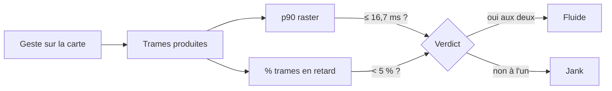

# Exigences non fonctionnelles

**Statut :** Accepté · **Date :** 2026-09-13, repris le 2026-09-23 (T1, `X4`) le 2026-09-27 (T1, `X3`, mesure de `NFR-01`) et le 2026-10-06 (T2, `NFR-07`, délai d'attente, puis annulation de la tentative abandonnée, puis délai de Hub'Eau porté à 20 s le soir) · **Portée :** T0 et T1 — cible **Windows**. Les seuils
s'appliqueront tels quels aux autres cibles, le jour où elles seront construites : rien n'indique
qu'un budget d'image ou une taille d'exécutable doive changer avec la plateforme.

> Une exigence non fonctionnelle **sans chiffre** est une intention : on ne peut ni la tenir ni
> constater qu'on l'a manquée. Chaque ligne ci-dessous porte donc un **seuil** et **la façon de le
> constater**. ⚠️ Les seuils sont fixés **avant** la mesure. Les déplacer après une mesure
> décevante est la seule façon certaine de ne jamais rien apprendre.

## Exigences

| # | Exigence | Seuil | Constaté par | État |
|---|---|---|---|---|
| `NFR-01` | Fluidité de la carte pendant un geste | rastérisation **p90 ≤ 16,7 ms** et trames en retard **< 5 %** | relevé de percentiles de trame pendant des gestes définis d'avance — `G1` glisser au zoom départemental, `G2` six crans de molette du national au local avec le compte des appels au dépôt de points, `G3` glisser au zoom national (plan T1, `X3`), en `--profile` | ✅ **mesuré sur Windows le 2026-09-27** par le commanditaire, en `--profile`, sonde `X3` (`e9eef5c`) : **seuils tenus sur les trois gestes**. Rastérisation p50 / p90 / trames en retard — `G1` essai 1 : 79 trames, 1,2 ms / **6,4 ms** / **2,5 %** ; `G1` essai 2 : 27 trames, 1,0 ms / **2,1 ms** / **0,0 %** ; `G2` : 45 trames, 1,1 ms / **2,4 ms** / **2,2 %**, **5 appels au dépôt de points pour 6 crans** ; `G3` : 56 trames, 1,1 ms / **1,8 ms** / **0,0 %**. Deux essais `G1` ont été relevés : les deux sont recopiés, aucun n'est écarté. À titre informatif, hors seuil : trames en retard sur `totalSpan` **5,1 %** à `G1` essai 1 (2,2 % à `G2`, 0,0 % ailleurs), construction p90 ≤ 1,8 ms partout. **Non mesuré :** Android, un appareil d'entrée de gamme, le parcours au Tab (point 46 de `project-state.md`), le cran de `G2` où le niveau de regroupement change |
| `NFR-02` | Démarrage | première image **≤ 3 s**, référentiel de 4 150 stations chargé **≤ 5 s**, sur le poste de développement | chronométrage | 🔄 non mesuré |
| `NFR-03` | Tenue hors réseau | l'écran carte s'ouvre, se déplace, affiche les marqueurs sans réseau ; bandeau explicite si les tuiles manquent | exécution avec la carte réseau désactivée | ✅ **constaté le 2026-09-13** par le commanditaire, exécutable lancé seul, carte réseau désactivée : la carte s'ouvre, se déplace, les 4 150 pastilles s'affichent, le fond de carte s'affiche depuis le cache de tuiles de la bibliothèque sur les zones déjà parcourues, aucun message d'erreur. Non constaté : une zone jamais chargée (le bandeau « tuiles manquantes » n'existe pas encore). ✅ **Reconstaté le 2026-09-27 sur l'exécutable `0.2.0`** (`P1`) par le commanditaire, carte réseau désactivée : les pastilles s'affichent, le fond de carte vient du cache sur les zones déjà parcourues, et la feuille d'une station **nomme la source injoignable** (`BR-007`). Une zone jamais chargée reste non constatée |
| `NFR-04` | Accessibilité | seuils de [`04-ui.md § 3`](04-ui.md) sans exception : contraste texte ≥ 7:1 sur les valeurs et les avertissements, ≥ 3:1 non textuel, halo de 2 px | audit, puis tests de rendu de référence en T1 | 🔄 partiel : le contour de 2 px est posé et vérifié par test ; les ratios ne sont pas audités. Constaté à l'écran le 2026-09-27 sur l'exécutable `0.2.0` (`P1`) : focus visible au `Tab`, carte pilotée au clavier, libellé « ⚠ Avertissement » non tronqué, fenêtre bloquée à 800 × 700 — **les ratios de contraste restent non audités** |
| `NFR-05` | Géolocalisation et vie privée | **aucune géolocalisation en T0** ; aucune donnée personnelle, **aucun identifiant** d'appareil ou d'installation, aucune mesure d'audience, aucune trace envoyée. À l'arrivée de la géolocalisation : ponctuelle, précision approximative, jamais de suivi continu | par construction — aucune dépendance de géolocalisation, de mesure d'audience ni de journalisation distante au `pubspec.yaml` | ✅ par construction, à revérifier à chaque ajout de dépendance |
| `NFR-06` | Taille de l'exécutable | dossier de publication **≤ 60 Mo** | mesure après `flutter build windows --release` | ✅ **mesuré le 2026-09-13** : `Release` = **31 Mo**, dont `flutter_windows.dll` 21 Mo et le référentiel 6,4 Mo (repère du spike : 33 Mo) · ✅ **mesuré le 2026-09-27** pour `0.2.0` (`P1`) : `Release` = **33 Mo**, 14 fichiers dont 4 à la racine, `flutter_windows.dll` 21 Mo, référentiel 6,4 Mo |
| `NFR-07` | Charge sur les sources publiques | aucun appel national en bloc ; au plus **4 tentatives**, chacune bornée à ~~**10 s**~~ **20 s** pour Hub'Eau (arbitrage du 2026-10-06 au soir) et **10 s** pour VigiEau, recul plafonné à **30 s**, gigue systématique ; référentiel embarqué, **zéro appel** | tests unitaires du recul et du client | ✅ test — 11 cas dans `test/data/http/retry_test.dart`, ~~26~~ **30** dans `test/data/http/hub_eau_client_test.dart`, ~~29~~ ~~38~~ ~~37~~ **39** dans `test/data/http/json_http_client_test.dart` (transport partagé par Hub'Eau et VigiEau), recomptés par `flutter test <fichier>` le 2026-10-06 (29 au recomptage du matin, avant `9f81d8c` ; 38 avant `83dac21`, qui retire la copie d'un test ; 37 le soir avant le délai de 20 s de Hub'Eau ; **30** et **39** lus par `flutter test <fichier>` le 2026-10-06 au soir, après lui : un cas du premier remplacé par cinq, deux cas ajoutés au second : six des sept cas ajoutés sont en temps simulé par `test/support/simulated_clock.dart`, le septième (`hub_eau_client_test.dart`) compare deux constantes côte à côte ; aucun ne dort 10 ou 20 s réelles). Le passage de 10 à 20 s pour Hub'Eau est un arbitrage du commanditaire du 2026-10-06 au soir, tracé ici par la barrure, la date et le motif `T-17`. **Délai de 10 s par tentative ajouté le 2026-10-06** (arbitrage du commanditaire, revue de la PR #17, `7a19141`) : une tentative qui dépasse est rejouée comme une panne réseau, pire cas avant l'échec **43,5 à 47 s** (~~pour les deux sources~~ pour VigiEau, qui garde ce délai ; Hub'Eau est passé à 20 s le soir, voir la fin de la ligne) ; un serveur lent mais vivant, qui répondrait en plus de 10 s, échoue. Établi contre un serveur local, **jamais sur une API réelle**. ~~Une tentative abandonnée au délai n'est pas annulée : sa connexion reste ouverte tant que le serveur ne répond ni ne coupe (mesuré contre un serveur local : 4 sur 4 après un appel pendu). L'annulation (`AbortableRequest`) est une question ouverte au commanditaire (`project-state.md`, point 57)~~ **Une tentative qui dépasse son délai est annulée** (`9f81d8c`, 2026-10-06, branche `fix/suites-relecture-pr17`) : elle part en requête annulable (`AbortableRequest`, par `Client.send`, `package:http` 1.6.0) et son déclencheur est complété au dépassement, avant la tentative suivante ; contre un serveur local muet, les quatre connexions des tentatives abandonnées sont fermées par le client (0 sur 4 auparavant), qu'il n'ait pas encore répondu ou qu'il cale en plein corps. **Reste non annulée : la phase de connexion** (DNS, connexion TCP, poignée de main TLS) — `IOClient.send` n'enregistre le déclencheur qu'après l'ouverture de la connexion : constaté pour la poignée de main TLS seule contre un serveur local, lu dans le paquet, non mesuré, pour le DNS et la connexion TCP ; `http.Client()`, tel que `main.dart` le construit, ne règle aucun `connectionTimeout`. **Pas davantage annulée : une redirection suivie vers une autre origine** (autre hôte, autre port ou autre schéma), tant que les en-têtes de la réponse redirigée ne sont pas arrivés : l'annulation détruit la connexion d'origine, laisse ouverte celle de la redirection, et peut faire échouer une autre requête en vol qui réutilisait la connexion d'origine (constaté contre deux serveurs locaux le 2026-10-06 ; aucune des sources appelées ne redirige à ce jour ; `83dac21`). ⚠️ **10 s est trop court pour le balayage ONDE national** mesuré à 10,26 s le 2026-10-06 à 14:11 UTC (`docs/sources/onde.md`, `T-17` ; un échantillon, un jour, un poste ; trois appels coupés à plus de 60 s) : ~~un délai de 30 s pour Hub'Eau, arbitré par le commanditaire, a été codé puis **retiré à sa demande avant tout commit** — question ouverte (`project-state.md`, point 59)~~ **question tranchée le 2026-10-06 au soir par le commanditaire : 20 s par tentative pour Hub'Eau (hydrométrie v2 et écoulement ONDE v1, constante `hubEauRequestTimeout` de `lib/data/http/hub_eau_client.dart`), 10 s pour VigiEau (`defaultRequestTimeout`, inchangé)**. Pire cas avant l'échec avec quatre tentatives : Hub'Eau **83,5 à 87 s** (4 × 20 s + 3,5 à 7 s d'attentes de rejeu, gigue nulle à maximale), VigiEau toujours **43,5 à 47 s** — les deux chiffres sont recalculés en temps simulé par les tests (`test/data/http/hub_eau_client_test.dart`, `test/data/http/json_http_client_test.dart`). Ce délai est **codé et vérifié par test, jamais éprouvé contre l'API réelle** ; il laisse passer le balayage national mesuré à 10,26 s, mais les appels restés sans réponse à plus de 60 s (`T-17`) ou en 20 s (`T-18`, écoulement) seraient encore coupés — leur cause n'est pas établie |
| `NFR-08` | Robustesse de lecture | aucune valeur d'API non reconnue ne fait échouer un écran ; toute entité écartée est comptée | tests de nomenclature et de lecture du référentiel | ✅ test |

### Pourquoi 16,7 ms et 5 %

16,7 ms est le budget d'une trame à 60 Hz : au-delà, la trame est en retard et le geste se voit.
**5 %** est le seuil au-delà duquel un déplacement cesse d'être perçu comme continu. Les deux
chiffres ont été fixés **avant** la mesure du spike (`spike/porte_flutter/COMPTE-RENDU.md § 2`),
qui a rendu **p90 16,2 ms** — dans le budget — pour **8,9 %** de trames en retard, hors du seuil :
autre plateforme, autre rendu, approche avec regroupement non retenue. Le chiffre ne se transpose
pas ; le seuil, lui, ne change pas.

```mermaid
flowchart LR
    A[Geste sur la carte] --> B[Trames produites]
    B --> C[p90 raster]
    B --> D["% trames en retard"]
    C -->|"≤ 16,7 ms ?"| E{Verdict}
    D -->|"< 5 % ?"| E
    E -->|oui aux deux| F[Fluide]
    E -->|non à l'un| G[Jank]
```

## Ce qui n'est pas une exigence non fonctionnelle

| Sujet | Où il vit |
|---|---|
| Vocabulaire proscrit et les quatre avertissements | `BR-003`, `BR-012`, `BR-013`, `BR-014` |
| Contrastes chiffrés et palette | [`04-ui.md § 3`](04-ui.md) — les recopier ici en ferait une seconde source de vérité, qui divergerait |
| Fraîcheur 2 h / 24 h | `BR-005` — c'est une règle métier, pas une performance |
| Contraintes d'API subies | tableau `C-xx` de [`01-analyse.md § 4`](01-analyse.md) |

## Constats ouverts

Une case vide est une case vide, pas un « probablement ».

| Constat | État |
|---|---|
| `NV-W1` — la molette ne zoomait pas sur Windows au spike (2026-09-09) | **Clos le 2026-09-13**, constaté à l'écran à l'exécution de l'écran carte de T0 (`flutter run -d windows`, commit `d9fa091`) : la molette zoome, le glisser déplace la carte. Aucun réglage n'a été posé — `MapOptions` sans `interactionOptions` explicite, drapeaux par défaut de `flutter_map` 8.3.2. Le constat du spike n'est pas reproduit ; sa cause d'alors reste **non établie**, seule sa disparition est constatée — réserve : non réexpliqué |
| `NV-W2` — cache de tuiles hors réseau | **levé le 2026-09-13** : éprouvé à l'écran sur les zones déjà parcourues ; une zone jamais chargée reste non constatée |
| `NV-W3` — aucune mesure de fluidité sur Windows | **levé le 2026-09-27** : mesure faite par le commanditaire, `flutter run -d windows --profile --dart-define=FLUIDITY_PROBE=true`, gestes `G1`, `G2`, `G3` — chiffres à la ligne `NFR-01` |
| `NV-W4` — iOS jamais compilé, faute d'hôte macOS | sans date |
| `NV-W5` — ~~Android ⏸ différé le 2026-09-12~~ **amendé le 2026-09-18 : le différé est levé** (arbitrage du commanditaire, amendement d'[`ADR-013`](adr/ADR-013-bascule-flutter-cible-windows.md)). Le constat se resserre : **l'application n'a jamais été construite ni lancée sur Android sous Flutter** | **ouvert, sans date.** Constaté le 2026-09-18 : `flutter doctor` voit la chaîne Android (SDK 36.0.0), le NDK exigé par Flutter 3.47.4 est présent sur le poste, le gabarit `android/` est généré, l'émulateur `Pixel_7` a démarré (`emulator-5554 device`, `sys.boot_completed=1`). **Non constaté :** aucune construction, aucun lancement, aucun écran — le bac à sable ne compile pas de natif ; `flutter run -d emulator-5554` revient au commanditaire. Aucune mesure de `NFR-01` sur Android non plus, et `NV-5` (appareil réel) reste ouvert |
| `NV-W6` — chaque cran de molette déclenche un rechargement, sans anti-rebond | **clos le 2026-09-27, sans anti-rebond** : `G2` a donné **5 appels au dépôt de points pour 6 crans** (moins d'un par cran), rastérisation p90 **2,4 ms** et **2,2 %** de trames en retard — le coût des rechargements ne se voit pas dans les trames. La règle de `X3` n'ouvre une tâche d'anti-rebond que si un seuil de `NFR-01` est dépassé **et** qu'il y a plus d'un appel par cran : ni l'un ni l'autre. Historique : ouvert le 2026-09-13. `MapEventScrollWheelZoom` n'a pas de variante `…End` dans `flutter_map` 8.3.2 : `shouldRefreshOn` répond donc `true` à **chaque** cran, et un zoom de cinq crans fait cinq allers-retours au dépôt et cinq reconstructions des marqueurs. Aucun anti-rebond n'est posé, et la garde d'emprise inchangée ne sert à rien ici — chaque cran change bien l'emprise. Depuis `Z4` (`ADR-015`, 2026-09-23), sous le zoom 9 la carte ne dessine que des pastilles de zone : la reconstruction de tous les marqueurs ne vaut plus qu'au niveau individuel. Mesuré par le geste `G2` de la sonde `X3` le 2026-09-27 (voir le début de cette ligne) |
