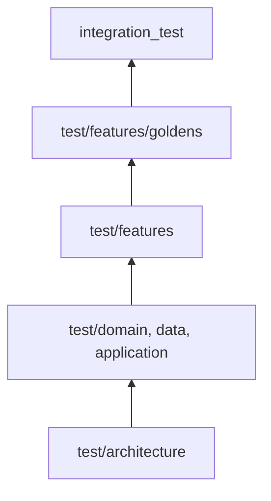

# Plan de tests

**Statut :** Accepté · **Date :** 2026-09-13 · **Portée :** T0 — critères Gherkin et matrice
de traçabilité viennent en T1 (`docs/superpowers/plans/2026-09-13-t0-socle-flutter.md`).

Ce document ne liste pas les tests qui existent : il dit **à quel étage** une règle se vérifie,
et pourquoi pas à un autre. Le détail des cas figure dans chaque `BR-NNN` et dans le plan
d'implémentation en cours.

## 1. La pyramide

| Étage | Ce qu'il prouve | Coût | État |
|---|---|---|---|
| `test/architecture/` | Les frontières de couches tiennent : aucune infrastructure sous `lib/domain/`, aucun appel au volet sécheresse hors de son module | quelques ms | ✅ T0 (`domain_isolation_test.dart`) |
| `test/domain/`, `test/data/`, `test/application/` | Règles métier et conversions ; tout `BR-xxx` se vérifie ici **ou nulle part** | ms | ✅ T0 |
| `test/features/` | Un écran affiche ce que la règle impose : attribution présente, marqueurs filtrés, absence jamais neutre | dizaines de ms | ✅ T0 minimal |
| `test/features/goldens/` | Rendu d'un marqueur : contraste, halo, atténuation d'une donnée périmée | secondes | 🔄 T1 |
| `integration_test/` | Parcours complet, sur fenêtre ou appareil réel | minutes | 🔄 T1 |

Le coût croît de bas en haut : une règle se vérifie à l'étage le plus bas où elle est visible,
jamais plus haut « pour être sûr ».

## 2. Les quatre règles qui décident de l'étage

1. **Une règle métier se teste sans rendu.** Si vérifier `BR-005` demande un widget, la règle
   est mal placée : elle vit dans la vue, pas dans le domaine.
2. **Une valeur d'API ne se teste jamais contre un nombre inventé.** Valeurs relevées par appel
   réel, datées, conservées en fixture (§ 4) — jamais écrites de mémoire (`CLAUDE.md`,
   Anti-hallucination).
3. **Une borne se teste des deux côtés**, et `2 h 00` exactement est le cas qui décide : la
   borne appartient toujours à l'état **le plus sévère**. Une borne qu'on ne peut pas tester
   ainsi n'est pas une borne.
4. **Le hasard est injecté, jamais lu.** Instant courant, gigue de retry, état du réseau sont
   des paramètres passés au test, pas des valeurs constatées à l'exécution.

## 3. Ce qu'on ne teste pas, et pourquoi

- **Le rendu des tuiles.** C'est la bibliothèque `flutter_map` qui l'assure. On teste **le
  gabarit d'URL** : `TILECOL`/`TILEROW` inversés donnent une carte transposée sans aucune
  erreur — l'inversion ne se voit qu'à l'écran, jamais dans une exception.
- **Le réseau réel en test automatisé.** Aucun SLA (`C-15`) : la suite serait rouge sans code
  fautif, un flux 429 la ferait déjà échouer. Les appels réels servent à **produire les
  fixtures**, pas à faire tourner la suite.
- **La couverture chiffrée.** Un pourcentage ne dit pas si `BR-002` est couvert. La question de
  revue est « quel test tombe si cette règle est cassée ? », pas « combien de lignes sont
  exécutées ? ».
- **Le hors-ligne, en T0.** Aucun stockage local n'existe encore (`ADR-011` réservé) ; `NFR-03`
  chiffre cette exigence pour T1.

## 4. Fixtures

- Un fichier par appel : `test/fixtures/<source>/<endpoint>_<parametres>_<AAAA-MM-JJ>.json`.
- Contenu **verbatim**, sauf extrait explicitement déclaré comme tel dans la fiche de source.
- La date est celle de la **capture**, pas celle du test qui l'utilise.
- Une fixture ne se met jamais à jour : on en capture une nouvelle, et la fiche de source dit
  laquelle fait foi.
- Toute fixture est référencée depuis `docs/sources/*.md`. Une fixture orpheline est une
  fixture dont personne ne sait ce qu'elle prouve.
- Le statut HTTP de chaque capture est consigné dans `test/fixtures/CAPTURES.md`.
