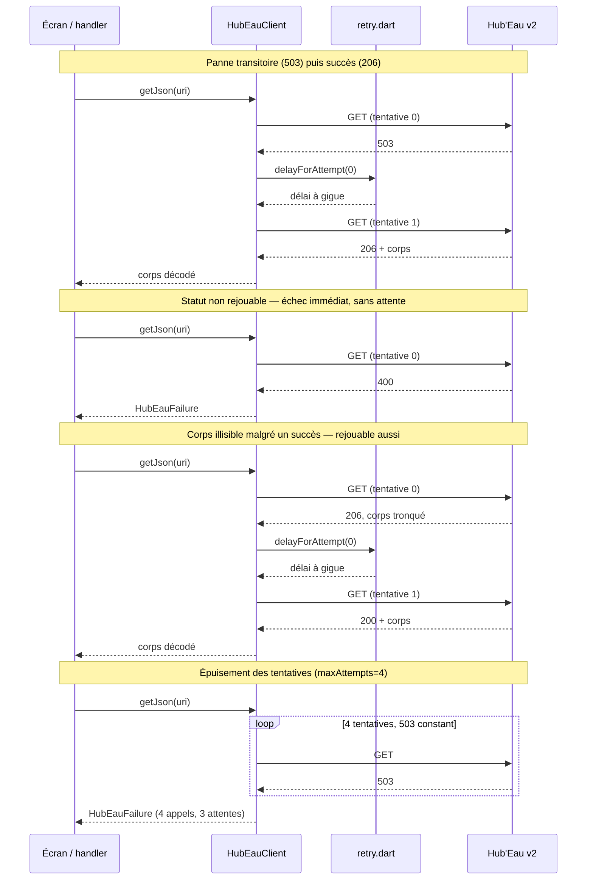

# Source — Hydrométrie Hub'Eau

Base URL : `https://hubeau.eaufrance.fr/api/v2/hydrometrie` · `api_version` **2.0.1**
(relevée le 2026-09-13, présente dans chaque réponse) · aucune authentification ·
Licence Ouverte Etalab, **citation de l'auteur obligatoire** ; version de la licence non
précisée aux CGU consultées : *non vérifié*. Rôle : débit, hauteur, historique journalier,
référentiel des stations. Décision liée : `ADR-001` — cibler exclusivement la v2, la v1 est
arrêtée depuis le 05/05/2025 (`403` constaté lors du cadrage, `C-01` ; non revérifié
aujourd'hui).

## Endpoints

| Endpoint | Pagination | Fixture |
|---|---|---|
| `/observations_tr` (`grandeur_hydro=Q`) | curseur | `observations_tr_K447001001_Q_2026-09-13.json` |
| `/observations_tr` (`grandeur_hydro=H`) | curseur | `observations_tr_K447001001_H_2026-09-13.json` |
| `/observations_tr` (code **site**, `C-05`) | curseur | `observations_tr_site_K4470010_2026-09-13.json` |
| `/obs_elab` (`grandeur_hydro_elab=QmnJ`, avec `date_debut_obs_elab`) | curseur | `obs_elab_K447001001_depuis_2026-08-01_2026-09-13.json`, `obs_elab_K447001001_depuis_2026-09-01_2026-09-13.json` |
| `/obs_elab` (sans `date_debut_obs_elab`, `C-04`) | curseur | `obs_elab_K447001001_sans_date_debut_2026-09-13.json` |
| `/referentiel/stations` | `page` + `size` | `referentiel_stations_K447001001_2026-09-13.json` |
| `/referentiel/stations` (extrait GeoJSON, `[lon, lat]`) | — copie déclarée, pas un appel | `test/fixtures/referentiel/stations_extrait_2026-09-13.json` |

Statuts HTTP constatés à la capture de chacune (quand ils l'ont été) et rejoués aujourd'hui :
`test/fixtures/CAPTURES.md`.

## Comportement du client

`HubEauClient.getJson` (`lib/data/http/hub_eau_client.dart`) rejoue sur 429 et 5xx en
espaçant les tentatives via `delayForAttempt` (`lib/data/http/retry.dart`, C-12), et accepte
206 comme un succès au même titre que 200 (C-06). Un 4xx hors 429 échoue immédiatement, sans
attente : ce n'est pas une panne transitoire. Un corps qui prétend être un succès mais ne se
décode pas en JSON (206 tronqué en cours de transfert, par exemple) est rejoué au même titre
qu'une panne réseau. Le corps est toujours décodé en UTF-8 explicite
(`utf8.decode(response.bodyBytes)`), jamais via `response.body` qui retombe sur latin1 sans
en-tête `Content-Type`. Une panne TLS (`HandshakeException`/`TlsException`) traverse
`IOClient` sans être enveloppée en `ClientException` et est rejouée comme une panne réseau ;
un client déjà fermé (`ClientException` « already closed ») ne l'est pas. Les tentatives
épuisées (`maxAttempts`, 4 par défaut) lèvent `HubEauFailure`.

## Faits constatés le 2026-09-13

- Le débit arrive en litres/seconde (`47800.0` = 47,8 m³/s) → division par mille dans le
  mapper, une seule fois (`BR-002`). Fixture : `observations_tr_K447001001_Q_2026-09-13.json`.
- La hauteur arrive en millimètres et peut être négative (`-1232.0` = −1,232 m) → aucun
  contrôle de signe dans le mapper. Fixture : `observations_tr_K447001001_H_2026-09-13.json`.
- `206` est un succès au même titre que `200` (`C-06`, `01-analyse.md`, vérifié le
  2026-07-30) : `size=2` sur `observations_tr` renvoie `206`, `size=2` avec
  `date_debut_obs_elab=2026-09-01` (aucune donnée) renvoie `200` avec `count=0` → les deux
  codes traversent `isSuccess`. Statuts HTTP de chaque capture, y compris ceux rejoués
  aujourd'hui : `test/fixtures/CAPTURES.md`.
- Un code **site** renvoie tout en double : `code_entite=K4470010` → `count` **412**, dont
  une ligne à `code_station: null` ; le code **station** `K447001001` seul → `count` **206**
  → `StationCode` refuse les huit caractères d'un code site (`C-05`). Fixture (code site) :
  `observations_tr_site_K4470010_2026-09-13.json`. Écart avec un relevé antérieur qui
  annonçait 430/216 : cette fixture-ci fait foi.
- `obs_elab` ignore `sort` : sans `date_debut_obs_elab`, première ligne `1900-01-01`,
  `resultat_obs_elab` `155000.0`, `count` `44733` → `date_debut_obs_elab` est un paramètre
  **requis** du constructeur d'URI, jamais optionnel (`C-04`). Fixture :
  `obs_elab_K447001001_sans_date_debut_2026-09-13.json`.
- Latence de `obs_elab` : `date_debut_obs_elab=2026-09-01` → `count` `0`, `200` (fixture
  `obs_elab_K447001001_depuis_2026-09-01_2026-09-13.json`) ; `2026-08-01` → `count` `26`,
  statut « Donnée pré-validée » (fixture
  `obs_elab_K447001001_depuis_2026-08-01_2026-09-13.json`) → l'historique du mois courant
  n'existe pas encore côté API.
- Le champ de qualification change de nom selon l'endpoint : `observations_tr` expose
  `libelle_qualification_obs`, `obs_elab` expose `libelle_qualification` → deux mappers,
  jamais un nom réutilisé de mémoire.
- Le référentiel nomme les coordonnées et le département différemment des observations :
  `latitude_station`/`longitude_station` contre `latitude`/`longitude`. Fixture :
  `referentiel_stations_K447001001_2026-09-13.json`.
- La dernière observation temps réel de `K447001001` date du `2026-08-27T08:00:00Z`, soit
  **dix-sept jours** avant cette capture → `BR-005` s'applique dès une station de référence,
  pas seulement à un cas limite.

## Contraintes subies

Renvoi au tableau `C-xx` de `01-analyse.md § 4` : `C-01`, `C-02`, `C-03`, `C-04`, `C-05`,
`C-06`, `C-07`, `C-08`, `C-09`, `C-12`, `C-15`, `C-17`.

## Référentiel figé

`assets/referentiel/stations.json` — **6 604 249 octets** (`ls -l`, 2026-09-13), `"count":
4150`, `api_version` `2.0.1`, obtenu avec `en_service=1&format=geojson&page=1&size=10000`
(constaté dans l'en-tête du fichier). Versionné dans l'app parce que la carte ne peut pas
attendre 6,6 Mo au premier lancement et qu'aucun filtre géographique n'existe sur cet
endpoint (`C-09`, `01-analyse.md` : **6 454 lignes** sans le filtre `en_service` — l'écart
avec les **4 150** de l'asset versionné, filtré, ci-dessus). ⚠️ Le GeoJSON ordonne
`[longitude, latitude]` — les inverser ne lève aucune erreur ; petit extrait déclaré de ce
fichier : `test/fixtures/referentiel/stations_extrait_2026-09-13.json`.

Fait constaté le 2026-09-13, en lisant l'asset (`parseStations`,
`test/data/referentiel/stations_asset_test.dart`) : sur les **4 150** points, **4 113**
entités `Station` complètes, **37** écartées de `stations` pour `code_departement` absent ou
mal formé — des stations transfrontalières (le Rhin en Allemagne/Suisse, la Meuse et la
Semois/l'Escaut en Belgique) plus deux stations corses (`Y880000101`, `Y971000201`). Ce n'est
pas un bug de l'analyse : le référentiel Hub'Eau porte ces stations sans département français.
Les 37 restent dans `points` — la carte les affiche — mais sont écartées de `stations` plutôt
que de recevoir un département inventé (`BR-007`).

## Panne constatée le 2026-09-13

`T-10` `/v2/hydrometrie/observations_tr` est indisponible.

- **Le matin du 2026-09-13** : **503 sur 19 tentatives** réparties sur ~25 min, plus **un
  502 après 67 s** et **un timeout sans réponse** — ces deux derniers pèsent sur la
  politique de retry (`D5`) au même titre que les 503.
- **L'après-midi, SEPT appels, tous 500**, corps identique à chaque fois :
  `{"code":"Internal server error","message":"","field_errors":null}`, en trois lots :
  - **13:34:49 UTC** : `Q-01` (codes multiples, `size=4`), `Q-02` (`bbox`, `size=3`), `Q-03`
    (`fields`, `size=1`) ;
  - **13:35:03 UTC** : forme garantie
    (`…observations_tr?code_entite=K447001001&grandeur_hydro=Q&size=2`), puis `Q-01` rejouée ;
  - **13:35:26 UTC** : forme garantie (`…&size=1`), puis `Q-02` rejouée.

Au même moment (13:35:03 UTC), `/v2/hydrometrie/referentiel/stations?code_station=K447001001&size=1`
répondait normalement (`count` 1, `api_version` 2.0.1) : c'est l'endpoint d'observations qui
est en panne, pas l'API entière.

## Non vérifié

- `Q-01` codes multiples en une requête :
  `https://hubeau.eaufrance.fr/api/v2/hydrometrie/observations_tr?code_entite=K447001001,K4620020&grandeur_hydro=Q&size=4`
  → 500 aux deux tentatives du 2026-09-13, **13:34:49 UTC** puis rejouée à **13:35:03 UTC**.
  Enjeu : 1 requête au lieu de 50 pour peupler la carte d'un coup.
- `Q-02` par emprise (`bbox`) :
  `https://hubeau.eaufrance.fr/api/v2/hydrometrie/observations_tr?bbox=1.0,47.3,1.8,47.8&grandeur_hydro=Q&size=3`
  → 500 aux deux tentatives du 2026-09-13, **13:34:49 UTC** puis rejouée à **13:35:26 UTC**.
  Enjeu : 1 appel par emprise plutôt qu'un appel par station visible.
- `Q-03` `fields` + `size=1` :
  `https://hubeau.eaufrance.fr/api/v2/hydrometrie/observations_tr?code_entite=K447001001&grandeur_hydro=Q&size=1&fields=code_station,date_obs,resultat_obs`
  → 500 à l'unique tentative du 2026-09-13, **13:34:49 UTC**. Enjeu : coût réseau, ne
  récupérer que les champs utilisés par la fiche station.
- `Q-04` latence médiane de l'endpoint. Protocole prévu : `curl -w` sur
  `https://hubeau.eaufrance.fr/api/v2/hydrometrie/observations_tr?code_entite=K447001001&grandeur_hydro=Q&size=1`,
  médiane de `time_total` sur 10 appels espacés. Non mesurable le 2026-09-13 — les
  dix-neuf tentatives du matin (503), le 502 après 67 s, le timeout sans réponse, et les sept
  appels de l'après-midi (500, 13:34:49 à 13:35:26 UTC) ont tous échoué. Enjeu : sans latence
  mesurée, l'intervalle du préchargement serait un chiffre inventé.
- Le quota réel : `curl -sI` sur `/observations_tr` le 2026-09-13 ne renvoie aucun en-tête
  `X-RateLimit-*` ; les CGU ne chiffrent rien (`C-12`) — throttle client à l'aveugle.
- Le comportement sous charge concurrente.
- La stabilité du curseur de pagination entre deux appels espacés dans le temps.
