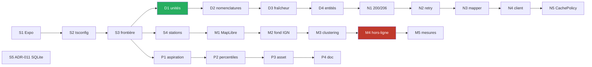

# T0 — Socle React Native : plan d'implémentation

> **For agentic workers:** REQUIRED SUB-SKILL: Use `superpowers:subagent-driven-development`
> (recommended) or `superpowers:executing-plans` to implement this plan task-by-task.
> Steps use checkbox (`- [ ]`) syntax for tracking.

**Goal:** poser le socle exécutable de MartinPêcheur sur React Native — projet Expo en TypeScript
`strict`, couche `domain/` pure et testée, client HTTP conforme aux contraintes Hub'Eau, carte
MapLibre Native sur fond IGN, et l'outillage de percentiles — sans écrire un seul écran final.

**Architecture:** Clean Architecture en couches + CQRS léger ([`ADR-010`](../../adr/ADR-010-react-native.md)).
`domain/` est du TypeScript pur sans aucun import de framework ; `data/` mappe et persiste ;
`application/` porte les `Query`/`Command` et **l'unique** décorateur `CachePolicy` ; `features/`
contient les écrans React. L'isolation de `domain/` n'est pas une convention : elle est **rendue
mécanique** par un projet Jest en environnement `node` et une règle ESLint de frontières.

**Tech Stack:** Expo SDK 57 · React Native · TypeScript `strict` ·
`@maplibre/maplibre-react-native` v11 · Jest (`projects`) · ESLint · SQLite (à trancher en `S5`).

---

## Ce que ce plan remplace

Il remplace [`2026-07-30-t0-spike-carte-et-socle.md`](2026-07-30-t0-spike-carte-et-socle.md),
caduc depuis [`ADR-010`](../../adr/ADR-010-react-native.md).

**Le changement de forme le plus important : la séquence redevient linéaire.** L'ancien plan avait
trois voies dont une, le spike `BlazorWebView`, conditionnait tout le reste. Ce spike existait pour
lever un doute sur la tenue d'un WebView en carte. MapLibre **Native** rend ce doute sans objet : il
n'y a plus de pari à lever avant de commencer, donc plus de voie bloquante.

| Ancien | Sort |
|---|---|
| `A1`, `A3`–`A6`, `B0`, `B1`, `B4` | Sans objet — .NET ou spike WebView |
| `A2` — figer le jeu de stations | **Repris en `S4`**, avec son URL corrigée |
| Voie C — outillage percentiles | **Reprise en `P1`–`P4`**, quasi inchangée (script hors application) |
| `B3a` — conversion d'unités | **Repris en `D1`**, réécrit en TypeScript avec types *branded* |
| `B2`, `B3b`, `B5`–`B8` | Repris sur le fond, réécrits en TypeScript |

---

## Préambule pour l'exécutant

Tu ne connais pas ce projet. Six choses avant de commencer.

1. **Le dépôt ne contient que de la documentation.** Le code .NET a été retiré le 2026-07-31
   (commit `74afe6d`). Il n'y a **aucun précédent d'implémentation** à imiter — ne va pas le
   chercher dans l'historique git.
2. **Le `domain/` ne dépend de rien.** Ni React, ni React Native, ni `fetch`, ni SQLite. C'est
   l'invariant structurant. `S3` le rend vérifiable par la machine.
3. **Les APIs mentent sur leurs unités.** Le débit arrive en **litres par seconde**, la hauteur en
   **millimètres** ([`BR-002`](../../br/BR-002-debit-en-metres-cubes-par-seconde.md), `C-02`).
   C'est `D1`, la toute première tâche de code métier, et elle est en TDD.
4. **TypeScript protège moins bien que C#.** Un `number` en l/s passe sans broncher là où on attend
   des m³/s. La parade est obligatoire, pas optionnelle : types *branded* (`D1`), unions closes avec
   `Inconnu` et `switch` gardés par `never` (`D2`).
5. **On ne spécifie jamais d'après la documentation seule.** Si une réponse d'API contredit ce plan,
   **c'est l'API qui a raison** : le constater, le dater, mettre à jour
   [`01-analyse.md`](../../01-analyse.md).
6. **On ne qualifie jamais un débit de « suffisant ».** Mots bannis dans tout identifiant, commentaire
   ou libellé : *suffisant, insuffisant, normal, bon, sûr*
   ([`BR-003`](../../br/BR-003-jamais-qualifier-un-debit-de-suffisant.md)). Et **ne jamais inventer un
   seuil hydrologique** — c'est la faute la plus grave possible sur ce produit.

**Critère de fin d'étape, non négociable :** `npx tsc --noEmit` sans erreur · `npm run lint` propre ·
`npm test` vert.

---

## Faits vérifiés le 2026-07-31 — à ne pas re-supposer

Tous constatés par appel réel le jour de la rédaction. Un fait non vérifié est signalé comme tel.

| Fait | Constat | Source |
|---|---|---|
| Versions npm | `expo@57.0.9` · `@maplibre/maplibre-react-native@11.3.6` · `jest-expo@57.0.3` · `expo-sqlite@57.0.1` · `@op-engineering/op-sqlite@0.52.1` | `registry.npmjs.org/<pkg>/latest` |
| `expo` n'impose aucun `engines` | Node 24 n'est pas bloqué | idem |
| Référentiel stations | `size=10000` → **HTTP 200**, `count: 4140`, **6,57 Mo** en JSON | `hubeau.eaufrance.fr/api/v2/hydrometrie/referentiel/stations` |
| Plafond de pagination | `size=20000` → **HTTP 400** `ValidatePageSize`, *« size must be less than or equal to 10000 »* | idem |
| WMTS IGN — capacités | **HTTP 200**, `application/xml`, 2,86 Mo | `data.geopf.fr/wmts?SERVICE=WMTS&REQUEST=GetCapabilities&VERSION=1.0.0` |
| WMTS IGN — tuile | **HTTP 200**, `image/png`, **PNG 256×256** en `TILEMATRIXSET=PM` | `data.geopf.fr/wmts?…&REQUEST=GetTile&TILEMATRIX=5&TILECOL=16&TILEROW=11` |
| MapLibre télécharge le raster hors-ligne | `SourceType::Raster` traité **à l'identique** de `SourceType::Vector` : `handleTiledSource(rasterSource.getURLOrTileset(), rasterSource.getTileSize())` → `queueTiles` → `Resource::tile(tileset.tiles[0], pixelRatio, x, y, z, scheme)` | `maplibre-native`, `platform/default/src/mbgl/storage/offline_download.cpp` L191, L304, L451 |
| Division par 1000 exacte en IEEE 754 | `53000/1000 === 53` · `350571/1000 === 350.571` · `1234/1000 === 1.234` — **tous `true`**. `toBe` suffit, `toBeCloseTo` est inutile | `node -e` |

### Ce qui reste **non vérifié**, et doit être constaté et non supposé

| # | Point | Levé par |
|---|---|---|
| `NV-1` | Que `createPack` télécharge effectivement les tuiles d'un WMTS IGN **à l'exécution**. Le code C++ le prévoit, mais rien ne l'a exécuté | `M4` |
| `NV-2` | Que l'URL KVP du WMTS IGN (avec `?` et `&`) survive intacte au *templating* `{z}/{x}/{y}` de MapLibre | `M2` |
| `NV-3` | Que `tileset.tiles[0]` suffise — MapLibre n'utilise **que la première URL** du tableau `tiles` pour le hors-ligne. Déclarer des miroirs ne les téléchargera pas | `M4` |
| `NV-4` | Le volume réel d'un pack pour une emprise départementale. Un raster 256 px produit **4× plus de tuiles** qu'un vectoriel 512 px au même zoom | `M4` |
| `NV-5` | Tenue de ~4 140 marqueurs sur Android d'entrée de gamme réel. Attendu bien meilleur qu'un WebView, **non mesuré** | `M5` |
| `NV-6` | Le suite de tests de `maplibre-native` ne contient **aucune** occurrence de « raster » dans `test/storage/offline_download.test.cpp` — le chemin raster hors-ligne n'a pas de test amont | `M4` |

> ⚠️ `NV-1` porte toute la stratégie hors-ligne, qui est un `Must` du produit
> ([`UC-005`](../../use-cases/UC-005-consulter-la-carte-hors-ligne.md)). `M4` est donc la tâche à
> ne pas repousser en fin de tranche, même si elle n'est plus *bloquante* au sens de l'ancien plan.

---

## Structure de fichiers

```
src/
├── index.ts                  point d'entrée — registerRootComponent (package.json "main")
├── App.tsx                   composant racine. Les écrans arrivent en T1 sous features/
├── domain/                   TypeScript pur — ZÉRO import de framework
│   ├── units/
│   │   ├── branded.ts        le mécanisme Branded<T, B>, isolé et réutilisable
│   │   ├── quantities.ts     LitresPerSecond, CubicMetresPerSecond, Millimetres, Metres + constructeurs
│   │   └── conversions.ts    l/s → m³/s, mm → m. Le SEUL endroit qui divise par 1000
│   ├── nomenclature/
│   │   ├── exhaustive.ts     assertNever — garde `never` réutilisable
│   │   ├── flowCategory.ts   4 catégories ONDE + Inconnu (ADR-006)
│   │   └── severityLevel.ts  gravité sécheresse + Inconnu
│   ├── station/station.ts    entité Station, code à 10 caractères
│   ├── observation/
│   │   ├── hydroObservation.ts
│   │   └── freshness.ts      fraîche / ancienne / périmée (BR-005)
│   └── repositories/         interfaces seules, aucune implémentation
├── data/
│   ├── http/
│   │   ├── httpStatus.ts     normalise 200 ET 206 (C-06)
│   │   ├── retry.ts          backoff exponentiel à gigue
│   │   └── hubEauClient.ts
│   └── mappers/
│       └── hydroObservationMapper.ts   applique la conversion UNE fois (BR-002)
├── application/
│   ├── bus.ts                registre explicite de handlers — aucune bibliothèque de médiateur
│   └── cachePolicy.ts        décorateur UNIQUE, stale-while-revalidate (ADR-008 → ADR-010)
└── features/                 composants React, en T1
assets/
└── referentiel/stations.geojson   figé par S4, jamais appelé au runtime des tests
tools/
└── percentiles/              script Node hors application (ADR-003)
tests/
├── domain/                   projet Jest « domain », environnement node
└── architecture/             la frontière domain/ vérifiée par la machine
```

**Pourquoi tout sous `src/` :** le gabarit Expo pose `App.tsx` et `index.ts` à la racine, au même
niveau que `docs/` et les fichiers de configuration. Rassembler le code sous `src/` sépare
nettement ce qui s'exécute de ce qui le décrit — et rend les quatre couches visibles d'un seul
coup d'œil, ce qui est précisément l'invariant à protéger.

**Le routage n'est pas encore posé.** Le gabarit `blank-typescript` n'embarque pas `expo-router` ;
l'arborescence d'écrans de [`03-conception.md § 5`](../../03-conception.md) arrive en T1, avec les
écrans. L'ajouter en T0 serait du YAGNI.

---

## Lot 0 — Socle

### Task S1 : Créer le projet Expo en TypeScript

**Files:**
- Create: tout l'arbre du gabarit, à la racine du dépôt

- [ ] **Step 1 : Créer le projet dans un dossier temporaire puis rapatrier**

Le dépôt n'est pas vide (il a `docs/`, `README.md`, `CLAUDE.md`) et `create-expo-app` refuse un
dossier non vide. On génère à côté, puis on rapatrie.

```bash
npx --yes create-expo-app@latest /tmp/mp-bootstrap --template blank-typescript --no-install
```

Attendu : `✅ Your project is ready!`

- [ ] **Step 2 : Rapatrier SÉLECTIVEMENT**

⚠️ **Ne pas copier en bloc.** Le gabarit génère ses propres `CLAUDE.md`, `AGENTS.md`, `LICENSE` et
`.claude/` — un `cp -r .` écraserait ceux du projet, dont les instructions qui pilotent tout ce
travail.

```bash
for f in App.tsx index.ts app.json package.json tsconfig.json; do cp "/tmp/mp-bootstrap/$f" .; done
cp -r /tmp/mp-bootstrap/assets .
cp /tmp/mp-bootstrap/.gitignore ./.gitignore.expo   # mis de côté pour S2
rm -rf /tmp/mp-bootstrap
```

- [ ] **Step 3 : Mettre le code applicatif sous `src/`**

Le gabarit pose `App.tsx` et `index.ts` à la racine. Tout le code vit sous `src/` :

```bash
mkdir -p src && mv App.tsx index.ts src/
```

Puis dans `package.json` : `"name": "martinpecheur"`, `"version": "0.1.0"`,
`"main": "src/index.ts"`. L'import `from "./App"` de `src/index.ts` reste valide, les deux fichiers
étant désormais voisins.

- [ ] **Step 4 : Vérifier que la documentation est intacte**

```bash
head -1 CLAUDE.md && head -1 LICENSE.txt && ls docs/adr | wc -l
```

Attendu : `# MartinPêcheur — Claude AI Guidelines`, `MIT License`, `11`.

- [ ] **Step 5 : Installer**

```bash
npm install
```

Relever les versions résolues — constaté le 2026-07-31 : `expo@57.0.9`, `react-native@0.86.2`,
`react@19.2.3`, `typescript@6.0.3`.

- [ ] **Step 6 : Vérifier que le gabarit compile**

```bash
npx tsc --noEmit
```

Attendu : aucune sortie (succès).

- [ ] **Step 7 : Commit**

```bash
git add -A && git commit -m "chore(ui): amorce le projet Expo en TypeScript strict"
```

---

### Task S2 : Durcir TypeScript et remplacer le .gitignore .NET

**Files:**
- Modify: `tsconfig.json`
- Replace: `.gitignore`

- [ ] **Step 1 : Durcir `tsconfig.json`**

`strict` seul ne suffit pas : il laisse passer l'accès hors bornes d'un tableau et les propriétés
optionnelles écrasées par `undefined`. Sur un produit qui manipule des séries de mesures
potentiellement trouées, ce sont exactement les deux trous qui comptent.

⚠️ **`types` doit être explicite.** Constaté le 2026-07-31 : avec la résolution `bundler` d'Expo,
l'inclusion automatique de `node_modules/@types` **ne se déclenche pas**. Sans cette ligne,
`describe`, `expect` et `node:fs` sont introuvables dans les tests — et le diagnostic est trompeur,
`tsc` suggérant d'installer des paquets qui sont déjà là.

```json
{
  "extends": "expo/tsconfig.base",
  "compilerOptions": {
    "strict": true,
    "noUncheckedIndexedAccess": true,
    "exactOptionalPropertyTypes": true,
    "noImplicitOverride": true,
    "noFallthroughCasesInSwitch": true,
    "noUnusedLocals": true,
    "noUnusedParameters": true,
    "types": ["jest", "node", "react"],
    "paths": {
      "@domain/*": ["./src/domain/*"],
      "@data/*": ["./src/data/*"],
      "@application/*": ["./src/application/*"],
      "@features/*": ["./src/features/*"]
    }
  },
  "include": ["**/*.ts", "**/*.tsx", ".expo/types/**/*.ts", "expo-env.d.ts"],
  "exclude": ["node_modules"]
}
```

- [ ] **Step 2 : Remplacer le `.gitignore`**

Le `.gitignore` actuel est celui de Visual Studio : 367 lignes de .NET, et des motifs
(`[Bb]in/`, `[Oo]ut/`, `**/[Pp]ackages/*`) qui ignoreraient silencieusement des dossiers légitimes
d'un projet JavaScript.

Partir du `.gitignore.expo` mis de côté en `S1` — il est déjà correct pour la chaîne Expo — et lui
ajouter ce que le projet demande en propre : `coverage/`, les éditeurs, et la ligne Claude Code
reprise de l'ancien fichier.

```gitignore
# Dépendances
node_modules/

# Expo
.expo/
dist/
web-build/
expo-env.d.ts

# Natif — régénérable par `npx expo prebuild`
.kotlin/
/ios
/android
*.orig.*
*.jks
*.p8
*.p12
*.key
*.mobileprovision

# Metro
.metro-health-check*

# Tests et couverture
coverage/

# TypeScript
*.tsbuildinfo

# Journaux
npm-debug.*
yarn-debug.*
yarn-error.*

# Secrets EAS et environnement local
.env*.local
credentials.json
*.pem

# Système et éditeurs
.DS_Store
.vs/
.idea/
*.swp

# Claude Code — réglages personnels, propres à la machine et non versionnés
# (.claude/settings.json, lui, reste versionné : c'est la config d'équipe)
.claude/settings.local.json
```

Puis `rm .gitignore.expo`.

- [ ] **Step 3 : Vérifier que rien de suivi n'est perdu**

```bash
git status --short && npx tsc --noEmit
```

Attendu : aucun fichier de `docs/` en `D`. `tsc` sans erreur.

- [ ] **Step 4 : Commit**

```bash
git add -A && git commit -m "chore: durcit tsconfig et remplace le gitignore .NET"
```

---

### Task S3 : Rendre la frontière `domain/` mécanique

**Files:**
- Create: `jest.config.js`, `tests/architecture/domainIsolation.test.ts`
- Create: `eslint.config.js`
- Modify: `package.json`

C'est la tâche qui transforme un invariant d'architecture en échec de build. Deux verrous
indépendants, parce qu'ils n'attrapent pas la même chose.

- [ ] **Step 1 : Installer l'outillage de test et de lint**

```bash
npm install --save-dev jest @types/jest ts-jest typescript-eslint eslint
```

> **Pas de `jest-expo` maintenant.** Il ne sert qu'aux tests de composants, et il n'y a pas encore
> de composant à tester : c'est du YAGNI. Il arrive en T1 avec le second projet Jest.

- [ ] **Step 2 : Configurer Jest en deux projets**

Le projet `domain` tourne en environnement `node` **sans** le préréglage `jest-expo`. Conséquence
recherchée : si quelqu'un importe React Native dans `domain/`, le test ne compile plus. L'invariant
devient une erreur, pas une remarque de revue.

```js
// jest.config.js
module.exports = {
  projects: [
    {
      displayName: "unit",
      testEnvironment: "node",
      testMatch: ["<rootDir>/tests/**/*.test.ts"],
      // Transformation explicite plutôt que `preset: "ts-jest"` : Jest a besoin
      // de CommonJS, que le tsconfig d'Expo ne produit pas.
      transform: {
        "^.+\\.tsx?$": [
          "ts-jest",
          {
            tsconfig: {
              module: "commonjs",
              target: "es2022",
              esModuleInterop: true,
              strict: true,
              noUncheckedIndexedAccess: true,
              exactOptionalPropertyTypes: true,
            },
          },
        ],
      },
      moduleNameMapper: {
        "^@domain/(.*)$": "<rootDir>/src/domain/$1",
        "^@data/(.*)$": "<rootDir>/src/data/$1",
        "^@application/(.*)$": "<rootDir>/src/application/$1",
        "^@features/(.*)$": "<rootDir>/src/features/$1",
      },
    },
  ],
};
```

> **`tests/` calque `src/`** — `tests/domain/`, `tests/data/`, `tests/application/`, plus
> `tests/architecture/`. Un test se trouve à la place de son sujet, sans réfléchir.
>
> Le second projet, en préréglage `jest-expo` pour les composants (`*.test.tsx`), s'ajoutera en T1
> quand il y aura un composant à tester. L'ajouter maintenant serait du YAGNI.

- [ ] **Step 3 : Écrire le test d'architecture — il doit échouer**

```ts
// tests/architecture/domainIsolation.test.ts
import { readdirSync, readFileSync, statSync } from "node:fs";
import { join } from "node:path";

const DOMAIN_ROOT = join(__dirname, "..", "..", "src", "domain");

/** Tout ce que `domain/` n'a pas le droit de connaître. */
const FORBIDDEN = [
  "react",
  "react-native",
  "expo",
  "@maplibre/",
  "expo-sqlite",
  "@op-engineering/",
  "node:fs",
];

function typeScriptFilesIn(directory: string): string[] {
  return readdirSync(directory).flatMap((entry) => {
    const full = join(directory, entry);
    if (statSync(full).isDirectory()) return typeScriptFilesIn(full);
    return full.endsWith(".ts") ? [full] : [];
  });
}

describe("frontière du domaine", () => {
  it("n'importe aucun framework ni aucune infrastructure", () => {
    const offenders: string[] = [];

    for (const file of typeScriptFilesIn(DOMAIN_ROOT)) {
      const source = readFileSync(file, "utf8");
      for (const match of source.matchAll(/from\s+["']([^"']+)["']/g)) {
        const specifier = match[1] ?? "";
        if (specifier.startsWith(".")) continue;
        if (FORBIDDEN.some((f) => specifier === f || specifier.startsWith(f))) {
          offenders.push(`${file} importe ${specifier}`);
        }
      }
    }

    expect(offenders).toEqual([]);
  });
});
```

- [ ] **Step 4 : Créer le dossier, puis lancer**

Le second cas du test vérifie que `src/domain/` **existe** : un test vert parce qu'il ne regarde
rien est pire qu'un test absent — il donne une garantie qu'il ne fournit pas. Il faut donc que le
dossier existe avant de lancer.

```bash
mkdir -p src/domain && printf 'export {};\n' > src/domain/placeholder.ts
npx jest tests/architecture --verbose
```

Attendu : `PASS` — 2 tests. Supprimer `src/domain/placeholder.ts` dès que `D1` crée un vrai fichier.

- [ ] **Step 5 : Ajouter le verrou ESLint**

Le test d'architecture lit les imports en texte ; ESLint les comprend. Les deux se complètent :
l'un attrape ce que l'autre laisse passer.

```js
// eslint.config.js
const tseslint = require("typescript-eslint");

module.exports = tseslint.config(
  {
    files: ["src/domain/**/*.ts"],
    rules: {
      "no-restricted-imports": [
        "error",
        {
          patterns: [
            { group: ["react", "react-*"], message: "domain/ ne dépend d'aucun framework (ADR-010)." },
            { group: ["expo", "expo-*"], message: "domain/ ne dépend d'aucun framework (ADR-010)." },
            { group: ["@maplibre/*"], message: "domain/ ne connaît pas la carte." },
            { group: ["@data/*", "@application/*", "@features/*"], message: "domain/ est la couche la plus interne." },
          ],
        },
      ],
    },
  },
  {
    files: ["src/**/*.ts", "src/**/*.tsx"],
    extends: [tseslint.configs.recommended],
  },
);
```

- [ ] **Step 6 : Câbler les scripts**

```json
"scripts": {
  "start": "expo start",
  "android": "expo run:android",
  "ios": "expo run:ios",
  "test": "jest",
  "lint": "eslint src tests",
  "typecheck": "tsc --noEmit",
  "verify": "npm run typecheck && npm run lint && npm test"
}
```

- [ ] **Step 7 : Vérifier la chaîne complète**

```bash
npm run verify
```

Attendu : `tsc` muet, ESLint muet, Jest `PASS`.

- [ ] **Step 8 : Commit**

```bash
git add -A && git commit -m "test(domain): rend la frontiere du domaine verifiable par la machine"
```

---

### Task S4 : Figer le jeu de stations *(ex-`A2`)*

**Files:**
- Create: `assets/referentiel/stations.geojson`
- Create: `tools/fetch-stations.sh`

Indépendant de la stack — c'est la seule tâche de l'ancien plan reprise telle quelle. **Son URL
était fausse** : elle demandait `size=20000`, ce qui rend **HTTP 400** (`ValidatePageSize`).

- [ ] **Step 1 : Écrire le script d'aspiration**

```bash
#!/usr/bin/env bash
# tools/fetch-stations.sh — fige le référentiel des stations hydrométriques en service.
# size plafonne à 10000 (HTTP 400 au-delà, constaté le 2026-07-31). count observé : 4140.
set -euo pipefail

OUT="assets/referentiel/stations.geojson"
URL="https://hubeau.eaufrance.fr/api/v2/hydrometrie/referentiel/stations?en_service=1&size=10000&format=geojson"

mkdir -p "$(dirname "$OUT")"
status=$(curl -s -o "$OUT" -w "%{http_code}" "$URL")

# 206 est un succès (C-06) : le refuser casserait à la première pagination.
if [ "$status" != "200" ] && [ "$status" != "206" ]; then
  echo "Echec HTTP $status" >&2
  exit 1
fi

echo "HTTP $status — $(wc -c < "$OUT") octets — $OUT"
```

- [ ] **Step 2 : Exécuter et constater**

```bash
chmod +x tools/fetch-stations.sh && ./tools/fetch-stations.sh
```

Attendu : `HTTP 200`. Relever le nombre d'octets — **le mesurer, ne pas l'estimer**.

- [ ] **Step 3 : Vérifier la volumétrie et les codes station**

```bash
node -e "
const gj = require('./assets/referentiel/stations.geojson');
const f = gj.features;
const codes = f.map(x => x.properties.code_station);
const longueurs = [...new Set(codes.map(c => c.length))];
console.log('features       :', f.length);
console.log('codes distincts:', new Set(codes).size);
console.log('longueurs      :', longueurs, '(C-05 attend [10])');
console.log('sans geometrie :', f.filter(x => !x.geometry).length);
"
```

Attendu, d'après le constat du 2026-07-31 : `4140` features, `4140` codes distincts, longueurs
`[10]`, `0` sans géométrie. **Si un chiffre diffère, c'est l'API qui a raison** : le consigner et
mettre à jour [`01-analyse.md`](../../01-analyse.md).

- [ ] **Step 4 : Commit**

```bash
git add tools/fetch-stations.sh assets/referentiel/stations.geojson
git commit -m "feat(data): fige le referentiel des stations hydrometriques"
```

---

### Task S5 : Trancher la bibliothèque SQLite → `ADR-011`

**Files:**
- Create: `docs/adr/ADR-011-bibliotheque-sqlite.md`

[`ADR-010` § « Points à vérifier »](../../adr/ADR-010-react-native.md) laisse le choix ouvert entre
`expo-sqlite@57.0.1` et `@op-engineering/op-sqlite@0.52.1`. **Le trancher sur mesure, pas sur
réputation.**

- [ ] **Step 1 : Mesurer les deux sur le cas réel du projet**

Le cas dimensionnant est l'insertion du référentiel : 4 140 stations, en une transaction.

```bash
node -e "
const gj = require('./assets/referentiel/stations.geojson');
console.log('lignes a inserer :', gj.features.length);
console.log('octets JSON      :', require('fs').statSync('./assets/referentiel/stations.geojson').size);
"
```

- [ ] **Step 2 : Critères de décision, fixés avant de mesurer**

| Critère | Poids |
|---|---|
| Insertion des 4 140 stations en transaction, sur Android d'entrée de gamme | **Décisif** si écart > 2× |
| Fait partie du SDK Expo (pas de configuration native supplémentaire) | Fort — `expo-sqlite` l'a, pas `op-sqlite` |
| Licence, à vérifier à la source et à dater | Bloquant si copyleft |

- [ ] **Step 3 : Rédiger l'ADR**

Reprendre `docs/adr/ADR-template.md`. Reporter **les chiffres mesurés, pas une impression**, et
inclure la section « Si la décision est revue » comme tous les ADR du projet.

- [ ] **Step 4 : Commit**

```bash
git add docs/adr/ADR-011-bibliotheque-sqlite.md
git commit -m "docs(adr): tranche la bibliotheque SQLite (ADR-011)"
```

---

## Lot 1 — Domaine

> **Ordre imposé :** `domain/` → `data/` → `application/` → écrans. Et **`D1` en premier**, avant
> toute autre ligne de métier.

### Task D1 : Conversion d'unités, en TDD, avec types *branded* *(ex-`B3a`)*

**Files:**
- Create: `src/domain/units/branded.ts`
- Create: `src/domain/units/quantities.ts`
- Create: `src/domain/units/conversions.ts`
- Test: `tests/domain/units/conversions.test.ts`

C'est **le bug le plus coûteux du projet** ([`BR-002`](../../br/BR-002-debit-en-metres-cubes-par-seconde.md),
`C-02`). Afficher `53000` pour 53 m³/s n'est pas une imprécision : c'est une information fausse sur
laquelle un irrigant peut fonder une décision.

En C#, la double conversion se gardait au runtime. **En TypeScript, les types *branded* la rendent
non compilable** — c'est mieux, à condition de les poser dès la première ligne.

- [ ] **Step 1 : Écrire le test qui échoue**

```ts
// tests/domain/units/conversions.test.ts
import {
  cubicMetresPerSecond,
  litresPerSecond,
  metres,
  millimetres,
} from "@domain/units/quantities";
import {
  toCubicMetresPerSecond,
  toMetres,
} from "@domain/units/conversions";

describe("débit — litres par seconde vers mètres cubes par seconde (BR-002)", () => {
  it("convertit la valeur réelle de la Loire à Blois", () => {
    // K447001001, resultat_obs = 53000.0 → 53 m³/s. Vérifié le 2026-07-30.
    expect(toCubicMetresPerSecond(litresPerSecond(53000))).toBe(cubicMetresPerSecond(53));
  });

  it("convertit la valeur réelle d'obs_elab sans perte", () => {
    // K447001001, resultat_obs_elab (QmnJ) = 350571.0 → 350,571 m³/s. Vérifié le 2026-07-30.
    expect(toCubicMetresPerSecond(litresPerSecond(350571))).toBe(cubicMetresPerSecond(350.571));
  });

  it("propage l'absence sans la transformer en zéro (BR-007)", () => {
    expect(toCubicMetresPerSecond(null)).toBeNull();
    expect(toCubicMetresPerSecond(undefined)).toBeNull();
  });

  it("distingue un zéro mesuré d'une absence de mesure (BR-007)", () => {
    // Un débit mesuré à zéro est un fait — un assec. Ce n'est pas une donnée manquante.
    expect(toCubicMetresPerSecond(litresPerSecond(0))).toBe(cubicMetresPerSecond(0));
    expect(toCubicMetresPerSecond(litresPerSecond(0))).not.toBeNull();
  });

  it("refuse une valeur non finie plutôt que de la faire passer pour une absence", () => {
    // NaN n'est pas « pas de donnée » : c'est un bug. Le confondre avec une absence
    // afficherait « non transmis » alors que le code est cassé.
    expect(() => toCubicMetresPerSecond(litresPerSecond(Number.NaN))).toThrow(/finie/);
    expect(() => toCubicMetresPerSecond(litresPerSecond(Number.POSITIVE_INFINITY))).toThrow(/finie/);
  });
});

describe("hauteur — millimètres vers mètres (BR-002)", () => {
  it("convertit une hauteur", () => {
    expect(toMetres(millimetres(1234))).toBe(metres(1.234));
  });

  it("propage l'absence", () => {
    expect(toMetres(null)).toBeNull();
    expect(toMetres(undefined)).toBeNull();
  });
});

describe("la double conversion ne compile pas", () => {
  it("refuse de reconvertir des m³/s", () => {
    const debit = toCubicMetresPerSecond(litresPerSecond(53000));
    // @ts-expect-error — des m³/s ne sont pas des l/s. Si cette ligne compile un jour,
    // `tsc` échoue sur le @ts-expect-error inutilisé : le garde-fou est actif.
    toCubicMetresPerSecond(debit);
  });

  it("refuse de mélanger hauteur et débit", () => {
    // @ts-expect-error — des millimètres ne sont pas des litres par seconde.
    toCubicMetresPerSecond(millimetres(1234));
  });

  it("refuse un nombre nu là où une unité est attendue", () => {
    // @ts-expect-error — un `number` sans unité n'est pas un débit. C'est
    // exactement le bug que BR-002 rend impossible.
    toCubicMetresPerSecond(53000);
  });
});
```

- [ ] **Step 2 : Lancer le test — il DOIT échouer**

```bash
npx jest tests/domain/units --verbose
```

Attendu : `FAIL`, avec `Cannot find module '@domain/units/quantities'`.
**Ne pas passer à l'étape suivante avant d'avoir vu cet échec.**

- [ ] **Step 3 : Écrire le mécanisme de marquage**

```ts
// src/domain/units/branded.ts

/**
 * Marque nominale. TypeScript est structurel : sans elle, `number` en l/s
 * passe partout où on attend des m³/s, et c'est le bug le plus coûteux du
 * projet (BR-002). Le symbole n'existe qu'à la compilation : à l'exécution,
 * une quantité marquée est un `number` ordinaire, sans surcoût.
 */
declare const unit: unique symbol;

export type Branded<T, B extends string> = T & { readonly [unit]: B };
```

- [ ] **Step 4 : Écrire les quantités**

```ts
// src/domain/units/quantities.ts
import type { Branded } from "./branded";

/** Unités brutes des APIs Hub'Eau — jamais affichées telles quelles (C-02). */
export type LitresPerSecond = Branded<number, "l/s">;
export type Millimetres = Branded<number, "mm">;

/** Unités du produit — les seules qui atteignent la vue (BR-002). */
export type CubicMetresPerSecond = Branded<number, "m3/s">;
export type Metres = Branded<number, "m">;

export const litresPerSecond = (value: number): LitresPerSecond => value as LitresPerSecond;
export const millimetres = (value: number): Millimetres => value as Millimetres;
export const cubicMetresPerSecond = (value: number): CubicMetresPerSecond =>
  value as CubicMetresPerSecond;
export const metres = (value: number): Metres => value as Metres;
```

- [ ] **Step 5 : Écrire la conversion — le seul endroit du code qui divise par 1000**

```ts
// src/domain/units/conversions.ts
import {
  cubicMetresPerSecond,
  metres,
  type CubicMetresPerSecond,
  type LitresPerSecond,
  type Metres,
  type Millimetres,
} from "./quantities";

/**
 * Hub'Eau renvoie le débit en litres par seconde et la hauteur en millimètres,
 * contrairement à ce qu'affiche son interface (C-02, vérifié le 2026-07-30).
 * Ce facteur ne doit apparaître nulle part ailleurs : une double conversion est
 * aussi fausse qu'une absence de conversion (BR-002).
 */
const PER_THOUSAND = 1000;

function divide(value: number): number {
  if (!Number.isFinite(value)) {
    throw new RangeError(
      `Conversion impossible : la valeur doit être finie, reçu ${String(value)}.`,
    );
  }
  return value / PER_THOUSAND;
}

/**
 * `null` en entrée reste `null` en sortie. L'absence de mesure n'est jamais
 * remplacée par zéro : un zéro est un fait mesuré, une absence n'en est pas un
 * (BR-007).
 */
export function toCubicMetresPerSecond(
  value: LitresPerSecond | null | undefined,
): CubicMetresPerSecond | null {
  if (value === null || value === undefined) return null;
  return cubicMetresPerSecond(divide(value));
}

export function toMetres(value: Millimetres | null | undefined): Metres | null {
  if (value === null || value === undefined) return null;
  return metres(divide(value));
}
```

- [ ] **Step 6 : Lancer le test — il doit passer**

```bash
npx jest tests/domain/units --verbose
```

Attendu : `PASS`, 10 tests.

- [ ] **Step 7 : Vérifier que le garde-fou de compilation est réellement actif**

Le test `@ts-expect-error` ne prouve rien tant que `tsc` n'a pas tourné sur le fichier de test.

```bash
npx tsc --noEmit
```

Attendu : aucune erreur. Puis **vérifier que le garde-fou mord** — retirer temporairement le
`@ts-expect-error` du premier cas et relancer :

```bash
npx tsc --noEmit
```

Attendu : `error TS2345: Argument of type 'CubicMetresPerSecond' is not assignable to parameter of
type 'LitresPerSecond'`. **Remettre le commentaire ensuite.** Sans cette contre-épreuve, on ne sait
pas si le type protège ou si le test est décoratif.

- [ ] **Step 8 : Commit**

```bash
git add src/domain/units tests/domain/units
git commit -m "feat(domain): conversion des unites avec types branded (BR-002)"
```

---

### Task D2 : Nomenclatures closes avec branche `Inconnu`

**Files:**
- Create: `src/domain/nomenclature/exhaustive.ts`
- Create: `src/domain/nomenclature/flowCategory.ts`
- Test: `tests/domain/nomenclature/flowCategory.test.ts`

[`BR-011`](../../br/BR-011-nomenclature-tolerante-a-l-inconnu.md) : une union sans valeur `Inconnu`
est un défaut de conception. [`ADR-006`](../../adr/ADR-006-onde-quatre-categories.md) : ONDE expose
**6 codes**, projetés sur **4 catégories**. Les codes sont des **chaînes** (`"1a"`, `"1f"`), pas des
entiers (`C-10`).

- [ ] **Step 1 : Écrire le test qui échoue**

```ts
// tests/domain/nomenclature/flowCategory.test.ts
import { assertNever } from "@domain/nomenclature/exhaustive";
import { flowCategoryFromOndeCode, type FlowCategory } from "@domain/nomenclature/flowCategory";

describe("projection des codes ONDE vers les catégories (ADR-006)", () => {
  it("projette les six codes connus", () => {
    // Les codes ONDE sont des chaînes, pas des entiers (C-10).
    expect(flowCategoryFromOndeCode("1")).toBe("Ecoulement");
    expect(flowCategoryFromOndeCode("1a")).toBe("Ecoulement");
    expect(flowCategoryFromOndeCode("1f")).toBe("EcoulementFaible");
    expect(flowCategoryFromOndeCode("2")).toBe("EcoulementNonVisible");
    expect(flowCategoryFromOndeCode("3")).toBe("Assec");
    expect(flowCategoryFromOndeCode("4")).toBe("NonObserve");
  });

  it("range tout code inattendu dans Inconnu plutôt que de le perdre (BR-011)", () => {
    expect(flowCategoryFromOndeCode("9z")).toBe("Inconnu");
    expect(flowCategoryFromOndeCode("")).toBe("Inconnu");
  });

  it("compare sans dépendre de la casse (C-10)", () => {
    expect(flowCategoryFromOndeCode("1A")).toBe("Ecoulement");
  });
});

describe("exhaustivité garantie par le compilateur", () => {
  it("couvre toutes les branches", () => {
    const libelle = (categorie: FlowCategory): string => {
      switch (categorie) {
        case "Ecoulement":
          return "Écoulement visible";
        case "EcoulementFaible":
          return "Écoulement faible";
        case "EcoulementNonVisible":
          return "Écoulement non visible";
        case "Assec":
          return "Assec";
        case "NonObserve":
          return "Non observé";
        case "Inconnu":
          return "Modalité inconnue";
        default:
          return assertNever(categorie);
      }
    };

    expect(libelle("Assec")).toBe("Assec");
    expect(libelle("Inconnu")).toBe("Modalité inconnue");
  });
});
```

- [ ] **Step 2 : Lancer — il DOIT échouer**

```bash
npx jest tests/domain/nomenclature --verbose
```

Attendu : `FAIL`, `Cannot find module '@domain/nomenclature/exhaustive'`.

- [ ] **Step 3 : Écrire la garde `never`**

```ts
// src/domain/nomenclature/exhaustive.ts

/**
 * Rend l'oubli d'une branche non compilable. Ajouter une valeur à une union
 * sans traiter son cas produit une erreur `tsc` ici, et pas un comportement
 * silencieux en production (BR-011).
 */
export function assertNever(value: never): never {
  throw new Error(`Cas non traité : ${JSON.stringify(value)}`);
}
```

- [ ] **Step 4 : Écrire la nomenclature**

```ts
// src/domain/nomenclature/flowCategory.ts

/**
 * Les quatre catégories d'écoulement d'ADR-006, plus `NonObserve` et la
 * branche obligatoire `Inconnu` (BR-011). Une union close, jamais un `string`.
 */
export type FlowCategory =
  | "Ecoulement"
  | "EcoulementFaible"
  | "EcoulementNonVisible"
  | "Assec"
  | "NonObserve"
  | "Inconnu";

/** Les six codes ONDE observés en production, en chaînes (C-10). */
const BY_CODE: Readonly<Record<string, FlowCategory>> = {
  "1": "Ecoulement",
  "1a": "Ecoulement",
  "1f": "EcoulementFaible",
  "2": "EcoulementNonVisible",
  "3": "Assec",
  "4": "NonObserve",
};

/**
 * Un code non répertorié ne fait pas échouer la lecture : il devient `Inconnu`.
 * Perdre l'observation serait pire que de nommer notre ignorance (BR-007, BR-011).
 */
export function flowCategoryFromOndeCode(code: string): FlowCategory {
  return BY_CODE[code.trim().toLowerCase()] ?? "Inconnu";
}
```

- [ ] **Step 5 : Lancer — il doit passer**

```bash
npx jest tests/domain/nomenclature --verbose
```

Attendu : `PASS`, 4 tests.

- [ ] **Step 6 : Commit**

```bash
git add src/domain/nomenclature tests/domain/nomenclature
git commit -m "feat(ecoulement): nomenclature ONDE close avec branche Inconnu (BR-011, ADR-006)"
```

---

### Task D3 : Fraîcheur d'une observation

**Files:**
- Create: `src/domain/observation/freshness.ts`
- Test: `tests/domain/observation/freshness.test.ts`

[`BR-005`](../../br/BR-005-donnee-perimee-signalee.md) : au-delà de **2 × TTL**, le marqueur est
atténué. Fonction **pure** — l'horloge est un paramètre, jamais `Date.now()` appelé à l'intérieur,
sinon le test aux bornes est impossible.

- [ ] **Step 1 : Écrire le test qui échoue**

```ts
// tests/domain/observation/freshness.test.ts
import { freshnessOf, type Freshness } from "@domain/observation/freshness";

const TTL_OBSERVATIONS_TR_MS = 20 * 60 * 1000; // 20 min — 03-conception.md § 4.1
const MAINTENANT = new Date("2026-07-31T12:00:00Z");

const ilYA = (ms: number): Date => new Date(MAINTENANT.getTime() - ms);

describe("fraîcheur d'une observation (BR-005)", () => {
  it("est fraîche avant le TTL", () => {
    expect(freshnessOf(ilYA(0), MAINTENANT, TTL_OBSERVATIONS_TR_MS)).toBe<Freshness>("Fraiche");
    expect(freshnessOf(ilYA(TTL_OBSERVATIONS_TR_MS - 1), MAINTENANT, TTL_OBSERVATIONS_TR_MS)).toBe<Freshness>("Fraiche");
  });

  it("devient ancienne exactement au TTL", () => {
    expect(freshnessOf(ilYA(TTL_OBSERVATIONS_TR_MS), MAINTENANT, TTL_OBSERVATIONS_TR_MS)).toBe<Freshness>("Ancienne");
  });

  it("devient périmée exactement à deux fois le TTL", () => {
    expect(freshnessOf(ilYA(2 * TTL_OBSERVATIONS_TR_MS - 1), MAINTENANT, TTL_OBSERVATIONS_TR_MS)).toBe<Freshness>("Ancienne");
    expect(freshnessOf(ilYA(2 * TTL_OBSERVATIONS_TR_MS), MAINTENANT, TTL_OBSERVATIONS_TR_MS)).toBe<Freshness>("Perimee");
  });

  it("traite une date future comme fraîche plutôt que d'échouer", () => {
    // Une horloge d'appareil en avance ne doit pas casser l'affichage.
    expect(freshnessOf(new Date(MAINTENANT.getTime() + 60_000), MAINTENANT, TTL_OBSERVATIONS_TR_MS)).toBe<Freshness>("Fraiche");
  });
});
```

- [ ] **Step 2 : Lancer — il DOIT échouer**

```bash
npx jest tests/domain/observation --verbose
```

Attendu : `FAIL`, `Cannot find module '@domain/observation/freshness'`.

- [ ] **Step 3 : Implémenter**

```ts
// src/domain/observation/freshness.ts

/** Union close — pas de valeur par défaut implicite (BR-011). */
export type Freshness = "Fraiche" | "Ancienne" | "Perimee";

/**
 * Fonction pure : l'instant courant est un paramètre. Appeler `Date.now()` ici
 * rendrait les bornes intestables, et ce sont précisément les bornes qui portent
 * la règle (BR-005).
 */
export function freshnessOf(observedAt: Date, now: Date, ttlMs: number): Freshness {
  const ageMs = now.getTime() - observedAt.getTime();
  if (ageMs < ttlMs) return "Fraiche";
  if (ageMs < 2 * ttlMs) return "Ancienne";
  return "Perimee";
}
```

- [ ] **Step 4 : Lancer — il doit passer**

```bash
npx jest tests/domain/observation --verbose
```

Attendu : `PASS`, 4 tests.

- [ ] **Step 5 : Commit**

```bash
git add src/domain/observation tests/domain/observation
git commit -m "feat(domain): fraicheur d'une observation aux bornes (BR-005)"
```

---

### Task D4 : Entités et interfaces de dépôt

**Files:**
- Create: `src/domain/station/station.ts`
- Create: `src/domain/observation/hydroObservation.ts`
- Create: `src/domain/repositories/stationRepository.ts`
- Test: `tests/domain/station/station.test.ts`

Modèle de [`03-conception.md § 3`](../../03-conception.md). **Les trois échelles d'état restent
séparées** ([`BR-008`](../../br/BR-008-une-seule-echelle-a-la-fois.md)) : aucune entité ne porte de
champ synthétique qui les fusionnerait.

- [ ] **Step 1 : Écrire le test qui échoue**

```ts
// tests/domain/station/station.test.ts
import { stationCode } from "@domain/station/station";

describe("code station (C-05)", () => {
  it("accepte un code à dix caractères", () => {
    expect(stationCode("K447001001")).toBe("K447001001");
  });

  it("refuse un code site à huit caractères", () => {
    // Interroger un code site renvoie chaque mesure en double (C-05).
    // Le refuser ici évite de propager des doublons jusqu'à la vue.
    expect(() => stationCode("10110001")).toThrow(/dix caractères/);
  });
});
```

- [ ] **Step 2 : Lancer — il DOIT échouer**

```bash
npx jest tests/domain/station --verbose
```

Attendu : `FAIL`, `Cannot find module '@domain/station/station'`.

- [ ] **Step 3 : Implémenter**

```ts
// src/domain/station/station.ts
import type { Branded } from "../units/branded";

/**
 * Un code station fait dix caractères. Un code site en fait huit, et
 * l'interroger renvoie chaque mesure en double (C-05). Le type interdit
 * de confondre les deux.
 */
export type StationCode = Branded<string, "code_station">;

export function stationCode(value: string): StationCode {
  if (value.length !== 10) {
    throw new RangeError(
      `Un code station fait dix caractères, reçu ${value.length} : « ${value} ». ` +
        `Un code site (huit caractères) produirait des mesures en double (C-05).`,
    );
  }
  return value as StationCode;
}

export interface Station {
  readonly code: StationCode;
  readonly libelle: string;
  readonly latitude: number;
  readonly longitude: number;
  readonly codeDepartement: string;
  readonly libelleCoursEau: string | null;
  readonly enService: boolean;
}
```

```ts
// src/domain/observation/hydroObservation.ts
import type { CubicMetresPerSecond, Metres } from "../units/quantities";
import type { StationCode } from "../station/station";

/** `H` hauteur, `Q` débit — la grandeur telle que Hub'Eau la nomme. */
export type GrandeurHydro = "H" | "Q" | "Inconnu";

/**
 * Aucune valeur brute d'API n'atteint la vue : les champs sont déjà convertis
 * et typés (BR-002). `null` signifie « la station n'a pas transmis », jamais
 * zéro (BR-007).
 */
export interface HydroObservation {
  readonly codeStation: StationCode;
  readonly dateObs: Date;
  readonly grandeur: GrandeurHydro;
  readonly debit: CubicMetresPerSecond | null;
  readonly hauteur: Metres | null;
  readonly libelleQualification: string | null;
}
```

```ts
// src/domain/repositories/stationRepository.ts
import type { Station, StationCode } from "../station/station";

/**
 * Interface seule. Les dépôts restent bêtes : ils lisent et écrivent, ils
 * n'orchestrent pas et ne décident pas de la politique de cache — celle-ci vit
 * dans l'unique décorateur `CachePolicy` (ADR-010).
 */
export interface StationRepository {
  findByCode(code: StationCode): Promise<Station | null>;
  findWithinBounds(bounds: {
    readonly west: number;
    readonly south: number;
    readonly east: number;
    readonly north: number;
  }): Promise<readonly Station[]>;
}
```

- [ ] **Step 4 : Lancer — il doit passer**

```bash
npx jest tests/domain/station --verbose && npm run verify
```

Attendu : `PASS`, 2 tests, puis la chaîne complète verte.

- [ ] **Step 5 : Commit**

```bash
git add src/domain tests/domain
git commit -m "feat(domain): entites station et observation, interfaces de depot"
```

---

## Lot 2 — Données

### Task N1 : Normaliser 200 et 206

**Files:**
- Create: `src/data/http/httpStatus.ts`
- Test: `tests/data/http/httpStatus.test.ts` *(projet `domain` : le module est du TypeScript pur)*

`C-06` : **HTTP 206 est un succès.** `fetch` ne lève pas, donc un `if (res.status === 200)` passe
la revue et casse à la première pagination. Constaté le 2026-07-31 : `size=1` renvoie **206**,
`size=5000` renvoie **200** — sur le même endpoint.

- [ ] **Step 1 : Écrire le test qui échoue**

```ts
// tests/data/http/httpStatus.test.ts
import { isSuccess } from "@data/http/httpStatus";

describe("statuts de succès Hub'Eau (C-06)", () => {
  it("accepte 200", () => {
    expect(isSuccess(200)).toBe(true);
  });

  it("accepte 206 — une réponse partielle est un succès paginé", () => {
    // Constaté le 2026-07-31 : size=1 → 206, size=5000 → 200, même endpoint.
    expect(isSuccess(206)).toBe(true);
  });

  it("refuse 400, 403 et 500", () => {
    expect(isSuccess(400)).toBe(false); // ValidatePageSize au-delà de size=10000
    expect(isSuccess(403)).toBe(false); // l'API v1 arrêtée (C-01)
    expect(isSuccess(500)).toBe(false);
  });
});
```

- [ ] **Step 2 : Lancer — il DOIT échouer**

```bash
npx jest tests/data/http --verbose
```

Attendu : `FAIL`, `Cannot find module`.

- [ ] **Step 3 : Implémenter**

```ts
// src/data/http/httpStatus.ts

/**
 * Hub'Eau répond 206 sur une réponse paginée partielle et 200 quand tout tient
 * en une page — sur le même endpoint, selon `size` (C-06, constaté le
 * 2026-07-31). Les deux sont des succès. C'est le seul endroit du code qui en
 * décide.
 */
const SUCCESS = new Set([200, 206]);

export function isSuccess(status: number): boolean {
  return SUCCESS.has(status);
}
```

- [ ] **Step 4 : Lancer — il doit passer**

```bash
npx jest tests/data/http --verbose
```

Attendu : `PASS`, 3 tests.

- [ ] **Step 5 : Commit**

```bash
git add src/data/http tests/data/http
git commit -m "feat(data): normalise 200 et 206 en succes (C-06)"
```

---

### Task N2 : Retry avec backoff exponentiel à gigue

**Files:**
- Create: `src/data/http/retry.ts`
- Test: `tests/data/http/retry.test.ts`

`C-15` : aucun SLA, aucun quota chiffré. Le backoff **doit** porter une gigue — sans elle, toute la
base installée réessaie en même temps après une panne et forme un troupeau tonnant.

- [ ] **Step 1 : Écrire le test qui échoue**

```ts
// tests/data/http/retry.test.ts
import { delayForAttempt } from "@data/http/retry";

describe("backoff exponentiel à gigue (C-15)", () => {
  it("double à chaque tentative, hors gigue", () => {
    const sansGigue = () => 0; // gigue neutralisée pour tester la base
    expect(delayForAttempt(0, 500, 30_000, sansGigue)).toBe(500);
    expect(delayForAttempt(1, 500, 30_000, sansGigue)).toBe(1000);
    expect(delayForAttempt(2, 500, 30_000, sansGigue)).toBe(2000);
  });

  it("plafonne", () => {
    const sansGigue = () => 0;
    expect(delayForAttempt(20, 500, 30_000, sansGigue)).toBe(30_000);
  });

  it("ajoute une gigue bornée par le délai de base", () => {
    const gigueMax = () => 0.999_999;
    const avec = delayForAttempt(1, 500, 30_000, gigueMax);
    expect(avec).toBeGreaterThan(1000);
    expect(avec).toBeLessThanOrEqual(2000);
  });
});
```

- [ ] **Step 2 : Lancer — il DOIT échouer**

```bash
npx jest tests/data/http/retry.test.ts --verbose
```

Attendu : `FAIL`, `Cannot find module`.

- [ ] **Step 3 : Implémenter**

```ts
// src/data/http/retry.ts

/**
 * Délai avant la tentative `attempt` (0-indexée). La gigue est injectée pour
 * rester testable. Sans gigue, toute la base installée réessaie à la même
 * seconde après une panne — et Hub'Eau n'annonce aucun quota qui nous
 * protégerait de nous-mêmes (C-15).
 */
export function delayForAttempt(
  attempt: number,
  baseMs: number,
  capMs: number,
  jitter: () => number = Math.random,
): number {
  const exponential = Math.min(baseMs * 2 ** attempt, capMs);
  return Math.min(exponential + jitter() * exponential, capMs);
}
```

- [ ] **Step 4 : Lancer — il doit passer**

```bash
npx jest tests/data/http/retry.test.ts --verbose
```

Attendu : `PASS`, 3 tests.

- [ ] **Step 5 : Commit**

```bash
git add src/data/http/retry.ts tests/data/http/retry.test.ts
git commit -m "feat(data): backoff exponentiel a gigue (C-15)"
```

---

### Task N3 : Mapper `observations_tr` — la conversion appliquée une seule fois

**Files:**
- Create: `src/data/mappers/hydroObservationMapper.ts`
- Test: `tests/data/mappers/hydroObservationMapper.test.ts`

C'est ici, et **nulle part ailleurs**, que la conversion de `D1` s'applique ([`BR-002`](../../br/BR-002-debit-en-metres-cubes-par-seconde.md)).

- [ ] **Step 1 : Écrire le test qui échoue**

```ts
// tests/data/mappers/hydroObservationMapper.test.ts
import { mapHydroObservation } from "@data/mappers/hydroObservationMapper";
import { cubicMetresPerSecond } from "@domain/units/quantities";

// Charge réelle de /v2/hydrometrie/observations_tr, relevée le 2026-07-30.
const CHARGE_UTILE = {
  code_station: "K447001001",
  date_obs: "2026-07-30T10:00:00Z",
  grandeur_hydro: "Q",
  resultat_obs: 53000.0,
  libelle_qualification: "Bonne",
};

describe("mapper des observations temps réel", () => {
  it("convertit le débit une seule fois (BR-002)", () => {
    const observation = mapHydroObservation(CHARGE_UTILE);
    expect(observation.debit).toBe(cubicMetresPerSecond(53));
  });

  it("laisse le débit à null quand la station n'a rien transmis (BR-007)", () => {
    const observation = mapHydroObservation({ ...CHARGE_UTILE, resultat_obs: null });
    expect(observation.debit).toBeNull();
  });

  it("range une grandeur inattendue dans Inconnu (BR-011)", () => {
    const observation = mapHydroObservation({ ...CHARGE_UTILE, grandeur_hydro: "Z" });
    expect(observation.grandeur).toBe("Inconnu");
  });

  it("refuse un code site de huit caractères (C-05)", () => {
    expect(() => mapHydroObservation({ ...CHARGE_UTILE, code_station: "10110001" })).toThrow(
      /dix caractères/,
    );
  });
});
```

- [ ] **Step 2 : Lancer — il DOIT échouer**

```bash
npx jest tests/data/mappers --verbose
```

Attendu : `FAIL`, `Cannot find module`.

- [ ] **Step 3 : Implémenter**

```ts
// src/data/mappers/hydroObservationMapper.ts
import { toCubicMetresPerSecond, toMetres } from "@domain/units/conversions";
import { litresPerSecond, millimetres } from "@domain/units/quantities";
import { stationCode } from "@domain/station/station";
import type { GrandeurHydro, HydroObservation } from "@domain/observation/hydroObservation";

/** Forme brute renvoyée par `/v2/hydrometrie/observations_tr`. */
export interface HydroObservationPayload {
  readonly code_station: string;
  readonly date_obs: string;
  readonly grandeur_hydro: string;
  readonly resultat_obs: number | null;
  readonly libelle_qualification: string | null;
}

function grandeurFrom(raw: string): GrandeurHydro {
  if (raw === "H") return "H";
  if (raw === "Q") return "Q";
  return "Inconnu"; // BR-011 : jamais de valeur inventée
}

/**
 * Seul point de passage entre la charge utile brute et le domaine. La division
 * par 1000 n'a lieu qu'ici (BR-002) : une conversion faite deux fois est aussi
 * fausse qu'une conversion oubliée.
 */
export function mapHydroObservation(payload: HydroObservationPayload): HydroObservation {
  const grandeur = grandeurFrom(payload.grandeur_hydro);
  const brut = payload.resultat_obs;

  return {
    codeStation: stationCode(payload.code_station),
    dateObs: new Date(payload.date_obs),
    grandeur,
    debit: grandeur === "Q" && brut !== null ? toCubicMetresPerSecond(litresPerSecond(brut)) : null,
    hauteur: grandeur === "H" && brut !== null ? toMetres(millimetres(brut)) : null,
    libelleQualification: payload.libelle_qualification,
  };
}
```

- [ ] **Step 4 : Lancer — il doit passer**

```bash
npx jest tests/data/mappers --verbose && npm run verify
```

Attendu : `PASS`, 4 tests, puis chaîne complète verte.

- [ ] **Step 5 : Commit**

```bash
git add src/data/mappers tests/data/mappers
git commit -m "feat(hydrometrie): mappe observations_tr avec conversion unique (BR-002)"
```

---

### Task N4 : Client Hub'Eau

**Files:**
- Create: `src/data/http/hubEauClient.ts`
- Test: `tests/data/http/hubEauClient.test.ts`

- [ ] **Step 1 : Écrire le test qui échoue**

```ts
// tests/data/http/hubEauClient.test.ts
import { createHubEauClient } from "@data/http/hubEauClient";

describe("client Hub'Eau", () => {
  it("accepte une réponse 206 sans réessayer (C-06)", async () => {
    const fetchStub = jest.fn().mockResolvedValue(
      new Response(JSON.stringify({ count: 1, data: [], next: null }), { status: 206 }),
    );
    const client = createHubEauClient({ fetchImpl: fetchStub, sleep: async () => {} });

    await expect(client.getJson("https://exemple.test/x")).resolves.toEqual({
      count: 1,
      data: [],
      next: null,
    });
    expect(fetchStub).toHaveBeenCalledTimes(1);
  });

  it("réessaie sur 500 puis réussit", async () => {
    const fetchStub = jest
      .fn()
      .mockResolvedValueOnce(new Response("", { status: 500 }))
      .mockResolvedValueOnce(new Response(JSON.stringify({ ok: true }), { status: 200 }));
    const client = createHubEauClient({ fetchImpl: fetchStub, sleep: async () => {} });

    await expect(client.getJson("https://exemple.test/x")).resolves.toEqual({ ok: true });
    expect(fetchStub).toHaveBeenCalledTimes(2);
  });

  it("ne réessaie pas sur 400 — la requête est fautive, pas le réseau", async () => {
    // size > 10000 → 400 ValidatePageSize. Réessayer ne ferait que marteler l'API.
    const fetchStub = jest.fn().mockResolvedValue(new Response("", { status: 400 }));
    const client = createHubEauClient({ fetchImpl: fetchStub, sleep: async () => {} });

    await expect(client.getJson("https://exemple.test/x")).rejects.toThrow(/400/);
    expect(fetchStub).toHaveBeenCalledTimes(1);
  });
});
```

- [ ] **Step 2 : Lancer — il DOIT échouer**

```bash
npx jest tests/data/http/hubEauClient.test.ts --verbose
```

Attendu : `FAIL`, `Cannot find module`.

- [ ] **Step 3 : Implémenter**

```ts
// src/data/http/hubEauClient.ts
import { isSuccess } from "./httpStatus";
import { delayForAttempt } from "./retry";

export interface HubEauClientOptions {
  readonly fetchImpl?: typeof fetch;
  readonly sleep?: (ms: number) => Promise<void>;
  readonly maxAttempts?: number;
}

/** 429 et 5xx sont transitoires ; un 4xx client ne le sera jamais. */
function isRetryable(status: number): boolean {
  return status === 429 || status >= 500;
}

export function createHubEauClient(options: HubEauClientOptions = {}) {
  const fetchImpl = options.fetchImpl ?? fetch;
  const sleep = options.sleep ?? ((ms: number) => new Promise((r) => setTimeout(r, ms)));
  const maxAttempts = options.maxAttempts ?? 4;

  return {
    async getJson<T>(url: string): Promise<T> {
      let lastStatus = 0;

      for (let attempt = 0; attempt < maxAttempts; attempt += 1) {
        const response = await fetchImpl(url, { headers: { Accept: "application/json" } });
        lastStatus = response.status;

        // 206 est un succès : le refuser casserait toute pagination (C-06).
        if (isSuccess(response.status)) return (await response.json()) as T;
        if (!isRetryable(response.status)) break;

        await sleep(delayForAttempt(attempt, 500, 30_000));
      }

      throw new Error(`Hub'Eau a répondu ${lastStatus} pour ${url}`);
    },
  };
}
```

- [ ] **Step 4 : Lancer — il doit passer**

```bash
npx jest tests/data/http --verbose
```

Attendu : `PASS`, 9 tests sur l'ensemble du dossier `http`.

- [ ] **Step 5 : Commit**

```bash
git add src/data/http/hubEauClient.ts tests/data/http/hubEauClient.test.ts
git commit -m "feat(data): client Hub'Eau avec retry et 206 accepte"
```

---

### Task N5 : Le décorateur `CachePolicy`, unique

**Files:**
- Create: `src/application/cachePolicy.ts`
- Test: `tests/application/cachePolicy.test.ts`

**La raison d'être d'[`ADR-008`](../../adr/ADR-008-cqrs-leger-et-cache-en-pipeline.md), reprise par
[`ADR-010`](../../adr/ADR-010-react-native.md).** Le stale-while-revalidate vit **ici et nulle part
ailleurs** — ni dans un dépôt, ni dans un écran. Chaque recopie est une divergence future.

- [ ] **Step 1 : Écrire le test qui échoue**

```ts
// tests/application/cachePolicy.test.ts
import { withCachePolicy } from "@application/cachePolicy";

describe("stale-while-revalidate (03-conception.md § 4.1)", () => {
  it("rend le cache immédiatement sans appeler la source quand le TTL tient", async () => {
    const source = jest.fn();
    const lire = withCachePolicy({
      load: source,
      readCache: async () => ({ value: "cache", storedAt: new Date("2026-07-31T11:59:00Z") }),
      writeCache: async () => {},
      ttlMs: 20 * 60 * 1000,
      now: () => new Date("2026-07-31T12:00:00Z"),
      networkAvailable: () => true,
    });

    await expect(lire()).resolves.toBe("cache");
    expect(source).not.toHaveBeenCalled();
  });

  it("rend le cache périmé puis rafraîchit en tâche de fond", async () => {
    const ecritures: string[] = [];
    const lire = withCachePolicy({
      load: async () => "frais",
      readCache: async () => ({ value: "vieux", storedAt: new Date("2026-07-31T10:00:00Z") }),
      writeCache: async (v) => {
        ecritures.push(v);
      },
      ttlMs: 20 * 60 * 1000,
      now: () => new Date("2026-07-31T12:00:00Z"),
      networkAvailable: () => true,
    });

    await expect(lire()).resolves.toBe("vieux"); // l'affichage n'attend pas le réseau
    await new Promise((r) => setImmediate(r));
    expect(ecritures).toEqual(["frais"]);
  });

  it("rend le cache périmé sans appeler la source quand le réseau est absent", async () => {
    const source = jest.fn();
    const lire = withCachePolicy({
      load: source,
      readCache: async () => ({ value: "vieux", storedAt: new Date("2026-07-31T00:00:00Z") }),
      writeCache: async () => {},
      ttlMs: 20 * 60 * 1000,
      now: () => new Date("2026-07-31T12:00:00Z"),
      networkAvailable: () => false,
    });

    await expect(lire()).resolves.toBe("vieux");
    expect(source).not.toHaveBeenCalled();
  });

  it("appelle la source quand le cache est vide", async () => {
    const lire = withCachePolicy({
      load: async () => "frais",
      readCache: async () => null,
      writeCache: async () => {},
      ttlMs: 20 * 60 * 1000,
      now: () => new Date("2026-07-31T12:00:00Z"),
      networkAvailable: () => true,
    });

    await expect(lire()).resolves.toBe("frais");
  });
});
```

- [ ] **Step 2 : Lancer — il DOIT échouer**

```bash
npx jest tests/application --verbose
```

Attendu : `FAIL`, `Cannot find module`.

- [ ] **Step 3 : Implémenter**

```ts
// src/application/cachePolicy.ts

export interface CachedValue<T> {
  readonly value: T;
  readonly storedAt: Date;
}

export interface CachePolicyOptions<T> {
  readonly load: () => Promise<T>;
  readonly readCache: () => Promise<CachedValue<T> | null>;
  readonly writeCache: (value: T) => Promise<void>;
  readonly ttlMs: number;
  readonly now?: () => Date;
  readonly networkAvailable?: () => boolean;
}

/**
 * L'unique implémentation du stale-while-revalidate du projet (ADR-010, principe
 * repris d'ADR-008). Lecture du cache → rendu immédiat → si le TTL est dépassé
 * ET que le réseau répond, rafraîchissement en tâche de fond.
 *
 * Ne jamais recopier cette logique dans un dépôt ni dans un écran : c'est
 * exactement ce que la décision d'architecture interdit.
 */
export function withCachePolicy<T>(options: CachePolicyOptions<T>): () => Promise<T> {
  const now = options.now ?? (() => new Date());
  const networkAvailable = options.networkAvailable ?? (() => true);

  return async function read(): Promise<T> {
    const cached = await options.readCache();

    if (cached === null) {
      const fresh = await options.load();
      await options.writeCache(fresh);
      return fresh;
    }

    const expired = now().getTime() - cached.storedAt.getTime() >= options.ttlMs;

    if (expired && networkAvailable()) {
      // Volontairement non attendu : l'affichage ne doit pas dépendre du réseau.
      // Un échec de rafraîchissement laisse la dernière valeur connue en place.
      void options
        .load()
        .then((fresh) => options.writeCache(fresh))
        .catch(() => undefined);
    }

    return cached.value;
  };
}
```

- [ ] **Step 4 : Lancer — il doit passer**

```bash
npx jest tests/application --verbose && npm run verify
```

Attendu : `PASS`, 4 tests, puis chaîne complète verte.

- [ ] **Step 5 : Commit**

```bash
git add src/application tests/application
git commit -m "feat(application): decorateur CachePolicy unique (ADR-010)"
```

---

## Lot 3 — Carte

> C'est ici que se lèvent `NV-1` à `NV-6`. Ce lot n'est plus bloquant, mais `M4` reste la tâche à
> ne pas repousser : le hors-ligne est un `Must` du produit.

### Task M1 : Installer MapLibre et produire un *development build*

**Files:**
- Modify: `package.json`, `app.json`

- [ ] **Step 1 : Installer**

```bash
npx expo install @maplibre/maplibre-react-native
```

Vérifier la version résolue — le plan cible **v11+**, l'API hors-ligne ayant changé en v11 :

```bash
node -p "require('./package.json').dependencies['@maplibre/maplibre-react-native']"
```

Attendu : `^11.x`. **Si c'est une v10, s'arrêter** : `subscribe`/`unsubscribe` et les packs nommés
n'existent plus dans le code que ce plan décrit.

- [ ] **Step 2 : Produire le build natif**

`maplibre-react-native` embarque du code natif : **Expo Go ne suffit pas**
([`ADR-010`](../../adr/ADR-010-react-native.md)).

```bash
npx expo prebuild --platform android --clean && npx expo run:android
```

Attendu : l'application démarre sur l'appareil ou l'émulateur.

- [ ] **Step 3 : Commit**

```bash
git add package.json package-lock.json app.json
git commit -m "chore(map): installe maplibre-react-native et le build de dev"
```

---

### Task M2 : Fond IGN en source raster — lève `NV-2`

**Files:**
- Create: `src/features/map/ignRasterStyle.ts`
- Test: `tests/features/map/ignRasterStyle.test.ts`

Vérifié le 2026-07-31 : la tuile IGN répond **200 / `image/png` / 256×256** en `TILEMATRIXSET=PM`.
`PM` étant du Pseudo-Mercator, l'URL KVP est adressable en `{z}/{x}/{y}`. **Ce qui reste non
vérifié (`NV-2`), c'est que MapLibre laisse les `?` et `&` intacts en expansant le gabarit.**

- [ ] **Step 1 : Écrire le test qui échoue**

```ts
// tests/features/map/ignRasterStyle.test.ts
import { IGN_TILE_URL_TEMPLATE, ignRasterStyle } from "@features/map/ignRasterStyle";

describe("gabarit de tuile IGN", () => {
  it("porte les trois marqueurs attendus par MapLibre", () => {
    expect(IGN_TILE_URL_TEMPLATE).toContain("{z}");
    expect(IGN_TILE_URL_TEMPLATE).toContain("{x}");
    expect(IGN_TILE_URL_TEMPLATE).toContain("{y}");
  });

  it("interroge le jeu de tuiles Pseudo-Mercator", () => {
    // Seul TILEMATRIXSET=PM est adressable en {z}/{x}/{y}.
    expect(IGN_TILE_URL_TEMPLATE).toContain("TILEMATRIXSET=PM");
  });

  it("déclare une source raster de 256 pixels", () => {
    // Constaté le 2026-07-31 : la tuile IGN fait 256×256.
    // Un tileSize erroné décale tout le fond de carte.
    expect(ignRasterStyle.sources.ign.tileSize).toBe(256);
    expect(ignRasterStyle.sources.ign.type).toBe("raster");
  });

  it("porte l'attribution, obligatoire en Licence Ouverte", () => {
    expect(ignRasterStyle.sources.ign.attribution).toContain("IGN");
  });

  it("ne déclare qu'une seule URL de tuiles", () => {
    // MapLibre n'utilise que tiles[0] pour le hors-ligne (NV-3) : déclarer des
    // miroirs donnerait l'illusion d'une redondance qui ne serait pas téléchargée.
    expect(ignRasterStyle.sources.ign.tiles).toHaveLength(1);
  });
});
```

- [ ] **Step 2 : Lancer — il DOIT échouer**

```bash
npx jest tests/features/map --verbose
```

Attendu : `FAIL`, `Cannot find module`.

- [ ] **Step 3 : Implémenter**

```ts
// src/features/map/ignRasterStyle.ts

/**
 * WMTS IGN Géoplateforme en KVP. Vérifié par appel réel le 2026-07-31 :
 * HTTP 200, image/png, 256×256 sur TILEMATRIXSET=PM (Pseudo-Mercator), le seul
 * jeu adressable en {z}/{x}/{y}.
 *
 * ⚠️ Non vérifié à l'exécution (NV-2) : que MapLibre laisse les `?` et `&`
 * intacts en expansant le gabarit. Le constater à la première carte affichée.
 */
export const IGN_TILE_URL_TEMPLATE =
  "https://data.geopf.fr/wmts?SERVICE=WMTS&VERSION=1.0.0&REQUEST=GetTile" +
  "&LAYER=GEOGRAPHICALGRIDSYSTEMS.PLANIGNV2&STYLE=normal&TILEMATRIXSET=PM" +
  "&FORMAT=image/png&TILEMATRIX={z}&TILECOL={x}&TILEROW={y}";

export const ignRasterStyle = {
  version: 8 as const,
  sources: {
    ign: {
      type: "raster" as const,
      // Une seule URL : MapLibre ne télécharge hors-ligne que tiles[0] (NV-3).
      tiles: [IGN_TILE_URL_TEMPLATE],
      tileSize: 256,
      minzoom: 0,
      maxzoom: 18,
      attribution: "© IGN Géoplateforme — Licence Ouverte",
    },
  },
  layers: [{ id: "ign-fond", type: "raster" as const, source: "ign" }],
};
```

- [ ] **Step 4 : Lancer — il doit passer**

```bash
npx jest tests/features/map --verbose
```

Attendu : `PASS`, 5 tests.

- [ ] **Step 5 : Afficher la carte et constater `NV-2`**

Monter un écran minimal avec `MapView` et ce style, lancer sur appareil, **et regarder si le fond
s'affiche**. Si les tuiles ne chargent pas, inspecter le trafic réseau : c'est le signe que le
gabarit KVP n'a pas survécu à l'expansion. Consigner le résultat, daté, dans
[`01-analyse.md`](../../01-analyse.md).

- [ ] **Step 6 : Commit**

```bash
git add src/features/map tests/features/map
git commit -m "feat(map): fond IGN en source raster WMTS"
```

---

### Task M3 : Marqueurs et clustering sur les 4 140 stations

**Files:**
- Create: `src/features/map/StationLayer.tsx`

`03-conception.md § 6` : clustering **obligatoire** dès le zoom départemental, chargement par
viewport avec anti-rebond de 300–500 ms.

- [ ] **Step 1 : Écrire la couche**

```tsx
// src/features/map/StationLayer.tsx
import { ShapeSource, CircleLayer, SymbolLayer } from "@maplibre/maplibre-react-native";
import stations from "../../../assets/referentiel/stations.geojson";

/**
 * 4 140 stations en service (constaté le 2026-07-31). Sans clustering, la carte
 * est illisible dès le zoom départemental et le rendu s'effondre.
 *
 * ⚠️ Un cluster porte l'état le plus sévère de ses membres (BR-009) — non
 * implémenté ici : la couleur par état arrive en T1, avec les échelles.
 */
export function StationLayer() {
  return (
    <ShapeSource id="stations" shape={stations} cluster clusterRadius={50} clusterMaxZoomLevel={12}>
      <CircleLayer
        id="stations-clusters"
        filter={["has", "point_count"]}
        style={{ circleRadius: 18, circleOpacity: 0.85 }}
      />
      <SymbolLayer
        id="stations-cluster-count"
        filter={["has", "point_count"]}
        style={{ textField: "{point_count}", textSize: 12 }}
      />
      <CircleLayer
        id="stations-unitaires"
        filter={["!", ["has", "point_count"]]}
        style={{ circleRadius: 6 }}
      />
    </ShapeSource>
  );
}
```

- [ ] **Step 2 : Autoriser l'import de GeoJSON en TypeScript**

```ts
// src/types/geojson.d.ts
declare module "*.geojson" {
  const value: GeoJSON.FeatureCollection;
  export default value;
}
```

- [ ] **Step 3 : Vérifier**

```bash
npm run verify && npx expo run:android
```

Attendu : chaîne verte, carte affichée avec des clusters.

- [ ] **Step 4 : Commit**

```bash
git add src/features/map src/types
git commit -m "feat(map): couche stations avec clustering"
```

---

### Task M4 : **Constater le pack hors-ligne raster** — lève `NV-1`, `NV-3`, `NV-4`, `NV-6`

**Files:**
- Create: `src/features/map/offlinePack.ts`

**La tâche la plus importante du lot.** Le code C++ de `maplibre-native` traite `SourceType::Raster`
exactement comme `SourceType::Vector` — vérifié le 2026-07-31 dans `offline_download.cpp`. Mais
`test/storage/offline_download.test.cpp` ne contient **aucune** occurrence de « raster » (`NV-6`) :
le chemin n'a pas de test amont, et **rien ne l'a exécuté sur un WMTS IGN**.

Toute la stratégie hors-ligne repose là-dessus ([`UC-005`](../../use-cases/UC-005-consulter-la-carte-hors-ligne.md), `US-10`).

- [ ] **Step 1 : Écrire la création de pack, en API v11**

```ts
// src/features/map/offlinePack.ts
import { OfflineManager } from "@maplibre/maplibre-react-native";
import { ignRasterStyle } from "./ignRasterStyle";

export interface Bounds {
  readonly west: number;
  readonly south: number;
  readonly east: number;
  readonly north: number;
}

/**
 * API v11 : le pack est identifié par un id auto-généré, plus par un nom, et
 * l'abonnement passe par addListener/removeListener (ADR-010).
 */
export async function createOfflinePack(
  bounds: Bounds,
  minZoom: number,
  maxZoom: number,
  onProgress: (pourcentage: number, tuiles: number, octets: number) => void,
) {
  return OfflineManager.createPack(
    {
      mapStyle: JSON.stringify(ignRasterStyle),
      bounds: [bounds.west, bounds.south, bounds.east, bounds.north],
      minZoom,
      maxZoom,
      metadata: { source: "IGN Géoplateforme", creeLe: new Date().toISOString() },
    },
    (_pack, status) => {
      onProgress(status.percentage, status.completedTileCount, status.completedTileSize);
    },
    (_pack, error) => {
      console.error("Échec du pack hors-ligne", error);
    },
  );
}
```

- [ ] **Step 2 : Créer un pack sur une emprise réelle et mesurer**

Prendre une emprise départementale — le Loir-et-Cher, qui contient la station `K447001001` déjà
utilisée par les tests d'unités. Zoom 8 à 14.

```
bounds : west 0.60, south 47.20, east 2.25, north 48.10
zoom   : 8 → 14
```

Relever, **en chiffres et non en impression** :

| Mesure | Attendu |
|---|---|
| `completedTileCount` en fin de téléchargement | > 0 — **si c'est 0, `NV-1` est infirmé** |
| `completedTileSize` en octets | à mesurer, alimente `NV-4` |
| Durée du téléchargement | à mesurer |

- [ ] **Step 3 : Constater le hors-ligne réellement**

Mettre l'appareil **en mode avion**, tuer et relancer l'application, recentrer sur l'emprise.

**Le fond de carte doit s'afficher.** S'il ne s'affiche pas, `NV-1` est infirmé et le hors-ligne
raster ne fonctionne pas : ouvrir un ADR pour arbitrer entre un fond vectoriel de substitution et
un téléchargement de tuiles développé à la main — c'est-à-dire exactement le lot que
[`ADR-010`](../../adr/ADR-010-react-native.md) pensait avoir supprimé.

- [ ] **Step 4 : Consigner, daté**

Reporter le résultat dans [`01-analyse.md`](../../01-analyse.md), dans
[`project-state.md`](../../project-state.md) et dans la section « Points à vérifier » d'
[`ADR-010`](../../adr/ADR-010-react-native.md). **Un fait vérifié se date ; un fait infirmé se date
aussi.**

- [ ] **Step 5 : Commit**

```bash
git add src/features/map/offlinePack.ts docs/
git commit -m "feat(map): pack hors-ligne raster IGN, mesure a l'appui"
```

---

### Task M5 : Mesurer sur Android d'entrée de gamme — lève `NV-5`

**Files:**
- Modify: `docs/01-analyse.md`

L'ancien plan fixait ses seuils **avant** de mesurer. On garde ce principe : il empêche de
rationaliser un mauvais chiffre après coup.

- [ ] **Step 1 : Mesurer sur un appareil réel, pas un émulateur**

| Mesure | Seuil d'alerte, fixé avant |
|---|---|
| Images par seconde au déplacement, 4 140 points clusterisés | < 30 ips |
| Mémoire résidente | > 400 Mo |
| Démarrage à froid | > 4 s |

- [ ] **Step 2 : Consigner, daté**

Reporter les chiffres dans [`01-analyse.md`](../../01-analyse.md). Le rendu natif est **attendu**
bien meilleur qu'un WebView — « attendu » n'est pas « mesuré ».

- [ ] **Step 3 : Commit**

```bash
git add docs/01-analyse.md
git commit -m "docs: mesures de la carte sur Android d'entree de gamme"
```

---

## Lot 4 — Outillage percentiles *(ex-voie C, indépendant)*

> Script Node **hors application** ([`ADR-003`](../../adr/ADR-003-reference-percentiles-en-asset.md)).
> Ne dépend d'aucune autre tâche de ce plan et peut être mené en parallèle.

### Task P1 : Aspirer l'historique `obs_elab`

**Files:**
- Create: `tools/percentiles/fetch-history.ts`

- [ ] **Step 1 : Écrire le script**

Deux pièges à ne pas rater :

```ts
// tools/percentiles/fetch-history.ts

/**
 * `obs_elab` n'accepte AUCUN paramètre `sort` : il est ignoré silencieusement et
 * la réponse commence en 1900 (C-04). Passer `date_debut_obs_elab` est la seule
 * façon de borner la fenêtre.
 *
 * `size` plafonne à 10000 (HTTP 400 ValidatePageSize au-delà, constaté le
 * 2026-07-31). La pagination se fait par curseur `next`.
 */
export function buildHistoryUrl(codeStation: string, debut: string): string {
  const params = new URLSearchParams({
    code_entite: codeStation, // code à 10 caractères uniquement (C-05)
    grandeur_hydro_elab: "QmnJ",
    date_debut_obs_elab: debut, // sans lui, la réponse démarre en 1900 (C-04)
    size: "10000",
  });
  return `https://hubeau.eaufrance.fr/api/v2/hydrometrie/obs_elab?${params.toString()}`;
}
```

- [ ] **Step 2 : Vérifier le piège `C-04` par appel réel**

```bash
node -e "
const sans = 'https://hubeau.eaufrance.fr/api/v2/hydrometrie/obs_elab?code_entite=K447001001&grandeur_hydro_elab=QmnJ&size=1';
fetch(sans).then(r => r.json()).then(j => console.log('SANS date_debut -> premiere date :', j.data[0]?.date_obs_elab));
"
```

Attendu : une date proche de **1900**, confirmant `C-04`. Si ce n'est plus le cas, l'API a changé :
le dater et mettre à jour [`01-analyse.md`](../../01-analyse.md).

- [ ] **Step 3 : Limiter le débit d'appel**

`C-15` : aucun quota chiffré, aucun SLA. Aspirer 30 ans sur 4 140 stations sans throttle serait un
abus d'un service public gratuit — et le seul quota qui nous arrêterait n'existe pas.

```ts
// tools/percentiles/fetch-history.ts (suite)

/** Une station par seconde : 4 140 stations ≈ 70 minutes. Lent est correct ici. */
const INTERVALLE_MINIMUM_MS = 1000;

const attendre = (ms: number) => new Promise((r) => setTimeout(r, ms));

export async function fetchAllStations(
  codes: readonly string[],
  debut: string,
  getJson: (url: string) => Promise<{ data: unknown[]; next: string | null }>,
): Promise<Map<string, unknown[]>> {
  const parStation = new Map<string, unknown[]>();

  for (const code of codes) {
    const lignes: unknown[] = [];
    let url: string | null = buildHistoryUrl(code, debut);

    while (url !== null) {
      const page = await getJson(url);
      lignes.push(...page.data);
      url = page.next; // pagination par curseur, pas par page+size
      await attendre(INTERVALLE_MINIMUM_MS);
    }

    parStation.set(code, lignes);
    console.log(`${code} : ${lignes.length} lignes`);
  }

  return parStation;
}
```

Passer le client de `N4` en `getJson` : le retry et l'acceptation du 206 sont déjà là, il n'y a
rien à réécrire.

- [ ] **Step 4 : Commit**

```bash
git add tools/percentiles/fetch-history.ts
git commit -m "feat(hydrometrie): script d'aspiration de l'historique obs_elab"
```

---

### Task P2 : Calculer les percentiles par quinzaine

**Files:**
- Create: `tools/percentiles/computePercentiles.ts`
- Test: `tests/tools/percentiles/computePercentiles.test.ts`

[`BR-004`](../../br/BR-004-historique-insuffisant-indetermine.md) : moins de **10 années** sur une
quinzaine → `Indetermine`. **Jamais un percentile calculé sur un échantillon trop mince.**

- [ ] **Step 1 : Écrire le test qui échoue**

```ts
// tests/tools/percentiles/computePercentiles.test.ts
import { percentilesForFortnight } from "../../../tools/percentiles/computePercentiles";

const serie = (annees: number) =>
  Array.from({ length: annees }, (_, i) => ({ annee: 2000 + i, valeurM3S: i + 1 }));

describe("percentiles par quinzaine (BR-004)", () => {
  it("rend Indetermine sous dix années d'historique", () => {
    // Neuf années ne suffisent pas. Publier un percentile là-dessus donnerait
    // une fausse impression de rigueur statistique.
    expect(percentilesForFortnight(serie(9))).toEqual({ statut: "Indetermine" });
  });

  it("calcule à partir de dix années", () => {
    const resultat = percentilesForFortnight(serie(10));
    expect(resultat.statut).toBe("Calcule");
    expect(resultat.nbAnnees).toBe(10);
  });

  it("ordonne les percentiles", () => {
    const r = percentilesForFortnight(serie(30));
    if (r.statut !== "Calcule") throw new Error("attendu Calcule");
    expect(r.p10).toBeLessThanOrEqual(r.p25);
    expect(r.p25).toBeLessThanOrEqual(r.p50);
    expect(r.p50).toBeLessThanOrEqual(r.p75);
    expect(r.p75).toBeLessThanOrEqual(r.p90);
  });
});
```

- [ ] **Step 2 : Lancer — il DOIT échouer**

```bash
npx jest tests/tools/percentiles --verbose
```

Attendu : `FAIL`, `Cannot find module`.

- [ ] **Step 3 : Implémenter**

```ts
// tools/percentiles/computePercentiles.ts

/** Seuil d'BR-004. En dessous, on ne publie pas de percentile. */
const ANNEES_MINIMUM = 10;

export interface AnneeQuinzaine {
  readonly annee: number;
  readonly valeurM3S: number;
}

export type PercentilesQuinzaine =
  | { readonly statut: "Indetermine" }
  | {
      readonly statut: "Calcule";
      readonly nbAnnees: number;
      readonly p10: number;
      readonly p25: number;
      readonly p50: number;
      readonly p75: number;
      readonly p90: number;
    };

/** Interpolation linéaire — méthode à documenter dans ADR-003. */
function percentile(triees: readonly number[], p: number): number {
  const rang = (triees.length - 1) * p;
  const bas = Math.floor(rang);
  const haut = Math.ceil(rang);
  const valeurBasse = triees[bas] ?? 0;
  if (bas === haut) return valeurBasse;
  return valeurBasse + (rang - bas) * ((triees[haut] ?? 0) - valeurBasse);
}

export function percentilesForFortnight(
  echantillon: readonly AnneeQuinzaine[],
): PercentilesQuinzaine {
  if (echantillon.length < ANNEES_MINIMUM) return { statut: "Indetermine" };

  const triees = echantillon.map((e) => e.valeurM3S).sort((a, b) => a - b);

  return {
    statut: "Calcule",
    nbAnnees: echantillon.length,
    p10: percentile(triees, 0.1),
    p25: percentile(triees, 0.25),
    p50: percentile(triees, 0.5),
    p75: percentile(triees, 0.75),
    p90: percentile(triees, 0.9),
  };
}
```

- [ ] **Step 4 : Lancer — il doit passer**

```bash
npx jest tests/tools/percentiles --verbose
```

Attendu : `PASS`, 3 tests.

- [ ] **Step 5 : Commit**

```bash
git add tools/percentiles tests/tools/percentiles
git commit -m "feat(hydrometrie): percentiles par quinzaine avec seuil BR-004"
```

---

### Task P3 : Format d'asset compact et **mesure** du poids

**Files:**
- Create: `tools/percentiles/buildAsset.ts`
- Create: `assets/percentiles/reference.json`

[`ADR-003`](../../adr/ADR-003-reference-percentiles-en-asset.md) tient à ce chiffre. **Le mesurer,
pas l'estimer.**

- [ ] **Step 1 : Écrire le générateur d'asset**

```ts
// tools/percentiles/buildAsset.ts
import { writeFileSync, mkdirSync } from "node:fs";
import { percentilesForFortnight, type AnneeQuinzaine } from "./computePercentiles";

/** 24 quinzaines calendaires par an. */
const QUINZAINES = 24;

export interface AssetPercentiles {
  readonly genereLe: string;
  readonly source: string;
  readonly licence: string;
  /** codeStation → 24 entrées, une par quinzaine. `null` = Indetermine (BR-004). */
  readonly stations: Record<string, readonly (readonly number[] | null)[]>;
}

/**
 * Format compact : chaque quinzaine est un tableau [p10, p25, p50, p75, p90]
 * plutôt qu'un objet nommé. Sur 4 140 stations × 24 quinzaines, les noms de
 * clés répétés pèsent plus que les valeurs elles-mêmes.
 */
export function buildAsset(
  parStationEtQuinzaine: Map<string, readonly (readonly AnneeQuinzaine[])[]>,
): AssetPercentiles {
  const stations: Record<string, readonly (readonly number[] | null)[]> = {};

  for (const [code, quinzaines] of parStationEtQuinzaine) {
    stations[code] = Array.from({ length: QUINZAINES }, (_, i) => {
      const resultat = percentilesForFortnight(quinzaines[i] ?? []);
      if (resultat.statut === "Indetermine") return null; // BR-004, jamais un chiffre inventé
      return [resultat.p10, resultat.p25, resultat.p50, resultat.p75, resultat.p90];
    });
  }

  return {
    genereLe: new Date().toISOString(),
    source: "Hub'Eau — Office français de la biodiversité",
    licence: "Licence Ouverte Etalab",
    stations,
  };
}

export function writeAsset(asset: AssetPercentiles, chemin: string): void {
  mkdirSync("assets/percentiles", { recursive: true });
  writeFileSync(chemin, JSON.stringify(asset));
}
```

- [ ] **Step 2 : Générer et mesurer**

```bash
node --experimental-strip-types tools/percentiles/buildAsset.ts
ls -l assets/percentiles/reference.json
gzip -c assets/percentiles/reference.json | wc -c
```

Relever la taille brute **et** la taille compressée — un APK compresse ses assets.

- [ ] **Step 3 : Reporter le chiffre dans `ADR-003`**

Le poids conditionne la décision d'embarquer l'asset. S'il dépasse ce qu'`ADR-003` anticipait,
**c'est la décision qu'il faut revoir, pas le chiffre**.

- [ ] **Step 4 : Commit**

```bash
git add tools/percentiles/buildAsset.ts assets/percentiles docs/adr/ADR-003-reference-percentiles-en-asset.md
git commit -m "feat(hydrometrie): asset de percentiles et poids mesure (ADR-003)"
```

---

### Task P4 : Documenter la régénération

**Files:**
- Create: `tools/percentiles/README.md`

L'asset est un **livrable versionné**, pas un fichier apparu un jour dans le dépôt.

- [ ] **Step 1 : Écrire la procédure**

```markdown
# Asset de percentiles — régénération

L'asset `assets/percentiles/reference.json` est un **livrable versionné**. Il n'apparaît pas tout
seul : il se régénère par la procédure ci-dessous, et le résultat se commit.

## Régénérer

    node --experimental-strip-types tools/percentiles/fetch-history.ts
    node --experimental-strip-types tools/percentiles/buildAsset.ts

Durée observée : _(à relever — le throttle impose ~1 s par station, 4 140 stations)_
Date de la dernière génération : _(à relever)_
Version d'API utilisée : `api_version` renvoyé par Hub'Eau, à relever dans la réponse.

## Ce que l'asset ne contient pas

Une quinzaine avec moins de dix années d'historique vaut `null`, pas un percentile approché
(`BR-004`). **Ne jamais combler ces trous par interpolation** : ce serait fabriquer une statistique.

## Attribution — obligatoire

L'asset est une **œuvre dérivée** de l'historique Hub'Eau, sous **Licence Ouverte Etalab**. La
licence MIT du dépôt ne l'éteint pas. L'écran « À propos » doit porter :

> Source : Hub'Eau — Office français de la biodiversité. Données sous Licence Ouverte.
> Dernière mise à jour : _(date de génération de l'asset)_.
```

Remplacer chaque `_(à relever)_` par le chiffre constaté — **un livrable ne se documente pas au
conditionnel.**

- [ ] **Step 2 : Commit**

```bash
git add tools/percentiles/README.md
git commit -m "docs: procedure de regeneration de l'asset de percentiles"
```

---

## Ce que T0 ne fait pas

Aucun écran final, aucune fiche de détail, **aucun des quatre avertissements**. Ces lots sont en T1.

**Rien ne part en production sans les quatre avertissements**
([`BR-012`](../../br/BR-012-acquittement-au-premier-lancement.md),
[`BR-013`](../../br/BR-013-avertissement-renforce-sur-ecrans-ressource.md)). Ce n'est pas une
finition — c'est ce qui distingue ce produit d'un affichage de chiffres bruts.

Ne sont pas non plus dans T0 : VigiEau et `RestrictionSource`
([`ADR-004`](../../adr/ADR-004-integration-vigieau.md)), les favoris, les filtres, la courbe de
débit et sa bibliothèque de graphes.

---

## Ordre d'exécution



`D1` en vert : la première brique métier, et la plus coûteuse à rater.
`M4` en rouge : la seule tâche dont l'échec remettrait en cause une décision d'architecture.
