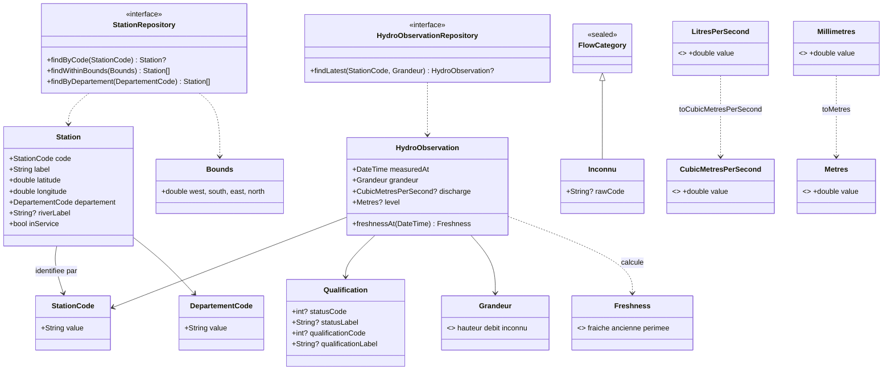
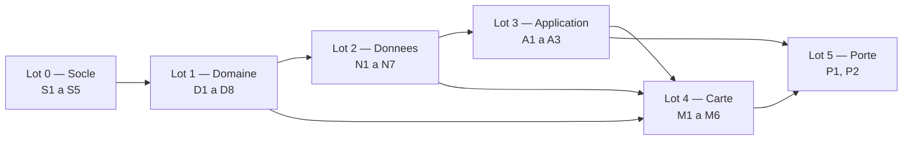

# T0 — Socle Flutter : plan d'implémentation

> **For agentic workers:** REQUIRED SUB-SKILL: Use superpowers:subagent-driven-development (recommended) or superpowers:executing-plans to implement this plan task-by-task. Steps use checkbox (`- [ ]`) syntax for tracking.

**Goal:** `lib/main.dart` affiche le fond IGN avec les 4 150 stations du référentiel en marqueurs du viewport, sur Windows ; `flutter build windows --release` produit un exécutable lancé hors outil ; version `0.1.0`.

**Architecture:** Clean Architecture en couches — `lib/domain/` (Dart pur, zéro dépendance d'infrastructure) → `lib/data/` (clients HTTP, mappers, asset du référentiel) → `lib/application/` (`Query`/`Command` typés, registre de gestionnaires, décorateur `CachePolicy` unique) → `lib/features/` (écrans). CQRS léger : pas de médiateur, pas d'événement de domaine, pas de projection. Aucun service distant à nous.

**Tech Stack:** Flutter 3.47.4 stable / Dart 3.13.3 · `flutter_map` 8.3.2 (tuiles raster WMTS) · `latlong2` · `package:http` · `flutter_test` · cible **Windows** construite, **iOS** configuré et jamais compilé.

---

## Avancement

**Mise à jour : 2026-09-13.**

| Lot | Tâches faites / total |
|---|---|
| Lot 0 — Socle | 5/5 |
| Lot 1 — Domaine | 8/8 |
| Lot 2 — Données | 7/7 |
| Lot 3 — Application | 3/3 |
| Lot 4 — Carte | 6/6 |
| Lot 5 — La porte de T0 | P1 en cours (étapes 1-4 faites, 5-6 en cours) |
| Android | 0/5 ⏸ |

**Tests verts : 247.**

### Écarts constatés à l'exécution

- S2 : aucun rouge sur le gabarit généré (déjà conforme) ; l'outillage ajoute `ios/**` et `windows/**` à `analyzer.exclude` ; `require_trailing_commas` inopérante en Dart 3.13, `dart format --set-exit-if-changed` fait foi (`710d191`).
- D1 : les `extension type` ferment **les deux sens** (pas d'asymétrie), `.value` seule sortie (`7873f1e`).
- D4 : doc des coordonnées ajoutée après relecture (`b5a06c5`).
- D7/D8 : `Bounds` sans `==`/`hashCode` — à traiter si un cache par emprise apparaît (A3 ne le requiert pas) ; diagramme complété (`10b30c5`).
- N1 : `count` du code site **412** contre 206 (le plan anticipait 430/216) ; fixture `date_debut_obs_elab=2026-09-01` ajoutée ; statuts HTTP consignés dans `test/fixtures/CAPTURES.md` (`1d7b382`).
- N3 : gigue bornée dans `[0, 1]` (`bf83c71`).
- N4 : relecture → décodage UTF-8 explicite, pannes TLS, `maxAttempts ≥ 1`, `size ≥ 1` (correctif en cours).
- N6 : le tag d'archive du spike n'était plus accessible ; le code a été réécrit d'après les signatures et invariants du plan.
- A1 : `abstract interface class` retenue pour `Query`/`Command`, et non `sealed` — une requête se déclare dans sa tranche, le registre achemine par `Type` sans exiger l'exhaustivité (`1d929f5`).
- A3 : correctif après relecture — le verrou de rafraîchissement est libéré si `load` lève **synchronement** (pas seulement en cas d'échec asynchrone), et un échec d'écriture du cache n'annule plus la lecture fraîche déjà obtenue (`66820ea`).
- M1 : le zoom **19** est lui aussi servi par le géoplateforme IGN (constaté par appel réel) ; le zoom natif **18** est conservé comme **choix de charge**, pas comme limite technique de la source (`ea497b3`).
- M2 : une emprise inversée est **refusée** à l'appel plutôt que silencieusement acceptée (`ea497b3`).
- M4 : correctifs après relecture — les entités du référentiel sont lues **réellement** (département, cours d'eau, état de service), sans valeur sentinelle ; **37 stations** en service n'ont pas de `code_departement` (`e5c7e94`) ; la requête d'emprise part au **relâcher du geste** plutôt qu'à chaque trame, et les erreurs de chargement restent visibles à l'écran plutôt qu'avalées (`31b1cfe`).
- M5 : constat inverse de celui du spike — la **molette zoome** sur Windows à l'exécution de T0, le glisser fonctionne aussi ; la cause de l'écart avec le constat du spike n'est **pas établie**, consigné `NV-W1` dans `docs/nfr.md` (`809ac40`).
- Transverse : licence du code GPL-3.0-or-later (`a0d4279`) ; identifiants du plan en français (`delaiDeBase`, `taillePageMaximale`, `_attendre`) implémentés en anglais (`baseDelay`, `maxPageSize`, `_sleep`) par convention.

---

## Cible et périmètre

| Cible | État dans ce plan |
|---|---|
| **Windows** | **La seule construite.** Toutes les portes de ce plan se franchissent sur Windows |
| **iOS** | Déclaré à la création du projet, `bundleIdentifier` aligné. **Jamais compilé** — aucun hôte macOS |
| **Android** | ⏸ **différé jusqu'à nouvel ordre (arbitrage 2026-09-12).** Les tâches existent, elles sont listées au Lot 5, elles ne sont ni supprimées ni comptées faites |

**Porte de spike franchie** — `spike/porte_flutter/COMPTE-RENDU.md` : `F1` (fond IGN) ✅ sur Windows, `F3` (exécutable Windows autonome) ✅, `F2` (4 150 marqueurs clusterisés) **non tranchée**, remesure différée. **Approche par défaut retenue : marqueurs du viewport plus une marge, sans regroupement.**

### Ce que T0 ne fait pas

- Aucun stockage local. Pas de base, pas de cache sur disque. `ADR-011` reste **réservé** au choix de la bibliothèque de stockage, à trancher quand un écran en aura besoin.
- Aucun appel VigiEau. `SourceRestriction` n'est qu'une interface ; l'implémentation et la fiche `docs/sources/vigieau.md` arrivent en **T2**.
- Aucun générateur de percentiles. `ADR-003` décrit un script **hors application** ; il sera écrit en Dart, **hors T0**.
- Aucun critère Gherkin, aucune matrice de traçabilité : **T1**.
- Aucun avertissement produit (`BR-012`, `BR-013`, `BR-014`) : **T1**. Rien ne part en production sans eux — T0 ne part pas en production, il produit un exécutable de vérification.
- Aucun `ADR-013` (bascule de stack et cible unique). Il reste à écrire ; `.gitignore` le cite déjà comme la décision qui rend `windows/` et `ios/` versionnés.

---

## Faits vérifiés le 2026-09-13, à ne pas re-supposer

Tous relevés par **appel HTTP réel** ce jour. Un fait absent de ce tableau est à vérifier avant d'être écrit.

| # | Fait constaté | Appel |
|---|---|---|
| V-01 | `observations_tr` avec `size=2` répond **HTTP 206**, `api_version` `2.0.1` | `…/v2/hydrometrie/observations_tr?code_entite=K447001001&grandeur_hydro=Q&size=2` |
| V-02 | **Débit en l/s** : `resultat_obs` = `47800.0` sur `K447001001`, soit **47,8 m³/s** | idem V-01 |
| V-03 | **Hauteur en mm, et négative** : `resultat_obs` = `-1232.0`, soit **−1,232 m**. Aucun contrôle de signe ne doit être ajouté | `…&grandeur_hydro=H&size=1` |
| V-04 | La dernière observation de `K447001001` date du **2026-08-27T08:00:00Z**, soit **dix-sept jours**. Le « temps réel » est périmé au sens de `BR-005` sur une station de référence | idem V-01 |
| V-05 | **`C-05` reproduit** : le code **site** `K4470010` (8 car.) renvoie chaque mesure **en double**, dont une ligne à `code_station: null`. `count` = **430** contre **216** pour le code station (recapture du 2026-09-13 : 412 / 206, voir `test/fixtures/CAPTURES.md`) | `…?code_entite=K4470010&grandeur_hydro=Q&size=2` |
| V-06 | **`C-04` reproduit** : `obs_elab` sans `date_debut_obs_elab` commence au **`1900-01-01`** (`resultat_obs_elab` `155000.0`, `count` 44 733) | `…/v2/hydrometrie/obs_elab?code_entite=K447001001&grandeur_hydro_elab=QmnJ&size=2` |
| V-07 | Avec `date_debut_obs_elab=2026-08-01` : `count` **26**, première valeur `48524.0` au `2026-08-01`, `libelle_statut` « Donnée pré-validée » | `…&date_debut_obs_elab=2026-08-01&size=3` |
| V-08 | `date_debut_obs_elab=2026-09-01` → `count` **0**, **HTTP 200**. Une page vide est un 200 ; une page partielle un 206 (`C-06`) | `…&date_debut_obs_elab=2026-09-01&size=2` |
| V-09 | Champ de qualification : `libelle_qualification_obs` sur `observations_tr`, `libelle_qualification` sur `obs_elab`. **Ce ne sont pas les mêmes noms** | V-01 et V-06 |
| V-10 | `referentiel/stations?code_station=K447001001` → **HTTP 200**, `longitude_station` / `latitude_station`, `en_service: true`, `code_departement: "41"` | `…/v2/hydrometrie/referentiel/stations?code_station=K447001001&size=1` |
| V-11 | **`C-10` reproduit** : `code_ecoulement` est une **chaîne**. Sur 300 observations du département 41 : `"1a"` 116 · `"1f"` 95 · `"2"` 24 · `"3"` 65. Libellés : « Ecoulement visible acceptable », « Ecoulement visible faible », « Ecoulement non visible », « Assec ». `api_version` `1.2.0`, **HTTP 206** | `…/v1/ecoulement/observations?code_departement=41&size=300` |
| V-12 | Les codes `"1"` et `"4"` **n'apparaissent pas** dans cet échantillon ; ils étaient constatés le 2026-08-01 sur 8 départements. La nomenclature doit les accepter **sans les exiger** (`BR-011`) | idem V-11 |
| V-13 | Tuile IGN `GEOGRAPHICALGRIDSYSTEMS.PLANIGNV2`, `TILEMATRIXSET=PM`, `TILEMATRIX=9&TILECOL=253&TILEROW=180` → **HTTP 200**, `image/png`, **31 087 octets** | `https://data.geopf.fr/wmts?…` |
| V-14 | `assets/referentiel/stations.json` est **versionné** : **6 604 249 octets**, `"count": 4150`, `en_service=1`, `api_version` `2.0.1` | fichier local, `git ls-files` |

**Deux faits nouveaux, absents du cadrage :** V-09 (le champ de qualification change de nom selon l'endpoint) et le **code de station ONDE à huit caractères** (`"K4520001"`) — les deux référentiels sont distincts, `StationCode` ne s'applique pas à l'écoulement. Troisième fait marquant : V-04, la dernière observation à **17 jours** sur une station de référence.

### pub.dev, relevé le 2026-09-13

| Paquet | Dernière version publiée | Publiée | Licence | Windows |
|---|---|---|---|---|
| `flutter_map` | **8.3.2** | il y a 16 jours | BSD-3-Clause | ✅ (Android, iOS, Linux, macOS, web, Windows) |
| `latlong2` | **0.10.1** | il y a 4 mois | Apache-2.0 | ✅ (idem) |
| `http` | **1.6.0** | il y a 10 mois | BSD-3-Clause | ✅ (idem) |

> ⚠️ **`latlong2` : pub.dev publie `0.10.1`, mais la résolution retombe sur `0.9.1`** par contrainte transitive de `flutter_map`. Ce plan déclare `^0.9.1` et **fait constater** la version réellement liée (`S1`, étape 6).
> La contrainte SDK minimale de ces trois paquets **n'est pas affichée** sur pub.dev : **non vérifié**.

### Le poste, tel qu'il est

| Fait | Valeur |
|---|---|
| Flutter | **3.47.4** stable, Dart **3.13.3** (`flutter --version`, 2026-09-13) |
| Binaire | `D:\Users\Oliver254\develop\flutter\bin\flutter.bat` — **hors PATH**. Chemin absolu dans **chaque** commande |
| `flutter create` | accepte `--project-name`, `--org`, `--platforms`, `--template` (`flutter create --help`, 2026-09-13) |
| Outillage | **Dart et rien d'autre.** Aucun outil hors chaîne Dart n'est installé ni requis |

## Qui lance quoi

| Commande | Lancée par |
|---|---|
| `flutter analyze`, `flutter test`, `dart format`, `flutter pub get`, `flutter pub deps`, `curl` | **Claude**, dans le bac à sable |
| `flutter create`, `flutter run -d windows`, `flutter build windows --release`, lancement de l'exécutable | **le commanditaire** |

Toute commande du commanditaire est présentée **seule dans son bloc `bash`**, avec le **résultat attendu énoncé**, ensuite **constaté et recopié**. Jamais supposé.

## Critère de fin, identique pour chaque tâche — dit ici une seule fois

```bash
flutter analyze
flutter test
dart format --set-exit-if-changed lib test
```
Attendu : `No issues found!` · tous les tests passent, aucun `[E]` · code de sortie **0** au formatage, aucun fichier listé. Les trois sont verts **avant** le commit. **Un commit par tâche.**

---

## Structure de fichiers

```
pubspec.yaml                          version 0.1.0+1, assets, 3 dépendances
analysis_options.yaml                 mode strict (S2)
CHANGELOG.md                          Keep a Changelog (S4)
windows/  ios/                        versionnés, générés par flutter create

lib/
  main.dart                           point d'entrée : câble dépôt, registre et écran carte (M4)
  domain/                             Dart pur — aucune dépendance d'infrastructure
    units/quantities.dart             4 unités en extension type (D1)
    units/conversions.dart            l/s → m³/s, mm → m, une seule fois (D2)
    observation/freshness.dart        Fraiche / Ancienne / Perimee, bornes 2 h / 24 h (D3)
    observation/hydro_observation.dart entité + Qualification + Grandeur (D5)
    station/station.dart              StationCode 10 car., DepartementCode, Station (D4)
    nomenclature/flow_category.dart   sealed class + Inconnu porteur du code brut (D6)
    repositories/repositories.dart    interfaces seules, Bounds (D7)
  data/
    http/http_status.dart             200 et 206 = succès ; 429/5xx rejouables (N2)
    http/retry.dart                   recul exponentiel à gigue injectée (N3)
    http/hub_eau_client.dart          client + constructeurs d'URI (N4)
    mappers/hydro_observation_mapper.dart  seul point de conversion (N5)
    referentiel/stations_asset.dart   lecture du GeoJSON, ordre lon/lat (N6)
    referentiel/stations_asset_loader.dart chargement depuis le bundle (N6)
    restrictions/restriction_source.dart   interface seule (N7)
  application/
    messages.dart                     Query<R> / Command<R> scellés + requêtes T0 (A1)
    bus.dart                          registre Map<Type, gestionnaire> (A2)
    cache_policy.dart                 stale-while-revalidate, unique (A3)
  features/map/
    ign_tile_template.dart            gabarit WMTS KVP + attribution (M1)
    viewport_filter.dart              emprise visible plus marge proportionnelle (M2)
    map_screen.dart                   FlutterMap, TileLayer, attribution, marqueurs (M3, M4)

test/
  architecture/domain_isolation_test.dart   le premier test du projet (S3)
  fixtures/hubeau/*.json  fixtures/onde/*.json  fixtures/referentiel/*.json   (N1)
  domain/ data/ application/ features/ project/   un test par fichier de code

docs/
  plan-de-tests.md (S5) · domain-model.md (D8) · nfr.md (M6)
  sources/hubeau-hydrometrie.md · sources/onde.md (N1)
```

**`.gitignore` est déjà en place et déjà orienté Flutter. Ne pas le réécrire.** Il déclare `windows/`, `ios/` et `android/` comme **versionnés**, et ignore `build/`, `.dart_tool/`, les clés de signature et les réglages personnels.

### Code en anglais, domaine en français

- **Identifiants** (types, fonctions, champs, fichiers) : **anglais** — `freshnessOf`, `StationCode`, `toCubicMetresPerSecond`.
- **Valeurs de nomenclature métier** : **français**, mot pour mot comme `docs/glossary.md` — `Freshness.fraiche`, `Assec`, `EcoulementFaible`.
- **Commentaires de documentation et libellés de test** : **français**.

---

## Lot 0 — Socle

### Task S1 : Créer le projet Flutter, Windows et iOS — ✅ b538d8c

**Files:** créés `pubspec.yaml`, `analysis_options.yaml`, `lib/main.dart`, `.metadata`, `windows/**`, `ios/**`, `test/project/ios_bundle_identifier_test.dart` · modifiés `pubspec.yaml`, `ios/Runner.xcodeproj/project.pbxproj` · **protégés** `.gitignore`, `README.md`, `CLAUDE.md`, `LICENSE.txt` (⚠️ `flutter create` écrase les deux premiers)

- [x] **Étape 1 — photographier l'arbre.** `git status --porcelain && ls -1` → arbre propre ; à la racine `CLAUDE.md`, `LICENSE.txt`, `README.md`, `assets`, `docs`, `spike`. **Pas de `lib/`, pas de `pubspec.yaml`.** Si `lib/` existe, s'arrêter et le signaler.

- [x] **Étape 2 — créer le projet (commanditaire).** ⚠️ écrase `.gitignore` et `README.md` par ses gabarits ; c'est attendu et réparé à l'étape 3.

```bash
flutter create --project-name martinpecheur --org fr.martinpecheur --platforms windows,ios .
```
Attendu : `All done!` puis `Wrote NN files.` ; `windows/` et `ios/` existent, **`android/` n'existe PAS** — sinon `--platforms` n'a pas été pris, recommencer.

- [x] **Étape 3 — rendre les deux fichiers écrasés.** `git checkout -- .gitignore README.md && git status --porcelain | head -30` → les deux ne sont plus modifiés ; le reste apparaît en `??`.

- [x] **Étape 4 — version, dépendances, asset.** Dans `pubspec.yaml` : `version: 0.1.0+1` ; supprimer `cupertino_icons` (rien ne l'utilise) ; bloc `dependencies:` et asset :

```yaml
dependencies:
  flutter:
    sdk: flutter
  flutter_map: ^8.3.2   # dernière publiée 2026-09-13, BSD-3-Clause, Windows ok
  latlong2: ^0.9.1      # ce qui se résout réellement, constaté à l'étape 6
  http: ^1.6.0          # MockClient fourni par package:http/testing.dart
flutter:
  assets:
    - assets/referentiel/stations.json   # 6 604 249 octets, count 4150
```

- [x] **Étape 5 — résoudre.** `flutter pub get` → `Got dependencies!`, sans conflit.

- [x] **Étape 6 — constater les versions liées.** `flutter pub deps --style=compact | grep -Ei 'flutter_map|latlong2|^- http|http [0-9]'` → trois lignes, une version chacune. **Recopier dans le corps du commit.** Si `latlong2` n'est pas en `0.9.x`, le noter : le constat remplace l'attente.

- [x] **Étape 7 — aligner l'identifiant de bundle iOS.** `--org fr.martinpecheur` + `--project-name martinpecheur` produit `fr.martinpecheur.martinpecheur` ; la cible est `fr.martinpecheur.app`.

```bash
sed -i 's/fr\.martinpecheur\.martinpecheur/fr.martinpecheur.app/g' ios/Runner.xcodeproj/project.pbxproj && grep -c 'fr\.martinpecheur\.app' ios/Runner.xcodeproj/project.pbxproj && grep -c 'fr\.martinpecheur\.martinpecheur' ios/Runner.xcodeproj/project.pbxproj || true
```
Attendu : premier compte **≥ 3**, second à **0**. Les variantes `…app.RunnerTests` sont correctes.

- [x] **Étape 8 — test de non-régression.** `test/project/ios_bundle_identifier_test.dart`, deux cas :
  - `ios/Runner.xcodeproj/project.pbxproj` existe, contient `fr.martinpecheur.app`, ne contient plus `fr.martinpecheur.martinpecheur` → une régénération iOS remettrait le gabarit sans bruit.
  - `Directory('android').existsSync()` → `false` : le différé est une décision, il se vérifie.

- [x] **Étape 9 — supprimer le test de gabarit.** `rm -f test/widget_test.dart` (il teste un compteur qui n'existera pas).

- [x] **Étape 10 — vérifier.** `flutter test test/project/ios_bundle_identifier_test.dart` → **2 tests passent**.

- [x] **Étape 11 — commit.**

```bash
git add -A && git commit -m "build: creer le projet Flutter, cibles Windows et iOS, version 0.1.0" -m "flutter create --platforms windows,ios : android/ n est pas genere, differe le 2026-09-12. flutter_map, latlong2, http declares (versions liees recopiees ici) ; cupertino_icons retire. assets/referentiel/stations.json declare (6 604 249 octets, count 4150). bundleIdentifier iOS aligne sur fr.martinpecheur.app, verrouille par test. .gitignore et README.md rendus apres ecrasement par le gabarit."
```

### Task S2 : Durcir l'analyse statique — ✅ c90f6de + 710d191

**Files:** modifiés `analysis_options.yaml`, `lib/main.dart`

- [x] **Étape 1 — remplacer le contenu généré** (il n'inclut que `flutter_lints`) :

```yaml
# `CLAUDE.md` : mode strict non négociable. Sans `strict-casts`, un `dynamic`
# traverse une frontière de couche sans bruit et une valeur brute d'API atteint
# la vue (`BR-002`).
include: package:flutter_lints/flutter.yaml

analyzer:
  language:
    strict-casts: true       # un transtypage depuis dynamic devient une erreur
    strict-inference: true   # un paramètre de type non inférable devient une erreur
    strict-raw-types: true   # `List` sans paramètre devient une erreur
  errors:
    dead_code: error         # branche de nomenclature crue atteinte et qui ne l'est pas
    unused_import: error
    unused_local_variable: error
    unnecessary_cast: error
  exclude:
    - build/**

linter:
  rules:
    - always_declare_return_types   # un retour omis vaut dynamic
    - avoid_dynamic_calls           # contournerait tout le typage des unités
    - avoid_print
    - unawaited_futures             # un Future ni attendu ni délaissé est une course
    - prefer_final_locals
    - prefer_final_in_for_each
    - require_trailing_commas
    - use_super_parameters
    - directives_ordering
    - always_use_package_imports    # le chemin de couche lisible sur la ligne d'import (S3)
```

- [x] **Étape 2 — constater ce que le durcissement casse.** `flutter analyze` → **des remarques** sur le `lib/main.dart` généré. **C'est le rouge de cette tâche** ; recopier le nombre de remarques.

- [x] **Étape 3 — réduire `lib/main.dart`** à la plus petite application conforme : `void main()` + `class MartinPecheurApp extends StatelessWidget` → `MaterialApp(title: 'MartinPêcheur', home: Scaffold(body: Center(child: Text('MartinPêcheur'))))`, tout `const`. `M4` le réécrit.

- [x] **Étape 4 — vérifier** (`analyze` → `No issues found!`, `dart format --set-exit-if-changed` → 0) puis commit.

```bash
git add analysis_options.yaml lib/main.dart && git commit -m "build: durcir l analyse statique — strict-casts, strict-inference, strict-raw-types" -m "Sans strict-casts, une lecture de JSON mal typee traverse la frontiere de couche sans bruit et une valeur brute d API atteint la vue (BR-002). main.dart reduit a la plus petite application conforme ; l ecran carte le remplace en M4."
```

---

### Task S3 : Le premier test du projet — la frontière `domain/` — ✅ f6577ac

**C'est le premier test écrit, avant toute ligne de `lib/domain/`.** Un verrou posé après le code ne verrouille rien : il constate.

**Files:** créé `test/architecture/domain_isolation_test.dart`

> Dart n'offre **aucun lint de restriction d'import par dossier** dans sa chaîne standard. Ce test est donc le **seul** verrou mécanique de la frontière, et il tourne à chaque `flutter test`. Écart assumé avec les « deux verrous » que `CLAUDE.md` décrit.

**Signatures**

```dart
const List<String> importsInterdits;   // package:flutter/ · flutter_test/ · flutter_map/ ·
                                       // latlong2/ · http/ · drift/ · sqflite/ · dart:io · dart:ui
List<String> relevesInterditsSous(Directory racine);  // → 'chemin:ligne → import'
```

`dart:math` et `dart:convert` restent **autorisés** : ce sont des calculs, pas des infrastructures. `dart:io` et `dart:ui` sont interdits au même titre que les paquets — un domaine qui lit un fichier ou connaît un pixel n'est plus un domaine.

**Corps du parcours, en trois lignes** — si `racine` n'existe pas, rendre une liste vide ; parcourir `listSync(recursive: true)` et ne retenir que les `File` en `.dart` ; pour chaque ligne **commençant** par `import ` ou `export `, relever chaque motif interdit qu'elle contient, avec `chemin:numéro`. On lit le **texte** des directives, pas un arbre syntaxique : plus grossier, mais sans dépendance d'analyse et sans panne silencieuse ; un commentaire qui nomme un paquet interdit n'est pas une dépendance.

**Cas de test** (3)
- `lib/domain/` n'importe aucune infrastructure → relevés vides ; message d'échec disant de déplacer le code fautif vers `data/` ou `features/` et de passer par une interface de dépôt (`BR-002`).
- dossier absent (`lib/domain_absent`) et dossier temporaire vide → vides. Le test est écrit **avant** la première ligne de domaine : il doit être vert à ce moment-là, sinon il serait désactivé et jamais rallumé.
- cas négatif sur fichiers temporaires : `fautif.dart` important `package:flutter/material.dart` + `innocent.dart` important `dart:math` et **citant** `package:http/` en commentaire → exactement **1** relevé, contenant `package:flutter/` et `fautif.dart:1`. Sans ce cas, un détecteur qui ne détecte plus rien reste vert.

- [x] **Étape 1** — écrire le test. `flutter test test/architecture/domain_isolation_test.dart` → **3 tests passent**.

- [x] **Étape 2 — constater le rouge sur le vrai dossier, puis l'effacer.**

```bash
mkdir -p lib/domain && printf "import 'package:flutter/material.dart';\n\nconst int sonde = 1;\n" > lib/domain/sonde_temporaire.dart && flutter test test/architecture/domain_isolation_test.dart ; rm -f lib/domain/sonde_temporaire.dart
```
Attendu : le **premier test échoue** avec `lib/domain/sonde_temporaire.dart:1 → package:flutter/` ; le fichier est ensuite supprimé. Revérifier ensuite : **3 tests passent**.

- [x] **Étape 2 — commit.**

```bash
git add test/architecture/domain_isolation_test.dart && git commit -m "test(domain): verrouiller la frontiere du domaine avant d y ecrire une ligne" -m "Dart n offre aucun lint de restriction d import par dossier : ce test est le seul verrou mecanique, et il tourne a chaque flutter test. Trois cas : le vrai dossier, un dossier absent ou vide, et un cas negatif sur fichier temporaire — sans ce dernier, un detecteur qui ne detecte plus rien resterait vert."
```

---

### Task S4 : `CHANGELOG.md` — ✅ 90d7529

**Files:** créés `CHANGELOG.md`, `test/project/changelog_test.dart`

**Cas de test** (1 test, 4 assertions) — `pubspec.yaml` déclare une `version: X.Y.Z` ; `CHANGELOG.md` contient `## [X.Y.Z]`, `## [Non publié]` et `keepachangelog.com`. Une version annoncée d'un côté et absente de l'autre, c'est une release dont on ne sait pas ce qu'elle contient.

**Plan du document** — `# Changelog` · format [Keep a Changelog] 1.1.0 (fr) · versionnage SemVer (fr) · note liminaire : une ligne décrit ce qui change **pour un usager ou un intégrateur**, jamais un détail interne ; un remaniement sans effet observable n'y figure pas.
- `## [Non publié]` — vide.
- `## [0.1.0] — à publier` — « première tranche technique, **rien de tout cela n'est un produit** » : aucun avertissement posé (`BR-012`, `BR-013`), `CLAUDE.md` interdit la mise en production.
  - `### Ajouté` : cible **Windows** construite, **iOS** déclarée jamais compilée · écran carte, fond **IGN Géoplateforme** en tuiles raster, attribution « © IGN Géoplateforme — Licence Ouverte » affichée, **4 150 stations** en marqueurs limités à l'emprise visible plus marge · socle de domaine : unités typées (m³/s, m), fraîcheur (`BR-005`), nomenclature d'écoulement tolérante à l'inconnu (`BR-011`), code station à dix caractères · socle de données : client hydrométrie **v2** avec nouvelle tentative à gigue, `200` et `206` en succès, conversion en un seul point · politique de cache unique · documentation de spécification : fiches de sources datées, modèle de domaine, exigences non fonctionnelles, plan de tests.
  - `### Différé` : **Android** en entier (arbitrage 2026-09-12) — aucune plateforme générée, aucune signature, aucune publication · stockage local, `ADR-011` réservé · volet sécheresse, `SourceRestriction` n'est qu'une interface (T2).

- [x] **Étape 1** — écrire le test, le lancer : `flutter test test/project/changelog_test.dart` → échec `PathNotFoundException` sur `CHANGELOG.md`.
- [x] **Étape 2** — écrire le document, relancer → **1 test passe**.
- [x] **Étape 2 — commit.**

```bash
git add CHANGELOG.md test/project/changelog_test.dart && git commit -m "docs: ouvrir le CHANGELOG en 0.1.0, format Keep a Changelog" -m "Un test lie la version du CHANGELOG a celle du pubspec : une version annoncee d un cote et absente de l autre, c est une release dont on ne sait pas ce qu elle contient."
```

---

### Task S5 : `docs/plan-de-tests.md` — ✅ ed37078

**Files:** créé `docs/plan-de-tests.md` · modifié `docs/README.md` (ligne d'index)

**Plan du document** — statut Accepté, date 2026-09-13, portée T0 (Gherkin et matrice de traçabilité en T1). Il dit **à quel étage** une règle est vérifiée, pas quels tests existent.

- **La pyramide** — tableau à cinq lignes : `test/architecture/` (les frontières de couches tiennent : aucune infrastructure sous `lib/domain/`, aucun appel au volet sécheresse hors de son module — quelques ms — ✅ T0) · `test/domain/`, `test/data/`, `test/application/` (règles métier et conversions, **tout `BR-xxx` se vérifie ici** ou nulle part — ms — ✅) · `test/features/` (un écran affiche ce que la règle impose : attribution présente, marqueurs filtrés, absence jamais neutre — dizaines de ms — ✅ minimal) · `test/features/goldens/` (rendu d'un marqueur : contraste, halo, atténuation d'une donnée périmée — s — 🔄 T1) · `integration_test/` (parcours complet sur appareil ou fenêtre réelle — minutes — 🔄 T1).
- **Un mermaid `graph BT`** de cinq nœuds, de l'architecture vers l'acceptation (le test d'index de `S5` grep `graph BT`).
- **Les quatre règles qui décident de l'étage** : 1. une règle métier se teste **sans rendu** — si vérifier `BR-005` demande un widget, la règle est dans la vue. 2. une valeur d'API ne se teste **jamais** contre un nombre inventé : valeurs relevées par appel réel, datées, conservées en fixture. 3. une borne se teste **des deux côtés**, et `2 h 00` exactement est le cas qui décide — la borne appartient toujours à l'état **le plus sévère**. 4. le hasard est **injecté, jamais lu** : instant courant, gigue, état du réseau sont des paramètres ; une borne non testable n'est pas une borne.
- **Ce qu'on ne teste pas, et pourquoi** : le rendu des tuiles (c'est la bibliothèque — on teste **le gabarit d'URL**, car `TILECOL`/`TILEROW` inversés donnent une carte transposée sans aucune erreur) · le réseau réel en test automatisé (aucun SLA, `C-15` : la suite serait rouge sans code fautif ; les appels réels servent à **produire les fixtures**) · la couverture chiffrée (un pourcentage ne dit pas si `BR-002` est couvert ; la question de revue est « quel test tombe si cette règle est cassée ? ») · le hors-ligne en T0 (aucun stockage local n'existe ; `NFR-03` le chiffre).
- **Fixtures** : un fichier par appel, `<endpoint>_<parametres>_<AAAA-MM-JJ>.json` · contenu **verbatim**, sauf extrait déclaré comme tel dans la fiche de source · la date est celle de **capture** ; une fixture ne se met pas à jour, on en capture une nouvelle et la fiche dit laquelle fait foi · toute fixture est référencée depuis `docs/sources/*.md` — une fixture orpheline est une fixture dont personne ne sait ce qu'elle prouve.

- [x] **Étape 1** — écrire le document.
- [x] **Étape 2** — indexer dans `docs/README.md`, tableau « Organisation », après `guide-test-appareil.md` : `| [`plan-de-tests.md`](plan-de-tests.md) | **Plan de tests** — la pyramide, à quel étage une règle se vérifie | — |`
- [x] **Étape 3 — vérifier.** `grep -c 'plan-de-tests' docs/README.md && grep -c 'classDiagram\|graph BT' docs/plan-de-tests.md` → `1` puis `1`.
- [x] **Étape 4 — commit.**

```bash
git add docs/plan-de-tests.md docs/README.md && git commit -m "docs: poser le plan de tests, cinq etages et quatre regles de placement" -m "Le document ne liste pas les tests : il dit a quel etage une regle se verifie et pourquoi pas ailleurs. Une regle metier qui exige un widget pour etre verifiee est au mauvais endroit."
```

---

## Lot 1 — Domaine

**Dart pur.** Aucun fichier de ce lot n'importe `package:flutter`, `package:http`, `dart:io` ni `dart:ui` : `S3` le refuserait.

> ⚠️ **Ordre :** le code station (`D4`) précède l'observation (`D5`) — `HydroObservation` porte un `StationCode`, et un type ne peut pas référencer un type qui n'existe pas. Seul écart d'ordre du lot.

### Task D1 : Les unités, nommées par le type — ✅ e3087e7

**Files:** créé `lib/domain/units/quantities.dart` · test `test/domain/units/quantities_test.dart`

> `BR-002` : un `double` en l/s passé là où on attend des m³/s produit une **erreur d'un facteur 1000**, sur laquelle un usager fonde une décision. Rien d'autre ne se code avant ça.

**Signatures**

```dart
extension type const LitresPerSecond(double value) {}       // débit brut de l'API (C-02)
extension type const Millimetres(double value) {}           // hauteur brute de l'API (C-02)
extension type const CubicMetresPerSecond(double value) {}  // seule unité de débit affichable
extension type const Metres(double value) {}                // seule unité de hauteur affichable
```

**Invariants et pièges**
- Les `extension type` s'effacent à l'exécution : **aucun objet alloué**, coût nul ; ce qu'ils apportent est une interdiction de compilation.
- Les deux sens sont fermés (constaté le 2026-09-13 : sans `implements double`, un `LitresPerSecond` n'est pas non plus acceptable là où un `double` est attendu). C'est voulu : la seule sortie vers le nombre nu est `.value`, explicite et lisible. Un `double` n'est **jamais** acceptable là où une unité est attendue.
- Aucune validation ici : ces types **nomment**, ils ne refusent pas.

**Cas de test** (3)
- `LitresPerSecond(47800.0).value → 47800.0` : le brut est conservé tel quel (relevé sur `K447001001` le 2026-09-13).
- `Millimetres(-1232.0).value → -1232.0` : hauteur négative acceptée, **aucun contrôle de signe** ne doit exister.
- `CubicMetresPerSecond(47.8)` et `Metres(-1.232)` : les seules unités affichables.

- [x] **Étape 1** — test rouge : `flutter test test/domain/units/quantities_test.dart` → `Target of URI doesn't exist` ; puis implémenter → **3 tests passent**.

- [x] **Étape 2 — constater l'interdiction de compilation, puis effacer la sonde.** La séparation des unités est une garantie du **compilateur**, pas d'une assertion.

```bash
printf "import 'package:martinpecheur/domain/units/quantities.dart';\n\nCubicMetresPerSecond sonde() {\n  const brut = LitresPerSecond(47800.0);\n  return brut;\n}\n" > lib/domain/units/sonde_temporaire.dart && flutter analyze lib/domain/units/sonde_temporaire.dart ; rm -f lib/domain/units/sonde_temporaire.dart
```
Attendu : une erreur `argument_type_not_assignable` ou `return_of_invalid_type`. **Recopier le message exact dans le corps du commit.**

- [x] **Étape 2 — commit.**

```bash
git add lib/domain/units/quantities.dart test/domain/units/quantities_test.dart && git commit -m "feat(domain): nommer les quatre unites par le type, pas par convention" -m "BR-002 : le bug le plus couteux du projet est un double en l/s passe la ou des m3/s sont attendus. Les extension type ferment ce sens-la a la compilation, sans rien allouer. Erreur d analyse constatee : <recopier>. Valeurs relevees le 2026-09-13 sur K447001001 : 47800.0 l/s et -1232.0 mm."
```

---

### Task D2 : La conversion, à un seul endroit — ✅ 3eb7a04

**Files:** créé `lib/domain/units/conversions.dart` · test `test/domain/units/conversions_test.dart`

**Signatures**

```dart
CubicMetresPerSecond? toCubicMetresPerSecond(LitresPerSecond? raw);
Metres? toMetres(Millimetres? raw);
// privés : const int _perThousand = 1000; double _divide(double value);
```

**Invariants et pièges**
- Le facteur mille n'apparaît **qu'ici** (`BR-002`). Une conversion faite deux fois est aussi fausse qu'oubliée, et plus difficile à retrouver : le premier cas donne un débit mille fois trop grand, qu'on remarque ; le second un débit mille fois trop petit, qui ressemble à un étiage.
- `null` en entrée → `null` en sortie : une absence n'est **jamais** remplacée par zéro (`BR-007`).
- Une valeur non finie **lève** : `NaN` n'est pas une absence, c'est un défaut — le confondre afficherait « la station n'a pas transmis » alors que le code est cassé.
- Les valeurs négatives traversent sans contrôle (hauteur rapportée au zéro de l'échelle).

**Cas de test** (6)
- `47800.0 l/s → 47.8 m³/s` (relevé 2026-09-13) · `48524.0 → 48.524` (QmnJ du 2026-08-01) · `53000.0 → 53.0` et `350571.0 → 350.571` (relevés 2026-07-30, cités par `BR-002`).
- `0 l/s → 0` : un zéro mesuré reste un zéro — c'est un assec, un fait (`BR-007`).
- `null → null` : une absence reste une absence.
- `double.nan` → `ArgumentError` ; `double.infinity` → `ArgumentError`.
- `-1232.0 mm → -1.232 m`.
- `null` mm → `null`.

- [x] **Étape 1** — test rouge : `flutter test test/domain/units/conversions_test.dart` ; puis implémenter → **6 tests passent**.
- [x] **Étape 2 — vérifier l'unicité.** `grep -rn '1000' lib/ --include='*.dart' | grep -v 'conversions.dart'` → **aucune ligne**. Toute ligne future est soit une seconde conversion (fausse), soit une constante de temps mal placée.
- [x] **Étape 2 — commit.**

```bash
git add lib/domain/units/conversions.dart test/domain/units/conversions_test.dart && git commit -m "feat(domain): convertir l/s en m3/s et mm en m, a un seul endroit" -m "BR-002, BR-007, C-02. Le facteur mille n apparait que dans ce fichier. Un zero mesure reste un zero, une absence reste une absence, une valeur non finie leve. Valeurs de test : 47800.0, 48524.0, -1232.0 (2026-09-13), 53000.0 et 350571.0 (2026-07-30)."
```

---

### Task D3 : La fraîcheur d'une observation — ✅ f6c3631

**Files:** créé `lib/domain/observation/freshness.dart` · test `test/domain/observation/freshness_test.dart`

**Signatures**

```dart
enum Freshness { fraiche, ancienne, perimee }
const Duration ancienneApres = Duration(hours: 2);
const Duration perimeeApres = Duration(hours: 24);
Freshness freshnessOf({required DateTime measuredAt, required DateTime now});
```

**Invariants et pièges**
- Fonction pure : `now` est un **paramètre**, jamais lu à l'intérieur — sinon les bornes ne sont pas testables.
- `measuredAt` est la date de **mesure**, jamais de récupération : une donnée fraîchement téléchargée peut avoir dix-sept jours (`BR-001`).
- La borne appartient à l'état **le plus sévère** : on ne minimise jamais l'âge d'une donnée sur laquelle un usager fonde une décision.
- Seuils **absolus** de `BR-005`, sans rapport avec un TTL de cache : les confondre déclarerait périmée une observation de quarante minutes.
- Ne s'applique **pas** aux observations d'écoulement : une campagne de trois semaines y est normale (`BR-010`).
- Affichage attendu : `fraiche` sans mention · `ancienne` « il y a N h » · `perimee` marqueur atténué **et** avertissement explicite.

**Cas de test** (8)
- `1 min → fraiche` ; `1 h 59 → fraiche`.
- `2 h exactement → ancienne` — la borne appartient au plus sévère.
- `2 h + 1 min → ancienne` ; `23 h 59 → ancienne`.
- `24 h exactement → perimee`.
- `24 h + 1 min → perimee` ; `17 jours → perimee` (mesure du 2026-08-27T08:00:00Z lue le 2026-09-13 : cas réel, pas théorique).
- mesure **dans le futur** (`now + 3 h`) → `fraiche` : âge négatif, anomalie de la source, pas une donnée vieille ; la déclarer périmée inventerait un âge inconnu.
- heure locale vs UTC : une mesure à `-3 h` convertie en local → `ancienne`. `difference` compare des instants absolus ; ce test empêche d'ajouter un `toUtc()` « au cas où ».
- `ancienneApres == 2 h` et `perimeeApres == 24 h`.

- [x] **Étape 1** — test rouge : `flutter test test/domain/observation/freshness_test.dart` ; puis implémenter → **8 tests passent**.
- [x] **Étape 2 — commit.**

```bash
git add lib/domain/observation/freshness.dart test/domain/observation/freshness_test.dart && git commit -m "feat(domain): calculer la fraicheur d une observation aux bornes de BR-005" -m "Seuils absolus 2 h puis 24 h, sur la date de MESURE et jamais de recuperation. La borne appartient a l etat le plus severe. L instant courant est un parametre : une borne non testable n est pas une borne. Constate le 2026-09-13 : la derniere observation de K447001001 datait de dix-sept jours."
```

---

### Task D4 : La station et son code à dix caractères — ✅ b31eae2 + b5a06c5

**Files:** créé `lib/domain/station/station.dart` · test `test/domain/station/station_test.dart`

> `C-05`, **reproduit le 2026-09-13** : le code **site** `K4470010` (8 car.) renvoie chaque mesure **en double**, dont une ligne à `code_station: null` — `count` 430 contre 216. Le type doit rendre cette confusion impossible.

**Signatures**

```dart
final class StationCode {          // classe et non extension type : il VALIDE
  factory StationCode(String raw); // 10 car., RegExp r'^[A-Z0-9]{10}$'
  final String value;              // == et hashCode sur value, toString() => value
}
final class DepartementCode {
  factory DepartementCode(String raw);  // normalise en majuscules, RegExp r'^(\d{2}|2[AB]|\d{3})$'
  final String value;                   // == et hashCode sur value
}
final class Station {
  const Station({required StationCode code, required String label,
    required double latitude, required double longitude,
    required DepartementCode departement, required String? riverLabel,
    required bool inService});
}
```

**Invariants et pièges**
- Forme **mesurée** sur les 4 150 stations en service : **3 974** en `A999999999`, **176** en `9999999999` (DOM). Restreindre à la forme majoritaire rejetterait ces 176.
- Une valeur de bonne longueur mais de mauvaise forme partirait vers l'API et reviendrait vide, affichée en « pas de donnée » (`BR-007`) — un faux négatif silencieux : on refuse à la construction.
- `DepartementCode` est une **chaîne** : `"01"` traité comme un nombre deviendrait `1` ; la Corse le rend de toute façon impossible.
- `riverLabel` à `null` = absence, jamais chaîne vide (`BR-007`).
- ⚠️ Les coordonnées s'appellent `latitude_station`/`longitude_station` au référentiel et `latitude`/`longitude` en temps réel : le domaine n'en connaît qu'un, c'est au mapper d'absorber l'écart.

**Cas de test** (10)
- `StationCode('K447001001')` → ok (forme la plus fréquente).
- `StationCode('1011000101')` → ok (dix chiffres des DOM).
- `StationCode('K4470010')` (8 car.) → `ArgumentError` (`C-05`).
- `StationCode('')` et `StationCode('K4470010012')` (11) → `ArgumentError`.
- `StationCode('k447-01001')` et `StationCode('k447001001')` → `ArgumentError` (dix caractères, mauvaise forme).
- deux codes de même valeur sont égaux, même `hashCode`.
- `DepartementCode('41')→'41'` · `('2a')→'2A'` · `('2B')→'2B'` · `('971')→'971'`.
- `DepartementCode('1')` et `('ZZ')` → `ArgumentError`.
- `Station` porte les champs du référentiel : `K447001001`, `latitude 47.584957074`, `longitude 1.335147948`, `departement '41'`, `inService true` (relevés le 2026-09-13, HTTP 200).
- `Station` sans cours d'eau : `1011000101`, `16.189402`, `-61.658989`, `'971'`, `riverLabel == null`.

- [x] **Étape 1** — test rouge : `flutter test test/domain/station/station_test.dart` ; puis implémenter → **10 tests passent**.
- [x] **Étape 2 — commit.**

```bash
git add lib/domain/station/station.dart test/domain/station/station_test.dart && git commit -m "feat(domain): typer le code station a dix caracteres, et le code departement en chaine" -m "C-05 reproduit le 2026-09-13 : le code site K4470010 renvoie chaque mesure en double, dont une ligne a code_station null — count 430 contre 216. La forme acceptee est celle MESUREE sur les 4 150 stations : 3 974 en lettre + neuf chiffres, 176 en dix chiffres pour les DOM."
```

---

### Task D5 : L'observation hydrométrique — ✅ fb08460

**Files:** créé `lib/domain/observation/hydro_observation.dart` · test `test/domain/observation/hydro_observation_test.dart`

**Signatures**

```dart
enum Grandeur { hauteur, debit, inconnu }
Grandeur grandeurFromCode(String? code);            // 'H' / 'Q' ; casse NON normalisée
final class Qualification {
  const Qualification({required int? statusCode, required String? statusLabel,
    required int? qualificationCode, required String? qualificationLabel});
}
final class HydroObservation {
  const HydroObservation({required StationCode station, required DateTime measuredAt,
    required Grandeur grandeur, required CubicMetresPerSecond? discharge,
    required Metres? level, required Qualification qualification});
  Freshness freshnessAt(DateTime now);
}
```

**Invariants et pièges**
- L'observation est **déjà convertie** : `discharge` et `level` portent des types d'unité, pas des `double` nus (`BR-002`).
- `null` = « la station n'a pas transmis cette grandeur », jamais zéro (`BR-007`) ; un zéro mesuré est un assec.
- `measuredAt` est la date de mesure (`BR-001`) ; `freshnessAt` reçoit l'instant en paramètre, l'entité ne lit pas l'horloge.
- Branche `Grandeur.inconnu` **obligatoire** (`BR-011`) : assimiler un code inconnu à `debit` afficherait des mètres comme des m³/s.
- La casse n'est pas normalisée : `H` et `Q` sont des codes, pas des mots — un `q` est une valeur qu'on ne connaît pas, et le dire est plus honnête que de le deviner.
- `Qualification` est transportée **telle quelle** (`BR-006`) : le produit affiche la nomenclature officielle, il ne la réinterprète pas.

**Cas de test** (7)
- `grandeurFromCode('Q') → debit` ; `('H') → hauteur`.
- `grandeurFromCode(null)`, `('X')`, `('q')` → `inconnu`.
- observation de débit : `discharge 47.8 m³/s`, `level null`.
- observation de hauteur : `level -1.232 m`, `discharge null`.
- `freshnessAt` : mesure `2026-08-27T08:00Z` lue à `2026-09-13T12:00Z` → `perimee` ; lue à `2026-08-27T09:00Z` → `fraiche`.
- qualification relevée le 2026-09-13 conservée : `statusCode 12`, `statusLabel 'Pré-validée'`, `qualificationCode 20`, `qualificationLabel 'Bonne'`.
- qualification entièrement absente (quatre champs `null`) → acceptée.

- [x] **Étape 1** — test rouge : `flutter test test/domain/observation/hydro_observation_test.dart` ; puis implémenter → **7 tests passent**.
- [x] **Étape 2 — commit.**

```bash
git add lib/domain/observation/hydro_observation.dart test/domain/observation/hydro_observation_test.dart && git commit -m "feat(domain): l observation hydrometrique, deja convertie et toujours datee" -m "BR-001, BR-002, BR-006, BR-007, BR-011. Le debit et la hauteur portent un type d unite, pas un double nu. null veut dire la station n a pas transmis, jamais zero. Une hauteur negative traverse sans controle : -1,232 m releve le 2026-09-13. Grandeur porte une branche inconnu."
```

---

### Task D6 : La nomenclature d'écoulement, tolérante à l'inconnu — ✅ 6f3798a

**Files:** créé `lib/domain/nomenclature/flow_category.dart` · test `test/domain/nomenclature/flow_category_test.dart`

> `C-10`, **reproduit le 2026-09-13** sur 300 observations du département 41 : `code_ecoulement` est une **chaîne** — `"1a"` 116, `"1f"` 95, `"2"` 24, `"3"` 65. Les codes `"1"` et `"4"`, constatés le 2026-08-01 sur huit départements, **n'y apparaissent pas** : la nomenclature les accepte sans les exiger.

**Signatures**

```dart
sealed class FlowCategory { const FlowCategory(); }
final class Ecoulement extends FlowCategory {}            // codes "1" et "1a"
final class EcoulementFaible extends FlowCategory {}      // code "1f" — signal précurseur
final class EcoulementNonVisible extends FlowCategory {}  // code "2" — flaques, plus d'écoulement
final class Assec extends FlowCategory {}                 // code "3" — lit sec
final class NonObserve extends FlowCategory {}            // code "4" — fait de terrain
final class Inconnu extends FlowCategory {                // notre ignorance
  const Inconnu(this.rawCode);
  final String? rawCode;   // == et hashCode sur rawCode ; toString() => 'Inconnu($rawCode)'
}
FlowCategory flowCategoryFromCode(String? code);
String flowCategoryLabel(FlowCategory category);
```

**Invariants et pièges**
- `sealed class` et non énumération pour **une** raison : `Inconnu` doit **porter la valeur brute reçue** (`BR-011`), ce qu'une constante d'énumération ne peut pas. Bénéfice second : exhaustivité au compilateur.
- ⚠️ `NonObserve` (l'observateur s'est déplacé et n'a pas pu observer — un fait) et `Inconnu` (nous ne savons pas lire — notre ignorance) ne sont **pas** synonymes ; les fondre ferait passer l'ignorance pour une observation (`BR-007`). `ADR-006` les regroupe à l'**affichage** seulement.
- La conversion **ne lève jamais** : perdre l'observation serait pire que nommer notre ignorance, et une conversion qui lève rendrait l'application inutilisable le jour où une modalité est ajoutée.
- Le brut conservé est celui **reçu**, pas le normalisé : c'est lui qui sert au diagnostic.
- `code_ecoulement` à `null` est un cas **nominal** : 30 sur 7 000 le 2026-08-01, plus fréquent que le code `"4"`.
- `switch` exhaustif par construction sur les libellés — c'est la parade de `BR-011` : une nomenclature incomplète ne se manifeste pas par un plantage mais par un affichage faussement rassurant.

**Cas de test** (10)
- `'1a'→Ecoulement` · `'1f'→EcoulementFaible` · `'2'→EcoulementNonVisible` · `'3'→Assec` (les quatre codes du 2026-09-13).
- `'1'→Ecoulement` · `'4'→NonObserve` (relevés le 2026-08-01, absents de l'échantillon : on sait les lire).
- `null → Inconnu(null)`, sans lever.
- `'5z' → Inconnu('5z')`, `rawCode == '5z'` : la valeur brute reste exploitable et diagnosticable.
- `'1A'→Ecoulement` et `' 1f '→EcoulementFaible` : casse et espaces ne fabriquent pas un inconnu.
- `' 9X '` → `rawCode == ' 9X '` : le brut conservé est celui reçu.
- `'' → Inconnu('')`.
- libellés `docs/glossary.md` : `'Écoulement visible'`, `'Écoulement faible'`, `'Eau stagnante'`, `'À sec'`, `'Observation impossible'`, `'Non renseigné'`.
- aucun libellé ne contient `assec`, `normal`, `suffisant`, `insuffisant`, `rien à signaler` (vocabulaire proscrit).
- `NonObserve() == Inconnu(null)` → `false`.

- [x] **Étape 1** — test rouge : `flutter test test/domain/nomenclature/flow_category_test.dart` ; puis implémenter → **10 tests passent**.

- [x] **Étape 2 — constater l'exhaustivité, puis effacer la sonde.** Le garde-fou de `BR-011` est le **compilateur**.

```bash
printf "import 'package:martinpecheur/domain/nomenclature/flow_category.dart';\n\nString sonde(FlowCategory c) => switch (c) {\n  Assec() => 'a',\n};\n" > lib/domain/nomenclature/sonde_temporaire.dart && flutter analyze lib/domain/nomenclature/sonde_temporaire.dart ; rm -f lib/domain/nomenclature/sonde_temporaire.dart
```
Attendu : `non_exhaustive_switch_expression` nommant les cas manquants. **Recopier le message dans le commit.**

- [x] **Étape 2 — commit.**

```bash
git add lib/domain/nomenclature/flow_category.dart test/domain/nomenclature/flow_category_test.dart && git commit -m "feat(domain): la nomenclature d ecoulement, close et tolerante a l inconnu" -m "BR-011, C-10, ADR-006. sealed class plutot qu enumeration : Inconnu doit PORTER la valeur brute recue. NonObserve et Inconnu restent distincts — fait de terrain contre notre ignorance (BR-007). Codes releves le 2026-09-13 sur 300 observations du departement 41 : 1a 116, 1f 95, 2 24, 3 65 ; les codes 1 et 4 sont acceptes sans etre exiges."
```

---

### Task D7 : Les interfaces de dépôts — ✅ 7f0ba0a

**Files:** créé `lib/domain/repositories/repositories.dart` · test `test/domain/repositories/repositories_test.dart`

> **Les dépôts restent bêtes.** Ils lisent et écrivent, n'orchestrent pas, et **ne décident pas de la politique de cache** — elle vit dans un décorateur unique (`A3`). Un composant d'écran n'appelle jamais un dépôt : il envoie un message.

**Signatures**

```dart
final class Bounds {                     // degrés décimaux WGS 84
  factory Bounds({required double west, required double south,
                  required double east, required double north});   // valide → jamais const
  final double west, south, east, north;
}
abstract interface class StationRepository {
  Future<Station?> findByCode(StationCode code);
  Future<List<Station>> findWithinBounds(Bounds bounds);
  Future<List<Station>> findByDepartement(DepartementCode code);
}
abstract interface class HydroObservationRepository {
  Future<HydroObservation?> findLatest(StationCode station, Grandeur grandeur);
}
```

**Invariants et pièges**
- Une emprise inversée ne renvoie aucun résultat et ne lève aucune erreur : la carte s'affiche vide et l'écran présenterait cela comme « aucune station » (`BR-007`). On refuse **à la construction**.
- L'antiméridien n'est pas traité : aucune emprise française ne le franchit.
- `findWithinBounds` filtre **à la source** — 4 150 stations en service ; les charger toutes pour filtrer ensuite ferait tomber la carte.
- `grandeur` est **obligatoire** sur `findLatest` : sans elle, une implémentation renverrait indifféremment une hauteur ou un débit.
- **Aucune implémentation dans `domain/`.**

**Cas de test** (4)
- `Bounds(west:-1, south:46, east:3, north:48)` ordonne ses quatre bords.
- `Bounds(west:3, …, east:-1, …)` et `Bounds(south:48, …, north:46)` → `ArgumentError`.
- contrat implémentable **sans infrastructure** (double de test en mémoire) : `findByCode('K447001001')→blois`, `findByCode('ZZZZZZZZZZ')→null`, `findByDepartement('971')→[goyaves]`, `findWithinBounds`→`[blois]` et l'emprise demandée est enregistrée.
- signature de `HydroObservationRepository` présente et `Grandeur.values.length == 3`.

- [x] **Étape 1** — test rouge : `flutter test test/domain/repositories/repositories_test.dart` ; puis implémenter → **4 tests passent**.
- [x] **Étape 2 — vérifier que le lot n'a rien fait entrer dans le domaine.** `flutter test test/architecture/domain_isolation_test.dart` → **3 tests passent** ; le domaine compte sept fichiers et n'importe toujours rien.
- [x] **Étape 2 — commit.**

```bash
git add lib/domain/repositories/repositories.dart test/domain/repositories/repositories_test.dart && git commit -m "feat(domain): les interfaces de depots, et rien de plus" -m "Les depots restent betes : ils lisent, ils n orchestrent pas, et ils ne decident pas de la politique de cache (A3). Une emprise inversee est refusee a la construction : elle ne leverait aucune erreur et la carte s afficherait vide, ce que l ecran presenterait comme aucune station (BR-007)."
```

---

### Task D8 : `docs/domain-model.md` — ✅ 984825f + 10b30c5

**Files:** créé `docs/domain-model.md` · modifié `docs/README.md` · test `test/project/domain_model_doc_test.dart`

**Cas de test** (3)
- les **16 types** du domaine sont nommés dans le document : `StationCode`, `DepartementCode`, `Station`, `HydroObservation`, `Qualification`, `Grandeur`, `Freshness`, `FlowCategory`, `Inconnu`, `Bounds`, `StationRepository`, `HydroObservationRepository`, `LitresPerSecond`, `Millimetres`, `CubicMetresPerSecond`, `Metres` — une documentation qui oublie un type se lit en croyant qu'elle est complète.
- le document contient ` ```mermaid ` et `classDiagram` (mermaid **inline**, pas d'image binaire).
- sens inverse : `PointOnde`, `CampagneOnde`, `ZoneRestriction`, `NiveauDebitCalcule`, `ReferencePercentile` sont **absents** — un type documenté et jamais écrit est une promesse.

**Plan du document** — statut Accepté, 2026-09-13, portée : ce qui est **écrit** dans `lib/domain/` à la fin de T0. Les termes métier sont ceux de `glossary.md`. ⚠️ Ce document décrit le **code**, pas la persistance : `03-conception.md § 3` nomme une table `ObservationHydro` avec un champ `ValeurM3S`, le code porte `HydroObservation` et `CubicMetresPerSecond` — deux vocabulaires qui coexistent volontairement.

- **Objets-valeur** (immuables, sans identité) — tableau : `LitresPerSecond` / `Millimetres` / `CubicMetresPerSecond` / `Metres` : aucune validation, ils **nomment** ; `StationCode` : refuse huit caractères (`C-05`) et toute autre forme ; `DepartementCode` : refuse un entier déguisé ; `Qualification` : transportée telle quelle (`BR-006`), aucune interprétation ; `Bounds` : refuse une emprise inversée. Les quatre unités sont des `extension type` (s'effacent à l'exécution) ; les quatre autres sont des classes **parce qu'elles valident**.
- **Nomenclatures closes** — toute nomenclature porte une branche par défaut (`BR-011`) : `Freshness` (calcul, sans objet) · `Grandeur` → `inconnu` · `FlowCategory` → `Inconnu`, **porteur du code brut reçu**. ⚠️ `NonObserve` ≠ `Inconnu`.
- **Entités** — `Station`, identité `StationCode` : coordonnées présentes, `riverLabel` absent possible jamais vide. `HydroObservation`, identité `StationCode` + `measuredAt` : jamais de valeur sans sa date (`BR-001`), unités déjà converties (`BR-002`), `null` ≠ zéro (`BR-007`), hauteur possiblement négative.
- **Agrégats** — « Station observée » (racine `Station`, la station et sa dernière observation par grandeur) : unité d'affichage de la carte et de la fiche ; une station sans observation est un état valide et affiché (`BR-007`). « Emprise » (racine `Bounds`) : unité de chargement — 4 150 stations existent, on n'en charge jamais la totalité pour filtrer ensuite. **Pas d'agrégat « état de la rivière »** : les trois échelles restent séparées (`BR-008`).
- **Les unités, et le seul endroit où elles changent** — deux flèches, `toCubicMetresPerSecond` et `toMetres`, **les deux seules** conversions du produit, dans un seul fichier (`BR-002`).
- **Ce que le domaine ne contient pas** — aucune référence à un type de réponse d'API (les formes brutes vivent dans les mappers) · aucun accès réseau, disque ou écran (verrouillé par `test/architecture/domain_isolation_test.dart`) · aucune politique de cache · **aucun seuil hydrologique** : aucune API n'en expose, en inventer un serait la faute la plus grave possible (`ADR-002`, `BR-003`).

Diagramme à inclure tel quel :



- [x] **Étape 1** — test rouge : `flutter test test/project/domain_model_doc_test.dart` → `PathNotFoundException`.
- [x] **Étape 2** — écrire le document, puis indexer dans `docs/README.md` après `context-map.md` : `| [`domain-model.md`](domain-model.md) | **Modèle de domaine** — objets-valeur, entités, agrégats, ce que le domaine ne contient pas | — |`. Relancer → **3 tests passent**.
- [x] **Étape 2 — commit.**

```bash
git add docs/domain-model.md docs/README.md test/project/domain_model_doc_test.dart && git commit -m "docs(domain): documenter le modele de domaine, objets-valeur, entites, agregats" -m "Un test lie le document au code dans les deux sens : un type du domaine absent echoue, et un type documente mais jamais ecrit echoue aussi. Diagramme classDiagram inline. Il n y a pas d agregat etat de la riviere : les trois echelles restent separees (BR-008)."
```

---

## Lot 2 — Données

**Les fixtures d'abord.** Les tests de `data/` s'appuient dessus : les écrire après reviendrait à tester du code contre des valeurs inventées.

### Task N1 : Capturer les fixtures réelles et écrire les fiches de sources — ✅ 24134cf + 1d7b382

**Files:** créés 8 fixtures sous `test/fixtures/{hubeau,onde,referentiel}/`, `docs/sources/hubeau-hydrometrie.md`, `docs/sources/onde.md`, `test/fixtures/fixtures_test.dart` · modifié `docs/README.md`

- [x] **Étape 1 — capturer les six réponses de l'API hydrométrie**, une commande par fixture, contenu **verbatim**, jamais retouché.

```bash
mkdir -p test/fixtures/hubeau test/fixtures/onde test/fixtures/referentiel && curl -s -w '[%{http_code}]\n' -o test/fixtures/hubeau/observations_tr_K447001001_Q_2026-09-13.json 'https://hubeau.eaufrance.fr/api/v2/hydrometrie/observations_tr?code_entite=K447001001&grandeur_hydro=Q&size=2'
```
Attendu `[206]`. Un `[200]` signifierait que `count` tient dans `size` — noter l'écart, ne pas le corriger.

```bash
curl -s -w '[%{http_code}]\n' -o test/fixtures/hubeau/observations_tr_K447001001_H_2026-09-13.json 'https://hubeau.eaufrance.fr/api/v2/hydrometrie/observations_tr?code_entite=K447001001&grandeur_hydro=H&size=1'
```
Attendu `[206]`, et un `resultat_obs` **négatif** dans le corps.

```bash
curl -s -w '[%{http_code}]\n' -o test/fixtures/hubeau/observations_tr_site_K4470010_2026-09-13.json 'https://hubeau.eaufrance.fr/api/v2/hydrometrie/observations_tr?code_entite=K4470010&grandeur_hydro=Q&size=2'
```
Attendu `[206]`, **deux lignes de même `date_obs`** dont une à `"code_station":null` — `C-05` en pièce à conviction.

```bash
curl -s -w '[%{http_code}]\n' -o test/fixtures/hubeau/obs_elab_K447001001_sans_date_debut_2026-09-13.json 'https://hubeau.eaufrance.fr/api/v2/hydrometrie/obs_elab?code_entite=K447001001&grandeur_hydro_elab=QmnJ&size=2'
```
Attendu `[206]`, `"date_obs_elab":"1900-01-01"` en première ligne — `C-04`.

```bash
curl -s -w '[%{http_code}]\n' -o test/fixtures/hubeau/obs_elab_K447001001_depuis_2026-08-01_2026-09-13.json 'https://hubeau.eaufrance.fr/api/v2/hydrometrie/obs_elab?code_entite=K447001001&grandeur_hydro_elab=QmnJ&date_debut_obs_elab=2026-08-01&size=3'
```
Attendu `[206]`, `"date_obs_elab":"2026-08-01"` en première ligne.

```bash
curl -s -w '[%{http_code}]\n' -o test/fixtures/hubeau/referentiel_stations_K447001001_2026-09-13.json 'https://hubeau.eaufrance.fr/api/v2/hydrometrie/referentiel/stations?code_station=K447001001&size=1'
```
Attendu `[200]` — une page complète, pas partielle.

- [x] **Étape 2 — capturer la réponse d'écoulement.**

```bash
curl -s -w '[%{http_code}]\n' -o test/fixtures/onde/observations_departement_41_2026-09-13.json 'https://hubeau.eaufrance.fr/api/v1/ecoulement/observations?code_departement=41&size=300'
```
Attendu `[206]`, environ **330 ko**.

- [x] **Étape 3 — relever la distribution des codes, pour la fiche.**

```bash
grep -o '"code_ecoulement":"[^"]*"' test/fixtures/onde/observations_departement_41_2026-09-13.json | sort | uniq -c
```
Attendu, relevé le 2026-09-13 : `116` pour `"1a"`, `95` pour `"1f"`, `24` pour `"2"`, `65` pour `"3"`. **Recopier les chiffres obtenus dans la fiche** — s'ils diffèrent, c'est la fiche qui s'aligne sur le constat.

- [x] **Étape 4 — extraire deux entités du référentiel versionné.** L'asset complet fait 6,6 Mo ; cet extrait est **déclaré comme extrait** dans la fiche, propriétés réduites aux champs lus. Créer `test/fixtures/referentiel/stations_extrait_2026-09-13.json` : une `FeatureCollection` (`count` 2, `api_version` `2.0.1`) de deux `Feature` — (1) `coordinates [-61.658989, 16.189402]`, `code_station "1011000101"`, `libelle_station "La Grande Rivière à Goyaves à Petit-Bourg [Barbotteau]"`, `code_departement "971"`, `libelle_cours_eau "Grande Rivière à Goyaves"`, `en_service true` ; (2) `coordinates [1.335147948, 47.584957074]`, `code_station "K447001001"`, `libelle_station "La Loire à Blois"`, `code_departement "41"`, `libelle_cours_eau "la Loire"`, `en_service true`. Vérifier que les deux codes existent dans l'asset réel :

```bash
grep -c '"code_station":"1011000101"' assets/referentiel/stations.json && grep -c '"code_station":"K447001001"' assets/referentiel/stations.json
```
Attendu : `1` puis `1`.

- [x] **Étape 5 — écrire `test/fixtures/fixtures_test.dart`.** Aides : `Map<String, dynamic> lireFixture(String chemin)` et `List<Map<String, dynamic>> donnees(Map<String, dynamic> reponse)` (lit `response['data']`). **Cas de test** (11) :
  - débit en l/s : `resultat_obs > 1000` et `grandeur_hydro == 'Q'` — 47 800 m³/s dépasserait la crue historique de la Loire d'un facteur mille.
  - hauteur en mm : `grandeur_hydro == 'H'`, `resultat_obs.abs() > 100`, valeur négative.
  - `C-05` : au moins une ligne à `code_station == null`, et `lignes[0]['date_obs'] == lignes[1]['date_obs']` — sans elle, le mapper n'a plus de cas réel à refuser.
  - `C-04` sans `date_debut_obs_elab` : `date_obs_elab` commence par `1900`.
  - `C-04` avec `date_debut_obs_elab` : `date_obs_elab == '2026-08-01'`.
  - référentiel : contient `latitude_station` et `en_service`, `code_departement == '41'` (deux noms pour la même chose, au mapper d'absorber l'écart).
  - qualification : `observations_tr` contient `libelle_qualification_obs` et **pas** `libelle_qualification` ; `obs_elab` contient `libelle_qualification`.
  - `C-10` : chaque `code_ecoulement` est `null` ou `String`, jamais un entier — un parsing en entier échouerait sur `« 1a »`.
  - les codes observés appartiennent à `{'1','1a','1f','2','3','4'}` ; un code inédit n'est pas une erreur (`BR-011`) mais doit être constaté et porté dans `docs/sources/onde.md`.
  - extrait GeoJSON : `coordinates[0] == -61.658989` et `coordinates[1] == 16.189402` — inverser ne lève **aucune** erreur, la Guadeloupe se retrouverait au large de la Somalie.
  - les `code_station` de l'extrait font **dix** caractères.

  `flutter test test/fixtures/fixtures_test.dart` → **11 tests passent.** Un échec est un **fait nouveau sur l'API**, pas un bug de test : le consigner dans la fiche avant toute autre chose.

- [x] **Étape 6 — écrire `docs/sources/hubeau-hydrometrie.md`.** Base URL `https://hubeau.eaufrance.fr/api/v2/hydrometrie` · `api_version` `2.0.1` (2026-09-13) · aucune authentification · Licence Ouverte Etalab, **citation de l'auteur obligatoire**, version non précisée aux CGU : *non vérifié* · rôle : débit, hauteur, historique journalier, référentiel · décision liée `ADR-001` (cibler la v2, **la v1 est arrêtée** depuis le 05/05/2025, HTTP 403, `C-01`). Tout fait est daté ; un fait sans date n'a rien à faire dans la fiche.
  - **Endpoints** : `/observations_tr` (pagination **curseur**) → fixture `observations_tr_K447001001_Q_2026-09-13.json` · `/obs_elab` `grandeur_hydro_elab=QmnJ` (**curseur**) → `obs_elab_K447001001_depuis_2026-08-01_2026-09-13.json` · `/referentiel/stations` (`page`+`size`) → `referentiel_stations_K447001001_2026-09-13.json`.
  - **Faits constatés le 2026-09-13**, un par ligne avec sa conséquence dans le code : débit en l/s (`47800.0` = 47,8 m³/s → division par mille dans le mapper, une seule fois, `BR-002`) · hauteur en mm et négative (`-1232.0` = −1,232 m → aucun contrôle de signe) · `206` est un succès (`size=2` → 206, `count=0` → 200 → `isSuccess` accepte les deux, `C-06`) · un code site renvoie tout en double (`K4470010` : `count` **430**, dont une ligne à `code_station: null` ; code station : **216** → `StationCode` refuse huit caractères, `C-05`) · `obs_elab` ignore `sort` (sans `date_debut_obs_elab`, première ligne au `1900-01-01`, `resultat_obs_elab` `155000.0`, `count` `44 733` → paramètre **requis** du constructeur d'URI, `C-04`) · latence de `obs_elab` (`2026-09-01` → `count` 0 ; `2026-08-01` → `count` 26, « Donnée pré-validée » → l'historique du mois courant n'existe pas encore) · le champ de qualification change de nom (`libelle_qualification_obs` vs `libelle_qualification` → deux mappers, jamais un nom réutilisé de mémoire) · le référentiel nomme les coordonnées autrement (`latitude_station`/`longitude_station` vs `latitude`/`longitude`) · le temps réel peut être très vieux (dernière observation `2026-08-27T08:00:00Z`, **dix-sept jours** → `BR-005` s'applique à une station de référence, pas à un cas de bord).
  - **Contraintes subies** : renvoyer au tableau `C-xx` de `01-analyse.md § 4` — `C-01`, `C-02`, `C-03`, `C-04`, `C-05`, `C-06`, `C-07`, `C-08`, `C-09`, `C-12`, `C-15`, `C-17`.
  - **Référentiel figé** : `assets/referentiel/stations.json`, **6 604 249 octets**, `"count": 4150`, `api_version` `2.0.1`, obtenu avec `en_service=1&format=geojson&size=10000` ; versionné parce que la carte ne peut pas attendre 6,6 Mo au premier lancement et qu'il n'existe **aucun filtre géographique** sur cet endpoint (`C-09`). ⚠️ GeoJSON ordonne `[longitude, latitude]` ; les inverser ne lève aucune erreur.
  - **Non vérifié** : le quota réel (aucun en-tête `X-RateLimit-*`, aucun chiffre aux CGU, `C-12` — on throttle à l'aveugle) · le comportement sous forte charge concurrente · la stabilité du curseur entre deux appels espacés.

- [x] **Étape 7 — écrire `docs/sources/onde.md`.** Base URL `https://hubeau.eaufrance.fr/api/v1/ecoulement` · `api_version` `1.2.0` (2026-09-13) · aucune authentification · Licence Ouverte Etalab · rôle : observations visuelles de terrain · décision liée `ADR-006` (quatre catégories d'affichage). ⚠️ **Ce n'est pas une mesure, c'est un regard** : des agents se déplacent quelques fois par an, de mai à septembre ; entre deux campagnes personne ne regarde, et `BR-010` impose d'afficher l'âge de la campagne pour cette raison.
  - **Endpoints** : `/observations` (`page`+`size`) → fixture `observations_departement_41_2026-09-13.json` · `/campagnes` → 🔄 à capturer avec l'écran d'écoulement (T1).
  - **Faits constatés le 2026-09-13** — appel `/observations?code_departement=41&size=300` → **HTTP 206**, `count` **2 821** : `code_ecoulement` est une chaîne (`"1a"` 116, `"1f"` 95, `"2"` 24, `"3"` 65 ; un parsing en entier échoue sur `"1a"`, `C-10`) · `"1"` et `"4"` absents de cet échantillon, constatés le 2026-08-01 sur huit départements → **acceptés sans être exigés** · libellés : `"1a"` « Ecoulement visible acceptable », `"1f"` « Ecoulement visible faible », `"2"` « Ecoulement non visible », `"3"` « Assec » · **le code de station y fait huit caractères** (`"K4520001"`) : ce n'est **pas** un code de station hydrométrique, les deux référentiels sont distincts et `StationCode` ne s'applique pas ici · coordonnées fournies deux fois (`latitude`/`longitude` plats **et** objet `geometry` GeoJSON, concordants sur l'échantillon) · `"date_observation":"2026-08-25"` — une date sans heure.
  - ⚠️ **Le libellé `"Assec"` de l'API n'est pas ce qu'on affiche** : `glossary.md` proscrit le mot, l'écran dit **« À sec »** ; le libellé officiel reste conservé pour la traçabilité.
  - **Non vérifié** : `code_ecoulement` à `null` — **30 sur 7 000** le 2026-08-01, plus fréquent que le code `"4"` ; aucune occurrence dans l'échantillon du 2026-09-13, le cas reste nominal · la casse des libellés de campagne (`"usuelle"` en minuscules, `C-10`), constatée le 2026-07-30, non revérifiée · l'absence de station en DOM (`974` → 0 station), non revérifiée · les campagnes, aucun appel en T0.

- [x] **Étape 8 — indexer et vérifier.** Dans `docs/README.md`, après la ligne de `superpowers/plans/` : `| [`sources/`](sources/) | **Fiches de sources de données** — faits vérifiés et datés, fixtures associées | `<source>.md` |`

```bash
flutter test && du -sh test/fixtures && grep -c 'sources/' docs/README.md
```
Attendu : tous les tests verts, un poids de fixtures de l'ordre de **340 ko**, au moins `1` pour l'index.

- [x] **Étape 9 — commit.**

```bash
git add test/fixtures docs/sources docs/README.md && git commit -m "docs(data): fiches de sources et fixtures reelles datees du 2026-09-13" -m "Huit fixtures capturees verbatim par appel reel, onze tests qui verifient sur elles ce que les fiches affirment. Faits reproduits : debit en l/s (47800.0 = 47,8 m3/s), hauteur en mm et negative (-1232.0), 206 en succes, code site renvoyant tout en double (count 430 contre 216), obs_elab sans date_debut commencant en 1900, code_ecoulement en chaine. Deux faits NOUVEAUX : le champ de qualification ne porte pas le meme nom selon l endpoint, et le code de station d ecoulement fait huit caracteres."
```

---

### Task N2 : Ce qu'est un succès HTTP — ✅ 4ff3af6

**Files:** créé `lib/data/http/http_status.dart` · test `test/data/http/http_status_test.dart`

**Signatures**

```dart
bool isSuccess(int statusCode);    // const Set<int> _success = {200, 206}
bool isRetryable(int statusCode);  // 429 || >= 500
```

**Invariants et pièges** — le **seul** endroit qui décide ce qu'est un succès. L'API renvoie **206** sur une page partielle et **200** quand tout tient, sur le **même endpoint** selon `size` (`C-06`) ; un client HTTP ne lève pas sur un 206, donc `if (statut == 200)` passe la revue de code et casse à la première pagination. `204`/`304` ne sont pas des échecs mais n'apportent pas de corps JSON : les traiter en succès ferait échouer la désérialisation plus loin, avec un message sans rapport avec la cause. Un `4xx` vient de **notre** requête : le rejouer ne fait que marteler un service public gratuit sans aucune chance de succès (`403` = API arrêtée `C-01`, `409` = appel par commune `C-14`). `429` est rejouable parce qu'aucun quota chiffré n'est annoncé (`C-12`).

**Cas de test** (8) — `200` et `206` → succès · `204` et `304` → non · `400/403/404/409/429/500/503` → non · `429` → rejouable · `500/502/503/599` → rejouables · `400/401/403/404/409/422` → non rejouables · `200`/`206` → non rejouables.

- [x] **Étape 1** — test rouge : `flutter test test/data/http/http_status_test.dart` ; puis implémenter → **8 tests passent**.
- [x] **Étape 2 — commit.**

```bash
git add lib/data/http/http_status.dart test/data/http/http_status_test.dart && git commit -m "feat(data): normaliser 200 et 206 en succes, au seul endroit qui en decide" -m "C-06. Constate le 2026-09-13 sur le meme endpoint : size=2 renvoie 206, une reponse vide renvoie 200. 429 et 5xx sont rejouables ; aucun 4xx ne l est — il vient de notre requete."
```

---

### Task N3 : La nouvelle tentative, à gigue injectée — ✅ 96fc1d0 + bf83c71

**Files:** créé `lib/data/http/retry.dart` · test `test/data/http/retry_test.dart`

**Signatures**

```dart
const Duration baseDelay = Duration(milliseconds: 500);
const Duration maxDelay = Duration(seconds: 30);
Duration delayForAttempt(int attempt, {double Function() jitter = _defaultJitter});
```

**Invariants et pièges**
- La gigue est **injectée**, pas lue : une fonction de recul non testée est une fonction dont on ignore le comportement au moment où il compte le plus, une panne longue.
- ⚠️ On plafonne la **base**, pas le résultat : plafonner le résultat ferait valoir `min(30000 + gigue, 30000) = 30000` dès la sixième tentative et la gigue disparaîtrait exactement quand elle compte le plus.
- Sans plafond, la huitième tentative attendrait plus d'une minute et la vingtième plus de cent heures.
- Au-delà de la tentative 30, le décalage de bits déborderait avant d'être plafonné : la base y vaut directement le plafond.
- **Pourquoi une gigue** (`C-12`) : aucun quota chiffré, et **aucun service intermédiaire** pour mutualiser la charge de la base installée ; sans étalement, tous les appareils réessaient à la même seconde et achèvent un service public gratuit au moment où il se relève.

**Cas de test** (8)
- gigue nulle : `0 → 500 ms`, `1 → 1000`, `2 → 2000`, `3 → 4000`, `4 → 8000`.
- gigue nulle au plateau : `5 → 15000` et `12 → 15000` (base plafonnée à la moitié de 30 000 pour que la gigue puisse s'ajouter).
- gigue maximale : `5 → 30000` et `40 → 30000` — exactement le plafond.
- gigue médiane au plateau : `5 → 22500` et `20 → 22500` — **la gigue étale encore** ; c'est le piège de la formule naïve.
- gigue médiane `0 → 750` ; gigue maximale `0 → 1000`.
- pour `attempt` de 0 à 63 avec gigue maximale : `délai <= maxDelay`.
- `attempt == -1` → `ArgumentError` (un indice négatif produirait un décalage de bits invalide).
- `baseDelay == 500 ms` et `maxDelay == 30 s`.

- [x] **Étape 1** — test rouge : `flutter test test/data/http/retry_test.dart` ; puis implémenter → **8 tests passent**.
- [x] **Étape 2 — commit.**

```bash
git add lib/data/http/retry.dart test/data/http/retry_test.dart && git commit -m "feat(data): recul exponentiel a gigue injectee, plafond sur la base" -m "C-12 : aucun quota chiffre, aucun service intermediaire pour mutualiser la charge. Le plafond porte sur la BASE : plafonner le resultat ferait valoir min(30000 + gigue, 30000) des la sixieme tentative, et la gigue disparaitrait quand elle compte le plus. Deux tests couvrent ce plateau."
```

---

### Task N4 : Le client de l'API hydrométrie, et ses URI — ✅ 790d767

**Files:** créé `lib/data/http/hub_eau_client.dart` · test `test/data/http/hub_eau_client_test.dart`

> `MockClient` vient de `package:http/testing.dart` : un `http.Client` qui répond ce qu'on veut, sans réseau. **Aucun test de ce fichier ne touche l'API réelle** — un service sans SLA (`C-15`) rendrait la suite rouge sans qu'aucun code soit fautif. L'attente est injectée et **ne dort pas** : un test de recul qui attend réellement 500 ms puis 1 s puis 2 s prend huit secondes, et personne ne le relance.

**Signatures**

```dart
const int maxPageSize = 20000;                 // au-delà, l'API renvoie 400 (C-08)
String grandeurCode(Grandeur grandeur);               // 'H' / 'Q' ; inconnu → lève
Uri observationsTrUri({required StationCode station, required Grandeur grandeur, int size = 100});
Uri obsElabUri({required StationCode station, required DateTime since, int size = 1000});
Uri referentielStationUri(StationCode station);
final class HubEauFailure implements Exception { const HubEauFailure(this.message); final String message; }
final class HubEauClient {
  HubEauClient({required http.Client httpClient, Future<void> Function(Duration) sleep = _sleep,
    double Function()? jitter, this.maxAttempts = 4});
  Future<Map<String, dynamic>> getJson(Uri uri);
  void close();
}
```

**Invariants et pièges**
- Hôte `hubeau.eaufrance.fr`, base `/api/v2/hydrometrie` ; `grandeur_hydro_elab=QmnJ` ; `date_debut_obs_elab` formaté `AAAA-MM-JJ` en UTC.
- `since` est **requis** sur `obsElabUri` : `obs_elab` n'a pas de `sort`, il est ignoré silencieusement et la réponse commence au `1900-01-01` (`C-04`, `count` 44 733) ; le rendre requis est le seul moyen de ne pas l'oublier.
- `Grandeur.inconnu` **lève** : on ne demande pas « la grandeur qu'on ne sait pas lire », la réponse vide passerait pour « pas de donnée » (`BR-007`).
- `code_entite` accepte un code site et renverrait tout en double (`C-05`) : le type `StationCode` interdit d'en passer un.
- Trois pannes **distinguées** dans le diagnostic — un statut, une panne réseau (le client HTTP **rejette** sur coupure, DNS ou TLS, il ne rend pas de statut : c'est la panne transitoire la plus courante, ne pas la rejouer donnerait quatre tentatives à un 500 et aucune à elle), un corps illisible (rejouable, mais **pas** une panne réseau : les confondre ferait chercher du côté de la connexion pendant une heure).
- La dernière tentative n'attend pas avant d'abandonner. Le corps doit être un **objet** JSON, pas un tableau.
- `jitter` à `null` signifie « le tirage par défaut de `retry.dart` » : le hasard n'existe **qu'à un seul endroit** du produit.
- `close()` : un client laissé ouvert retient un socket pour rien.

**Cas de test** (18)
- `observationsTrUri` : `host 'hubeau.eaufrance.fr'`, `path '/api/v2/hydrometrie/observations_tr'`, `code_entite 'K447001001'`, `grandeur_hydro 'Q'`, `size '2'`.
- `observationsTrUri(grandeur: Grandeur.inconnu)` → `ArgumentError`.
- `obsElabUri(since: DateTime.utc(2026, 8))` → `path '/api/v2/hydrometrie/obs_elab'`, `date_debut_obs_elab '2026-08-01'`, `grandeur_hydro_elab 'QmnJ'`.
- `size: 20001` → `ArgumentError` (`C-08` ; évite un aller-retour inutile).
- `referentielStationUri` → `path '/api/v2/hydrometrie/referentiel/stations'`, `code_station 'K447001001'`.
- `200` → corps décodé (`count == 1`), **aucune attente**.
- `206` → corps décodé comme un 200 (sans ce cas, toute pagination casserait).
- en-tête envoyé : `Accept: application/json`.
- `503` deux fois puis `200` → **3 appels**, attentes `[500, 1000]` (deux attentes pour trois appels).
- `429` puis `200` → **2 appels**.
- `400` (`{"message":"ValidatePageSize"}`) → `HubEauFailure`, **1 appel**, aucune attente.
- `403` → `HubEauFailure`, **1 appel**.
- `ClientException('connexion perdue')` répétée, `maxAttempts: 3` → **3 appels**, message contenant `connexion perdue`.
- corps `'{tronq'` en `206`, `maxAttempts: 2` → message contenant `illisible`.
- corps `'[1,2,3]'` en `200`, `maxAttempts: 1` → `HubEauFailure` (ce n'est pas un objet JSON).
- `503` constant, `maxAttempts: 4` → **4 appels**, **3 attentes**.
- `close()` est appelable.
- une réponse de la forme réelle (`count 216`, `resultat_obs 47800.0`) se décode par ce chemin : si le décodage marche ici, il marche en production.

- [x] **Étape 1** — test rouge : `flutter test test/data/http/hub_eau_client_test.dart` ; puis implémenter → **18 tests passent**.
- [x] **Étape 2 — vérifier qu'aucun tirage aléatoire ne s'est dispersé.** `grep -rn 'Random' lib/ --include='*.dart'` → **une seule ligne**, dans `lib/data/http/retry.dart`.
- [x] **Étape 2 — commit.**

```bash
git add lib/data/http/hub_eau_client.dart test/data/http/hub_eau_client_test.dart && git commit -m "feat(data): client de l API hydrometrie v2, et constructeurs d URI qui ferment C-04" -m "date_debut_obs_elab est un parametre REQUIS de la signature : sans lui la reponse commence au 1er janvier 1900, reproduit le 2026-09-13, count 44 733. Trois pannes distinguees : un statut, une panne reseau, un corps illisible. Grandeur.inconnu leve plutot que d etre interrogee (BR-007). Le tirage aleatoire n existe qu a un seul endroit."
```

---

### Task N5 : Le mapper, seul point de conversion — ✅ 340b8c7

**Files:** créé `lib/data/mappers/hydro_observation_mapper.dart` · test `test/data/mappers/hydro_observation_mapper_test.dart`

**Signatures**

```dart
HydroObservation mapHydroObservation(Map<String, dynamic> raw);
// privé : DateTime _dateDeMesure(Object? raw)
```

**Invariants et pièges**
- Seul point de passage entre une ligne brute de `observations_tr` et le domaine ; la division par mille est **déléguée** à `conversions.dart` — le facteur n'apparaît pas dans ce fichier (`BR-002`).
- Forme de la ligne, constatée le 2026-09-13 : `code_station`, `date_obs`, `grandeur_hydro`, `resultat_obs`, `code_statut`, `libelle_statut`, `code_qualification_obs`, **`libelle_qualification_obs`** — ce dernier nom est propre à cet endpoint, `obs_elab` porte `libelle_qualification`.
- `resultat_obs` est lu en `num` puis `toDouble()` : l'API rend tantôt `47800` tantôt `47800.0`, un transtypage direct en `double` échouerait sur le premier.
- Une grandeur inconnue ne range la valeur **nulle part** : on ne devine pas l'unité d'un nombre (`BR-011`).
- Une date illisible ou absente est refusée **à la frontière** (`BR-001`) : elle traverserait sinon le domaine et ressortirait en « observation fraîche », l'état **le moins sévère**.
- `Qualification` transportée telle quelle (`BR-006`).

**Cas de test** (13) — cinq sur les fixtures réelles du 2026-09-13, huit aux limites.
- fixture Q : `discharge == resultat_obs / 1000` (47800.0 → 47,8), `grandeur == debit`, `level == null`.
- fixture H : `level == resultat_obs / 1000`, valeur **< 0** (−1,232 m), `discharge == null`.
- fixture Q : `statusCode`, `statusLabel` et `qualificationLabel` recopiés depuis `code_statut`, `libelle_statut`, `libelle_qualification_obs`.
- fixture Q : `measuredAt.isUtc` ; `freshnessAt(2026-09-13T12:00Z) → perimee` (mesure du 2026-08-27).
- fixture du **code site**, ligne à `code_station: null` → `FormatException` : l'accepter ferait entrer un doublon dans l'écran (`C-05`).
- `code_station: 'K4470010'` (8 car.) → `ArgumentError`.
- `date_obs: 'hier'` → `FormatException` ; `date_obs: null` → `FormatException`.
- `grandeur_hydro: 'X'` → `grandeur == inconnu`, `discharge == null`, `level == null` (la lecture ne lève pas, mais on ne range rien).
- `resultat_obs: null` → `discharge == null`, jamais zéro (`BR-007`).
- `resultat_obs: 0` → `discharge` non nul, valeur `0` — c'est un assec.
- `resultat_obs: 47800` (entier) → `47.8`.
- qualification entièrement absente (quatre clés retirées) → acceptée, champs `null`.
- champ inédit (`champ_inedit_2027`) → `returnsNormally` : `BR-011` s'applique aussi aux champs supplémentaires.

- [x] **Étape 1** — test rouge : `flutter test test/data/mappers/hydro_observation_mapper_test.dart` ; puis implémenter → **13 tests passent**.
- [x] **Étape 2 — vérifier que la conversion reste unique.** `grep -rn 'toCubicMetresPerSecond\|toMetres' lib/ --include='*.dart' | grep -v 'domain/units/conversions.dart'` → **deux lignes seulement**, dans le mapper. Toute autre occurrence est une seconde conversion.
- [x] **Étape 2 — commit.**

```bash
git add lib/data/mappers/hydro_observation_mapper.dart test/data/mappers/hydro_observation_mapper_test.dart && git commit -m "feat(data): mapper les observations temps reel, la conversion une seule fois" -m "BR-001, BR-002, BR-006, BR-007, BR-011, C-05. Treize tests, dont cinq sur les fixtures reelles du 2026-09-13. La ligne a code_station null est REFUSEE : l accepter ferait entrer un doublon dans l ecran. Une date illisible est refusee a la frontiere — elle ressortirait sinon en observation fraiche, l etat le moins severe. resultat_obs est lu en num : l API rend tantot 47800 tantot 47800.0."
```

---

### Task N6 : Lire le référentiel depuis l'asset — ✅ ae6d125

**Files:** créés `lib/data/referentiel/stations_asset.dart`, `lib/data/referentiel/stations_asset_loader.dart` · test `test/data/referentiel/stations_asset_test.dart`

> **Source à transposer :** `archive/pre-flutter-2026-09-09:spike/porte_flutter/lib/stations_asset.dart` et son test. Le principe est éprouvé ; ce qui change ici est le type du code station, le comptage des entités écartées, et le chemin de l'asset.

**Signatures**

```dart
final class StationPoint {   // PAS l'entité de domaine : un point à dessiner
  const StationPoint({required StationCode code, required String label,
                      required double latitude, required double longitude});
}
final class StationsReadResult {
  const StationsReadResult({required List<StationPoint> points, required int skipped});
}
StationsReadResult parseStations(String jsonText);
const String stationsAssetPath = 'assets/referentiel/stations.json';
Future<StationsReadResult> loadStationsFromAsset({AssetBundle? bundle});
```

**Invariants et pièges**
- `StationPoint` ne porte ni département ni état de service : la carte n'en a pas besoin pour poser un marqueur, et 4 150 objets plus gros coûtent.
- ⚠️ GeoJSON ordonne `[longitude, latitude]` : `coordinates[0]` est la **longitude**. L'inverser ne lève aucune erreur — c'est le test qui tient cet ordre, pas la relecture.
- `skipped` n'est pas décoratif : écarter une entité **sans le compter** ferait disparaître des stations en silence (`BR-007`).
- Un code inutilisable est une anomalie de la source : on écarte la station, on ne plante pas la carte.
- `libelle_station` absent → repli sur le code brut.
- L'analyse est **séparée** du chargement : `parseStations` reste testable sans aucun rendu, et `bundle` injectable permet à un test de widget de fournir deux stations au lieu de 6,6 Mo.

**Cas de test** (11)
- extrait réel : `points` a **2** éléments, `skipped == 0`.
- extrait : `longitude == -61.658989`, `latitude == 16.189402` — non inversés.
- extrait : `code.value == '1011000101'`, `label` contient `Grande Rivière`.
- extrait : ordre du fichier préservé → `['1011000101', 'K447001001']`.
- `geometry: null` → `points` vide, `skipped == 1`.
- `coordinates: [1.0]` (incomplètes) → vide, `skipped == 1`.
- `code_station: "K4470010"` (8 car.) → vide, `skipped == 1`.
- `features: []` → vide, `skipped == 0`, sans lever.
- `'[]'` et `'pas du json'` → `FormatException`.
- `pubspec.yaml` contient `assets/referentiel/stations.json` — un asset non déclaré ne lève qu'à l'exécution, sur l'appareil, dans une fenêtre déjà ouverte.
- asset réel lu en entier → **4 150** points, `skipped == 0`. Seul test qui touche les 6,6 Mo : il vaut son coût, c'est la volumétrie réelle de la carte. Toute entité écartée doit être expliquée avant de passer.

- [x] **Étape 1** — test rouge : `flutter test test/data/referentiel/stations_asset_test.dart` ; puis implémenter → **11 tests passent** (le dernier est sensiblement plus lent, c'est normal).
- [x] **Étape 2 — commit.**

```bash
git add lib/data/referentiel test/data/referentiel && git commit -m "feat(data): lire le referentiel fige, ordre lon/lat verrouille par test" -m "L ordre GeoJSON [longitude, latitude] est tenu par un test : l inverser ne leve aucune erreur, la Guadeloupe se retrouve au large de la Somalie et la carte s affiche sans broncher. Toute entite ecartee est COMPTEE (BR-007). L analyse est separee du chargement : parseStations reste testable sans rendu. Un test lit l asset entier et verifie les 4 150 points."
```

---

### Task N7 : `RestrictionSource`, interface et rien d'autre — ✅ 3a1b376

**Files:** créé `lib/data/restrictions/restriction_source.dart` · test `test/data/restrictions/restriction_source_test.dart`

> `ADR-004` : la source du volet sécheresse est en **version `0.1`** sur un domaine `beta.gouv.fr` (`C-16`), susceptible de rompre sans préavis. La parade est de **confiner le risque à un seul module**. En T0 on pose la couture et on vérifie mécaniquement qu'elle est respectée ; l'implémentation est en T2 (chemin nominal par requête géolocalisée, repli sur les exports quotidiens ouverts).

**Signatures**

```dart
final class SurfaceWaterRestriction {
  const SurfaceWaterRestriction({required String rawSeverityLevel, required String? decreeFilePath});
}
abstract interface class RestrictionSource {
  Future<List<SurfaceWaterRestriction>> surfaceWaterZonesAt({
    required double latitude, required double longitude});
}
```

**Invariants et pièges**
- ⚠️ **Toujours par latitude et longitude.** Un appel par commune renvoie un HTTP 409 quand la commune porte plusieurs zones (`C-14`) : la signature ne propose pas de commune, l'erreur est **impossible à écrire**.
- Le filtrage sur les **eaux superficielles** est celui qui concerne la rivière : mélanger eaux souterraines et eau potable ferait afficher une restriction d'arrosage comme un état de cours d'eau.
- `rawSeverityLevel` conservé **brut** : un niveau attendu mais jamais observé (« vigilance ») ne doit pas faire échouer la lecture ; une énumération close le rejetterait, la chaîne brute le laisse passer et le rend diagnosticable (`BR-011`). La traduction en vocabulaire du produit est une décision d'affichage, prise en T2.
- `decreeFilePath` : le PDF de l'arrêté est **le seul texte qui s'applique juridiquement** — le produit y renvoie, il ne le résume pas.
- **Aucune implémentation en T0**, et aucun client HTTP dans le module.

**Cas de test** (4)
- le contrat s'interroge par `latitude: 47.584957074`, `longitude: 1.335147948` (double de test) → une zone rendue, coordonnées enregistrées.
- `rawSeverityLevel: 'un_niveau_inedit'` conservé tel quel, `decreeFilePath: null` accepté.
- **aucune mention hors du module** : parcourir `lib/` en excluant `lib/data/restrictions/`, aucun fichier ne contient `vigieau`, `beta.gouv` ni `restriction` (casse indifférente). Un confinement qui ne se vérifie pas n'en est pas un (`ADR-004`).
- aucun fichier de `lib/data/restrictions` ne contient `package:http/` : l'implémentation est en T2.

- [x] **Étape 1** — test rouge : `flutter test test/data/restrictions/restriction_source_test.dart` ; puis implémenter → **4 tests passent**.
- [x] **Étape 2 — commit.**

```bash
git add lib/data/restrictions test/data/restrictions && git commit -m "feat(data): poser la couture du volet secheresse, sans aucune implementation" -m "ADR-004, C-14, C-16. La source est en version 0.1 sur un domaine beta : le risque de rupture est confine a un module, et un test VERIFIE que rien de ce vocabulaire n apparait ailleurs sous lib/. La signature ne propose pas de commune : un appel par commune renvoie un 409 des que la commune porte plusieurs zones. Le niveau de gravite est conserve brut (BR-011)."
```

---

## Lot 3 — Application

**CQRS léger, et rien de plus** : des messages typés, un registre explicite, un décorateur de cache. **Aucune bibliothèque de médiateur.** Pas de second modèle, aucun événement de domaine, aucune projection.

### Task A1 : `Query<R>` et `Command<R>`, interfaces typées — ✅ 1d929f5

**Files:** créé `lib/application/messages.dart` · test `test/application/messages_test.dart`

**Signatures**

```dart
abstract interface class Message<R> {}
abstract interface class Query<R> implements Message<R> {}
abstract interface class Command<R> implements Message<R> {}   // aucune commande en T0
final class StationsWithinBoundsQuery implements Query<List<Station>> {
  const StationsWithinBoundsQuery(this.bounds); final Bounds bounds;
}
final class StationByCodeQuery implements Query<Station?> {
  const StationByCodeQuery(this.code); final StationCode code;
}
```

**Invariants et pièges**
- `R` voyage **avec** le message : c'est ce qui permet au registre de rendre un `List<Station>` et non un `dynamic`.
- `abstract interface class` et non `sealed` (arbitrage 2026-09-13) : une requête peut être déclarée dans sa tranche ; le registre achemine par `Type` et n'a pas besoin d'exhaustivité.
- **Aucune commande en T0** : rien n'est écrit, aucun stockage n'est décidé (`ADR-011` réservé). Le type est posé pour figer la couture ; les deux familles descendent de `Message` afin qu'**un seul** registre les achemine.
- `StationsWithinBoundsQuery` est la requête de la carte : c'est l'emprise qui borne le travail, jamais un filtrage après chargement complet des 4 150 stations. `StationByCodeQuery` rend `null` quand la station n'existe pas — une absence, pas une erreur (`BR-007`).

**Cas de test** (4)
- `StationsWithinBoundsQuery(emprise)` est un `Query<List<Station>>` et un `Message<List<Station>>` ; `bounds` conservé.
- `StationByCodeQuery(StationCode('K447001001'))` est un `Query<Station?>` ; `code.value == 'K447001001'`.
- une requête **n'est pas** un `Command<Object?>`.
- `Query<void>` n'est pas `Command<void>`, et une requête est bien un `Message<Station?>` — c'est ce qui permet **un** registre et non deux.

- [x] **Étape 1** — test rouge : `flutter test test/application/messages_test.dart` ; puis implémenter → **4 tests passent**.
- [x] **Étape 2 — commit.**

```bash
git add lib/application/messages.dart test/application/messages_test.dart && git commit -m "feat(ui): messages types, le type de la reponse voyage avec la requete" -m "abstract interface class et non sealed (arbitrage 2026-09-13) : une requete se declare dans sa tranche, le registre achemine par Type. Aucune commande en T0 : le type est pose pour figer la couture, et les deux familles descendent du meme Message."
```

---

### Task A2 : Le registre de gestionnaires — ✅ 0bee6d2

**Files:** créé `lib/application/bus.dart` · test `test/application/bus_test.dart`

> **Un composant d'écran n'appelle jamais un dépôt.** Il envoie un message ; un gestionnaire orchestre. Le registre est un `Map<Type, …>` explicite : **aucune bibliothèque de médiateur**, aucune réflexion.

**Signatures**

```dart
typedef _ErasedHandler = Future<Object?> Function(Message<Object?> message);
final class Bus {
  Set<Type> get registeredMessages;
  void register<M extends Message<R>, R>(Future<R> Function(M message) handler);
  Future<R> send<R>(Message<R> message);
}
```

**Invariants et pièges**
- L'effacement de type a lieu **à l'enregistrement**, dans une fermeture qui connaît encore le type concret : le transtypage est local et unique au lieu d'être dispersé sur chaque envoi.
- Un second gestionnaire pour le même message est **refusé** : ce serait un comportement dépendant de l'ordre d'enregistrement, donc un comportement qu'on ne maîtrise pas.
- `registeredMessages` sert au diagnostic : un écran muet est presque toujours un gestionnaire oublié ; le message d'erreur liste les types enregistrés.
- Le bus **n'avale aucune erreur** : un échec de lecture doit arriver jusqu'à l'écran, qui affichera une absence explicite plutôt qu'un vide (`BR-007`).

**Cas de test** (7)
- message enregistré acheminé, réponse **statiquement** `Station?` : code connu → la station ; `'ZZZZZZZZZZ'` → `null`.
- message sans gestionnaire → `StateError` dont le message contient `StationByCodeQuery`.
- second `register` pour le même message → `StateError`.
- deux messages différents → deux gestionnaires différents, chacun rend sa valeur.
- le gestionnaire reçoit le message entier : l'emprise reçue est identique à celle envoyée.
- une erreur du gestionnaire (`FormatException`) remonte **telle quelle**.
- `registeredMessages` est vide au départ, puis `{StationByCodeQuery}`.

- [x] **Étape 1** — test rouge : `flutter test test/application/bus_test.dart` ; puis implémenter → **7 tests passent**.
- [x] **Étape 2 — commit.**

```bash
git add lib/application/bus.dart test/application/bus_test.dart && git commit -m "feat(ui): un registre explicite de gestionnaires, sans bibliotheque de mediateur" -m "Une Map<Type, gestionnaire> suffit, et elle peut dire ce qu elle connait — un ecran muet est presque toujours un gestionnaire oublie. Le type de la reponse est preserve de bout en bout : l effacement a lieu une seule fois, a l enregistrement. Un second gestionnaire pour le meme message est refuse. Le bus n avale aucune erreur."
```

---

### Task A3 : `CachePolicy`, l'unique — ✅ 8afb7eb + 66820ea

**Files:** créé `lib/application/cache_policy.dart` · test `test/application/cache_policy_test.dart`

> Cette logique ne se recopie **jamais** dans un dépôt ni dans un écran : chaque recopie est une divergence future, et c'est exactement ce que la décision d'architecture interdit.

**Signatures**

```dart
final class CachedValue<T> { const CachedValue({required T value, required DateTime storedAt}); }
Future<T> Function() withCachePolicy<T>({
  required Future<T> Function() load,
  required Future<CachedValue<T>?> Function() readCache,
  required Future<void> Function(T value) writeCache,
  required Duration ttl,
  DateTime Function()? now,            // défaut DateTime.now
  bool Function()? networkAvailable,   // défaut () => true
});
```

**Invariants et pièges**
- Lecture du cache → **rendu immédiat** → si le TTL est dépassé **et** que le réseau répond, rafraîchissement en tâche de fond. L'affichage n'attend jamais le réseau.
- ⚠️ `storedAt` et le TTL sont ceux du **cache** (date de récupération). Rien à voir avec la fraîcheur d'une observation, mesurée sur la date de mesure aux bornes absolues de `BR-005` : appliquer « deux fois le TTL » à l'âge d'une mesure déclarerait périmée une observation de quarante minutes.
- La borne appartient à l'état **périmé** : on ne prolonge jamais un cache.
- Déduplication des rafraîchissements **en vol** : sans elle, N lectures simultanées sur une entrée expirée déclenchent N appels — un écran de carte en produit autant qu'il affiche de stations, et aucun quota n'est annoncé (`C-12`) ; ce composant est le **seul** endroit qui puisse le faire.
- Un rafraîchissement en échec laisse la dernière valeur connue en place plutôt que de vider l'écran (`BR-007`), et ne bloque **pas** les suivants (libération dans tous les cas).
- Un TTL nul ou négatif est **refusé** : il rendrait le cache inutile et martèlerait la source. Ce n'est pas une configuration, c'est une erreur.
- `unawaited` explicite, exigé par le lint `unawaited_futures`.

**Cas de test** (9) — TTL de référence **20 min** (observations temps réel, `03-conception.md § 4.1`).
1. cache d'**1 min** → valeur `'cache'` rendue, **0 appel** à la source.
2. cache de **2 h** → `'vieux'` rendu immédiatement, puis écriture de `'frais'` au tour suivant.
3. cache de **1 jour**, réseau absent → `'vieux'`, **0 appel**.
4. cache **vide** → `'frais'` rendu et écrit.
5. rafraîchissement en **échec** (`FormatException`) → `'vieux'` conservé, **rien n'est écrit**, et un second appel peut réessayer.
6. cache d'**exactement 20 min** (le TTL) → `'vieux'` rendu et **1 appel** déclenché : la bascule a lieu **au** seuil, pas après.
7. **4 lectures simultanées** sur une entrée expirée → **1 seul appel**.
8. deux lectures séparées par un tour de boucle → **2 appels** : un échec ou une fin de rafraîchissement ne bloque pas le suivant.
9. `ttl: Duration.zero` → `ArgumentError`.

- [x] **Étape 1** — test rouge : `flutter test test/application/cache_policy_test.dart` ; puis implémenter → **9 tests passent**.
- [x] **Étape 2 — vérifier que la politique reste unique.** `grep -rln 'storedAt\|CachedValue\|withCachePolicy' lib/ --include='*.dart'` → **une seule ligne**, `lib/application/cache_policy.dart`. Toute occurrence sous `lib/data/` ou `lib/features/` est une recopie de la politique.
- [x] **Étape 2 — commit.**

```bash
git add lib/application/cache_policy.dart test/application/cache_policy_test.dart && git commit -m "feat(ui): la politique de cache, une seule fois, neuf cas couverts" -m "Six cas de rendu immediat puis rafraichissement, deux cas de concurrence, un TTL refuse. Sans deduplication des rafraichissements en vol, N lectures expirees produisent N appels vers une API sans quota (C-12). La borne appartient a l etat perime. Un rafraichissement en echec laisse la derniere valeur connue (BR-007) et ne bloque pas les suivants. Le TTL est celui du CACHE."
```

---

## Lot 4 — Carte

**Approche par défaut : marqueurs du viewport plus une marge, sans regroupement.** L'épreuve de regroupement du spike n'est pas tranchée et sa remesure est différée ; rien ne justifie d'en dépendre.

### Task M1 : Le gabarit de tuiles IGN — ✅ 1c74c9d

**Files:** créé `lib/features/map/ign_tile_template.dart` · test `test/features/map/ign_tile_template_test.dart`

> **Source à transposer :** `archive/pre-flutter-2026-09-09:spike/porte_flutter/lib/ign_tile_template.dart` et son test. Le gabarit a été **éprouvé à l'écran sur Windows** : le plan IGN s'affiche.

**Signatures**

```dart
const String ignTileUrlTemplate = 'https://data.geopf.fr/wmts?SERVICE=WMTS&VERSION=1.0.0'
    '&REQUEST=GetTile&LAYER=GEOGRAPHICALGRIDSYSTEMS.PLANIGNV2&STYLE=normal'
    '&TILEMATRIXSET=PM&FORMAT=image/png&TILEMATRIX={z}&TILECOL={x}&TILEROW={y}';
const int ignTileDimension = 256;
const int ignMaxNativeZoom = 18;
const String ignAttribution = '© IGN Géoplateforme — Licence Ouverte';
const String ignUserAgentPackageName = 'fr.martinpecheur.app';
```

**Invariants et pièges**
- ⚠️ **L'association des trois marqueurs à leur paramètre WMTS compte** : intervertir `TILECOL` et `TILEROW` produit une carte qui s'affiche, **transposée** — aucune erreur, aucune tuile manquante, une France retournée que personne ne remarque tout de suite. Seul un test l'attrape.
- `PM` est du Pseudo-Mercator, le **seul** jeu de tuiles adressable en `{z}/{x}/{y}`.
- Vérifié par appel réel le **2026-09-13** : `TILEMATRIX=9&TILECOL=253&TILEROW=180` → **HTTP 200**, `image/png`, **31 087 octets**.
- Une taille de tuile erronée décale tout le fond, sans rien lever. Au-delà de `ignMaxNativeZoom`, la couche agrandit le niveau 18 plutôt que de demander des tuiles qui n'existent pas.
- Dart pur, aucune importation d'interface graphique : testable sans rendu. L'attribution est une **constante du module**, pas une chaîne recopiée dans un widget.
- Un service public gratuit sans quota chiffré (`C-12`) doit au minimum pouvoir identifier qui l'appelle : d'où l'agent utilisateur nommé.

**Cas de test** (8) — `TILEMATRIX={z}`, `TILECOL={x}`, `TILEROW={y}` présents · `LAYER=GEOGRAPHICALGRIDSYSTEMS.PLANIGNV2`, `TILEMATRIXSET=PM`, `FORMAT=image/png`, `SERVICE=WMTS`, `REQUEST=GetTile` · commence par `https://data.geopf.fr/wmts?` et compte plus de 5 `&` · marqueurs remplacés par `9`/`253`/`180` → `Uri.parse` donne `host 'data.geopf.fr'`, `TILEMATRIX '9'`, `TILECOL '253'`, `TILEROW '180'` (un gabarit non analysable ne donne aucune tuile et aucune erreur, juste un fond gris) · `ignTileDimension == 256` · `ignMaxNativeZoom == 18` · `ignAttribution` contient `IGN` et `Licence Ouverte` · `ignUserAgentPackageName == 'fr.martinpecheur.app'`.

- [x] **Étape 1** — test rouge : `flutter test test/features/map/ign_tile_template_test.dart` ; puis implémenter → **8 tests passent**.
- [x] **Étape 2 — revérifier la tuile par appel réel.**

```bash
curl -s -o /dev/null -w 'http=%{http_code} type=%{content_type} octets=%{size_download}\n' 'https://data.geopf.fr/wmts?SERVICE=WMTS&VERSION=1.0.0&REQUEST=GetTile&LAYER=GEOGRAPHICALGRIDSYSTEMS.PLANIGNV2&STYLE=normal&TILEMATRIXSET=PM&FORMAT=image/png&TILEMATRIX=9&TILECOL=253&TILEROW=180'
```
Attendu : `http=200 type=image/png`, de l'ordre de **31 ko**. **Recopier les valeurs obtenues** dans le corps du commit, avec la date du jour.

- [x] **Étape 2 — commit.**

```bash
git add lib/features/map/ign_tile_template.dart test/features/map/ign_tile_template_test.dart && git commit -m "feat(map): le gabarit de tuiles IGN, ordre TILECOL/TILEROW verrouille par test" -m "Intervertir TILECOL et TILEROW produit une carte qui s affiche, transposee : aucune erreur, aucune tuile manquante, une panne silencieuse que seul un test attrape. Verifie par appel reel le 2026-09-13 : HTTP 200, image/png, 31 087 octets sur TILEMATRIX=9. L attribution Licence Ouverte est une constante du module, pas une chaine recopiee dans un widget."
```

---

### Task M2 : Le filtre de viewport, à marge proportionnelle — ✅ f261408 + ea497b3

**Files:** créé `lib/features/map/viewport_filter.dart` · test `test/features/map/viewport_filter_test.dart`

> **Source à transposer :** `archive/pre-flutter-2026-09-09:spike/porte_flutter/lib/viewport_filter.dart` et son test.

**Signatures**

```dart
const double defaultViewportMargin = 0.5;
List<StationPoint> stationsWithinViewport(List<StationPoint> stations,
    {required double north, required double south, required double east,
     required double west, double margin = defaultViewportMargin});
```

**Invariants et pièges**
- ⚠️ La marge est **proportionnelle**, pas un nombre de degrés : `0.5` ajoute une demi-hauteur en haut et en bas, une demi-largeur à gauche et à droite. Une marge fixe en degrés couvrirait la moitié de l'Europe au zoom national et rien du tout au zoom rue.
- Elle existe pour que les marqueurs soient **déjà là** quand ils entrent à l'écran, et non dessinés pendant le glissement.
- Dart pur, que des `double` : aucune importation d'interface graphique ni de bibliothèque de coordonnées — c'est ce qui permet de tester le repli sans rendu.
- Une marge négative est **refusée** : elle rétrécirait l'emprise et les marqueurs disparaîtraient avant de sortir de l'écran, ce qui ressemble à une absence de donnée (`BR-007`).
- L'antiméridien n'est pas traité : aucune emprise française ne le franchit. Les bornes sont **incluses**, l'ordre d'origine est préservé.

**Cas de test** (9) — emprise de référence `north 50`, `south 40`, `east 10`, `west 0`, soit élargie `35 → 55` et `-5 → 15`.
- point `(45, 5)` → retenu.
- point `(60, 5)` → écarté : 60° dépasse les 55° de l'emprise élargie.
- point `(53, -3)` → **retenu** : hors de l'emprise visible mais dans la marge — c'est sa raison d'être.
- `margin: 0` : `(50, 10)` retenu, `(50.1, 10)` écarté — bornes incluses.
- marge proportionnelle sur une emprise étroite (`45 → 46`, `5 → 6`) : `(46.4, 5)` retenu, `(47.0, 5)` écarté.
- ordre préservé : `(45,5)`, `(80,5)`, `(41,1)` → `['AAAAAAAAAA', 'CCCCCCCCCC']`.
- liste vide → liste vide.
- `margin: -0.1` → `ArgumentError`.
- sur **4 150** points, emprise `47 → 48` / `1 → 2` → nombre retenu strictement inférieur au total : le repli n'a d'intérêt que s'il coupe.

- [x] **Étape 1** — test rouge : `flutter test test/features/map/viewport_filter_test.dart` ; puis implémenter → **9 tests passent**.
- [x] **Étape 2 — commit.**

```bash
git add lib/features/map/viewport_filter.dart test/features/map/viewport_filter_test.dart && git commit -m "feat(map): filtrer les stations au viewport elargi d une marge proportionnelle" -m "La marge est proportionnelle, pas un nombre de degres : une marge fixe couvrirait la moitie de l Europe au zoom national et rien du tout au zoom rue. Un test tient cette propriete sur une emprise etroite. Dart pur, que des double : le repli est testable sans aucun rendu. Une marge negative est refusee — elle retrecirait l emprise et les marqueurs disparaitraient avant de sortir de l ecran."
```

---

### Task M3 : L'écran carte — fond IGN et attribution — ✅ d9fa091

**Files:** créé `lib/features/map/map_screen.dart` · modifié `lib/main.dart` · test `test/features/map/map_screen_test.dart`

> ⚠️ **Ne pas construire la carte dans un test de widget.** Un test qui la rend déclenche des chargements de tuiles, que l'environnement de test refuse : on obtient un échec qui ne dit rien sur le code. La parade : les **couches** sont produites par une fonction pure, testable sans rendu, et seul le bandeau d'attribution est rendu. L'écran complet est vérifié **à l'exécution par le commanditaire** — et il l'a déjà été au spike, sur Windows, où le plan IGN s'affiche et où le glisser déplace la carte.

**Signatures relevées et non devinées** — `flutter_map` 8.3.2, lues dans le paquet installé et éprouvées à l'exécution au spike :

| Élément | Signature |
|---|---|
| `MapOptions` | `initialCenter:`, `initialZoom:`, `minZoom:`, `maxZoom:`, `onPositionChanged:` — **aucun paramètre requis** |
| `onPositionChanged` | `void Function(MapCamera camera, bool hasGesture)?` |
| `MapCamera` | expose `visibleBounds`, dont `north` / `south` / `east` / `west` |
| `TileLayer` | `urlTemplate:`, `tileDimension:`, `maxNativeZoom:`, `userAgentPackageName:`. ⚠️ `tileSize` existe encore mais est **déprécié** |
| `Marker` | `point:`, `width:`, `height:`, `child:` — **`child`**, il n'y a plus de constructeur par fonction |
| `MarkerLayer` | `markers:` |
| attribution | `TileLayer` **n'a aucun paramètre d'attribution**. `SimpleAttributionWidget` et `RichAttributionWidget` existent ; le spike a posé un simple texte, ce qui suffit à la Licence Ouverte et n'engage sur aucune API supplémentaire |
| cache de tuiles | **intégré depuis la 8.2**, actif par défaut hors web. Ce comportement n'a **jamais été éprouvé hors réseau** — voir `NFR-03` |

**Signatures**

```dart
const double initialMapCenterLatitude = 46.6;   // France métropolitaine
const double initialMapCenterLongitude = 2.2;
const double initialMapZoom = 5;
const double minimumMapZoom = 4;                // en dessous, la France n'emplit plus l'écran
const double maximumMapZoom = ignMaxNativeZoom * 1.0;
List<Widget> buildMapLayers({required List<StationPoint> stations, required MapCamera? camera});
class IgnAttributionBadge extends StatelessWidget { const IgnAttributionBadge({super.key}); }
class MapScreen extends StatefulWidget {
  const MapScreen({required Future<StationsReadResult> Function() loadStations, super.key});
}
```

**Invariants et pièges**
- ⚠️ **L'ordre des couches compte** : le fond de tuiles est **premier**. Posé après les marqueurs, il les recouvrirait entièrement.
- L'attribution est **obligatoire en Licence Ouverte** : ce n'est pas une finition, c'est une condition d'usage de la donnée. Elle porte son **propre fond opaque** — un texte posé sur un fond de carte quelconque ne tient aucun contraste (`04-ui.md § 3`). Sous-arbre entièrement `const` : `prefer_const_constructors` le demande, et un bandeau reconstruit à chaque trame coûterait pour rien.
- État par `ValueNotifier` + `ListenableBuilder` : aucune dépendance ajoutée pour un écran qui a deux états. `loadStations` est **injecté** — un test fournit deux stations là où l'application en charge 4 150 depuis l'asset. Les deux notificateurs sont libérés dans `dispose`, et `mounted` est vérifié après l'attente.
- `buildMapLayers` ignore encore `stations` et `camera` : c'est `M4` qui les utilise. Garder les paramètres dès maintenant évite de changer la signature — donc le test — à la tâche suivante.
- ⚠️ `main.dart` : **aucun avertissement produit n'est encore posé.** `BR-012` exige un acquittement au premier lancement et `BR-013` un avertissement renforcé sur les écrans ressource ; les deux arrivent en T1, et `CLAUDE.md` interdit toute mise en production avant. **Ce binaire est un exécutable de vérification.**

**Cas de test** (5)
- première couche : `isA<TileLayer>()`, `urlTemplate == ignTileUrlTemplate`, `tileDimension == ignTileDimension`, `maxNativeZoom == ignMaxNativeZoom`, `userAgentPackageName == ignUserAgentPackageName`.
- `stations: []` → **1** seule couche.
- `IgnAttributionBadge` rendu : `find.text(ignAttribution)` unique, contient `IGN` et `Licence Ouverte`.
- `IgnAttributionBadge` : le premier `DecoratedBox` porte une `BoxDecoration` de couleur non nulle, **`a > 0.8`** — un fond translucide ne garantit aucun contraste.
- `initialMapCenterLatitude` ≈ 46,6 (± 0,5), `initialMapCenterLongitude` ≈ 2,2 (± 0,5), `initialMapZoom == 5`, `minimumMapZoom < initialMapZoom`, `maximumMapZoom == ignMaxNativeZoom`.

- [x] **Étape 1** — test rouge : `flutter test test/features/map/map_screen_test.dart` ; puis implémenter → **5 tests passent**.
- [x] **Étape 2 — câbler `lib/main.dart`** : `runApp(const MartinPecheurApp())`, un `MaterialApp` de titre `MartinPêcheur` dont le `home` est `MapScreen(loadStations: loadStationsFromAsset)`.
- [x] **Étape 3 — voir la carte : commanditaire.**

```bash
flutter run -d windows
```
Attendu, à constater **à l'écran** et à recopier dans le compte rendu : (1) une fenêtre s'ouvre ; (2) **le plan IGN de la France s'affiche** ; (3) le glisser à la souris déplace la carte ; (4) l'attribution « © IGN Géoplateforme — Licence Ouverte » est lisible **en bas à droite** ; (5) la **molette** — noter son comportement, quel qu'il soit, c'est l'objet de `M5`. Aucun marqueur n'est attendu : ils arrivent en `M4`.

- [x] **Étape 4 — commit.**

```bash
git add lib/features/map/map_screen.dart lib/main.dart test/features/map/map_screen_test.dart && git commit -m "feat(map): l ecran carte, fond IGN et attribution en toutes lettres" -m "L attribution Licence Ouverte n est pas une finition : c est une condition d usage de la donnee. Elle porte son propre fond opaque — un texte pose sur un fond de carte quelconque ne tient aucun contraste (04-ui section 3). Les couches sont produites par une fonction PURE, testable sans rendu : rendre une carte dans un test declenche des chargements de tuiles que l environnement de test refuse, et on obtiendrait un echec qui ne dit rien sur le code. Etat par ValueNotifier et ListenableBuilder : aucune dependance ajoutee pour un ecran qui a deux etats."
```

---

### Task M4 : Les 4 150 stations en marqueurs du viewport — ✅ fcc0b0b + e5c7e94 + 31b1cfe

**Files:** modifiés `lib/features/map/map_screen.dart`, `test/features/map/map_screen_test.dart`

> **Source à transposer :** `archive/pre-flutter-2026-09-09:spike/porte_flutter/lib/f2c_viewport.dart`.
>
> ⚠️ **Au zoom national, la France entière est visible : les 4 150 points sont alors tous dessinés.** Ce n'est pas un défaut de l'approche, c'est son prix réel. La pastille est donc volontairement pauvre — une forme décorée, **pas un glyphe de police** : un glyphe coûte une passe de texte par marqueur.

**Signatures**

```dart
const double stationMarkerSize = 12;
typedef VisibleBounds = ({double north, double south, double east, double west});
List<Widget> buildMapLayers({required List<StationPoint> stations,
    required MapCamera? camera, VisibleBounds? visibleBounds});
class StationMarkerDot extends StatelessWidget { const StationMarkerDot({super.key}); }
// privé : VisibleBounds? _empriseDe(MapCamera? camera)
```

**Invariants et pièges**
- `VisibleBounds` est un **enregistrement nommé**, pas le type de la bibliothèque de carte : `buildMapLayers` reste appelable depuis un test sans construire de caméra.
- `visibleBounds` est `null` au premier rendu, avant que la carte n'ait publié de position : **toutes** les stations sont alors dessinées — au zoom national la France entière est visible de toute façon, et ne rien dessiner serait pire qu'en dessiner trop.
- ⚠️ GeoJSON ordonne `[longitude, latitude]` et `LatLng` prend la **latitude en premier** : c'est exactement là que l'inversion se produit, et elle ne lève rien.
- Une couche de marqueurs **vide n'est pas ajoutée** : c'est du travail pour rien à chaque trame.
- ⚠️ `stationMarkerSize` n'est **pas** une cible tactile : `04-ui.md § 3` exige 44 × 44 pt et 48 × 48 dp pour un élément qu'on touche. La pastille de T0 ne se touche pas encore — le tap et la feuille de résumé arrivent en T1, avec la cible élargie.
- Contour de 2 px **exigé** par `04-ui.md § 3`, faute de quoi le contraste du marqueur dépend du fond de carte, donc de rien.
- La couleur ne porte **aucun état** en T0 : les trois échelles restent séparées et arrivent en T1 avec leur légende (`BR-008`) ; colorier maintenant laisserait croire à une information qui n'existe pas (`BR-007`).
- Le filtre est déjà testé pour lui-même ; ici on vérifie qu'il est **branché**, ce qui n'est pas la même question.
- **L'écran n'appelle pas le dépôt** (arbitrage 2026-09-13, aucune dette) : il envoie `StationsWithinBoundsQuery(emprise)` au registre (A2) ; le gestionnaire s'appuie sur le dépôt adossé à l'asset (N6) ; `main.dart` câble dépôt → gestionnaire → registre → écran.

**Cas de test** (8 ajoutés, **13** au total) — points de référence `K447001001` à `(47.584957074, 1.335147948)` et `1011000101` à `(16.189402, -61.658989)`.
- une station → **2** couches, `TileLayer` puis `MarkerLayer` : les marqueurs sont **au-dessus** du fond.
- `camera: null`, deux stations → **2** marqueurs.
- le marqueur de Blois : `point.latitude` ≈ 47,584957074, `point.longitude` ≈ 1,335147948 à 1e-9 — inverser placerait la station au large de la Somalie sans lever quoi que ce soit.
- `width == height == stationMarkerSize`, et `child` n'est **ni** un `Icon` **ni** un `Text` : un glyphe coûte une passe de texte par marqueur, et à 4 150 marqueurs c'est le poste qui décide de la fluidité (`NFR-01`).
- `StationMarkerDot` rendu : `BoxShape.circle`, `border` non nul, `border.top.width == 2`.
- `visibleBounds: (north: 48.0, south: 47.0, east: 2.0, west: 1.0)` sur les deux stations → **1** marqueur, celui de Blois.
- `stations: []` → **1** seule couche, pas de couche de marqueurs vide.
- l'écran monté avec un registre dont le gestionnaire bouchon rend deux stations envoie **une** `StationsWithinBoundsQuery` et affiche **2** marqueurs — aucun appel direct au dépôt.

- [x] **Étape 1** — test rouge : `flutter test test/features/map/map_screen_test.dart` ; puis implémenter → **13 tests passent**.
- [x] **Étape 2 — vérifier l'ensemble.**

```bash
flutter analyze && flutter test && dart format --set-exit-if-changed lib test
```
Attendu : `No issues found!`, tous les tests verts, code de sortie 0.

- [x] **Étape 3 — voir les marqueurs : commanditaire.**

```bash
flutter run -d windows
```
Attendu, à constater **à l'écran** et à recopier dans le compte rendu : (1) le plan IGN s'affiche, **avec des pastilles bleues cerclées de blanc** ; (2) au zoom national les pastilles couvrent la France — **c'est le cas des 4 150 points** ; (3) le glisser déplace la carte et les pastilles suivent ; (4) l'attribution reste lisible en bas à droite ; (5) **noter si le déplacement est fluide ou saccadé** — aucun chiffre n'est mesuré ici, c'est une impression et elle s'écrit comme telle ; la mesure chiffrée relève de `NFR-01` et n'est pas faite en T0.

- [x] **Étape 4 — commit.**

```bash
git add lib/features/map/map_screen.dart test/features/map/map_screen_test.dart && git commit -m "feat(map): les 4 150 stations en marqueurs du viewport elargi, sans regroupement" -m "L epreuve de regroupement du spike n est pas tranchee et sa remesure est differee : rien ne justifie d en dependre. Au zoom national la France entiere est visible et les 4 150 points sont donc TOUS dessines — c est le prix reel de l approche, pas un defaut. La pastille est une forme decoree et non un glyphe de police : un glyphe coute une passe de texte par marqueur. Contour de 2 px exige par 04-ui section 3, faute de quoi le contraste depend du fond de carte donc de rien. La couleur ne porte AUCUN etat : les trois echelles restent separees et arrivent en T1 avec leur legende (BR-008)."
```

---

### Task M5 : La molette ne zoome pas sur Windows — diagnostic borné — ✅ 809ac40

**Files:** modifiés `lib/features/map/map_screen.dart` et `test/features/map/map_screen_test.dart` **seulement si la cause est trouvée**

> **Constat ouvert**, relevé au spike sur Windows : le glisser fonctionne, **la molette ne zoome pas**. Jamais diagnostiqué. Le compte rendu note que `scrollWheelZoom` figure dans les drapeaux d'interaction **par défaut** — ce qui rend le constat d'autant plus surprenant. Ce n'était pas un critère de l'épreuve de fond de carte, qui ne demandait que « manipulable à la souris ou pas du tout ».
>
> ⚠️ **Tâche bornée à 45 minutes.** Au-delà, on ne cherche plus : on reporte en T1 avec ce qui a été lu, et on l'écrit. Un diagnostic qui déborde sur un socle est un diagnostic qui retarde tout le reste.

- [x] **Étape 1 — lire les typages installés, au lieu de supposer.**

```bash
dart pub cache list | grep -i flutter_map
```
Attendu : le chemin du paquet `flutter_map` dans le cache, avec sa version. **Le recopier** — le reste de la tâche lit dans ce dossier.

- [x] **Étape 2 — relever la valeur par défaut des drapeaux d'interaction.**

```bash
grep -rn 'scrollWheelZoom\|class InteractionOptions\|InteractiveFlag' "$(dart pub cache list 2>/dev/null | grep -oi '[A-Za-z]:[^"]*flutter_map-[0-9.]*' | head -1)/lib/src/map/options" | head -40
```
Attendu : les déclarations de `InteractiveFlag` et la valeur par défaut de `InteractionOptions.flags`. **Recopier la ligne exacte** de cette valeur par défaut : c'est le fait, tout le reste en découle. Si le chemin ne se résout pas, le chercher à la main :

```bash
find "$LOCALAPPDATA/Pub/Cache/hosted/pub.dev" -maxdepth 1 -name 'flutter_map-*' -type d
```

- [x] **Étape 3 — chercher si un paramètre de molette est distinct du drapeau.**

```bash
grep -rn 'PointerScrollEvent\|scrollWheelVelocity\|onPointerSignal' "$(find "$LOCALAPPDATA/Pub/Cache/hosted/pub.dev" -maxdepth 1 -name 'flutter_map-*' -type d | head -1)/lib" | head -30
```
Attendu : l'endroit où l'événement de molette est traité, et le nom du réglage de vitesse s'il existe. **Deux issues possibles, et il faut trancher laquelle : (a)** le drapeau est actif mais la vitesse par défaut rend le zoom imperceptible → un réglage suffit ; **(b)** l'événement n'est pas reçu du tout sur cette plateforme → c'est un défaut de la bibliothèque, et il se reporte.

- [ ] **Étape 4 — si et seulement si la cause est (a) : poser le réglage.** — **Sans objet — constat contraire** : la molette zoome sans qu'aucun réglage n'ait été posé, le drapeau `InteractiveFlag.all` était déjà actif par défaut et suffisant. Ajouter à `MapOptions` un `interactionOptions: const InteractionOptions(flags: InteractiveFlag.all)`, **déclaré explicitement** : s'appuyer sur une valeur par défaut qui a déjà surpris une fois serait reproduire l'erreur. Extraire la construction des options dans `MapOptions mapOptionsForScreen({required void Function(MapCamera, bool) onPositionChanged})` — l'écran l'appelle, le test aussi — et ajouter un cas de test : `mapOptionsForScreen(...).interactionOptions.flags == InteractiveFlag.all`.
- [x] **Étape 5 — si la cause est (b), ou si les 45 minutes sont écoulées : reporter, par écrit.** `docs/nfr.md` porte une ligne `NV-W1` pour ce constat, écrite en `M6`. Si `M6` est déjà faite, **compléter** `NV-W1` ; sinon consigner le relevé dans le corps du commit et le reporter dans `NV-W1` au moment d'écrire `M6`. Forme de la ligne complétée :

```markdown
| `NV-W1` | **La molette ne zoome pas sur Windows.** Le glisser fonctionne. Constaté au spike, reconstaté à l'exécution de `M3`. Diagnostic mené 45 minutes : <ce qui a été lu, avec le chemin du fichier et le numéro de ligne>. Cause **non établie**. Contournement à l'usage : des boutons de zoom, absents en T0 | **reporté en T1** |
```

**Ne pas écrire « probablement ».** Ce qui a été lu s'écrit ; ce qui n'a pas été établi se déclare non établi.

- [ ] **Étape 6 — vérifier : commanditaire, uniquement si le réglage a été posé.** — **Sans objet — constat contraire** : aucun réglage n'a été posé (étape 4), rien à vérifier ici. Le constat que la molette zoome a été fait directement à l'exécution de `M3`/`M4`. `flutter run -d windows` → la molette **zoome**, vers l'avant pour rapprocher. Si elle ne zoome toujours pas, la cause était (b) : revenir à l'étape 5, retirer le réglage, et reporter.
- [ ] **Étape 7 — commit.** — **Sans objet — constat contraire** : aucun commit dédié à cette tâche, le constat est consigné dans `NV-W1` de `docs/nfr.md`, commit `809ac40` de `M6`.

```bash
git add -A && git commit -m "fix(map): declarer explicitement les drapeaux d interaction de la carte" -m "La molette ne zoomait pas sur Windows. Diagnostic borne a 45 minutes, mene en lisant les sources du paquet installe et non de memoire. <recopier ici la ligne exacte relevee : valeur par defaut des drapeaux, et l endroit ou l evenement de molette est traite> Les drapeaux sont desormais declares explicitement : s appuyer sur une valeur par defaut qui a deja surpris une fois serait reproduire l erreur."
```

Si la cause est (b), le commit est un commit de documentation :

```bash
git add docs/nfr.md && git commit -m "docs(map): consigner NV-W1, la molette ne zoome pas sur Windows, cause non etablie" -m "Diagnostic borne a 45 minutes. Ce qui a ete lu est ecrit ; ce qui n a pas ete etabli est declare non etabli. Reporte en T1 avec les boutons de zoom."
```

---

### Task M6 : `docs/nfr.md` — ✅ 809ac40

**Files:** créé `docs/nfr.md` · modifié `docs/README.md` · test `test/project/nfr_doc_test.dart`

**Cas de test** (6)
- au moins **7** identifiants distincts au motif `NFR-\d{2}` : une exigence non fonctionnelle sans chiffre n'est pas une exigence, c'est une intention — on ne peut ni la tenir ni constater qu'on l'a manquée.
- le document contient `16,7` et `5 %` : ces deux chiffres sont ceux fixés **avant** la mesure du spike ; les changer après une mesure décevante serait déplacer la cible.
- contient `géolocalisation` et `aucun identifiant` : la vie privée est traitée, pas seulement mentionnée.
- contient `04-ui.md` : recopier un ratio de contraste ici en ferait une seconde source de vérité, qui divergerait.
- contient `Constats ouverts` : c'est une section, pas une note de bas de page.
- toute ligne contenant `NFR-` **et** `✅` contient aussi `constaté`, `mesuré`, `par construction` ou `test` — le piège exact de ce type de document est une colonne de statut remplie de ✅ par optimisme.

**Plan du document** — `# Exigences non fonctionnelles` · statut **Accepté**, date **2026-09-13**, portée T0 cible **Windows** (les seuils s'appliqueront tels quels aux autres cibles le jour où elles seront construites). En tête : une exigence sans chiffre est une intention ; chaque ligne porte donc un seuil **et** la façon de le constater ; ⚠️ les seuils sont fixés **avant** la mesure, les déplacer après une mesure décevante est la seule façon certaine de ne jamais rien apprendre.

`## Exigences`

| # | Exigence | Seuil | Constaté par | État |
|---|---|---|---|---|
| `NFR-01` | **Fluidité de la carte pendant un geste** | rastérisation **p90 ≤ 16,7 ms** (budget d'une trame à 60 Hz) **et** trames en retard **< 5 %** | relevé de percentiles de trame à l'écran, pendant des gestes définis d'avance | 🔄 **non mesuré sur Windows** |
| `NFR-02` | **Démarrage** | première image affichée **≤ 3 s**, référentiel de 4 150 stations chargé **≤ 5 s**, sur le poste de développement | chronométrage au lancement de l'exécutable | 🔄 non mesuré |
| `NFR-03` | **Tenue hors réseau** | l'écran carte **s'ouvre**, se déplace, et affiche les marqueurs du référentiel **sans aucun réseau** ; un bandeau explicite dit que les tuiles manquent | exécution avec la carte réseau désactivée | 🔄 non constaté. Le cache de tuiles de la bibliothèque est actif par défaut mais **n'a jamais été éprouvé hors réseau** |
| `NFR-04` | **Accessibilité** | les seuils de [`04-ui.md § 3`](04-ui.md) sans exception : contraste texte ≥ 7:1 sur les valeurs et les avertissements, ≥ 3:1 non textuel pour les formes de marqueur, halo de 2 px systématique | audit, puis tests de rendu de référence en T1 | 🔄 partiel — **le halo de 2 px est posé et vérifié par test** ; les ratios ne sont pas audités |
| `NFR-05` | **Géolocalisation et vie privée** | **aucune géolocalisation en T0.** Aucune donnée personnelle émise, **aucun identifiant** d'appareil ou d'installation, aucun service de mesure d'audience, aucune trace envoyée. Quand la géolocalisation arrivera : ponctuelle, précision approximative, jamais de suivi continu ni de tâche de fond | par construction — aucune dépendance de géolocalisation, de mesure d'audience ni de journalisation distante au `pubspec.yaml` | ✅ **par construction**, à revérifier à chaque ajout de dépendance |
| `NFR-06` | **Taille de l'exécutable** | dossier de publication **≤ 60 Mo** | mesure du dossier après publication | 🔄 non mesuré. Repère du spike sur une application comparable : **33 Mo, 14 fichiers**, dont une bibliothèque partagée de 20,3 Mo |
| `NFR-07` | **Charge sur les sources publiques** | **aucun appel national en bloc.** Au plus **4 tentatives** par requête, recul plafonné à **30 s**, gigue systématique. Le référentiel est un asset embarqué : **zéro appel** pour l'obtenir | tests unitaires du recul et du client | ✅ **test** — huit cas sur le recul, dix-huit sur le client |
| `NFR-08` | **Robustesse de lecture** | aucune valeur d'API non reconnue ne fait échouer un écran ; toute entité écartée est **comptée** | tests de nomenclature et de lecture du référentiel | ✅ **test** |

`### Pourquoi 16,7 ms et 5 %` — 16,7 ms est le budget d'une trame à 60 Hz : au-delà, la trame est en retard et le geste se voit. **5 %** est le seuil au-delà duquel un déplacement cesse d'être perçu comme continu. ⚠️ Les deux chiffres ont été fixés avant la mesure du spike, qui a rendu **p90 16,2 ms** — dans le budget — pour **8,9 %** de trames en retard, hors du seuil. C'était une autre plateforme, un autre rendu, et une approche avec regroupement qui n'est pas celle retenue. **Le chiffre ne se transpose pas ; le seuil, lui, ne change pas.**

`## Ce qui n'est pas une exigence non fonctionnelle` — un tableau sujet / où il vit : le vocabulaire proscrit et les quatre avertissements → `BR-003`, `BR-012`, `BR-013`, `BR-014` · les contrastes chiffrés et la palette → [`04-ui.md § 3`](04-ui.md), les recopier ici en ferait une seconde source de vérité qui divergerait · les seuils de fraîcheur 2 h / 24 h → `BR-005`, c'est une **règle métier**, pas une performance · les contraintes d'API subies → tableau `C-xx` de [`01-analyse.md § 4`](01-analyse.md).

`## Constats ouverts` — « une case vide est une case vide, pas un “probablement” » ; un tableau constat / état : `NV-W1` la molette ne zoome pas sur Windows, le glisser fonctionne, constaté au spike et reconstaté à l'exécution de T0 → voir `M5` · `NV-W2` le cache de tuiles hors réseau n'a **jamais été exécuté**, documenté comme actif par défaut, ce qui n'est pas la même chose que constaté → bloque `NFR-03` · `NV-W3` aucune mesure de fluidité sur Windows, les seuls chiffres existants viennent d'une autre plateforme et d'une approche différente → bloque `NFR-01` · `NV-W4` iOS n'a jamais été compilé, faute d'hôte ; la plateforme est déclarée, rien de plus → sans date · `NV-W5` Android en entier, ⏸ différé le 2026-09-12 → sans date.

- [x] **Étape 1** — test rouge : `flutter test test/project/nfr_doc_test.dart` → `PathNotFoundException` sur `docs/nfr.md`.
- [x] **Étape 2** — écrire le document, puis indexer dans `docs/README.md` après la ligne de `domain-model.md` : `| [`nfr.md`](nfr.md) | **Exigences non fonctionnelles** — seuils chiffrés, et constats ouverts | — |`. Relancer → **6 tests passent**.
- [x] **Étape 2 — commit.**

```bash
git add docs/nfr.md docs/README.md test/project/nfr_doc_test.dart && git commit -m "docs: chiffrer les exigences non fonctionnelles, et lister les constats ouverts" -m "Une exigence sans chiffre est une intention : on ne peut ni la tenir ni constater qu on l a manquee. Huit exigences, chacune avec son seuil et la facon de le constater. Un test refuse qu une exigence soit marquee tenue sans nommer ce qui l a constatee — c est le piege exact de ce type de document. Les seuils de fluidite sont ceux fixes AVANT toute mesure. Les contrastes ne sont pas recopies : ils renvoient a 04-ui, sinon ce document deviendrait une seconde source de verite qui divergerait."
```

---

## Lot 5 — La porte de T0

### Task P1 : L'exécutable Windows, lancé hors Flutter

**Files:** aucun fichier modifié. C'est une **épreuve**, pas un développement.

- [x] **Étape 1 — vérifier une dernière fois, avant de construire.** Claude :

```bash
flutter analyze && flutter test && dart format --set-exit-if-changed lib test
```
Attendu : `No issues found!`, **tous les tests verts**, code de sortie 0 au formatage. **Recopier le nombre total de tests** : c'est un chiffre de la porte.

- [x] **Étape 2 — construire : commanditaire.**

```bash
flutter build windows --release
```
Attendu : une ligne finale `√ Built` (ou `Built`) nommant le chemin de l'exécutable sous `build\windows\`. **Recopier la ligne exacte et la durée.** ⚠️ **Ne pas mettre cette commande dans un tube** : un tube masque le code de sortie de l'outil de construction, et on croit avoir réussi alors que rien n'a été produit.

- [x] **Étape 3 — mesurer le dossier produit (`NFR-06`).** Claude :

```bash
du -sh build/windows/x64/runner/Release && ls -1 build/windows/x64/runner/Release | wc -l && du -ah build/windows/x64/runner/Release | sort -rh | head -5
```
Attendu : un poids **≤ 60 Mo** (`NFR-06`), le nombre de fichiers, et les cinq plus gros. Si le chemin diffère, le corriger d'après la ligne `Built` de l'étape 2 — le chemin s'énonce d'après le constat, pas d'après la mémoire. **Recopier les trois chiffres** dans le compte rendu et dans `NFR-06`.

- [x] **Étape 4 — lancer l'exécutable seul : commanditaire.** **Fermer d'abord toute session de développement en cours** : l'épreuve est qu'il tourne **sans** l'outil.

```bash
./build/windows/x64/runner/Release/martinpecheur.exe
```
Attendu, à constater **à l'écran** : (1) une fenêtre s'ouvre, **sans que l'outil de développement tourne** ; (2) **le plan IGN s'affiche** ; (3) **les pastilles de stations sont visibles** ; (4) l'attribution « © IGN Géoplateforme — Licence Ouverte » est lisible en bas à droite ; (5) le glisser à la souris déplace la carte. **Les cinq points, ou la porte n'est pas franchie.** Un point manquant se note comme manquant : ce n'est pas une porte qu'on arrondit.

- [ ] **Étape 5 — épreuve hors réseau (`NFR-03`) : commanditaire.** Désactiver la carte réseau, puis relancer `./build/windows/x64/runner/Release/martinpecheur.exe`. Attendu — et **ce résultat n'est pas connu d'avance**, c'est `NV-W2` : les **pastilles** s'affichent (le référentiel est un asset embarqué, rien à télécharger) ; les **tuiles** viennent du cache de la bibliothèque **ou** le fond reste vide — **constater, ne pas supposer.** Recopier le constat dans `NFR-03` et `NV-W2`. Si le fond reste vide, c'est un **résultat**, pas un échec de la tâche : `NFR-03` passe au rouge et le travail se planifie en T1.
- [ ] **Étape 6 — consigner.** Mettre à jour `docs/nfr.md` : colonnes « Constaté par » et « État » de `NFR-03` et `NFR-06`, et lignes `NV-W2`, `NV-W3`.

```bash
git add docs/nfr.md && git commit -m "docs: consigner les constats de la porte T0 sur Windows" -m "<recopier : ligne Built, duree, poids du dossier Release, nombre de fichiers, les cinq plus gros, et le comportement hors reseau tel qu il a ete VU> NFR-06 : <tenu / non tenu> a <poids> pour un budget de 60 Mo. NFR-03 : <constat>. NV-W2 : <leve ou toujours ouvert>."
```

---

### Task P2 : Clore la version `0.1.0`

**Files:** modifié `CHANGELOG.md` · test `test/project/changelog_test.dart` (ajout)

**Cas de test** (1 ajouté) — la ligne qui commence par `## [0.1.0]` correspond à `## \[0\.1\.0\] — \d{4}-\d{2}-\d{2}` et ne contient **pas** « à publier » : une version sans date n'est pas publiée, et si le tag et le `CHANGELOG` ne disent pas la même chose, personne ne sait ce que contient le binaire qu'il a installé.

- [ ] **Étape 1** — test rouge : `flutter test test/project/changelog_test.dart` → échec, la ligne porte encore « à publier ».
- [ ] **Étape 2 — dater la version et compléter ce qui a été constaté.** Remplacer `## [0.1.0] — à publier` par `## [0.1.0] — <date du jour, AAAA-MM-JJ>` et ajouter deux sections en fin de section :
  - `### Constaté à l'exécution` — exécutable Windows produit et lancé **sans outil de développement** : la carte s'affiche, les pastilles sont là, l'attribution est lisible · dossier de publication : **<poids>**, **<nombre>** fichiers · hors réseau : **<ce qui a été vu, sans interprétation>**.
  - `### Non vérifié` — aucune mesure de fluidité sur Windows (`NFR-01`) · la molette ne zoome pas (`NV-W1`) · iOS n'a jamais été compilé · Android ⏸ différé le 2026-09-12.
- [ ] **Étape 3** — `flutter test` → **tous les tests verts**, `changelog_test.dart` compris.
- [ ] **Étape 4 — commit et tag.**

```bash
git add CHANGELOG.md test/project/changelog_test.dart && git commit -m "docs: clore la version 0.1.0, avec ce qui a ete constate et ce qui ne l a pas ete" -m "La section Non verifie n est pas une precaution de style : NFR-01 n a aucune mesure sur Windows, la molette ne zoome pas, iOS n a jamais ete compile et Android est differe. Un CHANGELOG qui taisait cela ferait croire a un produit."
```

```bash
git tag -a v0.1.0 -m "T0 — socle Flutter, cible Windows. La carte IGN avec les 4 150 stations du referentiel, un executable Windows lance hors outil de developpement, un socle de domaine et de donnees en TDD, et une documentation de specification ecrite dans les memes commits que le code. Ce n est PAS un produit : aucun des quatre avertissements n est pose (BR-012, BR-013), et CLAUDE.md interdit toute mise en production avant."
```

⚠️ **Ne pas pousser le tag sans demande explicite.** La publication n'est pas dans le périmètre de T0.

---

## Tâches Android — ⏸ différées (arbitrage 2026-09-12)

Elles sont **listées, pas omises**. Aucune n'est comptée faite. Le jour où Android revient, elles se reprennent dans cet ordre.

### Task A⏸1 : Générer la plateforme `android/` — ⏸ différée

- [ ] `flutter create --platforms android .` sur le projet existant. Vérifier ensuite que le manifeste principal porte la **permission d'accès au réseau** : sans elle, aucune tuile n'arrive et rien ne le dit. Le test `ios_bundle_identifier_test.dart` affirme aujourd'hui que `android/` **n'existe pas** — cette affirmation devra être retirée dans le même commit, et non contournée.

### Task A⏸2 : Trancher la version d'outillage natif — ⏸ différée

- [ ] Le poste n'a pas la version exigée par Flutter ; le spike l'avait épinglée à celle présente, faute de quoi l'installation automatique échoue. **Dette connue :** cette épingle suffisait à un projet sans code natif — avec un moteur de stockage natif (`ADR-011`), ce n'est plus acquis. Deux voies : installer la version exigée, ou reconduire l'épingle — et le **constater par une construction réussie**, pas par un raisonnement.

### Task A⏸3 : Signature de publication — ⏸ différée

- [ ] Le gabarit signe la version de publication avec la clé de débogage publique de la plateforme. La clé reste **à générer** et ne se versionne jamais — `.gitignore` l'exclut déjà. Un test doit refuser une publication dont la signature porte encore l'identité de débogage.

### Task A⏸4 : Épreuve sur appareil réel — ⏸ différée

- [ ] Jamais faite : l'appareil du poste n'a pas été vu par l'outil de débogage au spike, malgré câble, mode et autorisation vérifiés. Toutes les mesures existantes viennent d'un émulateur. **Ce n'est pas la même chose**, et `NFR-01` reste sans mesure sur matériel.

### Task A⏸5 : Publication d'une préversion — ⏸ différée

- [ ] Jamais faite sur ce projet, sur aucune cible. Procédure et pièges : [`guide-release.md`](../../guide-release.md).

---

## Décisions à valider avec le plan

Chacune est appliquée dans le plan. Aucune n'est irréversible ; toutes se discutent **avant** l'exécution plutôt qu'après.

| # | Décision | Recommandation retenue | Alternative écartée |
|---|---|---|---|
| 1 | **Client HTTP** | `package:http` **1.6.0** — testable sans réseau grâce au client bouchon du paquet lui-même, et pris en charge sur Windows et iOS | Le client de la bibliothèque standard : zéro dépendance, mais aucun bouchon fourni — il faudrait écrire une couche d'abstraction juste pour tester |
| 2 | **Plateformes générées** | `windows,ios` — Windows est construit, iOS est déclaré pour que le projet n'ait pas à être régénéré le jour d'un hôte disponible | `windows` seule : plus honnête sur ce qui est éprouvé, mais impose une régénération plus tard, au moment le moins commode |
| 3 | **Gestion d'état** | `ValueNotifier` + `ListenableBuilder` — fourni par l'interface graphique, aucune dépendance, suffisant pour un écran à deux états | Une bibliothèque d'état : utile quand les états se croisent, mais T0 n'en a pas deux qui se croisent, et ce choix se prendra quand il coûtera quelque chose |
| 4 | **Stockage local** | **Hors T0.** Rien n'est persisté, `ADR-011` reste réservé au choix du moteur | Trancher maintenant : ce serait décider d'après un besoin qu'aucun écran n'a encore formulé |
| 5 | **Langue des identifiants** | Identifiants en **anglais**, valeurs de nomenclature métier en **français** — c'est la lettre de `CLAUDE.md`, et ce qui rend `Assec` lisible dans un `switch` | Tout en français : plus homogène à la lecture, mais contraire à la convention du projet |
| 6 | **Nature de `Query` et `Command`** | `abstract interface class` (arbitrage 2026-09-13) : une requête se déclare dans sa tranche, le registre achemine par `Type` et n'a pas besoin d'exhaustivité | `sealed` : garantit qu'aucun message n'est déclaré hors de `messages.dart`, au prix d'un fichier unique qui grossit avec le produit |
| 7 | **Budget de taille d'exécutable, 60 Mo** | Chiffre **proposé par ce plan**, calé sur les 33 Mo mesurés au spike pour une application comparable, avec de la marge | Ne pas chiffrer : mais une exigence sans chiffre n'est pas une exigence |
| 8 | **Ordre du lot 1** | Le code station **avant** l'observation, contrairement à l'énoncé : l'entité porte le type, et un type ne peut pas référencer un type inexistant | Aucune : c'est une contrainte du compilateur, pas un goût |
| 9 | **Un seul verrou d'architecture** | Le test d'architecture, et lui seul. Dart n'offre aucun lint de restriction d'import par dossier dans sa chaîne standard | Un analyseur tiers : une dépendance d'outillage de plus, pour un verrou que le test tient déjà |

---

## Récapitulatif

| Lot | Tâches | Contenu |
|---|---|---|
| **0 — Socle** | `S1` → `S5` (5) | projet, analyse stricte, **le test de frontière en premier**, `CHANGELOG`, plan de tests |
| **1 — Domaine** | `D1` → `D8` (8) | unités, conversions, fraîcheur, station, observation, nomenclature, dépôts, modèle documenté |
| **2 — Données** | `N1` → `N7` (7) | **fixtures et fiches de sources d'abord**, statut HTTP, recul, client, mapper, référentiel, couture du volet sécheresse |
| **3 — Application** | `A1` → `A3` (3) | messages typés, registre, politique de cache |
| **4 — Carte** | `M1` → `M6` (6) | gabarit IGN, filtre de viewport, écran, marqueurs, molette, exigences non fonctionnelles |
| **5 — Porte** | `P1`, `P2` (2) | exécutable Windows lancé hors outil, version `0.1.0` datée et taguée |
| **⏸ Android** | `A⏸1` → `A⏸5` (5) | **différées le 2026-09-12** — listées, jamais comptées faites |

**31 tâches actives, 5 différées.**

## Ordre d'exécution

L'ordre des lots est contraint : `domain/` → `data/` → `application/` → écrans. À l'intérieur d'un lot, les tâches se suivent — chacune s'appuie sur la précédente.



Le lot 4 dépend du lot 3 : l'écran carte passe par le registre de messages (arbitrage 2026-09-13). Aucune dette.

## Les trois choses à ne jamais faire dans ce plan

1. **Inventer un seuil hydrologique.** Aucune source n'en expose ; c'est la faute la plus grave possible sur ce produit (`ADR-002`, `BR-003`).
2. **Écrire un fait d'API sans l'avoir appelé.** La documentation de la source est en écart avec la production sur au moins cinq points, dont deux découverts le 2026-09-13.
3. **Déclarer une case verte sans l'avoir vue.** Une porte ne s'arrondit pas. « Attendu » n'est pas « constaté ».

---

## Suite immédiate de T0 — réusinage feature-first + MVVM (arbitrage du commanditaire, 2026-09-13)

**Décision :** l'architecture CQRS légère (bus `Map<Type, handler>`, `Query`/`Command`, gestionnaires) n'est pas adaptée : pas de backend, presque aucune écriture, une seule forme de lecture, et un typage perdu à l'envoi (`TypeError` à l'exécution au lieu d'une erreur de compilation). Le projet adopte l'**architecture recommandée par l'équipe Flutter** : *feature-first* + **MVVM** (View = widgets, ViewModel = `ChangeNotifier` par écran, Repository/Service en couche données). `domain/` et `data/` sont conservés tels quels : c'est là que vivent les invariants et l'essentiel des tests.

**Quand :** en ouverture de T1, **avant** toute fiche station, après la porte T0 (le binaire de la porte est construit sur le code actuel).

| Tâche | Contenu | Critère |
|---|---|---|
| `R1` | `docs/adr/ADR-014-feature-first-mvvm.md` — remplace le volet « CQRS léger » d'`ADR-008` et d'`ADR-010` ; alternatives écartées : garder le bus, MVVM avec bibliothèque d'état. `CLAUDE.md` § Architecture et disposition du dépôt mis à jour dans le même commit | ADR relu, `CLAUDE.md` cohérent avec le code après `R4` |
| `R2` | Disposition : `lib/features/<feature>/{view,view_model}` (`map/` d'abord), `lib/domain/`, `lib/data/` partagés ; `viewport_filter.dart` et `StationPoint` rangés du côté qui les consomme (données ou feature), plus jamais importés par une couche transverse | `flutter analyze` propre, imports sans cycle |
| `R3` | `MapViewModel extends ChangeNotifier` remplace `MapStationsController` + bus + `handlers.dart` : appel typé au dépôt, état (`stations`, `error`, `camera`), requête au relâcher du geste ; `MapView` ne fait que brancher | mêmes tests de comportement qu'aujourd'hui, réécrits sur le ViewModel, sans rendu de `FlutterMap` |
| `R4` | Retrait de `lib/application/messages.dart`, `bus.dart`, `handlers.dart` et de leurs tests ; `CachePolicy` déplacé dans `lib/data/` comme décorateur de dépôt (le principe « un seul endroit » survit, pas le véhicule) | `grep -rn 'Bus\|Query<\|Command<' lib/` vide ; `withCachePolicy` unique sous `lib/data/` |
| `R5` | Test d'architecture : `test/architecture/layers_test.dart` interdit `data/ → features/`, `domain/ → *`, et un `view_model` qui importe `package:flutter/material.dart` ou `widgets.dart` (un ViewModel ne connaît pas de widget) | 3 cas verts, un cas négatif sur fichier temporaire |
| `R6` | `docs/03-conception.md` et `docs/context-map.md` : schéma MVVM en Mermaid à côté de la section architecture ; `docs/plan-de-tests.md` : l'étage « view_model » | index et diagrammes à jour |

Coût estimé : une demi-journée. Zéro bibliothèque d'état ajoutée (`ChangeNotifier` est dans Flutter).
