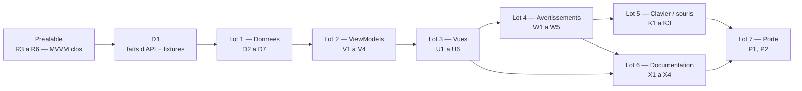

# T1 — Fiche station, écoulement ONDE et les quatre avertissements : plan d'implémentation

> **For agentic workers:** REQUIRED SUB-SKILL: Use superpowers:subagent-driven-development (recommended) or superpowers:executing-plans to implement this plan task-by-task. Steps use checkbox (`- [ ]`) syntax for tracking.

**Goal:** au tap d'une station, une feuille de résumé donne le débit en m³/s avec sa date, sa fraîcheur et sa qualification ; les points ONDE sont sur la carte avec leurs quatre catégories et l'âge de leur campagne ; **les quatre avertissements sont en place** et l'acquittement survit au redémarrage ; la carte se pilote au clavier et à la souris ; version `0.2.0` construite et lancée hors outil sur Windows.

**Architecture:** feature-first + MVVM (`ADR-014`) — `lib/features/<feature>/{view,view_model}`, un `ChangeNotifier` par écran, appels **typés** aux dépôts de `lib/data/`, `lib/domain/` en Dart pur et transverse. `CachePolicy` est un **décorateur de dépôt** (`lib/data/cache/cache_policy.dart`), unique. Aucun bus, aucun message, aucune bibliothèque d'état.

**Tech Stack:** Flutter 3.47.4 stable / Dart 3.13.3 · `flutter_map` 8.3.2 · `latlong2` · `package:http` · `shared_preferences` (décision 3) · `flutter_test` · cible **Windows** construite, **iOS** configuré et jamais compilé, **Android ⏸ différé**.

---

## Préalable bloquant — le réusinage MVVM doit être clos

Ce plan est écrit **sur l'architecture cible**. Les tâches `R1` → `R6` de la § « Suite immédiate » de [`2026-09-13-t0-socle-flutter.md`](2026-09-13-t0-socle-flutter.md) sont un **préalable**, pas un lot de T1. ✅ **Préalable levé le 2026-09-13** : `R1` à `R6` sont faits et relus sur `feat/t1-mvvm-fiche-station` (sommet `c1a5755`, 244 tests verts) — `MapViewModel` appelle `StationPointRepository` par un appel typé, `withCachePolicy` vit sous `lib/data/cache/`, `test/architecture/layers_test.dart` verrouille cinq règles de couches, `lib/application/` n'existe plus.

⚠️ **Aucune tâche de T1 ne démarrait avant que `R5` soit vert.** Sans lui, le premier ViewModel peut importer `material.dart` sans que rien ne le voie — et c'est exactement le défaut que la relecture de T0 a trouvé. Il est vert : la règle `view-model-sans-widget` est en place.

---

## Cible et périmètre

| Cible | État dans ce plan |
|---|---|
| **Windows** | **La seule construite.** La porte de T1 se franchit sur Windows |
| **iOS** | Déclaré, `bundleIdentifier` aligné. **Jamais compilé** — aucun hôte macOS |
| **Android** | ⏸ **différé (arbitrage 2026-09-12).** Les tâches sont listées en fin de plan, ni supprimées ni comptées faites |

**Ce que T1 fait :** (a) fiche station au tap · (b) carte colorée par état, deux échelles · (c) écoulement ONDE de bout en bout · (d) **les quatre avertissements** · (e) lot clavier/souris · (f) Gherkin, traçabilité, `NFR-01`.

**Ce que T1 ne fait pas :**

- **Aucun percentile.** `ADR-003` et son script Dart sont **hors T1** — décision 1. La conséquence est assumée et visible : sur l'échelle « débit », **toute** station est `Indéterminé` au sens de `BR-004`.
- **Aucun appel VigiEau.** `RestrictionSource` reste une interface ; l'échelle 3 et `UC-002` sont en **T2**. `BR-013` est néanmoins posé sur les écrans de ressource qui existent.
- **Aucune courbe** (`US-11`), aucun favori (`US-14`), aucun filtre (`US-13`), aucune recherche (`US-16`) : **T3**.
- **Aucune géolocalisation** — `NFR-05` reste tenu par construction. **Aucune base structurée** : la seule persistance est l'acquittement (`W1`). **Aucun `integration_test/`** : T3.

---

## Faits à vérifier avant d'écrire

### Constaté le 2026-09-13, par appel HTTP réel — ne pas re-supposer

| # | Fait | Appel |
|---|---|---|
| `T-01` | `/v1/ecoulement/observations` **accepte `bbox`** — `bbox=1.0,47.3,1.8,47.8` → HTTP **206**, `count` **1 448**. La carte n'a donc **pas** besoin de passer par le département | `…/v1/ecoulement/observations?bbox=1.0,47.3,1.8,47.8&size=3` |
| `T-02` | Le même endpoint accepte **`sort=desc`** et **`fields`** (`C-17`) : 206 sans erreur | `…&sort=desc&fields=code_station,date_observation,code_ecoulement,libelle_ecoulement,latitude,longitude` |
| `T-03` | Il accepte **`date_observation_min`** — `2026-07-15` sur la même emprise → `count` **30** contre 1 448. C'est le filtre qui rend le chargement de carte tenable | `…&bbox=…&date_observation_min=2026-07-15&size=1` |
| `T-04` | `?code_station=K4520001&sort=desc` → 206, `count` **96**, trois dernières campagnes `2026-08-25` code `"3"`, `2026-07-24` code `"3"`, `2026-06-26` code `"2"`. **Le code à 8 caractères est la clé de l'historique d'un point** | idem |
| `T-05` | `/v1/ecoulement/campagnes?code_departement=41` → **206**, `count` **96**, `api_version` `1.2.0`. Champs : `code_campagne`, `date_campagne`, `nombre_modalite_ecoulement`, `code_type_campagne`, `libelle_type_campagne`, `code_reseau`, `code_departement` | idem |
| `T-06` | **`libelle_type_campagne` est en minuscules** : `"usuelle"` relevé ce jour — `C-10` reproduit, comparaison en minuscules | `T-05` |
| `T-07` | 🚨 **`code_campagne` change de type selon l'endpoint** : **entier** `109905` dans `/campagnes`, **chaîne** `"109905"` dans `/observations`. Un modèle qui le type en `int` casse sur l'un des deux. Fait **nouveau**, absent du cadrage | `T-04` et `T-05` |
| `T-08` | `date_observation` est **une date sans heure** (`"2026-08-25"`) : `BR-010` se calcule en **jours** | `T-04` |
| `T-09` | Une observation ONDE porte les coordonnées **deux fois** — `latitude`/`longitude` à plat **et** `geometry` GeoJSON — plus `code_cours_eau`, `libelle_cours_eau` (casse sans règle, voir `docs/sources/onde.md` § T-09, la fiche est la source de vérité), `code_departement`, `code_commune` | `T-04` |
| `T-10` | 🚨 **`/v2/hydrometrie` était indisponible ce jour** : **503** sur 19 tentatives réparties sur ~25 min, un **502** après 67 s, un timeout sec. `/v1/ecoulement` répondait 206 au même moment. **`C-15` n'est pas une précaution rédactionnelle**, c'est le régime observé : le mode dégradé par source (`BR-007`, `UC-001 A4`) est la première chose à tenir. Détail des sept appels de l'après-midi : `docs/sources/hubeau-hydrometrie.md` § T-10 | `…/v2/hydrometrie/observations_tr?code_entite=K447001001&grandeur_hydro=Q&size=2` |
| `T-11` | `shared_preferences` **2.5.5**, publiée le **2026-03-25**, **BSD-3-Clause**, plateformes **Android, iOS, Linux, macOS, Web, Windows**. Contrainte `sdk ^3.9.0`, `flutter >=3.35.0` — satisfaite par le poste (Dart 3.13.3, Flutter 3.47.4) | `https://pub.dev/api/packages/shared_preferences` + page pub.dev |

### Ouvert — à établir par appel réel en `D1`, avant `D5`

| # | Question | Pourquoi elle bloque |
|---|---|---|
| `Q-01` | `observations_tr` accepte-t-il **plusieurs `code_entite`** séparés par des virgules ? | C'est la différence entre 1 requête et 50 pour une carte. **Non tranchable ce jour** : `T-10` |
| `Q-02` | `observations_tr` accepte-t-il **`bbox`** ? `C-09` ne l'exclut que pour `referentiel/stations` et `/sites` | Si oui, une requête par emprise remplace N requêtes par station |
| `Q-03` | Accepte-t-il **`fields`** et **`size=1`** pour ne ramener que la dernière mesure ? | Pèse directement le coût réseau |
| `Q-04` | **Latence** d'un appel `observations_tr` `size=1`, médiane sur 10 appels | Sans elle, l'intervalle du préchargement est un chiffre inventé |
| `Q-05` | `code_ecoulement` à `null` existe-t-il encore ? (0 sur 2 821 le 2026-09-13 ; 30 sur 7 000 le 2026-08-01) | Décide si `Inconnu(null)` est un cas de fixture ou un cas synthétique |

⚠️ Chaque réponse est **datée**, consignée dans `docs/sources/*.md`, sa capture déposée en fixture (`docs/plan-de-tests.md § 4`). Une question sans réponse reste écrite comme telle : elle ne devient pas un « probablement ».

### Le coût réseau d'une carte, chiffré

Hypothèse : **50 stations hydrométriques visibles** — ordre de grandeur d'un zoom départemental sur 4 150 stations.

| Stratégie | Requêtes pour 50 stations | Verdict |
|---|---|---|
| Une par station, par grandeur (`Q` **et** `H`) | **100** | ❌ `C-12` (aucun quota documenté) et `NFR-07` (aucun appel en bloc) le refusent |
| Une par station, débit seul, `size=1` | **50** | ⚠️ tenable seulement étalé dans le temps |
| Groupée par lot de 20 codes, si `Q-01` confirmé | **3** | ✅ à préférer si confirmé |
| Une par emprise, si `Q-02` confirmé | **1** | ✅ à préférer si confirmé |
| Un appel national | 1 | ❌ **explicitement interdit** (`NFR-07`, `C-07` : `page × size ≤ 20 000`) |

**Stratégie retenue, par ordre de confiance :**

1. **Au tap : chargement à la demande.** La station tapée déclenche **1** requête (débit), **2** si la feuille montre la hauteur. C'est le chemin **garanti** : il ne dépend d'aucune réponse à `Q-01`/`Q-02`, et c'est le seul dont `UC-003` ait besoin.
2. **Préchargement borné.** Au **relâcher** du geste, les **N = 20** stations les plus proches du centre du viewport sont chargées **en série**, intervalle **200 ms** (~4 s pour 20, à ré-arbitrer dès que `Q-04` donne la latence). Un nouveau geste **annule** le préchargement en cours. Les stations non chargées portent `NonChargee`, jamais un état par défaut (`BR-007`).
3. **Si `Q-01` ou `Q-02` est confirmé**, le préchargement passe à 1–3 requêtes et `N` couvre tout le viewport. **L'interface du dépôt ne change pas** — seule son implémentation le fait.

`CachePolicy` (TTL **20 min**, `03-conception.md § 4.1`) rend le second geste sur la même zone gratuit : la valeur en cache s'affiche immédiatement, le rafraîchissement part en tâche de fond, et les rafraîchissements simultanés sont dédupliqués (`C-12`).

---

## Qui lance quoi

| Commande | Lancée par |
|---|---|
| `flutter analyze`, `flutter test`, `dart format`, `flutter pub get`, `flutter pub add`, `curl` | **Claude**, dans le bac à sable |
| `flutter run -d windows`, `flutter build windows --release`, lancement de l'exécutable, tout constat à l'écran | **le commanditaire** |

Toute commande du commanditaire est présentée **seule dans son bloc `bash`**, avec le **résultat attendu énoncé**, ensuite **constaté et recopié**. Jamais supposé.

## Critère de fin, identique pour chaque tâche — dit ici une seule fois

```bash
flutter analyze
flutter test
dart format --set-exit-if-changed lib test
```

Attendu : `No issues found!` · tous les tests passent, aucun `[E]` · code de sortie **0** au formatage. Les trois sont verts **avant** le commit. **Un commit par tâche.**

---

## Structure de fichiers

```
lib/domain/                             Dart pur — ajouts de T1
  observation/station_map_state.dart    sealed : NonChargee | Chargee | SansDonnee | EnEchec (D2)
  onde/onde_station_code.dart           OndeStationCode, 8 caracteres (D2)
  onde/onde_point.dart  onde/onde_observation.dart  onde/campaign_age.dart   (D2)
  repositories/repositories.dart        + OndeObservationRepository, AcknowledgementRepository (D2, W1)
  warnings/warning_texts.dart           les quatre textes + leur version (W2)
lib/data/
  cache/cache_policy.dart               withCachePolicy, unique (pose par R4)
  http/onde_client.dart                                          (D4)
  mappers/onde_observation_mapper.dart                           (D3)
  observations/http_hydro_observation_repository.dart             (D5)
  observations/cached_hydro_observation_repository.dart  TTL 20 min (D6)
  onde/http_onde_observation_repository.dart  onde/cached_onde_observation_repository.dart (D7)
  preferences/shared_preferences_acknowledgement_repository.dart  (W1)
lib/features/
  map/view_model/map_view_model.dart  map/view_model/map_scale.dart          (V2)
  map/view/station_marker.dart  map/view/onde_marker.dart  map/view/map_legend.dart  (U2, U3)
  map/view/map_empty_states.dart  map/view/map_controls.dart                 (U6, K1)
  station_sheet/{view_model/station_sheet_view_model.dart,view/station_summary_sheet.dart}  (V1, U1)
  onde_sheet/{view_model/onde_sheet_view_model.dart,view/onde_summary_sheet.dart}          (V3, U4)
  warnings/view_model/warnings_view_model.dart                               (V4)
  warnings/view/{initial_warning_view,map_warning_banner,sheet_warning_card,reinforced_warning_card}.dart (W2-W5)
lib/diagnostics/frame_timing_probe.dart percentiles de trame, NFR-01 (X3)
lib/main.dart                           cable depots et ViewModels

test/  un test par fichier de code, plus :
  features/goldens/                      rendu de marqueur (U5)
  project/acceptance_features_test.dart  chaque scenario cite un BR existant (X1)
  project/tracabilite_test.dart  project/vocabulary_test.dart  project/windows_min_size_test.dart
  fixtures/onde/                         captures datees de D1

docs/  acceptance/*.feature (X1) · tracabilite.md (X2) · adr/ADR-011-stockage-local.md (W1)
       nfr.md (X3) · CHANGELOG.md (X4) · sources/onde.md, sources/hubeau-hydrometrie.md (D1)
```

**Conventions :** identifiants en **anglais**, valeurs de nomenclature métier en **français**, mot pour mot comme `docs/glossary.md`. Aucun mot banni pour qualifier un débit — *suffisant, insuffisant, normal, bon, sûr* (`BR-003`) ; la classe médiane se dit **« habituel pour la saison »**. Aucun verbe d'instruction sur un usage de l'eau (`BR-014`), vouvoiement systématique.

---

## Lot 1 — Données

### Task D1 : Répondre aux questions ouvertes, capturer, écrire les fiches

**Files:** créés `test/fixtures/onde/campagnes_departement_41_<date>.json`, `test/fixtures/onde/observations_bbox_loire_<date>.json`, `test/fixtures/onde/observations_station_K4520001_<date>.json` · modifiés `docs/sources/onde.md`, `docs/sources/hubeau-hydrometrie.md`, `test/fixtures/CAPTURES.md`, `test/fixtures/fixtures_test.dart`

> **Première parce qu'aucune autre tâche ne peut être écrite juste sans elle.** `T-07` aurait fait échouer `D3` sans prévenir, et `Q-01`/`Q-02` décident de la forme de `D5`.

**Invariant :** un fait d'API non obtenu par appel réel n'entre pas dans le code ; il reste écrit comme ouvert, avec l'URL consultée et la date.

- [x] **Étape 1 — capturer les trois fixtures ONDE**, verbatim, une par appel :

```bash
curl -s "https://hubeau.eaufrance.fr/api/v1/ecoulement/campagnes?code_departement=41&size=20" -o test/fixtures/onde/campagnes_departement_41_$(date +%F).json
curl -s "https://hubeau.eaufrance.fr/api/v1/ecoulement/observations?bbox=1.0,47.3,1.8,47.8&date_observation_min=2026-07-15&size=30&sort=desc" -o test/fixtures/onde/observations_bbox_loire_$(date +%F).json
curl -s "https://hubeau.eaufrance.fr/api/v1/ecoulement/observations?code_station=K4520001&sort=desc&size=10" -o test/fixtures/onde/observations_station_K4520001_$(date +%F).json
```
Attendu : trois fichiers non vides, chacun avec `"api_version"` et `"count"`. **Recopier le statut HTTP et le `count` de chacun dans `test/fixtures/CAPTURES.md`.**

- [x] **Étape 2 — répondre à `Q-01` à `Q-04`.** Trois appels, statut et durée recopiés :

```bash
curl -s -w '\nHTTP=%{http_code} time=%{time_total}\n' "https://hubeau.eaufrance.fr/api/v2/hydrometrie/observations_tr?code_entite=K447001001,K4620020&grandeur_hydro=Q&size=4"
curl -s -w '\nHTTP=%{http_code} time=%{time_total}\n' "https://hubeau.eaufrance.fr/api/v2/hydrometrie/observations_tr?bbox=1.0,47.3,1.8,47.8&grandeur_hydro=Q&size=3"
curl -s -w '\nHTTP=%{http_code} time=%{time_total}\n' "https://hubeau.eaufrance.fr/api/v2/hydrometrie/observations_tr?code_entite=K447001001&grandeur_hydro=Q&size=1&fields=code_station,date_obs,resultat_obs"
```
Attendu : **inconnu — c'est l'objet de la tâche.** ⚠️ Le 2026-09-13 ces appels ont répondu **503** (`T-10`). Si le service est encore indisponible, **ne pas insister** : consigner `Q-01` à `Q-04` comme ouverts avec la date et l'heure, et implémenter `D5` dans sa forme garantie. Trois tentatives espacées suffisent.

- [x] **Étape 3 — répondre à `Q-05`** : `grep -c '"code_ecoulement":null' test/fixtures/onde/observations_bbox_loire_*.json`. Attendu : un compte, **zéro compris — zéro est une réponse**.
- [x] **Étape 4 — compléter `docs/sources/onde.md`** : ligne `/campagnes` renseignée (fixture, `count` 96, champs de `T-05`), `T-06` à `T-09` en § « Faits constatés », **`T-07` en encart ⚠️**, § « Non vérifié » réduite à ce qui reste ouvert.
- [x] **Étape 5 — compléter `docs/sources/hubeau-hydrometrie.md`** : `T-10` avec l'heure de la tentative, et `Q-01` à `Q-04` en § « Non vérifié » avec leur URL.
- [x] **Étape 6 — étendre `test/fixtures/fixtures_test.dart`** : chaque nouvelle fixture est lisible en JSON, porte `api_version`, et est **citée** depuis `docs/sources/onde.md` — une fixture orpheline est une fixture dont personne ne sait ce qu'elle prouve.
- [x] **Étape 7** — `flutter test test/fixtures/fixtures_test.dart` → vert, puis le critère de fin.
- [x] **Étape 8 — commit.**

```bash
git add test/fixtures docs/sources && git commit -m "docs(ecoulement): capturer campagnes et observations ONDE, et consigner ce qui reste ouvert" -m "code_campagne est un ENTIER dans /campagnes et une CHAINE dans /observations : un modele qui le type en int casse sur l un des deux. bbox, sort, fields et date_observation_min sont acceptes par /observations — la carte n a pas besoin du departement. Hydrometrie v2 a repondu 503 sur <N> tentatives : Q-01 a Q-04 restent ouverts, ecrits comme tels."
```

### Task D2 : Le domaine de l'écoulement, et l'état d'une station sur la carte

**Files:** créés `lib/domain/onde/{onde_station_code,onde_point,onde_observation,campaign_age}.dart`, `lib/domain/observation/station_map_state.dart` · modifié `lib/domain/repositories/repositories.dart` · tests miroirs

**Signatures publiques**

- `final class OndeStationCode { factory OndeStationCode(String raw); final String value; }` — `^[A-Z0-9]{8}$`, avec `==`/`hashCode`/`toString`
- `final class OndePoint { OndeStationCode code; String label; double latitude; double longitude; String? waterCourseLabel; DepartementCode? departement; }`
- `final class OndeCampaign { String code; DateTime date; String rawTypeLabel; int? modalityCount; }`
- `final class OndeObservation { OndeStationCode station; DateTime observedAt; FlowCategory category; String? rawFlowCode; String? officialLabel; String? campaignCode; }`
- `enum CampaignAge { recente, ancienne }` · `const Duration campagneAncienneApres = Duration(days: 60);`
- `CampaignAge campaignAgeOf({required DateTime observedAt, required DateTime now})` · `int campaignAgeInDays({required DateTime observedAt, required DateTime now})`
- `sealed class StationMapState` avec `NonChargee`, `Chargee(Freshness freshness)`, `SansDonnee`, `EnEchec(Object cause)` · `String stationMapStateLabel(StationMapState state)`
- Ajouts à `repositories.dart` : `abstract interface class OndeObservationRepository { Future<List<OndeObservation>> latestWithinBounds(Bounds bounds, {required DateTime since}); Future<List<OndeObservation>> historyFor(OndeStationCode station, {int limit = 5}); }`

**Invariants :** `OndeStationCode` (8 car.) et `StationCode` (10 car.) sont **deux types qui ne se substituent jamais** (`T-04`) ; l'âge de campagne se compte en **jours**, l'API ne donnant pas d'heure (`T-08`) ; `StationMapState` distingue **« pas encore chargé »** de **« aucune donnée »**, sans quoi un écran en cours de chargement afficherait un état par défaut, ce que `BR-007` interdit.

**Cas de test**

- `OndeStationCode('K4520001')` accepté ; `'K447001001'` (10 car.) → `ArgumentError` ; `'k4520001'` → `ArgumentError` ; `''` → `ArgumentError`.
- `campaignAgeInDays(observedAt: 2026-08-25, now: 2026-09-13)` → **19**, `campaignAgeOf` → `recente`.
- Borne `BR-010` des deux côtés : **59 j → `recente`**, **60 j → `ancienne`**, **61 j → `ancienne`** — la borne appartient à l'état le plus sévère.
- `campaignAgeOf(observedAt: 2025-09-26, now: 2026-02-15)` → `ancienne` (142 j) : le cas hors saison de `BR-010`.
- Âge négatif (mesure dans le futur) → `recente`, jamais un âge inventé — même parade que `freshnessOf`.
- `stationMapStateLabel` : `SansDonnee` → **« Aucune donnée disponible ici. »** exactement (`BR-007`) ; `NonChargee` → **aucun** libellé d'état ; `Chargee(Freshness.perimee)` → contient « Dernière mesure ».
- `switch` exhaustif sur `StationMapState` : une sous-classe sans branche est une **erreur de compilation** (`BR-011`).
- `OndeObservation` conserve `rawFlowCode` tel que reçu, non normalisé, même quand `category` est `Inconnu` (`BR-011`).

- [ ] **Étape 1** — écrire les cinq fichiers de test, tous rouges.
- [ ] **Étape 2** — `flutter test test/domain` → échec, types absents.
- [ ] **Étape 3** — implémenter les cinq fichiers de `lib/domain/` et les deux interfaces de dépôt.
- [ ] **Étape 4** — `flutter test test/domain test/architecture/domain_isolation_test.dart` → vert : aucun import d'infrastructure n'est entré dans le domaine.
- [ ] **Étape 5** — critère de fin, puis commit.

```bash
git add lib/domain test/domain && git commit -m "feat(domain): typer l ecoulement ONDE et l etat d une station sur la carte" -m "OndeStationCode fait huit caracteres, StationCode dix : les deux referentiels sont distincts et les types ne se substituent pas. L age de campagne se compte en jours parce que l API ne donne pas d heure ; la borne de 60 jours appartient a l etat le plus severe (BR-010). StationMapState distingue NonChargee de SansDonnee : un ecran en cours de chargement n affiche pas d etat par defaut (BR-007)."
```

### Task D3 : Le mapper d'écoulement, seul point de passage

**Files:** créé `lib/data/mappers/onde_observation_mapper.dart` · test miroir

**Signatures publiques** — `OndeObservation mapOndeObservation(Map<String, dynamic> raw)` · `OndeCampaign mapOndeCampaign(Map<String, dynamic> raw)` · `OndePoint mapOndePoint(Map<String, dynamic> raw)`

**Invariant :** `code_campagne` est lu en `Object?` puis rendu en `String` — entier côté `/campagnes`, chaîne côté `/observations` (`T-07`) ; **aucun `as int`** n'apparaît dans ce fichier.

**Cas de test**

- Première observation de `observations_station_K4520001_<date>.json` → `station` `K4520001`, `observedAt` `2026-08-25`, `category` `Assec()`, `officialLabel` `'Assec'`, `rawFlowCode` `'3'`.
- `'1a'` → `Ecoulement()` · `'1f'` → `EcoulementFaible()` · `'2'` → `EcoulementNonVisible()` · `'3'` → `Assec()` · `'4'` → `NonObserve()` · `'9z'` → `Inconnu('9z')` · absent → `Inconnu(null)` — aucun ne lève (`C-10`, `BR-011`).
- `mapOndeCampaign` sur `code_campagne: 109905` (entier) → `'109905'` ; `mapOndeObservation` sur `'109905'` (chaîne) → `'109905'`. **Les deux rendent la même chaîne** : c'est le test qui prouve `T-07`.
- `libelle_type_campagne: 'usuelle'` → `rawTypeLabel` conservé **tel quel** ; la comparaison se fait en minuscules côté appelant (`T-06`).
- `date_observation` absente ou illisible → `FormatException` (`BR-001`) ; `'2026-08-25'` → `DateTime.utc(2026, 8, 25)`, **aucune heure inventée** (`T-08`).
- `mapOndePoint` lit `latitude`/`longitude` **à plat** et ignore `geometry` : deux sources concordantes, une seule lue (`T-09`). `libelle_station` absent → `label` replié sur le code, jamais une chaîne vide.
- Une charge utile avec un champ inédit (`'champ_inedit': 1`) se lit sans échouer (`BR-011`).

- [ ] **Étape 1** — écrire le test sur la **fixture réelle** de `D1`, jamais sur un objet écrit de mémoire (`docs/plan-de-tests.md § 2`). Rouge.
- [ ] **Étape 2** — `flutter test test/data/mappers/onde_observation_mapper_test.dart` → échec.
- [ ] **Étape 3** — implémenter. `flowCategoryFromCode` est **réutilisé**, pas recopié.
- [ ] **Étape 4** — `flutter test test/data/mappers` → vert, puis critère de fin et commit.

```bash
git add lib/data/mappers test/data/mappers && git commit -m "feat(ecoulement): mapper ONDE, teste sur la fixture reelle du 2026-09-13" -m "code_campagne est lu en Object? et rendu en String : entier dans /campagnes, chaine dans /observations. Un as int aurait casse sur l un des deux, sans qu aucun test de l autre ne le voie. date_observation est une date sans heure : aucune heure n est inventee (BR-001)."
```

### Task D4 : Le client ONDE et ses URI

**Files:** créé `lib/data/http/onde_client.dart` · test miroir

**Signatures publiques**

- `Uri ondeObservationsWithinBoundsUri({required Bounds bounds, required DateTime since, int size = 1000})`
- `Uri ondeObservationsForStationUri(OndeStationCode station, {int limit = 10})`
- `Uri ondeCampagnesUri({required DepartementCode departement, int size = 20})`
- `final class OndeClient { OndeClient({http.Client? httpClient, …}); Future<Map<String, dynamic>> getJson(Uri uri); void close(); }`

**Invariant :** le `bbox` s'écrit **`ouest,sud,est,nord`** dans cet ordre exact — inverser deux valeurs ne lève aucune erreur, la carte se remplit simplement d'autre chose, et cela ne se voit qu'à l'écran.

**Cas de test**

- `ondeObservationsWithinBoundsUri(bounds: Bounds(west: 1.0, south: 47.3, east: 1.8, north: 47.8), since: 2026-07-15)` → `bbox=1.0,47.3,1.8,47.8`, `date_observation_min=2026-07-15`, chemin `/api/v1/ecoulement/observations` (`T-01`, `T-03`).
- L'URI porte `sort=desc` : sans lui, la « dernière » observation n'est pas la première rendue (`T-02`).
- `ondeObservationsForStationUri(OndeStationCode('K4520001'), limit: 5)` → `code_station=K4520001&size=5&sort=desc` (`T-04`) ; `ondeCampagnesUri(departement: DepartementCode('41'))` → `code_departement=41` (`T-05`).
- `size: 0` → `ArgumentError` ; `size: 20001` → `ArgumentError` (`C-08`).
- `getJson` : **206 est un succès** (`C-06`), 200 aussi ; **404 ne se rejoue pas** ; **503 se rejoue** puis lève `HubEauFailure` après `maxAttempts` (`T-10` en est le cas réel).
- Le recul est **injecté** : le test ne dort pas. Le corps est décodé en **UTF-8 explicite** — `'ruisseau la rivière aux loches'` ressort avec son accent (`T-09`).

- [ ] **Étape 1** — écrire le test avec `MockClient` de `package:http/testing.dart`. **Aucun test de ce fichier ne touche le réseau** : un service sans SLA rendrait la suite rouge sans qu'aucun code soit fautif (`C-15`, `T-10`). Rouge.
- [ ] **Étape 2** — `flutter test test/data/http/onde_client_test.dart` → échec.
- [ ] **Étape 3** — implémenter en **réutilisant** `isSuccess`/`isRetryable` (`lib/data/http/http_status.dart`) et le recul de `lib/data/http/retry.dart`. Aucune recopie de logique de rejeu.
- [ ] **Étape 4** — `flutter test test/data/http` → vert, puis critère de fin et commit.

```bash
git add lib/data/http test/data/http && git commit -m "feat(ecoulement): client ONDE, bbox et campagnes" -m "Le bbox s ecrit ouest,sud,est,nord : inverser deux valeurs ne leve rien, la carte se remplit simplement d autre chose, et cela ne se voit qu a l ecran. 206 est un succes (C-06) ; 503 se rejoue, 404 non. Le recul et le statut HTTP sont reutilises, jamais recopies."
```

### Task D5 : `HydroObservationRepository`, enfin implémenté

**Files:** créé `lib/data/observations/http_hydro_observation_repository.dart` · test miroir

**Signatures publiques**

- `final class HttpHydroObservationRepository implements HydroObservationRepository { HttpHydroObservationRepository(HubEauClient client); }`
- `Future<Map<StationCode, HydroObservation?>> findLatestForAll(List<StationCode> stations, Grandeur grandeur, {Duration interval = const Duration(milliseconds: 200)})`

**Invariants :** une absence de donnée rend **`null`**, jamais une erreur et jamais zéro (`BR-007`) ; une panne de source **lève**, pour que l'écran puisse nommer la source défaillante (`UC-001 A4`) ; `findLatestForAll` **espace** ses appels et ne fait **jamais** d'appel national (`NFR-07`, `C-12`).

**Cas de test**

- `findLatest(StationCode('K447001001'), Grandeur.debit)` sur `observations_tr_K447001001_Q_2026-09-13.json` → `discharge.value` **47,8** m³/s, `measuredAt` `2026-08-27T08:00:00Z` (`C-02`, `BR-002`).
- Même appel en `Grandeur.hauteur` sur la fixture `_H_` → `level.value` **−1,232** m, signe conservé, aucun contrôle ajouté.
- `{"count":0,"data":[]}` en **HTTP 200** → **`null`** (`BR-007`), jamais une exception ni un zéro. **HTTP 503** → `HubEauFailure` propagée (`T-10`).
- L'URI porte un **code station à 10 caractères**, jamais un code site : `findLatest` n'accepte qu'un `StationCode`, le type l'interdit (`C-05`).
- `findLatestForAll` avec 3 codes et un `interval` injecté → **3 appels**, dans l'ordre, chacun précédé de l'attente sauf le premier ; le test **ne dort pas**.
- L'échec d'**un** code laisse les deux autres renseignés, la clé fautive porte `null` — un écran partiel vaut mieux qu'un écran blanc (`BR-007`). Liste vide → **zéro appel**.

- [ ] **Étape 1** — **relire** les réponses à `Q-01`/`Q-02` consignées en `D1`. Si l'une est confirmée, `findLatestForAll` fait une requête groupée ou par emprise et le cas « 3 appels » devient « 1 appel, 3 codes dans l'URI » ; sinon la forme garantie s'applique. ⚠️ Ne pas deviner : lire ce qui a été écrit.
- [ ] **Étape 2** — écrire le test avec `MockClient` et les fixtures de T0. Rouge.
- [ ] **Étape 3** — `flutter test test/data/observations` → échec.
- [ ] **Étape 4** — implémenter. `mapHydroObservation` est **réutilisé** : aucune conversion d'unité n'apparaît ici (`BR-002`).
- [ ] **Étape 5** — `flutter test test/data` → vert, puis critère de fin et commit.

```bash
git add lib/data/observations test/data/observations && git commit -m "feat(hydrometrie): implementer HydroObservationRepository sur le client Hub Eau" -m "Une page vide en 200 rend null, jamais zero et jamais une erreur : l absence est un etat affiche (BR-007). Une panne de source leve, pour que l ecran nomme la source defaillante. findLatestForAll espace ses appels tant que l appel groupe n est pas confirme, et ne fait jamais d appel national (NFR-07)."
```

### Task D6 : Le cache, décorateur de dépôt et rien d'autre

**Files:** créé `lib/data/observations/cached_hydro_observation_repository.dart` · test miroir

**Signatures publiques** — `final class CachedHydroObservationRepository implements HydroObservationRepository { CachedHydroObservationRepository({required HydroObservationRepository inner, Duration ttl = observationsTrTtl, DateTime Function()? now, bool Function()? networkAvailable}); }` · `const Duration observationsTrTtl = Duration(minutes: 20);`

**Invariant :** la politique de cache vit **dans ce seul décorateur**, jamais dans un dépôt, un ViewModel ou une vue — chaque recopie est une divergence future.

**Cas de test**

- TTL **20 min** exactement, tel que `03-conception.md § 4.1` le fixe pour `observations_tr` ; aucun autre chiffre n'apparaît dans le fichier.
- Cache vide → `inner.findLatest` appelé **une** fois, valeur rendue **et** écrite. Cache de **19 min** → valeur rendue, **zéro** appel.
- Cache de **20 min** exactement → valeur rendue **immédiatement**, rafraîchissement en tâche de fond : la borne appartient à l'état périmé.
- Cache périmé et `networkAvailable` → `false` → valeur en cache rendue, **zéro** appel réseau.
- Deux lectures **simultanées** sur une entrée périmée → **un seul** appel à `inner` (`C-12`) — la fermeture est conservée **par clé**, sinon la déduplication est annulée.
- Rafraîchissement en échec → la **dernière valeur connue** reste rendue, le cache n'est pas écrasé, un rafraîchissement ultérieur repart (`BR-007`).
- Les clés `(K447001001, debit)` et `(K447001001, hauteur)` ne partagent **jamais** une entrée. `ttl: Duration.zero` → `ArgumentError` à la construction.

- [ ] **Étape 1** — écrire le test avec une horloge et un `inner` bouchons, tous deux injectés. Rouge.
- [ ] **Étape 2** — `flutter test test/data/observations/cached_hydro_observation_repository_test.dart` → échec.
- [ ] **Étape 3** — implémenter en **appelant** `withCachePolicy` de `lib/data/cache/cache_policy.dart`. ⚠️ Une fermeture **par clé**, conservée dans un champ — pas `withCachePolicy(...)()` à chaque lecture, qui reconstruirait un verrou toujours nul.
- [ ] **Étape 4** — `flutter test test/data` → vert. Puis `grep -rn 'Duration(minutes' lib/` → l'occurrence est **unique**.
- [ ] **Étape 5** — critère de fin, puis commit.

```bash
git add lib/data/observations test/data/observations && git commit -m "feat(hydrometrie): decorer le depot d observations par la politique de cache, TTL 20 min" -m "Le TTL de 20 minutes n apparait qu ici : une seconde occurrence serait une divergence future. Deux lectures simultanees sur une entree perimee ne declenchent qu un appel (C-12), et la fermeture est conservee par cle — la reconstruire a chaque lecture annulerait la deduplication. Un rafraichissement en echec laisse la derniere valeur connue (BR-007)."
```

### Task D7 : Le dépôt d'écoulement, et son cache saisonnier

**Files:** créés `lib/data/onde/http_onde_observation_repository.dart`, `lib/data/onde/cached_onde_observation_repository.dart` · tests miroirs

**Signatures publiques** — `final class HttpOndeObservationRepository implements OndeObservationRepository { HttpOndeObservationRepository(OndeClient client); }` · `final class CachedOndeObservationRepository implements OndeObservationRepository { CachedOndeObservationRepository({required OndeObservationRepository inner, DateTime Function()? now}); }` · `Duration ondeTtlFor(DateTime date)`

**Invariants :** `latestWithinBounds` ne garde qu'**une** observation par `OndeStationCode`, la plus récente — l'API en rend une par campagne et par point (`T-04`, `count` 96 pour un seul point) ; le TTL dépend du **mois observé**, jamais d'une saison codée ailleurs.

**Cas de test**

- Sur `observations_bbox_loire_<date>.json` → **une seule** entrée par code de station ; pour `K4520001`, `observedAt` `2026-08-25` et non `2026-07-24`.
- `since` est répercuté en `date_observation_min` : sans lui la même emprise rend 1 448 lignes au lieu de 30 (`T-03`).
- `historyFor(OndeStationCode('K4520001'), limit: 5)` → 5 observations **décroissantes** en date, la première `2026-08-25` (`T-04`).
- `ondeTtlFor(2026-07-15)` → **30 j** ; `ondeTtlFor(2026-02-15)` → **90 j** ; bornes `2026-05-01` → 30 j, `2026-09-30` → 30 j, `2026-10-01` → 90 j, `2026-04-30` → 90 j.
- Réponse vide sur une emprise → **liste vide**, jamais une erreur : une zone hors couverture ONDE est un fait, pas une panne (`BR-007`, `UC-001 A5`). HTTP 503 → exception propagée, les points hydrométriques restent (`UC-001 A4`).
- `grep -rn 'stale\|revalidate' lib/data/onde/` ne rend **aucune** ligne : le décorateur réutilise `withCachePolicy`.

- [ ] **Étape 1** — écrire les deux tests, tous deux rouges.
- [ ] **Étape 2** — `flutter test test/data/onde` → échec.
- [ ] **Étape 3** — implémenter les deux fichiers.
- [ ] **Étape 4** — `flutter test test/data` → vert, puis critère de fin et commit.

```bash
git add lib/data/onde test/data/onde && git commit -m "feat(ecoulement): depot ONDE par emprise et par point, cache 30 j en saison et 90 j hors saison" -m "L API rend une observation par campagne et par point : 96 lignes pour la seule station K4520001. Le depot n en garde qu une, la plus recente, sinon la carte dessinerait un point par campagne. Le TTL suit le mois observe : de octobre a avril personne n observe, et un TTL de 30 jours y provoquerait des appels pour rien."
```

---

## Lot 2 — ViewModels

### Task V1 : `StationSheetViewModel`

**Files:** créé `lib/features/station_sheet/view_model/station_sheet_view_model.dart` · test miroir

**Signatures publiques**

- `final class StationSheetViewModel extends ChangeNotifier { StationSheetViewModel({required HydroObservationRepository observations, required StationRepository stations, DateTime Function()? now}); }`
- `Future<void> open(StationCode code)` · `void close()` · `StationSheetState get state`
- `sealed class StationSheetState` : `Fermee`, `EnCours(StationCode)`, `Prete(StationSheetData)`, `EnEchec(StationCode, Object cause)`
- `final class StationSheetData { Station station; HydroObservation? discharge; HydroObservation? level; Freshness? freshness; String statusLabel; String qualificationLabel; String? stalenessNotice; }`

**Invariants :** ce fichier **n'importe ni `material.dart` ni `widgets.dart`** — `layers_test.dart` le refuse, et c'est ce qui le rend testable sans rendu ; `now` est **injecté** ; aucun formatage de nombre ici : le ViewModel expose des types du domaine, la vue formate.

**Cas de test**

- `open(StationCode('K447001001'))` → l'état passe par **`EnCours`** puis `Prete` ; `notifyListeners` appelé **deux** fois.
- Débit présent → `discharge.value` **47,8** ; balayage de tous les libellés produits : **aucune** chaîne parmi *suffisant, insuffisant, normal, bon, sûr* (`BR-003`).
- Observation du `2026-08-27T08:00Z` vue le `2026-09-13T10:00Z` → `freshness` **`perimee`**, `stalenessNotice` non nul et citant la date (`BR-005`) — le cas réel des 17 jours sur une station de référence.
- Vue 1 h après → `fraiche`, `stalenessNotice` **nul**. Vue 3 h après → `ancienne`, `stalenessNotice` contient **« il y a 3 h »** (`BR-005`).
- `libelle_qualification_obs` absent → `qualificationLabel` **« non qualifiée »** ; `libelle_statut` absent → `statusLabel` **« non renseigné »** — jamais une chaîne vide (`BR-006`, `BR-011`).
- `discharge` nul → `state` est `Prete` avec `discharge` nul : la vue dira l'absence, **jamais un zéro** (`BR-007`, `UC-003 A3`).
- Dépôt qui lève `HubEauFailure` → `EnEchec`, `cause` conservée pour que la vue **nomme la source** (`UC-001 A4`).
- `close()` → `Fermee` ; une réponse tardive d'un `open()` précédent **n'écrase pas** l'état (garde par jeton) ; après `dispose()`, aucun `notifyListeners`, aucune assertion.

- [ ] **Étape 1** — écrire le test avec des dépôts bouchons et une horloge injectée. Rouge.
- [ ] **Étape 2** — `flutter test test/features/station_sheet` → échec.
- [ ] **Étape 3** — implémenter.
- [ ] **Étape 4** — `flutter test test/features test/architecture` → vert, `layers_test.dart` compris. Puis critère de fin et commit.

```bash
git add lib/features/station_sheet test/features/station_sheet && git commit -m "feat(ui): StationSheetViewModel, l etat de la fiche station sans aucun widget" -m "L horloge est injectee : les bornes de BR-005 se testent aux valeurs exactes 1 h, 3 h et 17 jours plutot qu a ce que la machine affiche. La qualification absente devient non qualifiee, jamais une chaine vide (BR-006). Une valeur absente reste absente : jamais un zero (BR-007). Un balayage de tous les libelles produits refuse les cinq mots bannis (BR-003)."
```

### Task V2 : `MapViewModel` — un état par station, et une seule échelle

**Files:** modifiés `lib/features/map/view_model/map_view_model.dart` et son test · créé `lib/features/map/view_model/map_scale.dart`

**Signatures publiques** — `enum MapScaleKind { ecoulement, debit }` · `String mapScaleLabel(MapScaleKind kind)` · ajouts à `MapViewModel` : `MapScaleKind get scale` · `void selectScale(MapScaleKind kind)` · `StationMapState stateOf(StationCode code)` · `Map<OndeStationCode, OndeObservation> get ondeObservations` · `Future<void> preloadVisibleStations({int limit = 20})` · `void cancelPreload()`

**Invariants :** **une seule échelle active à la fois** (`BR-008`) — changer d'échelle change marqueurs **et** légende ensemble ; une station non chargée porte `NonChargee`, jamais un état par défaut (`BR-007`) ; le préchargement est **borné et annulable**, jamais national (`NFR-07`).

**Cas de test**

- `scale` par défaut → **`ecoulement`** (`UC-001 § 3`). `selectScale(debit)` → un `notifyListeners` ; `selectScale` avec la valeur courante → **aucune** notification.
- `stateOf` d'une station jamais chargée → `NonChargee` ; après une observation du `2026-09-13T09:00Z` vue à `10:00Z` → `Chargee(Freshness.fraiche)` ; après une réponse vide → `SansDonnee` ; après une panne → `EnEchec`, **les autres stations gardent leur état** (`UC-001 A4`).
- `preloadVisibleStations(limit: 20)` sur 50 stations visibles → **20** appels, pas 50 ; sur 5 visibles → **5** ; sur une emprise sans station → **zéro** appel (`UC-001 A2`).
- `cancelPreload()` après le 3ᵉ appel → **aucun** appel supplémentaire ; un nouveau geste annule le préchargement en cours avant d'en lancer un autre.
- Les 20 stations retenues sont les plus **proches du centre** de l'emprise, ordre déterministe et testable.
- Échelle `ecoulement` → `ondeObservations` alimenté avec `since = now - 60 jours` (`BR-010`, `T-03`) ; échelle `debit` → **aucun** appel ONDE.
- Après `dispose()` pendant un préchargement : aucun `notifyListeners`, aucune assertion.

- [ ] **Étape 1** — étendre le test existant : rouge sur les nouveaux cas, **vert sur les anciens** — ce qui marchait en T0 continue de marcher.
- [ ] **Étape 2** — `flutter test test/features/map/view_model` → échec sur les nouveaux cas seulement.
- [ ] **Étape 3** — implémenter les ajouts.
- [ ] **Étape 4** — `flutter test` → **tous** verts ; recopier le total. Puis critère de fin et commit.

```bash
git add lib/features/map test/features/map && git commit -m "feat(map): un etat par station, une echelle active, un prechargement borne" -m "Une station dont l observation n est pas chargee porte NonChargee et pas SansDonnee : un ecran en cours de chargement n affiche pas d etat par defaut (BR-007). Le prechargement est borne a 20 stations et annulable au geste suivant : 50 requetes pour un deplacement de carte, sur une API sans quota documente, est exactement ce que NFR-07 interdit. Changer d echelle change marqueurs et legende ensemble (BR-008)."
```

### Task V3 : `OndeSheetViewModel`

**Files:** créé `lib/features/onde_sheet/view_model/onde_sheet_view_model.dart` · test miroir

**Signatures publiques** — `final class OndeSheetViewModel extends ChangeNotifier { OndeSheetViewModel({required OndeObservationRepository onde, DateTime Function()? now}); }` · `Future<void> open(OndeStationCode code)` · `void close()` · `sealed class OndeSheetState` : `Fermee`, `EnCours`, `Prete(OndeSheetData)`, `EnEchec` · `final class OndeSheetData { OndePoint point; OndeObservation latest; List<OndeObservation> history; CampaignAge age; int ageInDays; String officialModalityText; String seasonNotice; }`

**Invariants :** la **modalité officielle exacte** est toujours présente en second niveau — le regroupement en quatre catégories (`ADR-006`) ne se substitue jamais à la source ; l'**âge de la campagne** figure dans tous les cas, sans exception (`BR-010`).

**Cas de test**

- `open(OndeStationCode('K4520001'))` avec `now` = `2026-09-13` → `latest.observedAt` `2026-08-25`, `ageInDays` **19**, `age` `recente`.
- `officialModalityText` contient **« code 3 »** et **« Assec »** (`ADR-006`, `UC-004 § 3`) ; le libellé **affiché** de la catégorie est **« À sec »**, jamais « Assec » — `glossary.md` proscrit le mot côté interface.
- `history` → 5 campagnes décroissantes, chacune avec sa date et sa catégorie (`UC-004 § 4`).
- `seasonNotice` présent **dans tous les cas**, contenant « mai » et « septembre » (`BR-010`, `UC-004 § 5`).
- Campagne du `2025-09-26` vue le `2026-02-15` → `age` `ancienne`, `ageInDays` **142** ; la vue grisera l'état (`UC-004 A1`).
- `code_ecoulement` `'4'` → `NonObserve`, texte d'absence explicite, jamais un état neutre (`UC-004 A2`) ; code inconnu → `Inconnu`, libellé **« Non renseigné »**, aucune exception (`UC-004 A3`, `BR-011`).
- Aucune campagne pour le point → `Prete` avec `NonObserve` et un texte d'absence ; le point n'est **jamais** retiré de la carte (`UC-004 A4`).
- Balayage : aucun libellé exposé ne contient de verbe d'instruction sur un usage de l'eau (`BR-014`).

- [ ] **Étape 1** — écrire le test sur la fixture réelle de `D1`. Rouge.
- [ ] **Étape 2** — `flutter test test/features/onde_sheet` → échec.
- [ ] **Étape 3** — implémenter.
- [ ] **Étape 4** — `flutter test test/features test/architecture` → vert, puis critère de fin et commit.

```bash
git add lib/features/onde_sheet test/features/onde_sheet && git commit -m "feat(ecoulement): OndeSheetViewModel, avec l age de campagne et la modalite officielle" -m "L age de la campagne figure dans tous les cas, sans exception : un point affiche eau qui coule en fevrier porte une observation de septembre (BR-010). La modalite officielle reste lisible a cote de la categorie : le regroupement en quatre categories est notre interpretation, pas une classification de l OFB (ADR-006). L ecran dit A sec ; Assec reste le libelle de la source."
```

### Task V4 : `WarningsViewModel`

**Files:** créé `lib/features/warnings/view_model/warnings_view_model.dart` · test miroir

**Signatures publiques** — `final class WarningsViewModel extends ChangeNotifier { WarningsViewModel({required AcknowledgementRepository acknowledgements, required String currentWarningVersion}); }` · `Future<void> load()` · `bool get requiresAcknowledgement` · `bool get checkboxChecked` · `bool get canAcknowledge` · `void toggleCheckbox(bool value)` · `Future<void> acknowledge()`

**Invariants :** `canAcknowledge` est **faux** tant que la case n'est pas cochée, **sans pré-cochage** (`BR-012`) ; c'est la **version acquittée** qui est persistée, pas un booléen — sinon un texte modifié ne serait jamais relu.

**Cas de test**

- Stockage vide → après `load()` : `requiresAcknowledgement` **vrai**, `canAcknowledge` **faux**, `checkboxChecked` **faux**.
- `toggleCheckbox(true)` → `canAcknowledge` **vrai**, un `notifyListeners` ; `toggleCheckbox(false)` → **faux** à nouveau.
- `acknowledge()` sans case cochée → **aucune** écriture, état inchangé : défense en profondeur, la vue désactive déjà le bouton.
- `acknowledge()` case cochée, version `'2026-09-13.1'` → **`'2026-09-13.1'`** écrite, `requiresAcknowledgement` devient faux.
- Stockage `'2026-09-13.1'` et version courante identique → **faux** : l'écran ne réapparaît pas (`UC-006 A1`). Version courante `'2026-10-01.1'` → **vrai** : le texte a changé, il est relu (`UC-006 A3`).
- Échec de **lecture** du stockage → `requiresAcknowledgement` **vrai**. ⚠️ On rebloque, on n'ouvre pas : en cas de doute, l'usager relit les limites.
- Échec d'**écriture** → l'état reste « à acquitter » et l'échec est exposé, jamais avalé.

- [ ] **Étape 1** — écrire le test avec un `AcknowledgementRepository` bouchon, ses deux modes d'échec compris. Rouge.
- [ ] **Étape 2** — `flutter test test/features/warnings` → échec.
- [ ] **Étape 3** — implémenter. Le dépôt lui-même est en `W1`.
- [ ] **Étape 4** — `flutter test test/features test/architecture` → vert, puis critère de fin et commit.

```bash
git add lib/features/warnings test/features/warnings && git commit -m "feat(avertissement): WarningsViewModel, acquittement par version et non par booleen" -m "C est la version du texte qui est persistee : un booleen ne permettrait jamais de faire relire un avertissement modifie (BR-012, UC-006 A3). Un echec de lecture du stockage rebloque au lieu d ouvrir — en cas de doute, l usager relit les limites. Le ViewModel refuse aussi l acquittement sans case cochee, pas seulement la vue."
```

---

## Lot 3 — Vues

### Task U1 : La feuille de résumé au tap

**Files:** créé `lib/features/station_sheet/view/station_summary_sheet.dart` · test miroir · modifié `lib/features/map/view/map_screen.dart`

**Signatures publiques** — `class StationSummarySheet extends StatelessWidget { const StationSummarySheet({required this.data, super.key}); final StationSheetData data; }` · `String formatDischarge(CubicMetresPerSecond value)` · `String formatLevel(Metres value)` · `String formatMeasuredAt(DateTime utc)` · `const double minimumTapTarget = 44.0;`

**Invariants :** la zone de tap d'un marqueur et chaque contrôle de la feuille mesurent **≥ 44 × 44 pt** (`04-ui.md § 3`) ; les formateurs reçoivent des `CubicMetresPerSecond` et des `Metres`, **jamais des `double` nus** (`BR-002`).

**Cas de test**

- `formatDischarge(CubicMetresPerSecond(47.8))` → **`'47,8 m³/s'`** ; `CubicMetresPerSecond(3.2)` → `'3,2 m³/s'` ; `formatLevel(Metres(-1.232))` → `'−1,232 m'`, **signe conservé**.
- `formatMeasuredAt` rend date **et** heure : aucune valeur ne s'affiche sans sa date (`BR-001`).
- La feuille rendue contient libellé de station, **cours d'eau**, **département**, débit en m³/s, sa date, hauteur en m, `statusLabel`, `qualificationLabel` (`BR-006`, `UC-003 § 2`).
- Observation périmée → `stalenessNotice` est **rendu** et cite la date (`BR-005`).
- `discharge` nul → **« La station n'a pas transmis de valeur pour ce paramètre. »** est rendu ; **aucun `0`**, aucun tiret seul (`BR-007`, `UC-003 A3`).
- État `EnEchec` → un message **nommant la source** est rendu ; la feuille n'est pas vide (`UC-001 A4`).
- Balayage de l'arbre rendu : aucun *suffisant*, *insuffisant*, *normal*, *bon*, *sûr* (`BR-003`). La zone de tap du marqueur mesure ≥ 44 pt, vérifié sur la taille du `Marker`.
- ⚠️ **Aucun test ne rend `FlutterMap`** : le rendu de tuiles échoue dans l'environnement de test et l'échec ne dit rien sur le code. La feuille est rendue seule.

- [ ] **Étape 1** — écrire le test de widget sur la feuille seule et sur les trois formateurs. Rouge.
- [ ] **Étape 2** — `flutter test test/features/station_sheet/view` → échec.
- [ ] **Étape 3** — implémenter la feuille et les formateurs.
- [ ] **Étape 4** — brancher : au tap d'un marqueur, `map_screen.dart` appelle `StationSheetViewModel.open`. La vue **branche**, elle ne décide pas.
- [ ] **Étape 5** — `flutter test` → vert, puis critère de fin et commit.

```bash
git add lib/features test/features && git commit -m "feat(ui): feuille de resume au tap, debit en m3 par seconde avec sa date" -m "Les formateurs recoivent des unites typees, jamais des double nus : c est le seul endroit ou un chiffre devient du texte, et BR-002 est le bug le plus couteux du projet. Une valeur absente affiche la phrase d absence, jamais un zero (BR-007). La zone de tap mesure au moins 44 pt, verifie par test et non par capture. Aucun test ne rend FlutterMap : l environnement de test refuse les tuiles."
```

### Task U2 : Le marqueur d'une station, et la légende de l'échelle « débit »

**Files:** créés `lib/features/map/view/station_marker.dart`, `lib/features/map/view/map_legend.dart` · tests miroirs · modifié `lib/features/map/view/map_screen.dart`

**Signatures publiques** — `class StationMarkerDot extends StatelessWidget { const StationMarkerDot({required this.state, super.key}); final StationMapState state; }` · `class MapLegend extends StatelessWidget { const MapLegend({required this.scale, super.key}); final MapScaleKind scale; }` · `const Color indetermineGrey = Color(0xFF767676);`

**Invariants :** en T1 l'échelle « débit » n'a **aucun percentile** — tout état est `Indéterminé` au sens de `BR-004`, teinte `#767676` et forme `◇ + « ? »` de `04-ui.md § 2`, **aucune teinte n'est inventée** ; les états se distinguent par **motif et libellé**, pas par la couleur (`04-ui.md § 2`) ; la légende est **toujours visible** et nomme l'échelle active (`BR-008`).

| État | Rendu | Règle |
|---|---|---|
| `Chargee(fraiche)` | forme pleine | `BR-005` |
| `Chargee(ancienne)` | forme pleine + « il y a N h » | `BR-005` |
| `Chargee(perimee)` | forme **atténuée** (saturation réduite, contraste préservé) | `BR-005` |
| `SansDonnee` | contour **pointillé** + « Aucune donnée disponible ici. » | `BR-007` |
| `NonChargee` | contour neutre, **aucun libellé d'état** | `BR-007` |

**Cas de test**

- Les cinq états produisent **cinq** rendus distincts ; deux états quelconques ne rendent jamais le même arbre.
- `Chargee(perimee)` → opacité strictement inférieure à `Chargee(fraiche)`, **contour de 2 px conservé** (`04-ui.md § 3`).
- `SansDonnee` → le texte rendu est exactement **« Aucune donnée disponible ici. »** ; `NonChargee` → l'arbre ne contient **aucun** des libellés d'état des quatre autres (`BR-007`).
- `MapLegend(scale: MapScaleKind.debit)` nomme l'échelle, liste ses états, contient **« Indéterminé »** et le sous-texte *« Comparaison statistique. Ce n'est pas un seuil réglementaire. »* (`BR-003`, `L-01`).
- `MapLegend` ne contient **jamais** de forme de l'autre échelle (`BR-008`) ; aucun de ses libellés ne contient les cinq mots bannis (`BR-003`).
- Le contour de 2 px est présent sur les cinq états (`04-ui.md § 3`, halo de marqueur).
- ⚠️ La pastille reste **une forme décorée, pas un glyphe de police** : au zoom national les 4 150 points sont tous dessinés, et un glyphe coûte une passe de texte par marqueur.

- [ ] **Étape 1** — écrire les tests de widget. Rouge.
- [ ] **Étape 2** — `flutter test test/features/map/view` → échec.
- [ ] **Étape 3** — implémenter. Toute teinte est **recopiée depuis `04-ui.md § 2`** ; aucune n'est choisie ici.
- [ ] **Étape 4** — brancher la légende dans `map_screen.dart`, **toujours visible, jamais repliée** (`BR-008`).
- [ ] **Étape 5** — `flutter test` → vert, puis critère de fin et commit.

```bash
git add lib/features/map test/features/map && git commit -m "feat(map): colorer les stations par fraicheur, et afficher la legende de l echelle active" -m "Sans l asset de percentiles (ADR-003, hors T1), aucune station n a de qualification statistique : l echelle debit est Indeterminee partout, ce que BR-004 prevoit deja et que 04-ui colore deja en 767676. Aucune teinte n est inventee. Les etats de fraicheur se distinguent par motif et libelle, pas par la couleur. NonChargee ne porte aucun libelle d etat (BR-007)."
```

### Task U3 : Les points ONDE sur la carte, et la bascule d'échelle

**Files:** créé `lib/features/map/view/onde_marker.dart` · test miroir · modifiés `lib/features/map/view/map_screen.dart`, `lib/features/map/view/map_legend.dart`

**Signatures publiques** — `class OndeMarkerShape extends StatelessWidget { const OndeMarkerShape({required this.category, required this.age, super.key}); }` · `Color ondeCategoryColor(FlowCategory category)` · `String ondeCategoryMapLabel(FlowCategory category)` · `class MapScaleChips extends StatelessWidget { … }`

**Invariants :** couleurs et formes viennent de **`ADR-006` et `04-ui.md § 2`**, recopiées, jamais choisies ici ; au-delà de **60 jours** l'état passe en gris avec la mention de la date (`BR-010`) ; changer d'échelle change **marqueurs et légende ensemble** (`BR-008`).

| Catégorie | Hex | Forme | Motif | Libellé carte |
|---|---|---|---|---|
| `Ecoulement` | `#0072B2` | ● cercle | plein | **Eau qui coule** |
| `EcoulementFaible` | `#56B4E9` | ◐ cercle mi-plein | demi-plein | **Écoulement faible** |
| `EcoulementNonVisible` | `#E69F00` | ▲ triangle | hachures obliques | **Eau stagnante** |
| `Assec` | `#D55E00` | ■ carré | plein, contour noir 2 px | **À sec** |
| `NonObserve` | `#767676` | ◌ cercle vide | contour pointillé | **Non observé** |
| `Inconnu` | `#767676` | ◌ cercle vide | contour pointillé | **Non renseigné** |

**Cas de test**

- `ondeCategoryColor` rend les six teintes du tableau, valeur par valeur — le test **est** la recopie vérifiée de `04-ui.md § 2`.
- `ondeCategoryMapLabel(Assec())` → **« À sec »**, jamais « Assec » ni « asséché » : un concept, un mot (`glossary.md`).
- `NonObserve` et `Inconnu` partagent teinte et forme mais **pas** le libellé — le fait de terrain et notre ignorance restent distincts (`BR-007`).
- `age: ancienne` → rendu **gris** quelle que soit la catégorie, date mentionnée (`BR-010`, `UC-004 A1`) ; `age: recente` → teinte de la catégorie conservée.
- Les six catégories restent distinguables **en niveaux de gris** : le test compare formes et motifs, pas seulement les couleurs (`04-ui.md § 3`).
- `MapScaleChips` : un tap sur « Débit » appelle `selectScale(MapScaleKind.debit)` **une** fois.
- Échelle `debit` → **aucun** marqueur ONDE rendu ; échelle `ecoulement` → **aucun** marqueur de station. Jamais les deux familles ensemble (`BR-008`).
- Zone hors couverture ONDE → le message **nomme le périmètre réel** du réseau (`UC-001 A5`, `BR-007`). La zone de tap d'un marqueur ONDE mesure ≥ 44 pt.

- [ ] **Étape 1** — écrire les tests. Rouge.
- [ ] **Étape 2** — `flutter test test/features/map/view` → échec.
- [ ] **Étape 3** — implémenter, en recopiant les six lignes du tableau depuis `04-ui.md § 2`.
- [ ] **Étape 4** — brancher : marqueurs ONDE sous l'échelle `ecoulement`, chips de bascule, légende accordée.
- [ ] **Étape 5** — `flutter test` → vert, puis critère de fin et commit.

```bash
git add lib/features/map test/features/map && git commit -m "feat(ecoulement): points ONDE sur la carte, quatre categories et un etat d absence" -m "Les six teintes et formes sont recopiees d ADR-006 et 04-ui section 2, et le test EST cette recopie verifiee : aucune couleur n est choisie dans le code. Au dela de 60 jours l etat passe en gris avec sa date, parce qu un point affiche eau qui coule en fevrier porte une observation de septembre (BR-010). Non observe et Non renseigne partagent la forme mais pas le libelle : un fait de terrain n est pas notre ignorance (BR-007). Les deux echelles ne coexistent jamais (BR-008)."
```

### Task U4 : La fiche ONDE

**Files:** créé `lib/features/onde_sheet/view/onde_summary_sheet.dart` · test miroir · modifié `lib/features/map/view/map_screen.dart`

**Signatures publiques** — `class OndeSummarySheet extends StatelessWidget { const OndeSummarySheet({required this.data, super.key}); }` · `String formatCampaignDate(DateTime date)` · `String formatCampaignAge(int days)`

**Invariant :** la catégorie, la **modalité officielle** et la **date de campagne** sont sur la même fiche, dans cet ordre, sans exception (`UC-004`, `BR-010`, `ADR-006`).

**Cas de test**

- La fiche rendue contient : libellé du point, catégorie **« À sec »**, `'25/08/2026'`, **« code 3 »**, **« Assec »**, et les cinq campagnes de l'historique.
- `formatCampaignDate(DateTime.utc(2026, 8, 25))` → `'25/08/2026'` — **aucune heure**, l'API n'en donne pas (`T-08`).
- `formatCampaignAge(19)` contient « 19 » et « jour » ; `formatCampaignAge(142)` contient « 142 ».
- `age: ancienne` → la mention **« dernière observation le 26/09 »** est rendue et l'état est gris (`BR-010`).
- Le rappel de rythme est rendu **dans tous les cas** : « Campagnes de mai à septembre seulement, environ une par mois. Entre deux campagnes, personne n'observe ce point. » (`UC-004 § 5`).
- L'encart d'avertissement de tête (posé en `W4`) est rendu **avant** la catégorie et **porte la date de la campagne** (`04-ui.md § 5`, emplacement 3).
- Catégorie `NonObserve` → texte d'absence explicite, jamais un état neutre (`UC-004 A2`) ; historique vide → message d'absence, la fiche n'est pas vidée (`UC-004 A4`, `BR-007`).
- Aucun texte rendu ne contient de verbe d'instruction sur un usage de l'eau (`BR-014`).

- [ ] **Étape 1** — écrire le test de widget. Rouge.
- [ ] **Étape 2** — `flutter test test/features/onde_sheet/view` → échec.
- [ ] **Étape 3** — implémenter.
- [ ] **Étape 4** — brancher : au tap d'un marqueur ONDE, `OndeSheetViewModel.open`.
- [ ] **Étape 5** — `flutter test` → vert, puis critère de fin et commit.

```bash
git add lib/features/onde_sheet test/features/onde_sheet && git commit -m "feat(ecoulement): fiche d un point ONDE, avec l age de campagne et l historique" -m "La date de campagne se formate sans heure parce que l API n en donne pas : en inventer une laisserait croire a une precision qui n existe pas. Le rappel du rythme reel est rendu dans tous les cas, pas seulement hors saison : c est ce qui empeche de lire une observation de trois semaines comme un etat courant (BR-010)."
```

### Task U5 : Les goldens de marqueur

**Files:** créés `test/features/goldens/station_marker_golden_test.dart`, `test/features/goldens/onde_marker_golden_test.dart` et leurs images de référence

**Invariant :** un golden prouve le **rendu** — atténuation, halo de 2 px, distinction en niveaux de gris — que rien d'autre ne peut prouver. Il ne remplace aucun test de règle : `docs/plan-de-tests.md § 1` place cet étage **au-dessus** de `test/features/`.

**Cas de test** — un golden par état de `StationMapState` (**5**) · un par catégorie ONDE × deux âges (**12**) · un **en niveaux de gris** par échelle, où les états restent distinguables (`04-ui.md § 3`, achromatopsie) · un comparant `perimee` et `fraiche` côte à côte : l'atténuation est visible et le contour de 2 px intact sur les deux (`BR-005`, `NFR-04`).

- [ ] **Étape 1** — écrire les tests, puis générer les références.

```bash
flutter test --update-goldens test/features/goldens
```
Attendu : les `.png` apparaissent sous `test/features/goldens/`. **Les ouvrir et les regarder** avant de les versionner : un golden généré sans être vu fige un défaut au lieu de le détecter.

- [ ] **Étape 2** — `flutter test test/features/goldens` → **vert sans `--update-goldens`**.
- [ ] **Étape 3** — modifier volontairement une opacité, relancer → **rouge**. Rétablir. Un golden qui ne tombe jamais ne prouve rien.
- [ ] **Étape 4** — `docs/plan-de-tests.md § 1` : la ligne `test/features/goldens/` passe de 🔄 T1 à ✅, avec le nombre d'images.
- [ ] **Étape 5** — critère de fin, puis commit.

```bash
git add test/features/goldens docs/plan-de-tests.md && git commit -m "test(map): figer le rendu des marqueurs, attenuation et halo compris" -m "L attenuation d une donnee perimee et le halo de 2 px ne se voient qu a l ecran : aucun test de regle ne peut les prouver. Les goldens ont ete regardes avant d etre versionnes — en generer sans les ouvrir fige un defaut au lieu de le detecter. Un golden volontairement casse a bien rendu rouge la suite."
```

### Task U6 : Les états vides et les pannes, nommés par source

**Files:** créé `lib/features/map/view/map_empty_states.dart` · test miroir · modifié `lib/features/map/view/map_screen.dart`

**Signatures publiques** — `class NoDataInAreaNotice extends StatelessWidget { … }` · `class OutsideOndeCoverageNotice extends StatelessWidget { … }` · `class SourceUnavailableNotice extends StatelessWidget { const SourceUnavailableNotice({required this.sourceName, …}); }`

**Invariant :** **jamais d'écran blanc** et jamais un état par défaut — chaque absence a son texte, chaque panne nomme sa source, et les autres sources restent affichées (`BR-007`, `UC-001 A2`/`A4`/`A5`).

**Cas de test**

- Emprise sans aucune entité → texte rendu exactement : *« Il n'y a ni station de mesure ni point d'observation dans le secteur affiché. Ce n'est pas un signe que tout va bien : c'est simplement que personne ne mesure ici. »* (`BR-007`, `02-specifications.md § 4`), avec une action **« Élargir la recherche »** de cible ≥ 44 pt (`UC-001 A2`).
- Zone hors couverture ONDE → le texte **nomme le périmètre réel** : France hexagonale et Corse, petits cours d'eau choisis (`UC-001 A5`).
- `SourceUnavailableNotice(sourceName: "Hub'Eau")` → le texte **nomme la source**, et ne dit ni « rien à signaler », ni « tout va bien », ni « aucun problème » (`BR-007`).
- Panne ONDE avec hydrométrie disponible → les marqueurs de station **restent rendus** sous le message (`UC-001 A4`).
- Balayage de tous les textes du fichier : aucune occurrence de *rien à signaler*, *tout va bien*, *aucun problème*, des cinq mots bannis (`BR-003`), ni d'un mot de garantie — *fiable*, *vérifié*, *officiel*, *en direct*, *temps réel* (`BR-014`, `glossary.md`).

- [ ] **Étape 1** — écrire le test, les deux balayages de vocabulaire compris. Rouge.
- [ ] **Étape 2** — `flutter test test/features/map/view/map_empty_states_test.dart` → échec.
- [ ] **Étape 3** — implémenter, en **recopiant** les textes depuis `02-specifications.md § 4` et `BR-007` — pas en les réécrivant : `glossary.md` fait foi sur toute reformulation.
- [ ] **Étape 4** — brancher dans `map_screen.dart`.
- [ ] **Étape 5** — `flutter test` → vert, puis critère de fin et commit.

```bash
git add lib/features/map test/features/map && git commit -m "feat(ui): nommer chaque absence et chaque panne, par source" -m "Une carte sans marqueur se lit spontanement comme il n y a pas de probleme ici. C est l inverse : personne ne mesure. Les textes sont recopies de 02-specifications section 4 et de BR-007, pas reecrits — glossary fait foi sur toute reformulation. Un balayage refuse rien a signaler, tout va bien, aucun probleme, et les mots de garantie de BR-014."
```

---

## Lot 4 — Les quatre avertissements et leur persistance

### Task W1 : Le stockage de l'acquittement, et `ADR-011`

**Files:** créés `docs/adr/ADR-011-stockage-local.md`, `lib/data/preferences/shared_preferences_acknowledgement_repository.dart` · modifiés `pubspec.yaml`, `lib/domain/repositories/repositories.dart`, `docs/README.md` · test miroir

**Signatures publiques** — `abstract interface class AcknowledgementRepository { Future<String?> readAcknowledgedVersion(); Future<void> writeAcknowledgedVersion(String version); }` (dans `lib/domain/`) · `final class SharedPreferencesAcknowledgementRepository implements AcknowledgementRepository { SharedPreferencesAcknowledgementRepository({SharedPreferences? preferences}); }`

**Invariant :** une **chaîne de version** est persistée, jamais un booléen (`BR-012`) ; l'interface vit dans `lib/domain/`, l'implémentation dans `lib/data/` — changer de moteur de stockage ne touche aucun ViewModel.

**Pourquoi `shared_preferences`** — une seule clé, une seule valeur, une seule chaîne. `drift` reste le candidat par défaut d'`ADR-011` pour la **donnée structurée** (favoris, cache d'observations, dernière vue), et il n'y en a aucune en T1 ; `sqflite` seul **ne couvre pas Windows**. Relevé le 2026-09-13 (`T-11`) : **2.5.5**, publiée le **2026-03-25**, **BSD-3-Clause**, **Windows incluse**, `flutter >=3.35.0` satisfaite par le poste.

**Cas de test**

- Stockage vide → `readAcknowledgedVersion()` rend **`null`** ; après `writeAcknowledgedVersion('2026-09-13.1')` → **`'2026-09-13.1'`**.
- Écriture puis **nouvelle instance** du dépôt → la valeur est relue : c'est la persistance, pas un cache mémoire.
- La clé de stockage est **nommée une seule fois**, dans une constante privée ; `grep` ne trouve pas la chaîne littérale ailleurs.
- Une valeur stockée inattendue (chaîne vide) est rendue **telle quelle** : c'est `WarningsViewModel` qui décide — **les dépôts restent bêtes**.

- [ ] **Étape 1 — vérifier le paquet avant de l'ajouter**, comme `CLAUDE.md` l'exige :

```bash
curl -s "https://pub.dev/api/packages/shared_preferences" | head -c 400
```
Attendu : `"version":"2.5.5"` ou plus récent. **Recopier la version, la licence et les plateformes réellement lues.** Si elles diffèrent de `T-11`, c'est le relevé du jour qui fait foi.

- [ ] **Étape 2 — écrire `ADR-011`** : décision (`shared_preferences` pour la préférence simple ; moteur structuré **à trancher** quand un écran en aura besoin), alternatives écartées (`drift` surdimensionné pour une clé ; `sqflite` **ne couvre pas Windows** ; un fichier écrit à la main imposerait de gérer le chemin par plateforme), § « Si la décision est revue ». Index dans `docs/README.md`.
- [ ] **Étape 3** — écrire le test rouge, puis ajouter la dépendance :

```bash
flutter pub add shared_preferences:^2.5.5 && flutter pub get
```
Attendu : la dépendance apparaît dans `pubspec.yaml` et `flutter pub get` réussit. **Recopier la version réellement résolue** — elle peut différer de celle demandée.

- [ ] **Étape 4** — `flutter test test/data/preferences` → échec.
- [ ] **Étape 5** — implémenter l'interface de domaine et l'implémentation de données.
- [ ] **Étape 6** — `flutter test test/architecture` → **vert** : `shared_preferences` n'est **pas** entré dans `lib/domain/`. C'est le point où ce test gagne sa place.
- [ ] **Étape 7** — critère de fin, puis commit.

```bash
git add pubspec.yaml pubspec.lock lib docs test && git commit -m "feat(avertissement): persister la version acquittee, et trancher ADR-011 pour la preference simple" -m "shared_preferences 2.5.5, publiee le 2026-03-25, BSD-3-Clause, Windows prise en charge, contrainte flutter 3.35 satisfaite par le poste — releve sur pub.dev AVANT ajout. Une chaine de version est persistee, pas un booleen : c est ce qui permet de faire relire un avertissement modifie. L interface vit dans domain, l implementation dans data, et le test d architecture confirme que le paquet n est pas entre dans le domaine. Le moteur structure reste a trancher : aucun ecran de T1 n en a besoin."
```

### Task W2 : Avertissement 1 sur 4 — le modal bloquant du premier lancement

**Files:** créés `lib/domain/warnings/warning_texts.dart`, `lib/features/warnings/view/initial_warning_view.dart` · tests miroirs · modifié `lib/main.dart`

**Signatures publiques** — `const String warningTextVersion = '2026-09-13.1';` · `const String initialWarningBody` · `const String initialWarningCheckboxLabel` · `const String initialWarningButtonLabel = "J'ai compris ces limites";` · `class InitialWarningView extends StatelessWidget { const InitialWarningView({required this.viewModel, required this.onAcknowledged, super.key}); }`

**Invariants :** **aucune fonctionnalité** n'est atteignable avant acquittement (`BR-012`) ; le bouton est **inactif** tant que la case est décochée, sans pré-cochage ; son libellé **engage** — jamais « OK », « Continuer » ni « Fermer ».

**Cas de test**

- À l'ouverture : case **décochée**, bouton **désactivé** (`onPressed` nul). Un tap sur la case l'active ; un second tap le désactive.
- Tap sur le bouton actif → `onAcknowledged` appelé **une** fois ; sur le bouton inactif → **zéro** fois.
- Le libellé est exactement **« J'ai compris ces limites »** ; le test **refuse** « OK », « Continuer », « Fermer » (`BR-012`).
- Le corps contient : *indicatives*, *partielles*, *anciennes*, *non validées*, *lâchers de barrage*, *arrêté préfectoral* (`UC-006 § 2`) ; un lien **« Relire le détail des sources »** est rendu et atteignable, cible ≥ 44 pt.
- `main.dart` : `requiresAcknowledgement` vrai → la carte **n'est pas** construite ; faux → elle l'est. Test sur la racine, **sans** rendre `FlutterMap`.
- À **200 %** de taille de police, le texte **défile** et n'est pas tronqué ; case et bouton restent atteignables (`UC-006 A4`, `04-ui.md § 3`).
- L'écran est une **région d'alerte** et l'état inactif du bouton est annoncé (`UC-006 A5`).
- Aucun texte ne contient de verbe d'instruction sur un usage de l'eau (`BR-014`) ; vouvoiement systématique.
- `warningTextVersion` est cité par `test/project/changelog_test.dart` : changer le texte **sans** changer la version rend la suite rouge. C'est le verrou de `UC-006 A3`.

- [ ] **Étape 1** — écrire les tests, le cas à 200 % et le verrou de version compris. Rouge.
- [ ] **Étape 2** — `flutter test test/features/warnings test/domain/warnings` → échec.
- [ ] **Étape 3** — écrire les textes dans `lib/domain/warnings/warning_texts.dart` — **Dart pur**, aucun widget : c'est ce qui permet de les balayer sans rendu.
- [ ] **Étape 4** — implémenter la vue, puis brancher la garde dans `main.dart`.
- [ ] **Étape 5** — `flutter test` → vert, puis critère de fin et commit.

```bash
git add lib test && git commit -m "feat(avertissement): 1 sur 4 — le modal bloquant du premier lancement" -m "Le bouton reste inactif tant que la case est decochee, sans pre-cochage, et son libelle engage : J ai compris ces limites, jamais OK ni Continuer (BR-012). Aucune fonctionnalite n est atteignable avant acquittement, y compris la carte — verifie sur la racine, sans rendre FlutterMap. Les textes vivent dans domain en Dart pur : c est ce qui permet de les balayer sans rendu. Changer un texte sans changer sa version rend la suite rouge."
```

### Task W3 : Avertissement 2 sur 4 — le bandeau permanent de la carte

**Files:** créé `lib/features/warnings/view/map_warning_banner.dart` · test miroir · modifié `lib/features/map/view/map_screen.dart`

**Signatures publiques** — `class MapWarningBanner extends StatelessWidget { const MapWarningBanner({this.onExplain, super.key}); }` · `const String mapBannerText = 'Données indicatives. Ni autorisation, ni garantie.';`

**Invariant :** le bandeau reste visible **à tous les niveaux de zoom et sur tous les écrans de détail** (`04-ui.md § 4`) ; il n'est **ni repliable, ni masquable, ni escamotable au défilement**.

**Cas de test**

- Le bandeau est rendu avec `mapBannerText` exactement, et l'action **« Ce que ça dit »** est atteignable, cible ≥ 44 pt (`04-ui.md § 1`).
- Le widget n'expose **aucun** paramètre de repli, de fermeture ni de masquage : le test vérifie la **surface publique** — un bandeau qu'on peut fermer n'est pas permanent.
- `map_screen.dart` le rend quel que soit `MapScaleKind` et quel que soit l'état de chargement.
- Le bandeau est une **région d'alerte** pour le lecteur d'écran, et le contraste de son texte est **≥ 7:1** : l'assertion porte sur le couple de teintes déclaré (`04-ui.md § 3`), pas sur une impression.
- Le texte ne contient aucun mot de garantie — ni *fiable*, ni *officiel*, ni *en direct* (`BR-014`).

- [ ] **Étape 1** — écrire le test, dont l'assertion sur la surface publique. Rouge.
- [ ] **Étape 2** — `flutter test test/features/warnings/view/map_warning_banner_test.dart` → échec.
- [ ] **Étape 3** — implémenter et brancher **au-dessus** de la carte, jamais en surimpression sur un marqueur.
- [ ] **Étape 4** — `flutter test` → vert, puis critère de fin et commit.

```bash
git add lib/features test/features && git commit -m "feat(avertissement): 2 sur 4 — bandeau permanent sur la carte, a tous les zooms" -m "Le widget n expose aucun parametre de repli ni de fermeture, et le test verifie cette surface publique : un bandeau qu on peut fermer n est pas permanent, et l invariant de 04-ui section 4 serait contourne sans qu aucun test ne le voie. Contraste du texte au moins 7 pour 1, region d alerte pour le lecteur d ecran."
```

### Task W4 : Avertissement 3 sur 4 — l'encart daté, sur chaque fiche

**Files:** créé `lib/features/warnings/view/sheet_warning_card.dart` · test miroir · modifiés les deux feuilles de résumé

**Signatures publiques** — `class SheetWarningCard extends StatelessWidget { const SheetWarningCard({required this.kind, required this.dataDate, super.key}); }` · `enum SheetWarningKind { station, onde }` · `String sheetWarningText(SheetWarningKind kind, DateTime date)`

**Invariant :** l'encart porte **la date de la mesure ou de la campagne** (`04-ui.md § 5`, emplacement 3) ; un encart sans date manque à `BR-001`, et le test l'interdit.

**Cas de test**

- `sheetWarningText(station, 2026-08-27T08:00Z)` → contient `'27/08'`, `'08h00'`, *« brute »*, *« non validée »*, *« lâchers de barrage »* (`UC-003 § 1`).
- `sheetWarningText(onde, 2026-08-25)` → contient `'25/08/2026'`, *« campagne ponctuelle »*, *« Ce n'est pas une mesure de débit »*, *« la situation a pu changer depuis »* (`UC-004 § 1`).
- La version ONDE est **plus insistante** : le test compare les deux et vérifie que « observation visuelle ponctuelle » n'apparaît **que** côté ONDE (`04-ui.md § 1`).
- L'encart est rendu **en tête** des deux feuilles, **avant** la valeur ou la catégorie : assertion sur l'**ordre** dans l'arbre, pas sur la présence seule.
- Les deux feuilles rendues **sans** encart → test rouge : c'est ce qui empêche de livrer une fiche sans avertissement.
- Aucun texte ne contient de verbe d'instruction (`BR-014`) ni les cinq mots bannis (`BR-003`).

- [ ] **Étape 1** — écrire le test, dont l'assertion d'**ordre**. Rouge.
- [ ] **Étape 2** — `flutter test test/features/warnings/view/sheet_warning_card_test.dart` → échec.
- [ ] **Étape 3** — implémenter et brancher dans les deux feuilles.
- [ ] **Étape 4** — `flutter test` → vert, puis critère de fin et commit.

```bash
git add lib/features test/features && git commit -m "feat(avertissement): 3 sur 4 — encart date en tete de chaque fiche" -m "L assertion porte sur l ORDRE dans l arbre, pas sur la presence : un encart rendu apres la valeur de debit ne remplit pas son role, et un test de presence seule ne le verrait pas. La version ONDE est plus insistante que la version station, et le test compare les deux. Un encart sans date manque a BR-001 : le test l interdit."
```

### Task W5 : Avertissement 4 sur 4 — l'encart renforcé, et le balayage de vocabulaire

**Files:** créés `lib/features/warnings/view/reinforced_warning_card.dart`, `test/project/vocabulary_test.dart` · test miroir de la vue

**Signatures publiques** — `class ReinforcedWarningCard extends StatelessWidget { const ReinforcedWarningCard({required this.onOpenDecrees, super.key}); }` · `const String reinforcedWarningHeadline = 'NE FONDEZ AUCUNE DÉCISION SUR CET ÉCRAN';` · `const List<String> forbiddenFlowWords` · `const List<String> forbiddenNeutralityPhrases` · `const List<String> forbiddenGuaranteeWords`

**Invariants :** l'encart renforcé est **non repliable**, **en tête d'écran**, **avant** tout niveau de gravité (`BR-013`) ; `vocabulary_test.dart` balaie **tous** les textes de `lib/` et échoue à l'ajout d'un libellé interdit — c'est le verrou de `BR-003`, `BR-007` et `BR-014`.

**Cas de test**

- L'encart contient `reinforcedWarningHeadline`, la mention des **arrêtés préfectoraux**, celle d'une **évaluation de sécurité**, et une action **« Consulter les arrêtés en vigueur »** (`04-ui.md § 1`, `BR-013`).
- Le widget n'expose **aucun** paramètre de repli : non repliable au sens de `BR-013`, vérifié sur la surface publique. Il est rendu **avant** tout autre contenu de l'écran : assertion d'ordre. C'est une **région d'alerte**, annoncée en priorité.
- `vocabulary_test.dart` : aucune chaîne littérale de `lib/` ne contient *suffisant*, *insuffisant*, *normal*, *bon niveau*, *sûr* rattaché à un débit (`BR-003`) ; ni *rien à signaler*, *tout va bien*, *aucun problème* (`BR-007`) ; ni *fiable*, *vérifié*, *officiel*, *en direct*, *temps réel*, *garantie* dans un libellé affiché (`BR-014`).
- ⚠️ **Exception déclarée et testée :** les libellés **cités de VigiEau** sont les mots du préfet ; aucune source VigiEau n'existe en T1, donc l'exception est **vide**, et le test le vérifie.
- `assec` en minuscules hors d'un nom de type → rouge : un concept, un mot, et l'écran dit **« à sec »** (`glossary.md`).
- Contre-épreuve : ajouter `'débit normal'` dans un fichier temporaire de `lib/` rend le test **rouge**. Retirer. Un balayage qui ne tombe jamais ne prouve rien.

- [ ] **Étape 1** — écrire les deux tests. Rouge.
- [ ] **Étape 2** — `flutter test test/project/vocabulary_test.dart test/features/warnings` → échec.
- [ ] **Étape 3** — implémenter l'encart et les trois listes, **recopiées** de `glossary.md § Vocabulaire proscrit`, `BR-003` et `BR-014`.
- [ ] **Étape 4** — faire la contre-épreuve et **recopier le rouge obtenu** dans le message de commit.
- [ ] **Étape 5** — `flutter test` → vert. **Les quatre avertissements sont alors en place** : recopier le total de tests. Puis critère de fin et commit.

```bash
git add lib/features test && git commit -m "feat(avertissement): 4 sur 4 — encart renforce, et balayage mecanique du vocabulaire proscrit" -m "Les quatre emplacements de 04-ui section 5 sont desormais tenus : modal acquitte, bandeau permanent, encart date par fiche, encart renforce. CLAUDE.md interdit toute mise en production avant, et c est la premiere fois que la condition est remplie. Le balayage refuse les cinq mots bannis pour un debit, les trois formules de neutralite et les mots de garantie. Contre-epreuve faite : <recopier le rouge>. L exception des libelles cites de VigiEau est declaree et vide en T1, ce que le test verifie."
```

---

## Lot 5 — Clavier et souris

### Task K1 : Les contrôles de zoom, aux bonnes dimensions

**Files:** créé `lib/features/map/view/map_controls.dart` · test miroir · modifié `lib/features/map/view/map_screen.dart`

**Signatures publiques** — `class MapControls extends StatelessWidget { const MapControls({required this.onZoomIn, required this.onZoomOut, required this.onRecenter, super.key}); }` · `const double zoomStep = 1.0;`

**Invariant :** chaque bouton mesure **≥ 44 × 44 pt** avec un espacement **≥ 8 dp** (`04-ui.md § 3`) ; les bornes de zoom restent celles de `MapOptions`, jamais redéfinies ici.

**Cas de test**

- Les trois boutons sont rendus, chacun ≥ 44 × 44, espacement ≥ 8, chacun avec un **libellé d'accessibilité en français**.
- Un tap sur `+` appelle `onZoomIn` **une** fois ; idem `−` et recentrage.
- Au zoom **maximal** `+` est **désactivé** ; au zoom **minimal**, `−` l'est. Le test passe par le ViewModel, pas par le rendu de la carte.
- Les contrôles ne recouvrent **ni** le bandeau d'avertissement **ni** l'attribution IGN : assertion sur la position déclarée.
- ⚠️ La **molette zoome** sur Windows — constaté le 2026-09-13 à l'exécution de T0, `NV-W1` clos. Cette tâche ne la touche pas : elle **ajoute** les boutons pour qui n'a pas de molette.

- [ ] **Étape 1** — écrire le test. Rouge.
- [ ] **Étape 2** — `flutter test test/features/map/view/map_controls_test.dart` → échec.
- [ ] **Étape 3** — implémenter et brancher.
- [ ] **Étape 4** — `flutter test` → vert, puis critère de fin et commit.

```bash
git add lib/features/map test/features/map && git commit -m "feat(map): boutons plus, moins et recentrage, cibles de 44 pt" -m "La molette zoome sur Windows depuis le constat du 2026-09-13 ; ces boutons ne la remplacent pas, ils servent qui n en a pas. Les bornes de zoom restent celles de MapOptions : les redefinir ici en ferait deux sources de verite. Les controles ne recouvrent ni le bandeau d avertissement ni l attribution IGN."
```

### Task K2 : Le clavier — raccourcis, focus, ordre de tabulation

**Files:** modifiés `lib/features/map/view/map_screen.dart`, `lib/features/map/view_model/map_view_model.dart` · test `test/features/map/view/map_keyboard_test.dart`

**Signatures publiques** — `Map<ShortcutActivator, Intent> mapShortcuts()` · `class ZoomIntent extends Intent { const ZoomIntent(this.delta); }` · `class PanIntent extends Intent { const PanIntent(this.direction); }`

**Invariant :** tout ce qui se fait à la souris se fait au clavier, et **le focus est toujours visible** (`04-ui.md § 3`) ; aucun raccourci ne capture une touche dont l'application a besoin ailleurs.

**Cas de test**

- `+` et `=` → `ZoomIntent(1)` ; `−` → `ZoomIntent(-1)` ; les quatre flèches → `PanIntent` de la direction attendue.
- `Tab` parcourt, **dans cet ordre** : chips d'échelle → contrôles de zoom → carte → lien du bandeau. L'ordre est **déclaré et testé**, pas laissé au hasard de l'arbre.
- Le focus est **visible** sur chaque élément focusable : assertion sur la décoration de focus, non sur une capture.
- `Échap` ferme la feuille de résumé ouverte et **rien d'autre** ; `Entrée` sur un marqueur focalisé ouvre sa feuille — un marqueur atteignable à la souris est atteignable au clavier.
- Un raccourci **ne se déclenche pas** quand le focus est dans un champ de saisie : vérifié sur le modal d'acquittement.
- `mapShortcuts()` n'a **aucune clé en double** : aucune collision de raccourci.

- [ ] **Étape 1** — écrire le test avec `sendKeyEvent`, sans rendre `FlutterMap` : les intentions sont vérifiées sur le ViewModel. Rouge.
- [ ] **Étape 2** — `flutter test test/features/map/view/map_keyboard_test.dart` → échec.
- [ ] **Étape 3** — implémenter avec `Shortcuts` / `Actions` / `FocusTraversalOrder` — **rien d'autre**, aucune dépendance ajoutée.
- [ ] **Étape 4** — `flutter test` → vert.
- [ ] **Étape 5 — constat à l'écran : commanditaire.**

```bash
flutter run -d windows
```
Attendu, à constater **à l'écran** : (1) `Tab` fait apparaître un focus **visible** et le déplace dans l'ordre annoncé ; (2) les flèches déplacent la carte ; (3) `+` et `−` zooment ; (4) `Échap` ferme la feuille. **Recopier ce qui a été vu, y compris ce qui n'a pas marché.**

- [ ] **Étape 6** — critère de fin, puis commit, avec le constat recopié.

```bash
git add lib/features/map test/features/map && git commit -m "feat(map): piloter la carte au clavier, avec un ordre de tabulation declare" -m "L ordre de tabulation est declare et teste, pas laisse au hasard de l arbre de widgets : un reordonnancement de la vue le changerait sans que rien ne le dise. Un raccourci ne se declenche pas quand le focus est dans un champ de saisie. Constate a l ecran sur Windows : <recopier>."
```

### Task K3 : La taille minimale de la fenêtre Windows

**Files:** modifié le fichier du gabarit Windows qui pose la géométrie de fenêtre — `windows/runner/main.cpp` **ou** `windows/runner/win32_window.cpp`, **à lire avant d'écrire** · test `test/project/windows_min_size_test.dart`

**Invariant :** en dessous d'une certaine largeur le bandeau d'avertissement se tronque, et `BR-012` comme `04-ui.md § 3` l'interdisent. La taille minimale est donc **une exigence d'avertissement**, pas un confort.

**Cas de test**

- Le fichier de plateforme déclare une taille minimale de **800 × 600** (décision 8), lisible par `grep` — le test lit le fichier, il ne compile rien.
- La légende, le bandeau et les contrôles tiennent à 800 × 600 : test de widget à taille de fenêtre forcée, **sans** rendre `FlutterMap`.
- À **200 %** de taille de police et 800 × 600, l'avertissement **défile** au lieu d'être tronqué (`04-ui.md § 3`).

- [ ] **Étape 1 — lire** le gabarit Windows pour trouver où la géométrie est posée. ⚠️ Ne pas écrire de mémoire : `flutter create` a généré ce code, sa forme se lit.
- [ ] **Étape 2** — écrire le test rouge.
- [ ] **Étape 3** — `flutter test test/project/windows_min_size_test.dart` → échec.
- [ ] **Étape 4** — poser la contrainte dans le fichier lu à l'étape 1.
- [ ] **Étape 5** — `flutter test` → vert.
- [ ] **Étape 6 — constat à l'écran : commanditaire.**

```bash
flutter run -d windows
```
Attendu : la fenêtre **refuse** d'être réduite sous 800 × 600 ; à cette taille, le bandeau d'avertissement et la légende restent **entiers**. **Recopier le constat.**

- [ ] **Étape 7** — critère de fin, puis commit.

```bash
git add windows test && git commit -m "feat(ui): taille de fenetre minimale sur Windows, pour que l avertissement ne se tronque pas" -m "Ce n est pas un confort : sous une certaine largeur le bandeau d avertissement se tronque, et 04-ui section 3 comme BR-012 l interdisent. La geometrie a ete LUE dans le gabarit genere avant d etre modifiee. Constate a l ecran : <recopier>."
```

---

## Lot 6 — Documentation, dans les mêmes commits que le code

### Task X1 : Les critères d'acceptation en Gherkin

**Files:** créés `docs/acceptance/{avertissements,fraicheur-d-une-mesure,fiche-station,ecoulement-onde}.feature`, `test/project/acceptance_features_test.dart` · modifié `docs/README.md`

**Invariants :** Gherkin **en français** (`Fonctionnalité`, `Scénario`, `Étant donné`, `Quand`, `Alors`) ; **aucun framework BDD en T1** (décision 6) — les scénarios sont de la **spécification lisible**, et le test vérifie qu'ils sont bien formés et **rattachés à une règle existante**. Un scénario qui ne cite aucun `BR-` est un scénario dont personne ne sait quelle règle il protège.

**Cas de test** (dans `acceptance_features_test.dart`)

- Chaque `.feature` commence par `Fonctionnalité:` et contient au moins un `Scénario:` ; chaque `Scénario:` contient au moins un `Étant donné`, un `Quand` et un `Alors`.
- Chaque `Scénario:` cite au moins un `BR-\d{3}`, et **ce fichier existe** : `docs/br/BR-<NNN>-*.md` présent sur le disque. Un `BR-099` inventé rend la suite rouge.
- Les quatre fichiers couvrent au minimum `BR-005`, `BR-006`, `BR-007`, `BR-010`, `BR-012`, `BR-013` — la liste est **dans le test**, pas seulement dans une intention.
- Aucun `.feature` ne contient les cinq mots bannis (`BR-003`) ni de verbe d'instruction (`BR-014`).
- Un scénario **par borne** de `BR-005` — **1 h 59, 2 h 00, 23 h 59, 24 h 00** — et **par borne** de `BR-010` — **59 j, 60 j** — valeurs écrites dans le Gherkin avec l'affichage attendu.
- `avertissements.feature` porte un scénario par emplacement de `04-ui.md § 5` : bouton inactif au premier lancement (`BR-012`) · texte modifié, écran réaffiché (`UC-006 A3`) · bandeau visible à tous les zooms · encart daté sur la fiche station (`BR-001`) · encart renforcé non repliable (`BR-013`).

- [ ] **Étape 1** — écrire `acceptance_features_test.dart` **avant** les `.feature` : rouge, le dossier n'existe pas.
- [ ] **Étape 2** — `flutter test test/project/acceptance_features_test.dart` → échec.
- [ ] **Étape 3** — écrire les quatre `.feature`, avec les valeurs concrètes des bornes.
- [ ] **Étape 4** — contre-épreuve : remplacer un `BR-005` par `BR-099` → **rouge**. Rétablir.
- [ ] **Étape 5** — indexer `docs/acceptance/` dans `docs/README.md`, puis critère de fin et commit.

```bash
git add docs test && git commit -m "docs(acceptance): criteres Gherkin en francais, rattaches a une regle existante" -m "Aucun framework BDD en T1 : ces scenarios sont de la specification lisible, et un test verifie qu ils sont bien formes et qu ils citent un BR qui EXISTE sur le disque. Contre-epreuve faite : un BR-099 invente rend la suite rouge. Un scenario par borne de BR-005 et de BR-010, avec les valeurs ecrites — 1 h 59, 2 h 00, 59 jours, 60 jours."
```

### Task X2 : La matrice de traçabilité

**Files:** créés `docs/tracabilite.md`, `test/project/tracabilite_test.dart` · modifié `docs/README.md`

**Décision 7 : maintenue à la main, vérifiée mécaniquement.** Générer la matrice supposerait de parser des noms de tests pour en déduire une intention — un couplage fragile qui produirait une matrice complète et fausse. Un test qui **refuse les trous** donne la même garantie sans deviner.

**Colonnes :** `US` · `BR` · `UC` · `Fichier de test` · `Tranche` · `État`.

**Invariant :** le test refuse **les trous**, pas les valeurs. Il vérifie l'existence de ce qui est cité, jamais la justesse de l'intention — celle-là est affaire de relecture.

**Cas de test**

- Chaque `BR-001` → `BR-014` apparaît au moins une fois ; chaque `UC-001` → `UC-006` aussi. Un artefact orphelin rend la suite rouge.
- Chaque `US-01` → `US-10` (les **Must**) apparaît avec son état — ✅ T1, 🔄 T2 ou 🔄 T3 — et **jamais** de ligne vide.
- Chaque fichier de test cité **existe** sur le disque, et chaque `BR` cité pointe vers un `docs/br/BR-<NNN>-*.md` existant : c'est le seul moyen qu'une matrice maintenue à la main ne pourrisse pas.
- La matrice **ne prétend pas** que `US-07`, `US-08`, `US-09` (sécheresse) sont couverts : leur état est 🔄 **T2**, et le test accepte cet état sans exiger de fichier de test.
- Contre-épreuve : retirer la ligne `BR-010` → **rouge**.

- [ ] **Étape 1** — écrire `tracabilite_test.dart` d'abord. Rouge.
- [ ] **Étape 2** — `flutter test test/project/tracabilite_test.dart` → échec.
- [ ] **Étape 3** — écrire `docs/tracabilite.md` en lisant les fichiers de test **réellement présents** : aucun chemin écrit de mémoire.
- [ ] **Étape 4** — contre-épreuve ci-dessus, puis rétablir.
- [ ] **Étape 5** — indexer dans `docs/README.md`, puis critère de fin et commit.

```bash
git add docs test && git commit -m "docs(tracabilite): matrice US, BR, UC et tests, maintenue a la main et verifiee par test" -m "Generer la matrice supposerait de deviner une intention a partir d un nom de test : on obtiendrait une matrice complete et fausse. Le test refuse les trous — chaque BR, chaque UC, chaque US Must apparait, et chaque fichier de test cite existe reellement sur le disque. C est ce qui empeche une matrice ecrite a la main de pourrir. Les user stories de secheresse portent l etat T2, sans pretendre etre couvertes."
```

### Task X3 : `NFR-01` — la première mesure de fluidité sur Windows

**Files:** créés `lib/diagnostics/frame_timing_probe.dart`, `test/diagnostics/frame_timing_probe_test.dart` · modifiés `lib/main.dart`, `docs/nfr.md`

**Signatures publiques** — `final class FrameTimingProbe { void start(); void stop(); FrameTimingReport report(); }` · `final class FrameTimingReport { int frameCount; Duration rasterP50; Duration rasterP90; double lateFramePercent; }` · `Duration percentile(List<Duration> samples, double fraction)`

**Invariant :** les seuils de `NFR-01` — **p90 ≤ 16,7 ms** et **trames en retard < 5 %** — ont été fixés **avant** toute mesure et **ne bougent pas**. Déplacer un seuil après une mesure décevante est la seule façon certaine de ne rien apprendre.

**La méthode, reprise du spike :** `SchedulerBinding.instance.addTimingsCallback` accumule les `FrameTiming` pendant des **gestes définis d'avance**, puis les percentiles sont calculés sur les durées de rastérisation. La sonde est activée par `--dart-define=FLUIDITY_PROBE=true` et **inerte sans lui** : rien ne tourne en production.

| Geste | Contenu | Durée |
|---|---|---|
| `G1` | glisser continu à zoom **départemental**, échelle écoulement active | 10 s |
| `G2` | six zooms molette successifs, du national au local | 10 s |
| `G3` | glisser continu à zoom **national**, où les 4 150 pastilles sont toutes dessinées | 10 s |

**Cas de test** (sur le calcul, pas sur le rendu)

- `percentile` sur `[1, 2, …, 100] ms` → p50 **50 ms**, p90 **90 ms** ; sur une liste d'un seul élément → cet élément ; sur une liste vide → `ArgumentError`.
- `lateFramePercent` sur 100 trames dont 9 dépassent 16,7 ms → **9,0** ; dont 0 → **0,0**.
- `report()` avant tout `start()` → `frameCount` **0**, jamais une division par zéro ; la sonde n'enregistre **rien** entre `stop()` et le `start()` suivant.
- Sans `--dart-define`, `main.dart` ne l'instancie pas : assertion sur l'absence d'enregistrement de rappel.

- [ ] **Étape 1** — écrire le test du calcul. Rouge.
- [ ] **Étape 2** — `flutter test test/diagnostics` → échec.
- [ ] **Étape 3** — implémenter la sonde et la brancher derrière le drapeau.
- [ ] **Étape 4** — `flutter test` → vert.
- [ ] **Étape 5 — mesurer : commanditaire.**

```bash
flutter run -d windows --dart-define=FLUIDITY_PROBE=true
```
Attendu : exécuter `G1`, `G2`, `G3` dans l'ordre et **recopier les trois rapports** — `frameCount`, `rasterP50`, `rasterP90`, `lateFramePercent`. ⚠️ **Le résultat n'est pas connu d'avance.** Le repère du spike — p90 **16,2 ms** pour **8,9 %** de trames en retard — vient d'une autre plateforme et de l'approche par regroupement : **il ne se transpose pas**. Si `NFR-01` n'est pas tenu, c'est un **résultat** : il se consigne, le seuil ne bouge pas, le travail se planifie.

- [ ] **Étape 6** — mettre `docs/nfr.md` à jour : `NFR-01` colonnes « Constaté par » et « État », les trois gestes nommés, les chiffres recopiés ; `NV-W3` levé ou maintenu.
- [ ] **Étape 7** — critère de fin, puis commit.

```bash
git add lib docs test && git commit -m "feat(diagnostics): mesurer la fluidite de la carte sur Windows, sur trois gestes definis d avance" -m "Les trois gestes sont ecrits AVANT la mesure : choisir le geste apres avoir vu les chiffres est la facon la plus simple de tenir un seuil sans rien tenir. Les seuils de NFR-01 — p90 16,7 ms et moins de 5 pour cent de trames en retard — ne bougent pas. Mesure du <date> sur Windows : G1 <..>, G2 <..>, G3 <..>. NV-W3 <leve / maintenu>. La sonde est inerte sans son drapeau."
```

### Task X4 : `CHANGELOG` `0.2.0` et remise à jour des documents transverses

**Files:** modifiés `CHANGELOG.md`, `pubspec.yaml`, `docs/plan-de-tests.md`, `docs/project-state.md`, `docs/nfr.md`, `docs/sources/onde.md`, `docs/sources/hubeau-hydrometrie.md`, `CLAUDE.md` · test `test/project/changelog_test.dart` (ajout)

**Invariant :** un document qui contredit le code est corrigé **dans le même commit** — `CLAUDE.md` inclus.

**Cas de test**

- `CHANGELOG.md` contient une section `## [0.2.0]`, et **une seule** ; `pubspec.yaml` porte `version: 0.2.0+2`, et le `CHANGELOG` dit la **même** version — un tag et un journal qui divergent laissent personne savoir ce que contient le binaire installé.
- La section `0.2.0` contient une sous-section **`### Non vérifié`** non vide, nommant au minimum les `Q-` restés ouverts, iOS jamais compilé et Android ⏸.
- `docs/plan-de-tests.md` : ligne `test/features/goldens/` ✅, ligne `integration_test/` toujours 🔄 (T3), § Portée citant ce plan.
- `CLAUDE.md` : la table « Où on en est » met T1 à jour, la ligne CQRS est **retirée** au profit de MVVM (`ADR-014`), et `ADR-011` n'est plus marqué « réservé ».
- `docs/project-state.md` cite `v0.2.0` et les constats de la porte.

- [ ] **Étape 1** — étendre `changelog_test.dart` : rouge sur `0.2.0`.
- [ ] **Étape 2** — `flutter test test/project/changelog_test.dart` → échec.
- [ ] **Étape 3** — écrire la section `0.2.0` : `### Ajouté` (fiche station, ONDE, les quatre avertissements, clavier/souris, Gherkin, traçabilité) · `### Modifié` (MVVM, `CachePolicy` en décorateur de dépôt) · `### Retiré` (`lib/application/`) · **`### Non vérifié`**.
- [ ] **Étape 4** — porter `version: 0.2.0+2` dans `pubspec.yaml`.
- [ ] **Étape 5** — reprendre `plan-de-tests.md`, `project-state.md`, `nfr.md`, les deux fiches de sources et `CLAUDE.md`.
- [ ] **Étape 6** — `flutter test` → vert, puis critère de fin et commit.

```bash
git add CHANGELOG.md pubspec.yaml docs CLAUDE.md test && git commit -m "docs: ouvrir la version 0.2.0, et reprendre les documents que le code a fait mentir" -m "CLAUDE.md decrivait un CQRS leger que ADR-014 a remplace, et un ADR-011 reserve que W1 a tranche : un fichier qui contredit le code se corrige dans le meme commit. La section Non verifie nomme les questions d API restees ouvertes, iOS jamais compile et Android differe — un CHANGELOG qui les taisait ferait croire a un produit fini."
```

---

## Lot 7 — La porte de T1

### Task P1 : L'exécutable Windows de `0.2.0`, lancé hors Flutter

**Files:** aucun fichier modifié. C'est une **épreuve**, pas un développement.

- [ ] **Étape 1 — vérifier une dernière fois, avant de construire.** Claude :

```bash
flutter analyze && flutter test && dart format --set-exit-if-changed lib test
```
Attendu : `No issues found!`, **tous les tests verts**, code de sortie 0 au formatage. **Recopier le nombre total de tests** : c'est un chiffre de la porte.

- [ ] **Étape 2 — construire : commanditaire.**

```bash
flutter build windows --release
```
Attendu : une ligne finale `√ Built` (ou `Built`) nommant le chemin sous `build\windows\`. **Recopier la ligne exacte et la durée.** ⚠️ **Ne pas mettre cette commande dans un tube** : un tube masque le code de sortie et l'on croit avoir réussi alors que rien n'a été produit.

- [ ] **Étape 3 — mesurer le dossier produit (`NFR-06`).** Claude :

```bash
du -sh build/windows/x64/runner/Release && ls -1 build/windows/x64/runner/Release | wc -l
```
Attendu : un poids **≤ 60 Mo** (repère de `0.1.0` : **31 Mo**, 14 fichiers). **Recopier les deux chiffres.** Si le chemin diffère, le corriger d'après la ligne `Built` — le chemin s'énonce d'après le constat.

- [ ] **Étape 4 — lancer l'exécutable seul : commanditaire.** **Fermer d'abord toute session de développement** : l'épreuve est qu'il tourne **sans** l'outil.

```bash
./build/windows/x64/runner/Release/martinpecheur.exe
```
Attendu, à constater **à l'écran** — **les cinq points, ou la porte n'est pas franchie** :

1. **Au premier lancement**, le modal s'affiche, le bouton est **inactif**, il s'active au cochage, le libellé est **« J'ai compris ces limites »**. **Relancer** ensuite : le modal **ne réapparaît pas** (`BR-012`, `W1`).
2. Le **bandeau d'avertissement** est lisible sur la carte, à **tous** les zooms, et ne se ferme pas.
3. **Un tap sur une station** ouvre la feuille : libellé, cours d'eau, département, **débit en m³/s avec sa date**, hauteur en m, statut et qualification. Si la source est indisponible (`T-10`), la feuille **nomme la source** au lieu de rester vide — c'est aussi un constat valide.
4. **L'échelle « écoulement » affiche les points ONDE** avec leurs formes et couleurs, et un tap ouvre la fiche avec sa **date de campagne**. La bascule vers « débit » change **marqueurs et légende ensemble**.
5. Le **clavier** pilote la carte : `Tab` montre un focus visible, les flèches déplacent, `+`/`−` zooment ; la fenêtre **refuse** d'être réduite sous 800 × 600 et l'avertissement n'est pas tronqué.

Un point manquant se note comme manquant : ce n'est pas une porte qu'on arrondit.

- [ ] **Étape 5 — épreuve hors réseau : commanditaire.** Désactiver la carte réseau, relancer l'exécutable. Attendu, **non connu d'avance** : les pastilles s'affichent (asset embarqué), les tuiles viennent du cache de la bibliothèque sur les zones déjà parcourues, et la feuille d'une station **nomme la source injoignable** au lieu d'afficher un état neutre (`BR-007`). **Constater, ne pas supposer.**
- [ ] **Étape 6 — consigner** dans `docs/nfr.md` (`NFR-01`, `NFR-03`, `NFR-04`, `NFR-06`) et `docs/project-state.md`, puis commit.

```bash
git add docs && git commit -m "docs: consigner les constats de la porte T1 sur Windows" -m "<recopier : ligne Built, duree, poids du dossier Release, nombre de fichiers, les cinq constats a l ecran un par un, et le comportement hors reseau tel qu il a ete VU>. NFR-06 : <tenu / non tenu> a <poids> pour un budget de 60 Mo. NFR-01 : <chiffres des trois gestes>. Ce qui n a pas marche est ecrit comme tel."
```

### Task P2 : Clore la version `0.2.0`

**Files:** modifié `CHANGELOG.md` · test `test/project/changelog_test.dart` (ajout)

**Cas de test** (1 ajouté) — la ligne `## [0.2.0]` correspond à `## \[0\.2\.0\] — \d{4}-\d{2}-\d{2}` et ne contient **pas** « à publier ».

- [ ] **Étape 1** — `flutter test test/project/changelog_test.dart` → échec, la ligne porte encore « à publier ».
- [ ] **Étape 2** — dater la version et ajouter deux sections :
  - `### Constaté à l'exécution` — les **cinq** constats de `P1` étape 4, un par un · poids et nombre de fichiers du dossier de publication · comportement hors réseau, **sans interprétation** · les trois rapports de fluidité.
  - `### Non vérifié` — `Q-01` à `Q-05` restés ouverts · aucun percentile, donc aucune qualification statistique du débit (`ADR-003` hors T1) · aucun appel VigiEau (T2) · aucun `integration_test/` · cibles de 48 dp non vérifiées (Android ⏸) · iOS jamais compilé.
- [ ] **Étape 3** — `flutter test` → **tous verts**.
- [ ] **Étape 4 — commit et tag.**

```bash
git add CHANGELOG.md test/project/changelog_test.dart && git commit -m "docs: clore la version 0.2.0, avec ce qui a ete constate et ce qui ne l a pas ete" -m "C est la premiere version ou les quatre avertissements de BR-012 et BR-013 sont en place : CLAUDE.md interdisait toute mise en production avant. Ce n est pas pour autant un produit complet, et la section Non verifie le dit : aucun percentile, aucun appel VigiEau, aucun parcours integre, iOS jamais compile, Android differe."
```

```bash
git tag -a v0.2.0 -m "T1 — fiche station, ecoulement ONDE et les quatre avertissements, cible Windows. Le debit en m3 par seconde avec sa date, sa fraicheur et sa qualification ; les points ONDE en quatre categories avec l age de leur campagne ; les quatre emplacements d avertissement, dont un acquittement qui survit au redemarrage ; la carte au clavier et a la souris ; des criteres Gherkin et une matrice de tracabilite verifies par test. Aucun percentile (ADR-003 hors T1) : sur l echelle debit, toute station est Indeterminee au sens de BR-004."
```

⚠️ **Ne pas pousser le tag sans demande explicite.**

---

## Tâches Android — ⏸ différées (arbitrage 2026-09-12)

Elles sont **listées, pas omises**. Aucune n'est comptée faite.

- [ ] **`A⏸1` Générer la plateforme `android/`** — `flutter create --platforms android .`, puis vérifier la **permission d'accès au réseau** au manifeste : sans elle aucune tuile n'arrive et rien ne le dit. `ios_bundle_identifier_test.dart` affirme aujourd'hui qu'`android/` **n'existe pas** — cette affirmation se retire dans le même commit, jamais ne se contourne.
- [ ] **`A⏸2` Trancher la version d'outillage natif** — installer la version exigée par Flutter, ou reconduire l'épingle du spike, et le **constater par une construction réussie**. ⚠️ L'épingle suffisait à un projet sans code natif ; `shared_preferences` en apporte (`W1`), ce n'est plus acquis.
- [ ] **`A⏸3` Signature de publication** — la clé reste **à générer** et ne se versionne jamais. Un test doit refuser une publication dont la signature porte encore l'identité de débogage.
- [ ] **`A⏸4` Épreuve sur appareil réel** — jamais faite. Toutes les mesures antérieures viennent d'un émulateur : **ce n'est pas la même chose**, et `NFR-01` reste sans mesure sur matériel Android.
- [ ] **`A⏸5` Cibles tactiles de 48 dp** — `04-ui.md § 3` demande **44 pt (iOS)** et **48 dp (Android)**. T1 tient 44 pt, la contrainte de la cible construite ; le 48 dp se vérifie le jour où Android revient. L'écart est **écrit**, pas oublié.

---

## Décisions à valider avec le plan

Chacune est appliquée dans le plan. Aucune n'est irréversible ; toutes se discutent **avant** l'exécution plutôt qu'après.

| # | Décision | Recommandation retenue | Alternative écartée |
|---|---|---|---|
| 1 | **Percentiles (`ADR-003`)** | **Hors T1**, à planifier en **T2** ou en **T1 bis** ; conséquence assumée : sur l'échelle « débit », toute station est `Indéterminé` (`BR-004`) | Les inclure : ~2 h d'aspiration pour 4 150 stations plus un script à écrire, alors qu'`ADR-003` mesure déjà **47,5 %** de stations sans aucune quinzaine calculable — l'échelle serait grise pour une station sur deux de toute façon |
| 2 | **L'état d'une station en T1** | La **fraîcheur** (`fraiche`/`ancienne`/`perimee`/`SansDonnee`/`NonChargee`), rendue par **motif et libellé** sur la forme `Indéterminé` `#767676` déjà fixée par `04-ui.md § 2` — **aucune teinte inventée** | Inventer une palette de fraîcheur : cinq teintes hors `04-ui.md`, hors Okabe-Ito, non auditées en contraste, pour un état que `BR-005` traite déjà par l'atténuation |
| 3 | **Stockage de l'acquittement** | **`shared_preferences` 2.5.5** (BSD-3-Clause, Windows, relevé le 2026-09-13) pour une clé et une chaîne ; `ADR-011` tranche **la préférence simple** et laisse le moteur structuré ouvert | `drift` maintenant : un moteur de base pour une chaîne, plus du code natif à construire sur trois plateformes dont deux ne sont pas éprouvées. `sqflite` seul **ne couvre pas Windows** |
| 4 | **Chargement des observations de carte** | **Au tap** (1 requête, garantie) **plus** un préchargement **borné à 20** stations, espacé de 200 ms, **annulable** | Charger les 50 stations visibles d'un coup : 50 requêtes par geste sur une API sans quota documenté (`C-12`), ce que `NFR-07` interdit |
| 5 | **Appel groupé ou par emprise** | **À vérifier** (`Q-01`, `Q-02`) : `/v2/hydrometrie` a répondu **503** sur 19 tentatives le 2026-09-13. L'implémentation part de la forme garantie ; l'interface du dépôt ne changera pas | Écrire le code sur l'hypothèse que la virgule marche : un fait d'API non vérifié, exactement ce que `CLAUDE.md` interdit |
| 6 | **Framework BDD** | **Aucun en T1.** Les `.feature` sont de la spécification lisible, et un test vérifie qu'ils sont bien formés et citent un `BR` **existant** | `bdd_widget_test` : générerait des tests depuis le Gherkin, mais c'est une dépendance d'outillage non vérifiée sur `pub.dev` pour ce projet, et la valeur des scénarios de T1 est d'être **lus**. À réexaminer en T2 |
| 7 | **Matrice de traçabilité** | **Maintenue à la main, vérifiée par test** : chaque `BR`, `UC` et `US` Must présent, chaque fichier de test cité **existe** | Générée : supposerait de deviner une intention depuis un nom de test, et produirait une matrice complète et fausse |
| 8 | **Taille de fenêtre minimale** | **800 × 600**, chiffre **proposé par ce plan** : la largeur en dessous de laquelle le bandeau se tronque à 200 % de police | Ne pas contraindre : mais un avertissement tronqué est une violation de `BR-012`, pas un défaut cosmétique |
| 9 | **Version du texte d'avertissement** | Une **chaîne datée** (`'2026-09-13.1'`), persistée et comparée à la version compilée | Un booléen : un texte modifié ne serait jamais relu, ce qu'`UC-006 A3` exige |
| 10 | **Ordre des lots** | Données → ViewModels → Vues → Avertissements → Clavier → Documentation → Porte | Les avertissements en premier : ils sont la condition de mise en production, mais l'encart de fiche n'a pas de fiche où se poser avant le lot 3 |

---

## Récapitulatif

| Lot | Tâches | Contenu |
|---|---|---|
| **Préalable** | `R3` → `R6` | **hors T1** — le réusinage MVVM de T0 doit être clos, `layers_test.dart` vert |
| **1 — Données** | `D1` → `D7` (7) | **faits d'API et fixtures d'abord**, domaine ONDE, mapper, client, dépôt hydro, cache 20 min, dépôt ONDE |
| **2 — ViewModels** | `V1` → `V4` (4) | fiche station, carte enrichie, fiche ONDE, avertissements — **aucun widget importé** |
| **3 — Vues** | `U1` → `U6` (6) | feuille au tap, marqueur de station, points ONDE, fiche ONDE, goldens, états vides |
| **4 — Avertissements** | `W1` → `W5` (5) | stockage et `ADR-011`, **les quatre emplacements**, balayage de vocabulaire |
| **5 — Clavier/souris** | `K1` → `K3` (3) | boutons de zoom, raccourcis et focus, taille de fenêtre minimale |
| **6 — Documentation** | `X1` → `X4` (4) | Gherkin, traçabilité, `NFR-01` mesuré, `CHANGELOG` `0.2.0` |
| **7 — Porte** | `P1`, `P2` (2) | exécutable Windows, **cinq constats**, `0.2.0` datée et taguée |
| **⏸ Android** | `A⏸1` → `A⏸5` (5) | **différées le 2026-09-12** — listées, jamais comptées faites |

**31 tâches actives, 5 différées.**

## Ordre d'exécution



`D1` est **seule en tête** : `T-07` et `Q-01`/`Q-02` décident de la forme de `D3` et de `D5`. `W1` précède `W2` : un acquittement sans persistance réapparaît à chaque lancement, ce que `BR-012` interdit. `X1` et `X2` partent dès que les vues existent — ils **documentent** ce que les lots 3 et 4 prouvent.

## Les quatre choses à ne jamais faire dans ce plan

1. **Inventer un seuil hydrologique.** Aucune source n'en expose ; c'est la faute la plus grave possible sur ce produit (`ADR-002`, `BR-003`).
2. **Inventer une teinte d'état.** La palette est dans `04-ui.md § 2` et `ADR-006`, auditée en contraste et en daltonisme. On la recopie, on ne la complète pas.
3. **Écrire un fait d'API sans l'avoir appelé.** `T-07` — `code_campagne` entier d'un côté, chaîne de l'autre — n'a été trouvé que par appel réel, et aurait cassé `D3` en silence.
4. **Déclarer une case verte sans l'avoir vue.** Les cinq constats de `P1` se constatent à l'écran, un par un. « Attendu » n'est pas « constaté ».
