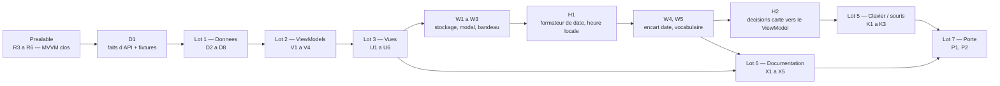

# T1 — Fiche station, écoulement ONDE et les avertissements : plan d'implémentation

> **For agentic workers:** REQUIRED SUB-SKILL: Use superpowers:subagent-driven-development (recommended) or superpowers:executing-plans to implement this plan task-by-task. Steps use checkbox (`- [ ]`) syntax for tracking.

> **Révision du 2026-09-22 — arbitrages du commanditaire.** Le plan est amendé **en place** (approche A) après un bilan de conception vérifié sur le code : `BR-013` (encart renforcé) est **reporté en T2**, avec l'écran des restrictions VigiEau qui sera le premier écran de ressource (décision 11) ; l'heure affichée est l'**heure locale sans suffixe**, fuseau injecté (décision 12, clôt le point 19 de `project-state.md`). Deux tâches sont insérées juste avant celles qui en ont besoin — **`H1`** (formateur de date unique, avant `W4`) et **`H2`** (décisions de la carte rapatriées dans `MapViewModel`, avant `K1`) — et les tâches `W2`→`W5`, `K1`, `K2`, `X1`→`X5`, `P1`, `P2` sont corrigées. **35 tâches actives.** Contexte, défauts constatés et alternatives écartées : [`2026-09-22-revision-plan-t1-design.md`](../specs/2026-09-22-revision-plan-t1-design.md).

**Goal:** au tap d'une station, une feuille de résumé donne le débit en m³/s avec sa date, sa fraîcheur et sa qualification ; les points ONDE sont sur la carte avec leurs quatre catégories et l'âge de leur campagne ; **les trois avertissements qui ont un écran en T1 sont en place** (modal, bandeau, encart daté — l'encart renforcé de `BR-013` part en T2 avec son écran, décision 11) et l'acquittement survit au redémarrage ; la carte se pilote au clavier et à la souris ; version `0.2.0` construite et lancée hors outil sur Windows.

**Architecture:** feature-first + MVVM (`ADR-014`) — `lib/features/<feature>/{view,view_model}`, un `ChangeNotifier` par écran, appels **typés** aux dépôts de `lib/data/`, `lib/domain/` en Dart pur et transverse. `CachePolicy` est un **décorateur de dépôt** (`lib/data/cache/cache_policy.dart`), unique. Aucun bus, aucun message, aucune bibliothèque d'état.

**Tech Stack:** Flutter 3.47.4 stable / Dart 3.13.3 · `flutter_map` 8.3.2 · `latlong2` · `package:http` · `shared_preferences` (décision 3) · `flutter_test` · cible **Windows** construite, **iOS** configuré et jamais compilé, **Android** différé le 2026-09-12 puis **réactivé le 2026-09-18** (plateforme générée, jamais encore construite — voir [`ADR-013`](../../adr/ADR-013-bascule-flutter-cible-windows.md), amendement du 2026-09-18).

---

## Préalable bloquant — le réusinage MVVM doit être clos

Ce plan est écrit **sur l'architecture cible**. Les tâches `R1` → `R6` de la § « Suite immédiate » de [`2026-09-13-t0-socle-flutter.md`](2026-09-13-t0-socle-flutter.md) sont un **préalable**, pas un lot de T1. ✅ **Préalable levé le 2026-09-13** : `R1` à `R6` sont faits et relus sur `feat/t1-mvvm-fiche-station` (sommet `c1a5755`, 244 tests verts) — `MapViewModel` appelle `StationPointRepository` par un appel typé, `withCachePolicy` vit sous `lib/data/cache/`, `test/architecture/layers_test.dart` verrouille cinq règles de couches, `lib/application/` n'existe plus.

⚠️ **Aucune tâche de T1 ne démarrait avant que `R5` soit vert.** Sans lui, le premier ViewModel peut importer `material.dart` sans que rien ne le voie — et c'est exactement le défaut que la relecture de T0 a trouvé. Il est vert : la règle `view-model-sans-widget` est en place.

---

## Cible et périmètre

| Cible | État dans ce plan |
|---|---|
| **Windows** | **La seule construite.** La porte de T1 se franchit sur Windows |
| **iOS** | Déclaré, `bundleIdentifier` aligné. **Jamais compilé** — aucun hôte macOS |
| **Android** | ~~⏸ différé (arbitrage 2026-09-12)~~ → 🔄 **réactivé le 2026-09-18** par le commanditaire. Les tâches restent listées en fin de plan, **hors décompte** : `A⏸1` faite, `A⏸2` à constater par une construction, les autres toujours ⏸ |

**Ce que T1 fait :** (a) fiche station au tap · (b) carte colorée par état, deux échelles · (c) écoulement ONDE de bout en bout · (d) **trois des quatre avertissements** — modal, bandeau, encart daté ; le texte de l'encart renforcé est écrit, son widget part en T2 (décision 11) · (e) lot clavier/souris · (f) Gherkin, traçabilité, `NFR-01`.

**Ce que T1 ne fait pas :**

- **Aucun percentile.** `ADR-003` et son script Dart sont **hors T1** — décision 1. La conséquence est assumée et visible : sur l'échelle « débit », **toute** station est `Indéterminé` au sens de `BR-004`.
- **Aucun appel VigiEau.** `RestrictionSource` reste une interface ; l'échelle 3 et `UC-002` sont en **T2**. ~~`BR-013` est néanmoins posé sur les écrans de ressource qui existent.~~ **Amendé le 2026-09-22 (décision 11)** : aucun écran de T1 n'est un écran de ressource au sens de `BR-013` — la fiche station donne une mesure, pas une disponibilité de la ressource. L'encart renforcé est **reporté en T2**, posé sur l'écran des restrictions VigiEau ; T1 n'en écrit que le **texte**, dans `warning_texts.dart` (`W5`). ⚠️ Prérequis T2 hors de ce plan : `RestrictionSource` vit aujourd'hui sous `lib/data/restrictions/restriction_source.dart`, qu'un ViewModel ne peut pas importer (règle `features-vers-data`) — l'interface devra passer sous `lib/domain/`.
- **Aucune courbe** (`US-11`), aucun favori (`US-14`), aucun filtre (`US-13`), aucune recherche (`US-16`) : **T3**.
- **Aucune géolocalisation** — `NFR-05` reste tenu par construction. **Aucune base structurée** : la seule persistance est l'acquittement (`W1`). **Aucun `integration_test/`** : T3.

---

## Faits à vérifier avant d'écrire

### Constaté le 2026-09-13, par appel HTTP réel — ne pas re-supposer

| # | Fait | Appel |
|---|---|---|
| `T-01` | `/v1/ecoulement/observations` **accepte `bbox`** — `bbox=1.0,47.3,1.8,47.8` → HTTP **206**, `count` **1 448**. La carte n'a donc **pas** besoin de passer par le département | `…/v1/ecoulement/observations?bbox=1.0,47.3,1.8,47.8&size=3` |
| `T-02` | Le même endpoint accepte **`sort=desc`** et **`fields`** (`C-17`) : 206 sans erreur | `…&sort=desc&fields=code_station,date_observation,code_ecoulement,libelle_ecoulement,latitude,longitude` |
| `T-03` | Il accepte **`date_observation_min`** — `2026-07-15` sur la même emprise → `count` **30** contre 1 448. C'est le filtre qui rend le chargement de carte tenable | `…&bbox=…&date_observation_min=2026-07-15&size=1` |
| `T-04` | `?code_station=K4520001&sort=desc` → 206, `count` **96**, trois dernières campagnes `2026-08-25` code `"3"`, `2026-07-24` code `"3"`, `2026-06-26` code `"2"`. ~~**Le code à 8 caractères est la clé de l'historique d'un point**~~ ⚠️ **amendé le 2026-09-14 : la forme à 8 caractères est fausse en général, voir `T-14`** — le code de station reste la clé de l'historique, mais c'est une chaîne libre | idem |
| `T-05` | `/v1/ecoulement/campagnes?code_departement=41` → **206**, `count` **96**, `api_version` `1.2.0`. Champs : `code_campagne`, `date_campagne`, `nombre_modalite_ecoulement`, `code_type_campagne`, `libelle_type_campagne`, `code_reseau`, `code_departement` | idem |
| `T-06` | **`libelle_type_campagne` est en minuscules** : `"usuelle"` relevé ce jour — `C-10` reproduit, comparaison en minuscules | `T-05` |
| `T-07` | 🚨 **`code_campagne` change de type selon l'endpoint** : **entier** `109905` dans `/campagnes`, **chaîne** `"109905"` dans `/observations`. Un modèle qui le type en `int` casse sur l'un des deux. Fait **nouveau**, absent du cadrage | `T-04` et `T-05` |
| `T-08` | `date_observation` est **une date sans heure** (`"2026-08-25"`) : `BR-010` se calcule en **jours** | `T-04` |
| `T-09` | Une observation ONDE porte les coordonnées **deux fois** — `latitude`/`longitude` à plat **et** `geometry` GeoJSON — plus `code_cours_eau`, `libelle_cours_eau` (casse sans règle, voir `docs/sources/onde.md` § T-09, la fiche est la source de vérité), `code_departement`, `code_commune` | `T-04` |
| `T-10` | 🚨 **`/v2/hydrometrie` était indisponible ce jour** : **503** sur 19 tentatives réparties sur ~25 min, un **502** après 67 s, un timeout sec. `/v1/ecoulement` répondait 206 au même moment. **`C-15` n'est pas une précaution rédactionnelle**, c'est le régime observé : le mode dégradé par source (`BR-007`, `UC-001 A4`) est la première chose à tenir. Détail des sept appels de l'après-midi : `docs/sources/hubeau-hydrometrie.md` § T-10 | `…/v2/hydrometrie/observations_tr?code_entite=K447001001&grandeur_hydro=Q&size=2` |
| `T-11` | `shared_preferences` **2.5.5**, publiée le **2026-03-25**, **BSD-3-Clause**, plateformes **Android, iOS, Linux, macOS, Web, Windows**. Contrainte `sdk ^3.9.0`, `flutter >=3.35.0` — satisfaite par le poste (Dart 3.13.3, Flutter 3.47.4) | `https://pub.dev/api/packages/shared_preferences` + page pub.dev |
| `T-12` | La forme filaire à virgules encodées (`%2C`) est acceptée : `fields` honoré, les lignes de `data` ne portent que les champs demandés. Détail : `docs/sources/onde.md` § T-12 | `…/v1/ecoulement/observations?bbox=1.0%2C47.3%2C1.8%2C47.8&date_observation_min=2026-07-15&size=2&sort=desc&fields=code_station%2Cdate_observation%2Ccode_ecoulement` |
| `T-13` | La forme filaire exacte émise par l'app (dix champs, bbox à quinze décimales) est acceptée, ainsi que la notation exponentielle que `double.toString()` produit sous `1e-6`. Détail : `docs/sources/onde.md` § T-13 | `…/v1/ecoulement/observations?bbox=1.000000000000001%2C47.300000000000004%2C1.7811667496231998%2C47.799999999999997&date_observation_min=2026-07-15&sort=desc&fields=…&size=2` + `bbox=3e-7%2C47.3%2C1.8%2C47.8&size=1` |

### Constaté le 2026-09-14, par appel HTTP réel — correctif d'un bug vu à l'écran

> ⚠️ Le numéro `T-11` était **déjà pris** par le relevé `shared_preferences` ci-dessus : ce fait
> porte donc `T-14`, premier libre. Un numéro ne se réutilise pas.

| # | Fait | Appel |
|---|---|---|
| `T-14` | 🚨 **`T-04` est invalidé sur sa partie « huit caractères »** : le code de station ONDE est une **chaîne libre**. Page nationale → HTTP **200**, `count` **10 234**, **3 302** codes distincts, dont **147** hors `^[A-Z0-9]{8}$` (129 de forme `A721 3011`, 10 à espaces de bord, `S224` à 4 caractères…) — **507 lignes** sur 10 234. **L'espace est significatif** : `code_station=A721%203011` → count **40**, `A7213011` → count **63**, deux historiques et deux libellés distincts. Le code est conservé **verbatim** : ni `trim`, ni suppression d'espace. Conséquence vue à l'écran : la validation de forme faisait remonter l'exception jusqu'à `MapViewModel`, bandeau rouge et **zéro station**. Détail, contre-exemples et formes filaires (`+` contre `%20`) : `docs/sources/onde.md` § `T-14` | `…/v1/ecoulement/observations?bbox=-5.5,41,10,51.5&date_observation_min=2026-07-15&size=20000&sort=desc&fields=…` puis `?code_station=A721%203011`, `?code_station=A7213011`, `?code_station=X123%20472`, `?code_station=S224` |
| `T-14 e` | **`code_ecoulement` à `null` est fréquent hors Loire** : **700 lignes sur 10 234** (6,8 %), `libelle_ecoulement` `null` sur les mêmes ; réparties sur **29 campagnes**, **20 dates** et **17 départements** — pas sur une seule campagne en cours. **`Q-05` est amendé** : `Inconnu(null)` n'est plus un cas synthétique. Le mapper les rendait déjà correctement, elles n'étaient pas en cause dans le bug | idem, plus `?code_station=P9130001` |

### Ouvert — à établir par appel réel en `D1`, avant `D5`

| # | Question | Pourquoi elle bloque |
|---|---|---|
| `Q-01` | `observations_tr` accepte-t-il **plusieurs `code_entite`** séparés par des virgules ? | C'est la différence entre 1 requête et 50 pour une carte. **Non tranchable ce jour** : `T-10` |
| `Q-02` | `observations_tr` accepte-t-il **`bbox`** ? `C-09` ne l'exclut que pour `referentiel/stations` et `/sites` | Si oui, une requête par emprise remplace N requêtes par station |
| `Q-03` | Accepte-t-il **`fields`** et **`size=1`** pour ne ramener que la dernière mesure ? | Pèse directement le coût réseau |
| `Q-04` | **Latence** d'un appel `observations_tr` `size=1`, médiane sur 10 appels | Sans elle, l'intervalle du préchargement est un chiffre inventé |
| `Q-05` | `code_ecoulement` à `null` existe-t-il encore ? (0 sur 2 821 le 2026-09-13 ; 30 sur 7 000 le 2026-08-01) | Décide si `Inconnu(null)` est un cas de fixture ou un cas synthétique |

⚠️ Chaque réponse est **datée**, consignée dans `docs/sources/*.md`, sa capture déposée en fixture (`docs/plan-de-tests.md § 4`). Une question sans réponse reste écrite comme telle : elle ne devient pas un « probablement ».

### Le coût réseau d'une carte, chiffré

Hypothèse : **50 stations hydrométriques visibles** — ordre de grandeur d'un zoom départemental sur 4 150 stations.

| Stratégie | Requêtes pour 50 stations | Verdict |
|---|---|---|
| Une par station, par grandeur (`Q` **et** `H`) | **100** | ❌ `C-12` (aucun quota documenté) et `NFR-07` (aucun appel en bloc) le refusent |
| Une par station, débit seul, `size=1` | **50** | ⚠️ tenable seulement étalé dans le temps |
| Groupée par lot de 20 codes, si `Q-01` confirmé | **3** | ✅ à préférer si confirmé |
| Une par emprise, si `Q-02` confirmé | **1** | ✅ à préférer si confirmé |
| Un appel national | 1 | ❌ **explicitement interdit** (`NFR-07`, `C-07` : `page × size ≤ 20 000`) |

**Stratégie retenue, par ordre de confiance :**

1. **Au tap : chargement à la demande.** La station tapée déclenche **1** requête (débit), **2** si la feuille montre la hauteur. C'est le chemin **garanti** : il ne dépend d'aucune réponse à `Q-01`/`Q-02`, et c'est le seul dont `UC-003` ait besoin.
2. **Préchargement borné.** Au **relâcher** du geste, les **N = 20** stations les plus proches du centre du viewport sont chargées **en série**, intervalle **200 ms** (~4 s pour 20, à ré-arbitrer dès que `Q-04` donne la latence). Un nouveau geste **annule** le préchargement en cours. Les stations non chargées portent `NonChargee`, jamais un état par défaut (`BR-007`).
3. **Si `Q-01` ou `Q-02` est confirmé**, le préchargement passe à 1–3 requêtes et `N` couvre tout le viewport. **L'interface du dépôt ne change pas** — seule son implémentation le fait.

`CachePolicy` (TTL **20 min**, `03-conception.md § 4.1`) rend le second geste sur la même zone gratuit : la valeur en cache s'affiche immédiatement, le rafraîchissement part en tâche de fond, et les rafraîchissements simultanés sont dédupliqués (`C-12`).

---

## Qui lance quoi

| Commande | Lancée par |
|---|---|
| `flutter analyze`, `flutter test`, `dart format`, `flutter pub get`, `flutter pub add`, `curl` | **Claude**, dans le bac à sable |
| `flutter run -d windows`, `flutter build windows --release`, lancement de l'exécutable, tout constat à l'écran | **le commanditaire** |

Toute commande du commanditaire est présentée **seule dans son bloc `bash`**, avec le **résultat attendu énoncé**, ensuite **constaté et recopié**. Jamais supposé.

## Critère de fin, identique pour chaque tâche — dit ici une seule fois

```bash
flutter analyze
flutter test
dart format --set-exit-if-changed lib test
```

Attendu : `No issues found!` · tous les tests passent, aucun `[E]` · code de sortie **0** au formatage. Les trois sont verts **avant** le commit. **Un commit par tâche.**

---

## Structure de fichiers

```
lib/domain/                             Dart pur — ajouts de T1
  observation/station_map_state.dart    sealed : NonChargee | Chargee | SansDonnee | EnEchec (D2)
  onde/onde_station_code.dart           OndeStationCode, 8 caracteres (D2)
  onde/onde_point.dart  onde/onde_observation.dart  onde/campaign_age.dart   (D2)
  repositories/repositories.dart        + OndeObservationRepository, AcknowledgementRepository (D2, W1)
  warnings/warning_texts.dart           TOUS les textes d'avertissement ; la version ne couvre que le
                                        modal (W2) — bandeau W3, encart date W4, encart renforce W5
  sources/source_names.dart             noms de source affiches, Hub'Eau hydrometrie et ONDE (W4)
  formatting/display_date.dart          formateur de date unique, heure locale, fuseau injecte (H1)
lib/data/
  cache/cache_policy.dart               withCachePolicy, unique (pose par R4)
  http/onde_uris.dart  http/hub_eau_paging.dart                  (D4)
  mappers/onde_observation_mapper.dart                           (D3)
  observations/http_hydro_observation_repository.dart             (D5)
  observations/cached_hydro_observation_repository.dart  TTL 20 min (D6)
  onde/http_onde_observation_repository.dart  onde/cached_onde_observation_repository.dart (D7)
  preferences/shared_preferences_acknowledgement_repository.dart  (W1)
lib/features/
  map/view_model/map_view_model.dart  map/view_model/map_scale.dart          (V2)
  map/view/station_marker.dart  map/view/onde_marker.dart  map/view/map_legend.dart  (U2, U3)
  map/view/map_empty_states.dart  map/view/map_controls.dart                 (U6, K1)
  map/view/map_warning_banner.dart                                           (W3 — seul consommateur : la carte)
  map/view/{map_scale_chips,ign_attribution_badge}.dart   sortis de map_view.dart (K1)
  station_sheet/{view_model/station_sheet_view_model.dart,view/station_summary_sheet.dart}  (V1, U1)
  onde_sheet/{view_model/onde_sheet_view_model.dart,view/onde_summary_sheet.dart}          (V3, U4)
  warnings/view_model/warnings_view_model.dart                               (V4)
  warnings/view/initial_warning_view.dart                                    (W2)
  shared/sheet_warning_card.dart        encart date des deux fiches, premier occupant de shared/ (W4)
  shared/tap_target.dart                cible tactile 44 pt, constante unique (K1)
  (reinforced_warning_card.dart : T2, avec l'ecran des restrictions — decision 11)
lib/diagnostics/frame_timing_probe.dart percentiles de trame, NFR-01 (X3)
lib/diagnostics/counting_station_point_repository.dart  compteur d'appels, NV-W6 (X3) — importe par main.dart seul
lib/main.dart                           cable depots et ViewModels

test/  un test par fichier de code, plus :
  features/goldens/                      rendu de marqueur (U5)
  project/acceptance_features_test.dart  chaque scenario cite un BR existant (X1)
  project/tracabilite_test.dart  project/vocabulary_test.dart  project/windows_min_size_test.dart
  project/vocabulary_lists.dart          listes proscrites et exceptions nominatives (W5)
  project/warning_texts_version_test.dart  texte integral du MODAL + version figes (W2)
  fixtures/onde/                         captures datees de D1

docs/  acceptance/*.feature (X1) · tracabilite.md (X2) · adr/ADR-011-stockage-local.md (W1)
       nfr.md (X3) · CHANGELOG.md (X4) · sources/onde.md, sources/hubeau-hydrometrie.md (D1)
```

**Conventions :** identifiants en **anglais**, valeurs de nomenclature métier en **français**, mot pour mot comme `docs/glossary.md`. Aucun mot banni pour qualifier un débit — *suffisant, insuffisant, normal, bon, sûr* (`BR-003`) ; la classe médiane se dit **« habituel pour la saison »**. Aucun verbe d'instruction sur un usage de l'eau (`BR-014`), vouvoiement systématique.

---

## Lot 1 — Données

### Task D1 : Répondre aux questions ouvertes, capturer, écrire les fiches

**Files:** créés `test/fixtures/onde/campagnes_departement_41_<date>.json`, `test/fixtures/onde/observations_bbox_loire_<date>.json`, `test/fixtures/onde/observations_station_K4520001_<date>.json` · modifiés `docs/sources/onde.md`, `docs/sources/hubeau-hydrometrie.md`, `test/fixtures/CAPTURES.md`, `test/fixtures/fixtures_test.dart`

> **Première parce qu'aucune autre tâche ne peut être écrite juste sans elle.** `T-07` aurait fait échouer `D3` sans prévenir, et `Q-01`/`Q-02` décident de la forme de `D5`.

**Invariant :** un fait d'API non obtenu par appel réel n'entre pas dans le code ; il reste écrit comme ouvert, avec l'URL consultée et la date.

- [x] **Étape 1 — capturer les trois fixtures ONDE**, verbatim, une par appel :

```bash
curl -s "https://hubeau.eaufrance.fr/api/v1/ecoulement/campagnes?code_departement=41&size=20" -o test/fixtures/onde/campagnes_departement_41_$(date +%F).json
curl -s "https://hubeau.eaufrance.fr/api/v1/ecoulement/observations?bbox=1.0,47.3,1.8,47.8&date_observation_min=2026-07-15&size=30&sort=desc" -o test/fixtures/onde/observations_bbox_loire_$(date +%F).json
curl -s "https://hubeau.eaufrance.fr/api/v1/ecoulement/observations?code_station=K4520001&sort=desc&size=10" -o test/fixtures/onde/observations_station_K4520001_$(date +%F).json
```
Attendu : trois fichiers non vides, chacun avec `"api_version"` et `"count"`. **Recopier le statut HTTP et le `count` de chacun dans `test/fixtures/CAPTURES.md`.**

- [x] **Étape 2 — répondre à `Q-01` à `Q-04`.** Trois appels, statut et durée recopiés :

```bash
curl -s -w '\nHTTP=%{http_code} time=%{time_total}\n' "https://hubeau.eaufrance.fr/api/v2/hydrometrie/observations_tr?code_entite=K447001001,K4620020&grandeur_hydro=Q&size=4"
curl -s -w '\nHTTP=%{http_code} time=%{time_total}\n' "https://hubeau.eaufrance.fr/api/v2/hydrometrie/observations_tr?bbox=1.0,47.3,1.8,47.8&grandeur_hydro=Q&size=3"
curl -s -w '\nHTTP=%{http_code} time=%{time_total}\n' "https://hubeau.eaufrance.fr/api/v2/hydrometrie/observations_tr?code_entite=K447001001&grandeur_hydro=Q&size=1&fields=code_station,date_obs,resultat_obs"
```
Attendu : **inconnu — c'est l'objet de la tâche.** ⚠️ Le 2026-09-13 ces appels ont répondu **503** (`T-10`). Si le service est encore indisponible, **ne pas insister** : consigner `Q-01` à `Q-04` comme ouverts avec la date et l'heure, et implémenter `D5` dans sa forme garantie. Trois tentatives espacées suffisent.

- [x] **Étape 3 — répondre à `Q-05`** : `grep -c '"code_ecoulement":null' test/fixtures/onde/observations_bbox_loire_*.json`. Attendu : un compte, **zéro compris — zéro est une réponse**.
- [x] **Étape 4 — compléter `docs/sources/onde.md`** : ligne `/campagnes` renseignée (fixture, `count` 96, champs de `T-05`), `T-06` à `T-09` en § « Faits constatés », **`T-07` en encart ⚠️**, § « Non vérifié » réduite à ce qui reste ouvert.
- [x] **Étape 5 — compléter `docs/sources/hubeau-hydrometrie.md`** : `T-10` avec l'heure de la tentative, et `Q-01` à `Q-04` en § « Non vérifié » avec leur URL.
- [x] **Étape 6 — étendre `test/fixtures/fixtures_test.dart`** : chaque nouvelle fixture est lisible en JSON, porte `api_version`, et est **citée** depuis `docs/sources/onde.md` — une fixture orpheline est une fixture dont personne ne sait ce qu'elle prouve.
- [x] **Étape 7** — `flutter test test/fixtures/fixtures_test.dart` → vert, puis le critère de fin.
- [x] **Étape 8 — commit.**

```bash
git add test/fixtures docs/sources && git commit -m "docs(ecoulement): capturer campagnes et observations ONDE, et consigner ce qui reste ouvert" -m "code_campagne est un ENTIER dans /campagnes et une CHAINE dans /observations : un modele qui le type en int casse sur l un des deux. bbox, sort, fields et date_observation_min sont acceptes par /observations — la carte n a pas besoin du departement. Hydrometrie v2 a repondu 503 sur <N> tentatives : Q-01 a Q-04 restent ouverts, ecrits comme tels."
```

### Task D2 : Le domaine de l'écoulement, et l'état d'une station sur la carte

> ⚠️ **Correctif du 2026-09-14 (bug vu à l'écran)** : `T-04` invalidé — codes ONDE **verbatim**,
> ligne illisible ignorée et comptée (`T-14`, `docs/sources/onde.md`). `OndeStationCode`
> n'impose plus `^[A-Z0-9]{8}$` : il accepte toute chaîne non blanche et la conserve telle
> quelle, espaces compris. Ce qui sépare ONDE d'hydrométrie est désormais le **type**, pas la
> forme.

**Files:** créés `lib/domain/onde/{onde_station_code,onde_point,onde_observation,campaign_age}.dart`, `lib/domain/observation/station_map_state.dart` · modifié `lib/domain/repositories/repositories.dart` · tests miroirs

**Signatures publiques**

- `final class OndeStationCode { factory OndeStationCode(String raw); final String value; }` — ~~`^[A-Z0-9]{8}$`~~ **toute chaîne non blanche, verbatim** (correctif du 2026-09-14, `T-14`) ; `ArgumentError` sur `''` et `'   '` seulement ; avec `==`/`hashCode`/`toString`
- `final class OndePoint { OndeStationCode code; String label; double latitude; double longitude; String? waterCourseLabel; DepartementCode? departement; }`
- `final class OndeCampaign { String code; DateTime date; String rawTypeLabel; int? modalityCount; }`
- `final class OndeObservation { OndeStationCode station; OndePoint point; DateTime observedAt; FlowCategory category; String? rawFlowCode; String? officialLabel; String? campaignCode; }` — `point` (D8)
- `enum CampaignAge { recente, ancienne }` · `const Duration campagneAncienneApres = Duration(days: 60);`
- `CampaignAge campaignAgeOf({required DateTime observedAt, required DateTime now})` · `int campaignAgeInDays({required DateTime observedAt, required DateTime now})`
- `sealed class StationMapState` avec `NonChargee`, `Chargee(Freshness freshness)`, `SansDonnee`, `EnEchec(Object cause)` · `String stationMapStateLabel(StationMapState state)`
- Ajouts à `repositories.dart` : `abstract interface class OndeObservationRepository { Future<List<OndeObservation>> latestWithinBounds(Bounds bounds, {required DateTime since}); Future<List<OndeObservation>> historyFor(OndeStationCode station, {int limit = 5}); }`

**Invariants :** `OndeStationCode` (8 car.) et `StationCode` (10 car.) sont **deux types qui ne se substituent jamais** (`T-04`) ; l'âge de campagne se compte en **jours**, l'API ne donnant pas d'heure (`T-08`) ; `StationMapState` distingue **« pas encore chargé »** de **« aucune donnée »**, sans quoi un écran en cours de chargement afficherait un état par défaut, ce que `BR-007` interdit.

⚠️ Amendement du 2026-09-14 : `OndeCampaign`, `mapOndeCampaign`, `ondeCampagnesUri` retirés — aucun appelant, aucune tâche `V*`/`U*` ne les consomme (YAGNI, CLAUDE.md) ; la fixture `/campagnes` et `T-07` restent.

**Cas de test**

- `OndeStationCode('K4520001')` accepté ; `'K447001001'` (10 car.) → `ArgumentError` ; `'k4520001'` → `ArgumentError` ; `''` → `ArgumentError`.
- `campaignAgeInDays(observedAt: 2026-08-25, now: 2026-09-13)` → **19**, `campaignAgeOf` → `recente`.
- Borne `BR-010` des deux côtés : **59 j → `recente`**, **60 j → `ancienne`**, **61 j → `ancienne`** — la borne appartient à l'état le plus sévère.
- `campaignAgeOf(observedAt: 2025-09-26, now: 2026-02-15)` → `ancienne` (142 j) : le cas hors saison de `BR-010`.
- Âge négatif (mesure dans le futur) → `recente`, jamais un âge inventé — même parade que `freshnessOf`.
- `stationMapStateLabel` : `SansDonnee` → **« Aucune donnée disponible ici. »** exactement (`BR-007`) ; `NonChargee` → **aucun** libellé d'état ; `Chargee(Freshness.perimee)` → contient « Dernière mesure ».
- `switch` exhaustif sur `StationMapState` : une sous-classe sans branche est une **erreur de compilation** (`BR-011`).
- `OndeObservation` conserve `rawFlowCode` tel que reçu, non normalisé, même quand `category` est `Inconnu` (`BR-011`).

- [x] **Étape 1** — écrire les cinq fichiers de test, tous rouges.
- [x] **Étape 2** — `flutter test test/domain` → échec, types absents.
- [x] **Étape 3** — implémenter les cinq fichiers de `lib/domain/` et les deux interfaces de dépôt.
- [x] **Étape 4** — `flutter test test/domain test/architecture/domain_isolation_test.dart` → vert : aucun import d'infrastructure n'est entré dans le domaine.
- [x] **Étape 5** — critère de fin, puis commit.

```bash
git add lib/domain test/domain && git commit -m "feat(domain): typer l ecoulement ONDE et l etat d une station sur la carte" -m "OndeStationCode fait huit caracteres, StationCode dix : les deux referentiels sont distincts et les types ne se substituent pas. L age de campagne se compte en jours parce que l API ne donne pas d heure ; la borne de 60 jours appartient a l etat le plus severe (BR-010). StationMapState distingue NonChargee de SansDonnee : un ecran en cours de chargement n affiche pas d etat par defaut (BR-007)."
```

### Task D3 : Le mapper d'écoulement, seul point de passage

**Files:** créé `lib/data/mappers/onde_observation_mapper.dart` · test miroir

**Signatures publiques** — `OndeObservation mapOndeObservation(Map<String, dynamic> raw)` · `OndeCampaign mapOndeCampaign(Map<String, dynamic> raw)` · `OndePoint mapOndePoint(Map<String, dynamic> raw)`

**Invariant :** `code_campagne` est lu en `Object?` puis rendu en `String` — entier côté `/campagnes`, chaîne côté `/observations` (`T-07`) ; **aucun `as int`** n'apparaît dans ce fichier.

⚠️ Voir l'amendement du 2026-09-14 sous `D2` : `mapOndeCampaign` retiré.

**Cas de test**

- Première observation de `observations_station_K4520001_<date>.json` → `station` `K4520001`, `observedAt` `2026-08-25`, `category` `Assec()`, `officialLabel` `'Assec'`, `rawFlowCode` `'3'`.
- `'1a'` → `Ecoulement()` · `'1f'` → `EcoulementFaible()` · `'2'` → `EcoulementNonVisible()` · `'3'` → `Assec()` · `'4'` → `NonObserve()` · `'9z'` → `Inconnu('9z')` · absent → `Inconnu(null)` — aucun ne lève (`C-10`, `BR-011`).
- `mapOndeCampaign` sur `code_campagne: 109905` (entier) → `'109905'` ; `mapOndeObservation` sur `'109905'` (chaîne) → `'109905'`. **Les deux rendent la même chaîne** : c'est le test qui prouve `T-07`.
- `libelle_type_campagne: 'usuelle'` → `rawTypeLabel` conservé **tel quel** ; la comparaison se fait en minuscules côté appelant (`T-06`).
- `date_observation` absente ou illisible → `FormatException` (`BR-001`) ; `'2026-08-25'` → `DateTime.utc(2026, 8, 25)`, **aucune heure inventée** (`T-08`).
- `mapOndePoint` lit `latitude`/`longitude` **à plat** et ignore `geometry` : deux sources concordantes, une seule lue (`T-09`). `libelle_station` absent → `label` replié sur le code, jamais une chaîne vide.
- Une charge utile avec un champ inédit (`'champ_inedit': 1`) se lit sans échouer (`BR-011`).

- [x] **Étape 1** — écrire le test sur la **fixture réelle** de `D1`, jamais sur un objet écrit de mémoire (`docs/plan-de-tests.md § 2`). Rouge.
- [x] **Étape 2** — `flutter test test/data/mappers/onde_observation_mapper_test.dart` → échec.
- [x] **Étape 3** — implémenter. `flowCategoryFromCode` est **réutilisé**, pas recopié.
- [x] **Étape 4** — `flutter test test/data/mappers` → vert, puis critère de fin et commit.

```bash
git add lib/data/mappers test/data/mappers && git commit -m "feat(ecoulement): mapper ONDE, teste sur la fixture reelle du 2026-09-13" -m "code_campagne est lu en Object? et rendu en String : entier dans /campagnes, chaine dans /observations. Un as int aurait casse sur l un des deux, sans qu aucun test de l autre ne le voie. date_observation est une date sans heure : aucune heure n est inventee (BR-001)."
```

### Task D4 : Les URI ONDE, sur le client Hub'Eau existant

**Files:** créé `lib/data/http/onde_uris.dart` · test miroir

**Signatures publiques**

- `Uri ondeObservationsWithinBoundsUri({required Bounds bounds, required DateTime since, int size = 1000})`
- `Uri ondeObservationsForStationUri(OndeStationCode station, {int size = 10})`
- `Uri ondeCampagnesUri({required DepartementCode departement, int size = 20})`
- ~~`OndeClient`~~ **retiré à l'exécution (2026-09-13)** : `HubEauClient.getJson` est réutilisé, fichier `onde_uris.dart`

**Invariant :** le `bbox` s'écrit **`ouest,sud,est,nord`** dans cet ordre exact — inverser deux valeurs ne lève aucune erreur, la carte se remplit simplement d'autre chose, et cela ne se voit qu'à l'écran.

⚠️ Voir l'amendement du 2026-09-14 sous `D2` : `ondeCampagnesUri` retiré.

**Cas de test**

- `ondeObservationsWithinBoundsUri(bounds: Bounds(west: 1.0, south: 47.3, east: 1.8, north: 47.8), since: 2026-07-15)` → `bbox=1.0,47.3,1.8,47.8`, `date_observation_min=2026-07-15`, chemin `/api/v1/ecoulement/observations` (`T-01`, `T-03`).
- L'URI porte `sort=desc` : sans lui, la « dernière » observation n'est pas la première rendue (`T-02`).
- `ondeObservationsForStationUri(OndeStationCode('K4520001'), size: 5)` → `code_station=K4520001&size=5&sort=desc` (`T-04`) ; `ondeCampagnesUri(departement: DepartementCode('41'))` → `code_departement=41` (`T-05`).
- `size: 0` → `ArgumentError` ; `size: 20001` → `ArgumentError` (`C-08`).
- `getJson` : **206 est un succès** (`C-06`), 200 aussi ; **404 ne se rejoue pas** ; **503 se rejoue** puis lève `HubEauFailure` après `maxAttempts` (`T-10` en est le cas réel).
- Le recul est **injecté** : le test ne dort pas. Le corps est décodé en **UTF-8 explicite** — `'ruisseau la rivière aux loches'` ressort avec son accent (`T-09`).

- [x] **Étape 1** — écrire le test avec `MockClient` de `package:http/testing.dart`. **Aucun test de ce fichier ne touche le réseau** : un service sans SLA rendrait la suite rouge sans qu'aucun code soit fautif (`C-15`, `T-10`). Rouge.
- [x] **Étape 2** — `flutter test test/data/http/onde_uris_test.dart` → échec.
- [x] **Étape 3** — implémenter en **réutilisant** `isSuccess`/`isRetryable` (`lib/data/http/http_status.dart`) et le recul de `lib/data/http/retry.dart`. Aucune recopie de logique de rejeu.
- [x] **Étape 4** — `flutter test test/data/http` → vert, puis critère de fin et commit.

Cas 404/503 de `getJson` non réécrits ici : déjà verrouillés dans `hub_eau_client_test.dart` (déviation notée le 2026-09-13).

```bash
git add lib/data/http test/data/http docs/superpowers/plans/2026-09-13-t1-fiche-station-et-avertissements.md && git commit -m "feat(ecoulement): URI ONDE bbox, station et campagnes sur le client Hub Eau existant" -m "Le bbox s ecrit ouest,sud,est,nord : inverser deux valeurs ne leve rien, la carte se remplit simplement d autre chose, et cela ne se voit qu a l ecran. Pas de classe OndeClient : HubEauClient.getJson prend deja n importe quelle URI, avec 206 en succes (C-06), rejeu sur 503 et jamais sur 404 ; un second client aurait recopie la logique de rejeu. La verification de taille et le format de date sont reutilises, jamais recopies."
```

### Task D5 : `HydroObservationRepository`, enfin implémenté

**Files:** créé `lib/data/observations/http_hydro_observation_repository.dart` · test miroir

**Signatures publiques**

- `final class HttpHydroObservationRepository implements HydroObservationRepository { HttpHydroObservationRepository(HubEauClient client); }`
- ~~`findLatestForAll`~~ **retirée à l'exécution (2026-09-13)** : le préchargement borné et annulable vit dans `MapViewModel` (V2), qui appelle `findLatest` station par station.

**Invariants :** une absence de donnée rend **`null`**, jamais une erreur et jamais zéro (`BR-007`) ; une panne de source **lève**, pour que l'écran puisse nommer la source défaillante (`UC-001 A4`) ; ~~`findLatestForAll` **espace** ses appels et ne fait **jamais** d'appel national (`NFR-07`, `C-12`)~~.

**Cas de test**

- `findLatest(StationCode('K447001001'), Grandeur.debit)` sur `observations_tr_K447001001_Q_2026-09-13.json` → `discharge.value` **47,8** m³/s, `measuredAt` `2026-08-27T08:00:00Z` (`C-02`, `BR-002`).
- Même appel en `Grandeur.hauteur` sur la fixture `_H_` → `level.value` **−1,232** m, signe conservé, aucun contrôle ajouté.
- `{"count":0,"data":[]}` en **HTTP 200** → **`null`** (`BR-007`), jamais une exception ni un zéro. **HTTP 503** → `HubEauFailure` propagée (`T-10`).
- L'URI porte un **code station à 10 caractères**, jamais un code site : `findLatest` n'accepte qu'un `StationCode`, le type l'interdit (`C-05`).
- ~~`findLatestForAll` avec 3 codes et un `interval` injecté → **3 appels**, dans l'ordre, chacun précédé de l'attente sauf le premier ; le test **ne dort pas**.~~
- ~~L'échec d'**un** code laisse les deux autres renseignés, la clé fautive porte `null` — un écran partiel vaut mieux qu'un écran blanc (`BR-007`). Liste vide → **zéro appel**.~~

- [x] **Étape 1** — **relire** les réponses à `Q-01`/`Q-02` consignées en `D1`. Les deux restent ouvertes (panne `T-10`, 500 le 2026-09-13 après-midi) : la forme garantie s'applique, un appel par station. ⚠️ Ne pas deviner : lire ce qui a été écrit.
- [x] **Étape 2** — écrire le test avec `MockClient` et les fixtures de T0. Rouge.
- [x] **Étape 3** — `flutter test test/data/observations` → échec.
- [x] **Étape 4** — implémenter. `mapHydroObservation` est **réutilisé** : aucune conversion d'unité n'apparaît ici (`BR-002`).
- [x] **Étape 5** — `flutter test test/data` → vert, puis critère de fin et commit.

```bash
git add lib/data/observations test/data/observations && git commit -m "feat(hydrometrie): implementer HydroObservationRepository sur le client Hub Eau" -m "Une page vide en 200 rend null, jamais zero et jamais une erreur : l absence est un etat affiche (BR-007). Une panne de source leve, pour que l ecran nomme la source defaillante. Pas de findLatestForAll : le prechargement borne et annulable vit dans le ViewModel de carte, qui appelle findLatest station par station ; Q-01 et Q-02 restent ouverts, la forme garantie s applique."
```

### Task D6 : Le cache, décorateur de dépôt et rien d'autre

**Files:** créé `lib/data/observations/cached_hydro_observation_repository.dart` · test miroir

**Signatures publiques** — `final class CachedHydroObservationRepository implements HydroObservationRepository { CachedHydroObservationRepository({required HydroObservationRepository inner, Duration ttl = observationsTrTtl, DateTime Function()? now, bool Function()? networkAvailable}); }` · `const Duration observationsTrTtl = Duration(minutes: 20);`

**Invariant :** la politique de cache vit **dans ce seul décorateur**, jamais dans un dépôt, un ViewModel ou une vue — chaque recopie est une divergence future.

**Cas de test**

- TTL **20 min** exactement, tel que `03-conception.md § 4.1` le fixe pour `observations_tr` ; aucun autre chiffre n'apparaît dans le fichier.
- Cache vide → `inner.findLatest` appelé **une** fois, valeur rendue **et** écrite. Cache de **19 min** → valeur rendue, **zéro** appel.
- Cache de **20 min** exactement → valeur rendue **immédiatement**, rafraîchissement en tâche de fond : la borne appartient à l'état périmé.
- Cache périmé et `networkAvailable` → `false` → valeur en cache rendue, **zéro** appel réseau.
- Deux lectures **simultanées** sur une entrée périmée → **un seul** appel à `inner` (`C-12`) — la fermeture est conservée **par clé**, sinon la déduplication est annulée.
- Rafraîchissement en échec → la **dernière valeur connue** reste rendue, le cache n'est pas écrasé, un rafraîchissement ultérieur repart (`BR-007`).
- Les clés `(K447001001, debit)` et `(K447001001, hauteur)` ne partagent **jamais** une entrée. `ttl: Duration.zero` → `ArgumentError` à la construction.

- [x] **Étape 1** — écrire le test avec une horloge et un `inner` bouchons, tous deux injectés. Rouge.
- [x] **Étape 2** — `flutter test test/data/observations/cached_hydro_observation_repository_test.dart` → échec.
- [x] **Étape 3** — implémenter en **appelant** `withCachePolicy` de `lib/data/cache/cache_policy.dart`. ⚠️ Une fermeture **par clé**, conservée dans un champ — pas `withCachePolicy(...)()` à chaque lecture, qui reconstruirait un verrou toujours nul.
- [x] **Étape 4** — `flutter test test/data` → vert. Puis `grep -rn 'Duration(minutes' lib/` → l'occurrence est **unique**.
- [x] **Étape 5** — critère de fin, puis commit.

```bash
git add lib/data/observations test/data/observations && git commit -m "feat(hydrometrie): decorer le depot d observations par la politique de cache, TTL 20 min" -m "Le TTL de 20 minutes n apparait qu ici : une seconde occurrence serait une divergence future. Deux lectures simultanees sur une entree perimee ne declenchent qu un appel (C-12), et la fermeture est conservee par cle — la reconstruire a chaque lecture annulerait la deduplication. Un rafraichissement en echec laisse la derniere valeur connue (BR-007)."
```

### Task D7 : Le dépôt d'écoulement, et son cache saisonnier

> ⚠️ **Correctif du 2026-09-14 (bug vu à l'écran)** : `T-04` invalidé — codes ONDE **verbatim**,
> ligne illisible **ignorée et comptée** (`T-14`). `HttpOndeObservationRepository` expose
> `int get skippedRowCount`, cumulé par instance. Une `FormatException` ou une `ArgumentError`
> levée par le mapper **sur une ligne** n'est plus fatale ; `data` absent, d'un type inattendu,
> ou une ligne qui n'est pas un objet le restent (`UC-001 A4`). 507 lignes sur 10 234 faisaient
> tomber la carte entière.

**Files:** créés `lib/data/onde/http_onde_observation_repository.dart`, `lib/data/onde/cached_onde_observation_repository.dart` · tests miroirs

**Signatures publiques** — `final class HttpOndeObservationRepository implements OndeObservationRepository { HttpOndeObservationRepository(HubEauClient client); }` (`OndeClient` retiré en D4 : aucun second client, `HubEauClient` sert déjà les deux endpoints) · `final class CachedOndeObservationRepository implements OndeObservationRepository { CachedOndeObservationRepository({required OndeObservationRepository inner, DateTime Function()? now, bool Function()? networkAvailable}); }` · `Duration ondeTtlFor(DateTime date)`

**Invariants :** `latestWithinBounds` ne garde qu'**une** observation par `OndeStationCode`, la plus récente — l'API en rend une par campagne et par point (`T-04`, `count` 96 pour un seul point) ; le TTL dépend du **mois observé**, jamais d'une saison codée ailleurs.

**Cas de test**

- Sur `observations_bbox_loire_<date>.json` → **une seule** entrée par code de station ; pour `K4520001`, `observedAt` `2026-08-25` et non `2026-07-24`.
- `since` est répercuté en `date_observation_min` : sans lui la même emprise rend 1 448 lignes au lieu de 30 (`T-03`).
- `historyFor(OndeStationCode('K4520001'), limit: 5)` → 5 observations **décroissantes** en date, la première `2026-08-25` (`T-04`).
- `ondeTtlFor(2026-07-15)` → **30 j** ; `ondeTtlFor(2026-02-15)` → **90 j** ; bornes `2026-05-01` → 30 j, `2026-09-30` → 30 j, `2026-10-01` → 90 j, `2026-04-30` → 90 j.
- Réponse vide sur une emprise → **liste vide**, jamais une erreur : une zone hors couverture ONDE est un fait, pas une panne (`BR-007`, `UC-001 A5`). HTTP 503 → exception propagée, les points hydrométriques restent (`UC-001 A4`).
- `grep -rn 'stale\|revalidate' lib/data/onde/` ne rend **aucune** ligne : le décorateur réutilise `withCachePolicy`.

- [x] **Étape 1** — écrire les deux tests, tous deux rouges.
- [x] **Étape 2** — `flutter test test/data/onde` → échec.
- [x] **Étape 3** — implémenter les deux fichiers.
- [x] **Étape 4** — `flutter test test/data` → vert, puis critère de fin et commit.

```bash
git add lib/data/onde test/data/onde && git commit -m "feat(ecoulement): depot ONDE par emprise et par point, cache 30 j en saison et 90 j hors saison" -m "L API rend une observation par campagne et par point : 96 lignes pour la seule station K4520001. Le depot n en garde qu une, la plus recente, sinon la carte dessinerait un point par campagne. Le TTL suit le mois observe : de octobre a avril personne n observe, et un TTL de 30 jours y provoquerait des appels pour rien."
```

### Task D8 : Le point porté par l'observation ONDE (amendement du 2026-09-13)

**Pourquoi (décision du chef d'orchestre) :** `OndeObservationRepository.latestWithinBounds` rend des `OndeObservation` qui ne portent ni coordonnées ni libellé. Or la carte (`U3`) doit placer les points ONDE, et la fiche ONDE (`V3`/`U4`) attend un `OndePoint`. Chaque ligne de `/observations` porte pourtant `libelle_station`, `latitude`, `longitude`, `code_departement`, `libelle_cours_eau` (`T-09`), et `mapOndePoint` sait déjà les lire. Décision : `OndeObservation` gagne un champ `final OndePoint point`, construit par le mapper depuis la même ligne. Un seul type circule alors du dépôt à la carte et à la fiche, sans changer les interfaces de dépôt. Corollaire : `OndeSheetViewModel.open` prend un `OndePoint` (et non un `OndeStationCode`), ce qui permet l'état « aucune campagne » (historique vide) sans retirer le point de la carte (`UC-004 A4`) — reporté en `V3`.

**Files:** modifiés `lib/domain/onde/onde_observation.dart`, `lib/data/mappers/onde_observation_mapper.dart`, `test/domain/onde/onde_observation_test.dart`, `test/domain/repositories/repositories_test.dart`, `test/data/mappers/onde_observation_mapper_test.dart`, `test/data/onde/http_onde_observation_repository_test.dart`, `test/data/onde/cached_onde_observation_repository_test.dart`, ce plan

- [x] **Domaine** — `OndeObservation` gagne `required this.point` (`OndePoint`), documenté ; test miroir mis à jour, construit avec le point réel de K4520001.
- [x] **Mapper** — `mapOndeObservation` renseigne `point: mapOndePoint(raw)`, réutilisé, jamais recopié ; une observation sans coordonnées ou sans `code_station` valide lève désormais aussi la `FormatException`/`ArgumentError` de `mapOndePoint`, documenté.
- [x] **Tests** — tous les points de construction manuelle d'`OndeObservation` (`test/domain/onde/`, `test/domain/repositories/repositories_test.dart`, `test/data/onde/*`) reçoivent un `point` ; le test bbox de `http_onde_observation_repository_test.dart` assert désormais `point.latitude`/`point.longitude` de `K4640001`.
- [x] **Plan** — cette section, la signature de `D2` et l'ouverture de `V3` amendées.

```bash
git add lib/domain/onde lib/data/mappers test/domain test/data/mappers test/data/onde docs/superpowers/plans/2026-09-13-t1-fiche-station-et-avertissements.md && git commit -m "feat(ecoulement): l observation ONDE porte son point, lu sur la meme ligne d API" -m "latestWithinBounds rendait des observations sans coordonnees ni libelle : la carte ne pouvait pas les placer, la fiche ne pouvait pas les nommer. Chaque ligne de /observations porte pourtant le point (T-09) et mapOndePoint sait le lire. Un seul type circule du depot a la carte et a la fiche, les interfaces de depot ne changent pas."
```

---

## Lot 2 — ViewModels

### Task V1 : `StationSheetViewModel`

**Files:** créé `lib/features/station_sheet/view_model/station_sheet_view_model.dart` · test miroir

**Signatures publiques**

- `final class StationSheetViewModel extends ChangeNotifier { StationSheetViewModel({required HydroObservationRepository observations, required StationRepository stations, DateTime Function()? now}); }`
- `Future<void> open(StationCode code)` · `void close()` · `StationSheetState get state`
- `sealed class StationSheetState` : `Fermee`, `EnCours(StationCode)`, `Prete(StationSheetData)`, `EnEchec(StationCode, Object cause)`
- `final class StationSheetData { Station station; HydroObservation? discharge; HydroObservation? level; Freshness? freshness; String statusLabel; String qualificationLabel; String? stalenessNotice; }`

**Invariants :** ce fichier **n'importe ni `material.dart` ni `widgets.dart`** — `layers_test.dart` le refuse, et c'est ce qui le rend testable sans rendu ; `now` est **injecté** ; aucun formatage de nombre ici : le ViewModel expose des types du domaine, la vue formate.

**Cas de test**

- `open(StationCode('K447001001'))` → l'état passe par **`EnCours`** puis `Prete` ; `notifyListeners` appelé **deux** fois.
- Débit présent → `discharge.value` **47,8** ; balayage de tous les libellés produits : **aucune** chaîne parmi *suffisant, insuffisant, normal, bon, sûr* (`BR-003`).
- Observation du `2026-08-27T08:00Z` vue le `2026-09-13T10:00Z` → `freshness` **`perimee`**, `stalenessNotice` non nul et citant la date (`BR-005`) — le cas réel des 17 jours sur une station de référence.
- Vue 1 h après → `fraiche`, `stalenessNotice` **nul**. Vue 3 h après → `ancienne`, `stalenessNotice` contient **« il y a 3 h »** (`BR-005`).
- `libelle_qualification_obs` absent → `qualificationLabel` **« non qualifiée »** ; `libelle_statut` absent → `statusLabel` **« non renseigné »** — jamais une chaîne vide (`BR-006`, `BR-011`).
- `discharge` nul → `state` est `Prete` avec `discharge` nul : la vue dira l'absence, **jamais un zéro** (`BR-007`, `UC-003 A3`).
- Dépôt qui lève `HubEauFailure` → `EnEchec`, `cause` conservée pour que la vue **nomme la source** (`UC-001 A4`).
- `close()` → `Fermee` ; une réponse tardive d'un `open()` précédent **n'écrase pas** l'état (garde par jeton) ; après `dispose()`, aucun `notifyListeners`, aucune assertion.

- [x] **Étape 1** — écrire le test avec des dépôts bouchons et une horloge injectée. Rouge.
- [x] **Étape 2** — `flutter test test/features/station_sheet` → échec.
- [x] **Étape 3** — implémenter.
- [x] **Étape 4** — `flutter test test/features test/architecture` → vert, `layers_test.dart` compris. Puis critère de fin et commit.

```bash
git add lib/features/station_sheet test/features/station_sheet && git commit -m "feat(ui): StationSheetViewModel, l etat de la fiche station sans aucun widget" -m "L horloge est injectee : les bornes de BR-005 se testent aux valeurs exactes 1 h, 3 h et 17 jours plutot qu a ce que la machine affiche. La qualification absente devient non qualifiee, jamais une chaine vide (BR-006). Une valeur absente reste absente : jamais un zero (BR-007). Un balayage de tous les libelles produits refuse les cinq mots bannis (BR-003)."
```

### Task V2 : `MapViewModel` — un état par station, et une seule échelle

**Files:** modifiés `lib/features/map/view_model/map_view_model.dart` et son test · créé `lib/features/map/view_model/map_scale.dart`

**Signatures publiques** — `enum MapScaleKind { ecoulement, debit }` · `String mapScaleLabel(MapScaleKind kind)` · ajouts à `MapViewModel` : `MapScaleKind get scale` · `void selectScale(MapScaleKind kind)` · `StationMapState stateOf(StationCode code)` · `Map<OndeStationCode, OndeObservation> get ondeObservations` · `Future<void> preloadVisibleStations({int limit = 20})` · `void cancelPreload()`

**Invariants :** **une seule échelle active à la fois** (`BR-008`) — changer d'échelle change marqueurs **et** légende ensemble ; une station non chargée porte `NonChargee`, jamais un état par défaut (`BR-007`) ; le préchargement est **borné et annulable**, jamais national (`NFR-07`).

**Cas de test**

- `scale` par défaut → **`ecoulement`** (`UC-001 § 3`). `selectScale(debit)` → un `notifyListeners` ; `selectScale` avec la valeur courante → **aucune** notification.
- `stateOf` d'une station jamais chargée → `NonChargee` ; après une observation du `2026-09-13T09:00Z` vue à `10:00Z` → `Chargee(Freshness.fraiche)` ; après une réponse vide → `SansDonnee` ; après une panne → `EnEchec`, **les autres stations gardent leur état** (`UC-001 A4`).
- `preloadVisibleStations(limit: 20)` sur 50 stations visibles → **20** appels, pas 50 ; sur 5 visibles → **5** ; sur une emprise sans station → **zéro** appel (`UC-001 A2`).
- `cancelPreload()` après le 3ᵉ appel → **aucun** appel supplémentaire ; un nouveau geste annule le préchargement en cours avant d'en lancer un autre.
- Les 20 stations retenues sont les plus **proches du centre** de l'emprise, ordre déterministe et testable.
- Échelle `ecoulement` → `ondeObservations` alimenté avec `since = now - 60 jours` (`BR-010`, `T-03`) ; échelle `debit` → **aucun** appel ONDE.
- Après `dispose()` pendant un préchargement : aucun `notifyListeners`, aucune assertion.

- [x] **Étape 1** — étendre le test existant : rouge sur les nouveaux cas, **vert sur les anciens** — ce qui marchait en T0 continue de marcher.
- [x] **Étape 2** — `flutter test test/features/map/view_model` → échec sur les nouveaux cas seulement.
- [x] **Étape 3** — implémenter les ajouts.
- [x] **Étape 4** — `flutter test` → **437 tests, 436 verts** ; seul rouge : `test/project/ios_bundle_identifier_test.dart`, artefact de poste connu (un dossier `android/` non versionné), sans rapport avec `V2`. `flutter analyze` → `No issues found!` · `dart format --set-exit-if-changed lib test` → `0 changed`. Puis critère de fin et commit.

**Relecture du 2026-09-14** : `loadFor` notifie dès les points, avant l'ONDE (UC-001 § 4).

**Écart constaté** — deux points que la spec laissait ouverts, tranchés ici et documentés dans le code :
1. `loadFor` **annule** le préchargement en cours mais n'en **relance pas** un : c'est la vue qui rappelle `preloadVisibleStations` après un geste. Un écran qui ne veut pas de préchargement n'a ainsi rien à annuler.
2. Un passage à l'échelle `debit` **ne vide pas** `ondeObservations` : le retour à `ecoulement` a de quoi dessiner pendant que le rechargement tourne. C'est `scale`, et elle seule, qui dit à la vue quelle échelle afficher (BR-008 porte sur l'affichage, pas sur la mémoire).

Granularité des notifications, que le plan laissait libre : **une notification par état de station reçu** pendant un préchargement, la carte se remplissant au fil des réponses plutôt qu'en un bloc après quatre secondes.

```bash
git add lib/features/map test/features/map && git commit -m "feat(map): un etat par station, une echelle active, un prechargement borne" -m "Une station dont l observation n est pas chargee porte NonChargee et pas SansDonnee : un ecran en cours de chargement n affiche pas d etat par defaut (BR-007). Le prechargement est borne a 20 stations et annulable au geste suivant : 50 requetes pour un deplacement de carte, sur une API sans quota documente, est exactement ce que NFR-07 interdit. Changer d echelle change marqueurs et legende ensemble (BR-008)."
```

### Task V3 : `OndeSheetViewModel`

**Files:** créé `lib/features/onde_sheet/view_model/onde_sheet_view_model.dart` · test miroir

**Signatures publiques** — `final class OndeSheetViewModel extends ChangeNotifier { OndeSheetViewModel({required OndeObservationRepository onde, DateTime Function()? now}); }` · `Future<void> open(OndePoint point)` (amendé en D8, remplace `open(OndeStationCode code)`) · `void close()` · `sealed class OndeSheetState` : `Fermee`, `EnCours`, `Prete(OndeSheetData)`, `EnEchec` · `final class OndeSheetData { OndePoint point; OndeObservation latest; List<OndeObservation> history; CampaignAge age; int ageInDays; String officialModalityText; String seasonNotice; }`

**Invariants :** la **modalité officielle exacte** est toujours présente en second niveau — le regroupement en quatre catégories (`ADR-006`) ne se substitue jamais à la source ; l'**âge de la campagne** figure dans tous les cas, sans exception (`BR-010`).

**Cas de test**

- `open(point K4520001)` avec `now` = `2026-09-13` → `latest.observedAt` `2026-08-25`, `ageInDays` **19**, `age` `recente`.
- `officialModalityText` contient **« code 3 »** et **« Assec »** (`ADR-006`, `UC-004 § 3`) ; le libellé **affiché** de la catégorie est **« À sec »**, jamais « Assec » — `glossary.md` proscrit le mot côté interface.
- `history` → 5 campagnes décroissantes, chacune avec sa date et sa catégorie (`UC-004 § 4`).
- `seasonNotice` présent **dans tous les cas**, contenant « mai » et « septembre » (`BR-010`, `UC-004 § 5`).
- Campagne du `2025-09-26` vue le `2026-02-15` → `age` `ancienne`, `ageInDays` **142** ; la vue grisera l'état (`UC-004 A1`).
- `code_ecoulement` `'4'` → `NonObserve`, texte d'absence explicite, jamais un état neutre (`UC-004 A2`) ; code inconnu → `Inconnu`, libellé **« Non renseigné »**, aucune exception (`UC-004 A3`, `BR-011`).
- Aucune campagne pour le point → `Prete` avec `NonObserve` et un texte d'absence ; le point n'est **jamais** retiré de la carte (`UC-004 A4`).
- Balayage : aucun libellé exposé ne contient de verbe d'instruction sur un usage de l'eau (`BR-014`).

- [x] **Étape 1** — écrire le test sur la fixture réelle de `D1`. Rouge.
- [x] **Étape 2** — `flutter test test/features/onde_sheet` → échec (`'OndeSheetViewModel' isn't a type`, `'OndeSheetState' isn't a type`, les quatre états introuvables).
- [x] **Étape 3** — implémenter.
- [x] **Étape 4** — `flutter test test/features test/architecture` → **112 verts**, `layers_test.dart` compris. `flutter test` complet → **452 tests, 451 verts** (437 avant `V3`, plus les 15 de cette tâche) ; seul rouge : `test/project/ios_bundle_identifier_test.dart`, artefact de poste connu (dossier `android/` non versionné), sans rapport avec `V3`. `flutter analyze` → `No issues found!` · `dart format --set-exit-if-changed lib test` → `0 changed`.

**Écart constaté** — trois points, tranchés à l'exécution (2026-09-14) et documentés dans le code :

1. **Nommage des états.** Le plan nommait les quatre états `Fermee`, `EnCours`, `Prete`, `EnEchec` — **exactement** les noms de `StationSheetState` (`V1`), et `EnEchec` existe en outre dans `lib/domain/observation/station_map_state.dart` (point 17 de `docs/project-state.md`). Un troisième jeu homonyme rendrait tout fichier important deux tranches inutilisable sans `hide`. Les états sont donc `OndeSheetFermee`, `OndeSheetEnCours`, `OndeSheetPrete`, `OndeSheetEnEchec`. Ceux de `StationSheetState` ne sont **pas** renommés ici : hors périmètre, à traiter quand `U1` les rendra visibles.
2. **`latest` est nullable.** Le plan déclarait `OndeObservation latest` non nullable, tandis que `D8` exige l'état « aucune campagne » sans retirer le point de la carte (`UC-004 A4`). Fabriquer une observation `NonObserve` qu'aucune campagne n'a produite serait une valeur inventée, ce que `BR-007` interdit. `OndeSheetData.latest` est donc `OndeObservation?`, et `age`/`ageInDays` sont nullables **dans ce seul cas** ; `seasonNotice` reste présent et `officialModalityText` porte un texte d'absence explicite, jamais une chaîne vide.
3. **`now` est ramené en UTC** dans le ViewModel (`_now().toUtc()`) : `campaignAgeOf` compare des dates **calendaires** et exige que ses deux instants soient dans le même fuseau, `observedAt` étant rendu en UTC par le mapper (`T-08`). Sans cela, l'horloge par défaut (`DateTime.now`, locale) ferait varier l'âge d'un jour selon l'heure de la journée.

Deux cas de la liste ci-dessus ne sont **pas** couverts par un test de `V3` : `code_ecoulement` `'4'` et un code inconnu. La fixture réelle de `K4520001` ne porte ni l'un ni l'autre (`Q-05` a compté **zéro** `code_ecoulement` nul le 2026-09-13), et `flowCategoryLabel(NonObserve())` / `flowCategoryLabel(Inconnu(...))` sont déjà verrouillés dans `test/domain/nomenclature/flow_category_test.dart`. Ce que `V3` ajoute de propre à la fiche — le repli de `officialModalityText` quand ni code ni libellé n'est transmis — est testé sur un cas **synthétique assumé**, signalé comme tel dans le test. Le texte d'absence de `UC-004 A2` (« Ce point n'a pas pu être observé… ») appartient à la vue : reporté en `U4`.

**Relecture du 2026-09-14** : balayage `BR-014` ajouté (aucun verbe d'instruction ni mot de garantie dans `officialModalityText`, `seasonNotice`, `flowCategoryLabel` — « officiel » exclu explicitement, il nomme la nomenclature de la source, `UC-004 § 3`) ; les deux branches manquantes de `_officialModalityText` sont testées (code présent/libellé absent, et l'inverse), toujours en cas synthétique assumé ; `historyFor` est appelé avec `limit: 5` explicite. Total `test/features/onde_sheet` : **18 tests**, tous verts.

```bash
git add lib/features/onde_sheet test/features/onde_sheet docs/superpowers/plans/2026-09-13-t1-fiche-station-et-avertissements.md && git commit -m "feat(ecoulement): OndeSheetViewModel, avec l age de campagne et la modalite officielle" -m "L age de la campagne figure dans tous les cas, sans exception : un point affiche eau qui coule en fevrier porte une observation de septembre (BR-010). La modalite officielle reste lisible a cote de la categorie : le regroupement en quatre categories est notre interpretation, pas une classification de l OFB (ADR-006). L ecran dit A sec ; Assec reste le libelle de la source."
```

### Task V4 : `WarningsViewModel`

**Files:** créé `lib/features/warnings/view_model/warnings_view_model.dart` · test miroir

**Signatures publiques** — `final class WarningsViewModel extends ChangeNotifier { WarningsViewModel({required AcknowledgementRepository acknowledgements, required String currentWarningVersion}); }` · `Future<void> load()` · `bool get requiresAcknowledgement` · `bool get checkboxChecked` · `bool get canAcknowledge` · `void toggleCheckbox(bool value)` · `Future<void> acknowledge()`

**Invariants :** `canAcknowledge` est **faux** tant que la case n'est pas cochée, **sans pré-cochage** (`BR-012`) ; c'est la **version acquittée** qui est persistée, pas un booléen — sinon un texte modifié ne serait jamais relu.

**Cas de test**

- Stockage vide → après `load()` : `requiresAcknowledgement` **vrai**, `canAcknowledge` **faux**, `checkboxChecked` **faux**.
- `toggleCheckbox(true)` → `canAcknowledge` **vrai**, un `notifyListeners` ; `toggleCheckbox(false)` → **faux** à nouveau.
- `acknowledge()` sans case cochée → **aucune** écriture, état inchangé : défense en profondeur, la vue désactive déjà le bouton.
- `acknowledge()` case cochée, version `'2026-09-13.1'` → **`'2026-09-13.1'`** écrite, `requiresAcknowledgement` devient faux.
- Stockage `'2026-09-13.1'` et version courante identique → **faux** : l'écran ne réapparaît pas (`UC-006 A1`). Version courante `'2026-10-01.1'` → **vrai** : le texte a changé, il est relu (`UC-006 A3`).
- Échec de **lecture** du stockage → `requiresAcknowledgement` **vrai**. ⚠️ On rebloque, on n'ouvre pas : en cas de doute, l'usager relit les limites.
- Échec d'**écriture** → l'état reste « à acquitter » et l'échec est exposé, jamais avalé.

- [x] **Étape 1** — écrire le test avec un `AcknowledgementRepository` bouchon, ses deux modes d'échec compris. Rouge.
- [x] **Étape 2** — `flutter test test/features/warnings` → échec (erreur de compilation : ni `AcknowledgementRepository` ni `WarningsViewModel` n'existent encore).
- [x] **Étape 3** — implémenter. Le dépôt lui-même est en `W1`.
- [x] **Étape 4** — `flutter test test/features test/architecture` → vert (128 tests), puis critère de fin. `flutter test` complet → **492 tests, 491 verts** (477 avant `V4`, plus les 15 de cette tâche : 13 dans `warnings_view_model_test.dart`, 2 dans `repositories_test.dart`) ; seul rouge : `test/project/ios_bundle_identifier_test.dart`, artefact de poste connu (dossier `android/` non versionné), sans rapport avec `V4`. `flutter analyze` → `No issues found!` · `dart format --set-exit-if-changed lib test` → `0 changed`. **Pas de commit** : livré à relire par l'orchestrateur.

```bash
git add lib/features/warnings test/features/warnings && git commit -m "feat(avertissement): WarningsViewModel, acquittement par version et non par booleen" -m "C est la version du texte qui est persistee : un booleen ne permettrait jamais de faire relire un avertissement modifie (BR-012, UC-006 A3). Un echec de lecture du stockage rebloque au lieu d ouvrir — en cas de doute, l usager relit les limites. Le ViewModel refuse aussi l acquittement sans case cochee, pas seulement la vue."
```

**Écart constaté :**
- La signature publique porte aussi **`Object? get error`**, absent de l'en-tête `V4` mais exigé par le corps de la tâche (« l'échec est exposé, jamais avalé ») : nommé comme `MapViewModel.error`, posé uniquement par un échec d'**écriture** (`acknowledge()`) — un échec de **lecture** (`load()`), lui, ne pose pas `error` : il se traduit uniquement par `requiresAcknowledgement` à vrai, comme la spec le dit explicitement pour ce cas.
- L'interface `AcknowledgementRepository` est déclarée ici, dans `lib/domain/repositories/repositories.dart`, plutôt qu'en `W1` comme l'en-tête de fichiers de `W1` le laissait entendre — parce que `WarningsViewModel` en dépend directement (inversion des dépendances, `test/architecture/layers_test.dart`, règle `features-vers-data`) et ne peut pas compiler sans elle. `W1` garde l'implémentation concrète (`SharedPreferencesAcknowledgementRepository`), `ADR-011` et l'ajout du paquet `shared_preferences` — rien de cela n'a été anticipé ici.

---

## Lot 3 — Vues

### Task U1 : La feuille de résumé au tap

**Files:** créé `lib/features/station_sheet/view/station_summary_sheet.dart` · test miroir · modifiés `lib/features/map/view/map_view.dart` (+ son test), `lib/main.dart`

> **Écarts constatés à l'exécution (2026-09-14).** Le fichier de la vue carte s'appelle `map_view.dart` depuis le réusinage MVVM, pas `map_screen.dart`. La règle `feature-vers-feature` de `test/architecture/layers_test.dart` interdit à `features/map/` d'importer `features/station_sheet/` : le panneau de fiche est donc **injecté** dans `MapView` (`Widget? stationSheet`) avec le rappel de tap (`void Function(StationCode)? onStationTap`), et c'est `main.dart` — racine de composition, seule exemptée — qui compose `StationSheetPanel` avec son ViewModel. Pour la même raison, `minimumTapTarget` (fiche) et `stationMarkerTapTarget` (carte) sont **deux constantes**, recopiées de `04-ui.md § 3`, jamais l'une de l'autre. `formatMeasuredAt` rend un **UTC explicite** (`JJ/MM/AAAA à HH:MM UTC`), même convention que `stalenessNotice` de `V1` ; le fuseau affiché reste le point ouvert n° 19 (→ **arbitré le 2026-09-22** : heure locale sans suffixe, réalignement en `H1`). Arrondi à **trois décimales** puis zéros de fin retirés, virgule décimale, signe moins typographique `−` (U+2212), sans séparateur de milliers. La phrase d'absence est celle de `UC-003 A3` **en entier** (« … Cela arrive lors des pannes, de la maintenance ou du gel. »), dont la phrase du plan est le début. `AssetStationRepository` est désormais câblé dans `main.dart` : son premier appelant est arrivé.

> **Écart assumé — le tap entre marqueurs superposés (2026-09-14).** Au zoom national, 4 150 zones de tap de 44 pt se chevauchent ; `flutter_map` 8.3.2 empile les marqueurs dans l'ordre de la liste (`lib/src/layer/marker_layer/marker_layer.dart` l. 101-177 du paquet installé, lu le 2026-09-14) et le hit-test d'un `Stack` va du dernier au premier : le marqueur qui reçoit le tap est le plus tardif dans l'ordre de l'asset, pas le plus proche du doigt. `04-ui.md § 3` demande un regroupement automatique des zones qui se chevauchent — `F2` non tranchée, `F2c` sans regroupement retenue par défaut : **écart assumé pour T1**, à acter par le commanditaire. Une ligne d'en-tête de `lib/features/map/view/map_view.dart` le dit sur place.

> **Relecture du 2026-09-14.** État `Introuvable` ajouté à `V1` (37 stations sans fiche), balayages étendus au panneau, écart du tap superposé acté. Détail : `StationSheetViewModel.open` émettait `EnEchec(code, StateError('Station inconnue'))` quand `findByCode` rend `null`, et le panneau rendait alors « Hub'Eau n'a pas répondu » — une source nommée à tort, puisque `AssetStationRepository` lit un asset embarqué et qu'aucun appel réseau n'a eu lieu (`BR-007`, `UC-001 A4`). Le cas est réel : `main.dart` alimente la carte avec `stationsRead.points` (4 150) et la fiche avec `stationsRead.stations` (4 113), donc **37 stations** en service sans `code_departement` sont tapables et sans fiche (`test/data/referentiel/stations_asset_test.dart`). `StationSheetState` porte donc une cinquième branche, `Introuvable(StationCode code)` ; `EnEchec` ne porte plus que les échecs de **dépôt** (un dépôt qui LÈVE). Les balayages `BR-003`/`BR-014` de `station_summary_sheet_test.dart` portent désormais sur les **cinq états du panneau**, plus seulement sur `StationSummarySheet` : toute la copie du produit est mesurée. `BR-006` gagne un invariant exemptant les libellés d'API cités verbatim de ce balayage. Enfin : `formatDischarge`/`formatLevel` rendent une **borne** (`< 0,001 m³/s`, `> −0,001 m`) pour une valeur non nulle qui s'arrondirait à zéro — un zéro mesuré est un assec, un débit infime n'en est pas un (`BR-007`) ; `MapView` porte un `assert` liant `onStationTap` et `stationSheet` ; la branche morte de `_MeasurementLine` est remplacée par un seul paramètre nullable portant valeur ET date (`BR-001`).

**Signatures publiques** — `class StationSummarySheet extends StatelessWidget { const StationSummarySheet({required this.data, super.key}); final StationSheetData data; }` · `String formatDischarge(CubicMetresPerSecond value)` · `String formatLevel(Metres value)` · `String formatMeasuredAt(DateTime utc)` · `const double minimumTapTarget = 44.0;`

**Invariants :** la zone de tap d'un marqueur et chaque contrôle de la feuille mesurent **≥ 44 × 44 pt** (`04-ui.md § 3`) ; les formateurs reçoivent des `CubicMetresPerSecond` et des `Metres`, **jamais des `double` nus** (`BR-002`).

**Cas de test**

- `formatDischarge(CubicMetresPerSecond(47.8))` → **`'47,8 m³/s'`** ; `CubicMetresPerSecond(3.2)` → `'3,2 m³/s'` ; `formatLevel(Metres(-1.232))` → `'−1,232 m'`, **signe conservé**.
- `formatMeasuredAt` rend date **et** heure : aucune valeur ne s'affiche sans sa date (`BR-001`).
- La feuille rendue contient libellé de station, **cours d'eau**, **département**, débit en m³/s, sa date, hauteur en m, `statusLabel`, `qualificationLabel` (`BR-006`, `UC-003 § 2`).
- Observation périmée → `stalenessNotice` est **rendu** et cite la date (`BR-005`).
- `discharge` nul → **« La station n'a pas transmis de valeur pour ce paramètre. »** est rendu ; **aucun `0`**, aucun tiret seul (`BR-007`, `UC-003 A3`).
- État `EnEchec` → un message **nommant la source** est rendu ; la feuille n'est pas vide (`UC-001 A4`).
- Balayage de l'arbre rendu : aucun *suffisant*, *insuffisant*, *normal*, *bon*, *sûr* (`BR-003`). La zone de tap du marqueur mesure ≥ 44 pt, vérifié sur la taille du `Marker`.
- ⚠️ **Aucun test ne rend `FlutterMap`** : le rendu de tuiles échoue dans l'environnement de test et l'échec ne dit rien sur le code. La feuille est rendue seule.

- [x] **Étape 1** — écrire le test de widget sur la feuille seule et sur les trois formateurs. Rouge.
- [x] **Étape 2** — `flutter test test/features/station_sheet/view` → échec (`Method not found: 'StationSummarySheet'`, `+0 -1`).
- [x] **Étape 3** — implémenter la feuille et les formateurs. 29 tests verts sur la tranche.
- [x] **Étape 4** — brancher : au tap d'un marqueur, `map_view.dart` remonte le code par `onStationTap`, et `main.dart` le branche sur `StationSheetViewModel.open`. Le `Marker` mesure la zone de tap (44 pt), la pastille de 12 px reste centrée dedans. La vue **branche**, elle ne décide pas.
- [x] **Étape 5** — `flutter analyze` **No issues found!** · `flutter test` **+525 -1** (seul rouge : `ios_bundle_identifier_test`, dossier `android/` résiduel hors dépôt, artefact de poste) · `dart format --set-exit-if-changed lib test` **0 changed**. 492 → 525, soit **+33 tests**. Commit non fait : laissé au commanditaire.

```bash
git add lib/features test/features && git commit -m "feat(ui): feuille de resume au tap, debit en m3 par seconde avec sa date" -m "Les formateurs recoivent des unites typees, jamais des double nus : c est le seul endroit ou un chiffre devient du texte, et BR-002 est le bug le plus couteux du projet. Une valeur absente affiche la phrase d absence, jamais un zero (BR-007). La zone de tap mesure au moins 44 pt, verifie par test et non par capture. Aucun test ne rend FlutterMap : l environnement de test refuse les tuiles."
```

### Task U2 : Le marqueur d'une station, et la légende de l'échelle « débit »

**Files:** créés `lib/features/map/view/station_marker.dart`, `lib/features/map/view/map_legend.dart` · tests miroirs · modifié `lib/features/map/view/map_view.dart` (⚠️ le fichier s'appelle `map_view.dart`, jamais `map_screen.dart`)

**Signatures publiques** — `class StationMarkerDot extends StatelessWidget { const StationMarkerDot({required this.state, super.key}); final StationMapState state; }` · `class MapLegend extends StatelessWidget { const MapLegend({required this.scale, super.key}); final MapScaleKind scale; }` · `const Color indetermineGrey = Color(0xFF767676);`

**Invariants :** en T1 l'échelle « débit » n'a **aucun percentile** — tout état est `Indéterminé` au sens de `BR-004`, teinte `#767676` et forme `◇ + « ? »` de `04-ui.md § 2`, **aucune teinte n'est inventée** ; les états se distinguent par **motif et libellé**, pas par la couleur (`04-ui.md § 2`) ; la légende est **toujours visible** et nomme l'échelle active (`BR-008`).

| État | Rendu | Règle |
|---|---|---|
| `Chargee(fraiche)` | forme pleine | `BR-005` |
| `Chargee(ancienne)` | forme pleine + « il y a N h » | `BR-005` |
| `Chargee(perimee)` | forme **atténuée** (saturation réduite, contraste préservé) | `BR-005` |
| `SansDonnee` | contour **pointillé** + « Aucune donnée disponible ici. » | `BR-007` |
| `NonChargee` | contour neutre, **aucun libellé d'état** | `BR-007` |

**Cas de test**

- Les cinq états produisent **cinq** rendus distincts ; deux états quelconques ne rendent jamais le même arbre.
- `Chargee(perimee)` → opacité strictement inférieure à `Chargee(fraiche)`, **contour de 2 px conservé** (`04-ui.md § 3`).
- `SansDonnee` → le texte rendu est exactement **« Aucune donnée disponible ici. »** ; `NonChargee` → l'arbre ne contient **aucun** des libellés d'état des quatre autres (`BR-007`).
- `MapLegend(scale: MapScaleKind.debit)` nomme l'échelle, liste ses états, contient **« Indéterminé »** et le sous-texte *« Comparaison statistique. Ce n'est pas un seuil réglementaire. »* (`BR-003`, `L-01`).
- `MapLegend` ne contient **jamais** de forme de l'autre échelle (`BR-008`) ; aucun de ses libellés ne contient les cinq mots bannis (`BR-003`).
- Le contour de 2 px est présent sur les cinq états (`04-ui.md § 3`, halo de marqueur).
- ⚠️ La pastille reste **une forme décorée, pas un glyphe de police** : au zoom national les 4 150 points sont tous dessinés, et un glyphe coûte une passe de texte par marqueur.

- [x] **Étape 1** — écrire les tests de widget. Rouge.
- [x] **Étape 2** — `flutter test test/features/map/view` → échec.
- [x] **Étape 3** — implémenter. Toute teinte est **recopiée depuis `04-ui.md § 2`** ; aucune n'est choisie ici.
- [x] **Étape 4** — brancher la légende dans `map_view.dart`, **toujours visible, jamais repliée** (`BR-008`).
- [x] **Étape 5** — `flutter test` → vert, puis critère de fin et commit.

**Fait le 2026-09-14.** `flutter analyze` → *No issues found!* · `flutter test` → **`+563 -1`**, seul rouge `test/project/ios_bundle_identifier_test.dart` (dossier `android/` résiduel sur ce poste, non versionné — artefact connu) · `dart format --set-exit-if-changed lib test` → *0 changed*. Pas de commit : la tâche s'arrête au vert.

**Écarts et décisions, tous assumés et écrits dans le code :**

- **Nom de fichier** : le plan citait `map_screen.dart` ; le fichier est `lib/features/map/view/map_view.dart` depuis le réusinage MVVM. Corrigé ci-dessus.
- **La forme ◇ + « ? » n'est dessinée qu'en légende.** La pastille peint un losange (quatre segments), sans le « ? » : au zoom national les 4 150 marqueurs sont tous peints (`F2c`), et un glyphe y coûterait une passe de texte par marqueur (`NFR-01`) ; à 12 px de côté un « ? » n'atteindrait de toute façon aucun seuil de lisibilité de `04-ui.md § 3`. La légende, rendue **une fois par écran**, écrit la forme en entier — l'argument de coût n'y vaut pas. Justifié en tête de `station_marker.dart`.
- **`EnEchec` partage son rendu visuel avec `SansDonnee`** (creux, contour pointillé) et ne s'en sépare que par le libellé annoncé. `04-ui.md § 2` ne donne qu'un seul motif « rien à montrer » pour l'échelle 2 : en inventer un second aurait été inventer de la spécification. Ce qui distingue une panne d'une absence constatée reste le libellé **plus** le bandeau d'erreur par source, que `BR-007` exige déjà à l'échelle de l'écran.
- **Six états rendus, cinq listés en légende.** Le tableau de `U2` en couvre cinq ; `EnEchec` existe dans le domaine depuis `V2` et devait, lui aussi, avoir une branche (`BR-011`). Il n'est pas listé en légende — c'est le bandeau d'erreur qui le nomme.
- **`buildMapLayers(stateOf:)` a une valeur par défaut** (`NonChargee` partout) plutôt que d'être requis : une carte qui ne sait rien de ses stations est exactement ce que `NonChargee` décrit (`BR-007`), et les appels existants (tuiles, tap, taille) n'ont pas eu à fabriquer une fonction pour le dire.
- **Légende « écoulement » limitée en attendant `U3`** : les cinq libellés carte de l'échelle 1, avec la forme **écrite** (« ● », « ◐ », « ▲ », « ■ », « ◌ ») telle que `04-ui.md § 2` la note, et **sans teinte**. Recopier ici la palette de l'échelle 1 en aurait fait deux exemplaires dans deux fichiers, dont le second aurait vieilli seul : `U3` créera `onde_marker.dart` (`ondeCategoryColor`) et remplacera ces formes écrites par les vrais marqueurs.
- **Légende « débit »** : l'échelle 2 compte six niveaux, dont cinq supposent un percentile — donc l'asset d'`ADR-003`, hors T1. Les afficher promettrait une lecture que l'application ne sait pas rendre. La légende nomme le seul niveau atteignable, « Indéterminé » (`BR-004`), porte le sous-texte de `BR-003` / `L-01`, puis explique les **cinq rendus de disponibilité** que la carte dessine — avec les **vrais widgets `StationMarkerDot`**, pas des imitations.
- **`stationMarkerSize` et `stationMarkerTapTarget` déménagent** de `map_view.dart` vers `station_marker.dart` : elles décrivent le marqueur, et `map_legend.dart` en a besoin pour ses pastilles — les laisser dans `map_view.dart` aurait créé un cycle d'imports entre la vue et sa légende.
- **Préchargement branché dans la vue** (`_loadThenPreload`) : `V2` avait laissé ce branchement à la vue — `loadFor` **annule** le préchargement en cours mais n'en relance aucun, pour qu'un écran qui n'en veut pas n'ait pas à l'annuler. `loadInitial()` et chaque fin de geste sont donc suivis de `preloadVisibleStations()`.
- **Le libellé n'est pas peint dans la pastille** : il est porté par `Semantics(label:)` (lecteur d'écran, `04-ui.md § 3`). L'atténuation de `Chargee(perimee)` ne touche que le **remplissage** — le halo de 2 px garde son opacité pleine, `BR-005` exigeant qu'elle réduise la saturation et non la lisibilité.

**Écart à la spécification, à trancher plus tard — l'axe « remplissage » est déjà pris (2026-09-14).** `04-ui.md § 2` donne à « Indéterminé » trois attributs : la forme ◇ + « ? », la teinte `#767676` et le **motif « hachures croisées »**. La pastille rend la forme et la teinte ; **elle ne rend pas les hachures**. Et surtout : la spécification réserve l'axe *remplissage/motif* au **niveau de percentile** (hachures serrées pour « Très bas », larges pour « Bas », plein pour « Habituel »…), alors que l'implémentation de `U2` y encode la **fraîcheur** (`BR-005` : plein / atténué / creux). Tant que l'asset d'`ADR-003` n'existe pas, il n'y a qu'un seul niveau et l'axe est libre — mais le jour où il arrivera, une station à la fois « Bas » (hachures larges, `04-ui.md`) et périmée (remplissage atténué, `BR-005`) n'aura plus d'axe disponible. **Rien n'est changé au rendu**, et rien ne doit l'être avant l'arbitrage. ❓ **Question au commanditaire :** *l'atténuation de fraîcheur passe-t-elle sur le **halo** ou sur l'**opacité globale** de la pastille quand les percentiles arriveront ?* — reportée en point n° 27 de `docs/project-state.md` § « Ce qui bloque ». Recommandation : **l'opacité globale**, en vérifiant que le halo reste au-dessus de 3:1 (`04-ui.md § 3`), parce qu'elle libère motif ET teinte pour le percentile et se lit comme un « délavage » homogène ; le halo seul serait trop discret à 12 px.

**Dette — l'annonce du marqueur ne préfixe pas l'échelle (2026-09-14).** `BR-008` exige qu'en lecture d'écran l'annonce d'un marqueur **nomme l'échelle** : « écoulement : à sec », jamais « à sec » seul. Le marqueur de station annonce « La Loire à Blois, Aucune donnée disponible ici. » — sans préfixe d'échelle. `buildMapLayers` ne connaît pas l'échelle active, et c'est `U3` qui pose la bascule d'échelle avec les marqueurs ONDE : **à trancher en `U3`**, où les deux familles de marqueurs existeront. Écrit sur place, en tête de `_markerSemanticLabel` (`map_view.dart`).

**Relecture du 2026-09-14 — trois corrections appliquées, sans commit :**

- **Allocations par trame supprimées** (`station_marker.dart`). `paint()` allouait une `List<Offset>`, un `Path` et un à deux `Paint` **par marqueur et par trame** : ×4 150 au zoom national, ×60 par seconde (`NFR-01`, `F2` déjà en échec sur le jank à 8,9 %). Désormais : un `_haloPaint` unique de niveau bibliothèque (le halo est identique pour les six états), deux `Paint` de remplissage pré-construits pour les deux seules opacités que produit la fabrique par état — avec un repli qui alloue pour une valeur intermédiaire, que rien ne produit —, et une géométrie `_MarkerGeometry` **mise en cache par taille** (losange plein et pointillé précalculés, le pointillé en **un** `Path` donc **un** appel de dessin au lieu d'un par tiret). Aucun test ne peut prouver l'absence d'allocation depuis `flutter test` : le choix est **documenté en tête de fichier**, et les tests de rendu vérifient qu'il n'a rien changé à ce qui se voit.
- **Surcouches extraites en `buildMapOverlays`** (`map_view.dart`), fonction **pure** comme `buildMapLayers` : légende (toujours, en haut à droite), bandeau d'erreur (en haut à gauche, largeur bornée par `legendMaxWidth` — il ne recouvre jamais la légende, `BR-008`), panneau de fiche, attribution IGN. Leur câblage n'était couvert par **aucun test** tant qu'il vivait dans `MapView.build`. Six cas ajoutés, sans rendre de `FlutterMap`. `MapLegend.legendMaxWidth` devient publique : elle a désormais un appelant hors de son fichier.
- **Préchargement : les états déjà connus sont sautés** (`map_view_model.dart`). Après un geste dont l'emprise est identique, `loadFor` sort tout de suite mais la vue relançait `preloadVisibleStations()` : la boucle réécrivait vingt états déjà connus et **notifiait vingt fois**, donc vingt reconstructions des 4 150 marqueurs — et deux gestes rapprochés affamaient les dernières stations, toujours recommencées par les mêmes vingt premières. `_needsPreload` (switch exhaustif, `BR-011`) saute `Chargee` et `SansDonnee`, **retente** `EnEchec` (une panne est transitoire, un fait constaté non) et charge `NonChargee` ; la notification n'est émise qu'à un **changement d'état effectif**. ⚠️ La borne de vingt porte donc sur les **requêtes**, pas sur les stations regardées : un second appel sur la même emprise précharge les vingt suivantes, de proche en proche.
- **Trois points mineurs** : `CustomPaint(size: const Size.square(stationMarkerSize), …)` explicite, pour que la pastille soit juste toute seule et non par la grâce de son parent ; le marqueur porte un `Semantics(button: true, label: …)` qui **nomme la station** puis son état (`excludeSemantics: true` — la pastille garde son propre nœud pour la légende, le marqueur le masque sur la carte : **un marqueur, un seul nœud sémantique**) ; le sous-texte `L-01` passe en **couleur de texte par défaut et taille 12** (c'était `indetermineGrey` à 10 — le seul garde-fou permanent de `BR-003` à l'écran ne peut pas être décoratif), et « Indéterminé » gagne le **libellé long de `BR-004`** recopié mot pour mot. Les constantes publiques sans appelant hors tests (`comparaisonStatistique`, `indetermineLabel`, `indetermineShape`, `mesureRecenteLabel`, `chargementEnCoursLabel`, `attenuatedFillOpacity`, `stationMarkerHalo`) passent **privées** — les tests retapent les littéraux, le test **est** la recopie vérifiée. `attenuatedFillOpacity` garde sa documentation : c'est un **paramètre choisi ici**, non chiffré par `BR-005` ni `04-ui.md § 3`, et sur un gris l'alpha réduit le contraste du remplissage, pas la saturation — ce sont les 2 px de halo à opacité pleine qui tiennent les 3:1.

**Vérifications après relecture (2026-09-14, sans commit) :** `flutter test test/features test/architecture` → **+212**, tout vert · `flutter analyze` → *No issues found!* · `flutter test` → **`+576 -1`**, seul rouge `test/project/ios_bundle_identifier_test.dart` (artefact de poste) · `dart format --set-exit-if-changed lib test` → *0 changed*.

```bash
git add lib/features/map test/features/map && git commit -m "feat(map): colorer les stations par fraicheur, et afficher la legende de l echelle active" -m "Sans l asset de percentiles (ADR-003, hors T1), aucune station n a de qualification statistique : l echelle debit est Indeterminee partout, ce que BR-004 prevoit deja et que 04-ui colore deja en 767676. Aucune teinte n est inventee. Les etats de fraicheur se distinguent par motif et libelle, pas par la couleur. NonChargee ne porte aucun libelle d etat (BR-007)."
```

### Task U3 : Les points ONDE sur la carte, et la bascule d'échelle

**Files:** créé `lib/features/map/view/onde_marker.dart` · test miroir · modifiés `lib/features/map/view/map_view.dart` (⚠️ le plan écrivait `map_screen.dart` — le fichier s'appelle `map_view.dart` depuis le réusinage MVVM), `lib/features/map/view/map_legend.dart` et leurs tests. `lib/main.dart` **inchangé** : `onOndeTap` n'est pas câblé avant `U4`.

**Signatures publiques** — `class OndeMarkerShape extends StatelessWidget { const OndeMarkerShape({required this.category, required this.age, required this.observedAt, super.key}); }` (⚠️ `observedAt` **requis** depuis la relecture du 2026-09-14 — `BR-010` : tout point ONDE annonce la date de sa campagne) · `Color ondeCategoryColor(FlowCategory category)` · `String ondeCategoryMapLabel(FlowCategory category)` · `class MapScaleChips extends StatelessWidget { … }`

**Invariants :** couleurs et formes viennent de **`ADR-006` et `04-ui.md § 2`**, recopiées, jamais choisies ici ; au-delà de **60 jours** l'état passe en gris avec la mention de la date (`BR-010`) ; changer d'échelle change **marqueurs et légende ensemble** (`BR-008`).

| Catégorie | Hex | Forme | Motif | Libellé carte |
|---|---|---|---|---|
| `Ecoulement` | `#0072B2` | ● cercle | plein | **Eau qui coule** |
| `EcoulementFaible` | `#56B4E9` | ◐ cercle mi-plein | demi-plein | **Écoulement faible** |
| `EcoulementNonVisible` | `#E69F00` | ▲ triangle | hachures obliques | **Eau stagnante** |
| `Assec` | `#D55E00` | ■ carré | plein, contour noir 2 px | **À sec** |
| `NonObserve` | `#767676` | ◌ cercle vide | contour pointillé | **Non observé** |
| `Inconnu` | `#767676` | ◌ cercle vide | contour pointillé | **Non renseigné** |

**Cas de test**

- `ondeCategoryColor` rend les six teintes du tableau, valeur par valeur — le test **est** la recopie vérifiée de `04-ui.md § 2`.
- `ondeCategoryMapLabel(Assec())` → **« À sec »**, jamais « Assec » ni « asséché » : un concept, un mot (`glossary.md`). ⚠️ Depuis la relecture du 2026-09-14, `ondeCategoryMapLabel` **délègue à `flowCategoryLabel`** : le test vérifie que les six libellés carte sont, catégorie par catégorie, ceux du domaine.
- `NonObserve` et `Inconnu` partagent teinte et forme mais **pas** le libellé — le fait de terrain et notre ignorance restent distincts (`BR-007`).
- `age: ancienne` → rendu **gris** quelle que soit la catégorie, date mentionnée (`BR-010`, `UC-004 A1`) ; `age: recente` → teinte de la catégorie conservée.
- Les six catégories restent distinguables **en niveaux de gris** : le test compare formes et motifs, pas seulement les couleurs (`04-ui.md § 3`).
- `MapScaleChips` : un tap sur « Débit » appelle `selectScale(MapScaleKind.debit)` **une** fois. `shouldPreloadOn(debit)` est vrai, `shouldPreloadOn(ecoulement)` faux — et `debit` est la **seule** valeur de l'énumération à précharger.
- Échelle `debit` → **aucun** marqueur ONDE rendu ; échelle `ecoulement` → **aucun** marqueur de station. Jamais les deux familles ensemble (`BR-008`).
- Zone hors couverture ONDE → le message **nomme le périmètre réel** du réseau (`UC-001 A5`, `BR-007`). La zone de tap d'un marqueur ONDE mesure ≥ 44 pt.

- [x] **Étape 1** — écrire les tests. Rouge.
- [x] **Étape 2** — `flutter test test/features/map/view` → échec.
- [x] **Étape 3** — implémenter, en recopiant les six lignes du tableau depuis `04-ui.md § 2`.
- [x] **Étape 4** — brancher : marqueurs ONDE sous l'échelle `ecoulement`, chips de bascule, légende accordée.
- [x] **Étape 5** — `flutter test` → **645 verts, 1 rouge** (`ios_bundle_identifier_test`, artefact de poste : le dossier `android/` résiduel n'est pas versionné). `flutter analyze` → `No issues found!`. `dart format --set-exit-if-changed lib test` → `0 changed`. **Commit laissé au commanditaire.**

**Écarts et choix de `U3`, à relire** — *relecture du 2026-09-14 : vocabulaire aligné sur la colonne « Libellé carte », préchargement limité à l'échelle débit, date annoncée pour tout point.*

- **`MapScaleChips` vit dans `map_view.dart`**, pas dans un fichier à part : c'est une surcouche de la carte, au même titre que `MapErrorBanner` et `IgnAttributionBadge` qui y sont déjà, et le plan ne prévoyait aucun fichier créé pour elle. Elle est rendue en `Wrap` et non en `Row` — « Débit relatif à l'historique » est long, et deux puces de 44 pt côte à côte débordent dès que la place de la légende est réservée.
- **`buildMapLayers` prend `scale` en paramètre REQUIS**, ce qui a modifié les seize appels des tests de `U1`/`U2` (tous passés à `MapScaleKind.debit`, l'échelle des marqueurs de station). Aucune valeur d'échelle n'est neutre : la choisir est une décision de l'écran, pas un défaut de la fonction (`BR-008`).
- **Le préfixe d'échelle de l'annonce est réglé pour les DEUX familles** : « Écoulement : À sec — Le Trey à Vilcey-sur-Trey » et « Débit relatif à l'historique : La Loire à Blois ». C'est la dette actée sous `U2` dans `map_view.dart`, elle est levée.
- **`now` est un `DateTime Function()` injecté**, sur `buildMapLayers` comme sur `MapView` (défaut `DateTime.now`, un tear-off de constructeur, donc constant). Appelé **une seule fois** par construction de couches et ramené en UTC : deux marqueurs de la même carte doivent dater du même instant, et `campaignAgeOf` exige le fuseau du mapper.
- **`OndeMarkerShape` prend `observedAt` (`DateTime?`)**, choisi plutôt qu'un `semanticsSuffix` : le widget assemble alors lui-même la mention de `BR-010`, et la légende — qui n'a aucune date à montrer — laisse le paramètre nul. Un `assert` refuse un marqueur `ancienne` sans date.
- **`NonObserve` et `Inconnu` ont le MÊME couple (forme, motif)**, donc **cinq** rendus visuels distincts et non six. C'est la recopie fidèle de `04-ui.md § 2` et d'`ADR-006` ; le test vérifie que les cinq sont deux à deux distincts en niveaux de gris, et que les deux libellés, eux, diffèrent (`BR-007`).
- **Un seul vocabulaire d'écoulement, dans le domaine** (corrigé le 2026-09-14). `flowCategoryLabel` rendait « Écoulement visible » / « Observation impossible » là où la carte disait « Eau qui coule » / « Non observé » : un point annoncé d'une façon aurait ouvert une fiche qui en dit une autre, ce que [`glossary.md`](../../glossary.md) interdit (un concept, un mot). Le domaine porte désormais la colonne **« Libellé carte »** d'`ADR-006` et de `04-ui.md § 2`, une seule fois ; `ondeCategoryMapLabel` **délègue** — la fonction reste publique, sans seconde liste. La **modalité officielle** (« code 3 — Assec ») n'est pas concernée : la fiche la porte à part (`V3`).
- 🚨 **`Inconnu` → « Non renseigné » dévie d'`ADR-006`**, qui range un code inconnu sous « Non observé » (sixième ligne de la légende, et du tableau ci-dessus). La déviation est retenue pour `BR-007` — un fait de terrain constaté n'est pas notre ignorance d'un code — et **reste à acter par le commanditaire** ([`project-state.md`](../../project-state.md), § « Ce qui bloque », point 28). Le **rendu visuel**, lui, suit l'ADR : même teinte, même forme, même motif que « Non observé ».
- **La date de campagne est annoncée pour TOUT point ONDE** (corrigé le 2026-09-14). `BR-010` s'ouvre sur « tout point ONDE affiche la date de sa dernière campagne », et `04-ui.md § 3` donne l'annonce attendue : « Point ONDE, Ruisseau des Fées, à sec, campagne du 25 juillet 2026, **observation visuelle ponctuelle**. » `ondeMarkerLabel` porte donc la date des deux côtés du seuil — « campagne du 25/08/2026 » pour une campagne récente, « dernière observation le 26/09/2025 » passé 60 jours — suivie de la qualification « observation visuelle ponctuelle », recopiée de `04-ui.md § 3`. Corollaire : `observedAt` est **requis** (et nullable) sur `OndeMarkerShape`, l'`assert` conditionnel a disparu — la légende, seul appelant sans observation, passe `null` explicitement.
- **Le préchargement du débit ne part que sur l'échelle « débit »** (corrigé le 2026-09-14). `_loadThenPreload` et la bascule de puce passent par `shouldPreloadOn(MapScaleKind)`, une **fonction pure** testée (`debit` → vrai, `ecoulement` → faux) parce que `_loadThenPreload` n'est pas atteignable sans monter un `FlutterMap`. Sur l'échelle « écoulement », active au démarrage, `buildMapLayers` ne dessine aucun marqueur de station : jusqu'à vingt requêtes Hub'Eau hydrométrie partaient par relâchement de geste pour des marqueurs invisibles (`C-15` — aucun SLA, aucun quota chiffré ; `NFR-07`). Quand l'usager choisit « Débit », la vue enchaîne `selectScale(debit)` puis `preloadVisibleStations()` : c'est à cet instant que les stations deviennent visibles, et attendre le geste suivant laisserait la carte muette.
- **La mention de `BR-010` porte l'année** — « dernière observation le 26/09/2025 » — là où la règle écrit « le JJ/MM ». Un point gris a par construction plus de 60 jours : d'octobre à avril il appartient couramment à l'année précédente.
- **Hors couverture ONDE reporté en `U6`** : `U3` garantit seulement qu'une emprise sans observation ne dessine rien et ne plante pas (une seule couche produite). Le message nommant le périmètre réel du réseau (`UC-001 A5`) est `OutsideOndeCoverageNotice`.
- **`onOndeTap` n'est pas câblé** : `MapView` l'accepte, optionnel et **sans assert de couplage** (contrairement à `onStationTap`/`stationSheet`) — le panneau ONDE n'existe pas avant `U4`.

```bash
git add lib/features/map test/features/map && git commit -m "feat(ecoulement): points ONDE sur la carte, quatre categories et un etat d absence" -m "Les six teintes et formes sont recopiees d ADR-006 et 04-ui section 2, et le test EST cette recopie verifiee : aucune couleur n est choisie dans le code. Au dela de 60 jours l etat passe en gris avec sa date, parce qu un point affiche eau qui coule en fevrier porte une observation de septembre (BR-010). Non observe et Non renseigne partagent la forme mais pas le libelle : un fait de terrain n est pas notre ignorance (BR-007). Les deux echelles ne coexistent jamais (BR-008)."
```

### Task U4 : La fiche ONDE

**Files:** créé `lib/features/onde_sheet/view/onde_summary_sheet.dart` · test miroir · modifié `lib/features/map/view/map_view.dart` (le plan écrivait `map_screen.dart`, corrigé le 2026-09-22 : le fichier s'appelle `map_view.dart` depuis le réusinage MVVM)

**Signatures publiques** — `class OndeSummarySheet extends StatelessWidget { const OndeSummarySheet({required this.data, super.key}); }` · `String formatCampaignDate(DateTime date)` · `String formatCampaignAge(int days)`

**Invariant :** la catégorie, la **modalité officielle** et la **date de campagne** sont sur la même fiche, dans cet ordre, sans exception (`UC-004`, `BR-010`, `ADR-006`).

**Cas de test**

- La fiche rendue contient : libellé du point, catégorie **« À sec »**, `'25/08/2026'`, **« code 3 »**, **« Assec »**, et les cinq campagnes de l'historique.
- `formatCampaignDate(DateTime.utc(2026, 8, 25))` → `'25/08/2026'` — **aucune heure**, l'API n'en donne pas (`T-08`).
- `formatCampaignAge(19)` contient « 19 » et « jour » ; `formatCampaignAge(142)` contient « 142 ».
- `age: ancienne` → la mention **« dernière observation le 26/09 »** est rendue et l'état est gris (`BR-010`).
- Le rappel de rythme est rendu **dans tous les cas** : « Campagnes de mai à septembre seulement, environ une par mois. Entre deux campagnes, personne n'observe ce point. » (`UC-004 § 5`).
- L'encart d'avertissement de tête (posé en `W4`) est rendu **avant** la catégorie et **porte la date de la campagne** (`04-ui.md § 5`, emplacement 3).
- Catégorie `NonObserve` → texte d'absence explicite, jamais un état neutre (`UC-004 A2`) ; historique vide → message d'absence, la fiche n'est pas vidée (`UC-004 A4`, `BR-007`).
- Aucun texte rendu ne contient de verbe d'instruction sur un usage de l'eau (`BR-014`).

- [x] **Étape 1** — écrire le test de widget. Rouge.
- [x] **Étape 2** — `flutter test test/features/onde_sheet/view` → échec (`Method not found: 'OndeSummarySheet'`, `'OndeSheetPanel'`, `Undefined name 'formatCampaignDate'`, `'formatCampaignAge'`, `'ondeSheetCloseButtonKey'`).
- [x] **Étape 3** — implémenter.
- [x] **Étape 4** — brancher : au tap d'un marqueur ONDE, `OndeSheetViewModel.open`. `buildMapOverlays` gagne `ondeSheet`, `MapView` gagne `ondeSheet` et l'assert de couplage `(onOndeTap == null) == (ondeSheet == null)`, `main.dart` construit le troisième ViewModel sur le **même** dépôt ONDE décoré que la carte.
- [x] **Étape 5** — `flutter test test/features test/architecture` → **324 verts**, `layers_test.dart` compris. `flutter test` complet → **691 tests, 690 verts** (651 avant `U4`, plus les 40 de cette tâche : 36 sur la fiche, 2 sur `buildMapOverlays(ondeSheet:)`, 3 sur les asserts de `MapView`, moins le test `U3` « `onOndeTap` est accepté SEUL » que l'assert rend caduc) ; seul rouge : `test/project/ios_bundle_identifier_test.dart`, artefact de poste connu (dossier `android/` non versionné), sans rapport avec `U4`. `flutter analyze` → `No issues found!` · `dart format --set-exit-if-changed lib test` → `0 changed`.

**Écart constaté** — quatre points, tranchés à l'exécution (2026-09-14) et documentés dans le code :

1. **L'encart d'avertissement de tête n'est pas posé.** Le cas de test « l'encart est rendu **avant** la catégorie et **porte la date de la campagne** » (`04-ui.md § 5`, emplacement 3) est **reporté à `W4`**, qui pose les quatre emplacements ensemble. Sa place est réservée en tête de `OndeSummarySheet` par un **commentaire**, pas par un widget vide : un conteneur muet ressemblerait à un avertissement déjà posé, ce que `BR-012` et `BR-013` interdisent de laisser croire. **Rien ne part en production sans lui.**
2. **`latest` est nullable**, conséquence directe de l'écart n° 2 de `V3` : la fiche traite explicitement le cas « aucune campagne » — pas de catégorie, pas de date, mais le libellé du point, son cours d'eau, son département, le texte d'absence de `officialModalityText` et le rappel de rythme restent rendus (`UC-004 A4`, `BR-007`). L'invariant « catégorie → modalité → date » vaut donc **dès qu'il y a une campagne**, et le texte d'absence tient seul la place des trois sinon.
3. **Le formateur de date est dupliqué** avec `_formatObservationDate` de `lib/features/map/view/onde_marker.dart`. La règle `feature-vers-feature` (`test/architecture/layers_test.dart`) interdit à `features/onde_sheet/` d'importer `features/map/`, et le format `JJ/MM/AAAA` n'appartient pas au domaine — c'est une décision d'interface. Les deux copies recopient la même ligne de `04-ui.md`, elles ne se recopient pas l'une l'autre. `formatCampaignDate`, lui, ramène son instant en **UTC** avant de le rendre (`T-08`), ce que la version de la carte ne fait pas — elle reçoit déjà un `observedAt` UTC du mapper.
4. **`#767676` est recopié localement**, sous le nom `campagneAncienneGrey`, pour la même raison : `indetermineGrey` et `_ondeGrey` vivent dans `features/map/`. La constante cite `04-ui.md § 2` et son contraste (4,54:1 sur blanc, suffisant pour du texte standard, `04-ui.md § 3`). Idem pour `ondeSheetTapTarget` (44 pt, `04-ui.md § 3`), troisième copie de la même ligne après `minimumTapTarget` et `stationMarkerTapTarget`.

**Réserve `BR-014` bornée par un test.** La fiche écrit « Modalité officielle ONDE : », et `BR-014` range « officiel » parmi les mots de garantie. Le mot y **attribue** la nomenclature à sa source (`UC-004 § 3`, gabarit de `04-ui.md`), exactement comme `BR-014` l'admet pour les libellés d'une autorité cités tels quels, et comme `BR-006` l'admet pour « Bonne » sur la fiche station. Le balayage de garantie exclut donc « officiel », et un test dédié — « le mot officiel ne sert qu'à attribuer la nomenclature ONDE » — vérifie sur les quatre états du panneau qu'aucune **autre** occurrence n'existe.

**Les deux fiches partagent un emplacement.** `buildMapOverlays` rend `stationSheet` et `ondeSheet` en bas à gauche, dans une `Column` (station au-dessus). Elles ne sont jamais ouvertes ensemble en production — elles dépendent d'échelles différentes et un seul jeu de marqueurs est tapable à la fois — mais l'empilement est **défini et testé** plutôt que laissé au hasard d'un `Stack` : un panneau masqué serait pire qu'un panneau de trop (`BR-007`).

**Relecture du 2026-09-14 : exclusivité des fiches garantie par `main.dart`, catégorie sans gris (7:1), réserve « officiel » au glossaire.** Trois corrections tranchées à la relecture : (1) l'exclusivité des deux fiches n'est pas un effet de bord des échelles — `main.dart` la rend vraie explicitement, chaque rappel de tap fermant l'autre fiche avant d'ouvrir la sienne ; (2) `flowCategoryLabel(latest.category)` est un libellé d'état, tenu à 7:1 par `04-ui.md` § 3, que `#767676` (4,54:1) ne tient pas — la catégorie garde sa couleur par défaut, `BR-010` restant porté par le marqueur (`U3`) et par la mention datée ; (3) `docs/glossary.md` gagne la réserve sur « officiel » quand le mot attribue une nomenclature à sa source, comme dans « Modalité officielle ONDE : ».

⚠️ **Pour `W4` :** un encart partagé par les deux feuilles ne peut pas être importé par les deux tranches (règle `feature-vers-feature`) — à trancher avant `W4` : emplacement hors `features/` (arbitrage) ou recopie. → **Arbitré le 2026-09-18** (`lib/features/shared/`), appliqué par la révision du 2026-09-22 : voir `W4`.

```bash
git add lib/features/onde_sheet test/features/onde_sheet && git commit -m "feat(ecoulement): fiche d un point ONDE, avec l age de campagne et l historique" -m "La date de campagne se formate sans heure parce que l API n en donne pas : en inventer une laisserait croire a une precision qui n existe pas. Le rappel du rythme reel est rendu dans tous les cas, pas seulement hors saison : c est ce qui empeche de lire une observation de trois semaines comme un etat courant (BR-010)."
```

### Task U5 : Les goldens de marqueur

**Files:** créés `test/features/goldens/station_marker_golden_test.dart`, `test/features/goldens/onde_marker_golden_test.dart` et leurs images de référence

**Invariant :** un golden prouve le **rendu** — atténuation, halo de 2 px, distinction en niveaux de gris — que rien d'autre ne peut prouver. Il ne remplace aucun test de règle : `docs/plan-de-tests.md § 1` place cet étage **au-dessus** de `test/features/`.

**Cas de test** — un golden par état de `StationMapState` (**5**) · un par catégorie ONDE × deux âges (**12**) · un **en niveaux de gris** par échelle, où les états restent distinguables (`04-ui.md § 3`, achromatopsie) · un comparant `perimee` et `fraiche` côte à côte : l'atténuation est visible et le contour de 2 px intact sur les deux (`BR-005`, `NFR-04`).

> **Fait le 2026-09-14.** **20 images**, 88 Ko au total, **20 tests verts** : 5 états de pastille, 12 marqueurs ONDE (6 catégories × 2 âges), 2 planches en niveaux de gris (6 pastilles · 12 marqueurs ONDE), 1 comparaison périmée / fraîche. Marqueurs agrandis 4 × (`Transform.scale` — ni `StationMarkerDot` ni `OndeMarkerShape` n'acceptent de taille) ; la taille de carte reste 12 px. Les réglages de déterminisme — densité 1, taille de vue fixe, fond blanc, aucun texte — vivent dans `test/features/goldens/golden_harness.dart`, partagé par les deux tests pour qu'ils ne divergent pas d'un demi-pixel.
>
> ⚠️ **`EnEchec` n'a pas d'image à lui** : son rendu est identique à celui de `SansDonnee` (creux, contour pointillé — écart assumé et documenté en tête de `station_marker.dart`), une image de plus serait octet pour octet la même. Il figure dans la planche en niveaux de gris, où les **six** états sont côte à côte. D'où 5 images d'état et non 6.
>
> ⚠️ **Les images sont plateforme-dépendantes** (Skia/Impeller, anticrénelage, sous-pixel), produites sur Windows. Un écart sur un autre OS se regarde sous `test/features/goldens/failures/` — dossier ajouté au `.gitignore` — puis se régénère par `--update-goldens`, **jamais à l'aveugle**.

- [x] **Étape 1** — écrire les tests, puis générer les références.

```bash
flutter test --update-goldens test/features/goldens
```
Attendu : les `.png` apparaissent sous `test/features/goldens/`. **Les ouvrir et les regarder** avant de les versionner : un golden généré sans être vu fige un défaut au lieu de le détecter.

Les 20 images ont été ouvertes une par une. Aucun défaut de rendu : halo de 2 px entier sur les six états de pastille comme sur les six catégories ONDE, atténuation de `Chargee(perimee)` nettement visible, pointillé de `SansDonnee` lisible comme un pointillé. En niveaux de gris, `#56B4E9` (écoulement faible) et `#E69F00` (eau stagnante) tombent bien à des luminances presque égales — le couple critique de `04-ui.md § 3` — et ne restent séparables que par la forme et le motif, demi-disque contre triangle hachuré : c'est exactement ce que la spécification annonce.

- [x] **Étape 2** — `flutter test test/features/goldens` → **vert sans `--update-goldens`**. `00:00 +20: All tests passed!`
- [x] **Étape 3** — modifier volontairement une opacité, relancer → **rouge**. Rétablir. Un golden qui ne tombe jamais ne prouve rien. `_attenuatedFillOpacity` passée de 0,4 à 0,9 : `00:00 +17 -3: Some tests failed.` — les **trois** images qui montrent l'atténuation tombent (`chargee_perimee` à 11,72 % de pixels différents, la planche en niveaux de gris à 1,95 %, la comparaison périmée / fraîche), et elles seules. Rétabli par `git checkout --`, retour à `+20`.
- [x] **Étape 4** — `docs/plan-de-tests.md § 1` : la ligne `test/features/goldens/` passe de 🔄 T1 à ✅, avec le nombre d'images. Fait, mention plateforme-dépendante comprise, plus un paragraphe sur les deux disciplines de cet étage.
- [x] **Étape 5** — critère de fin, puis commit.

```bash
git add test/features/goldens docs/plan-de-tests.md && git commit -m "test(map): figer le rendu des marqueurs, attenuation et halo compris" -m "L attenuation d une donnee perimee et le halo de 2 px ne se voient qu a l ecran : aucun test de regle ne peut les prouver. Les goldens ont ete regardes avant d etre versionnes — en generer sans les ouvrir fige un defaut au lieu de le detecter. Un golden volontairement casse a bien rendu rouge la suite."
```

### Task U6 : Les états vides et les pannes, nommés par source

> ⚠️ **Ajout du 2026-09-14 (correctif `T-14`)** : `HttpOndeObservationRepository.skippedRowCount` compte les lignes ONDE illisibles ignorées, mais **personne ne le lit** en production (le décorateur de cache ne l'expose pas, `main.dart` ne le câble pas). `BR-007` n'est donc pas encore honoré pour ces lignes : `U6` doit remonter un compte **rattaché à l'appel** (retour de `latestWithinBounds`, pas un champ mutable) jusqu'à un texte d'absence — « N points non lisibles sur cette emprise ».

**Files:** créé `lib/features/map/view/map_empty_states.dart` · test miroir · modifié `lib/features/map/view/map_view.dart` (le plan disait `map_screen.dart`), `lib/features/map/view_model/map_view_model.dart`, `lib/domain/repositories/repositories.dart`, `lib/data/onde/http_onde_observation_repository.dart`, `lib/data/onde/cached_onde_observation_repository.dart` et leurs tests

**Signatures publiques** — `class NoDataInAreaNotice extends StatelessWidget { const NoDataInAreaNotice({required this.onWiden, …}); }` · `class OutsideOndeCoverageNotice extends StatelessWidget { … }` · `class SourceUnavailableNotice extends StatelessWidget { const SourceUnavailableNotice({required this.sourceName, this.detail, …}); }` · `class UnreadableRowsNotice extends StatelessWidget { const UnreadableRowsNotice({required this.count, …}); }` · `List<MapNotice> mapNoticesFor({…})` · `String mapSourceName(MapErrorSource?)` · `final class OndeSweep { … }` (domaine) · `enum MapErrorSource { referentiel, ecoulement }` · `Future<void> MapViewModel.widenSearch()` · `int MapViewModel.ondeUnreadableRows`

**Invariant :** **jamais d'écran blanc** et jamais un état par défaut — chaque absence a son texte, chaque panne nomme sa source, et les autres sources restent affichées (`BR-007`, `UC-001 A2`/`A4`/`A5`).

**Cas de test**

- Emprise sans aucune entité → texte rendu exactement : *« Il n'y a ni station de mesure ni point d'observation dans le secteur affiché. Ce n'est pas un signe que tout va bien : c'est simplement que personne ne mesure ici. »* (`BR-007`, `02-specifications.md § 4`), avec une action **« Élargir la recherche »** de cible ≥ 44 pt (`UC-001 A2`).
- Zone hors couverture ONDE → le texte **nomme le périmètre réel** : France hexagonale et Corse, petits cours d'eau choisis (`UC-001 A5`).
- `SourceUnavailableNotice(sourceName: "Hub'Eau")` → le texte **nomme la source**, et ne dit ni « rien à signaler », ni « tout va bien », ni « aucun problème » (`BR-007`).
- Panne ONDE avec hydrométrie disponible → les marqueurs de station **restent rendus** sous le message (`UC-001 A4`).
- Balayage de tous les textes du fichier : aucune occurrence de *rien à signaler*, *tout va bien*, *aucun problème*, des cinq mots bannis (`BR-003`), ni d'un mot de garantie — *fiable*, *vérifié*, *officiel*, *en direct*, *temps réel* (`BR-014`, `glossary.md`).

- [x] **Étape 1** — écrire le test, les deux balayages de vocabulaire compris. Rouge.
- [x] **Étape 2** — `flutter test test/features/map/view/map_empty_states_test.dart` → échec.
- [x] **Étape 3** — implémenter, en **recopiant** les textes depuis `02-specifications.md § 4` et `BR-007` — pas en les réécrivant : `glossary.md` fait foi sur toute reformulation.
- [x] **Étape 4** — brancher dans `map_view.dart` (le plan écrivait `map_screen.dart` ; le fichier s'appelle `map_view.dart` depuis le réusinage MVVM).
- [x] **Étape 5** — `flutter test` → vert, puis critère de fin et commit.

**Fait le 2026-09-14.** `flutter test` : **`+757 -1`**, le seul rouge étant `test/project/ios_bundle_identifier_test.dart` — artefact de poste, le dossier `android/` résiduel n'est pas versionné. `flutter analyze` → `No issues found!`. `dart format --set-exit-if-changed lib test` → `0 changed`. **Non commité** (commit laissé au commanditaire).

**Relecture du 2026-09-14 : erreur ONDE effacée au succès, cause technique retirée, phrase de repli sur l'échelle débit, paramètres requis.** Les quatre corrections sont appliquées en TDD (test rouge d'abord) et détaillées dans le tableau ci-dessous.

**Écarts par rapport à l'énoncé ci-dessus, tous délibérés :**

| Écart | Pourquoi |
|---|---|
| `OndeSweep` dans le domaine | `OndeObservationRepository.latestWithinBounds` rend désormais `Future<OndeSweep>` (`observations` + `unreadableRows`) au lieu d'une liste, et `HttpOndeObservationRepository.skippedRowCount` — le champ mutable cumulé, sans lecteur — est **retiré**. Le décorateur de cache met en cache le balayage ENTIER : le compte est une propriété de la page lue, il vieillit avec elle. `historyFor` est inchangée : une fiche n'a pas d'emprise, et personne n'y afficherait ce chiffre (YAGNI) |
| `MapErrorSource` à **deux** valeurs, pas trois | `referentiel` et `ecoulement` seulement. Une panne d'hydrométrie ne passe jamais par `MapViewModel.error` : elle devient un `EnEchec` **par station** (`UC-001 A4`). Une valeur `hydrometrie` que rien ne poserait serait une branche morte, et un `switch` exhaustif obligerait la vue à inventer un texte pour un cas impossible |
| `MapErrorBanner` **retiré** | Son texte — « Les stations n'ont pas pu être chargées : $error » — ne nommait aucune source et exposait un `toString()` à l'usager. `SourceUnavailableNotice` le remplace. Plus aucun appelant : le widget et son groupe de tests disparaissent |
| `MapViewModel.widenSearch()`, **sans déplacement de caméra** | Le ViewModel double hauteur et largeur autour du centre de la dernière emprise demandée, puis `loadFor` — la vue ne calcule aucune géométrie. ⚠️ **`flutter_map` ne bouge pas** : seule l'emprise INTERROGÉE s'élargit, les marqueurs hors écran restent hors écran jusqu'au prochain geste. À reprendre en **`K1`**, avec les contrôles de zoom |
| Un avis de plus : `UnreadableRowsNotice` | « N point(s) d'observation non lisible(s) sur cette emprise. », alimenté par `MapViewModel.ondeUnreadableRows` — c'est le correctif `T-14` rendu visible |
| La décision extraite : `mapNoticesFor` | Fonction **pure** (échelle × vide/non vide × panne × lignes illisibles → liste d'avis), dans `map_empty_states.dart`. Elle porte deux règles que l'énoncé laissait implicites : **une panne parle seule** (« personne ne mesure ici » serait un constat que personne n'a fait), et sur l'échelle écoulement, **des stations sans point ONDE** donnent `OutsideOndeCoverageNotice` et non « ni station ni point » — la phrase de `BR-007` n'est vraie que si les deux manquent |
| Le balayage lit le **fichier source** | Un test compare la liste des `const String` et des fonctions de texte déclarées dans `map_empty_states.dart` à celle que le balayage parcourt : un texte ajouté demain rend la suite rouge tant qu'il n'est pas balayé. ⚠️ Le texte de `BR-007` contient lui-même « tout va bien », dans une **négation** : le balayage ne tolère cette occurrence que dans la phrase exacte de la règle. ⚠️ **Portée exacte du verrou de déclarations** (nuancé à la relecture du 2026-09-14) : il ne voit que les `const String` et les fonctions de **premier niveau** du fichier — un littéral écrit en clair dans le `build` d'un widget lui échapperait. Un **second balayage** a donc été ajouté : tous les littéraux de chaîne du fichier source, commentaires retirés, sont passés au crible des mots bannis (`BR-003`), des mots de garantie (`BR-014`) et des reformulations du glossaire. Seuls les **mots** y sont vérifiés, pas les phrases : un texte long est écrit en morceaux concaténés, et un morceau ne se reconnaîtrait pas dans la phrase entière — les phrases restent balayées sur les textes recomposés |
| `sourceUnavailableHint` et `unreadableRowsHint` sont **rédigés par le produit** | Ces deux phrases — « L'absence de marqueur ne dit rien de l'état des cours d'eau. » et « Ces points ne sont pas affichés. Leur absence ne dit rien de l'état de l'eau. » — **n'ont pas de source dans la spec** : ni `02-specifications.md § 4`, ni `BR-007`, ni `UC-001` ne les donnent. Elles appliquent l'esprit de `BR-007` (une panne ne dit rien de l'eau) à deux cas que la spec ne traite pas. Déclaré ici pour ne pas les faire passer pour des recopies, comme le sont les autres textes du fichier |
| **Relecture** — l'erreur ONDE ne s'effaçait jamais | Le chemin de succès de `MapViewModel._loadOnde` posait les observations sans remettre `error`/`errorSource` à zéro, contrairement au chemin station. Depuis que « une panne parle seule », cette erreur périmée devenait un **masque permanent** : après une panne ONDE puis un rechargement réussi, les marqueurs se dessinaient et l'avis « Hub'Eau écoulement ONDE n'a pas répondu » restait. Un succès ONDE efface désormais l'erreur **si elle est d'origine `ecoulement`** — une panne du référentiel n'est pas démentie par une lecture ONDE. Test rouge d'abord : panne ONDE → `selectScale(debit)` → `selectScale(ecoulement)` réussi → `error` et `errorSource` nuls, observations présentes |
| **Relecture** — la cause technique n'est plus affichée | `SourceUnavailableNotice` rendait `error.toString()` en retrait, et un test le verrouillait. C'était contraire à la convention des deux fiches (« donnée de diagnostic, pas un texte pour l'usager ») et au grief même porté contre `MapErrorBanner`. Le paramètre `detail` est **retiré** de l'avis comme du widget (YAGNI : rien ne le lirait), le test est **inversé** — la cause n'apparaît pas dans l'arbre —, et l'avis rend le nom de la source, la phrase paramétrée et `sourceUnavailableHint` |
| **Relecture** — un avis de plus : `NoDataFallback` | Sur l'échelle **débit**, « ni station ni point d'observation » était affirmé **sans avoir cherché de point** : l'ONDE n'y est pas interrogée (`BR-008`), et `ondeObservations` peut même être non vide (résidu du dernier passage sur l'écoulement). L'échelle débit sans station et sans panne rend désormais la **formulation de repli** de `BR-007` — « Aucune donnée disponible ici. » — avec « Élargir la recherche ». La phrase complète reste réservée à l'échelle écoulement, où les deux ensembles ont été lus. **On n'affirme que ce qu'on a lu.** Deux types distincts (`NoDataInArea` / `NoDataFallback`, `NoDataInAreaNotice` / `NoDataFallbackNotice`) et non un paramètre : un test d'écran peut exiger l'un **et refuser l'autre**. ❓ Question fermée remontée au commanditaire (ligne **29** de « Ce qui bloque ») : *faut-il une phrase de spec dédiée pour « aucune station sur l'échelle débit » ?* Recommandation : **oui**, à écrire dans `02-specifications.md § 4` par `eva` | ✅ **Arbitré le 2026-09-18** : phrase dédiée retenue, `NoDataFallback` → `NoStationInArea` (`noStationInAreaText`) — voir `project-state.md`, ligne 29.
| **Relecture** — `buildMapOverlays` : trois paramètres **requis** | `stations`, `ondeObservations` et `ondeUnreadableRows` n'ont plus de valeur par défaut : un appelant qui en oublie un ferait dire à l'écran « il n'y a rien ici » pendant que la carte dessine des marqueurs. Un oubli doit être une **erreur de compilation**, pas une affirmation fausse à l'usager. Le défaut cachait déjà un cas : `pumpScaleOverlays`, dans les tests des puces, rendait un `NoDataInAreaNotice` parasite |

```bash
git add lib/features/map test/features/map && git commit -m "feat(ui): nommer chaque absence et chaque panne, par source" -m "Une carte sans marqueur se lit spontanement comme il n y a pas de probleme ici. C est l inverse : personne ne mesure. Les textes sont recopies de 02-specifications section 4 et de BR-007, pas reecrits — glossary fait foi sur toute reformulation. Un balayage refuse rien a signaler, tout va bien, aucun probleme, et les mots de garantie de BR-014."
```

---

## Lot 4 — Les avertissements et leur persistance

> **Révisé le 2026-09-22.** Ordre : `W1` → `W2` → `W3` → **`H1`** → `W4` → `W5`. Tous les textes d'avertissement vivent dans **un seul fichier**, `lib/domain/warnings/warning_texts.dart` (Dart pur, balayable sans rendu). Seul le texte du **modal** est lié à `warningTextVersion` (`W2`) ; les autres sont figés par leurs propres tests. `BR-013` n'a pas d'écran en T1 (décision 11) : `W5` n'en écrit que le texte.

### Task W1 : Le stockage de l'acquittement, et `ADR-011`

**Files:** créés `docs/adr/ADR-011-stockage-local.md`, `lib/data/preferences/shared_preferences_acknowledgement_repository.dart` · modifiés `pubspec.yaml`, `lib/domain/repositories/repositories.dart`, `docs/README.md` · test miroir

**Signatures publiques** — `abstract interface class AcknowledgementRepository { Future<String?> readAcknowledgedVersion(); Future<void> writeAcknowledgedVersion(String version); }` (dans `lib/domain/`) · `final class SharedPreferencesAcknowledgementRepository implements AcknowledgementRepository { SharedPreferencesAcknowledgementRepository({SharedPreferences? preferences}); }`

**Invariant :** une **chaîne de version** est persistée, jamais un booléen (`BR-012`) ; l'interface vit dans `lib/domain/`, l'implémentation dans `lib/data/` — changer de moteur de stockage ne touche aucun ViewModel.

**Pourquoi `shared_preferences`** — une seule clé, une seule valeur, une seule chaîne. `drift` reste le candidat par défaut d'`ADR-011` pour la **donnée structurée** (favoris, cache d'observations, dernière vue), et il n'y en a aucune en T1 ; `sqflite` seul **ne couvre pas Windows**. Relevé le 2026-09-13 (`T-11`) : **2.5.5**, publiée le **2026-03-25**, **BSD-3-Clause**, **Windows incluse**, `flutter >=3.35.0` satisfaite par le poste.

**Cas de test**

- Stockage vide → `readAcknowledgedVersion()` rend **`null`** ; après `writeAcknowledgedVersion('2026-09-13.1')` → **`'2026-09-13.1'`**.
- Écriture puis **nouvelle instance** du dépôt → la valeur est relue : c'est la persistance, pas un cache mémoire.
- La clé de stockage est **nommée une seule fois**, dans une constante privée ; `grep` ne trouve pas la chaîne littérale ailleurs.
- Une valeur stockée inattendue (chaîne vide) est rendue **telle quelle** : c'est `WarningsViewModel` qui décide — **les dépôts restent bêtes**.

- [x] **Étape 1 — vérifier le paquet avant de l'ajouter** (fait le 2026-09-18 à 09:00 UTC : **2.5.5**, publiée le 2026-03-25, BSD-3-Clause, Windows couvert — identique à `T-11`), comme `CLAUDE.md` l'exige :

```bash
curl -s "https://pub.dev/api/packages/shared_preferences" | head -c 400
```
Attendu : `"version":"2.5.5"` ou plus récent. **Recopier la version, la licence et les plateformes réellement lues.** Si elles diffèrent de `T-11`, c'est le relevé du jour qui fait foi.

- [x] **Étape 2 — écrire `ADR-011`** (écrit le 2026-09-18, après arbitrage du commanditaire par question fermée) : décision (`shared_preferences` pour la préférence simple ; moteur structuré **à trancher** quand un écran en aura besoin), alternatives écartées (`drift` surdimensionné pour une clé ; `sqflite` **ne couvre pas Windows** ; un fichier écrit à la main imposerait de gérer le chemin par plateforme), § « Si la décision est revue ». Index dans `docs/README.md`.
- [ ] **Étape 3** — écrire le test rouge, puis ajouter la dépendance :

```bash
flutter pub add shared_preferences:^2.5.5 && flutter pub get
```
Attendu : la dépendance apparaît dans `pubspec.yaml` et `flutter pub get` réussit. **Recopier la version réellement résolue** — elle peut différer de celle demandée.

- [ ] **Étape 4** — `flutter test test/data/preferences` → échec.
- [ ] **Étape 5** — implémenter l'implémentation de données. ⚠️ **L'interface `AcknowledgementRepository` est déjà déclarée dans `lib/domain/repositories/repositories.dart` depuis `V4` (2026-09-14)** : ne pas la redéclarer, seulement la réaliser sous `lib/data/preferences/`.
- [ ] **Étape 6** — `flutter test test/architecture` → **vert** : `shared_preferences` n'est **pas** entré dans `lib/domain/`. C'est le point où ce test gagne sa place.
- [ ] **Étape 7** — critère de fin, puis commit.

```bash
git add pubspec.yaml pubspec.lock lib docs test && git commit -m "feat(avertissement): persister la version acquittee, et trancher ADR-011 pour la preference simple" -m "shared_preferences 2.5.5, publiee le 2026-03-25, BSD-3-Clause, Windows prise en charge, contrainte flutter 3.35 satisfaite par le poste — releve sur pub.dev AVANT ajout. Une chaine de version est persistee, pas un booleen : c est ce qui permet de faire relire un avertissement modifie. L interface vit dans domain, l implementation dans data, et le test d architecture confirme que le paquet n est pas entre dans le domaine. Le moteur structure reste a trancher : aucun ecran de T1 n en a besoin."
```

### Task W2 : Avertissement 1 sur 4 — le modal bloquant du premier lancement

> Numérotation « n sur 4 » : `04-ui.md § 5` décrit quatre emplacements ; trois sont posés en T1 (`W2`, `W3`, `W4`), le quatrième, l'encart renforcé de `BR-013`, en T2 (décision 11).

**Files:** créés `lib/domain/warnings/warning_texts.dart`, `lib/features/warnings/view/initial_warning_view.dart`, `test/project/warning_texts_version_test.dart` · tests miroirs · modifié `lib/main.dart` et son test de racine

**Signatures publiques** — `const String warningTextVersion = '2026-09-13.1';` · `const String initialWarningBody` · `const String initialWarningCheckboxLabel` · `const String initialWarningButtonLabel = "J'ai compris ces limites";` · `class InitialWarningView extends StatelessWidget { const InitialWarningView({required this.viewModel, required this.onAcknowledged, super.key}); }`

**Invariants :** **aucune fonctionnalité** n'est atteignable avant acquittement (`BR-012`) ; le bouton est **inactif** tant que la case est décochée, sans pré-cochage ; son libellé **engage** — jamais « OK », « Continuer » ni « Fermer » ; **tous** les textes d'avertissement du produit vivent dans `warning_texts.dart` — ceux de `W3`, `W4` et `W5` y seront ajoutés, jamais écrits dans un widget.

> **Révision du 2026-09-22 — le modal ne clignote pas.** `WarningsViewModel` vaut `requiresAcknowledgement == true` **avant** `load()` (`lib/features/warnings/view_model/warnings_view_model.dart`, l. 59 — c'est voulu : en cas de doute, on bloque). Si `runApp` précède `load()`, un usager déjà acquitté voit le modal une image puis la carte. **`main.dart` attend donc `warningsViewModel.load()` avant `runApp`**, comme il attend déjà le référentiel. Le ViewModel n'est pas modifié.
>
> **Verrou de version, défini.** Un test sous `test/project/` fige le **texte intégral du modal** — `initialWarningBody`, `initialWarningCheckboxLabel`, `initialWarningButtonLabel` — **et** `warningTextVersion`, dans une seule table attendue. Un texte du modal changé sans version changée rend la suite rouge ; changer les deux oblige à réécrire la table — c'est l'acte délibéré que `UC-006 A3` demande. Le plan citait `changelog_test.dart` : ce test porte sur le `CHANGELOG`, pas sur les textes.
>
> **Portée du verrou — arbitrage du coordinateur du 2026-09-22.** `warningTextVersion` ne couvre **que** le texte du modal : c'est lui que l'usager acquitte, et c'est lui que `UC-006 A3` fait relire. Changer le texte du bandeau (`W3`), de l'encart daté (`W4`) ou de l'encart renforcé (`W5`) **ne réaffiche pas** le modal et ne change pas la version ; ces textes sont figés par **leurs propres tests** (`map_warning_banner_test.dart`, `sheet_warning_card_test.dart`, `test/domain/warnings/warning_texts_test.dart`).

**Cas de test**

- À l'ouverture : case **décochée**, bouton **désactivé** (`onPressed` nul). Un tap sur la case l'active ; un second tap le désactive.
- Tap sur le bouton actif → `onAcknowledged` appelé **une** fois ; sur le bouton inactif → **zéro** fois.
- Le libellé est exactement **« J'ai compris ces limites »** ; le test **refuse** « OK », « Continuer », « Fermer » (`BR-012`).
- Le corps contient : *indicatives*, *partielles*, *anciennes*, *non validées*, *lâchers de barrage*, *arrêté préfectoral* (`UC-006 § 2`) ; un lien **« Relire le détail des sources »** est rendu et atteignable, cible ≥ 44 pt.
- `main.dart` : `requiresAcknowledgement` vrai → la carte **n'est pas** construite ; faux → elle l'est. Test sur la racine, **sans** rendre `FlutterMap`.
- **Usager déjà acquitté** (dépôt bouchon rendant `warningTextVersion`) → la racine rend **directement** la carte : `InitialWarningView` n'est **jamais** rendu, **pas même une image** — assertion dès le premier `pump`, pas après `pumpAndSettle`.
- `warning_texts_version_test.dart` : chaque constante **du modal** est égale, caractère pour caractère, au texte figé, **et** `warningTextVersion` à la version figée. Contre-épreuve : modifier une lettre du corps sans toucher la version → **rouge**. Rétablir.
- À **200 %** de taille de police, le texte **défile** et n'est pas tronqué ; case et bouton restent atteignables (`UC-006 A4`, `04-ui.md § 3`).
- L'écran est une **région d'alerte** et l'état inactif du bouton est annoncé (`UC-006 A5`).
- Aucun texte ne contient de verbe d'instruction sur un usage de l'eau (`BR-014`) ; vouvoiement systématique.
- ~~`warningTextVersion` est cité par `test/project/changelog_test.dart`~~ → **`test/project/warning_texts_version_test.dart`** (révision du 2026-09-22) : changer le texte **sans** changer la version rend la suite rouge. C'est le verrou de `UC-006 A3`.

- [ ] **Étape 1** — écrire les tests, le cas à 200 %, le cas « déjà acquitté, jamais une image » et le verrou de version compris. Rouge.
- [ ] **Étape 2** — `flutter test test/features/warnings test/domain/warnings test/project/warning_texts_version_test.dart` → échec.
- [ ] **Étape 3** — écrire les textes dans `lib/domain/warnings/warning_texts.dart` — **Dart pur**, aucun widget : c'est ce qui permet de les balayer sans rendu.
- [ ] **Étape 4** — implémenter la vue, puis brancher la garde dans `main.dart` : `await warningsViewModel.load()` **avant** `runApp`.
- [ ] **Étape 5** — contre-épreuve du verrou de version, puis `flutter test` → vert, critère de fin et commit.

```bash
git add lib test && git commit -m "feat(avertissement): modal bloquant du premier lancement, texte verrouille par version" -m "Le bouton reste inactif tant que la case est decochee, sans pre-cochage, et son libelle engage : J ai compris ces limites, jamais OK ni Continuer (BR-012). Aucune fonctionnalite n est atteignable avant acquittement, y compris la carte — verifie sur la racine, sans rendre FlutterMap. main.dart attend l acquittement avant runApp : un usager deja acquitte ne voit jamais le modal, pas meme une image. Les textes vivent dans domain en Dart pur ; un test fige le texte integral et sa version, et changer l un sans l autre rend la suite rouge (UC-006 A3)."
```

### Task W3 : Avertissement 2 sur 4 — le bandeau permanent de la carte

> Numérotation « n sur 4 » : `04-ui.md § 5` décrit quatre emplacements ; trois sont posés en T1 (`W2`, `W3`, `W4`), le quatrième, l'encart renforcé de `BR-013`, en T2 (décision 11).

**Files:** créé `lib/features/map/view/map_warning_banner.dart` · test miroir · modifiés `lib/features/map/view/map_view.dart`, `lib/domain/warnings/warning_texts.dart` (hors verrou de version : le texte est figé par le test du bandeau)

> **Révision du 2026-09-22.** Le plan plaçait le bandeau sous `features/warnings/view/` puis le faisait importer par la carte : `test/architecture/layers_test.dart` le refuse (règle `feature-vers-feature`). Son **seul consommateur est la carte** : il vit dans la tranche `map`. Pas sous `features/shared/` non plus — un seul consommateur ne justifie pas un emplacement partagé (YAGNI). Le texte, lui, est **importé** de `warning_texts.dart`, jamais écrit dans le widget. Le fichier cible est `map_view.dart`, pas `map_screen.dart`.

**Signatures publiques** — `class MapWarningBanner extends StatelessWidget { const MapWarningBanner({this.onExplain, super.key}); }` · `const String mapBannerText = 'Données indicatives. Ni autorisation, ni garantie.';` — **déclarée dans `lib/domain/warnings/warning_texts.dart`**

**Invariant :** le bandeau reste visible **à tous les niveaux de zoom et sur tous les écrans de détail** (`04-ui.md § 4`) ; il n'est **ni repliable, ni masquable, ni escamotable au défilement**.

**Cas de test**

- Le bandeau est rendu avec `mapBannerText` exactement, et l'action **« Ce que ça dit »** est atteignable, cible ≥ 44 pt (`04-ui.md § 1`).
- Le widget n'expose **aucun** paramètre de repli, de fermeture ni de masquage : le test vérifie la **surface publique** — un bandeau qu'on peut fermer n'est pas permanent.
- `map_view.dart` le rend quel que soit `MapScaleKind` et quel que soit l'état de chargement.
- Le bandeau est une **région d'alerte** pour le lecteur d'écran, et le contraste de son texte est **≥ 7:1** : l'assertion porte sur le couple de teintes déclaré (`04-ui.md § 3`), pas sur une impression.
- Le texte ne contient aucun mot de garantie — ni *fiable*, ni *officiel*, ni *en direct* (`BR-014`).

- [ ] **Étape 1** — écrire le test, dont l'assertion sur la surface publique. Rouge.
- [ ] **Étape 2** — `flutter test test/features/map/view/map_warning_banner_test.dart` → échec.
- [ ] **Étape 3** — ajouter `mapBannerText` à `warning_texts.dart` (sans toucher `warningTextVersion`), implémenter et brancher **au-dessus** de la carte, jamais en surimpression sur un marqueur.
- [ ] **Étape 4** — `flutter test` → vert, puis critère de fin et commit.

```bash
git add lib/features lib/domain test/features && git commit -m "feat(avertissement): 2 sur 4 — bandeau permanent sur la carte, a tous les zooms" -m "Le widget n expose aucun parametre de repli ni de fermeture, et le test verifie cette surface publique : un bandeau qu on peut fermer n est pas permanent, et l invariant de 04-ui section 4 serait contourne sans qu aucun test ne le voie. Contraste du texte au moins 7 pour 1, region d alerte pour le lecteur d ecran."
```

### Task H1 : Un seul formateur de date, en heure locale (ajoutée le 2026-09-22, avant `W4`)

> **Pourquoi maintenant.** `W4` écrit une date dans l'encart ; la décision 12 fixe l'**heure locale sans suffixe** (« 27/08/2026 à 10:00 »). Or le formatage de date est recopié aujourd'hui dans **quatre** fichiers d'affichage — `_utcDateAndTime` (`station_sheet_view_model.dart`), `formatMeasuredAt` (`station_summary_sheet.dart`), `formatCampaignDate` (`onde_summary_sheet.dart`), `_formatObservationDate` (`onde_marker.dart`) —, les trois premiers en UTC explicite. Poser `W4` sans `H1` ferait une cinquième copie, dans un troisième fuseau. `lib/data/http/hub_eau_paging.dart` formate aussi une date avec `padLeft(2`, mais c'est le **format filaire** `AAAA-MM-JJ` de l'API : il n'est **pas** concerné.

**Emplacement : `lib/domain/formatting/display_date.dart`.** Le formateur est lu par un ViewModel (`StationSheetViewModel`) et par des vues de trois tranches (`station_sheet`, `onde_sheet`, `map`) : une tranche ne peut pas l'héberger (`feature-vers-feature`), `lib/features/shared/` est réservé aux widgets par l'amendement d'`ADR-014`, et le domaine porte déjà des textes affichés en Dart pur (`flowCategoryLabel`, `stationMapStateLabel`, bientôt `warning_texts.dart`). Aucun import hors `dart:core` : `domain_isolation_test.dart` reste vert.

**Files:** créé `lib/domain/formatting/display_date.dart` · test miroir `test/domain/formatting/display_date_test.dart` · modifiés `lib/features/station_sheet/view_model/station_sheet_view_model.dart`, `lib/features/station_sheet/view/station_summary_sheet.dart`, `lib/features/onde_sheet/view/onde_summary_sheet.dart`, `lib/features/map/view/onde_marker.dart` et leurs tests, `lib/main.dart`

**Signatures publiques**

- `typedef UtcOffsetOf = Duration Function(DateTime utcInstant);`
- `Duration systemUtcOffsetOf(DateTime utcInstant)` — `utcInstant.toLocal().timeZoneOffset` ; la seule lecture du fuseau de la machine, utilisée par défaut en production
- `String formatLocalDateTime(DateTime instant, {UtcOffsetOf offsetOf = systemUtcOffsetOf})` → `'JJ/MM/AAAA à HH:MM'`, **sans suffixe de fuseau**
- `String formatCalendarDate(DateTime date)` → `'JJ/MM/AAAA'`, **sans conversion de fuseau**
- `StationSheetViewModel` gagne `UtcOffsetOf? utcOffsetOf` à côté de `now` ; `StationSummarySheet` gagne `UtcOffsetOf utcOffsetOf = systemUtcOffsetOf` ; `OndeSummarySheet` et `onde_marker.dart` n'affichent que des dates calendaires et n'en ont pas besoin. `formatMeasuredAt` et `formatCampaignDate` **disparaissent** (remplacés, pas enveloppés) ; `_twoDigits` disparaît des trois fichiers qui le portent.

**Invariants :** un **instant** (mesure hydrométrique, `2026-08-27T08:00:00Z`) s'affiche en heure locale, le décalage étant demandé **pour cet instant** — l'heure d'été dépend de la date, pas du jour où l'on regarde ; une **date calendaire** (campagne ONDE, sans heure, `T-08`) ne se convertit **jamais** : la lire dans un fuseau à l'ouest de Greenwich la reculerait d'un jour ; le fuseau est **injecté** partout où un test l'observe, sinon le résultat dépend de la machine qui lance `flutter test`.

**Cas de test**

- `formatLocalDateTime(DateTime.utc(2026, 8, 27, 8), offsetOf: (_) => const Duration(hours: 2))` → **`'27/08/2026 à 10:00'`** exactement — l'exemple de `D5`, heure de Paris en été (UTC+2).
- Même fonction sur `DateTime.utc(2026, 1, 15, 8)` avec `+1 h` → `'15/01/2026 à 09:00'` (hiver).
- Passage de minuit : `DateTime.utc(2026, 8, 27, 23, 30)` avec `+2 h` → `'28/08/2026 à 01:30'` ; décalage négatif `−5 h` sur `DateTime.utc(2026, 8, 27, 3)` → `'26/08/2026 à 22:00'`.
- `offsetOf` reçoit l'instant **en UTC**, même si l'appelant passe un `DateTime` local : assertion sur l'argument reçu.
- Aucun résultat ne contient `'UTC'`, ni `'h'` comme séparateur d'heure : un seul format, celui de la décision 12.
- `formatCalendarDate(DateTime.utc(2026, 8, 25))` → `'25/08/2026'` ; la même date passée en local reste `'25/08/2026'` (lecture des composantes UTC, `T-08`).
- **`V1` réaligné** : `stalenessNotice` de l'observation du `2026-08-27T08:00Z`, décalage `+2 h` injecté → **`'Dernière mesure le 27/08/2026 à 10:00'`** exactement (le test actuel ne vérifie que `contains('27/08/2026')`).
- **`U1` réaligné** : les cinq attentes `'… à 08:00 UTC'` de `station_summary_sheet_test.dart` deviennent `'… à 10:00'` sous `+2 h` injecté ; le test « un instant local est ramené en UTC » devient « l'instant est converti par le décalage injecté, quel que soit le fuseau du `DateTime` reçu ».
- `U4` et `U3` : la fiche et l'annonce du marqueur ONDE rendent toujours `'25/08/2026'` — aucun changement visible, une copie en moins.

- [ ] **Étape 1** — écrire `display_date_test.dart` et réaligner les tests de `V1` et `U1`. Rouge.
- [ ] **Étape 2** — `flutter test test/domain/formatting test/features/station_sheet` → échec.
- [ ] **Étape 3** — implémenter `display_date.dart`, puis remplacer les quatre copies ; `main.dart` ne passe rien (défaut `systemUtcOffsetOf`).
- [ ] **Étape 4** — `grep -rn "padLeft(2" lib/features` → **vide** ; `grep -rn " UTC'" lib/features` → **vide** ; `flutter test test/architecture` → vert.
- [ ] **Étape 5** — `flutter test` → vert, critère de fin, puis commit. Mettre à jour le point 19 de `docs/project-state.md` : **clos**.

```bash
git add lib/domain/formatting lib/features lib/main.dart test/domain/formatting test/features docs/project-state.md && git commit -m "feat(ui): un seul formateur de date, en heure locale sans suffixe" -m "Arbitrage du 2026-09-22 : l heure affichee est l heure locale, sans suffixe — 27/08/2026 a 10:00 pour une mesure de 08:00 UTC en ete. Le decalage est demande pour l instant affiche, pas pour aujourd hui, et il est injecte : sans cela le resultat dependrait de la machine qui lance les tests. Une date de campagne ONDE n a pas d heure et ne se convertit jamais. Quatre copies du formatage disparaissent ; le format filaire de l API, dans data, n est pas un affichage et reste a sa place. Clot le point 19."
```

### Task W4 : Avertissement 3 sur 4 — l'encart daté, sur chaque fiche

> Numérotation « n sur 4 » : `04-ui.md § 5` décrit quatre emplacements ; trois sont posés en T1 (`W2`, `W3`, `W4`), le quatrième, l'encart renforcé de `BR-013`, en T2 (décision 11).

> **Révision du 2026-09-22.** (1) Emplacement : **`lib/features/shared/`**, arbitrage du 2026-09-18 (point 34) — l'encart en est le **premier occupant** ; le plan le plaçait sous `features/warnings/view/`, qu'aucune des deux fiches ne peut importer. (2) **Dépend de `H1`** : la date s'écrit en heure locale sans suffixe ; l'attente `'08h00'` de la version précédente contredisait la fiche, qui affichait `HH:MM UTC`. (3) **La source est nommée** à côté de la valeur, ce que `BR-001` exige (« … et sa source, visibles au même endroit ») — ferme le point 32. (4) Les textes vivent dans `warning_texts.dart`. (5) L'encart reçoit un genre et une date, **jamais un état de fiche** : il n'importe ni `StationSheetState` ni `StationMapState`, le point 17 (`EnEchec` homonyme) reste ouvert.

**Files:** créé `lib/features/shared/sheet_warning_card.dart` · test miroir `test/features/shared/sheet_warning_card_test.dart` · créé `lib/domain/sources/source_names.dart` (+ test miroir) · modifiés `lib/domain/warnings/warning_texts.dart` (hors verrou de version), `lib/features/station_sheet/view/station_summary_sheet.dart`, `lib/features/onde_sheet/view/onde_summary_sheet.dart`, `lib/features/map/view/map_empty_states.dart` (nom de source réutilisé) et leurs tests

**Signatures publiques** — `class SheetWarningCard extends StatelessWidget { const SheetWarningCard({required this.kind, required this.dataDate, this.utcOffsetOf = systemUtcOffsetOf, super.key}); }` · dans `warning_texts.dart` : `enum SheetWarningKind { station, onde }` · `String sheetWarningText(SheetWarningKind kind, DateTime date, {UtcOffsetOf offsetOf = systemUtcOffsetOf})` · dans **`lib/domain/sources/source_names.dart`** (Dart pur, hors de `warning_texts.dart` : un nom de source n'est pas un texte d'avertissement) : `const String hydrometrieSourceName = "Hub'Eau hydrométrie";` · `const String ondeSourceName = "Hub'Eau écoulement ONDE";` (la seconde est la chaîne que `mapSourceName` rend déjà ; `mapSourceName` la **réutilise** au lieu de la recopier)

**Invariants :** l'encart porte **la date de la mesure ou de la campagne** (`04-ui.md § 5`, emplacement 3) ; un encart sans date manque à `BR-001`, et le test l'interdit ; **la valeur, sa date et sa source** sont dans le même `Text` de la fiche station (`BR-001`, prolongement de `U1` qui y réunissait déjà valeur et date) ; la catégorie ONDE et sa date de campagne nomment `ondeSourceName` sur la fiche ONDE.

**Cas de test**

- `sheetWarningText(station, DateTime.utc(2026, 8, 27, 8), offsetOf: (_) => const Duration(hours: 2))` → contient **`'27/08/2026 à 10:00'`**, *« brute »*, *« non validée »*, *« lâchers de barrage »* (`UC-003 § 1`) ; ne contient **ni** `'UTC'` **ni** `'08h00'`.
- `sheetWarningText(onde, DateTime.utc(2026, 8, 25))` → contient `'25/08/2026'` (date calendaire, sans heure — `H1`), *« campagne ponctuelle »*, *« Ce n'est pas une mesure de débit »*, *« la situation a pu changer depuis »* (`UC-004 § 1`).
- La version ONDE est **plus insistante** : le test compare les deux et vérifie que « observation visuelle ponctuelle » n'apparaît **que** côté ONDE (`04-ui.md § 1`).
- L'encart est rendu **en tête** des deux feuilles, **avant** la valeur ou la catégorie : assertion sur l'**ordre** dans l'arbre, pas sur la présence seule.
- Les deux feuilles rendues **sans** encart → test rouge : c'est ce qui empêche de livrer une fiche sans avertissement.
- Fiche station : le `Text` du débit contient la valeur, `'27/08/2026 à 10:00'` **et** `"Hub'Eau hydrométrie"` ; idem pour la hauteur. Fiche ONDE : `"Hub'Eau écoulement ONDE"` est rendu avec la date de campagne (`BR-001`, point 32).
- `mapSourceName(MapErrorSource.ecoulement)` est **identique** à `ondeSourceName` : un concept, un mot (`glossary.md`).
- `test/architecture/layers_test.dart` vert : `features/shared/` n'importe aucune tranche (`shared-sans-tranche`), et les deux fiches l'importent.
- Aucun texte ne contient de verbe d'instruction (`BR-014`) ni les cinq mots bannis (`BR-003`).

- [ ] **Étape 1** — écrire le test, dont l'assertion d'**ordre** et celle de la source. Rouge.
- [ ] **Étape 2** — `flutter test test/features/shared/sheet_warning_card_test.dart test/features/station_sheet test/features/onde_sheet` → échec.
- [ ] **Étape 3** — ajouter les textes de l'encart à `warning_texts.dart` (sans toucher `warningTextVersion`) et les deux noms de source à `lib/domain/sources/source_names.dart` ; implémenter l'encart dans `lib/features/shared/` ; brancher dans les deux feuilles ; faire réutiliser `ondeSourceName` par `mapSourceName`. Retirer le commentaire de réservation posé par `U4` en tête de `OndeSummarySheet`.
- [ ] **Étape 4** — `flutter test` → vert, puis critère de fin et commit. Mettre à jour le point 32 de `docs/project-state.md` : **clos par `W4`**.

```bash
git add lib/features lib/domain test/features test/domain docs/project-state.md && git commit -m "feat(avertissement): 3 sur 4 — encart date en tete de chaque fiche, source nommee" -m "L encart est le premier occupant de features/shared, seul endroit que les deux fiches peuvent importer (arbitrage du 2026-09-18). L assertion porte sur l ORDRE dans l arbre, pas sur la presence : un encart rendu apres la valeur de debit ne remplit pas son role. La date est en heure locale sans suffixe (H1). La valeur, sa date et sa source Hub Eau sont au meme endroit, ce que BR-001 exige et qu aucune fiche ne faisait : point 32 clos. La version ONDE est plus insistante que la version station, et le test compare les deux."
```

### Task W5 : Le balayage de vocabulaire, et le texte de l'encart renforcé (réduite le 2026-09-22)

> **Révision du 2026-09-22.** (1) Le **widget** de l'encart renforcé part en **T2** avec l'écran des restrictions VigiEau, premier écran de ressource au sens de `BR-013` (décision 11) : le poser en T1 sur aucun écran serait un widget sans appelant (YAGNI). Seul son **texte** est écrit ici, dans `warning_texts.dart`, pour être balayé et figé par son test dès maintenant — hors verrou de version, qui ne couvre que le modal (`W2`). (2) Les **listes de vocabulaire proscrit** étaient déclarées dans `lib/` : le balayage s'y serait trouvé lui-même. Elles vivent **sous `test/`**. (3) Le balayage porte sur les **littéraux de chaîne**, pas sur les commentaires, de `lib/domain/` et `lib/features/` — pas de `lib/data/`, qui ne produit aucun texte affiché mais cite des URL et des champs d'API. (4) Faux positif certain : l'URL IGN porte `STYLE=normal` (`lib/features/map/view/ign_tile_template.dart`, l. 18) — il est levé par une **exception nominative** (fichier + littéral), jamais par un assouplissement du mot.

**Files:** créés `test/project/vocabulary_test.dart`, `test/project/vocabulary_lists.dart` (les trois listes et la table d'exceptions) · créé `test/domain/warnings/warning_texts_test.dart` (s'il n'existe pas depuis `W2`) · modifié `lib/domain/warnings/warning_texts.dart`

**Signatures publiques** — dans `warning_texts.dart` : `const String reinforcedWarningHeadline = 'NE FONDEZ AUCUNE DÉCISION SUR CET ÉCRAN';` · `const String reinforcedWarningBody` · `const String reinforcedWarningActionLabel = 'Consulter les arrêtés en vigueur';` · sous `test/` : `const List<String> forbiddenFlowWords` · `const List<String> forbiddenNeutralityPhrases` · `const List<String> forbiddenGuaranteeWords` · `const Map<String, List<String>> vocabularyExceptions` (chemin de fichier → littéraux admis)

**Invariants :** `vocabulary_test.dart` balaie **tous** les littéraux de chaîne de `lib/domain/` et `lib/features/` et échoue à l'ajout d'un libellé interdit — c'est le verrou de `BR-003`, `BR-007` et `BR-014` ; la correspondance se fait en **mot entier**, **insensible à la casse** (`Normal`, `NORMAL` et `normal` tombent, `anormal` non), par la forme `(?<!\p{L})mot(?!\p{L})` compilée avec `caseSensitive: false, unicode: true` — **pas `\b`**, qui en Dart ne connaît que l'ASCII et couperait « sûr » ou « vérifié » sur leur lettre accentuée ; toute exception est **nominative** — un fichier **et** un littéral exact —, déclarée sous `test/` et justifiée ; le texte de l'encart renforcé est écrit **maintenant**, son widget **en T2**.

**Cas de test**

- Les textes de l'encart renforcé contiennent `reinforcedWarningHeadline`, la mention des **arrêtés préfectoraux**, celle d'une **évaluation de sécurité**, et l'action **« Consulter les arrêtés en vigueur »** (`04-ui.md § 1`, `BR-013`) — assertion sur les constantes, sans rendu.
- `vocabulary_test.dart` : aucun littéral de chaîne de `lib/domain/` ni de `lib/features/` ne contient *suffisant*, *insuffisant*, *normal*, *bon niveau*, *sûr* (`BR-003`) ; ni *rien à signaler*, *tout va bien*, *aucun problème* (`BR-007`) ; ni *fiable*, *vérifié*, *officiel*, *en direct*, *temps réel*, *garantie* (`BR-014`).
- Les commentaires sont **retirés** avant balayage : un commentaire qui cite `BR-003` (« jamais *normal* ») ne rend pas la suite rouge.
- **Exceptions nominatives, chacune testée** : `ign_tile_template.dart` + le littéral portant `STYLE=normal` (paramètre WMTS de l'IGN) ; la phrase exacte de `BR-007` qui contient « tout va bien » dans une négation (déjà tolérée par `U6`) ; ~~« Modalité officielle ONDE : »~~ — **inutile** avec la correspondance en mot entier : « officielle » n'est pas « officiel » suivi d'une non-lettre (si la liste recopiée du glossaire contient « officielle », l'exception revient, nominative) ; `mapBannerText` du bandeau (`W3`), qui porte *garantie* dans une négation (« Ni autorisation, ni garantie »). Une exception dont le littéral **n'existe plus** dans le fichier → rouge : une exception périmée est une porte ouverte.
- ⚠️ **Exception VigiEau déclarée et vide :** les libellés **cités de VigiEau** sont les mots du préfet ; aucune source VigiEau n'existe en T1, l'exception est **vide**, et le test le vérifie.
- `assec` en minuscules hors d'un nom de type → rouge : un concept, un mot, et l'écran dit **« à sec »** (`glossary.md`).
- Contre-épreuve : ajouter `'débit normal'` dans un fichier temporaire de `lib/features/` rend le test **rouge** ; ajouter `// débit normal` en commentaire ne le rend **pas** rouge. Retirer. Un balayage qui ne tombe jamais ne prouve rien.

- [ ] **Étape 1** — écrire `vocabulary_test.dart`, ses listes sous `test/`, et le test des textes de l'encart renforcé. Rouge.
- [ ] **Étape 2** — `flutter test test/project/vocabulary_test.dart test/domain/warnings` → échec.
- [ ] **Étape 3** — écrire les trois textes de l'encart renforcé dans `warning_texts.dart` (sans toucher `warningTextVersion`) et les figer dans `warning_texts_test.dart` ; recopier les trois listes de `glossary.md § Vocabulaire proscrit`, `BR-003` et `BR-014` ; déclarer les exceptions nominatives constatées au premier passage, **une par une, avec leur motif**.
- [ ] **Étape 4** — faire les deux contre-épreuves et **recopier le rouge obtenu** dans le message de commit.
- [ ] **Étape 5** — `flutter test` → vert, recopier le total de tests. Puis critère de fin et commit.

```bash
git add lib/domain test && git commit -m "feat(avertissement): balayage mecanique du vocabulaire proscrit, texte de l encart renforce" -m "Les trois emplacements qui ont un ecran en T1 sont tenus : modal acquitte, bandeau permanent, encart date par fiche. Le quatrieme, l encart renforce de BR-013, n a pas d ecran en T1 : son texte est ecrit et fige par son test, son widget part en T2 avec l ecran des restrictions (arbitrage du 2026-09-22). Le balayage parcourt les litteraux de lib/domain et lib/features, commentaires retires, en mot entier et sans casse ; ses listes vivent sous test, sinon il se trouverait lui-meme. Chaque exception nomme un fichier et un litteral, dont STYLE=normal de l URL IGN. Contre-epreuve faite : <recopier le rouge>. L exception des libelles cites de VigiEau est declaree et vide en T1."
```

---

## Lot 5 — Clavier et souris

> **Révisé le 2026-09-22.** Ordre : **`H2`** → `K1` → `K2` → `K3`. `K1` et `K2` modifient `map_view.dart` (996 lignes au 2026-09-22), qui **décide** aujourd'hui à la place de son ViewModel ; `H2` rend ces décisions au ViewModel avant qu'on y ajoute des contrôles et des raccourcis.

### Task H2 : Rendre au `MapViewModel` les décisions que la vue carte a prises (ajoutée le 2026-09-22, avant `K1`)

> **Pourquoi maintenant.** `CLAUDE.md` : « Un widget branche et affiche ; il ne décide pas. » Trois décisions vivent dans `lib/features/map/view/map_view.dart` : la **décision de préchargement** `shouldPreloadOn` (l. 178), l'**enchaînement charger-puis-précharger** `_loadThenPreload` et `_handleScaleSelected` (l. 906-932), et le **calcul de l'âge de campagne** `campaignAgeOf` dans `_ondeMarkers` (l. 341). Conséquence déjà écrite dans le code : `_loadThenPreload` « n'est pas atteignable sans monter un `FlutterMap` », donc l'enchaînement n'est couvert par **aucun** test. `K1` (zoom) et `K2` (raccourcis) ajoutent des gestes qui devront déclencher la même séquence : sans `H2`, ils la recopieraient dans la vue.

**Files:** modifiés `lib/features/map/view_model/map_view_model.dart`, `lib/features/map/view_model/map_scale.dart`, `lib/features/map/view/map_view.dart` · tests `test/features/map/view_model/map_view_model_test.dart` (ajouts), `test/features/map/view/map_view_test.dart` (retraits)

**Signatures publiques**

- `bool shouldPreloadOn(MapScaleKind scale)` — **déplacée** de `map_view.dart` vers `map_scale.dart`, à côté de l'énumération qu'elle ferme ; même corps, même `switch` exhaustif (`BR-011`)
- `Future<void> MapViewModel.start()` — `loadInitial()` puis, si `shouldPreloadOn(scale)` **relu après le chargement**, `preloadVisibleStations()`
- `Future<void> MapViewModel.onGestureEnded(Bounds bounds)` — `loadFor(bounds)` puis la même décision : la vue ne signale que « geste terminé + emprise »
- `selectScale(MapScaleKind kind)` — lance lui-même le préchargement quand la nouvelle échelle le justifie (ce que faisait `_handleScaleSelected`)
- `CampaignAge MapViewModel.ondeAgeOf(OndeObservation observation)` — sur l'horloge **déjà injectée** du ViewModel, ramenée en UTC comme le faisait la vue
- `buildMapLayers` reçoit `ageOf` (`CampaignAge Function(OndeObservation)`) au lieu de `now` ; `MapView` perd son paramètre `now`. `_loadThenPreload` et `_handleScaleSelected` **disparaissent**.

**Invariants :** comportement **inchangé** — `NFR-07` : **20** stations au plus par préchargement (`defaultPreloadLimit`), **200 ms** entre deux appels (`preloadInterval`), **annulable** par le geste suivant ; seule l'échelle « débit » précharge ; le préchargement attend que les points de l'emprise soient chargés ; `loadFor` reste **brut** (il annule, il ne relance pas — écart n° 1 de `V2`), c'est `start`/`onGestureEnded` qui orchestrent. **Pas d'anti-rebond de molette** : `NV-W6` n'est pas mesuré, en ajouter un serait optimiser à l'aveugle ; il s'instruit en `X3`.

**Cas de test** (tous dans `test/features/map/view_model/`, **sans rendu**, dépôts bouchons, `now` et `delay` injectés)

- `start()` sur l'échelle `ecoulement` (défaut) → **zéro** appel `findLatest` ; puis `selectScale(debit)` → préchargement lancé, **≤ 20** appels.
- `onGestureEnded(bounds)` sur `debit`, 50 stations dans l'emprise → **20** appels exactement, dans l'ordre de proximité au centre, chacun sauf le premier précédé d'un `delay(200 ms)` enregistré — le test **ne dort pas**.
- `onGestureEnded` sur `ecoulement` → **zéro** appel hydrométrie (`C-15`, `NFR-07`).
- Aucun `findLatest` tant que `loadFor` n'est pas terminé : dépôt de points bouchon à complétion manuelle.
- Échelle passée à `ecoulement` **pendant** le chargement → aucun préchargement : l'échelle est relue après, jamais avant.
- Second `onGestureEnded` pendant un préchargement → plus **aucun** appel de la première série une fois la seconde partie.
- `ondeAgeOf` : `now` injecté au `2026-09-13`, observation du `2026-08-25` → `recente` ; bornes 59 j → `recente`, 60 j → `ancienne` (`BR-010`) — mêmes valeurs que `D2`.
- `shouldPreloadOn(debit)` vrai, `shouldPreloadOn(ecoulement)` faux — **migré** depuis `map_view_test.dart`, qui ne le teste plus.
- Après `H2` : `grep -n "shouldPreloadOn\|preloadVisibleStations\|campaignAgeOf" lib/features/map/view/map_view.dart` → **vide**.

- [ ] **Étape 1** — écrire les cas ci-dessus dans le test du ViewModel. Rouge (`start`, `onGestureEnded`, `ondeAgeOf` absents).
- [ ] **Étape 2** — `flutter test test/features/map/view_model` → échec.
- [ ] **Étape 3** — implémenter dans le ViewModel, **déplacer** `shouldPreloadOn`, puis réduire la vue à des appels (`start`, `onGestureEnded`, `selectScale`, `ondeAgeOf`). Retirer les tests de `map_view_test.dart` qui portaient sur la décision.
- [ ] **Étape 4** — `grep` ci-dessus vide ; `flutter test test/features/map test/architecture` → vert, goldens compris ; `flutter test` → vert, **nombre de tests recopié** (il peut baisser d'autant qu'il y a de tests migrés, jamais au-delà).
- [ ] **Étape 5** — critère de fin, puis commit.

```bash
git add lib/features/map test/features/map && git commit -m "refactor(map): rendre au ViewModel les decisions de prechargement et l age de campagne" -m "La vue carte decidait : quand precharger, dans quel ordre charger puis precharger, et l age de chaque campagne ONDE. L enchainement n etait atteignable qu en montant un FlutterMap, donc teste par rien. Il vit desormais dans MapViewModel, teste sans rendu ; la vue signale un geste termine et son emprise. Comportement inchange : 20 stations au plus, 200 ms entre deux appels, annulable (NFR-07), echelle debit seule. Pas d anti-rebond de molette : NV-W6 n est pas mesure, il s instruit en X3."
```

### Task K1 : Les contrôles de zoom, aux bonnes dimensions

**Files:** créés `lib/features/map/view/map_controls.dart`, `lib/features/shared/tap_target.dart`, `lib/features/map/view/map_scale_chips.dart`, `lib/features/map/view/ign_attribution_badge.dart` · tests miroirs · modifiés `lib/features/map/view/map_view.dart` (le plan écrivait `map_screen.dart`), `lib/features/map/view/station_marker.dart`, `lib/features/station_sheet/view/station_summary_sheet.dart`, `lib/features/onde_sheet/view/onde_summary_sheet.dart`

> **Révision du 2026-09-22 — la dette que `K1` touche.** (1) La cible tactile de 44 pt est définie **trois fois** : `stationMarkerTapTarget` (`station_marker.dart`, l. 126), `ondeSheetTapTarget` (`onde_summary_sheet.dart`, l. 61), `minimumTapTarget` (`station_summary_sheet.dart`, l. 46) — la règle `feature-vers-feature` interdisait de faire mieux avant `lib/features/shared/`. `K1` en ajoute trois boutons : une **constante unique** `minimumTapTarget` dans `lib/features/shared/tap_target.dart` remplace les trois copies. (2) `MapScaleChips` et `IgnAttributionBadge` vivent dans `map_view.dart` (écart assumé de `U3`) ; `K1` y ajoute une surcouche de plus — elles **sortent** chacune dans leur fichier, au même titre que `map_controls.dart`, sans changement de comportement.

**Signatures publiques** — `class MapControls extends StatelessWidget { const MapControls({required this.onZoomIn, required this.onZoomOut, required this.onRecenter, super.key}); }` · `const double zoomStep = 1.0;` · `const double minimumTapTarget = 44.0;` (dans `lib/features/shared/tap_target.dart`, cite `04-ui.md § 3`)

**Invariant :** chaque bouton mesure **≥ 44 × 44 pt** avec un espacement **≥ 8 dp** (`04-ui.md § 3`) ; les bornes de zoom restent celles de `MapOptions`, jamais redéfinies ici ; la cible de 44 pt est déclarée **une seule fois** dans `lib/`.

**Cas de test**

- Les trois boutons sont rendus, chacun ≥ 44 × 44, espacement ≥ 8, chacun avec un **libellé d'accessibilité en français**.
- Un tap sur `+` appelle `onZoomIn` **une** fois ; idem `−` et recentrage.
- Au zoom **maximal** `+` est **désactivé** ; au zoom **minimal**, `−` l'est. Le test passe par le ViewModel, pas par le rendu de la carte.
- Les contrôles ne recouvrent **ni** le bandeau d'avertissement **ni** l'attribution IGN : assertion sur la position déclarée.
- ⚠️ La **molette zoome** sur Windows — constaté le 2026-09-13 à l'exécution de T0, `NV-W1` clos. Cette tâche ne la touche pas : elle **ajoute** les boutons pour qui n'a pas de molette.
- Un zoom par bouton déclenche la même séquence qu'un geste : `onGestureEnded` du ViewModel (`H2`), jamais un enchaînement recopié dans la vue.
- `grep -rn "= 44" lib/` → **une** occurrence, dans `lib/features/shared/tap_target.dart` ; les tests de taille de `U1`, `U2`, `U4` passent inchangés en valeur.
- `MapScaleChips` et `IgnAttributionBadge` : leurs tests existants passent **sans modification d'assertion** après le déplacement (seuls les imports changent).

- [ ] **Étape 1** — écrire le test. Rouge.
- [ ] **Étape 2** — `flutter test test/features/map/view/map_controls_test.dart` → échec.
- [ ] **Étape 3** — poser `lib/features/shared/tap_target.dart` et y rattacher les trois copies ; sortir `MapScaleChips` et `IgnAttributionBadge` ; implémenter `MapControls` et brancher.
- [ ] **Étape 4** — `flutter test` → vert (`layers_test.dart` compris : trois tranches importent `features/shared/`, qui n'en importe aucune), puis critère de fin et commit.

```bash
git add lib/features test/features && git commit -m "feat(map): boutons plus, moins et recentrage, cibles de 44 pt" -m "La molette zoome sur Windows depuis le constat du 2026-09-13 ; ces boutons ne la remplacent pas, ils servent qui n en a pas. Les bornes de zoom restent celles de MapOptions : les redefinir ici en ferait deux sources de verite. La cible de 44 pt, definie trois fois faute d endroit commun, l est une seule fois dans features/shared. Les puces d echelle et l attribution IGN sortent de map_view.dart. Les controles ne recouvrent ni le bandeau d avertissement ni l attribution IGN."
```

### Task K2 : Le clavier — raccourcis, focus, ordre de tabulation

**Files:** modifiés `lib/features/map/view/map_view.dart` (le plan écrivait `map_screen.dart`), `lib/features/map/view_model/map_view_model.dart` · test `test/features/map/view/map_keyboard_test.dart`

**Signatures publiques** — `Map<ShortcutActivator, Intent> mapShortcuts()` · `class ZoomIntent extends Intent { const ZoomIntent(this.delta); }` · `class PanIntent extends Intent { const PanIntent(this.direction); }`

**Invariant :** tout ce qui se fait à la souris se fait au clavier, et **le focus est toujours visible** (`04-ui.md § 3`) ; aucun raccourci ne capture une touche dont l'application a besoin ailleurs.

**Cas de test**

- `+` et `=` → `ZoomIntent(1)` ; `−` → `ZoomIntent(-1)` ; les quatre flèches → `PanIntent` de la direction attendue.
- `Tab` parcourt, **dans cet ordre** : chips d'échelle → contrôles de zoom → carte → lien du bandeau. L'ordre est **déclaré et testé**, pas laissé au hasard de l'arbre.
- Le focus est **visible** sur chaque élément focusable : assertion sur la décoration de focus, non sur une capture.
- `Échap` ferme la feuille de résumé ouverte et **rien d'autre** ; `Entrée` sur un marqueur focalisé ouvre sa feuille — un marqueur atteignable à la souris est atteignable au clavier.
- Un raccourci **ne se déclenche pas** quand le focus est dans un champ de saisie : vérifié avec un **`TextField` posé dans le harnais de test** à côté de la surcouche de carte — focus dans le champ, `+` tapé → le caractère entre dans le champ, **aucune** `ZoomIntent` ne parvient au ViewModel. ~~Vérifié sur le modal d'acquittement~~ (révision du 2026-09-22 : le modal n'a qu'une case à cocher et précède la carte, il ne peut pas prouver ce cas).
- `mapShortcuts()` n'a **aucune clé en double** : aucune collision de raccourci.

- [ ] **Étape 1** — écrire le test avec `sendKeyEvent`, sans rendre `FlutterMap` : les intentions sont vérifiées sur le ViewModel. Rouge.
- [ ] **Étape 2** — `flutter test test/features/map/view/map_keyboard_test.dart` → échec.
- [ ] **Étape 3** — implémenter avec `Shortcuts` / `Actions` / `FocusTraversalOrder` — **rien d'autre**, aucune dépendance ajoutée.
- [ ] **Étape 4** — `flutter test` → vert.
- [ ] **Étape 5 — constat à l'écran : commanditaire.**

```bash
flutter run -d windows
```
Attendu, à constater **à l'écran** : (1) `Tab` fait apparaître un focus **visible** et le déplace dans l'ordre annoncé ; (2) les flèches déplacent la carte ; (3) `+` et `−` zooment ; (4) `Échap` ferme la feuille. **Recopier ce qui a été vu, y compris ce qui n'a pas marché.**

- [ ] **Étape 6** — critère de fin, puis commit, avec le constat recopié.

```bash
git add lib/features/map test/features/map && git commit -m "feat(map): piloter la carte au clavier, avec un ordre de tabulation declare" -m "L ordre de tabulation est declare et teste, pas laisse au hasard de l arbre de widgets : un reordonnancement de la vue le changerait sans que rien ne le dise. Un raccourci ne se declenche pas quand le focus est dans un champ de saisie. Constate a l ecran sur Windows : <recopier>."
```

### Task K3 : La taille minimale de la fenêtre Windows

**Files:** modifié le fichier du gabarit Windows qui pose la géométrie de fenêtre — `windows/runner/main.cpp` **ou** `windows/runner/win32_window.cpp`, **à lire avant d'écrire** · test `test/project/windows_min_size_test.dart`

**Invariant :** en dessous d'une certaine largeur le bandeau d'avertissement se tronque, et `BR-012` comme `04-ui.md § 3` l'interdisent. La taille minimale est donc **une exigence d'avertissement**, pas un confort.

**Cas de test**

- Le fichier de plateforme déclare une taille minimale de **800 × 600** (décision 8), lisible par `grep` — le test lit le fichier, il ne compile rien.
- La légende, le bandeau et les contrôles tiennent à 800 × 600 : test de widget à taille de fenêtre forcée, **sans** rendre `FlutterMap`.
- À **200 %** de taille de police et 800 × 600, l'avertissement **défile** au lieu d'être tronqué (`04-ui.md § 3`).

- [ ] **Étape 1 — lire** le gabarit Windows pour trouver où la géométrie est posée. ⚠️ Ne pas écrire de mémoire : `flutter create` a généré ce code, sa forme se lit.
- [ ] **Étape 2** — écrire le test rouge.
- [ ] **Étape 3** — `flutter test test/project/windows_min_size_test.dart` → échec.
- [ ] **Étape 4** — poser la contrainte dans le fichier lu à l'étape 1.
- [ ] **Étape 5** — `flutter test` → vert.
- [ ] **Étape 6 — constat à l'écran : commanditaire.**

```bash
flutter run -d windows
```
Attendu : la fenêtre **refuse** d'être réduite sous 800 × 600 ; à cette taille, le bandeau d'avertissement et la légende restent **entiers**. **Recopier le constat.**

- [ ] **Étape 7** — critère de fin, puis commit.

```bash
git add windows test && git commit -m "feat(ui): taille de fenetre minimale sur Windows, pour que l avertissement ne se tronque pas" -m "Ce n est pas un confort : sous une certaine largeur le bandeau d avertissement se tronque, et 04-ui section 3 comme BR-012 l interdisent. La geometrie a ete LUE dans le gabarit genere avant d etre modifiee. Constate a l ecran : <recopier>."
```

---

## Lot 6 — Documentation, dans les mêmes commits que le code

### Task X1 : Les critères d'acceptation en Gherkin

**Files:** créés `docs/acceptance/{avertissements,fraicheur-d-une-mesure,fiche-station,ecoulement-onde}.feature`, `test/project/acceptance_features_test.dart` · modifié `docs/README.md`

**Invariants :** Gherkin **en français** (`Fonctionnalité`, `Scénario`, `Étant donné`, `Quand`, `Alors`) ; **aucun framework BDD en T1** (décision 6) — les scénarios sont de la **spécification lisible**, et le test vérifie qu'ils sont bien formés et **rattachés à une règle existante**. Un scénario qui ne cite aucun `BR-` est un scénario dont personne ne sait quelle règle il protège.

**Cas de test** (dans `acceptance_features_test.dart`)

- Chaque `.feature` commence par `Fonctionnalité:` et contient au moins un `Scénario:` ; chaque `Scénario:` contient au moins un `Étant donné`, un `Quand` et un `Alors`.
- Chaque `Scénario:` cite au moins un `BR-\d{3}`, et **ce fichier existe** : `docs/br/BR-<NNN>-*.md` présent sur le disque. Un `BR-099` inventé rend la suite rouge.
- Les quatre fichiers couvrent au minimum `BR-005`, `BR-006`, `BR-007`, `BR-010`, `BR-012` — la liste est **dans le test**, pas seulement dans une intention. ~~`BR-013`~~ **retiré le 2026-09-22** (décision 11) : l'encart renforcé n'a pas d'écran en T1, un scénario qui le décrirait décrirait un comportement que le binaire n'a pas.
- Aucun `.feature` ne contient les cinq mots bannis (`BR-003`) ni de verbe d'instruction (`BR-014`).
- Un scénario **par borne** de `BR-005` — **1 h 59, 2 h 00, 23 h 59, 24 h 00** — et **par borne** de `BR-010` — **59 j, 60 j** — valeurs écrites dans le Gherkin avec l'affichage attendu.
- `avertissements.feature` porte un scénario par emplacement de `04-ui.md § 5` : bouton inactif au premier lancement (`BR-012`) · texte modifié, écran réaffiché (`UC-006 A3`) · bandeau visible à tous les zooms · encart daté sur la fiche station, source nommée (`BR-001`). ~~Encart renforcé non repliable (`BR-013`)~~ : 🔄 **T2**, avec l'écran des restrictions (révision du 2026-09-22).

- [ ] **Étape 1** — écrire `acceptance_features_test.dart` **avant** les `.feature` : rouge, le dossier n'existe pas.
- [ ] **Étape 2** — `flutter test test/project/acceptance_features_test.dart` → échec.
- [ ] **Étape 3** — écrire les quatre `.feature`, avec les valeurs concrètes des bornes.
- [ ] **Étape 4** — contre-épreuve : remplacer un `BR-005` par `BR-099` → **rouge**. Rétablir.
- [ ] **Étape 5** — indexer `docs/acceptance/` dans `docs/README.md`, puis critère de fin et commit.

```bash
git add docs test && git commit -m "docs(acceptance): criteres Gherkin en francais, rattaches a une regle existante" -m "Aucun framework BDD en T1 : ces scenarios sont de la specification lisible, et un test verifie qu ils sont bien formes et qu ils citent un BR qui EXISTE sur le disque. Contre-epreuve faite : un BR-099 invente rend la suite rouge. Un scenario par borne de BR-005 et de BR-010, avec les valeurs ecrites — 1 h 59, 2 h 00, 59 jours, 60 jours."
```

### Task X2 : La matrice de traçabilité

**Files:** créés `docs/tracabilite.md`, `test/project/tracabilite_test.dart` · modifié `docs/README.md`

**Décision 7 : maintenue à la main, vérifiée mécaniquement.** Générer la matrice supposerait de parser des noms de tests pour en déduire une intention — un couplage fragile qui produirait une matrice complète et fausse. Un test qui **refuse les trous** donne la même garantie sans deviner.

**Colonnes :** `US` · `BR` · `UC` · `Fichier de test` · `Tranche` · `État`.

**Invariant :** le test refuse **les trous**, pas les valeurs. Il vérifie l'existence de ce qui est cité, jamais la justesse de l'intention — celle-là est affaire de relecture.

**Cas de test**

- Chaque `BR-001` → `BR-014` apparaît au moins une fois ; chaque `UC-001` → `UC-006` aussi. Un artefact orphelin rend la suite rouge.
- Chaque `US-01` → `US-10` (les **Must**) apparaît avec son état — ✅ T1, 🔄 T2 ou 🔄 T3 — et **jamais** de ligne vide.
- Chaque fichier de test cité **existe** sur le disque, et chaque `BR` cité pointe vers un `docs/br/BR-<NNN>-*.md` existant : c'est le seul moyen qu'une matrice maintenue à la main ne pourrisse pas.
- La matrice **ne prétend pas** que `US-07`, `US-08`, `US-09` (sécheresse) sont couverts : leur état est 🔄 **T2**, et le test accepte cet état sans exiger de fichier de test.
- **`BR-013` porte l'état 🔄 T2** (révision du 2026-09-22, décision 11) : il apparaît dans la matrice, ce qui satisfait « chaque `BR` apparaît », et le test l'**accepte sans fichier de test**, au même titre que les user stories de sécheresse. Son texte est verrouillé par `warning_texts_version_test.dart`, mais aucun test ne prouve encore son **emplacement** : la matrice ne le prétend pas.
- Contre-épreuve : retirer la ligne `BR-010` → **rouge**.

- [ ] **Étape 1** — écrire `tracabilite_test.dart` d'abord. Rouge.
- [ ] **Étape 2** — `flutter test test/project/tracabilite_test.dart` → échec.
- [ ] **Étape 3** — écrire `docs/tracabilite.md` en lisant les fichiers de test **réellement présents** : aucun chemin écrit de mémoire.
- [ ] **Étape 4** — contre-épreuve ci-dessus, puis rétablir.
- [ ] **Étape 5** — indexer dans `docs/README.md`, puis critère de fin et commit.

```bash
git add docs test && git commit -m "docs(tracabilite): matrice US, BR, UC et tests, maintenue a la main et verifiee par test" -m "Generer la matrice supposerait de deviner une intention a partir d un nom de test : on obtiendrait une matrice complete et fausse. Le test refuse les trous — chaque BR, chaque UC, chaque US Must apparait, et chaque fichier de test cite existe reellement sur le disque. C est ce qui empeche une matrice ecrite a la main de pourrir. Les user stories de secheresse portent l etat T2, sans pretendre etre couvertes."
```

### Task X3 : `NFR-01` — la première mesure de fluidité sur Windows

**Files:** créés `lib/diagnostics/frame_timing_probe.dart`, `lib/diagnostics/counting_station_point_repository.dart` (ajout du 2026-09-22), `test/diagnostics/frame_timing_probe_test.dart`, `test/diagnostics/counting_station_point_repository_test.dart` · modifiés `lib/main.dart`, `docs/nfr.md`

**Signatures publiques** — `final class FrameTimingProbe { void start(); void stop(); FrameTimingReport report(); }` · `final class FrameTimingReport { int frameCount; Duration rasterP50; Duration rasterP90; double lateFramePercent; }` · `Duration percentile(List<Duration> samples, double fraction)`

**Invariant :** les seuils de `NFR-01` — **p90 ≤ 16,7 ms** et **trames en retard < 5 %** — ont été fixés **avant** toute mesure et **ne bougent pas**. Déplacer un seuil après une mesure décevante est la seule façon certaine de ne rien apprendre.

**La méthode, reprise du spike :** `SchedulerBinding.instance.addTimingsCallback` accumule les `FrameTiming` pendant des **gestes définis d'avance**, puis les percentiles sont calculés sur les durées de rastérisation. La sonde est activée par `--dart-define=FLUIDITY_PROBE=true` et **inerte sans lui** : rien ne tourne en production.

| Geste | Contenu | Durée |
|---|---|---|
| `G1` | glisser continu à zoom **départemental**, échelle écoulement active | 10 s |
| `G2` | six zooms molette successifs, du national au local — **et le nombre d'appels au dépôt de points pendant le geste** (révision du 2026-09-22 : c'est ce qui instruit `NV-W6`) | 10 s |

> **Révision du 2026-09-22 — `NV-W6` instruit ici.** Chaque cran de molette déclenche un rechargement (`MapEventScrollWheelZoom` n'a pas de variante `…End` dans `flutter_map` 8.3.2). `G2` compte donc aussi les appels à `StationPointRepository.withinBounds` pendant le geste, par un **décorateur de comptage** (`lib/diagnostics/counting_station_point_repository.dart`) câblé par `main.dart` derrière le même drapeau, inerte sans lui. **Seul `main.dart` l'importe** : c'est une convention, aucune règle de `layers_test.dart` ne couvre `lib/diagnostics/` — la relecture de `X3` la vérifie par `grep -rn diagnostics lib/`. **Conclusion attendue, écrite dans `docs/nfr.md` :** si le coût de ces rechargements est visible dans les trames de `G2` (p90 ou trames en retard au-delà des seuils de `NFR-01` **et** plus d'un appel par cran), une tâche d'**anti-rebond** est ouverte, chiffrée, soumise au commanditaire ; sinon `NV-W6` est **clos** avec les chiffres. Dans les deux cas, pas d'anti-rebond écrit dans `X3`.
| `G3` | glisser continu à zoom **national**, où les 4 150 pastilles sont toutes dessinées | 10 s |

**Cas de test** (sur le calcul, pas sur le rendu)

- `percentile` sur `[1, 2, …, 100] ms` → p50 **50 ms**, p90 **90 ms** ; sur une liste d'un seul élément → cet élément ; sur une liste vide → `ArgumentError`.
- `lateFramePercent` sur 100 trames dont 9 dépassent 16,7 ms → **9,0** ; dont 0 → **0,0**.
- `report()` avant tout `start()` → `frameCount` **0**, jamais une division par zéro ; la sonde n'enregistre **rien** entre `stop()` et le `start()` suivant.
- Sans `--dart-define`, `main.dart` ne l'instancie pas : assertion sur l'absence d'enregistrement de rappel.
- Le décorateur de comptage délègue **chaque** appel au dépôt décoré et compte exactement le nombre d'appels ; sans drapeau, `main.dart` ne l'intercale pas.

- [ ] **Étape 1** — écrire le test du calcul. Rouge.
- [ ] **Étape 2** — `flutter test test/diagnostics` → échec.
- [ ] **Étape 3** — implémenter la sonde et la brancher derrière le drapeau.
- [ ] **Étape 4** — `flutter test` → vert.
- [ ] **Étape 5 — mesurer : commanditaire.**

```bash
flutter run -d windows --dart-define=FLUIDITY_PROBE=true
```
Attendu : exécuter `G1`, `G2`, `G3` dans l'ordre et **recopier les trois rapports** — `frameCount`, `rasterP50`, `rasterP90`, `lateFramePercent` —, plus, pour `G2`, le **nombre d'appels au dépôt de points** et le nombre de crans de molette donnés. ⚠️ **Le résultat n'est pas connu d'avance.** Le repère du spike — p90 **16,2 ms** pour **8,9 %** de trames en retard — vient d'une autre plateforme et de l'approche par regroupement : **il ne se transpose pas**. Si `NFR-01` n'est pas tenu, c'est un **résultat** : il se consigne, le seuil ne bouge pas, le travail se planifie.

- [ ] **Étape 6** — mettre `docs/nfr.md` à jour : `NFR-01` colonnes « Constaté par » et « État », les trois gestes nommés, les chiffres recopiés ; `NV-W3` levé ou maintenu ; **`NV-W6` instruit** — clos avec les chiffres, ou maintenu avec la tâche d'anti-rebond ouverte et soumise au commanditaire (point 21 de `docs/project-state.md` mis à jour dans le même commit).
- [ ] **Étape 7** — critère de fin, puis commit.

```bash
git add lib docs test && git commit -m "feat(diagnostics): mesurer la fluidite de la carte sur Windows, sur trois gestes definis d avance" -m "Les trois gestes sont ecrits AVANT la mesure : choisir le geste apres avoir vu les chiffres est la facon la plus simple de tenir un seuil sans rien tenir. Les seuils de NFR-01 — p90 16,7 ms et moins de 5 pour cent de trames en retard — ne bougent pas. Mesure du <date> sur Windows : G1 <..>, G2 <..> et <N> appels au depot pour <M> crans, G3 <..>. NV-W3 <leve / maintenu>. NV-W6 <clos / tache d anti-rebond ouverte>. La sonde et le compteur sont inertes sans leur drapeau."
```

### Task X4 : `CHANGELOG` `0.2.0` et remise à jour des documents transverses

**Files:** modifiés `CHANGELOG.md`, `pubspec.yaml`, `docs/plan-de-tests.md`, `docs/project-state.md`, `docs/nfr.md`, `docs/sources/onde.md`, `docs/sources/hubeau-hydrometrie.md`, `docs/03-conception.md`, `CLAUDE.md` · test `test/project/changelog_test.dart` (ajout)

**Invariant :** un document qui contredit le code est corrigé **dans le même commit** — `CLAUDE.md` inclus.

**Cas de test**

- `CHANGELOG.md` contient une section `## [0.2.0]`, et **une seule** ; `pubspec.yaml` porte `version: 0.2.0+2`, et le `CHANGELOG` dit la **même** version — un tag et un journal qui divergent laissent personne savoir ce que contient le binaire installé.
- La section `0.2.0` contient une sous-section **`### Non vérifié`** non vide, nommant au minimum les `Q-` restés ouverts, iOS jamais compilé, **l'état réel d'Android au jour de la version** (réactivé le 2026-09-18 ; dire ce qui a été construit et vu, et ce qui ne l'a pas été) et **`BR-013` reporté en T2** — l'encart renforcé n'est posé sur aucun écran, faute d'écran de ressource en T1 (arbitrage du 2026-09-22).
- `docs/03-conception.md` (l. 48) nomme les tranches prévues `station_detail`, `onde`, `restrictions` ; le code a `station_sheet` et `onde_sheet`, plus `warnings` et `shared/`. La ligne est **réalignée sur le code** ; `restrictions`, `favorites`, `settings` y restent comme tranches **prévues** (T2, T3), marquées 🔄.
- `docs/plan-de-tests.md` : ligne `test/features/goldens/` ✅, ligne `integration_test/` toujours 🔄 (T3), § Portée citant ce plan.
- `CLAUDE.md` : la table « Où on en est » met T1 à jour, la ligne CQRS est **retirée** au profit de MVVM (`ADR-014`), et `ADR-011` n'est plus marqué « réservé ».
- `docs/project-state.md` cite `v0.2.0` et les constats de la porte.

- [ ] **Étape 1** — étendre `changelog_test.dart` : rouge sur `0.2.0`.
- [ ] **Étape 2** — `flutter test test/project/changelog_test.dart` → échec.
- [ ] **Étape 3** — écrire la section `0.2.0` : `### Ajouté` (fiche station, ONDE, **trois des quatre avertissements** — modal, bandeau, encart daté —, clavier/souris, Gherkin, traçabilité) · `### Modifié` (MVVM, `CachePolicy` en décorateur de dépôt, heure affichée en heure locale — `H1`) · `### Retiré` (`lib/application/`) · **`### Non vérifié`**.
- [ ] **Étape 4** — porter `version: 0.2.0+2` dans `pubspec.yaml`.
- [ ] **Étape 5** — reprendre `plan-de-tests.md`, `project-state.md`, `nfr.md`, les deux fiches de sources, `03-conception.md` (l. 48) et `CLAUDE.md`.
- [ ] **Étape 6** — `flutter test` → vert, puis critère de fin et commit.

```bash
git add CHANGELOG.md pubspec.yaml docs CLAUDE.md test && git commit -m "docs: ouvrir la version 0.2.0, et reprendre les documents que le code a fait mentir" -m "CLAUDE.md decrivait un CQRS leger que ADR-014 a remplace, et un ADR-011 reserve que W1 a tranche : un fichier qui contredit le code se corrige dans le meme commit. La section Non verifie nomme les questions d API restees ouvertes, iOS jamais compile, l etat reel d Android et BR-013 reporte en T2 — un CHANGELOG qui les taisait ferait croire a un produit fini."
```

---

### Task X5 : Purger toute trace de l'ancienne architecture React Native (demande du commanditaire, 2026-09-14)

**Files:** modifiés `docs/project-state.md` (historique replié), `docs/README.md` (table « Organisation »), `docs/01-analyse.md`, `docs/03-conception.md`, `docs/04-ui.md`, `docs/guide-installation.md`, `docs/nfr.md` si des constats `NV-1`…`NV-6` MapLibre y subsistent · supprimés `docs/guide-release.md` et `docs/guide-test-appareil.md` (APK, Android réel : à réécrire pour Flutter le jour où Android revient, pas à conserver tels quels), les six PNG hérités d'Expo sous `assets/` (`android-icon-*.png`, `favicon.png`, `icon.png`, `splash-icon.png`, aucun n'est référencé par `pubspec.yaml`) · vérifié `spike/porte_flutter/COMPTE-RENDU.md` (Flutter : conservé)

**Demande :** « à la fin de T1, je veux que l'on supprime tout de l'ancienne architecture React Native, aussi dans la doc » (2026-09-14). Les traces induisent en erreur : le brief d'une session et plusieurs agents s'y sont trompés le 2026-09-13.

**Invariant concilié — ✅ arbitré le 2026-09-18 :** `docs/README.md` § Règles d'écriture et `CLAUDE.md` disent qu'un ADR obsolète **n'est jamais supprimé**, il passe à « Remplacé par … ». `ADR-005` (MAUI), `ADR-008`, `ADR-009`, `ADR-010` (React Native) et `ADR-012` (`createPack`) sont dans ce cas : ils sont **gardés** avec leur statut (ce sont les seules traces de *pourquoi* deux stacks ont été abandonnées), tout le reste est purgé. L'alternative `docs/adr/archive/` est écartée. L'ancienne étape 1 (question fermée) est **supprimée** (révision du 2026-09-22).

⚠️ **`node_modules/`** (430 entrées au 2026-09-22, héritées de l'outillage Node) subsiste sur le poste, non versionné : il n'entre dans aucun commit et **est à supprimer par le commanditaire**. La règle qui l'exclut n'est ni dans `.gitignore` ni dans `.git/info/exclude` — à vérifier par `git status --ignored` avant `X5`, pour qu'un `git add docs assets` ne le ramasse pas ailleurs. Même traitement que les caches résiduels sous `android/` (point 22 de `docs/project-state.md`). Aucune commande de suppression hors dépôt n'est lancée par Claude.

**Critère de fin :** `grep -rniE "react native|expo|maplibre|createpack|jest|tsc|typescript" docs CLAUDE.md README.md --include=*.md` ne rend que les ADR conservés et `ADR-013` (qui raconte la bascule) ; `git ls-files assets` ne liste que `assets/referentiel/stations.json` ; `docs/README.md` ne référence plus de guide APK ; `flutter test test/project/` vert (les tests de docs lisent `nfr.md`, `domain-model.md`, `CHANGELOG.md`).

- [ ] ~~**Étape 1** — poser la question fermée sur les ADR ; attendre la réponse.~~ **Supprimée le 2026-09-22** : arbitrée le 2026-09-18, ADR remplacés gardés.
- [ ] **Étape 2** — purger `docs/project-state.md` (retirer le `<details>` historique, garder une ligne « historique des stacks : voir ADR-005, 010, 013 »), `docs/README.md`, les documents de cadrage, `guide-installation.md`.
- [ ] **Étape 3** — `git rm` des deux guides et des six PNG ; vérifier qu'aucun test ne les lit. Signaler au commanditaire que `node_modules/` reste à supprimer par lui.
- [ ] **Étape 4** — critère de fin, `flutter analyze`, `flutter test`, commit.

```bash
git add docs assets CLAUDE.md && git commit -m "docs: purger les traces de l architecture React Native, sauf les ADR remplaces" -m "Demande du commanditaire du 2026-09-14. Les guides APK et les PNG Expo sont supprimes, l historique de project-state.md retire ; les ADR remplaces restent, avec leur statut : ce sont les seules traces de pourquoi deux stacks ont ete abandonnees."
```

## Lot 7 — La porte de T1

### Task P1 : L'exécutable Windows de `0.2.0`, lancé hors Flutter

**Files:** aucun fichier modifié. C'est une **épreuve**, pas un développement.

- [ ] **Étape 1 — vérifier une dernière fois, avant de construire.** Claude :

```bash
flutter analyze && flutter test && dart format --set-exit-if-changed lib test
```
Attendu : `No issues found!`, **tous les tests verts**, code de sortie 0 au formatage. **Recopier le nombre total de tests** : c'est un chiffre de la porte.

- [ ] **Étape 2 — construire : commanditaire.**

```bash
flutter build windows --release
```
Attendu : une ligne finale `√ Built` (ou `Built`) nommant le chemin sous `build\windows\`. **Recopier la ligne exacte et la durée.** ⚠️ **Ne pas mettre cette commande dans un tube** : un tube masque le code de sortie et l'on croit avoir réussi alors que rien n'a été produit.

- [ ] **Étape 3 — mesurer le dossier produit (`NFR-06`).** Claude :

```bash
du -sh build/windows/x64/runner/Release && ls -1 build/windows/x64/runner/Release | wc -l
```
Attendu : un poids **≤ 60 Mo** (repère de `0.1.0` : **31 Mo**, 14 fichiers). **Recopier les deux chiffres.** Si le chemin diffère, le corriger d'après la ligne `Built` — le chemin s'énonce d'après le constat.

- [ ] **Étape 4 — lancer l'exécutable seul : commanditaire.** **Fermer d'abord toute session de développement** : l'épreuve est qu'il tourne **sans** l'outil.

```bash
./build/windows/x64/runner/Release/martinpecheur.exe
```
Attendu, à constater **à l'écran** — **les cinq points, ou la porte n'est pas franchie** :

1. **Au premier lancement**, le modal s'affiche, le bouton est **inactif**, il s'active au cochage, le libellé est **« J'ai compris ces limites »**. **Relancer** ensuite : le modal **n'apparaît pas, pas même une image** — la carte vient directement (`BR-012`, `W1`, `W2`).
2. Le **bandeau d'avertissement** est lisible sur la carte, à **tous** les zooms, et ne se ferme pas.
3. **Un tap sur une station** ouvre la feuille : encart daté en tête, libellé, cours d'eau, département, **débit en m³/s avec sa date en heure locale** (« 27/08/2026 à 10:00 », **sans** « UTC » — `H1`) **et la source Hub'Eau nommée à côté** (`BR-001`, `W4`), hauteur en m, statut et qualification. Si la source est indisponible (`T-10`), la feuille **nomme la source** au lieu de rester vide — c'est aussi un constat valide.
4. **L'échelle « écoulement » affiche les points ONDE** avec leurs formes et couleurs, et un tap ouvre la fiche avec sa **date de campagne**. La bascule vers « débit » change **marqueurs et légende ensemble**.
5. Le **clavier** pilote la carte : `Tab` montre un focus visible, les flèches déplacent, `+`/`−` zooment ; la fenêtre **refuse** d'être réduite sous 800 × 600 et l'avertissement n'est pas tronqué.

Un point manquant se note comme manquant : ce n'est pas une porte qu'on arrondit.

⚠️ **L'encart renforcé est absent de `0.2.0`, et c'est attendu** : `BR-013` est reporté en T2 (décision 11), faute d'écran de ressource en T1. Son absence n'est **pas** un point manquant de la porte ; elle est écrite dans la section « Non vérifié » de `P2`.

- [ ] **Étape 5 — épreuve hors réseau : commanditaire.** Désactiver la carte réseau, relancer l'exécutable. Attendu, **non connu d'avance** : les pastilles s'affichent (asset embarqué), les tuiles viennent du cache de la bibliothèque sur les zones déjà parcourues, et la feuille d'une station **nomme la source injoignable** au lieu d'afficher un état neutre (`BR-007`). **Constater, ne pas supposer.**
- [ ] **Étape 6 — consigner** dans `docs/nfr.md` (`NFR-01`, `NFR-03`, `NFR-04`, `NFR-06`) et `docs/project-state.md`, puis commit.

```bash
git add docs && git commit -m "docs: consigner les constats de la porte T1 sur Windows" -m "<recopier : ligne Built, duree, poids du dossier Release, nombre de fichiers, les cinq constats a l ecran un par un, et le comportement hors reseau tel qu il a ete VU>. NFR-06 : <tenu / non tenu> a <poids> pour un budget de 60 Mo. NFR-01 : <chiffres des trois gestes>. Ce qui n a pas marche est ecrit comme tel."
```

### Task P2 : Clore la version `0.2.0`

**Files:** modifié `CHANGELOG.md` · test `test/project/changelog_test.dart` (ajout)

**Cas de test** (1 ajouté) — la ligne `## [0.2.0]` correspond à `## \[0\.2\.0\] — \d{4}-\d{2}-\d{2}` et ne contient **pas** « à publier ».

- [ ] **Étape 1** — `flutter test test/project/changelog_test.dart` → échec, la ligne porte encore « à publier ».
- [ ] **Étape 2** — dater la version et ajouter deux sections :
  - `### Constaté à l'exécution` — les **cinq** constats de `P1` étape 4, un par un · poids et nombre de fichiers du dossier de publication · comportement hors réseau, **sans interprétation** · les trois rapports de fluidité.
  - `### Non vérifié` — `Q-01` à `Q-05` restés ouverts · aucun percentile, donc aucune qualification statistique du débit (`ADR-003` hors T1) · aucun appel VigiEau (T2) · **`BR-013` reporté en T2** : encart renforcé écrit mais posé sur aucun écran (arbitrage du 2026-09-22) · aucun `integration_test/` · cibles de 48 dp non vérifiées (Android réactivé le 2026-09-18 : recopier ce qui a été réellement constaté sur l'émulateur) · iOS jamais compilé.
- [ ] **Étape 3** — `flutter test` → **tous verts**.
- [ ] **Étape 4 — commit et tag.**

```bash
git add CHANGELOG.md test/project/changelog_test.dart && git commit -m "docs: clore la version 0.2.0, avec ce qui a ete constate et ce qui ne l a pas ete" -m "C est la premiere version ou chaque ecran porte l avertissement que BR-012 lui impose : modal acquitte, bandeau permanent, encart date par fiche. L encart renforce de BR-013 n a pas d ecran en T1 et part en T2 avec les restrictions (arbitrage du 2026-09-22). Ce n est pas pour autant un produit complet, et la section Non verifie le dit : aucun percentile, aucun appel VigiEau, BR-013 en T2, aucun parcours integre, iOS jamais compile, Android tel que constate."
```

```bash
git tag -a v0.2.0 -m "T1 — fiche station, ecoulement ONDE et avertissements, cible Windows. Le debit en m3 par seconde avec sa date en heure locale, sa source, sa fraicheur et sa qualification ; les points ONDE en quatre categories avec l age de leur campagne ; trois des quatre emplacements d avertissement, dont un acquittement qui survit au redemarrage — le quatrieme, BR-013, en T2 avec son ecran ; la carte au clavier et a la souris ; des criteres Gherkin et une matrice de tracabilite verifies par test. Aucun percentile (ADR-003 hors T1) : sur l echelle debit, toute station est Indeterminee au sens de BR-004."
```

⚠️ **Ne pas pousser le tag sans demande explicite.**

---

## Tâches Android — différé du 2026-09-12 **levé le 2026-09-18**

Elles sont **listées, pas omises**, et restent **hors décompte**. ⚠️ **Amendement du 2026-09-18** : le commanditaire a réactivé Android. `A⏸1` est **faite** (détail et pièges dans le [plan T0](2026-09-13-t0-socle-flutter.md), même section) ; `A⏸2` est tranchée — NDK `28.2.13676358` exigé par Flutter et présent sur le poste, sans épingle — mais **reste à constater par une construction**, lancée par le commanditaire ; `A⏸3` à `A⏸5` restent ⏸.

- [x] **`A⏸1` Générer la plateforme `android/`** (fait le 2026-09-18) — `flutter create --platforms android .`, puis vérifier la **permission d'accès au réseau** au manifeste : sans elle aucune tuile n'arrive et rien ne le dit. `ios_bundle_identifier_test.dart` affirme aujourd'hui qu'`android/` **n'existe pas** — cette affirmation se retire dans le même commit, jamais ne se contourne.
- [ ] **`A⏸2` Trancher la version d'outillage natif** — installer la version exigée par Flutter, ou reconduire l'épingle du spike, et le **constater par une construction réussie**. ⚠️ L'épingle suffisait à un projet sans code natif ; `shared_preferences` en apporte (`W1`), ce n'est plus acquis.
- [ ] **`A⏸3` Signature de publication** — la clé reste **à générer** et ne se versionne jamais. Un test doit refuser une publication dont la signature porte encore l'identité de débogage.
- [ ] **`A⏸4` Épreuve sur appareil réel** — jamais faite. Toutes les mesures antérieures viennent d'un émulateur : **ce n'est pas la même chose**, et `NFR-01` reste sans mesure sur matériel Android.
- [ ] **`A⏸5` Cibles tactiles de 48 dp** — `04-ui.md § 3` demande **44 pt (iOS)** et **48 dp (Android)**. T1 tient 44 pt, la contrainte de la cible construite ; le 48 dp se vérifie le jour où Android revient. L'écart est **écrit**, pas oublié.

---

## Décisions à valider avec le plan

Chacune est appliquée dans le plan. Aucune n'est irréversible ; toutes se discutent **avant** l'exécution plutôt qu'après.

| # | Décision | Recommandation retenue | Alternative écartée |
|---|---|---|---|
| 1 | **Percentiles (`ADR-003`)** | **Hors T1**, à planifier en **T2** ou en **T1 bis** ; conséquence assumée : sur l'échelle « débit », toute station est `Indéterminé` (`BR-004`) | Les inclure : ~2 h d'aspiration pour 4 150 stations plus un script à écrire, alors qu'`ADR-003` mesure déjà **47,5 %** de stations sans aucune quinzaine calculable — l'échelle serait grise pour une station sur deux de toute façon |
| 2 | **L'état d'une station en T1** | La **fraîcheur** (`fraiche`/`ancienne`/`perimee`/`SansDonnee`/`NonChargee`), rendue par **motif et libellé** sur la forme `Indéterminé` `#767676` déjà fixée par `04-ui.md § 2` — **aucune teinte inventée** | Inventer une palette de fraîcheur : cinq teintes hors `04-ui.md`, hors Okabe-Ito, non auditées en contraste, pour un état que `BR-005` traite déjà par l'atténuation |
| 3 | **Stockage de l'acquittement** | **`shared_preferences` 2.5.5** (BSD-3-Clause, Windows, relevé le 2026-09-13) pour une clé et une chaîne ; `ADR-011` tranche **la préférence simple** et laisse le moteur structuré ouvert | `drift` maintenant : un moteur de base pour une chaîne, plus du code natif à construire sur trois plateformes dont deux ne sont pas éprouvées. `sqflite` seul **ne couvre pas Windows** |
| 4 | **Chargement des observations de carte** | **Au tap** (1 requête, garantie) **plus** un préchargement **borné à 20** stations, espacé de 200 ms, **annulable** | Charger les 50 stations visibles d'un coup : 50 requêtes par geste sur une API sans quota documenté (`C-12`), ce que `NFR-07` interdit |
| 5 | **Appel groupé ou par emprise** | **À vérifier** (`Q-01`, `Q-02`) : `/v2/hydrometrie` a répondu **503** sur 19 tentatives le 2026-09-13. L'implémentation part de la forme garantie ; l'interface du dépôt ne changera pas | Écrire le code sur l'hypothèse que la virgule marche : un fait d'API non vérifié, exactement ce que `CLAUDE.md` interdit |
| 6 | **Framework BDD** | **Aucun en T1.** Les `.feature` sont de la spécification lisible, et un test vérifie qu'ils sont bien formés et citent un `BR` **existant** | `bdd_widget_test` : générerait des tests depuis le Gherkin, mais c'est une dépendance d'outillage non vérifiée sur `pub.dev` pour ce projet, et la valeur des scénarios de T1 est d'être **lus**. À réexaminer en T2 |
| 7 | **Matrice de traçabilité** | **Maintenue à la main, vérifiée par test** : chaque `BR`, `UC` et `US` Must présent, chaque fichier de test cité **existe** | Générée : supposerait de deviner une intention depuis un nom de test, et produirait une matrice complète et fausse |
| 8 | **Taille de fenêtre minimale** | **800 × 600**, chiffre **proposé par ce plan** : la largeur en dessous de laquelle le bandeau se tronque à 200 % de police | Ne pas contraindre : mais un avertissement tronqué est une violation de `BR-012`, pas un défaut cosmétique |
| 9 | **Version du texte d'avertissement** | Une **chaîne datée** (`'2026-09-13.1'`), persistée et comparée à la version compilée | Un booléen : un texte modifié ne serait jamais relu, ce qu'`UC-006 A3` exige |
| 10 | **Ordre des lots** | Données → ViewModels → Vues → Avertissements → Clavier → Documentation → Porte | Les avertissements en premier : ils sont la condition de mise en production, mais l'encart de fiche n'a pas de fiche où se poser avant le lot 3 |
| 11 | **`BR-013` (encart renforcé) — ✅ arbitrage du commanditaire du 2026-09-22** | **Reporté en T2**, posé sur l'écran des restrictions VigiEau. En T1 la fiche station donne une mesure, pas une disponibilité de la ressource : aucun écran de T1 n'entre dans le champ de `BR-013`. T1 écrit et verrouille le **texte** (`W5`), pas le widget | (a) Poser l'encart sur la fiche station : étendrait `BR-013` à un écran qu'il ne vise pas, et doublerait l'encart daté de `W4` en tête de la même fiche. (b) Écrire le widget en T1 sans l'afficher : un widget sans appelant (YAGNI), dont l'emplacement ne serait prouvé par aucun test |
| 12 | **Heure affichée — ✅ arbitrage du commanditaire du 2026-09-22, clôt le point 19** | **Heure locale, sans suffixe** : « 27/08/2026 à 10:00 ». Fuseau **injecté** pour des tests déterministes ; décalage demandé pour l'instant affiché. Un seul formateur (`H1`) | (a) UTC explicite (« … à 08:00 UTC », choix de `U1`) : exact mais demande à l'usager une conversion de tête. (b) Heure locale **avec** suffixe (« 10:00 heure de Paris » ou « UTC+2 ») : plus long, et le libellé du fuseau dépendrait de la machine. (c) Heure locale lue sans injection : tests dépendants du fuseau du poste |

---

## Récapitulatif

| Lot | Tâches | Contenu |
|---|---|---|
| **Préalable** | `R3` → `R6` | **hors T1** — le réusinage MVVM de T0 doit être clos, `layers_test.dart` vert |
| **1 — Données** | `D1` → `D8` (8) | **faits d'API et fixtures d'abord**, domaine ONDE, mapper, client, dépôt hydro, cache 20 min, dépôt ONDE, point porté par l'observation (`D8`) |
| **2 — ViewModels** | `V1` → `V4` (4) | fiche station, carte enrichie, fiche ONDE, avertissements — **aucun widget importé** |
| **3 — Vues** | `U1` → `U6` (6) | feuille au tap, marqueur de station, points ONDE, fiche ONDE, goldens, états vides |
| **4 — Avertissements** | `W1` → `W3`, **`H1`**, `W4`, `W5` (6) | stockage et `ADR-011`, modal, bandeau, **formateur de date unique en heure locale** (`H1`, 2026-09-22), encart daté, balayage de vocabulaire et texte de l'encart renforcé — son widget en T2 |
| **5 — Clavier/souris** | **`H2`**, `K1` → `K3` (4) | **décisions de la carte rendues au ViewModel** (`H2`, 2026-09-22), boutons de zoom, raccourcis et focus, taille de fenêtre minimale |
| **6 — Documentation** | `X1` → `X5` (5) | Gherkin, traçabilité, `NFR-01` mesuré, `CHANGELOG` `0.2.0`, purge React Native (`X5`, demande du 2026-09-14) |
| **7 — Porte** | `P1`, `P2` (2) | exécutable Windows, **cinq constats**, `0.2.0` datée et taguée |
| **Android** (hors décompte) | `A⏸1` → `A⏸5` (5) | différées le 2026-09-12, **différé levé le 2026-09-18** : `A⏸1` ✅, `A⏸2` 🔄 à constater par une construction, `A⏸3`→`A⏸5` ⏸ |

**35 tâches actives** (le décompte initial disait 31 : il oubliait `D8` et n'avait pas `X5` — 33 au 2026-09-14 ; **+`H1`, +`H2`** le 2026-09-22) : 8 + 4 + 6 + 6 + 4 + 5 + 2. **5 différées.**

## Ordre d'exécution



`D1` est **seule en tête** : `T-07` et `Q-01`/`Q-02` décident de la forme de `D3` et de `D5`. `W1` précède `W2` : un acquittement sans persistance réapparaît à chaque lancement, ce que `BR-012` interdit. **`H1` précède `W4`** : l'encart écrit une date, et il n'y a qu'un formateur. **`H2` précède `K1`** : les boutons et raccourcis déclenchent la séquence que `H2` rend au ViewModel. `X1` et `X2` partent dès que les vues existent — ils **documentent** ce que les lots 3 et 4 prouvent.

## Les quatre choses à ne jamais faire dans ce plan

1. **Inventer un seuil hydrologique.** Aucune source n'en expose ; c'est la faute la plus grave possible sur ce produit (`ADR-002`, `BR-003`).
2. **Inventer une teinte d'état.** La palette est dans `04-ui.md § 2` et `ADR-006`, auditée en contraste et en daltonisme. On la recopie, on ne la complète pas.
3. **Écrire un fait d'API sans l'avoir appelé.** `T-07` — `code_campagne` entier d'un côté, chaîne de l'autre — n'a été trouvé que par appel réel, et aurait cassé `D3` en silence.
4. **Déclarer une case verte sans l'avoir vue.** Les cinq constats de `P1` se constatent à l'écran, un par un. « Attendu » n'est pas « constaté ».
