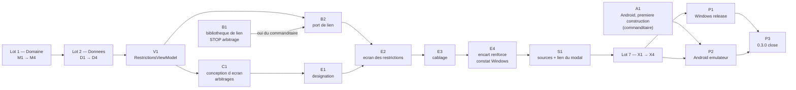

# T2 — Sécheresse et restrictions (VigiEau) : plan d'implémentation

> **For agentic workers:** REQUIRED SUB-SKILL: Use superpowers:subagent-driven-development (recommended) or superpowers:executing-plans to implement this plan task-by-task. Steps use checkbox (`- [ ]`) syntax for tracking.

**Goal:** l'usager désigne un point sur la carte et lit, **sous l'encart renforcé de `BR-013`**, ce que le préfet a arrêté à cet endroit : toutes les zones d'alerte du point (eaux superficielles d'abord), leur niveau de gravité daté sur l'échelle complète, les usages restreints **cités** pour le profil **qu'il a choisi**, et l'arrêté qui fait foi, dont l'adresse reste lisible. L'écran « D'où vient cette donnée ? » existe et le modal y renvoie. Version `0.3.0`, porte franchie sur **Windows et Android** (arbitrage Q10-B).

**Architecture:** feature-first + MVVM (`ADR-014`), inchangée : `lib/domain/restrictions/` (contrat `RestrictionSource` et objets-valeur, Dart pur), `lib/data/restrictions/` (seul module qui connaît VigiEau, `ADR-004` amendé), `lib/features/restrictions/{view,view_model}/`, `main.dart` seule racine de composition. `CachePolicy` reste l'unique décorateur de cache. Aucune bibliothèque d'état.

**Tech Stack:** Flutter 3.47.4 / Dart 3.13.3 · `flutter_map` 8.3.2 · `package:http` · `shared_preferences` · **une bibliothèque d'ouverture de lien, à vérifier puis arbitrer (`B1`)** · cibles **Windows** et **Android** (émulateur `Pixel_7`) à la porte ; iOS configuré, jamais compilé.

**Ce plan applique, il ne rediscute pas :**

| Document | Ce qu'il fixe |
|---|---|
| [`2026-09-27-cadrage-t2-design.md`](../specs/2026-09-27-cadrage-t2-design.md) | périmètre, Gherkin `US-07/08/09` et complément `US-01`, **arbitrages Q1 à Q10** (§ 6) |
| [`2026-09-27-modele-restrictions-t2-design.md`](../specs/2026-09-27-modele-restrictions-t2-design.md) | fichiers, signatures, tests prescrits (§ 10), **AR-1 à AR-3**, points ouverts `O1`–`O12` |
| [`ADR-004`](../../adr/ADR-004-integration-vigieau.md) amendé le 2026-09-27 · [`docs/sources/vigieau.md`](../../sources/vigieau.md) · `test/fixtures/vigieau/` (16 fixtures) | faits d'API, confinement redéfini |

⚠️ **Identifiants de tâche propres à ce plan.** `D1`, `V1`, `X1`, `P1`… existent aussi dans le plan T1. Hors de ce document (`project-state.md`, messages de commit), on écrit **`T2-D1`**.

---

## Cible et périmètre

| Cible | État dans ce plan |
|---|---|
| **Windows** | construite en release, exécutable lancé hors Flutter (`P1`) |
| **Android** | **jamais construite à ce jour.** Première construction en tête de plan (`A1`, `A⏸2`), constat d'écran à la porte (`P2`). Publication (`A⏸3` signature, `A⏸5` préversion) reste ⏸ ; cibles de 48 dp (`T2-K4`) et appareil réel (`A⏸4`) **non tranchés** : « Décisions à valider » 1 et 2 |
| **iOS** | configuré, jamais compilé |

**Ce que T2 fait :** (a) désignation d'un point sur la carte, seule entrée géographique (Q1-A) · (b) zones d'alerte du point, niveau daté sur l'échelle complète, `SUP` d'abord puis `SOU`/`AEP`/inconnu nommés (Q5-B) · (c) profil choisi, jamais présélectionné, gardé pour la session (Q2-A) · (d) usages cités et attribués (`BR-014`) · (e) arrêté et arrêté-cadre ouverts hors de l'app, adresse toujours visible et copiable (Q9-A) · (f) **encart renforcé** (`BR-013`), quatrième et dernier emplacement d'avertissement · (g) cache de session 6 h, date de récupération affichée (Q7-A) · (h) écran « D'où vient cette donnée ? » réduit aux sources livrées, lien du modal rétabli (Q8-A).

**Ce que T2 ne fait pas :** aucun percentile (Q4-A) · aucune échelle 3 sur la carte (Q6-A, `MapScaleKind` inchangé) · aucune géolocalisation (Q1, `NFR-05`) · aucun repli data.gouv (Q3-B) · aucune persistance au-delà de la session (Q7-A) · aucun `/departements` · aucun `integration_test/`.

---

## Faits à vérifier avant d'écrire

### Constaté le 2026-09-27 par appel réel — ne pas re-supposer

Détail et URL : `docs/sources/vigieau.md` (`VG-01`→`VG-11`), `test/fixtures/CAPTURES.md`. Ce plan n'en recopie que ce que les tâches consomment.

| # | Fait | Fixture | Consommé par |
|---|---|---|---|
| `VG-02` | `/zones` rend **toujours un tableau** ; jusqu'à trois zones au point (`SUP`, `SOU`, `AEP`), ordre variable | `zones_ain_…_sans_profil_…`, `zones_paris_…`, `zones_corse_…`, `zones_ariege_…` | `D1`, `D2`, `M3` |
| `VG-03` | aucune zone → **`200 []`** | `zones_guyane_aucune_zone_…`, `zones_atlantique_hors_france_…` | `D2`, `D4`, `V1` |
| `VG-04` | `niveauGravite` ∈ {`vigilance`, `alerte`, `alerte_renforcee`, `crise`} ; `alerte_renforcee` **jamais vu par point** | `swagger_…`, `departements_…` | `M2`, `D2` |
| `VG-05` | `profil=collectivité` (accentué, valeur du schéma) → **zéro usage sans erreur** ; `collectivite` → le bon compte | `…_profil_collectivite_accentue_…`, `…_sans_accent_…` | `D3` (AR-1 : on n'envoie **pas** `profil`) |
| `VG-06` | un usage = `id`, `nom`, `thematique`, `description`, quatre booléens `concerne*` ; texte libre avec `\r\n`, `\n`, tirets, **espaces de fin** (`"Interdiction totale "`) | `zones_ariege_…` | `D2` |
| `VG-07` | `cheminFichier` et `cheminFichierArreteCadre` : **URL absolues** ; encodage abîmé `sign%C3%83%C2%A9` à Paris | `zones_paris_…`, `zones_ariege_…` | `M3`, `D2` |
| `VG-08` | `dateDebutValidite` **et** `dateFinValidite`, ISO 8601 UTC, toujours `T00:00:00.000Z` ; Ariège : `2026-09-21` / `2026-10-31` | toutes les `zones_*` non vides | `D2`, `E2` |
| `VG-09` | `code` **`null`** (zone `AEP` d'Ariège, nom `UDI_crise`) ; même `nom` pour trois zones à Paris | `zones_ariege_…`, `zones_paris_…` | `D2`, `E2` |
| `VG-10` | `400` hors plage, `409` par commune ; `429`/`5xx` jamais provoqués | `zones_coordonnees_invalides_400_…`, `zones_commune_45210_409_…` | `D3` |
| `VG-11` | Ain sans profil : `SOU` `vigilance` 45 usages, `SUP` et `AEP` `alerte`, 27 et 19 usages | `zones_ain_…_sans_profil_…` | `D2`, `D3` |
| site public | `https://vigieau.gouv.fr/` → `200` ; `www.vigieau.gouv.fr` **ne se résout pas** (11:45 UTC) | — (page HTML) | `M4`, `E4` |

### Ouvert — chaque ligne a sa tâche d'instruction, ou reste écrite comme telle

| # | Question | Instruction | Si sans réponse |
|---|---|---|---|
| `A⏸2` | L'app **se construit-elle** sur Android, et s'affiche-t-elle ? Jamais fait | `A1` (commanditaire) | la porte de T2 ne se franchit pas (Q10-B) |
| `B-01` | Bibliothèque d'ouverture de lien : version, date, licence compatible GPL-3.0, **Windows et Android**, exigences de manifeste Android | `B1`, puis **arbitrage** | ✅ **Relevé le 2026-09-27** (pub.dev, API `packages/url_launcher` et `/score`) : `url_launcher` **6.3.2**, publiée le 2025-07-10, éditeur `flutter.dev`, licence `bsd-3-clause` (étiquette lue), plateformes lues `android`, `ios`, `linux`, `macos`, `web`, `windows` ; contraintes `sdk ^3.6.0`, `flutter >=3.27.0`, satisfaites par Dart 3.13.3 et Flutter 3.47.4 ; Android 11+ : un élément `<queries>` au manifeste pour l'intention `VIEW` (d'après la page du paquet). **Arbitré par le commanditaire le 2026-09-27 : oui**, `url_launcher ^6.3.2`, ajouté en `B2` |
| `O1` | Deux zones du même type au même point | aucune : le modèle porte des **listes** (`M3`) | « Non vérifié » de `P3` |
| `O2`, `O3` | `409` par `lat`/`lon` ; `429`/`5xx`, fenêtre de `X-RateLimit-Reset` | aucune : rejeu hérité (`D1`), branches d'échec (`D3`) | « Non vérifié » |
| `O4` | `alerte_renforcee` rendu par `/zones` | `D2` étape 0 : **au plus trois** appels dans un département que `departements_2026-09-27.json` donne à `alerte_renforcee` ; fixture datée si trouvée, **jamais fabriquée** | couvert par une **valeur** dans le test du mapper |
| `O5` | Heure non nulle sur une date de validité | `D2` : cas de test (la date UTC est gardée) | — |
| `O6` | `cheminFichierArreteCadre` servi en `200 application/pdf` ? | `D2` étape 0 : **un** `HEAD` sur l'URL d'Ariège, consigné dans `vigieau.md` | « Non vérifié » ; l'écran n'affirme jamais qu'un document existe |
| `O7` | Arrêté expiré encore rendu ? | aucune : on affiche les deux dates, on ne filtre rien | « Non vérifié » |
| `O9` | Libellés des types de zone et des profils (« Exploitant » dans `04-ui.md`, « exploitation » dans `UC-002`) | `C1`, arbitrage du commanditaire | `E2` ne démarre pas |
| `O10` | Forme exacte du port d'ouverture de lien | `B2`, après `B1` | — |
| `O11` | Outre-mer autres que la Guyane, par point | aucune | « Non vérifié » |

`O8` et `O12` sont **clos** (conception § 9). Toute réponse obtenue est **datée**, consignée dans `docs/sources/vigieau.md`, la capture déposée en fixture et citée dans `CAPTURES.md`.

---

## Qui lance quoi

| Commande | Lancée par |
|---|---|
| `flutter analyze`, `flutter test`, `dart format`, `flutter pub get`, `curl` | **Claude**, dans le bac à sable |
| `flutter pub add` | **Claude**, et **seulement après arbitrage** du commanditaire (`B1`) |
| `flutter emulators --launch Pixel_7`, `flutter run -d emulator-5554`, `flutter run -d windows`, `flutter build windows --release`, lancement de l'exécutable, tout constat à l'écran | **le commanditaire** |

Toute commande du commanditaire est donnée **seule dans son bloc `bash`**, avec le **résultat attendu énoncé**, puis **constatée et recopiée**. Jamais supposée.

## Critère de fin, identique pour chaque tâche — dit ici une seule fois

```bash
flutter analyze
flutter test
dart format --set-exit-if-changed lib test
```

Attendu : `No issues found!` · tous les tests passent · code de sortie **0**. Recopier le **nombre total de tests** (repère de départ : **1 188**, `v0.2.0`) : il ne fait que croître, sauf suppression justifiée dans le message de commit. **Un commit par tâche**, par **liste de chemins explicite** (`git add -- <chemins>` puis `git commit -- <chemins>`). Un fichier régénéré hors de la liste (par exemple sous `windows/flutter/` après `pub get`) se signale, il ne se committe pas.

⚠️ **Brief de tout sous-agent, en tête :** interdiction de `git stash`, `git checkout`, `git restore`, `git reset`, `git clean` et de tout `git add -A` ; ne rien pousser, ne rien fusionner, aucun tag. Au retour, la boucle principale relit `git status` et relance elle-même le critère de fin : un rapport d'agent n'est pas une preuve.

**Niveau d'agent** (indiqué par tâche) : **mécanique** = `general-purpose` sonnet, signatures et cas dictés ; **raisonnement** = opus, conception, arbitrage ou refonte à comportement verrouillé. Toute tâche est **relue par un second agent** avant commit.

---

## Structure de fichiers

```
lib/domain/
  geo/geo_point.dart                     GeoPoint, point désigné (M1)
  restrictions/drought_severity.dart     DroughtSeverity + scale + label (M2)
  restrictions/zone_kind.dart            ZoneKind (M2) ; zoneKindLabel (E2, libellés de C1)
  restrictions/user_profile.dart         UserProfile (M2) ; userProfileLabel (E2)
  restrictions/alert_zone.dart           AlertZone, RestrictionDecree, DocumentLink, RestrictedUsage (M3)
  restrictions/zones_at_point.dart       ZonesAtPoint + partition (M3)
  restrictions/restriction_source.dart   RestrictionSource + RestrictionLookupFailure (M4)
  sources/source_names.dart              + restrictionsSourceName, restrictionsPublicSiteUrl (M4), ignSourceName (S1)
  links/external_link_opener.dart        port d'ouverture de lien (B2)
  warnings/warning_texts.dart            + libelle du lien vers les sources (S1, hors verrou)
lib/data/
  http/json_http_client.dart             transport a rejeu extrait (D1)
  http/hub_eau_client.dart               delegue au transport, contrat inchange (D1)
  restrictions/vigieau_uris.dart  restrictions/zones_mapper.dart           (D2)
  restrictions/vigieau_restriction_source.dart                             (D3)
  restrictions/cached_restriction_source.dart   TTL 6 h                    (D4)
  restrictions/restriction_source.dart   SUPPRIME (M4)
  links/<bibliotheque>_external_link_opener.dart                           (B2)
lib/features/
  restrictions/view_model/restrictions_view_model.dart                     (V1, B2)
  restrictions/view/restrictions_panel.dart  restrictions/view/drought_severity_badge.dart  (E2)
  restrictions/view/reinforced_warning_card.dart   encart renforce, reste dans sa tranche (E4)
  map/view/map_view.dart                 + onPointDesignated, + emplacement du panneau (E1, E3)
  shared/data_sources_view.dart          « D'ou vient cette donnee ? » (S1, decision 4)
  shared/warning_link.dart               + lien vers les sources dans WarningWindow (S1)
  warnings/view/initial_warning_view.dart  + lien « Relire le detail des sources » (S1)
lib/main.dart                            cable source cachee → ViewModel → panneau (E3)

test/  un test par fichier de code, plus :
  data/restrictions/profile_filter_equivalence_test.dart   AR-1, obligatoire (D3)
  data/restrictions/restriction_source_test.dart           confinement redefini (M2, M4)
  features/restrictions/zones_samples.dart                 zones de test recopiees des fixtures (E2)

docs/  specs/<date>-ecran-restrictions-t2-design.md (C1) · 04-ui.md § 1 (C1)
       acceptance/restrictions.feature (X1) · tracabilite.md (X2) · UC-002, BR-011, glossary,
       03-conception, context-map, project-state, CLAUDE.md (X3) · CHANGELOG.md 0.3.0 (X4, P3)
```

**Conventions :** identifiants en anglais, nomenclatures et textes en français, mot pour mot comme `glossary.md` ; aucun mot proscrit (`BR-003`, `BR-007`, `BR-014`), vouvoiement. ⚠️ **Aucun identifiant ni commentaire hors du module ne contient « vigieau »** (casse indifférente) : le confinement lit le fichier **entier** (`M2`). D'où `restrictionsSourceName`, et non `vigieauSourceName`.

---

## Lot 0 — Préalables qui ne dépendent d'aucun code

### Task A1 : Première construction Android — `A⏸2` (commanditaire)

**Agent :** aucun pour l'épreuve ; consignation **mécanique**.
**Files:** modifié `docs/project-state.md`

> **En tête parce que Q10-B en fait un prérequis de la porte** et qu'une construction jamais faite peut échouer pour des raisons sans rapport avec T2. La découvrir à la porte bloquerait tout. `B2` ajoutera du code natif : `P2` reconstruira.

- [ ] **Étape 1 — Claude** : critère de fin sur le sommet de la branche, recopier le nombre de tests.
- [ ] **Étape 2 — commanditaire**, un bloc à la fois :

```bash
flutter emulators --launch Pixel_7
```
Attendu : l'émulateur démarre.

```bash
flutter run -d emulator-5554
```
Attendu, **inconnu d'avance** : la construction Gradle aboutit (premier passage : téléchargements), puis **quatre constats à l'écran** — (1) le modal du premier lancement, bouton inactif tant que la case est décochée ; (2) après acquittement, la carte IGN et son attribution ; (3) « ⚠ Avertissement » ouvre sa fenêtre ; (4) une station sélectionnée au doigt ouvre sa fiche.
- [ ] **Étape 3** — en cas d'échec : recopier **verbatim** les 30 dernières lignes. Aucun correctif dans cette tâche : le diagnostic est une tâche à part ; trois échecs sur le même point → arrêt et question.
- [ ] **Étape 4** — consigner dans `project-state.md` (`A⏸2` ✅ ou ❌, avec la sortie), puis commit.

```bash
git add -- docs/project-state.md && git commit -m "docs: consigner la premiere construction Android (A1 de T2)" -m "<recopier : duree, derniere ligne de la construction, les quatre constats un par un, ou l erreur verbatim>. Q10-B en fait un prealable de la porte de T2." -- docs/project-state.md
```

### Task B1 : Vérifier la bibliothèque d'ouverture de lien — puis **s'arrêter** (Q9)

**Agent :** **mécanique** pour le relevé ; la question au commanditaire est formulée par la boucle principale.
**Files:** modifiés ce plan (§ « Faits », ligne `B-01`), `docs/project-state.md`

> **Candidat : `url_launcher`** — nom seulement, **aucun fait relevé à ce jour**. Q9-A est arbitrée (« une bibliothèque, vérifiée avant ajout ») ; le **paquet précis**, lui, est un ajout de bibliothèque, donc un arbitrage (`CLAUDE.md`).

- [x] **Étape 1 — relever**, et recopier ce qui est **lu**, pas ce qui est attendu :

```bash
curl -s "https://pub.dev/api/packages/url_launcher" | head -c 800
curl -s "https://pub.dev/api/packages/url_launcher/score"
```
Attendu : **inconnu**. Relever la dernière version et sa date de publication ; licence et plateformes depuis la réponse `/score` (étiquettes `license:…`, `platform:…`) si elle répond, sinon depuis la page `https://pub.dev/packages/url_launcher`. Contraintes `sdk`/`flutter` satisfaites par le poste (Dart 3.13.3, Flutter 3.47.4) ?
- [x] **Étape 2** — critères : licence **compatible GPL-3.0** ; **Windows et Android** couverts ; publication récente ; ouverture **hors de l'application** possible (US-08 « le PDF s'ouvre hors de l'application ») ; exigences de manifeste Android (déclaration de requêtes d'intention) **lues dans la documentation du paquet**, recopiées, non appliquées.
- [x] **Étape 3 — STOP. Question fermée au commanditaire**, avec les chiffres relevés : « Ajouter `url_launcher ^<version>` (<licence>, Windows et Android, publiée le <date>) ? **Recommandation : oui.** Alternative : Q9-B seule — adresse affichée et copiable, action de l'encart = copier l'adresse. » **Aucun `flutter pub add` avant un oui.**
- [x] **Étape 4** — consigner la réponse (ligne `B-01`), commit.

```bash
git add -- docs/superpowers/plans/2026-09-27-t2-secheresse-et-restrictions.md docs/project-state.md && git commit -m "docs: relever la bibliotheque d ouverture de lien sur pub.dev et son arbitrage (B1 de T2)" -m "<version, date, licence, plateformes relevees ; reponse du commanditaire>." -- docs/superpowers/plans/2026-09-27-t2-secheresse-et-restrictions.md docs/project-state.md
```

---

## Lot 1 — Domaine

> `docs/domain-model.md` et `typesDuDomaine` (`test/project/domain_model_doc_test.dart`) s'allongent **dans le commit qui écrit chaque type** : ce test l'exige. `ZoneRestriction` reste dans `typesHorsPerimetre` ; aucun nom retenu ne le contient.

### Task M1 : `GeoPoint`, le point désigné

**Agent :** mécanique.
**Files:** créés `lib/domain/geo/geo_point.dart`, `test/domain/geo/geo_point_test.dart` · modifiés `docs/domain-model.md`, `test/project/domain_model_doc_test.dart`

**Signature** — `final class GeoPoint { factory GeoPoint({required double latitude, required double longitude}); final double latitude; final double longitude; }` avec `==`, `hashCode`, `toString`.

**Invariants :** validation à la construction (le `400` devient impossible, conception § 2.2) ; **aucun arrondi** ; le fichier ne contient pas le mot « restriction » (le confinement actuel le verrait, `M2` le redéfinit).

**Cas de test**
- `GeoPoint(latitude: 46.2051, longitude: 5.2256)` accepté ; bornes incluses : `±90`, `±180` acceptées.
- `latitude: 90.0000001`, `longitude: -180.0000001` → `ArgumentError` ; `double.nan`, `double.infinity` sur chacun → `ArgumentError`.
- `latitude: 46.20512345678` rendu **à l'identique** (aucun arrondi).
- Égalité et `hashCode` structurels ; `latitude` et `longitude` non interchangeables (`GeoPoint(latitude: 1, longitude: 2) != GeoPoint(latitude: 2, longitude: 1)`).

- [x] **Étape 1** — test rouge, puis `flutter test test/domain/geo` → échec.
- [x] **Étape 2** — implémenter ; `domain-model.md` (objets-valeur) et `typesDuDomaine` + `'GeoPoint'`.
- [x] **Étape 3** — critère de fin, commit.

```bash
git commit -m "feat(domain): GeoPoint, le point designe sur la carte" -m "Seule entree geographique de T2 (Q1-A). Une paire de doubles nus ouvrirait la porte a une inversion latitude/longitude ; la validation a la construction rend le 400 de VigiEau impossible. Aucun arrondi : le point interroge est celui que l usager a designe."
```

### Task M2 : Les trois nomenclatures, et le confinement redéfini (AR-1)

**Agent :** **raisonnement** (le confinement est le verrou d'`ADR-004`).
**Files:** créés `lib/domain/restrictions/{drought_severity,zone_kind,user_profile}.dart` et tests miroirs · modifiés `test/data/restrictions/restriction_source_test.dart` (groupe « Confinement »), `docs/domain-model.md`, `test/project/domain_model_doc_test.dart`

> ⚠️ **Ce commit casse le confinement actuel** (`vigieau|beta\.gouv|restriction` hors de `lib/data/restrictions/`) : le mot « restriction » entre dans le domaine. Le test évolue **ici**, selon l'amendement d'`ADR-004` (point 4, arbitré AR-1).

**Signatures** — conception § 2.1, recopiées sans écart :
- `sealed class DroughtSeverity` ; `Vigilance`, `Alerte`, `AlerteRenforcee`, `Crise` ; `GraviteInconnue(String? rawValue)` · `const List<DroughtSeverity> droughtSeverityScale` · `String droughtSeverityLabel(DroughtSeverity)`
- `sealed class ZoneKind` ; `EauxSuperficielles`, `EauxSouterraines`, `EauPotable` ; `TypeZoneInconnu(String? rawValue)` — **sans** `zoneKindLabel` (libellés de `C1`, ajoutés par `E2`)
- `enum UserProfile { particulier, exploitation, collectivite, entreprise }` — ordre d'`UC-002` étape 4
- Égalité **par type** pour les branches connues (`Vigilance() == const Vigilance()`, instance non constante comprise), par `rawValue` pour les branches inconnues : la vue repère la position sur l'échelle **par égalité** (conception § 2.7).

**Confinement redéfini** — une fonction pure dans le fichier de test, `List<String> confinementViolations(Map<String, String> contentByPath)`, testée sur des contenus synthétiques **puis** appliquée à `lib/` réel (même méthode que `layers_test.dart`). Le fichier est lu **en entier**, commentaires compris :

| Règle | Motif interdit | Admis dans |
|---|---|---|
| nom de la source | `vigieau`, casse indifférente | `lib/data/restrictions/`, `lib/domain/sources/source_names.dart`, `lib/main.dart` |
| vocabulaire technique de l'API | `beta\.gouv`, `niveauGravite`, `cheminFichier`, `dateDebutValidite`, `dateFinValidite`, `concerne(Particulier\|Exploitation\|Collectivite\|Entreprise)`, `alerte_renforcee` | `lib/data/restrictions/`, `lib/main.dart` |
| « restriction » | **libéré** | partout |

Le test « aucun `package:http/` sous `lib/data/restrictions/` » garde son sens, motif réécrit : le HTTP passe par le transport partagé (`D1`). ⚠️ Son `Directory('lib/data/restrictions').listSync()` est **protégé par `existsSync()`** (dossier absent → aucune violation) : `M4` supprime le dernier fichier du dossier, que `D2` ne recrée qu'ensuite, et la suite doit rester verte entre les deux commits. Les deux tests sur `SurfaceWaterRestriction` restent jusqu'à `M4`.

**Cas de test**
- Libellés exacts, `04-ui.md § 2` échelle 3 : « Vigilance », « Alerte », « Alerte renforcée », « Crise », `GraviteInconnue` → **« Non renseigné »**.
- `droughtSeverityScale` = les quatre niveaux dans cet ordre, **sans** branche inconnue ; `droughtSeverityScale.contains(GraviteInconnue('x'))` → faux.
- `GraviteInconnue('extreme') == GraviteInconnue('extreme')` ; `GraviteInconnue(null)` construit sans lever ; idem `TypeZoneInconnu`.
- Une fonction de test à `switch` **sans `default`** sur chaque `sealed` compile : une branche ajoutée sans cas casse la compilation (`BR-011`).
- `UserProfile.values` dans l'ordre d'`UC-002`.
- **Aucun rang de sévérité** exposé : l'API publique des trois fichiers ne contient ni `compareTo`, ni `rank`, ni `index` de sévérité (conception § 2.7, YAGNI).
- Confinement, synthétique : `lib/features/x/view/y.dart` contenant `'VigiEau'` → violation ; `lib/domain/sources/source_names.dart` contenant `https://vigieau.gouv.fr/` → aucune ; `lib/domain/restrictions/z.dart` contenant « restriction » → aucune ; `lib/features/…` contenant `niveauGravite` → violation ; `lib/main.dart` contenant `VigieauRestrictionSource` → aucune ; `lib/data/http/json_http_client.dart` contenant « vigieau » en **commentaire** → violation.
- Confinement, réel : `lib/` → aucune violation.

- [x] **Étape 1** — tests rouges ; `flutter test test/domain/restrictions test/data/restrictions` → échec.
- [x] **Étape 2** — implémenter les nomenclatures, réécrire le groupe de confinement, `domain-model.md` (nomenclatures closes) et `typesDuDomaine`.
- [x] **Étape 3 — contre-épreuve** : `'niveauGravite'` ajouté dans un fichier temporaire de `lib/features/` → rouge ; retiré → vert. **Recopier le rouge** dans le message de commit.
- [x] **Étape 4** — critère de fin, commit.

```bash
git commit -m "feat(restrictions): nomenclatures de gravite, de type de zone et de profil ; confinement redefini" -m "Quatre niveaux plus GraviteInconnue et trois types plus TypeZoneInconnu, valeur brute gardee (BR-011) ; pas Inconnu, deja pris par flow_category. UserProfile est un enum : il est choisi, jamais recu. Aucun rang de severite (YAGNI). Confinement d ADR-004 redefini (AR-1) : le mot restriction est libere, le nom de la source et le vocabulaire filaire restent au module, source_names et main.dart exemptes. Contre-epreuve : <recopier le rouge>."
```

### Task M3 : La zone d'alerte, l'arrêté, l'usage, et la réponse au point

**Agent :** mécanique.
**Files:** créés `lib/domain/restrictions/{alert_zone,zones_at_point}.dart` et tests miroirs · modifiés `docs/domain-model.md`, `test/project/domain_model_doc_test.dart`

**Signatures** — conception § 2.1 ; constructeurs nommés, tous `required` sauf les optionnels du modèle :
- `DocumentLink(String raw)` · `Uri? get openableUri`
- `RestrictionDecree({required DateTime validFrom, DateTime? validUntil, DocumentLink? document, DocumentLink? frameworkDocument})`
- `RestrictedUsage({required String name, required String theme, required String description, required Set<UserProfile> concernedProfiles})` · `bool concerns(UserProfile)`
- `AlertZone({required String name, required ZoneKind kind, required DroughtSeverity severity, required RestrictionDecree decree, required List<RestrictedUsage> usages})` · `List<RestrictedUsage> usagesFor(UserProfile)`
- `ZonesAtPoint({required GeoPoint point, required DateTime retrievedAt, required List<AlertZone> zones})` · `surfaceWaterZones`, `otherZones`

**Invariants :** collections copiées et **non modifiables** ; égalité structurelle (helper d'égalité de listes écrit dans le domaine : `package:flutter/foundation.dart` y est interdit) ; `validFrom`, `validUntil`, `retrievedAt` **en UTC**, un `DateTime` local → `ArgumentError` ; **partition sans perte** (conception § 5).

**Cas de test**
- `openableUri` : URL `https://regleau.s3.gra.perf.cloud.ovh.net/…pdf` → non nul ; `http://…` → non nul ; `arrete.pdf` (relatif), `ftp://h/a.pdf`, `javascript:alert(1)`, `''` → `null`.
- Lien de Paris (recopié de `zones_paris_vigilance_2026-09-27.json`) : `raw` **inchangé** ; `openableUri!.toString()` contient toujours `%C3%83%C2%A9` — rien n'est décodé ni « réparé ».
- `RestrictedUsage(concernedProfiles: {particulier, entreprise})` : `concerns(particulier)` vrai, `concerns(exploitation)` faux ; `concernedProfiles.add(…)` → `UnsupportedError`.
- `usagesFor` rend l'**ordre de la source**, sans tri ni dédoublonnage (deux usages de même nom gardés) ; liste vide valide.
- Partition : source `[SOU, SUP, AEP]` → `surfaceWaterZones == [SUP]`, `otherZones == [SOU, AEP]` ; source `[AEP, SUP]` (ordre d'Ariège) → `otherZones == [AEP]` ; source `[AEP, TypeZoneInconnu('X'), SOU, SUP₁, SUP₂]` → `[SUP₁, SUP₂]` et `[SOU, AEP, X]` ; deux `SOU` gardent l'ordre source ; `[SOU crise, AEP vigilance]` → `[SOU, AEP]` (**aucun tri par sévérité**).
- **Sans perte** : pour les 120 permutations d'une liste de cinq zones de types mêlés, `surfaceWaterZones.length + otherZones.length == zones.length` et chaque zone apparaît exactement une fois.
- `zones` vide → deux listes vides ; `retrievedAt` local → `ArgumentError`.

- [x] **Étape 1** — tests rouges ; **Étape 2** — implémentation, `domain-model.md` (+ diagramme `classDiagram` de la conception § 2) ; **Étape 3** — critère de fin, commit.

```bash
git commit -m "feat(restrictions): zone d alerte, arrete, usage cite et reponse datee au point" -m "Toutes les zones du point sont gardees (Q5-B) : le domaine les partage en eaux superficielles d abord, puis les autres dans un ordre fixe par type, sans jamais en perdre une — verifie sur toutes les permutations. Aucun tri par severite. Le lien d arrete est garde tel que recu, encodage abime compris : on l affiche, on ne le repare pas. retrievedAt voyage avec la reponse, cache ou non."
```

### Task M4 : Le contrat `RestrictionSource` passe au domaine ; nom et site de la source

**Agent :** mécanique.
**Files:** créés `lib/domain/restrictions/restriction_source.dart`, `test/domain/restrictions/restriction_source_test.dart` · **supprimé** `lib/data/restrictions/restriction_source.dart` · modifiés `test/data/restrictions/restriction_source_test.dart` (ne garde que le confinement), `lib/domain/sources/source_names.dart`, `test/domain/sources/source_names_test.dart`, `docs/domain-model.md`, `test/project/domain_model_doc_test.dart`, `docs/project-state.md` (point 35 : **clos par `T2-M4`**)

**Signatures**
- `abstract interface class RestrictionSource { Future<ZonesAtPoint> zonesAt(GeoPoint point); }` — lève `RestrictionLookupFailure`, jamais ne le rend
- `sealed class RestrictionLookupFailure implements Exception { const RestrictionLookupFailure(this.diagnostic); final String diagnostic; }` · `SourceInjoignable(String diagnostic)` · `RequeteRefusee({required int statusCode, required String diagnostic})` · `ReponseIllisible(String diagnostic)`
- dans `source_names.dart` : `const String restrictionsSourceName = 'VigiEau';` · `const String restrictionsPublicSiteUrl = 'https://vigieau.gouv.fr/';`

**Cas de test**
- Un double de test implémente l'interface : il reçoit le `GeoPoint` passé, rend un `ZonesAtPoint`, lève chacune des trois branches ; un `switch` exhaustif sur l'échec compile et rend `diagnostic`.
- `RequeteRefusee(statusCode: 409, …).statusCode == 409`.
- `restrictionsPublicSiteUrl` vaut exactement `https://vigieau.gouv.fr/`, sans `www.` ; `restrictionsSourceName == 'VigiEau'`.
- `grep -rn "SurfaceWaterRestriction\|surfaceWaterZonesAt" lib test` → **vide**.
- Confinement (`M2`) vert avec les deux constantes.

- [x] **Étape 1** — tests rouges ; **Étape 2** — implémenter, supprimer l'ancienne couture (aucun appelant) et ses deux tests ; **Étape 3** — critère de fin, commit.

```bash
git commit -m "feat(restrictions): RestrictionSource declaree dans le domaine, echec ferme a trois branches" -m "Un ViewModel ne pouvait pas importer le contrat depuis data (features-vers-data) : point 35 clos. Source injoignable, requete refusee, reponse illisible ; aucune zone n est pas un echec mais une reponse vide. L echec est leve, jamais rendu : withCachePolicy ne l ecrit donc jamais en cache. Le nom affiche et l adresse du site public vivent dans source_names : ils doivent rester disponibles quand la source ne repond pas. L ancienne couture filtrait SUP seul (remplace par Q5-B) et n avait aucun appelant."
```

---

## Lot 2 — Données

### Task D1 : Extraire le transport à rejeu de `HubEauClient`

**Agent :** **raisonnement** (refonte à comportement verrouillé).
**Files:** créés `lib/data/http/json_http_client.dart`, `test/data/http/json_http_client_test.dart` · modifié `lib/data/http/hub_eau_client.dart` (délègue, en-tête mis à jour) · **`test/data/http/hub_eau_client_test.dart` non modifié : c'est la preuve**

**Signatures**
- `sealed class JsonHttpFailure implements Exception { String get message; }` — `message` **identique** aux textes actuels de `HubEauFailure` (`statut <n> : <corps>`, `panne réseau : …`, `client HTTP déjà fermé, non rejouable : …`, `corps illisible (statut <n>) : …`)
- `JsonHttpStatusFailure({required int statusCode, required String body})` · `JsonHttpNetworkFailure(String message)` · `JsonHttpUnreadableBody({required int statusCode, required String detail})`
- `final class JsonHttpClient { JsonHttpClient({required http.Client httpClient, Future<void> Function(Duration) sleep = …, double Function()? jitter, int maxAttempts = 4}); Future<Object?> getJson(Uri uri); void close(); }`
- `HubEauClient` : **constructeur et `getJson` inchangés** ; il enveloppe `HubEauFailure(failure.message)` et garde le refus d'un non-objet (« un objet est attendu »).

**Invariants :** **une seule boucle de rejeu** dans le produit ; `isSuccess`/`isRetryable` restent les seuls juges du statut ; UTF-8 explicite ; aucun commentaire ni identifiant de `lib/data/http/` ne contient « restriction » ni « vigieau », casse indifférente — `D1` peut précéder `M2`, et l'ancien confinement interdit encore ces deux mots hors de `lib/data/restrictions/`.

**Cas de test** (`JsonHttpClient`, `MockClient`)
- Racine tableau → `List` rendue telle quelle ; racine objet → `Map` ; `200` et `206` sont des succès, `204` n'en est pas un.
- `429` puis `200` → succès, **un** `sleep` ; `503` × 4 → `JsonHttpStatusFailure(503)` après **trois** `sleep` ; `400` → `JsonHttpStatusFailure(400)`, **zéro** `sleep`.
- `ClientException` rejouée puis `JsonHttpNetworkFailure` ; message « already closed » → échec immédiat ; `HandshakeException` rejouée.
- `200` non JSON → rejoué, puis `JsonHttpUnreadableBody(statusCode: 200)`.
- `Pré-validée` sans `charset` → décodé correctement ; en-tête `Accept: application/json` envoyé ; gigue injectée transmise à `delayForAttempt` (durées de `sleep` relevées).
- `hub_eau_client_test.dart` **vert sans modification** ; `grep -c "for (int attempt" lib/data/http/*.dart` → **1**, dans `json_http_client.dart`.

- [ ] **Étape 1** — tests rouges ; **Étape 2** — extraire, faire déléguer ; **Étape 3** — `flutter test test/data/http` vert, sans toucher au test de `HubEauClient` ; critère de fin, commit.

```bash
git commit -m "refactor(data): extraire le transport JSON a rejeu, partage par Hub Eau et les restrictions" -m "HubEauClient refusait un tableau JSON ; /zones rend toujours un tableau. Recopier la boucle de rejeu, le produit l interdit. Le transport rend un Object? et des echecs types (statut, reseau, corps illisible) : c est ce qui permettra de distinguer une requete refusee d une source injoignable sans analyser un message. Les tests de HubEauClient passent sans une ligne changee."
```

### Task D2 : URI et mapper VigiEau — le seul point de conversion

**Agent :** **raisonnement** (tout ou rien, AR-2).
**Files:** créés `lib/data/restrictions/{vigieau_uris,zones_mapper}.dart` et tests miroirs · modifiés `docs/sources/vigieau.md`, `test/fixtures/CAPTURES.md` (étape 0 seulement)

**Signatures**
- `({String lat, String lon}) formatPointParameters(GeoPoint point)` — **7 décimales**, jamais d'exposant ; sert aussi de **clé de cache** (`D4`)
- `Uri zonesUri(GeoPoint point)` — `https://api.vigieau.beta.gouv.fr/api/zones?lat=…&lon=…`, construite **avec** `formatPointParameters`
- `ZonesAtPoint mapZones(Object? json, {required GeoPoint point, required DateTime retrievedAt})` — lève `ReponseIllisible`

**Transformations admises, et seulement celles-ci** (conception § 4.4) : chaîne → nomenclature (`trim` + minuscules pour la gravité, `trim` + majuscules pour le type, valeur brute gardée) · quatre booléens → `Set<UserProfile>` · ISO 8601 → `DateTime` UTC · lien vide → `null` · `\r\n` → `\n` dans `nom`, `thematique`, `description`. **Aucun `trim` des textes.**

**Cas de test — URI**
- Hôte, chemin exacts ; paramètres **exactement** `{lat, lon}` : ni `profil`, ni `commune`.
- `longitude: 1e-7` → `'0.0000001'` ; `latitude: 46.2` → `'46.2000000'` ; `-1e-7` → `'-0.0000001'` ; `-1e-9` → `'0.0000000'` (jamais `'-0.0000000'` : deux clés pour un même point).

**Cas de test — mapper, sur les fixtures réelles**
- Les **neuf** fixtures `200` non vides se lisent sans lever ; `frameworkDocument` non nul sur chacune.
- Ain sans profil : trois zones dans l'ordre source `SOU`, `SUP`, `AEP` ; `SOU` → `Vigilance`, 45 usages ; `SUP` et `AEP` → `Alerte`, 27 et 19 usages ; `SOU` : `validFrom` `2026-08-20` UTC, `validUntil` `2026-10-31` UTC.
- Ariège : `AEP` (`code: null`, sans effet) puis `SUP`, toutes deux `Crise`, `validFrom` `2026-09-21` ; la description « Interdiction totale sauf impératif sanitaire\r\n + Affichage… » devient `…sanitaire\n + Affichage…` et **rien d'autre** ; « Interdiction totale » garde son **espace de fin** ; un nom à espace de fin (« …(publiques et privées) ») est gardé tel quel.
- Paris : trois zones `Vigilance`, même `name` ; `document.raw` contient `sign%C3%83%C2%A9`, inchangé.
- `…_collectivite_accentue_…` : `usages` vides sur les trois zones, **valide**.
- Guyane, Atlantique : `zones` vides, `point` et `retrievedAt` conservés.

**Cas de test — mapper, variantes dérivées d'une zone réelle** (Ariège, un seul champ modifié par cas, **dans une seule zone**)
- `niveauGravite` `'extreme'` → `GraviteInconnue('extreme')` ; `null` → `GraviteInconnue(null)` ; `' CRISE '` → `Crise` ; `'alerte_renforcee'` → `AlerteRenforcee` (`O4` : couvert par une **valeur**).
- `type` `'xyz'` → `TypeZoneInconnu('xyz')`, **en fin** d'`otherZones` ; `'sup'` → `EauxSuperficielles`.
- Champ supplémentaire ignoré ; `cheminFichier` `''` ou `null` → `document == null` ; `dateFinValidite` `null` → `validUntil == null` ; `dateDebutValidite` `2026-09-21T13:30:00.000Z` → date UTC gardée (`O5`).
- **Tout ou rien (AR-2)** → `ReponseIllisible` pour **toute** la réponse : racine objet ; élément non objet ; zone sans `nom` ; sans `arrete` ; `dateDebutValidite` absente ou `'pas une date'` ; `usages` absent ; usage sans `nom`, `thematique` ou `description` ; chacun des quatre `concerne*` absent ; `concerneParticulier: "true"` (chaîne).

- [ ] **Étape 0 — faits ouverts, politesse de capture (≤ 1 requête/s)** : (a) `O6` — **un** `curl -sI` sur le `cheminFichierArreteCadre` d'Ariège, statut et `Content-Type` recopiés dans `vigieau.md` ; (b) `O4` — **au plus trois** appels `/zones` en des points de départements que `departements_2026-09-27.json` donne à `alerte_renforcee` ; si l'un rend ce niveau, fixture `zones_<lieu>_alerte_renforcee_<date>.json` + ligne `CAPTURES.md` + cas de test ; sinon, écrire « non trouvé » avec les trois URL. **Jamais de fixture fabriquée.**
- [ ] **Étape 1** — tests rouges ; **Étape 2** — implémenter ; **Étape 3** — confinement (`M2`) vert : tout le vocabulaire filaire est sous `lib/data/restrictions/` ; critère de fin, commit.

```bash
git commit -m "feat(restrictions): URI et mapper VigiEau, seul point de conversion" -m "Un appel par point, lat et lon seulement, sept decimales sans exposant : la meme chaine sert de cle de cache. Tolerance de nomenclature pour la gravite et le type, valeur brute gardee (BR-011) ; tout champ obligatoire manquant, dans une seule zone, rend toute la reponse illisible (AR-2). Les textes du prefet ne perdent que leurs retours chariot : ni trim ni retouche (BR-014). O4 et O6 : <recopier ce qui a ete constate>."
```

### Task D3 : `VigieauRestrictionSource`, et l'équivalence du filtrage par profil (AR-1)

**Agent :** mécanique.
**Files:** créés `lib/data/restrictions/vigieau_restriction_source.dart`, `test/data/restrictions/vigieau_restriction_source_test.dart`, `test/data/restrictions/profile_filter_equivalence_test.dart`

**Signature** — `final class VigieauRestrictionSource implements RestrictionSource { VigieauRestrictionSource({required JsonHttpClient client, DateTime Function()? now}); }` — `retrievedAt = now().toUtc()` à la réponse.

**Correspondance des échecs :** `JsonHttpStatusFailure` avec `isRetryable(statusCode)` (rejeux épuisés) → `SourceInjoignable` ; autre statut → `RequeteRefusee(statusCode)` ; `JsonHttpNetworkFailure` → `SourceInjoignable` ; `JsonHttpUnreadableBody` et toute `ReponseIllisible` du mapper → `ReponseIllisible`. `diagnostic` porte le message d'origine.

**Cas de test — source** (`MockClient` servant les corps des fixtures)
- Ain → trois zones, `retrievedAt` = horloge injectée ; l'URI reçue n'a que `lat` et `lon`.
- corps de `zones_coordonnees_invalides_400_…` en `400` → `RequeteRefusee(400)`, **aucun** `sleep` ; `409` → `RequeteRefusee(409)`.
- `503` × 4 → `SourceInjoignable` après rejeux ; `ClientException` → `SourceInjoignable`.
- `200 {"a":1}` → `ReponseIllisible` ; `200` non JSON → `ReponseIllisible` après rejeux ; `200 []` → réponse vide, **aucune** exception.

**Cas de test — équivalence, obligatoire (conception § 10.1)** — pour `particulier`, `exploitation`, `entreprise` et `collectivite` (référence : fixture **sans accent**) : mapper la fixture sans profil et la fixture de référence ; apparier les zones **par type** ; pour chaque paire, `zoneSansProfil.usagesFor(profil)` projetée en `(name, description)` **égale, dans l'ordre**, la liste de la zone de référence.

- [ ] **Étape 1** — tests rouges ; **Étape 2** — implémenter.
- [ ] **Étape 3** — ⚠️ **Si le test d'équivalence est rouge : arrêt.** Aucun ajustement du test ni du filtrage. Question fermée au commanditaire : revenir au filtrage serveur (conception § 8, A1, valeur `collectivite`) — recommandation selon l'écart constaté, recopié.
- [ ] **Étape 4** — critère de fin, commit.

```bash
git commit -m "feat(restrictions): source VigiEau, echecs distingues, et equivalence du filtrage par profil verrouillee" -m "Une requete refusee (400, 409) n est pas une source injoignable : la source a repondu. 429 et 5xx, apres rejeux, le sont. Le filtrage par profil se fait dans le domaine sur les booleens concerne* : sur les fixtures de l Ain, il rend pour les quatre profils exactement les listes que le serveur filtre lui-meme (AR-1). Le piege collectivite accentue ne peut plus se produire : on n envoie pas de profil."
```

### Task D4 : `CachedRestrictionSource` — session, 6 h

**Agent :** mécanique.
**Files:** créés `lib/data/restrictions/cached_restriction_source.dart` et test miroir

**Signatures** — `const Duration restrictionsCacheTtl = Duration(hours: 6);` · `final class CachedRestrictionSource implements RestrictionSource { CachedRestrictionSource({required RestrictionSource inner, DateTime Function()? now, bool Function()? networkAvailable}); }` — **une fermeture `withCachePolicy` par clé**, gardée dans une `Map` (piège documenté dans `cache_policy.dart`, modèle `_TtlCache` d'ONDE) ; clé = `formatPointParameters(point)` ; stockage en mémoire, sans purge.

**Cas de test** (conception § 10.6)
- `inner` qui lève → rien d'écrit : l'appel suivant rappelle `inner`.
- Réponse vide → écrite : l'appel suivant n'appelle pas `inner`.
- `retrievedAt` **survit** au cache : écrit à `T0`, relu à `T0 + 1 h` → `retrievedAt == T0`, `inner` appelé une fois.
- Même point → même entrée ; `GeoPoint(46.2, 5.2)` et `GeoPoint(46.20000001, 5.2)` → **une** entrée (même chaîne formatée) ; deux points distincts → deux entrées.
- **AR-3** : à `T0 + 6 h` (borne incluse), l'entrée est rendue **immédiatement** avec son `retrievedAt` d'origine, un rafraîchissement part en tâche de fond ; la lecture suivante rend la réponse rafraîchie ; deux lectures simultanées → **un** appel à `inner` ; rafraîchissement en échec → l'ancienne réponse reste.
- `grep -n "ttl\|Duration(hours" lib/data/restrictions/cached_restriction_source.dart` : la durée n'est écrite qu'une fois, dans la constante.

- [ ] **Étape 1** — tests rouges ; **Étape 2** — implémenter ; **Étape 3** — critère de fin, commit.

```bash
git commit -m "feat(restrictions): cache de session de six heures, par le decorateur unique" -m "Q7-A : en memoire, perdu au relancement, aucun moteur structure. Un echec n est jamais ecrit ; une reponse vide l est. Une entree de plus de six heures est servie datee de sa recuperation pendant que le rafraichissement court (AR-3), sans nouveau mode de CachePolicy. La cle est la chaine meme qui part dans l URI."
```

---

## Lot 3 — ViewModel, et port d'ouverture de lien

### Task V1 : `RestrictionsViewModel`

**Agent :** mécanique.
**Files:** créés `lib/features/restrictions/view_model/restrictions_view_model.dart` et test miroir

**Signatures** — conception § 6 :
- `sealed class RestrictionsState` ; `RestrictionsFermees()` ; `RestrictionsEnCours(GeoPoint point)` ; `ZonesTrouvees(ZonesAtPoint zones)` (zones non vides) ; `AucuneZone({required GeoPoint point, required DateTime retrievedAt})` ; `RestrictionsEnEchec({required GeoPoint point, required RestrictionLookupFailure cause})`
- `final class RestrictionsViewModel extends ChangeNotifier { RestrictionsViewModel({required RestrictionSource source}); RestrictionsState get state; UserProfile? get profile; Future<void> open(GeoPoint point); void chooseProfile(UserProfile profile); Future<void> retry(); void close(); }`

**Invariants :** aucun widget importé ; aucun profil présélectionné (Q2-A) ; profil **jamais écrit** (aucune dépendance de persistance au constructeur) ; jeton de requête comme les fiches (`_generation`) ; l'encart renforcé **n'est pas un état**.

**Cas de test**
- Initial : `RestrictionsFermees`, `profile == null`.
- `open(p)` : `RestrictionsEnCours(p)` notifié **avant** la réponse, puis `ZonesTrouvees` ; réponse vide → `AucuneZone(point: p, retrievedAt: …)`.
- Chacune des trois branches → `RestrictionsEnEchec` avec la **même** `cause` ; un `StateError` → `RestrictionsEnEchec(cause: SourceInjoignable(…))` dont `diagnostic` contient `StateError`.
- `chooseProfile(exploitation)` → notifié ; le même profil de nouveau → **aucune** notification ; le profil survit à `close()` puis `open(p2)`.
- `ZonesTrouvees` porte **tous** les usages : le ViewModel ne filtre pas, la vue appelle `usagesFor`.
- Réponse périmée : `open(p1)` lent puis `open(p2)` rapide → l'état final est celui de `p2` ; `close()` pendant un chargement → reste `RestrictionsFermees`.
- `retry()` après échec sur `p` → `EnCours(p)` puis le résultat ; `retry()` depuis `Fermees` → sans effet.
- `dispose()` pendant un chargement → aucune notification après.

- [ ] **Étape 1** — tests rouges ; **Étape 2** — implémenter ; **Étape 3** — `flutter test test/architecture` vert (`view-model-sans-widget`, `features-vers-data`), critère de fin, commit.

```bash
git commit -m "feat(restrictions): RestrictionsViewModel, un etat par reponse de la source" -m "En cours, zones trouvees, aucune zone, echec avec sa cause : aucune reponse n est rabattue sur un etat par defaut (BR-007). Le profil n est jamais preselectionne ni enregistre ; il survit a la fermeture pour la session (Q2-A). Une reponse perimee ne remplace pas un point plus recent. Le ViewModel ne filtre pas les usages : la regle vit dans le domaine."
```

### Task B2 : Le port d'ouverture de lien — après le oui de `B1`

**Agent :** **raisonnement**.
**Files:** créés `lib/domain/links/external_link_opener.dart`, `lib/data/links/<bibliotheque>_external_link_opener.dart` et tests miroirs · modifiés `pubspec.yaml`, `pubspec.lock`, `restrictions_view_model.dart` et son test, `docs/domain-model.md`, `test/project/domain_model_doc_test.dart` ; `android/app/src/main/AndroidManifest.xml` et `test/project/android_configuration_test.dart` **seulement si** la documentation relevée en `B1` l'exige

> **Si le commanditaire a répondu non en `B1`** (Q9-B seule) : cette tâche se réduit à rien — pas de port, pas de paquet ; `E2` et `E4` rendent l'adresse sélectionnable avec une action « copier » (`Clipboard`, dans Flutter).

**Signatures**
- `abstract interface class ExternalLinkOpener { Future<bool> open(Uri uri); }` — vrai si la plateforme a accepté d'ouvrir
- l'implémentation reçoit la fonction de lancement de la bibliothèque **en paramètre**, avec la vraie par défaut : le test n'appelle jamais la plateforme ; **signature et mode « hors de l'application » lus dans le paquet installé**, jamais de mémoire
- `RestrictionsViewModel({required RestrictionSource source, required ExternalLinkOpener links})` + `Future<void> openDocument(DocumentLink link)` · `Future<void> openPublicSite()` · `String? get unopenedLink` — l'adresse **brute** du dernier lien qui n'a pas pu s'ouvrir (`UC-002 A6`), remise à `null` par une ouverture réussie, `open` ou `close`

**Cas de test**
- `openDocument` sur un lien sans `openableUri` → l'ouvreur **n'est pas** appelé, `unopenedLink == raw`.
- Ouvreur qui rend `false` ou qui lève → `unopenedLink == raw`, **aucune** exception propagée.
- Ouvreur qui rend `true` → `unopenedLink == null`.
- `openPublicSite()` appelle l'ouvreur avec `Uri.parse(restrictionsPublicSiteUrl)`, **dans tous les états**, `RestrictionsEnEchec` compris (`BR-013`).
- Implémentation de données : la fonction injectée reçoit l'`Uri` inchangée et le mode « hors de l'application ».
- `grep -rln "package:<bibliotheque>" lib` → **uniquement** `lib/data/links/` ; `domain_isolation_test` et `layers_test` verts.

- [ ] **Étape 1** — tests rouges (port, implémentation, ViewModel).
- [ ] **Étape 2** — ajouter la dépendance **arbitrée** ; recopier la version **résolue** ; commentaire `pubspec.yaml` au format existant (date, licence, plateformes) :

```bash
flutter pub add <bibliotheque>:^<version relevee en B1> && flutter pub get
```
- [ ] **Étape 3** — implémenter ; manifeste Android si et seulement si `B1` l'a relevé. **Étape 4** — critère de fin, commit.

```bash
git commit -m "feat(restrictions): ouvrir l arrete et le site public hors de l application, derriere un port" -m "<bibliotheque> <version resolue>, <licence>, Windows et Android, relevee sur pub.dev le <date> et arbitree par le commanditaire (B1). Le port vit dans le domaine, l implementation dans data : aucune tranche n importe la bibliotheque. Un lien qui ne s ouvre pas laisse son adresse a l ecran, sans pretendre que le document existe (UC-002 A6)."
```

---

## Lot 4 — Conception d'écran

### Task C1 : Concevoir l'écran des restrictions, sa désignation et l'écran des sources

**Agent :** **raisonnement** (opus), puis relecture par un second agent.
**Files:** créé `docs/superpowers/specs/<date>-ecran-restrictions-t2-design.md` · modifié `docs/04-ui.md` (§ 1 : croquis « Sécheresse et restrictions » **sans profil présélectionné**, plusieurs zones, adresse visible, date de récupération ; croquis « D'où vient cette donnée ? » ; § 3 si la désignation au clavier y entre)

> Livrable **documentaire**. Lire d'abord : cadrage § 4 (Gherkin), conception § 2 et § 6, `04-ui.md § 1-3 et § 5`, `BR-001`, `007`, `008`, `011`, `013`, `014`, `glossary.md`, et les **vrais** noms de zone des fixtures (« Zone d'alerte n°4.3_Les affluents de l'Ariège aval », « UDI_crise »).

**À trancher, chaque point avec ses alternatives écartées :**
1. **Forme** — panneau sur la carte, comme les fiches (le point désigné reste visible), ou écran plein avec retour (croquis de `04-ui.md`).
2. **Désignation** — geste au toucher (Android) et à la souris (Windows), **équivalent clavier** (la carte se pilote au clavier depuis `K2`) ; marque du point désigné sur la carte ou non ; conflit avec la sélection d'un marqueur.
3. **Ordre** — encart renforcé en tête (non négociable) ; point interrogé et date de récupération ; zones `SUP`, puis « autres zones au même point » ; profil ; usages. Où vit le choix du profil quand il y a trois zones.
4. **Tenue de l'encart au défilement** — épinglé en tête ou premier élément du défilement (« ni disparition au défilement », `BR-013`), à 200 % de police sur une fenêtre de 800 × 700.
5. **Textes** — `zoneKindLabel` (`SUP`, `SOU`, `AEP`, inconnu) et `userProfileLabel` (`O9`) ; chargement ; `AucuneZone` (phrase exacte de `UC-002 A3`) ; gravité inconnue (« Non renseigné » ; la phrase de `BR-007` l'accompagne-t-elle ?) ; échec **nommant** la source, distinct pour une requête refusée ; zone sans lien d'arrêté ; lien qui ne s'ouvre pas ; aucun usage pour ce profil (jamais « aucune restriction ») ; date de fin absente ; citation attribuée (« Texte de l'arrêté : … »).
6. **Même arrêté pour plusieurs zones** (Paris) — dédoublonner par `document` ou répéter.
7. **Badge** — teintes, formes et motifs **recopiés** de `04-ui.md § 2`, échelle 3 ; aucune teinte inventée.
8. **Écran des sources (Q8-A)** — sources livrées (hydrométrie, ONDE, VigiEau, IGN), licences, `L-06`, limites propres à VigiEau (seul l'arrêté fait foi, API en version 0.1), note d'interprétation d'`ADR-006` ; **aucun** `L-01`→`L-05` ; accès depuis le modal et après acquittement (décision 5). Textes passés au balayage de vocabulaire (ni « officiel », ni « garantie » sauf exception nominative justifiée).

- [ ] **Étape 1** — rédiger ; **Étape 2** — relecture par un second agent (conformité `ADR-014`, `BR-013`, `BR-014`, rien d'inventé) ; **Étape 3** — **questions fermées au commanditaire**, une par point non trivial (au moins 1, 2, 4 et 5), chacune avec recommandation ; **Étape 4** — consigner les arbitrages dans le document, amender `04-ui.md`, commit.

```bash
git commit -m "docs(restrictions): conception de l ecran des restrictions, de la designation et de l ecran des sources" -m "<recopier les arbitrages du commanditaire, point par point>."
```

---

## Lot 5 — Vues

### Task E1 : Désigner un point sur la carte

**Agent :** mécanique.
**Files:** modifiés `lib/features/map/view/map_view.dart` (et `map_view_model.dart` **si** `C1` retient une marque du point) et leurs tests

**Signature** — `MapView({…, void Function(GeoPoint point)? onPointDesignated})`

**Cas de test** (gestes exacts : ceux de `C1`)
- Le geste retenu à une position d'écran appelle le rappel **une** fois, avec le `GeoPoint` que la caméra donne pour cette position (caméra fixée dans le test, écart ≤ 1e-6).
- L'équivalent clavier désigne le **centre** de la caméra.
- La sélection simple d'un marqueur ouvre toujours sa fiche : tests existants de la carte **inchangés** et verts.
- Rappel `null` → le geste est sans effet, sans erreur.
- `layers_test.dart` vert : la tranche carte ne nomme pas la tranche restrictions (`feature-vers-feature`).

- [ ] **Étape 1** — tests rouges ; **Étape 2** — implémenter ; **Étape 3** — critère de fin, commit.

```bash
git commit -m "feat(map): designer un point sur la carte, rappel type sur GeoPoint" -m "Seule entree geographique des restrictions (Q1-A) : aucune localisation de l usager, aucune station associee a un arrete. La carte rend un GeoPoint du domaine a un rappel injecte ; elle ignore qui l ecoute. <recopier le geste et l equivalent clavier arbitres en C1>."
```

### Task E2 : L'écran des restrictions

**Agent :** **raisonnement** (le plus gros écran de T2).
**Files:** créés `lib/features/restrictions/view/{restrictions_panel,drought_severity_badge}.dart`, `test/features/restrictions/zones_samples.dart` et tests miroirs · modifiés `lib/domain/restrictions/{zone_kind,user_profile}.dart` (+ libellés de `C1`) et leurs tests

**Signatures** — forme finale dictée par `C1` ; par défaut, sur le modèle de `StationSheetPanel` :
- `class RestrictionsPanel extends StatelessWidget { const RestrictionsPanel({required this.state, required this.profile, required this.onChooseProfile, required this.onRetry, required this.onClose, this.onOpenDocument, this.onOpenPublicSite, this.unopenedLink, this.utcOffsetOf = systemUtcOffsetOf, super.key}); }`
- `class DroughtSeverityBadge extends StatelessWidget { const DroughtSeverityBadge({required this.severity, super.key}); }`
- `String zoneKindLabel(ZoneKind kind)` · `String userProfileLabel(UserProfile profile)` — `switch` exhaustifs, textes de `C1`

**Invariants :** les tests de vue ne lisent **pas** `lib/data/` : `zones_samples.dart` construit des `ZonesAtPoint` avec des valeurs **recopiées** des fixtures ; l'emplacement de tête est réservé à l'encart (`E4`).

**Cas de test**
- `RestrictionsFermees` → rien ; `RestrictionsEnCours(p)` → point rappelé, texte de chargement, **aucun** badge ni niveau (`BR-007`).
- `ZonesTrouvees` (Ain) : zone `SUP` d'abord, puis les autres sous leur libellé de type ; chaque zone porte son nom, son badge, le libellé de gravité et **« depuis le 20/08/2026 »** (`formatCalendarDate`, sans conversion) à côté du niveau (`BR-001`) ; la date de fin, ou la phrase de `C1` si elle manque ; l'échelle complète, **position de la zone marquée**.
- `GraviteInconnue` → « Non renseigné », badge `#767676` ◌, **aucune** position marquée sur l'échelle, teinte d'aucun des quatre niveaux (`BR-011`).
- Date de récupération : `formatLocalDateTime(retrievedAt)` sous décalage injecté, dans `ZonesTrouvees` **et** `AucuneZone` (Q7-A).
- Profil `null` → quatre choix, **aucun** sélectionné (sémantique : aucun coché), **aucune** liste d'usages ; choix → `onChooseProfile(p)` ; profil posé → profil rappelé au-dessus de la liste, usages = `zone.usagesFor(profile)`, présentés comme cités et attribués.
- Description rendue **à l'identique**, `\n` et espace de fin compris (égalité sur la chaîne entière) ; aucun usage pour ce profil → phrase de `C1`, jamais une phrase de neutralité.
- Arrêté : adresse brute **visible et sélectionnable** (arrêté et arrêté-cadre) ; sans `openableUri` → adresse visible, **aucune** action d'ouverture ; sans document → phrase de `C1` ; `unopenedLink` posé → adresse gardée, texte qui ne prétend pas que le document existe (`UC-002 A6`).
- `AucuneZone` → exactement « Cela ne signifie pas qu'aucun arrêté ne s'applique : vérifiez auprès de votre préfecture. », aucun badge.
- `SourceInjoignable`, `ReponseIllisible` → `restrictionsSourceName` nommée, adresse du site public visible, aucun niveau ; `RequeteRefusee` → le texte ne dit pas « injoignable » ; « Réessayer » → `onRetry`.
- Même arrêté pour trois zones (Paris) → comportement arbitré en `C1`.
- 200 % de police : tout défile, rien n'est tronqué ; badge : contraste du texte selon `04-ui.md § 3`, assertion sur le couple de teintes déclaré.
- `vocabulary_test.dart` vert ; `vigieauLabelExceptions` **reste vide** (les mots du préfet arrivent à l'exécution, aucun littéral).

- [ ] **Étape 1** — tests rouges ; **Étape 2** — implémenter ; **Étape 3** — critère de fin, commit.

```bash
git commit -m "feat(restrictions): l ecran des zones, niveaux dates et usages cites" -m "Toutes les zones du point, eaux superficielles d abord, chacune avec son niveau, sa date de debut de validite a cote (BR-001) et sa position sur l echelle complete ; un niveau inconnu ne prend la teinte d aucun niveau connu (BR-011). Les usages n apparaissent qu apres un choix explicite du profil ; les mots du prefet sont reproduits a l identique et attribues (BR-014). Aucune zone n est jamais un etat neutre (BR-007). L emplacement de tete attend l encart renforce (E4)."
```

### Task E3 : Câbler l'écran dans la racine de composition

**Agent :** mécanique.
**Files:** modifiés `lib/main.dart`, `lib/features/map/view/map_view.dart` (emplacement du panneau, si `C1` retient le panneau), `test/main_test.dart`, `test/features/map/view/map_view_test.dart`

**Câblage** — `CachedRestrictionSource(inner: VigieauRestrictionSource(client: JsonHttpClient(httpClient: http.Client())))` → `RestrictionsViewModel(source: …, links: …)` ; `MartinPecheurApp` gagne `required RestrictionsViewModel restrictionsViewModel` ; `onPointDesignated` ferme les deux fiches puis `unawaited(restrictionsViewModel.open(p))` ; `onStationTap` et `onOndeTap` ferment aussi l'écran des restrictions ; `onCloseSheets` (`Échap`) le ferme.

**Cas de test**
- Racine, sans rendre `FlutterMap` : l'acquittement garde toujours tout, restrictions comprises (`BR-012`).
- Désignation → fiches fermées, écran ouvert ; sélection d'une station → écran des restrictions fermé ; `Échap` → fermé.
- `restriction_source_test.dart` vert : `main.dart` est le seul fichier hors module à nommer `VigieauRestrictionSource`.

- [ ] **Étape 1** — tests rouges ; **Étape 2** — câbler ; **Étape 3** — critère de fin, commit.

```bash
git commit -m "feat(restrictions): cabler la source cachee, le ViewModel et l ecran dans la racine" -m "Seul main.dart nomme l implementation VigiEau, comme il nomme les depots Hub Eau. Un seul ecran de detail ouvert a la fois : fiches et restrictions se ferment mutuellement, et Echap les ferme toutes."
```

### Task E4 : Avertissement 4 sur 4 — l'encart renforcé (`BR-013`)

**Agent :** mécanique pour le code ; constat d'écran : **commanditaire**.
**Files:** créé `lib/features/restrictions/view/reinforced_warning_card.dart` et test miroir · modifiés `restrictions_panel.dart` et son test

> Dans sa tranche, **pas** sous `features/shared/` : un seul écran de ressource en T2 (conception § 7, YAGNI).

**Signature** — `class ReinforcedWarningCard extends StatelessWidget { const ReinforcedWarningCard({required this.onConsultDecrees, super.key}); }` — surface **verrouillée en liste blanche** : aucun paramètre de repli, de fermeture ni de masquage. Textes **importés** de `warning_texts.dart` (`reinforcedWarningHeadline`, `reinforcedWarningBody`, `reinforcedWarningActionLabel`), jamais écrits dans le widget ; adresse `restrictionsPublicSiteUrl` visible et sélectionnable.

**Cas de test**
- **Premier contenu** du panneau dans **les cinq** états visibles — `EnCours` (avant toute réponse), `ZonesTrouvees`, `AucuneZone`, les trois `EnEchec` : assertion sur l'**ordre** (arbre et parcours sémantique), pas sur la présence seule ; le badge vient **après** lui.
- Retirer l'encart du panneau → test rouge : c'est ce qui empêche de livrer l'écran sans lui.
- Surface publique : les paramètres du constructeur sont exactement `onConsultDecrees` et `key` ; l'encart n'est ni dans un `ExpansionTile`, ni dans un `Dismissible`.
- Défilement : comportement arbitré en `C1` (épinglé, ou premier élément), vérifié après défilement du contenu.
- Région d'alerte (`Semantics(liveRegion: true)`, comme `InitialWarningView`) annoncée **avant** tout autre contenu.
- L'action appelle `onConsultDecrees` ; elle reste disponible en `RestrictionsEnEchec` (Gherkin « quand la source ne répond pas »).
- 200 % de police : non tronqué ; `grep -n "NE FONDEZ" lib/features` → **vide** (texte importé).

- [ ] **Étape 1** — tests rouges, dont l'ordre ; **Étape 2** — implémenter, brancher en tête du panneau ; **Étape 3** — critère de fin, commit.
- [ ] **Étape 4 — constat d'écran : commanditaire.**

```bash
flutter run -d windows
```
Attendu, **à constater** : (1) la désignation de `C1` ouvre l'écran ; (2) l'encart est **en tête**, avant tout niveau, sans moyen de le replier ; (3) les zones du point, `SUP` d'abord, chacune datée sur l'échelle ; (4) aucun profil sélectionné, aucun usage avant le choix, puis les usages cités ; (5) l'adresse de l'arrêté est lisible ; (6) un point en mer → la phrase d'absence. Recopier point par point ; un point manquant se note manquant.

```bash
git commit -m "feat(avertissement): 4 sur 4 — encart renforce en tete de l ecran des restrictions" -m "Dernier emplacement de 04-ui section 5, et derniere condition de mise en production (BR-012, BR-013). Premier contenu de l ecran dans tous les etats, avant meme la reponse de la source ; aucune surface de repli ; region d alerte ; action vers les arretes en vigueur, disponible quand la source ne repond pas. Constat du commanditaire : <recopier>."
```

---

## Lot 6 — L'écran des sources

### Task S1 : « D'où vient cette donnée ? », et le lien du modal (Q8)

**Agent :** mécanique (après `C1`).
**Files:** créé `lib/features/shared/data_sources_view.dart` et test miroir · modifiés `lib/domain/sources/source_names.dart` (+ `ignSourceName`), `lib/features/map/view/ign_tile_template.dart` (réutilise `ignSourceName`), `lib/domain/warnings/warning_texts.dart` (+ `initialWarningSourcesLinkLabel = 'Relire le détail des sources'`, `dataSourcesTitle = "D'où vient cette donnée ?"`, **hors verrou**), `lib/features/warnings/view/initial_warning_view.dart`, `lib/features/shared/warning_link.dart`, leurs tests, `docs/project-state.md` (point 38 : **clos par `T2-S1`**) · **`test/project/warning_texts_version_test.dart` non modifié**

> **Pourquoi `features/shared/`** (décision 4, qui **amende** la conception § 7, « rien ne s'ajoute à `features/shared/` en T2 ») : deux consommateurs, le modal (tranche `warnings`) et `WarningWindow` (déjà dans `shared/`). **Pourquoi `ignSourceName`** : l'attribution IGN vit aujourd'hui dans la tranche carte (`ignAttribution`, `ign_tile_template.dart`), que `shared/` ne peut pas importer (`shared-sans-tranche`) ; elle passe dans `source_names.dart` et la carte la réutilise — un concept, un mot.

**Cas de test**
- Le modal montre « Relire le détail des sources » ; l'actionner ouvre l'écran **sans acquitter** ; au retour, `requiresAcknowledgement` toujours vrai et la case **dans l'état laissé**, cochée comme décochée (l'état vit dans `WarningsViewModel`).
- `WarningWindow` (carte et fiches) porte le même lien, qui ouvre le même écran.
- Contenu (textes de `C1`) : les quatre sources nommées **par leurs constantes** (`hydrometrieSourceName`, `ondeSourceName`, `restrictionsSourceName`, `ignSourceName`) ; licences ; `L-06` ; limites propres aux restrictions ; note d'`ADR-006` ; « percentile » **absent**.
- **Verrou de version (Q8)** : `warning_texts_version_test.dart` vert **sans modification** ; `initialWarningBody` ne contient pas le libellé du lien ; `warningTextVersion` inchangée (décision 3).
- 200 % : l'écran défile ; `vocabulary_test.dart` et confinement verts.

- [ ] **Étape 1** — tests rouges ; **Étape 2** — implémenter ; **Étape 3** — critère de fin, commit.

```bash
git commit -m "feat(avertissement): ecran D ou vient cette donnee, et le lien du modal retabli" -m "BR-012 : le lien Relire le detail des sources revient avec son ecran (arbitrage du 2026-09-22, point 38 clos), reduit aux sources livrees (Q8-A) : aucune limite de percentile tant qu aucun percentile n est affiche. Un lien de navigation n est pas du texte acquitte : warningTextVersion ne change pas, et le verrou passe sans une ligne changee. Accessible ensuite depuis la fenetre Avertissement, sur la carte et chaque fiche."
```

---

## Lot 7 — Documentation

### Task X1 : Les critères d'acceptation en Gherkin

**Agent :** mécanique.
**Files:** créé `docs/acceptance/restrictions.feature` · modifiés `docs/acceptance/avertissements.feature`, `test/project/acceptance_features_test.dart`

- `restrictions.feature` : les scénarios `US-09`, `US-07`, `US-08` du cadrage § 4, **formulations d'écran ajustées aux arbitrages de `C1`**, chacun citant son `BR` ; `avertissements.feature` gagne les deux scénarios du complément `US-01`/`BR-012` et le quatrième emplacement de `04-ui.md § 5`.
- Le test : `restrictions.feature` ajouté à la liste des fichiers ; **« aucun .feature ne décrit BR-013 » remplacé** par « `restrictions.feature` cite `BR-013`, `BR-007`, `BR-011`, `BR-014` » ; le scénario par emplacement couvre les quatre.
- [ ] Rouge, puis écrire, puis critère de fin, commit (`docs(restrictions): criteres d acceptation de T2 en Gherkin`).

### Task X2 : La matrice de traçabilité

**Agent :** mécanique.
**Files:** modifiés `docs/tracabilite.md`, `test/project/tracabilite_test.dart`

- `US-07`, `US-08`, `US-09`, `UC-002`, `BR-013` → ✅ T2 avec leurs fichiers de test **existants** (panneau, encart, ViewModel, source, mapper, équivalence) ; `BR-011` cite aussi `zones_mapper_test.dart` ; `US-01` cite `data_sources_view_test.dart`.
- Le test : les exceptions « sans fichier de test accepté » de `US-07/08/09` et `BR-013` **disparaissent** — ils doivent maintenant citer des fichiers qui existent.
- [ ] Rouge, puis écrire, puis critère de fin, commit (`docs: tracabilite de T2`).

### Task X3 : Aligner les documents sur le code

**Agent :** mécanique, relu par un second agent.
**Files:** modifiés `docs/use-cases/UC-002-consulter-les-restrictions.md`, `docs/br/BR-011-nomenclature-tolerante-a-l-inconnu.md`, `docs/03-conception.md`, `docs/context-map.md`, `docs/glossary.md`, `docs/domain-model.md` (relecture), `docs/sources/vigieau.md`, `docs/superpowers/specs/2026-09-27-modele-restrictions-t2-design.md` (§ 7), `docs/project-state.md`, `docs/README.md`, `CLAUDE.md`

- **`UC-002`** : précondition sans position (Q1-A) ; étape 2 — toutes les zones, `SUP` d'abord ; étape 4 — le profil filtre une réponse reçue, **aucun appel** ; `A2` — échec nommé et lien vers le site public, repli différé ; `A4` — `vigilance` observé ; `A5` — réponse de session datée ; diagramme redessiné (conception § 9).
- **`BR-011`** : dernier invariant — une rupture de structure donne `ReponseIllisible` (AR-2), le repli est différé.
- **`03-conception.md`** l. 46, 81, 98-99, 185 ; **`context-map.md`** l. 86 ; **`glossary.md`** : « zone d'alerte », « type de zone », « profil d'usager », « arrêté-cadre », « point désigné » ; **`vigieau.md`** : « ADR-004 (à amender) » → amendé ; **conception des restrictions § 7** (ligne `shared-sans-tranche`) : l'écran des sources entre dans `features/shared/` par la décision 4, l'encart renforcé reste dans sa tranche.
- **`project-state.md`** : T2 en cours, points 35 et 38 clos (vérifier), nouvelles lignes pour ce qui reste ouvert ; **`README.md`** : ce plan et la spec de `C1` indexés ; **`CLAUDE.md`** : ligne T2, stack (bibliothèque de lien), disposition (`domain/restrictions`, `domain/links`, `data/links`, `features/restrictions`), nombre de tests.
- [ ] Écrire ; `flutter test test/project` vert ; critère de fin, commit (`docs: aligner UC-002, BR-011, conception, glossaire et etat sur T2`).

### Task X4 : Ouvrir la version `0.3.0`

**Agent :** mécanique.
**Files:** modifiés `CHANGELOG.md`, `pubspec.yaml` (`0.3.0+3`), `test/project/changelog_test.dart`

- `## [0.3.0] — à publier` : « Ajouté » (restrictions au point désigné, encart renforcé, écran des sources, lien du modal), « Non vérifié » **non vide**.
- Le test : `pubspec.yaml porte version: 0.3.0+3` ; section `0.3.0` unique, avec « Non vérifié » ; les assertions de `0.2.0` restent (version close).
- [ ] Rouge, puis écrire, puis critère de fin, commit (`docs: ouvrir la version 0.3.0`).

---

## Lot 8 — La porte de T2, sur Windows **et** Android (Q10-B)

### Task P1 : L'exécutable Windows de `0.3.0`, lancé hors Flutter

**Files:** aucun code ; `docs/nfr.md`, `docs/project-state.md` à l'étape 5.

- [ ] **Étape 1 — Claude** : critère de fin ; recopier le nombre total de tests.
- [ ] **Étape 2 — commanditaire** (jamais dans un tube) :

```bash
flutter build windows --release
```
Attendu : ligne finale `Built …` nommant le dossier sous `build\windows\`. **Recopier la ligne et la durée.**
- [ ] **Étape 3 — Claude** : `du -sh build/windows/x64/runner/Release && ls -1 build/windows/x64/runner/Release | wc -l` — poids **≤ 60 Mo** (`NFR-06` ; repère `0.2.0` : 33 Mo, 14 fichiers).
- [ ] **Étape 4 — commanditaire**, toute session de développement fermée :

```bash
./build/windows/x64/runner/Release/martinpecheur.exe
```
Attendu, **sept constats à l'écran, ou la porte n'est pas franchie** : (1) modal au premier lancement, « Relire le détail des sources » ouvre l'écran des sources et revient au modal, case inchangée ; (2) « ⚠ Avertissement » sur la carte, sa fenêtre mène aussi aux sources ; (3) désignation d'un point → écran des restrictions, **encart renforcé en tête**, non repliable ; (4) zones datées sur l'échelle, `SUP` d'abord, autres types nommés ; (5) aucun profil présélectionné, puis usages cités ; (6) l'arrêté s'ouvre **hors de l'application**, son adresse reste lisible ; « Consulter les arrêtés en vigueur » ouvre `vigieau.gouv.fr` ; (7) un point en mer → phrase d'absence.
- [ ] **Étape 5 — hors réseau : commanditaire.** Carte réseau coupée : l'écran des restrictions **nomme la source** et garde l'encart ; un point déjà consulté dans la session s'affiche avec sa **date de récupération**. Constater, ne pas supposer. Consigner (`NFR-03`, `NFR-06`), commit.

### Task P2 : Le constat Android (commanditaire)

**Files:** `docs/project-state.md`

- [ ] **Étape 1** — émulateur lancé (`flutter emulators --launch Pixel_7`), puis, seul dans son bloc :

```bash
flutter run -d emulator-5554
```
Attendu : construction réussie **avec la bibliothèque de `B2`** ; puis les constats (1), (3), (4), (5), (6) et (7) de `P1`, au **toucher**, le lien s'ouvrant dans l'application par défaut de l'émulateur. Recopier point par point.
- [ ] **Étape 2** — consigner, commit. Un échec se recopie verbatim ; la porte attend.

### Task P3 : Clore la version `0.3.0`

**Files:** `CHANGELOG.md`, `test/project/changelog_test.dart`

- [ ] **Étape 1** — test rouge : `## [0.3.0]` daté, sans « à publier ».
- [ ] **Étape 2** — dater ; `### Constaté à l'exécution` (constats de `P1` et `P2` un par un, poids, hors réseau) ; `### Non vérifié` : `O1`–`O3`, `O4` s'il n'a pas été capturé, `O6`–`O7`, `O11` ; `A⏸3` et `A⏸5` (publication), `A⏸4` et `T2-K4` selon les décisions 1 et 2 ; iOS jamais compilé ; aucun percentile ; aucune échelle 3 sur la carte.
- [ ] **Étape 3** — critère de fin, commit. **Tag `v0.3.0` seulement sur demande explicite ; ne rien pousser.** La mise en production reste une décision du commanditaire : les quatre avertissements sont posés, la publication Android (`A⏸3`) ne l'est pas.

---

## Décisions à valider avec le plan

> ✅ **Arbitrées par le commanditaire le 2026-09-27 — les dix décisions suivent la recommandation.** 1 : cibles portées à **48** dans `minimumTapTarget` (arrêt et question si la disposition à 800 × 700 rougit) · 2 : porte Android sur **émulateur seul** · 3 : `warningTextVersion` **inchangée** · 4 : écran des sources dans `lib/features/shared/` · 5 : accès après acquittement par **un lien dans la fenêtre « ⚠ Avertissement »** · 6 : pas d'ADR pour la bibliothèque de lien · 7 : aucun identifiant « vigieau » hors du module · 8 : `E2` avant `E4`, sans constat d'écran avant `E4` · 9 : aucun framework BDD · 10 : version `0.3.0`. Les décisions 4 et 6 à 10 ont été appliquées par la boucle principale sur recommandation ; les décisions 1, 2, 3 et 5 ont été posées au commanditaire par question fermée.

Chacune est une **question fermée** ; la recommandation est appliquée dans le plan sauf mention contraire.

| # | Question | Recommandation | Alternatives écartées |
|---|---|---|---|
| 1 | **Cibles de 48 dp (`T2-K4`)** — identifiant propre : `A⏸5` désigne la publication d'une préversion (plan T0, `project-state.md`) ; Android devient une cible de porte ; `04-ui.md § 3` demande 48 dp, T1 tient 44 pt (`minimumTapTarget`, `lib/features/shared/tap_target.dart`). **Non appliquée tant que non arbitrée.** | **(a) porter la constante unique à 48** sur toutes les plateformes : elle satisfait les deux normes, `K1` l'a posée unique pour cela ; si les tests de disposition de `K3` à 800 × 700 rougissent, arrêt et question. Si retenue : une tâche `T2-K4` s'insère avant `E2` | (b) 48 sur Android seul : une branche de plateforme dans `shared/` pour 4 dp ; (c) reporter hors T2, écart écrit dans « Non vérifié » : l'écran à conséquence juridique partirait sous la norme de la plateforme tactile |
| 2 | **Appareil réel (`A⏸4`)** dans la porte de T2 ? | **Non** : Q10-B nomme l'émulateur (`flutter run -d emulator-5554`) ; `A⏸4` reste ⏸, écrit dans « Non vérifié » | L'inclure : aucun appareil n'est connu sur le poste ; la porte dépendrait d'un matériel non identifié |
| 3 | **`warningTextVersion`** à l'ajout du lien « Relire le détail des sources » (Q8) | **Inchangée** : le verrou couvre le texte **acquitté** ; un lien de navigation n'en fait pas partie (arbitrage du 2026-09-22 sur la portée du verrou) | Changer la version : tous les usagers réacquitteraient un texte identique |
| 4 | **Emplacement de l'écran des sources** | **`lib/features/shared/`** : deux consommateurs, dont `WarningWindow` déjà dans `shared/` (amendement d'`ADR-014`, 2026-09-18). ⚠️ **Amende la conception § 7** (« rien ne s'ajoute à `features/shared/` en T2 », écrit pour l'encart renforcé, qui reste dans sa tranche) ; `X3` aligne la conception | Une tranche `features/data_sources/` : rappels à faire traverser la carte, deux fiches et le modal depuis `main.dart` |
| 5 | **Accès aux sources après acquittement** | **Un lien dans la fenêtre « ⚠ Avertissement »** (carte et fiches) | Un nouveau contrôle sur la carte : contraire à l'arbitrage « trop de bandeaux » du 2026-09-23 |
| 6 | **ADR pour la bibliothèque de lien ?** | **Non** : relevé daté dans ce plan (`B-01`), commentaire `pubspec.yaml`, ligne de `project-state.md`, comme `flutter_map` | `ADR-016` : aucune alternative d'architecture à consigner, le port est déjà décidé par la conception |
| 7 | **Identifiants sans « vigieau »** hors du module (`restrictionsSourceName`, `restrictionsPublicSiteUrl`) | **Oui** : le confinement lit le fichier entier ; un identifiant `vigieau…` rendrait rouge chaque fichier qui l'utilise | Assouplir le confinement aux identifiants : exceptions à maintenir pour chaque appelant |
| 8 | **Ordre : corps de l'écran (`E2`) avant l'encart (`E4`)** | **Oui**, tel que demandé ; **aucun constat d'écran avant `E4`**, et aucune construction de publication entre les deux | Encart d'abord : sans contenu à précéder, l'assertion d'ordre ne prouverait rien |
| 9 | **Framework BDD** | **Aucun**, comme T1 (décision 6 de T1) : les `.feature` sont lus et vérifiés par test | `bdd_widget_test` : dépendance non vérifiée sur pub.dev |
| 10 | **Version** | **`0.3.0`**, ouverte par `X4`, close par `P3` | `1.0.0` : la publication Android n'est pas faite |

---

## Récapitulatif

| Lot | Tâches | Contenu |
|---|---|---|
| **0 — Préalables** | `A1`, `B1` (2) | première construction Android (`A⏸2`) ; bibliothèque de lien relevée puis **arbitrée** |
| **1 — Domaine** | `M1` → `M4` (4) | `GeoPoint`, nomenclatures et confinement redéfini, zones et partition, contrat et échecs |
| **2 — Données** | `D1` → `D4` (4) | transport extrait, URI et mapper, source et équivalence AR-1, cache 6 h |
| **3 — ViewModel** | `V1`, `B2` (2) | `RestrictionsViewModel` ; port d'ouverture de lien |
| **4 — Conception** | `C1` (1) | écran, désignation, sources ; arbitrages du commanditaire |
| **5 — Vues** | `E1` → `E4` (4) | désignation, écran, câblage, **encart renforcé** et constat Windows |
| **6 — Sources** | `S1` (1) | « D'où vient cette donnée ? », lien du modal |
| **7 — Documentation** | `X1` → `X4` (4) | Gherkin, traçabilité, alignement, `0.3.0` ouverte |
| **8 — Porte** | `P1` → `P3` (3) | Windows release, Android émulateur, `0.3.0` close |

**25 tâches.** `T2-K4` (cibles de 48 dp) s'ajoute si la décision 1 retient (a) ou (b).

## Ordre d'exécution



`A1` et `B1` partent **tout de suite**, en parallèle du domaine : l'une révèle tôt une construction Android qui échoue, l'autre laisse au commanditaire le temps d'arbitrer. `D1` ne dépend d'aucun type du domaine et peut précéder `M1`. **`M2` avant tout autre fichier sous `lib/domain/restrictions/`** : c'est lui qui redéfinit le confinement que ce fichier casserait. **`C1` avant toute vue** : gestes, libellés et forme de l'écran y sont arbitrés. **`E4` avant tout constat d'écran de l'écran des restrictions.**

## Les choses à ne jamais faire dans ce plan

1. **Écrire un fait d'API sans l'avoir appelé** — ni fixture fabriquée pour `alerte_renforcee`, ni signature de bibliothèque écrite de mémoire. `collectivité` accentué, valeur du schéma, rend zéro usage **sans erreur** : seul un appel réel l'a montré.
2. **Reformuler un mot du préfet** — ni `trim`, ni correction, ni résumé ; seule la fin de ligne est normalisée (`BR-014`).
3. **Présélectionner un profil, ou écarter une zone** — l'un et l'autre sont l'omission juridique que `BR-013` et Q5-B interdisent. Aucune zone n'est « la » zone du point.
4. **Livrer ou montrer l'écran des restrictions sans l'encart renforcé en tête**, dans quelque état que ce soit, hors ligne compris.
5. **Inventer une teinte, un seuil ou un rang de sévérité** — l'échelle 3 est dans `04-ui.md § 2`, et rien ne compare deux zones en T2.
6. **Ajouter une bibliothèque sans le oui du commanditaire**, ou lancer une commande native à sa place.
7. **Déclarer une case verte sans l'avoir vue** — « attendu » n'est pas « constaté », sur Windows comme sur Android.
