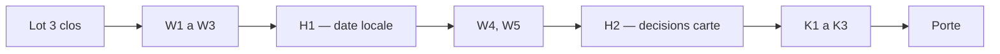

# Révision du plan T1 — conception

**Date :** 2026-09-22 · **Plan révisé :** [`2026-09-13-t1-fiche-station-et-avertissements.md`](../plans/2026-09-13-t1-fiche-station-et-avertissements.md) · **État vivant :** [`project-state.md`](../../project-state.md)

## Contexte

Les lots 1 à 3 de T1 sont clos (18 tâches), les arbitrages bloquants du 2026-09-18 sont consignés, et le lot 4 (avertissements) devait démarrer. Avant de l'exécuter, un bilan de conception a relu le plan contre le code de `feat/t1-mvvm-fiche-station`. Chaque défaut ci-dessous a été **vérifié dans le code** le 2026-09-22 (fichier et ligne cités) ; aucun ne vient d'une lecture du plan seul.

### Ce qui est fait et tient

- Architecture feature-first + MVVM (`ADR-014`) en place et verrouillée par sept règles de couches (`test/architecture/layers_test.dart`), dont `shared-sans-tranche` pour `lib/features/shared/`, décidé mais encore inoccupé.
- `WarningsViewModel` (`V4`) et l'interface `AcknowledgementRepository` existent ; `ADR-011` tranche `shared_preferences` 2.5.5 pour la préférence simple.
- 778 tests verts au 2026-09-18.

### Défauts constatés dans le plan

| # | Défaut | Constat |
|---|---|---|
| 1 | `W3`, `K1`, `K2`, `U4` citent `map_screen.dart` | le fichier est `lib/features/map/view/map_view.dart` |
| 2 | `W3` pose le bandeau sous `features/warnings/view/` et le fait importer par la carte | refusé par la règle `feature-vers-feature` |
| 3 | `W4` pose l'encart sous `features/warnings/view/` | contraire à l'arbitrage du 2026-09-18 (point 34 : `lib/features/shared/`) |
| 4 | `W5` écrit l'encart renforcé sans l'afficher sur aucun écran | aucun écran de T1 n'est un écran de ressource au sens de `BR-013` |
| 5 | Le modal clignote au lancement pour un usager déjà acquitté | `requiresAcknowledgement` vaut `true` avant `load()` (`warnings_view_model.dart`, l. 59) |
| 6 | Balayage de vocabulaire : listes déclarées dans `lib/` | le balayage se trouverait lui-même ; faux positif certain `STYLE=normal` (`ign_tile_template.dart`, l. 18) |
| 7 | `W2` : « verrou de version » non défini | le test cité, `changelog_test.dart`, porte sur le `CHANGELOG` |
| 8 | `W4` attend `'08h00'` | la fiche affiche `HH:MM UTC` (`station_summary_sheet.dart`, `formatMeasuredAt`) |
| 9 | `W4` ne nomme pas la source | `BR-001` l'exige (point 32) |
| 10 | Textes d'avertissement éparpillés | `W2` dans `domain/`, `W3` dans le widget |
| 11 | La vue carte décide | `shouldPreloadOn` (l. 178), `_loadThenPreload`/`_handleScaleSelected` (l. 906-932), `campaignAgeOf` (l. 341) ; `map_view.dart` fait 996 lignes |
| 12 | Cible de 44 pt définie trois fois | `station_marker.dart` l. 126, `onde_summary_sheet.dart` l. 61, `station_summary_sheet.dart` l. 46 |
| 13 | Formatage de date recopié | `padLeft(2` dans cinq fichiers : quatre d'affichage (`station_sheet_view_model.dart`, `station_summary_sheet.dart`, `onde_summary_sheet.dart`, `onde_marker.dart`) et un filaire (`hub_eau_paging.dart`, format `AAAA-MM-JJ` de l'API, hors sujet) |
| 14 | `K2` vérifie un raccourci inactif « dans un champ de saisie » sur le modal | le modal n'a qu'une case à cocher et précède la carte |
| 15 | `X5` étape 1 pose une question déjà tranchée | arbitrée le 2026-09-18 : ADR remplacés gardés |
| 16 | `docs/03-conception.md` l. 48 | nomme `station_detail`, `onde`, `restrictions` ; le code a `station_sheet`, `onde_sheet` |
| 17 | `RestrictionSource` sous `lib/data/restrictions/` | un ViewModel T2 ne pourra pas l'importer (`features-vers-data`) |

## Arbitrages du commanditaire du 2026-09-22

1. **`BR-013` reporté en T2.** En T1 la fiche station donne une mesure, pas une disponibilité de la ressource. L'encart renforcé sera posé sur l'écran des restrictions VigiEau. Décision 11 du plan.
2. **Heure locale, sans suffixe** : « 27/08/2026 à 10:00 », fuseau injecté pour des tests déterministes. Clôt le point 19. Décision 12 du plan.
3. **Approche A validée** (ci-dessous).

## Approche retenue et alternatives

**A — amender le plan en place (retenue).** Les défauts se corrigent dans les tâches qui les portent ; deux tâches sont insérées **juste avant** celles qui en ont besoin (`H1` avant `W4`, `H2` avant `K1`) ; une dette n'est traitée que quand une tâche la touche. Coût : deux tâches, aucun lot nouveau.

- **B — un lot 3 bis dédié à la dette**, avant le lot 4. Écartée : il traiterait d'un bloc des dettes qu'aucune tâche immédiate ne touche (la cible de 44 pt avant qu'un bouton n'en ait besoin, l'extraction des puces avant `K1`), et retarderait les avertissements, condition de mise en production.
- **C — ne corriger que les défauts bloquants** (1, 2, 3, 5). Écartée : `W4` écrirait une cinquième copie de formatage de date dans un troisième fuseau, et `K1`/`K2` recopieraient dans la vue l'enchaînement charger-puis-précharger qu'aucun test n'atteint.

## La révision, tâche par tâche

| Tâche | Changement |
|---|---|
| `W1` | inchangée |
| `W2` | `main.dart` attend `load()` avant `runApp` ; test racine : usager acquitté → carte directe, modal jamais rendu, pas même une image. Verrou de version = `test/project/warning_texts_version_test.dart`, texte intégral **du modal** et version figés. Tous les textes d'avertissement dans `lib/domain/warnings/warning_texts.dart`, mais `warningTextVersion` ne couvre **que** le modal (`UC-006 A3`) : changer le bandeau, l'encart daté ou l'encart renforcé ne réaffiche pas le modal, ces textes sont figés par leurs propres tests (arbitrage du coordinateur, 2026-09-22) |
| `W3` | bandeau dans `lib/features/map/view/map_warning_banner.dart` (seul consommateur : la carte) ; cible `map_view.dart` ; texte importé de `warning_texts.dart` |
| **`H1`** (nouvelle) | formateur unique `lib/domain/formatting/display_date.dart` — Dart pur, lu par un ViewModel et par trois tranches, donc ni dans une tranche ni dans `shared/` (réservé aux widgets). Instant → heure locale sans suffixe, décalage injecté et demandé pour l'instant ; date calendaire ONDE jamais convertie. Remplace les quatre copies d'affichage ; `U1` et `V1` réalignés ; clôt le point 19 |
| `W4` | encart dans `lib/features/shared/` (premier occupant), après `H1` : « 27/08/2026 à 10:00 » ; source Hub'Eau nommée à côté de la valeur — clôt le point 32 ; noms de source dans `lib/domain/sources/source_names.dart`, hors de `warning_texts.dart` |
| `W5` | réduite : balayage des littéraux (pas des commentaires) de `lib/domain/` et `lib/features/`, mot entier (`(?<!\p{L})mot(?!\p{L})`, `unicode: true` — `\b` est ASCII en Dart), sans casse, listes et exceptions nominatives sous `test/project/vocabulary_lists.dart` ; texte de l'encart renforcé dans `warning_texts.dart`. Widget en T2. Message de commit réécrit |
| **`H2`** (nouvelle) | décision de préchargement, enchaînement charger-puis-précharger et âge de campagne rendus à `MapViewModel` ; la vue signale « geste terminé + emprise » ; tests sans rendu ; comportement inchangé (`NFR-07` : 20, 200 ms, annulable) ; pas d'anti-rebond molette |
| `K1` | cible `map_view.dart` ; constante 44 pt unique dans `lib/features/shared/` ; `MapScaleChips` et `IgnAttributionBadge` dans leurs fichiers |
| `K2` | cible `map_view.dart` ; champ de saisie vérifié avec un `TextField` du harnais de test |
| `K3` | inchangée |
| `X1` | `BR-013` retiré de la couverture obligatoire ; scénario « encart renforcé » noté 🔄 T2 |
| `X2` | `BR-013` à l'état 🔄 T2, accepté sans fichier de test |
| `X3` | `G2` compte aussi les appels au dépôt de points ; la conclusion ouvre ou non une tâche d'anti-rebond ; `NV-W6` instruit. Compteur dans `lib/diagnostics/counting_station_point_repository.dart`, importé par `main.dart` seul (convention : aucune règle de couche ne couvre `lib/diagnostics/`) |
| `X4` | correction de `03-conception.md` l. 48 ; « Non vérifié » cite `BR-013` en T2 |
| `X5` | étape 1 supprimée ; `node_modules/` à supprimer par le commanditaire |
| `P1` | au relancement, modal absent même une image ; date locale et source nommée ; encart renforcé absent, attendu |
| `P2` | « Non vérifié » cite `BR-013` en T2 ; commit et tag ne prétendent plus « quatre avertissements » |

**Décompte : 35 tâches actives** (33 + `H1` + `H2`), 5 différées.

## Hors de cette révision

- **Prérequis T2** : déplacer `RestrictionSource` vers `lib/domain/` (point 35 de `project-state.md`) ; écrire le modèle de restriction d'après une **fixture VigiEau réelle et datée**, jamais d'après la documentation seule. C'est aussi en T2 que l'encart renforcé trouve son écran.
- **Point 17** (`EnEchec` homonyme) : reste ouvert. `W4` ne l'aggrave pas — l'encart reçoit un genre et une date, pas un état de fiche. Il ne se traite que si une tâche importe les deux types dans un même fichier.
- **Percentiles, T2, T3** : non planifiés ici. Ils relèvent d'un cadrage à part, pas d'une révision de T1.
