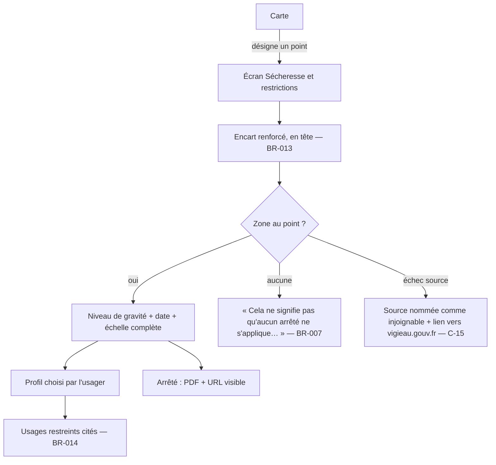

# Cadrage de T2 — Sécheresse et restrictions (VigiEau)

**Date :** 2026-09-27 · **Auteur :** `eva` (cadrage produit) · **Statut :** **arbitré le 2026-09-27** par le commanditaire (Q1 à Q10, § 6) — les sections 3 et 4 restent écrites sur les recommandations, toutes retenues **sauf Q10** · **État vivant :** [`project-state.md`](../../project-state.md)

> Ce document décide du **quoi** et du **pourquoi**. Il ne conçoit ni l'architecture (`harold`), ni l'écran (`blazor-ux` / conception UI), ni le plan de tâches. Toutes les options marquées « recommandée » attendent un **arbitrage du commanditaire** (§ 6).

## 1. Objectif

Permettre à l'usager de savoir **ce que le préfet a arrêté là où il désigne**, pour son profil, et d'accéder au **texte qui fait foi** (l'arrêté), sans jamais confondre cette décision administrative avec un fait observé ou une statistique (`BR-008`, `ADR-002`).

**Ce que T2 prouve :** le quatrième emplacement d'avertissement — l'encart **renforcé**, non repliable, en tête d'écran (`BR-013`) — est posé sur un écran réel et vérifié. C'est la **dernière condition** de mise en production : depuis l'arbitrage du 2026-09-22, « aucune mise en production n'a lieu avant T2 » (`CLAUDE.md`, décision 11 du plan T1).

## 2. Point de départ — constaté le 2026-09-27

| Élément | État |
|---|---|
| Textes de l'encart renforcé (`reinforcedWarningHeadline`, `reinforcedWarningBody`, `reinforcedWarningActionLabel`) dans `lib/domain/warnings/warning_texts.dart` | ✅ texte seul, aucun écran (`tracabilite.md`, ligne `BR-013`) |
| Couture `RestrictionSource` + `SurfaceWaterRestriction` (`rawSeverityLevel`, `decreeFilePath`) sous `lib/data/restrictions/` | ✅ posée en T0, **sans implémentation**, écrite **sans fixture VigiEau** |
| Fixture VigiEau sous `test/fixtures/` | ❌ **aucune** |
| Moyen d'ouvrir un lien externe (PDF, site) | ❌ aucun paquet dans `pubspec.yaml` (`flutter_map`, `latlong2`, `http`, `shared_preferences` seulement) |
| Cache des dépôts (`CachePolicy`) | ✅ **en mémoire** (`_values` / `_cache` dans `cached_onde_observation_repository.dart`, `cached_hydro_observation_repository.dart`) : rien ne survit à un relancement |
| Échelle « Sécheresse » sur la carte | ❌ `MapScaleKind` n'a que `ecoulement` et `debit` |
| Géolocalisation | ❌ aucune, par construction (`NFR-05`) |
| US-07, US-08, US-09, UC-002, BR-013 | 🔄 T2 dans `tracabilite.md`, aucun test d'écran |
| Lien « Relire le détail des sources » du modal (`BR-012`) | ❌ retiré en T1, **arbitré le 2026-09-22 pour arriver avec son écran en T2** (`project-state.md` point **38** — le brief de ce cadrage le citait comme point 36) |

## 3. Périmètre

### Dedans (recommandé)

| # | Élément | Justification |
|---|---|---|
| D1 | **Écran « Sécheresse et restrictions »** : niveau de gravité de la zone au point désigné, date de début de validité, échelle complète avec la position de la zone | `US-07`, `UC-002` 1-3 |
| D2 | **Encart renforcé** en tête de cet écran, non repliable, annoncé comme région d'alerte, avec action directe vers les arrêtés | `US-09`, `BR-013` — raison d'être de T2 |
| D3 | **Usages restreints** filtrés sur le profil choisi, libellés du préfet **cités tels quels et attribués** | `US-07`, `UC-002` 4-5, `BR-014` |
| D4 | **Accès au PDF de l'arrêté** (et de l'arrêté-cadre si la source le fournit), URL toujours visible | `US-08`, `UC-002` 6 et A6 |
| D5 | **Désignation d'un point sur la carte** comme seule entrée géographique (Q1) | `UC-002` précondition « l'usager a désigné un point sur la carte » ; tient `NFR-05` et `C-14` |
| D6 | **États d'absence et d'échec** : aucune zone (`UC-002 A3`), niveau inconnu (`A4`), VigiEau injoignable ou réponse illisible (`A2`, `C-15`), PDF absent ou inaccessible (`A6`) | `BR-007`, `BR-011`, `C-15` (mode dégradé obligatoire) |
| D7 | **Écran « D'où vient cette donnée ? »** réduit aux sources livrées, et retour du lien « Relire le détail des sources » dans le modal (Q8) | arbitrage du 2026-09-22 (point 38) ; sans lui, la mise en production porte un écart à `BR-012` |
| D8 | **Porte de T2 sur Windows**, comme T1 | Windows est la seule cible construite (`ADR-013`) |

### Dehors

| Élément | Motif |
|---|---|
| Percentiles, échelle 2 colorée, courbe de débit (`US-11`, `US-12`, `ADR-003`) | Autre nature (statistique), autre question (`ADR-002`) ; points 5 bis et 27 ouverts (Q4) |
| Qualité de l'eau | `ADR-007` |
| Notifications, alertes personnalisées, compte | `Won't (v1)`, `02-specifications.md § 3` |
| Interrogation par commune ou par adresse saisie | `C-14` (HTTP 409) ; aucun service de géocodage vérifié |
| Toute formulation qui dit à l'usager ce qu'il peut ou ne peut pas faire | `BR-014` : on cite le préfet, on ne prescrit pas |

### Différé (recommandé)

| Élément | Vers | Motif |
|---|---|---|
| Géolocalisation ponctuelle | T3 au plus tôt | bibliothèque à ajouter, `NFR-05` à instruire, moins fiable sur poste fixe (`ADR-009` repris par `ADR-013`) — Q1 |
| Échelle 3 sur la carte (pastilles ou zones colorées) | T3 / `US-17` | demande soit des géométries de zones (exports data.gouv, non vérifiés), soit un agrégat départemental — Q6 |
| Repli `DataGouvBulkRestrictionSource` | après une rupture constatée | lourd, non vérifié par appel réel, ne filtre pas par profil (`ADR-004` ➖) — Q3 |
| Persistance hors-ligne des restrictions au-delà de la session | avec `US-10` / `UC-005` (T3) | exige le moteur structuré laissé ouvert par `ADR-011` — Q7 |
| Android : construction, constat d'écran (`A⏸2`), publication (`A⏸3`, `A⏸5`) | hors porte de T2 | le constat `A⏸2` reste une commande du commanditaire ; T2 ne le conditionne pas — Q10 |

### Parcours fonctionnel visé (P2, P1)



## 4. User stories et critères d'acceptation

Aucune story nouvelle : `US-07`, `US-08`, `US-09` couvrent le besoin, `UC-002` le scénario. La désignation du point et le choix du profil sont des conditions de `US-07` (« **ma** zone », « **mes** usages »), pas des stories à part. Le retour du lien « Relire le détail des sources » complète `US-01` / `BR-012`.

Formulations entre guillemets : **existantes** quand elles sont citées de `UC-002`, `BR-007` ou `warning_texts.dart` ; les autres sont des exigences fonctionnelles dont le texte exact revient à la conception d'écran, `glossary.md` faisant foi.

### US-09 — Must — P2, P5 · « Tout écran sécheresse porte l'avertissement renforcé »

```gherkin
Fonctionnalité: L'encart renforcé sur l'écran des restrictions

  Scénario: L'encart renforcé précède le niveau de gravité
    Étant donné un usager qui ouvre l'écran « Sécheresse et restrictions »
    Quand l'écran s'affiche, avant même la réponse de la source
    Alors l'encart « NE FONDEZ AUCUNE DÉCISION SUR CET ÉCRAN » est le premier contenu de l'écran
    Et le niveau de gravité, s'il est affiché, vient après lui (BR-013)

  Scénario: L'encart renforcé ne se replie jamais
    Étant donné l'écran « Sécheresse et restrictions » affiché
    Quand l'usager fait défiler l'écran ou cherche à masquer l'encart
    Alors aucun contrôle ne permet de le replier, de le fermer ni de ne plus l'afficher
    Et il reste accessible en tête d'écran (BR-013)

  Scénario: L'encart renforcé est annoncé en priorité au lecteur d'écran
    Étant donné un usager qui utilise un lecteur d'écran
    Quand il ouvre l'écran « Sécheresse et restrictions »
    Alors l'encart est annoncé comme une région d'alerte, avant tout autre contenu (BR-013)

  Scénario: L'encart renforcé reste affiché quand la source ne répond pas
    Étant donné une source des restrictions injoignable
    Quand l'usager ouvre l'écran « Sécheresse et restrictions »
    Alors l'encart renforcé est affiché en tête, identique
    Et son action « Consulter les arrêtés en vigueur » reste disponible (BR-013)
```

### US-07 — Must — P2, P5 · « Je consulte le niveau de gravité sécheresse de ma zone et la liste des usages restreints »

```gherkin
Fonctionnalité: Niveau de gravité et usages restreints au point désigné

  Scénario: Le niveau de gravité s'affiche avec sa date de début de validité
    Étant donné un point désigné sur la carte, situé dans une zone soumise à un arrêté
    Quand l'écran reçoit la réponse de la source
    Alors il affiche le niveau de gravité de la zone
    Et la date de début de validité de l'arrêté, à côté du niveau (BR-001)
    Et l'échelle complète des niveaux, la position de la zone y étant repérée

  Scénario: Le point interrogé est toujours un point, jamais une commune
    Étant donné un usager qui désigne un point sur la carte
    Quand l'application interroge la source
    Alors elle transmet la latitude et la longitude du point, jamais un code de commune
    Et l'écran rappelle le point interrogé (BR-007)

  Scénario: Un niveau de gravité inconnu n'est jamais rabattu sur un niveau connu
    Étant donné une réponse dont le niveau de gravité n'appartient à aucune valeur connue
    Quand l'écran l'affiche
    Alors il affiche « Non renseigné »
    Et il ne lui attribue ni la teinte, ni la forme d'un niveau connu (BR-011)

  Scénario: Aucune zone au point désigné n'est jamais un état neutre
    Étant donné un point désigné pour lequel la source ne renvoie aucune zone
    Quand l'écran s'affiche
    Alors il affiche « Cela ne signifie pas qu'aucun arrêté ne s'applique : vérifiez auprès de votre préfecture. »
    Et aucune teinte ni aucun libellé ne suggère une absence de restriction (BR-007)

  Scénario: Les usages restreints se filtrent sur le profil choisi par l'usager
    Étant donné une zone soumise à un arrêté et plusieurs usages restreints
    Quand l'usager choisit le profil « Particulier »
    Alors seuls les usages restreints qui concernent ce profil sont listés
    Et le profil retenu est rappelé au-dessus de la liste (BR-013)

  Scénario: Aucun profil n'est présupposé
    Étant donné un usager qui ouvre l'écran pour la première fois de la session
    Quand le niveau de gravité s'affiche
    Alors aucun profil n'est présélectionné
    Et la liste des usages restreints n'apparaît qu'après un choix explicite du profil (BR-013)

  Scénario: Les libellés du préfet sont cités tels quels et attribués
    Étant donné un usage restreint dont le libellé source est « Interdiction de 10h à 18h »
    Quand la liste l'affiche
    Alors le libellé est reproduit sans reformulation
    Et il est présenté comme cité de l'arrêté, pas comme une consigne de l'application (BR-014)

  Scénario: L'écran n'emploie aucun verbe d'instruction qui lui soit propre
    Étant donné tout texte de l'écran qui ne provient pas de la source
    Quand on le relit
    Alors il ne contient aucune autorisation ni aucune interdiction portant sur un usage de l'eau (BR-014)

  Scénario: La source injoignable est nommée, jamais un écran blanc
    Étant donné une source des restrictions qui ne répond pas, ou dont la réponse est illisible
    Quand l'écran s'affiche
    Alors il nomme la source qui n'a pas répondu
    Et il propose un lien vers vigieau.gouv.fr
    Et aucun niveau de gravité n'est affiché (BR-007)

  Scénario: Une réponse ancienne porte sa date de récupération
    Étant donné une réponse gardée en cache et une source devenue injoignable
    Quand l'écran l'affiche
    Alors il indique la date et l'heure de récupération de cette réponse
    Et l'encart renforcé reste affiché en tête (BR-013)
```

### US-08 — Must — P2 · « J'accède au PDF de l'arrêté préfectoral en vigueur »

```gherkin
Fonctionnalité: Accès au texte qui fait foi

  Scénario: L'arrêté de la zone est accessible depuis l'écran
    Étant donné une zone dont la source fournit le lien du PDF de l'arrêté
    Quand l'usager actionne l'accès à l'arrêté
    Alors le PDF s'ouvre hors de l'application
    Et son adresse reste lisible à l'écran (BR-013)

  Scénario: Un PDF inaccessible est signalé sans prétendre l'avoir vérifié
    Étant donné une zone dont le lien d'arrêté ne s'ouvre pas
    Quand l'usager actionne l'accès à l'arrêté
    Alors l'adresse du lien reste affichée
    Et l'écran ne prétend pas que le document existe ni qu'il est à jour (BR-014)

  Scénario: Une zone sans lien d'arrêté le dit
    Étant donné une zone pour laquelle la source ne fournit aucun lien d'arrêté
    Quand l'écran l'affiche
    Alors il dit que le texte de l'arrêté n'est pas accessible depuis l'application
    Et l'action « Consulter les arrêtés en vigueur » de l'encart reste disponible (BR-007)
```

### Complément US-01 / BR-012 — Must · « Relire le détail des sources »

```gherkin
Fonctionnalité: Le détail des sources, depuis le modal et ensuite

  Scénario: Le modal initial propose de relire le détail des sources
    Étant donné un usager face à l'écran d'avertissement du premier lancement
    Quand il actionne « Relire le détail des sources »
    Alors il lit les sources et leurs limites sans avoir à acquitter
    Et il revient au modal, sa case toujours dans l'état où il l'a laissée (BR-012)

  Scénario: Le détail des sources reste accessible après l'acquittement
    Étant donné un usager qui a acquitté l'avertissement initial
    Quand il cherche « D'où vient cette donnée ? »
    Alors il y accède depuis l'application (BR-012)
```

**Priorité interne à T2 :** US-09 et US-07 d'abord (sans elles, rien ne part), puis US-08 (sa dépendance à un moyen d'ouvrir un lien externe, Q9, peut le retarder), puis le complément BR-012.

## 5. Faits d'API à vérifier par appel réel **avant** toute spécification du modèle

Aucun accès réseau pour ce cadrage : **aucun fait VigiEau n'est affirmé ici** au-delà de ce qui est déjà constaté et daté dans `docs/`.

### Déjà constaté — 2026-07-30 (`ADR-004`, `01-analyse.md § 3.1 et § 4`)

| Fait | Source |
|---|---|
| `swagger-json` → 200, `version: 0.1` | `ADR-004` |
| `/zones?lat=&lon=&profil=` → 200 ; porte `niveauGravite`, `type` (`SUP`/`SOU`/`AEP`), `arrete.cheminFichier`, `arrete.dateDebutValidite`, `usages[]` avec leur applicabilité par profil | `ADR-004`, `01-analyse.md § 3.1` |
| `/departements` → 200, 101 départements, `niveauGraviteSupMax` | `ADR-004` |
| `/arretes_restrictions?departement=03` → `[]`, sémantique **non élucidée** | `ADR-004`, `project-state.md` « Non vérifiés » |
| `?commune=45210` → **409** (commune à plusieurs zones) | `C-14`, `UC-002 A1` |
| `X-RateLimit-Limit: 300`, fenêtre **non déterminée** | `C-13` |
| Aucune authentification ; Licence Ouverte 2.0 (jeu data.gouv associé) | `ADR-004` |
| Niveaux observés : `alerte`, `alerte_renforcee`, `crise` ; `vigilance` **non observé** | `ADR-004`, `UC-002 A4` |

⚠️ Ces constats ont **deux mois** et portent sur une API `0.1` (`C-16`) : ils sont à **reconfirmer**, pas à recopier.

### À vérifier — questions ouvertes

| # | Question | Pourquoi elle conditionne le produit |
|---|---|---|
| `VG-01` | `/zones` répond-il encore, à la même adresse, et le Swagger est-il toujours `0.1` ? | tout le reste en dépend |
| `VG-02` | Forme de la réponse : liste ou objet ? Combien de zones pour un point, et **plusieurs zones de même type** sont-elles possibles au même point ? | zones superposées : que montre l'écran ? |
| `VG-03` | Cas « aucune restriction » : liste vide, 200 sans corps, 404 ? Et un point hors de France, en mer, en DOM, en Corse ? | `UC-002 A3`, `BR-007` |
| `VG-04` | Nomenclature exacte de `niveauGravite` : valeurs, casse, `vigilance` existe-t-il, un niveau « aucun » existe-t-il, valeur nulle possible ? | `BR-011`, échelle de `04-ui.md § 2` |
| `VG-05` | `profil` : valeurs acceptées (`particulier`, `exploitation`, `collectivite`, `entreprise` ?), obligatoire ou non, effet sur `usages[]` (filtré par le serveur ou drapeaux par usage) | Q2 ; libellé « Exploitant » du croquis contre « exploitation » d'`UC-002` |
| `VG-06` | Forme d'un usage : libellé, thématique, description (« Interdiction de 10h à 18h » est-il un champ ?), horaires, dérogations | `BR-014` : on cite, on ne reformule pas |
| `VG-07` | `arrete.cheminFichier` : URL absolue ou chemin relatif ? PDF servi en 200, `application/pdf` ? Arrêté-cadre : un champ existe-t-il ? | `US-08`, `UC-002 A6` |
| `VG-08` | Dates : `dateDebutValidite` seule ou aussi une date de fin ? Format, fuseau ? Date de mise à jour de la donnée ? | `BR-001`, affichage de l'ancienneté |
| `VG-09` | Identité de la zone : un nom lisible (« AXE_LOIRE41 » du croquis est-il réel ?), un code ? | « Votre zone — … » |
| `VG-10` | Codes d'erreur : 400 sur coordonnées invalides, 409 possible sur `lat`/`lon`, 429 et fenêtre de `X-RateLimit`, 5xx ; latence | `C-13`, `C-15`, mode dégradé |
| `VG-11` | Types `SOU` et `AEP` : présents au même point qu'une zone `SUP` ? Avec des usages différents ? | Q5 — risque juridique d'omission |
| `VG-12` | `/departements` : valeurs de `niveauGraviteSupMax`, et sémantique de `/arretes_restrictions` | seulement si Q6 retient l'échelle 3 sur la carte |
| `VG-13` | Exports data.gouv (URL, format, fréquence) | seulement si Q3 retient le repli en T2 |

**Méthode :** une fixture par cas, **réelle et datée dans son nom** (`test/fixtures/`, `CAPTURES.md`), dont au moins : un point en zone restreinte, un point sans zone, un point à zones superposées, un niveau de chaque valeur rencontrée. ⚠️ **Risque de calendrier** : fin septembre, des arrêtés sont levés ; si aucun point en `crise` ou en `alerte_renforcee` n'est trouvable au jour de la capture, ce cas **reste non capturé** et se dit tel quel — jamais une fixture fabriquée.

## 6. Questions à arbitrer par le commanditaire

Chacune est fermée ; la recommandation n'engage rien tant qu'elle n'est pas arbitrée.

### ✅ Arbitrages du commanditaire — 2026-09-27

| # | Retenu | Écart à la recommandation |
|---|---|---|
| Q1 | **A** — point désigné sur la carte, seul | — |
| Q2 | **A** — profil choisi, aucun présélectionné, gardé pour la session | — |
| Q3 | **B** — chemin nominal VigiEau confirmé, repli data.gouv différé ; `ADR-004` amendé par écrit, daté | — |
| Q4 | **A** — percentiles hors T2 | — |
| Q5 | **B** — `SUP` en premier, autres types de zone signalés et nommés, sous réserve de `VG-11` | — |
| Q6 | **A** — pas d'échelle 3 sur la carte en T2 | — |
| Q7 | **A** — cache de session de 6 h, date de récupération affichée | — |
| Q8 | **A** — écran « D'où vient cette donnée ? » dans T2, réduit aux sources livrées ; vérifier l'effet du lien sur `warningTextVersion` | — |
| Q9 | **A** — une bibliothèque d'ouverture de lien, **à vérifier sur pub.dev avant ajout** (version, licence compatible GPL-3.0, Windows et Android, date), URL toujours visible et copiable | — |
| Q10 | **B** — la porte de T2 se franchit sur **Windows et Android** (`flutter run -d emulator-5554` constaté) | ⚠️ **contraire à la recommandation A.** Conséquence : la première construction Android (`A⏸2`, jamais faite) devient un **prérequis de la porte de T2** ; les cibles de 48 dp (`A⏸5`) et l'appareil réel (`A⏸4`) sont à reposer au plan — non tranchés ici |

### Q1 — D'où vient le point géographique interrogé ?

| Option | `NFR-05` | `C-14` | `BR-008` / `ADR-002` | Autres |
|---|---|---|---|---|
| **A. L'usager désigne un point sur la carte** (appui long / clic droit ou mode « désigner ») | ✅ aucune localisation de l'usager | ✅ `lat`/`lon` exacts | ✅ un lieu, pas un marqueur : aucune station n'est associée à la restriction | aucune bibliothèque ; marche sur Windows |
| B. Depuis une fiche station ou point ONDE (coordonnées du marqueur) | ✅ | ✅ | ❌ **laisse croire à un lien entre un débit observé et un arrêté**, que la source n'établit pas (« sans rattachement à une station », `02-specifications.md § 1.1`) ; la zone de la station n'est pas celle de la parcelle | — |
| C. Une zone administrative (pastille département d'`ADR-015`) | ✅ | ⚠️ pas de commune, mais un département porte plusieurs zones : pas d'usages sans point | ⚠️ un maximum départemental lu comme « ma zone » | `/departements` seul |
| D. Géolocalisation ponctuelle approximative | ⚠️ `NFR-05` l'admet « à son arrivée », à instruire | ✅ | ✅ | bibliothèque à ajouter ; **approximation près d'une limite de zone = mauvaise zone** ; moins fiable sur poste fixe |

**Recommandation : A seule en T2.** C'est l'entrée qu'`UC-002` prévoit déjà, sans dépendance nouvelle. D est différée (T3 au plus tôt), et même alors le point obtenu devrait rester montré et corrigeable sur la carte. B et C sont écartées pour la confusion qu'elles installent.

### Q2 — Le profil d'usager : choisi, supposé, ou tous affichés ?

| Option | Effet |
|---|---|
| **A. Choisi explicitement, aucun présélectionné, gardé pour la session seulement** | conforme à `UC-002` (postcondition « aucune action de l'usager n'est enregistrée ») ; un geste de plus à chaque lancement |
| B. Choisi, puis mémorisé (préférence simple, `ADR-011`) | plus confortable pour P2, quotidien en crise ; **amende la postcondition d'`UC-002`** ; un profil erroné mémorisé passe inaperçu |
| C. Supposé « Particulier » par défaut (croquis de `04-ui.md § 1`) | ❌ un exploitant qui ne change pas le profil lit une liste qui n'est pas la sienne — conséquence juridique (`BR-013`) |
| D. Tous les usages affichés, groupés par profil | aucun risque d'erreur de profil ; liste longue pour P2 |

**Recommandation : A.** C est écartée (risque juridique). B est la bonne évolution une fois T2 éprouvé, par amendement explicite d'`UC-002`. D reste le repli si `VG-05` montre que l'API ne filtre pas par profil. Le croquis de `04-ui.md § 1` (« Particulier* ») serait à amender.

### Q3 — `ADR-004` : confirmé, révisé ?

`ADR-004` est tranché **sans arbitrage** (point 2).

| Option | Effet |
|---|---|
| A. Confirmé tel quel : API nominale **et** repli data.gouv en T2 | double la charge de T2 sur un repli non vérifié, sans filtrage par profil |
| **B. Confirmé pour le chemin nominal et l'interface ; repli data.gouv différé** — en cas de rupture : source nommée injoignable + lien vers vigieau.gouv.fr (dernière branche d'`UC-002`) | T2 tenable ; le risque reste confiné à un module ; le repli s'écrit sur rupture constatée |
| C. Révisé : exports data.gouv en nominal | stable et cartographiable, mais perd la réponse au point et le profil (`ADR-004`, alternatives) |
| D. Lien externe seul | le volet sécheresse disparaît (`ADR-004`, alternatives) |

**Recommandation : B**, par amendement daté d'`ADR-004`, qui corrige au passage deux reliquats : les noms `.NET` (`IRestrictionSource`, `VigieauApiRestrictionSource`) et la mention « `BR-004` (avertissement renforcé) » de « Si la décision est revue », qui désigne en réalité `BR-013`. Le filtrage `SUP` de la décision est traité par Q5.

### Q4 — Les percentiles (`ADR-003`) dans T2 ?

| Option | Effet |
|---|---|
| **A. Hors T2** ; lancer l'échantillon de 200 stations (~6 min, point 5 bis) pour instruire leur cadrage | T2 garde un seul objet ; la question « près d'une station sur deux `Indéterminé` » reçoit un chiffre plus solide avant d'engager l'outillage |
| B. Dans T2 | mêle une statistique et une décision administrative dans la même tranche (`ADR-002`) ; points 5 bis et 27 encore ouverts ; retarde la condition de mise en production |
| C. Lot d'outillage parallèle à T2 | deux chantiers ouverts ; la passe complète (~2 h) reste à décider |

**Recommandation : A.** Rien dans T2 n'a besoin d'un percentile.

### Q5 — Eaux superficielles seules, ou tous les types de zone au point ?

`ADR-004` et `UC-002` filtrent sur `type = "SUP"`. Or un irrigant qui prélève dans une nappe relève d'une zone `SOU`, et l'arrosage d'un particulier peut relever d'une autre zone que celle de la rivière (à vérifier, `VG-11`).

| Option | Effet |
|---|---|
| A. `SUP` seul, comme décidé | cohérent avec la rivière ; **omission silencieuse** d'arrêtés qui s'appliquent peut-être à l'usager — contraire à `BR-007` |
| **B. `SUP` en premier ; les autres types présents au point sont signalés, nommés en clair, avec leur niveau et leur arrêté** | aucune omission silencieuse ; écran plus long |
| C. Tous les types à égalité | P1 et P3 perdent le repère rivière |

**Recommandation : B**, sous réserve de `VG-11` : si aucune zone `SOU`/`AEP` n'apparaît jamais au même point, la question tombe.

### Q6 — L'échelle 3 (« Sécheresse ») sur la carte en T2 ?

| Option | Effet |
|---|---|
| **A. Non en T2** : l'écran s'ouvre par désignation d'un point | T2 reste centré sur `BR-013` ; le déclencheur « zone colorée » d'`UC-002` attend |
| B. Pastilles départementales portant `niveauGraviteSupMax` (`ADR-015`, `BR-009`) | peu coûteux ; un maximum départemental peut être lu comme le niveau de « ma » zone ; écran de ressource → `BR-013` s'appliquerait **aussi à la carte** dans cette échelle |
| C. Zones dessinées (géométries data.gouv) | lourd, source non vérifiée, hors ligne à part |

**Recommandation : A**, B à reprendre avec `US-17` (vue départementale). Point de vigilance : B ferait de la carte un écran de ressource au sens de `BR-013`.

### Q7 — Hors ligne des restrictions

| Option | Effet |
|---|---|
| **A. Cache de session (TTL 6 h, `CachePolicy`), date de récupération affichée, encart renforcé maintenu** | tient `UC-002 A5` tant que l'app reste ouverte ; rien de neuf à trancher |
| B. Persistance au-delà du relancement | exige le moteur structuré laissé ouvert par `ADR-011` (bibliothèque à trancher) ; montre une décision administrative peut-être abrogée depuis |
| C. Aucun cache | chaque ouverture refait l'appel ; `C-13` (fenêtre de limite inconnue) |

**Recommandation : A.** B se tranche avec `US-10` / `UC-005`, quand le moteur structuré l'est.

### Q8 — Écran « D'où vient cette donnée ? » et lien du modal (point 38)

| Option | Effet |
|---|---|
| **A. Dans T2, réduit à ce qui est livré** : sources (Hub'Eau hydrométrie, ONDE, VigiEau, IGN), licences, `L-06` (barrages), limites propres à VigiEau (seul l'arrêté fait foi, API `0.1`) ; `L-01` à `L-05` arrivent avec les percentiles | tient l'arbitrage du 2026-09-22 ; ferme l'écart à `BR-012` avant la mise en production |
| B. Dans T2, complet (`L-01` à `L-06`) | décrit une statistique que l'app n'affiche pas encore |
| C. Reporté en T3 | la mise en production part avec un écart à `BR-012` |

**Recommandation : A.** ⚠️ Rouvrir le modal ne doit pas changer `warningTextVersion` si seul un lien s'ajoute — à confirmer, car le verrou fige le **texte intégral** du modal (`W2`).

### Q9 — Ouvrir un lien externe (PDF, vigieau.gouv.fr)

Aucun paquet du `pubspec.yaml` ne le permet (constaté le 2026-09-27). `BR-013` exige pourtant « une action directe vers les arrêtés ».

| Option | Effet |
|---|---|
| **A. Ajouter une bibliothèque d'ouverture de liens, vérifiée sur pub.dev (version, licence compatible GPL-3.0, Windows, date) ; l'URL reste toujours visible et sélectionnable** | `US-08` complète ; une dépendance de plus, à `NFR-05` près (aucune trace envoyée) |
| B. URL affichée et copiable seulement | aucune dépendance ; « action directe » de `BR-013` discutable |
| C. Code natif maison | contraire à YAGNI, trois plateformes |

**Recommandation : A**, B en complément systématique (`UC-002 A6`). Ajout de bibliothèque = arbitrage du commanditaire (`CLAUDE.md`).

### Q10 — Android dans T2 ?

| Option | Effet |
|---|---|
| **A. Porte de T2 sur Windows seul** ; le constat `A⏸2` reste dû, hors porte | cohérent avec T1 ; la mise en production « Windows » devient possible |
| B. Porte sur Windows **et** Android (`flutter run -d emulator-5554` constaté) | première preuve Android, mais T2 dépend d'une construction jamais faite |

**Recommandation : A.** Si la mise en production visée est Android, B devient une condition — c'est au commanditaire de dire **quelle** mise en production T2 déverrouille.

## 7. Risques produit

| Risque | Conséquence | Ce qu'il impose |
|---|---|---|
| **Mauvaise lecture d'une restriction** (`UC-002`, `BR-013`) | prélèvement en infraction | encart renforcé en tête ; arrêté accessible ; libellés cités, jamais reformulés (`BR-014`) ; aucun profil supposé (Q2) |
| **Omission silencieuse** — autre type de zone, zone limitrophe, zones superposées | l'usager croit n'être concerné que par ce qu'il voit | Q5 ; point interrogé rappelé ; « aucune zone » jamais neutre (`BR-007`) |
| **Confusion des trois échelles** (`BR-008`) | une restriction lue comme un état de la rivière, ou un débit lu comme une autorisation | aucune entrée depuis une fiche station (Q1-B écartée) ; aucune échelle 3 sur la carte en T2 (Q6) ; teintes réutilisées d'une échelle à l'autre → contexte toujours nommé |
| **Donnée périmée** — arrêté levé ou aggravé depuis la récupération | décision fondée sur un état qui n'est plus | date de début de validité (`BR-001`) **et** date de récupération affichées ; cache de session seulement (Q7) |
| **Rupture de l'API `0.1`** (`C-16`) | écran vide ou faux | réponse illisible = échec nommé, jamais une valeur par défaut (`BR-011`) ; lien vers vigieau.gouv.fr (Q3) |
| **Modèle écrit d'après la doc** | un champ supposé casse en production | aucune spécification de modèle avant les fixtures de § 5 |
| **Fixtures impossibles à capturer hors saison** | cas `crise` jamais éprouvé | le dire dans « Non vérifié » ; pas de fixture inventée |

## 8. Prérequis techniques déjà repérés (recopiés, non conçus)

- **Point 35 de `project-state.md`, tel quel :** « `RestrictionSource` vit sous `lib/data/restrictions/restriction_source.dart` — un ViewModel de l'écran des restrictions ne pourra pas l'importer (règle `features-vers-data` de `layers_test.dart`), alors que tous les autres contrats de dépôt sont déclarés dans `lib/domain/repositories/repositories.dart`. […] à déplacer vers `lib/domain/` au début de T2, avec un modèle de restriction écrit d'après une **fixture VigiEau réelle et datée** (`CLAUDE.md`, anti-hallucination). C'est aussi en T2 que l'encart renforcé de `BR-013` trouve son écran. »
- **Fixture VigiEau réelle et datée** : aucune n'existe (§ 5).
- **Tranche `features/restrictions/`** : 🔄 prévue (`03-conception.md`, l. 51).
- Le modèle `ZoneRestriction` / `UsageRestreint` de `03-conception.md` (l. 98-99) date de la stack précédente et n'a **aucune fixture** : 💭, à réécrire d'après § 5, pas à recopier.
- Aucun moyen d'ouvrir un lien externe dans `pubspec.yaml` (Q9).

## 9. Hors de ce cadrage

Architecture de la tranche, forme du modèle, découpage en tâches, textes exacts d'écran, disposition : à `harold`, à la conception d'écran et au plan de T2, **après** les arbitrages de § 6 et la capture des fixtures de § 5.
