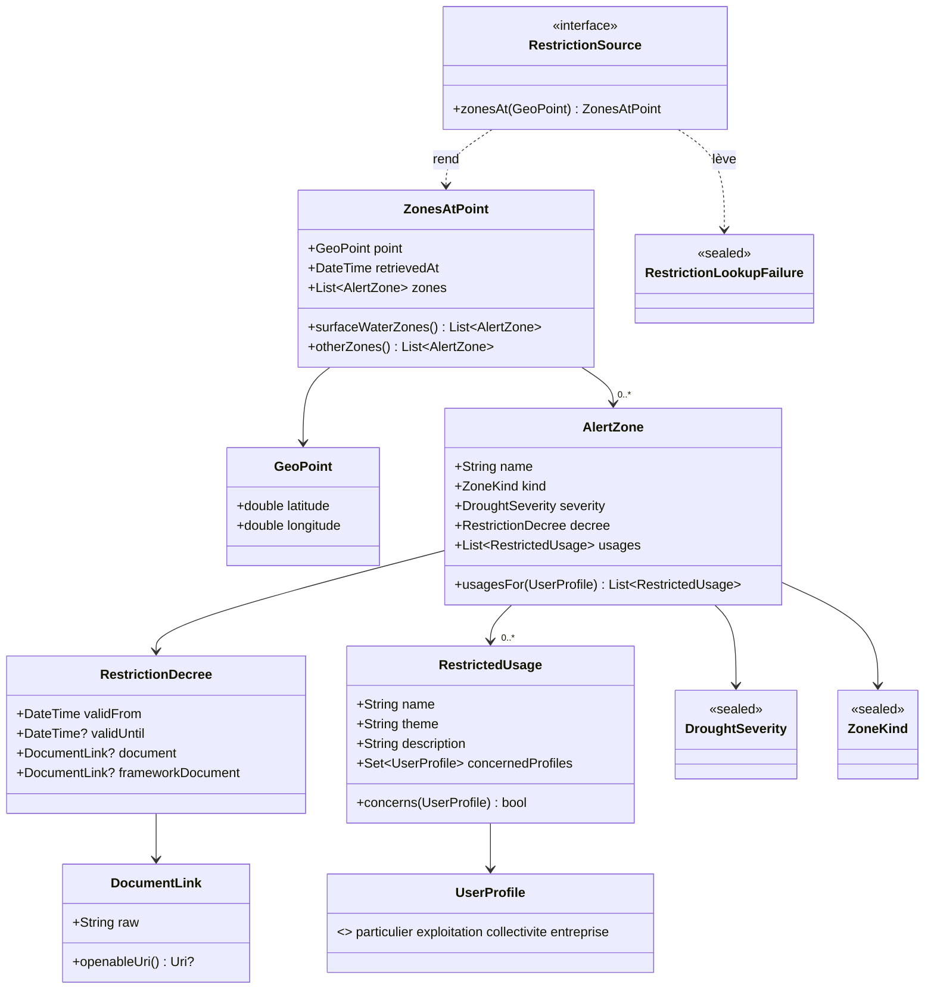
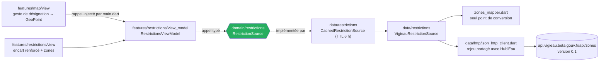

# Modèle du domaine « restrictions » — T2

**Date :** 2026-09-27 · **Auteur :** `harold` (architecture) · **Statut :** ~~🔄 **décidé, rien n'est codé**~~ ✅ **codé le 2026-09-27** (tâches `M1` → `M4`, `D1` → `D4`, `V1`, `B2` du plan de T2 ; vérifié par test, **jamais constaté à l'écran** — note du 2026-10-04, `X3`). Les trois questions de la première version sont **arbitrées par le commanditaire le 2026-09-27** (voir « Arbitrages ») · **Dépend de :** [cadrage T2 arbitré](2026-09-27-cadrage-t2-design.md) (§ 6, Q1 à Q10), [`docs/sources/vigieau.md`](../../sources/vigieau.md) et les 16 fixtures de `test/fixtures/vigieau/` (capturées le 2026-09-27), [`ADR-004`](../../adr/ADR-004-integration-vigieau.md) amendé le même jour, [`ADR-014`](../../adr/ADR-014-feature-first-mvvm.md).

> Ce document décide de la **forme** du modèle, du contrat et de l'emplacement des fichiers. Il ne fixe ni les textes d'écran, ni la disposition, ni le découpage en tâches. Toute affirmation sur VigiEau renvoie à une fixture nommée ; ce qui n'est vu dans aucune fixture est dit tel quel (§ 9).

## Arbitrages du commanditaire — 2026-09-27

| # | Question | Retenu |
|---|---|---|
| AR-1 | Amendement d'`ADR-004` : appel unique sans `profil`, filtrage dans le domaine par les booléens `concerne*`, confinement redéfini (§ 7) | ✅ **accepté**. Fait vérifié par la boucle principale : sur la fixture de l'Ain, les **listes complètes** sont égales pour les 4 profils sur les 3 zones. Ce n'est qu'un point : le test d'équivalence du § 10 **reste obligatoire** |
| AR-2 | Une zone dont un champ obligatoire manque rend-elle **toute** la réponse illisible ? | ✅ **tout ou rien** : `ReponseIllisible` pour toute la réponse (§ 4.4) |
| AR-3 | Une entrée de plus de 6 h est-elle servie pendant le rafraîchissement ? | ✅ **oui, servie et datée**, pendant que le rafraîchissement court en tâche de fond. C'est le stale-while-revalidate commun, **sans nouveau mode** de `CachePolicy` (§ 4.5) |

## 0. En bref

1. **Un seul appel par point, sans `profil`** (AR-1) : `GET /zones?lat=&lon=`. Le filtrage par profil se fait **dans le domaine**, sur les quatre booléens `concerne*` de chaque usage. Le piège `collectivité` accentué disparaît par construction, et le changement de profil ne coûte aucun appel.
2. **Toutes les zones du point sont gardées** (`SUP`, `SOU`, `AEP`, et tout type inconnu). Le domaine les partage en « eaux superficielles d'abord » et « autres zones », sans jamais en perdre une (Q5).
3. **`RestrictionSource`** garde son nom, mais sa déclaration passe sous `lib/domain/restrictions/`. Elle rend un `ZonesAtPoint` daté de sa récupération et lève un échec **fermé** à trois branches : source injoignable, requête refusée, réponse illisible. « Aucune zone » n'est **pas** un échec : c'est une réponse vide (`200 []`).
4. **Le transport HTTP à rejeu est extrait** de `HubEauClient` et partagé. `HubEauClient` garde son comportement. Recopier la boucle de rejeu, le produit l'interdit.
5. **Aucune des sept règles de `layers_test.dart` ne change.** Deux **autres** tests doivent évoluer : le confinement de `restriction_source_test.dart`, redéfini par l'amendement d'`ADR-004` (AR-1), et la liste de `domain_model_doc_test.dart`.

## 1. Les faits qui contraignent le modèle

| Fait constaté le 2026-09-27 | Fixture qui le prouve | Conséquence sur le modèle |
|---|---|---|
| `/zones` rend **toujours une liste JSON**, jamais un objet | toutes les `zones_*` en `200` | le transport doit accepter un tableau. `HubEauClient.getJson` le refuse (« un objet est attendu ») : il faut un transport partagé (§ 4.2) |
| Aucune zone → **`200 []`**, jamais `404` | `zones_guyane_aucune_zone_…`, `zones_atlantique_hors_france_…` | « aucune zone » est une **réponse**, pas un échec (§ 3) |
| **Trois zones au même point** (`SUP`, `SOU`, `AEP`), avec un niveau et des usages **propres à chacune** | `zones_ain_bourg-en-bresse_sans_profil_…` (`SOU` en `vigilance`, `SUP`/`AEP` en `alerte`), `zones_paris_vigilance_…`, `zones_corse_ajaccio_…` ; deux zones en Ariège (`AEP`, `SUP`) | une **liste** de zones, jamais « la » zone ; aucune zone écartée (Q5) |
| **L'ordre des zones varie** d'une réponse à l'autre : `SOU` en tête dans l'Ain, `AEP` en Ariège, `SUP` à Paris et en Corse | les quatre fixtures ci-dessus | l'ordre de présentation est **le nôtre**, décidé dans le domaine (§ 5), jamais celui de l'API |
| `code` vaut **`null`** sur une zone | `zones_ariege_foix_crise_…` (zone `AEP`, `"code":null`) | `code` ne peut pas identifier une zone |
| Le **même `code`** désigne trois zones de types différents : `11_75_01` à Paris, `84_01_2` pour `SUP` et `AEP` dans l'Ain | `zones_paris_vigilance_…`, `zones_ain_…` | idem : `code` n'est pas un identifiant, même non nul |
| Le **même `nom`** désigne les trois zones de Paris (« Bassins de la Marne et de la Seine ») | `zones_paris_vigilance_…` | à l'écran, une zone se distingue par son **type**, nommé en clair, pas par son seul nom |
| Les **`id` d'usage se répètent** d'une zone à l'autre (`2049476` dans `SUP`, `AEP` et `SOU` à Paris) | `zones_paris_vigilance_…` | un `id` d'usage n'identifie rien dans une réponse : il n'est **pas** modélisé |
| `niveauGravite` ∈ {`vigilance`, `alerte`, `alerte_renforcee`, `crise`}, énumération du schéma, **les quatre observées** (`alerte_renforcee` seulement dans `/departements`) | `swagger_…` (`ZoneDto.niveauGravite.enum`), `zones_paris_vigilance_…`, `zones_ain_…`, `zones_ariege_foix_crise_…`, `departements_…` | nomenclature fermée à quatre branches, **plus** une branche inconnue (`BR-011`) |
| `type` ∈ {`AEP`, `SOU`, `SUP`}. Le schéma le décrit ainsi : « SOU / eau souterraine, SUP / eau superficielle ou AEP / eau potable » | `swagger_…` (`ZoneDto.type`) | nomenclature fermée à trois branches, **plus** une branche inconnue |
| `arrete.dateDebutValidite` **et** `arrete.dateFinValidite`, en ISO 8601 UTC, **toujours à `T00:00:00.000Z`** | toutes les `zones_*` non vides | deux dates, lues comme des **dates calendaires** (§ 2.5) |
| `arrete.cheminFichier` et `arrete.cheminFichierArreteCadre` sont des **URL absolues**. Certaines portent un encodage abîmé, comme `…sign%C3%83%C2%A9.pdf` | `zones_paris_vigilance_…`, `zones_ariege_foix_crise_…` | le lien est gardé **tel que reçu** : on ne le décode pas, on ne le réencode pas (§ 2.5) |
| Un usage a exactement `id`, `nom`, `thematique`, `description` et quatre booléens `concerne*`. **Tout le texte à citer est dans `description`**, en texte libre, avec des `\r\n`, des espaces de fin et des tirets de liste | `zones_ariege_foix_crise_…` (« Interdiction totale sauf impératif sanitaire\r\n + Affichage… »), `zones_paris_vigilance_…` | `description` est **citée** (`BR-014`). Seule transformation admise : la fin de ligne (§ 4.4) |
| `profil` est facultatif. Sans lui, la réponse rend l'**union** des usages, avec leurs booléens. Le filtrage serveur suit ces booléens : `particulier` rend **68 usages sur les trois zones, autant que de `concerneParticulier:true` dans la réponse sans profil** ; `exploitation`, **58 contre 58** ; `collectivite` sans accent, **35 contre 35** sur la zone `SOU` (`vigieau.md`, `VG-05`). La boucle principale a vérifié **l'égalité des listes complètes** pour les 4 profils sur les 3 zones (AR-1) | `zones_ain_…_sans_profil_…`, `…_profil_particulier_…`, `…_profil_exploitation_…`, `…_profil_entreprise_…`, `…_profil_collectivite_sans_accent_…` | le filtrage par profil se fait **chez nous**, à partir d'un seul appel (§ 2.7, § 8 alternative A1). Un seul point est vérifié : le test d'équivalence reste prescrit (§ 10) |
| `profil=collectivité` accentué, la valeur du schéma, rend **zéro usage**, sans erreur | `…_profil_collectivite_accentue_…` (`"usages":[]` sur les trois zones) | on n'envoie **pas** `profil` : le piège ne peut pas se produire |
| Le schéma déclare `code` et `arreteMunicipalCheminFichier` **obligatoires**. Le premier arrive `null`, le second est **absent** de toutes les réponses | `swagger_…` (`ZoneDto.required`), `zones_ariege_foix_crise_…` | le « required » du schéma **ne garantit rien**. Le mapper ne s'y fie pas et ne suppose la présence d'aucun champ. Ce qui est obligatoire pour **nous** est fixé au § 4.4 |
| `400` sur coordonnées hors plage, `409` par commune | `zones_coordonnees_invalides_400_…`, `zones_commune_45210_409_…` | un point hors plage est refusé **à la construction** (§ 2.2) ; une requête refusée est un échec distinct (§ 3) |
| Champs hérités, redondants : `idSandre`, `gid`, `CdZAS`, `LbZAS`, `TypeZAS`, `departement`, `ressourceInfluencee` | toutes les `zones_*` non vides | ignorés (§ 2.8). Tout champ inconnu est toléré (`BR-011`) |
| Site public : `https://vigieau.gouv.fr/` → `200` ; `www.vigieau.gouv.fr` → nom d'hôte **non résolu** (constaté le 2026-09-27 à 11:45 UTC) | `vigieau.md`, ligne 121 (pas de fixture : page HTML) | seule l'adresse **sans `www`** sert au lien de repli et à l'action de l'encart (§ 9, O8) |

## 2. Le modèle

Tout le modèle est **Dart pur** sous `lib/domain/`. Ce sont des objets-valeur immuables, à égalité structurelle. Rien n'a de cycle de vie dans l'app : une réponse est un **instantané daté**, pas une entité suivie. Il n'y a donc pas d'agrégat à racine persistante. Le seul regroupement porteur d'invariant est `ZonesAtPoint` (§ 2.3).



### 2.1 Signatures (esquisse, pas du code à recopier)

Les commentaires et la validation fine reviennent à `ada`. Les **noms, les types et l'optionalité** sont décidés ici.

```dart
// lib/domain/geo/geo_point.dart
final class GeoPoint {
  /// Lève ArgumentError si latitude ∉ [-90, 90], longitude ∉ [-180, 180],
  /// ou si l'une n'est pas finie.
  factory GeoPoint({required double latitude, required double longitude});
  final double latitude;
  final double longitude;
  // == et hashCode structurels
}

// lib/domain/restrictions/drought_severity.dart
sealed class DroughtSeverity { const DroughtSeverity(); }
final class Vigilance extends DroughtSeverity { const Vigilance(); }
final class Alerte extends DroughtSeverity { const Alerte(); }
final class AlerteRenforcee extends DroughtSeverity { const AlerteRenforcee(); }
final class Crise extends DroughtSeverity { const Crise(); }
final class GraviteInconnue extends DroughtSeverity {
  const GraviteInconnue(this.rawValue);
  final String? rawValue; // telle que reçue, jamais normalisée (BR-011)
}
/// L'échelle complète, dans l'ordre du schéma et de 04-ui.md § 2.
/// GraviteInconnue n'y figure pas.
const List<DroughtSeverity> droughtSeverityScale = <DroughtSeverity>[
  Vigilance(), Alerte(), AlerteRenforcee(), Crise(),
];
String droughtSeverityLabel(DroughtSeverity severity); // switch exhaustif

// lib/domain/restrictions/zone_kind.dart
sealed class ZoneKind { const ZoneKind(); }
final class EauxSuperficielles extends ZoneKind { const EauxSuperficielles(); } // SUP
final class EauxSouterraines extends ZoneKind { const EauxSouterraines(); }     // SOU
final class EauPotable extends ZoneKind { const EauPotable(); }                 // AEP
final class TypeZoneInconnu extends ZoneKind {
  const TypeZoneInconnu(this.rawValue);
  final String? rawValue;
}

// lib/domain/restrictions/user_profile.dart
enum UserProfile { particulier, exploitation, collectivite, entreprise }

// lib/domain/restrictions/alert_zone.dart
final class DocumentLink {
  const DocumentLink(this.raw);
  final String raw;          // l'adresse telle que reçue, affichée telle quelle
  Uri? get openableUri;      // non nul seulement pour une URL absolue http/https
}
final class RestrictionDecree {
  final DateTime validFrom;            // UTC, date calendaire
  final DateTime? validUntil;          // UTC, date calendaire
  final DocumentLink? document;        // PDF de l'arrêté de restriction
  final DocumentLink? frameworkDocument; // PDF de l'arrêté-cadre
}
final class RestrictedUsage {
  final String name;
  final String theme;
  final String description;            // citée telle quelle (BR-014)
  final Set<UserProfile> concernedProfiles; // non modifiable
  bool concerns(UserProfile profile);
}
final class AlertZone {
  final String name;
  final ZoneKind kind;
  final DroughtSeverity severity;
  final RestrictionDecree decree;
  final List<RestrictedUsage> usages;  // ordre de la source, non modifiable
  List<RestrictedUsage> usagesFor(UserProfile profile);
}

// lib/domain/restrictions/zones_at_point.dart
final class ZonesAtPoint {
  final GeoPoint point;          // le point interrogé, rappelé à l'écran (US-07)
  final DateTime retrievedAt;    // instant de la réponse de la source, UTC
  final List<AlertZone> zones;   // vide = « aucune zone » (BR-007), non modifiable
  List<AlertZone> get surfaceWaterZones;
  List<AlertZone> get otherZones;
}

// lib/domain/restrictions/restriction_source.dart
abstract interface class RestrictionSource {
  Future<ZonesAtPoint> zonesAt(GeoPoint point); // lève RestrictionLookupFailure
}
sealed class RestrictionLookupFailure implements Exception {
  const RestrictionLookupFailure(this.diagnostic);
  final String diagnostic;   // pour le journal, jamais affiché
}
final class SourceInjoignable extends RestrictionLookupFailure { … }
final class RequeteRefusee extends RestrictionLookupFailure { final int statusCode; … }
final class ReponseIllisible extends RestrictionLookupFailure { … }
```

⚠️ **Noms des branches inconnues.** On écrit `GraviteInconnue` et `TypeZoneInconnu`, pas `Inconnu`, parce que `Inconnu` existe déjà dans `lib/domain/nomenclature/flow_category.dart`. Deux classes homonymes dans deux bibliothèques rendent ambigu tout fichier qui importe les deux, par exemple une future légende à trois échelles. Le rôle ne change pas (`BR-011`) : la valeur brute est portée, rien n'est rabattu sur une branche connue.

### 2.2 `GeoPoint` — le point désigné

- **Pourquoi un type :** c'est la seule entrée géographique (Q1-A). Une paire de `double` nus ouvre la porte à une inversion latitude/longitude. La validation à la construction rend le `400` (`zones_coordonnees_invalides_400_…`) **impossible par construction**, comme `Bounds` refuse une emprise inversée.
- **Où :** `lib/domain/geo/`, à côté de `bounds.dart`, et non sous `restrictions/`. La vue carte le construit au geste de désignation, et elle n'a pas à importer le contexte Restrictions pour cela (même raisonnement que `Bounds`, relecture du 2026-09-13).
- **Ce qu'il ne fait pas :** aucun arrondi. Le point interrogé est celui que l'usager a désigné. Arrondir pourrait faire franchir une limite de zone.

### 2.3 `ZonesAtPoint` — la réponse au point, datée

| Champ | Provenance | Optionnel | Fixture |
|---|---|---|---|
| `point` | la requête, pas la réponse | non | — |
| `retrievedAt` | l'horloge **injectée** du dépôt HTTP, au moment où la source a répondu | non | — (aucun champ de fraîcheur sur `ZoneDto`, `VG-08`) |
| `zones` | le tableau racine | non. **Vide** si `[]` | `zones_guyane_aucune_zone_…`, `zones_atlantique_hors_france_…` |

- **`retrievedAt` vit dans la valeur, pas dans le cache.** `withCachePolicy` rend un `T` sans son `storedAt`. Si la date de récupération voyage **avec** la réponse, un écran servi par le cache la connaît aussi bien qu'un écran servi par le réseau (scénario US-07 « Une réponse ancienne porte sa date de récupération », AR-3). C'est le raisonnement d'`OndeSweep` (`U6`, `T-14`) : ce qui explique une donnée voyage avec elle.
- **Invariant :** `surfaceWaterZones` et `otherZones` forment une **partition** de `zones`. Chaque zone apparaît dans exactement une des deux listes, et aucune n'est perdue (§ 5).

### 2.4 `AlertZone` — une zone d'alerte

| Champ | Champ source | Optionnel | Fixture | Si absent ou inattendu |
|---|---|---|---|---|
| `name` | `nom` | **non** | toutes les `zones_*` (« Dombes - Certines - Nord », « Zone 3 », « UDI_crise ») | `ReponseIllisible` (§ 4.4) |
| `kind` | `type` | non, mais **tolérant** | `SUP`/`SOU`/`AEP` partout | valeur inconnue ou `null` → `TypeZoneInconnu(raw)` |
| `severity` | `niveauGravite` | non, mais **tolérant** | `vigilance` (Paris), `alerte` (Ain, Corse), `crise` (Ariège) | valeur inconnue ou `null` → `GraviteInconnue(raw)` |
| `decree` | `arrete` | **non** | toutes les `zones_*` non vides | objet absent → `ReponseIllisible` |
| `usages` | `usages` | **non** ; une liste **vide** est valide | toutes ; `[]` dans `…_collectivite_accentue_…` | absent → `ReponseIllisible` |

- **Pas d'`id`, pas de `code`, pas de `departement`.** Aucune US de T2 n'en affiche ni n'en utilise. `code` est `null` sur une zone et partagé entre types sur deux autres (§ 1) : il n'aurait identifié rien. Si un écran en a besoin un jour, il s'ajoute sans rien casser. En attendant, le mapper l'ignore, et son `null` est sans effet.
- **`usagesFor(profile)`** rend les usages dont `concerns(profile)` est vrai, **dans l'ordre de la source**, sans tri ni dédoublonnage. Une liste vide est un résultat valide que l'écran dit (`BR-007`), jamais une absence de restriction.

### 2.5 `RestrictionDecree` et `DocumentLink` — le texte qui fait foi

| Champ | Champ source | Optionnel | Fixture | Si absent ou inattendu |
|---|---|---|---|---|
| `validFrom` | `arrete.dateDebutValidite` | **non** (`BR-001` : un niveau ne s'affiche pas sans sa date) | toutes, ex. `2026-09-21T00:00:00.000Z` (Ariège) | absent ou illisible → `ReponseIllisible` |
| `validUntil` | `arrete.dateFinValidite` | oui | toutes, `2026-10-31T00:00:00.000Z` | `null` → rien d'inventé : l'écran dit que la source ne la fournit pas |
| `document` | `arrete.cheminFichier` | oui (US-08 « Une zone sans lien d'arrêté le dit ») | toutes, URL absolues `https://regleau.s3.gra.perf.cloud.ovh.net/…` | `null` ou chaîne vide → `null` |
| `frameworkDocument` | `arrete.cheminFichierArreteCadre` | oui | présent, en URL absolue, dans les **neuf** fixtures `200` non vides : `zones_ain_bourg-en-bresse_sans_profil_…`, `…_profil_particulier_…`, `…_profil_exploitation_…`, `…_profil_entreprise_…`, `…_profil_collectivite_accentue_…`, `…_profil_collectivite_sans_accent_…`, `zones_corse_ajaccio_…`, `zones_paris_vigilance_…`, `zones_ariege_foix_crise_…` (comptage refait le 2026-09-27) | idem |

- **Deux dates calendaires, pas deux instants.** Les dates de validité ne sont vues qu'à minuit UTC. Elles s'affichent avec `formatCalendarDate` (`lib/domain/formatting/display_date.dart`, décision 12), **sans conversion de fuseau**. Convertir `2026-08-20T00:00:00.000Z` à l'heure des Antilles (UTC−4) afficherait le 19 août. `retrievedAt`, lui, est un **instant** et passe par `formatLocalDateTime`.
- **`DocumentLink.raw` est affiché tel que reçu.** L'adresse de Paris contient `sign%C3%83%C2%A9` : on n'y touche pas. La décoder la rendrait illisible, la « réparer » serait une invention. `openableUri` rend `Uri.tryParse(raw)` seulement pour une URL absolue en `http` ou `https`. Sinon il rend `null` : l'adresse reste affichée, mais aucune action d'ouverture n'est proposée (`UC-002 A6`).
- **Pas d'`id` d'arrêté.** Paris montre le même arrêté (`id` 37008) pour trois zones. Dédoublonner l'affichage relève de la conception d'écran : il suffit de comparer `document`.

### 2.6 `RestrictedUsage` — un usage restreint, cité

| Champ | Champ source | Optionnel | Fixture | Si absent ou inattendu |
|---|---|---|---|---|
| `name` | `nom` | non | toutes (« Arrosage des golfs ») | `ReponseIllisible` |
| `theme` | `thematique` | non | toutes (« Arroser », « Irriguer ») | `ReponseIllisible` |
| `description` | `description` | non | toutes (« Interdiction totale », « Interdit tous les jours de 8h à 20h et de 24h à 4h ») | `ReponseIllisible` |
| `concernedProfiles` | `concerneParticulier`, `concerneExploitation`, `concerneCollectivite`, `concerneEntreprise` | non : **les quatre** doivent être des booléens | toutes | un booléen absent ou non booléen → `ReponseIllisible` |

- **Pourquoi aussi strict sur les booléens :** un booléen manquant ne se remplace par aucune valeur sûre. Mettre `false` **cacherait** une restriction à un profil concerné : c'est l'omission juridique que `BR-013` veut empêcher. Mettre `true` attribuerait à un usager une restriction qui ne le vise pas. Aucun des deux n'est une tolérance de nomenclature (`BR-011`) : c'est une rupture de structure (dernier invariant de `BR-011`).
- **Aucun texte ne sort du modèle reformulé.** `name`, `theme` et `description` sont les mots du préfet, présentés comme cités (`BR-014`). C'est **l'exception voulue** à « aucune valeur brute d'API n'atteint la vue » : cet invariant vise les **codes** et les **unités** (`alerte_renforcee`, l/s), qui restent traduits. Une citation qu'on traduirait deviendrait une reformulation.

### 2.7 Les trois nomenclatures

**`DroughtSeverity`** — sealed, quatre branches connues plus `GraviteInconnue(rawValue)`.
- Correspondance lue par le mapper, après `trim` et mise en minuscules, avec la valeur brute conservée : `vigilance` → `Vigilance`, `alerte` → `Alerte`, `alerte_renforcee` → `AlerteRenforcee`, `crise` → `Crise`, tout le reste (y compris `null`) → `GraviteInconnue`.
- `droughtSeverityLabel` est **le seul** libellé du projet pour cette échelle. Ce sont les libellés de `04-ui.md § 2`, échelle 3 : « Vigilance », « Alerte », « Alerte renforcée », « Crise », « Non renseigné ». Même principe que `flowCategoryLabel` : un concept, un mot.
- `droughtSeverityScale` rend l'échelle complète **sans** la branche inconnue. La vue y repère la position de la zone par égalité. `GraviteInconnue` n'a pas de position : elle ne prend ni la teinte ni la forme d'un niveau connu (scénario US-07, `BR-011`).
- ⚠️ **Aucun rang de sévérité n'est exposé.** T2 ne compare pas deux zones (Q6-A : pas d'échelle 3 sur la carte). Un rang inviterait à résumer un point par « sa » zone la plus sévère, alors que chaque zone régit ses propres usages. Il viendra avec `BR-009` en échelle 3, pas avant (YAGNI).

**`ZoneKind`** — sealed, trois branches connues plus `TypeZoneInconnu(rawValue)`.
- Correspondance après `trim` et mise en majuscules, valeur brute conservée : `SUP` → `EauxSuperficielles`, `SOU` → `EauxSouterraines`, `AEP` → `EauPotable`, reste → `TypeZoneInconnu`. Le sens vient du schéma (`ZoneDto.type.description`, `swagger_…`).
- Libellés : **à fixer par la conception d'écran** (§ 9). Leur emplacement est décidé : une fonction `zoneKindLabel` à côté de la nomenclature, sur le modèle de `droughtSeverityLabel`.

**`UserProfile`** — un `enum` Dart, **sans branche inconnue**, et ce n'est pas un écart à `BR-011`.
- `BR-011` vise une valeur **reçue** d'une API. Le profil est **choisi par l'usager** dans un ensemble que nous fermons. Ce qui vient de l'API, ce sont quatre booléens **nommés** : un profil que l'API ajouterait arriverait par un **champ** nouveau, que le mapper ignore sans casser (`BR-011`, champs supplémentaires). Il n'arriverait pas par une valeur inconnue.
- Ordre des valeurs : celui d'`UC-002` (étape 4).
- **Valeur envoyée à l'API : aucune** (AR-1). L'appel se fait sans `profil` (§ 0, § 8 A1). Si l'on revient un jour au filtrage serveur, la seule valeur qui fonctionne pour les collectivités est **`collectivite` sans accent** : `collectivité`, la valeur du schéma, rend zéro usage sans erreur (`…_collectivite_accentue_…` contre `…_collectivite_sans_accent_…`). Cette correspondance vivrait dans `lib/data/restrictions/`, jamais dans le domaine.
- Libellés (« Exploitant » dans `04-ui.md § 1`, « exploitation » dans `UC-002`) : à la conception d'écran (§ 9).

### 2.8 Ce que le modèle ne porte pas

| Champ | Motif |
|---|---|
| `id` (zone, arrêté, usage) | aucune US. Les `id` d'usage se répètent d'une zone à l'autre (Paris) |
| `code`, `CdZAS` | aucune US ; `null` ou partagé (§ 1) |
| `idSandre`, `gid`, `LbZAS`, `TypeZAS` | redondants avec `nom` et `type` |
| `departement` | aucune US en T2 |
| `ressourceInfluencee` | sens non documenté, aucune US |
| `arreteMunicipalCheminFichier` | déclaré dans le schéma, **absent** de toutes les réponses |
| `/departements`, `niveauGravite*Max`, `availability` | échelle 3 hors T2 (Q6-A) |

## 3. Le contrat `RestrictionSource`

```dart
abstract interface class RestrictionSource {
  Future<ZonesAtPoint> zonesAt(GeoPoint point);
}
```

**Nom gardé.** `RestrictionSource` est cité dans l'invariant de `CLAUDE.md` (« VigiEau ne s'appelle que derrière `RestrictionSource` »), dans `ADR-004`, `03-conception.md` et `context-map.md`. Le rebaptiser `RestrictionRepository` alignerait le nom sur les autres contrats, mais ferait reprendre cinq documents sans rien changer au comportement. Le mot « source » dit en plus ce que les autres dépôts ne disent pas : c'est la frontière d'un service externe instable (`C-16`).

**Emplacement :** `lib/domain/restrictions/restriction_source.dart`, **pas** `lib/domain/repositories/repositories.dart`.
- Restrictions est un contexte borné distinct (`context-map.md`). Le dossier `domain/restrictions/` en regroupe le contrat et les types, face à `data/restrictions/` qui en regroupe l'implémentation. C'est le « module » qu'`ADR-004` confine.
- Le verser dans `repositories.dart` obligerait chaque lecteur de ce fichier (carte, fiches) à importer le contexte Restrictions. C'est l'argument qui a déjà sorti `Bounds` de ce fichier.
- Ancienne déclaration `lib/data/restrictions/restriction_source.dart` (point 35 de `project-state.md`) : **supprimée**, ainsi que `SurfaceWaterRestriction` et `surfaceWaterZonesAt`. Elles filtraient sur `SUP`, ce que Q5-B remplace, et elles n'ont aucun appelant.

**Pas de paramètre de profil.** Le profil filtre une réponse déjà reçue (§ 2.4). Il ne décide pas de la requête.

**Échecs — un type fermé, levé, jamais rendu :**

| Branche | Quand | Exemple constaté | Ce que l'écran en fait (`BR-007`) |
|---|---|---|---|
| `SourceInjoignable` | panne réseau ou TLS, `429` ou `5xx` **après** les rejeux | `429` et `5xx` jamais provoqués (`VG-10`) | nomme la source qui n'a pas répondu, lien vers le site public |
| `RequeteRefusee(statusCode)` | tout statut non rejouable hors succès : `400`, `404`, `409`… | `400` (`zones_coordonnees_invalides_400_…`), `409` (`zones_commune_45210_409_…`, par commune seulement) | la source **a répondu** mais n'a pas su servir ce point : le texte ne dit pas « injoignable » |
| `ReponseIllisible` | corps non JSON, racine qui n'est pas un tableau, champ obligatoire absent ou mal typé (§ 4.4) | aucun | même traitement qu'une panne : aucun niveau affiché, lien vers le site public |

- **« Aucune zone » n'est pas un échec.** `200 []` rend un `ZonesAtPoint` à `zones` vide. L'écran affiche la phrase de `BR-007`, et la réponse se met en cache comme une autre, comme `CachedOndeObservationRepository` met en cache une liste vide.
- **Pourquoi lever plutôt que rendre un résultat scellé :** le cache ne doit **jamais** garder un échec pendant 6 h. `withCachePolicy` n'écrit rien quand `load` lève. Un échec rendu comme une valeur serait écrit en cache et servi jusqu'à expiration. Le ViewModel attrape `on RestrictionLookupFailure` avec un `switch` exhaustif, puis ~~`on Object` en dernier recours, traité comme `SourceInjoignable`~~.

  > **Note du 2026-09-27 (amende la phrase barrée ci-dessus).** Arbitrage du commanditaire sur les erreurs imprévues du ViewModel : **échec neutre, et erreur remontée**. Le `on Object` unique est remplacé par deux clauses distinctes dans `RestrictionsViewModel.open` :
  > - `on Exception` — une panne attendue mais non nommée par la source : même traitement qu'avant, état `RestrictionsEnEchec(cause: SourceInjoignable(...))`, rien de plus.
  > - `on Error catch (e, st)` — une `Error` (assertion, état incohérent, appel invalide) signale un **bug**, pas une panne réseau. L'écran reçoit le **même** état d'échec neutre (`BR-007` : jamais un écran blanc), **puis** `FlutterError.reportError(FlutterErrorDetails(exception: e, stack: st, library: 'restrictions'))` est appelé : l'erreur ne disparaît plus en silence, elle atteint le canal de diagnostic de Flutter.
  >
  > **Conséquence pour `C1` (conception d'écran) :** dans les deux cas l'écran affiche le même texte neutre — il ne doit **jamais accuser la source** d'un mal qu'elle n'a peut-être pas commis (une `Error` n'est pas une panne de VigiEau). Le libellé retenu est **« les restrictions n'ont pas pu être obtenues »**, jamais « VigiEau n'a pas répondu » ou équivalent qui nommerait la source pour un échec qui n'est peut-être pas le sien. Ce n'est qu'à partir des trois branches nommées de `RestrictionLookupFailure` (`SourceInjoignable`, `RequeteRefusee`, `ReponseIllisible`) que l'écran peut nommer VigiEau (`BR-007`, « message par source »).
- **`diagnostic`** porte le statut, le corps ou l'exception d'origine, pour le journal. Il n'est jamais affiché (même règle que `StationSheetState.EnEchec`).

## 4. Où vit quoi

| Fichier | Couche | Contenu |
|---|---|---|
| `lib/domain/geo/geo_point.dart` | domaine | `GeoPoint` |
| `lib/domain/restrictions/drought_severity.dart` | domaine | `DroughtSeverity`, `droughtSeverityScale`, `droughtSeverityLabel` |
| `lib/domain/restrictions/zone_kind.dart` | domaine | `ZoneKind`, `zoneKindLabel` (libellés à fixer) |
| `lib/domain/restrictions/user_profile.dart` | domaine | `UserProfile` |
| `lib/domain/restrictions/alert_zone.dart` | domaine | `AlertZone`, `RestrictionDecree`, `DocumentLink`, `RestrictedUsage` |
| `lib/domain/restrictions/zones_at_point.dart` | domaine | `ZonesAtPoint` et la partition du § 5 |
| `lib/domain/restrictions/restriction_source.dart` | domaine | `RestrictionSource`, `RestrictionLookupFailure` et ses trois branches |
| `lib/domain/sources/source_names.dart` | domaine | ajoute le nom affiché de la source (« VigiEau ») pour l'écran d'échec (`BR-007`, « message par source »), et l'adresse du site public `https://vigieau.gouv.fr/` (O8), qui doit rester disponible quand la source ne répond pas |
| `lib/data/http/json_http_client.dart` | données | **extrait** de `HubEauClient` : rejeu, UTF-8, `isSuccess`, échecs typés (§ 4.2) |
| `lib/data/http/hub_eau_client.dart` | données | **délègue** au transport extrait ; contrat et messages `HubEauFailure` **inchangés**, verrouillés par ses tests existants |
| `lib/data/restrictions/vigieau_uris.dart` | données | hôte, chemin, formatage de `lat`/`lon` (§ 4.3) |
| `lib/data/restrictions/zones_mapper.dart` | données | **seul point de conversion** JSON → domaine (§ 4.4) |
| `lib/data/restrictions/vigieau_restriction_source.dart` | données | `VigieauRestrictionSource implements RestrictionSource` : URI, transport, mapper, horloge injectée pour `retrievedAt`, correspondance des échecs |
| `lib/data/restrictions/cached_restriction_source.dart` | données | `CachedRestrictionSource implements RestrictionSource` : appelle `withCachePolicy`, TTL 6 h (§ 4.5) |
| `lib/features/restrictions/view_model/restrictions_view_model.dart` | tranche | `RestrictionsViewModel` et son état (§ 6) |
| `lib/features/restrictions/view/…` | tranche | l'écran, l'encart renforcé (`BR-013`). **Hors de ce document** : conception d'écran |
| `lib/main.dart` | racine | câble `CachedRestrictionSource(inner: VigieauRestrictionSource(…))` → `RestrictionsViewModel` ; injecte dans `MapView` un rappel de désignation `(GeoPoint) → …` qui ouvre l'écran des restrictions |



### 4.1 La carte ne connaît pas la tranche restrictions

Même mécanisme que les deux fiches de T1 : `MapView` reçoit un rappel `onPointDesignated` typé sur `GeoPoint` (domaine), et c'est `main.dart` qui le relie à `RestrictionsViewModel.open`. Aucune tranche n'en importe une autre (`feature-vers-feature`). La forme du geste (appui long, clic droit, mode « désigner ») revient à la conception d'écran.

### 4.2 Pourquoi extraire le transport de `HubEauClient`

`HubEauClient.getJson` contient la seule boucle de rejeu du produit : rejeu sur `429`/`5xx`, sur panne réseau et TLS, jamais sur un 4xx, gigue injectée, UTF-8 explicite. Mais il **refuse un tableau JSON** (« un objet est attendu »), or `/zones` rend toujours un tableau. Trois voies :

| Voie | Verdict |
|---|---|
| **Extraire** la boucle dans `lib/data/http/json_http_client.dart` (`Future<Object?> getJson(Uri)`, échecs typés : statut, panne réseau, corps illisible). `HubEauClient` exige un objet, `VigieauRestrictionSource` exige un tableau | ✅ **retenue** : une seule boucle de rejeu, et `HubEauClient` garde son contrat public |
| Recopier la boucle dans `lib/data/restrictions/` | ❌ le produit l'interdit en toutes lettres (`hub_eau_client.dart`, en-tête : « recréer un second client … aurait recopié cette logique de rejeu — ce que le produit interdit ») |
| Faire accepter les tableaux à `HubEauClient` et l'appeler pour VigiEau | ❌ le nom mentirait, et une classe Hub'Eau servirait l'API qu'`ADR-004` confine ailleurs |

Les échecs typés du transport sont ce qui permet à `VigieauRestrictionSource` de distinguer `RequeteRefusee` de `SourceInjoignable` sans analyser un message. Aujourd'hui, `HubEauFailure` ne porte qu'un `message`.

### 4.3 `vigieau_uris.dart`

- Hôte `api.vigieau.beta.gouv.fr`, chemin `/api/zones`, paramètres `lat` et `lon` **seulement** : ni `profil` (§ 2.7, AR-1), ni `commune` (`C-14`), et la signature ne l'offre pas.
- **Formatage des coordonnées en notation décimale, sans exposant**, avec un nombre fixe de décimales (7, soit environ 1 cm). `double.toString()` écrit `1e-7` sous 10⁻⁶ en valeur absolue, et la longitude passe près de 0 en France (méridien de Greenwich). Le comportement du validateur de l'API sur un exposant **n'est pas vérifié** : on ne l'expose pas.
- La **même chaîne formatée** sert de clé de cache (§ 4.5). C'est la leçon `N1` d'ONDE : deux fonctions ne doivent pas avoir à s'accorder sur « le même point ».

### 4.4 `zones_mapper.dart` — le seul point de conversion

Il fait deux sortes de choses, sans jamais les confondre :
- **Tolérance de nomenclature (`BR-011`)** pour `type` et `niveauGravite` : une valeur inconnue ou `null` donne la branche inconnue, avec la valeur brute. Les champs supplémentaires sont ignorés.
- **Rupture de structure (dernier invariant de `BR-011`)** pour les champs sans lesquels l'écran ne peut rien dire de juste : racine non tableau, élément non objet, `nom` de zone, `arrete`, `arrete.dateDebutValidite` illisible, `usages` absent, ou pour un usage `nom`, `thematique`, `description` ou l'un des quatre booléens `concerne*`. Le mapper lève alors `ReponseIllisible` **pour toute la réponse**, en **tout ou rien** (AR-2, arbitré le 2026-09-27) : aucune zone lisible n'est affichée seule à côté d'une zone perdue, pour qu'aucune omission ne passe en silence.

Transformations admises, et seulement celles-ci :
- chaîne → nomenclature scellée ;
- quatre booléens → `Set<UserProfile>` ;
- ISO 8601 → `DateTime` UTC ;
- chaîne vide de lien → `null` ;
- **`\r\n` → `\n`** dans `nom`, `thematique` et `description`. C'est un artefact de transport (`zones_ariege_foix_crise_…`, `zones_paris_vigilance_…`) : le texte du préfet n'en change pas, et c'est ce qui évite un `\r` rendu tel quel. **Pas** de `trim`, pas de retouche des tirets ni des espaces : c'est la lettre de `BR-014`.

### 4.5 `cached_restriction_source.dart` — cache de session, 6 h (Q7-A)

- Il appelle `withCachePolicy` (`lib/data/cache/cache_policy.dart`) et ne recopie rien de la politique. **Une fermeture par clé**, gardée dans une `Map` (piège d'usage documenté dans `cache_policy.dart`), sur le modèle de `_TtlCache` d'ONDE.
- **Clé :** le couple de chaînes `lat`/`lon` formatées au § 4.3.
- **Stockage en mémoire**, sans purge, perdu au relancement. C'est le sens de « session » arbitré par Q7 : aucun moteur structuré (`ADR-011`).
- **TTL :** `Duration(hours: 6)`, une constante nommée (`03-conception.md § 4.1`, `UC-002`, postconditions).
- Un échec n'est jamais écrit en cache (§ 3). Une réponse vide l'est.
- Comportement stale-while-revalidate hérité, **arbitré le 2026-09-27 (AR-3)** : une entrée de plus de 6 h est **servie, datée de sa récupération**, pendant que le rafraîchissement court en tâche de fond. `CachePolicy` ne gagne **aucun** mode nouveau. La réponse rafraîchie sert à l'ouverture suivante.

## 5. Ordre de présentation des zones (Q5-B)

**Décision : la partition vit dans le domaine** (`ZonesAtPoint.surfaceWaterZones` / `otherZones`). Le libellé et la mise en page vivent dans la vue.

- `surfaceWaterZones` : les zones `EauxSuperficielles`, dans l'ordre de la source. On n'en attend qu'une, mais plusieurs zones `SUP` au même point n'ont jamais été exclues par un fait (`vigieau.md`, « Non vérifié »), et la liste les porte toutes.
- `otherZones` : toutes les autres, dans un **ordre fixe par type** — `EauxSouterraines`, puis `EauPotable`, puis `TypeZoneInconnu` —, et dans l'ordre de la source à l'intérieur d'un même type. L'ordre fixe rend l'écran stable alors que l'API change d'ordre d'un point à l'autre (§ 1). **Aucun tri par sévérité** : ce serait désigner une zone « principale » par une comparaison que rien ne fonde (§ 2.7).
- Une zone de type inconnu est **gardée et signalée**, jamais écartée. L'écarter serait exactement l'omission silencieuse que Q5-B refuse.

**Pourquoi le domaine et non le ViewModel :** l'invariant « aucune zone perdue » a un poids juridique (`BR-007`, risque « omission silencieuse » du cadrage § 7). Il se teste sur un objet-valeur pur, sans ViewModel ni horloge. Dans le ViewModel, il serait réécrit par tout futur écran qui montre les mêmes zones (favoris en T3, par exemple). Le ViewModel ne fait qu'**exposer** ces deux listes.

## 6. Le ViewModel — esquisse

```dart
// lib/features/restrictions/view_model/restrictions_view_model.dart
sealed class RestrictionsState { const RestrictionsState(); }
final class RestrictionsFermees extends RestrictionsState {}
final class RestrictionsEnCours extends RestrictionsState { final GeoPoint point; }
final class ZonesTrouvees extends RestrictionsState { final ZonesAtPoint zones; } // zones non vide
final class AucuneZone extends RestrictionsState { final GeoPoint point; final DateTime retrievedAt; }
final class RestrictionsEnEchec extends RestrictionsState {
  final GeoPoint point;
  final RestrictionLookupFailure cause;
}

final class RestrictionsViewModel extends ChangeNotifier {
  RestrictionsViewModel({required RestrictionSource source});
  RestrictionsState get state;
  UserProfile? get profile;          // null au départ, jamais présélectionné (Q2-A)
  Future<void> open(GeoPoint point);
  void chooseProfile(UserProfile profile);
  Future<void> retry();
  void close();
}
```

- **Le profil vit dans le ViewModel, pour la session.** `RestrictionsViewModel` est possédé par `main.dart` et vit aussi longtemps que l'app, comme les ViewModels de fiche. Le profil survit donc à `close()`/`open()`, mais pas au relancement, et n'est jamais écrit (postcondition d'`UC-002`, Q2-A).
- **Les usages ne s'exposent qu'une fois un profil choisi.** La vue lit `zone.usagesFor(profile!)` seulement si `profile != null` (scénario « Aucun profil n'est présupposé »).
- **Une réponse périmée ne remplace pas un point plus récent.** Si l'usager désigne un nouveau point pendant un chargement, la réponse du premier est ignorée (jeton de requête, comme les fiches).
- **L'encart renforcé n'est pas un état.** Il est affiché d'emblée et dans tous les états, même `RestrictionsEnCours` et `RestrictionsEnEchec` (`BR-013`, US-09). Le ViewModel n'a rien à en dire.
- ~~🔄~~ ✅ **Ouverture d'un lien (US-08) : fait par `B2`** (2026-09-27, `c6f0f4e`) — `url_launcher` 6.3.2, accepté par le commanditaire après relevé sur pub.dev (`B-01`). ~~Dépend de Q9. La bibliothèque n'est pas encore vérifiée sur pub.dev.~~ La forme retenue est un **port** déclaré dans le domaine (par exemple `ExternalLinkOpener.open(Uri) → Future<bool>`), implémenté sous `lib/data/` autour de la bibliothèque, injecté au ViewModel par `main.dart`. Ainsi l'échec d'ouverture (`UC-002 A6`) est un état testable sans rendu, et aucune tranche n'importe la bibliothèque. Le détail sera arrêté avec l'arbitrage de la bibliothèque.

## 7. Conformité à l'architecture

**Les sept règles de `test/architecture/layers_test.dart` — aucune ne change :**

| Règle | Vérification |
|---|---|
| `domaine-ferme` | `domain/restrictions/*` n'importe que `domain/geo/geo_point.dart` et `dart:core` (`Uri` compris). `domain_isolation_test.dart` reste vert : aucun paquet |
| `data-vers-features` | `data/restrictions/*` importe `domain/`, `data/http/` et `data/cache/`, aucune tranche |
| `view-model-sans-widget` | `RestrictionsViewModel` n'importe que `foundation.dart` et le domaine |
| `feature-vers-feature` | la carte ne nomme pas la tranche restrictions : rappel injecté (§ 4.1) |
| `features-vers-data` | la tranche dépend de l'interface `RestrictionSource`, dans le domaine. Seul `main.dart` nomme `VigieauRestrictionSource` |
| `shared-sans-tranche` | ~~rien ne s'ajoute à `features/shared/` en T2 : l'encart renforcé n'a qu'un écran, il reste dans sa tranche (YAGNI). Il passera dans `shared/` au deuxième écran de ressource~~ **Amendé le 2026-10-04 (`X3`, d'après la décision 4 du plan de T2, arbitrée le 2026-09-27) : l'écran « D'où vient cette donnée ? » entre dans `features/shared/`** (`data_sources_view.dart`, tâche `S1`), parce qu'il a deux consommateurs — le modal du premier lancement (tranche `warnings`) et la fenêtre « ⚠ Avertissement » (`WarningWindow`, déjà dans `shared/`). **L'encart renforcé, lui, reste dans sa tranche** (`lib/features/restrictions/view/reinforced_warning_card.dart`, un seul écran de ressource : YAGNI inchangé). La règle `shared-sans-tranche` n'a pas changé : `shared/` n'importe aucune tranche, ce qui a imposé de faire passer `ignAttribution` et `ignSourceName` de la tranche carte à `lib/domain/sources/source_names.dart` |
| `features-sans-fichier-a-plat` | tout vit sous `features/restrictions/{view,view_model}/` |

**Deux autres tests passeraient au rouge au premier fichier écrit, et doivent évoluer dans la même tâche :**

1. **`test/data/restrictions/restriction_source_test.dart`, groupe « Confinement du vocabulaire VigiEau ».** Il interdit `vigieau|beta\.gouv|restriction` partout hors de `lib/data/restrictions/`. Or le mot « restriction » est celui du **domaine** : c'est le contexte `Restrictions` du glossaire. Il apparaîtra dans `lib/domain/restrictions/`, dans la tranche et dans `main.dart`. Et le nom de la source doit s'afficher (`BR-007`, « message par source »). Le confinement est **redéfini par l'amendement d'`ADR-004`, accepté le 2026-09-27 (AR-1)** :
   - le **vocabulaire technique de l'API** — hôte `beta.gouv`, noms de champs, valeurs filaires — reste confiné à `lib/data/restrictions/` ;
   - le mot « restriction » est libéré ;
   - le nom affiché « VigiEau » **et** l'adresse du site public `https://vigieau.gouv.fr/` sont admis dans `lib/domain/sources/source_names.dart`, et nulle part ailleurs hors du module ;
   - **`lib/main.dart` est exempté** du verrou : racine de composition, il importe et nomme `VigieauRestrictionSource`. C'est la même exemption que la règle `features-vers-data`.

   Le test « aucun `package:http/` sous `lib/data/restrictions/` » **garde son sens** avec une raison nouvelle : le HTTP passe par le transport partagé (§ 4.2). Les deux tests qui visent `SurfaceWaterRestriction` sont remplacés.
2. **`test/project/domain_model_doc_test.dart`.** `docs/domain-model.md` doit nommer les nouveaux types **dans le commit qui les écrit** (`CLAUDE.md`), et `typesDuDomaine` s'allonge d'autant. `ZoneRestriction` reste dans `typesHorsPerimetre`. Aucun nom retenu ici ne le contient.

**SOLID / YAGNI :**

| Principe | Application |
|---|---|
| Responsabilité unique | transport, URI, mapper, source, cache : cinq fichiers, une raison de changer chacun |
| Inversion des dépendances | ViewModel → `RestrictionSource` (domaine) ← implémentations (données) |
| Ségrégation des interfaces | une méthode, celle dont T2 a besoin |
| Ouvert/fermé | un repli data.gouv futur est une seconde implémentation, sans toucher la tranche |
| YAGNI | pas de rang de sévérité, pas de `code`, pas d'`id`, pas de `/departements`, pas de repli, pas de persistance, pas de widget partagé anticipé |

## 8. Alternatives écartées

| # | Choix | Alternative | Pourquoi écartée |
|---|---|---|---|
| A1 | Un appel sans `profil`, filtrage dans le domaine sur les booléens (AR-1) | Un appel **par profil**, filtrage serveur | Le niveau doit s'afficher **avant** tout choix de profil (US-07) : il faudrait de toute façon un premier appel sans profil, puis un par profil essayé. Cela fait quatre entrées de cache par point, face à une limite dont la fenêtre est inconnue (`C-13`). Le piège `collectivité` resterait à tenir. Changer de profil hors ligne serait impossible. **Reste le repli** si le test d'équivalence du § 10 échoue |
| A2 | Toutes les zones, partagées par le domaine | Filtrer `SUP` seul (décision d'origine d'`ADR-004`, ancienne `SurfaceWaterRestriction`) | Arbitré contre (Q5-B). `SOU`/`AEP` présents aux **4 points sur 4** interrogés qui portent une zone : Ain, Corse et Paris (`SUP`, `SOU`, `AEP`), Ariège (`AEP`, `SUP`). Leur niveau est parfois plus sévère (`VG-11`) |
| A3 | Échecs levés, type scellé | Résultat scellé rendu (`Found`/`Empty`/`Failure`) | Un échec rendu comme une valeur serait mis en cache 6 h par `withCachePolicy` |
| A4 | « Aucune zone » = réponse vide | « Aucune zone » = échec | `200 []` est une réponse de la source. En faire un échec la confondrait avec une panne, alors que `BR-007` leur donne deux textes différents |
| A5 | `RestrictionSource` sous `domain/restrictions/` | Dans `domain/repositories/repositories.dart` | Mêle deux contextes bornés et oblige carte et fiches à importer Restrictions (§ 3) |
| A6 | Garder le nom `RestrictionSource` | `RestrictionRepository` | Cinq documents repris sans gain de comportement (§ 3) |
| A7 | Transport extrait | Boucle recopiée, ou `HubEauClient` généralisé | § 4.2 |
| A8 | `retrievedAt` dans `ZonesAtPoint` | Exposer `storedAt` depuis `withCachePolicy` | Modifierait le composant unique de cache pour un seul appelant. Et une réponse réseau fraîche n'aurait pas de `storedAt` à l'appel |
| A9 | Partition dans le domaine | Dans le ViewModel | § 5 |
| A10 | `UserProfile` en `enum` | `sealed class` avec branche inconnue | Le profil n'est jamais **reçu** (§ 2.7) : une branche inconnue ne serait jamais construite |
| A11 | Objets-valeur, pas d'entités | Entités à identité (`id` VigiEau) | Aucun cycle de vie dans l'app. Les `id` d'usage ne sont pas uniques dans une réponse |
| A12 | Lien gardé brut (`DocumentLink.raw`) | `Uri` parsé dans le domaine | L'adresse doit rester **lisible telle quelle** (US-08, `UC-002 A6`), même quand elle n'est pas exploitable |
| A13 | Réponse illisible en tout ou rien (AR-2) | Afficher les zones lisibles avec un compte des zones perdues | Arbitré contre : une zone perdue à côté de zones affichées est une omission que l'usager ne peut pas mesurer |
| A14 | Stale-while-revalidate commun (AR-3) | Attendre le réseau quand l'entrée est périmée | Arbitré contre : il faudrait un mode de plus dans le composant unique de cache, pour un seul écran |

## 9. Ce qui reste ouvert

| # | Fait non vérifié ou décision hors de ce document | Effet sur le modèle |
|---|---|---|
| O1 | **Deux zones du même type au même point**, jamais vues par `lat`/`lon` (`vigieau.md`) | aucun : `surfaceWaterZones` et `otherZones` sont des **listes** |
| O2 | **`409` par `lat`/`lon`**, jamais vu (seulement par commune) | aucun : il tomberait en `RequeteRefusee(409)` |
| O3 | **`429`/`5xx`**, et la fenêtre de `X-RateLimit-Reset` | aucun sur le modèle ; rejeu hérité du transport (`C-12`). La fenêtre de la limite reste inconnue (`C-13`) |
| O4 | **`alerte_renforcee` par point**, vue seulement dans `/departements` | la branche `AlerteRenforcee` existe d'après le schéma et `/departements`, mais aucune fixture `/zones` ne la porte : le test du mapper la couvre par une **valeur**, pas par une fixture |
| O5 | **Heure de `dateDebutValidite`/`dateFinValidite`** : minuit UTC seulement observé | lecture en date calendaire (§ 2.5). Une heure non nulle garderait la date UTC, sans erreur |
| O6 | **`cheminFichierArreteCadre`** : aucun `HEAD` fait dessus | aucun : `DocumentLink` n'affirme jamais qu'un document existe |
| O7 | **`dateFinValidite` dépassée** : un arrêté expiré est-il encore rendu ? Non observé | aucun filtrage dans le modèle : on affiche ce que la source rend, avec ses deux dates, et on ne décide rien à sa place |
| O8 | ✅ **Clos.** Adresse du site public pour le lien de repli et pour l'action de l'encart « Consulter les arrêtés en vigueur » : **vérifiée le 2026-09-27 à 11:45 UTC**, et consignée dans `docs/sources/vigieau.md` (ligne 121). `https://vigieau.gouv.fr/` → `200`, `text/html` ; `https://www.vigieau.gouv.fr` → **nom d'hôte non résolu**, à ne pas utiliser | la constante vaut `https://vigieau.gouv.fr/`. Elle vit dans `lib/domain/sources/source_names.dart`, admise par le confinement redéfini (§ 7), parce qu'elle doit rester disponible quand la source ne répond pas |
| O9 | **Libellés** des types de zone et des profils (« Exploitant » dans `04-ui.md` contre « exploitation » dans `UC-002`) | conception d'écran ; les fonctions de libellé sont prêtes à les recevoir |
| O10 | **Bibliothèque d'ouverture de lien** (Q9) | port esquissé (§ 6), détail à l'arbitrage de la bibliothèque |
| O11 | **Territoires d'outre-mer** autres que la Guyane, par point | aucun sur le modèle |
| O12 | **Nombre de points interrogés pour `VG-11`** : `vigieau.md` (lignes 35 et 150) dit « cinq points », mais n'en nomme que quatre (Ain, Corse, Paris, Ariège) | aucun sur le modèle. Ce document retient **4 sur 4**. La source est à corriger par qui la tient · ✅ **Corrigé le 2026-09-27** : `vigieau.md` dit désormais « quatre points » |

**Documents à aligner, hors de ce livrable** (non modifiés ici, par consigne) :
- `UC-002` : l'étape 2 filtre `SUP`, `A2` et le diagramme passent par le repli data.gouv, l'étape 4 suppose un appel par profil.
- `BR-011` : le dernier invariant renvoie au repli d'`ADR-004`, désormais différé. Une rupture de structure devient `ReponseIllisible`.
- `03-conception.md` : lignes 46 et 81 (« deux implémentations »), lignes 98-99 (`ZoneRestriction`/`UsageRestreint`, déjà marqués 💭 par le cadrage).
- `context-map.md` : ligne 86.
- `project-state.md` : point 35.
- `glossary.md` : « zone d'alerte », « type de zone », « profil d'usager ».
- `domain-model.md` : au commit du code.

> **Note du 2026-10-04 (`X3` de T2).** Tous les documents de cette liste ont été relus contre le code et alignés dans le commit de `X3` ; `domain-model.md` décrivait déjà les types de T2 depuis le commit de chacun (son retard sur T1, lui, est relevé dans son en-tête).

## 10. Tests prescrits (pour le plan de T2)

1. **Équivalence du filtrage — obligatoire (AR-1).** Pour chacun des quatre profils, filtrer côté domaine `zones_ain_…_sans_profil_…` doit rendre, **zone par zone** (appariées par `type`), la même liste d'usages que la fixture filtrée par le serveur. Pour `collectivite`, la référence est la fixture **sans accent**. On compare les listes (`nom` + `description`), pas seulement les comptes. La boucle principale a constaté l'égalité à la main le 2026-09-27, mais sur un seul point : ce test la verrouille. **S'il échoue**, on revient à l'alternative A1 : filtrage serveur, valeur `collectivite`.
2. Mapper sur les **neuf** fixtures `200` non vides : zones, types, niveaux, dates, liens (arrêté et arrêté-cadre), `code: null` sans effet (Ariège), lien à encodage abîmé gardé à l'identique (Paris), `\r\n` normalisé et rien d'autre.
3. Mapper : `[]` → `ZonesAtPoint` vide ; `niveauGravite` inédit ou `null` → `GraviteInconnue(raw)` ; `type` inédit → `TypeZoneInconnu(raw)`, placé en fin d'`otherZones` ; champ supplémentaire ignoré ; chaque champ obligatoire du § 4.4 retiré, **dans une seule zone** → `ReponseIllisible` pour toute la réponse (AR-2).
4. Partition : sur chaque fixture, `surfaceWaterZones` + `otherZones` = `zones`, en nombre et en contenu ; ordre `SOU` avant `AEP` quel que soit l'ordre de la source (Ain : `SOU` d'abord ; Ariège : `AEP` d'abord).
5. Source : `400` → `RequeteRefusee(400)`, `409` → `RequeteRefusee(409)`, panne → `SourceInjoignable` après rejeux, corps objet → `ReponseIllisible` ; aucun `profil` ni `commune` dans l'URI ; longitude `1e-7` formatée sans exposant.
6. Cache : un échec n'est pas écrit ; une réponse vide l'est ; `retrievedAt` survit au passage par le cache ; même point, même entrée ; une entrée de plus de 6 h est rendue avec son `retrievedAt` d'origine pendant le rafraîchissement (AR-3).
7. `GeoPoint` : hors plage ou non fini → `ArgumentError`.
8. Confinement (§ 7, point 1) : `lib/main.dart` exempté ; « VigiEau » et `https://vigieau.gouv.fr/` admis dans `source_names.dart` seulement ; `beta.gouv` et les noms de champs de l'API interdits hors de `lib/data/restrictions/`.
