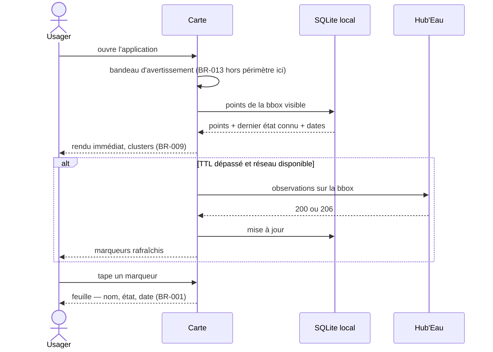

# UC-001 — Consulter l'état de la rivière autour de moi

- **Statut :** Accepté
- **Date :** 2026-07-30
- **Contexte borné :** Carte
- **Acteur principal :** Citoyen riverain (P1), Pêcheur (P3) · **Acteurs secondaires :** Hub'Eau, cache local, géolocalisation

## Objectif

Voir en un coup d'œil l'état des cours d'eau autour de soi, sans savoir à l'avance quelle station ou quel point consulter.

## Préconditions

- L'avertissement initial a été acquitté (`UC-006`, `BR-012`).
- Le référentiel des stations et des points ONDE a été préchargé au premier lancement, ou est disponible en cache.

## Déclencheur

L'usager ouvre l'application. La carte est l'écran d'accueil.

## Flux nominal

1. L'application demande une position approximative et centre la carte dessus.
2. Le **bandeau d'avertissement permanent** s'affiche et le reste à tous les niveaux de zoom.
3. L'échelle **écoulement** est active par défaut ; la légende l'indique (`BR-008`).
4. Les points de la zone visible sont lus depuis le cache et rendus immédiatement, groupés en clusters portant l'état le plus sévère qu'ils contiennent (`BR-009`).
5. Si le TTL est dépassé et le réseau disponible, un rafraîchissement s'exécute en tâche de fond ; les marqueurs se mettent à jour sans vider l'écran.
6. Les données de plus de 24 heures sont rendues atténuées (`BR-005`).
7. L'usager tape un marqueur ; une feuille affiche le nom, l'état, **sa date**, et un accès à la fiche.

## Flux alternatifs / erreurs

- **A1 — Géolocalisation refusée :** la carte se centre sur une vue nationale. Aucun blocage, aucune relance insistante.
- **A2 — Aucun point dans la zone :** message explicite d'absence de mesure, jamais un écran vide neutre (`BR-007`). Action « Élargir la recherche ».
- **A3 — Hors ligne :** voir `UC-005`.
- **A4 — Hub'Eau indisponible :** les données en cache restent affichées avec leur date ; un message nomme la source défaillante. Les autres sources continuent de fonctionner (`BR-007`).
- **A5 — Zone hors couverture ONDE :** le message nomme le périmètre réel du réseau (France hexagonale et Corse, points choisis sur de petits cours d'eau).
- **A6 — L'usager change d'échelle :** les marqueurs et la légende changent ensemble ; aucune superposition d'échelles (`BR-008`).

## Postconditions

- `DerniereVueCarte` est mise à jour (bbox + zoom), ce qui conditionne le hors-ligne de `UC-005`.
- Les observations récupérées sont en cache avec leur horodatage.

## Règles métier référencées

- `BR-001` — date de mesure obligatoire
- `BR-005` — donnée périmée atténuée
- `BR-007` — l'absence n'est jamais un état neutre
- `BR-008` — une seule échelle à la fois
- `BR-009` — le cluster porte l'état le plus sévère

## Liens

- ADR : `ADR-005`, `ADR-006` · Écran : [`04-ui.md § 1`](../04-ui.md)
