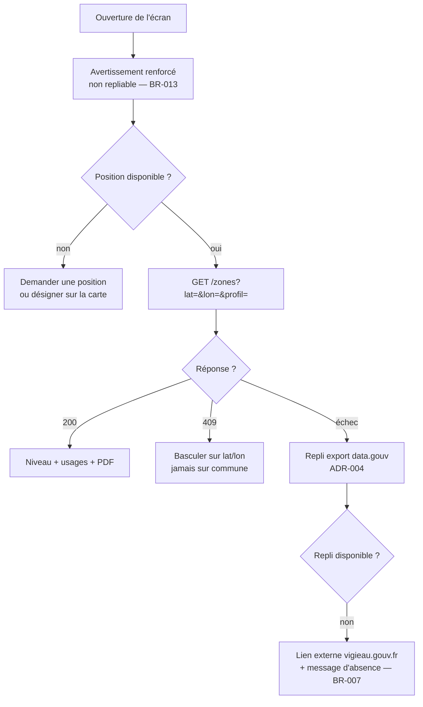

# UC-002 — Consulter les restrictions applicables à mon usage

- **Statut :** Accepté
- **Date :** 2026-07-30
- **Contexte borné :** Restrictions
- **Acteur principal :** Agriculteur / irrigant (P2) · **Acteurs secondaires :** Élu (P5), VigiEau, cache local

## Objectif

Savoir ce qui est restreint là où l'on se trouve, pour son profil d'usager, et accéder au texte qui fait foi.

> C'est le seul cas d'usage du produit où une mauvaise lecture entraîne une conséquence **juridique**. D'où `BR-013`.

## Préconditions

- L'avertissement initial a été acquitté (`BR-012`).
- Une position est disponible, ou l'usager a désigné un point sur la carte.

## Déclencheur

L'usager ouvre l'écran « Sécheresse et restrictions », ou tape une zone colorée sur la carte en échelle 3.

## Flux nominal

1. L'écran affiche d'abord l'**avertissement renforcé, non repliable, en tête** (`BR-013`), avec un accès direct aux arrêtés.
2. L'application interroge VigiEau sur `lat`/`lon`, en filtrant `type = "SUP"` (eaux superficielles).
3. Le niveau de gravité de la zone s'affiche, avec sa **date de début de validité** (`BR-001`) et l'échelle complète, la position de la zone y étant repérée.
4. L'usager choisit son profil : particulier, exploitation, collectivité, entreprise.
5. La liste des usages restreints se filtre sur ce profil. Les libellés du préfet sont **cités tels quels** (`BR-014`).
6. L'usager ouvre le PDF de l'arrêté, ou celui de l'arrêté-cadre.

## Flux alternatifs / erreurs

- **A1 — HTTP 409 (commune multi-zones) :** vérifié le 2026-07-30 sur `?commune=45210`. L'application n'interroge **jamais** par commune ; si le cas survient, elle bascule sur `lat`/`lon`.
- **A2 — Rupture de contrat VigiEau :** l'API est en version `0.1`. Bascule sur `DataGouvBulkRestrictionSource` (`ADR-004`). Le mode dégradé est signalé : pas de filtrage par profil.
- **A3 — Aucune zone renvoyée :** *« Cela ne signifie pas qu'aucun arrêté ne s'applique : vérifiez auprès de votre préfecture. »* (`BR-007`)
- **A4 — Niveau de gravité inconnu :** affiché « non renseigné » (`BR-011`). Le niveau `vigilance` n'a pas été observé le 2026-07-30 et son existence reste **non vérifiée**.
- **A5 — Hors ligne :** dernière réponse en cache, avec sa date et un bandeau. L'avertissement renforcé reste affiché — il est d'autant plus nécessaire que la donnée est datée.
- **A6 — PDF inaccessible :** le lien est présenté avec son URL, sans prétendre l'avoir vérifié.

## Postconditions

- La zone et ses usages sont en cache (TTL 6 h).
- Aucune action de l'usager n'est enregistrée ni transmise : l'application ne collecte rien.

## Règles métier référencées

- `BR-001` — date obligatoire
- `BR-007` — l'absence n'est jamais un état neutre
- `BR-011` — nomenclature tolérante à l'inconnu
- `BR-013` — avertissement renforcé
- `BR-014` — aucun verbe d'instruction

## Liens

- ADR : `ADR-004` · Écran : [`04-ui.md § 1`](../04-ui.md)
