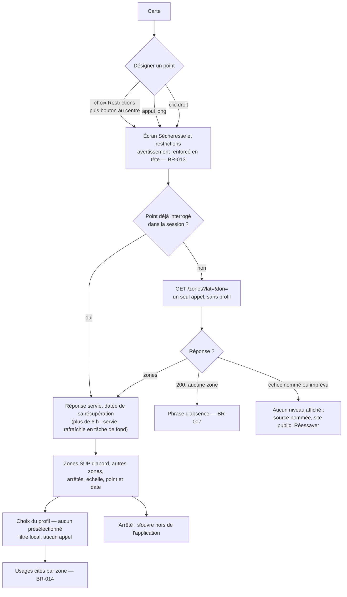

# UC-002 — Consulter les restrictions applicables à mon usage

- **Statut :** Accepté — ✅ **livré en T2 au point désigné** (vérifié par test, **jamais constaté à l'écran** : `P1` et `P2` du plan de T2 sont dus)
- **Date :** 2026-07-30 · **aligné sur le code le 2026-10-04** (`X3` de T2) : un passage dont le sens change est barré, daté par cette ligne, et son remplaçant est écrit à côté ; l'ancien diagramme, trop long pour être barré, est remplacé par une phrase qui dit ce qu'il montrait (sous le nouveau diagramme). Les étapes **4 (profil), 5 et 6 gardent leur numéro d'origine** : le code (`lib/domain/restrictions/user_profile.dart`), un test (`user_profile_test.dart`) et les conceptions de T2 citent « `UC-002`, étape 4 » pour le profil
- **Contexte borné :** Restrictions
- **Acteur principal :** Agriculteur / irrigant (P2) · **Acteurs secondaires :** Élu (P5), VigiEau, ~~cache local~~ cache de session (en mémoire, perdu au relancement : T2, 2026-10-04)

## Objectif

Savoir ce qui est restreint là où l'on se trouve, pour son profil d'usager, et accéder au texte qui fait foi.

> C'est le seul cas d'usage du produit où une mauvaise lecture entraîne une conséquence **juridique**. D'où `BR-013`.

## Préconditions

- L'avertissement initial a été acquitté (`BR-012`).
- ~~Une position est disponible, ou l'usager a désigné un point sur la carte.~~ **Aucune position n'est requise** (Q1-A du cadrage de T2, arbitré le 2026-09-27) : l'usager **désigne un point sur la carte**. La position de l'appareil n'est pas livrée.

## Déclencheur

~~L'usager ouvre l'écran « Sécheresse et restrictions », ou tape une zone colorée sur la carte en échelle 3.~~ L'usager **désigne un point sur la carte**, de l'une de trois manières (conception de l'écran, § 2) :

- **le choix « Restrictions » du sélecteur de la carte**, puis le bouton « Restrictions au centre de la carte », qui désigne le centre de la caméra (c'est l'équivalent au clavier et au lecteur d'écran) ;
- un **appui long** sur la carte (toucher) ;
- un **clic droit** sur la carte (souris).

Aucune entrée n'existe depuis une fiche station ou une fiche ONDE (Q1 du cadrage de T2, maintenu par le commanditaire le 2026-10-03). Aucune zone d'alerte n'est dessinée sur la carte, qu'on pourrait taper : l'échelle 3 n'y est pas affichée en T2 (Q6-A) — les pastilles de la carte regroupent des stations par zone administrative, elles ne portent aucun niveau de sécheresse. Le point désigné ouvre l'écran plein « Sécheresse et restrictions » **par-dessus** la carte.

## Flux nominal

1. L'écran s'ouvre sur l'**avertissement renforcé, non repliable, en tête** (`BR-013`), avec un accès direct aux arrêtés — avant même la réponse de la source, et dans tous les états. Son titre et son action restent épinglés tant qu'ils prennent au plus la moitié de la hauteur utile ; au-delà, tout l'encart est le premier élément du défilement.
2. L'application interroge VigiEau sur `lat`/`lon`, ~~en filtrant `type = "SUP"` (eaux superficielles)~~ **en un seul appel par point**, sans `profil` et **sans filtrer le type de zone** (Q5-B, arbitré le 2026-09-27) : **toutes les zones du point sont gardées**, `SUP` (eaux superficielles) présentée en premier.
3. ~~Le niveau de gravité de la zone s'affiche~~ L'écran rappelle le **point désigné** et la **date de récupération** de la réponse, puis, pour **chaque** zone — les eaux superficielles d'abord, puis « Autres zones au même point » (eaux souterraines, eau potable, type inconnu) — son type, son nom, le niveau de gravité avec sa **date de début de validité** (`BR-001`), sa date de fin, et l'échelle complète, la position de la zone y étant repérée. Aucune zone n'est présentée comme « la » zone du point. Une section « Arrêtés » liste ensuite chaque document **une seule fois** (arrêté de restriction, arrêté-cadre), avec les zones qui le citent.
4. L'usager choisit son profil : particulier, exploitation, collectivité, entreprise. **Aucun n'est présélectionné**, et le choix ne déclenche **aucun appel** (étape 5).
5. ~~La liste des usages restreints se filtre sur ce profil.~~ Les usages restreints s'affichent, **groupés par zone**, filtrés sur ce profil. Le filtrage se fait **dans le domaine sur une réponse déjà reçue** : changer de profil ne coûte **aucun appel**. Les libellés du préfet sont **cités tels quels** (`BR-014`).
6. L'usager ouvre le PDF de l'arrêté, ou celui de l'arrêté-cadre, **hors de l'application**.

Au retour de l'écran, la carte réapparaît avec une **épingle** sur le point désigné, jusqu'à la désignation suivante. Le mode « Restrictions » reste tel que l'usager l'a laissé — décision de la boucle principale, **à confirmer par le commanditaire** (`project-state.md`, point 50).

```mermaid
flowchart TD
    C[Carte] --> D{Désigner un point}
    D -- "choix Restrictions<br/>puis bouton au centre" --> O
    D -- appui long --> O
    D -- clic droit --> O
    O["Écran Sécheresse et restrictions<br/>avertissement renforcé en tête — BR-013"] --> K{Point déjà interrogé<br/>dans la session ?}
    K -- oui --> R["Réponse servie, datée de sa récupération<br/>(plus de 6 h : servie, rafraîchie en tâche de fond)"]
    K -- non --> Q["GET /zones?lat=&lon=<br/>un seul appel, sans profil"]
    Q --> E{Réponse ?}
    E -- zones --> R
    E -- "200, aucune zone" --> N["Phrase d'absence — BR-007"]
    E -- "échec nommé ou imprévu" --> X["Aucun niveau affiché :<br/>source nommée, site public, Réessayer"]
    R --> F["Zones SUP d'abord, autres zones,<br/>arrêtés, échelle, point et date"]
    F --> P["Choix du profil — aucun présélectionné<br/>filtre local, aucun appel"]
    P --> U["Usages cités par zone — BR-014"]
    F --> A["Arrêté : s'ouvre hors de l'application"]
```

> **Diagramme remplacé le 2026-10-04 (`X3`).** L'ancien partait de « Ouverture de l'écran » et de l'avertissement renforcé, puis d'un test « Position disponible ? » (sinon, « Demander une position ou désigner sur la carte »), interrogeait `GET /zones?lat=&lon=&profil=`, basculait sur `lat`/`lon` après un `409`, passait sur un échec au « Repli export data.gouv » (`ADR-004`) et, sans repli, au lien externe `vigieau.gouv.fr` avec le message d'absence (`BR-007`). Il ne montrait ni la désignation, ni le cache de session, ni le filtrage local par profil, et supposait un repli qui est différé.

## Flux alternatifs / erreurs

- **A1 — HTTP 409 (commune multi-zones) :** vérifié le 2026-07-30 sur `?commune=45210`, reconfirmé le 2026-09-27. L'application n'interroge **jamais** par commune. ~~Si le cas survient, elle bascule sur `lat`/`lon`.~~ Un `409` par `lat`/`lon` n'a **jamais** été vu (`O2` de la conception du modèle) ; s'il survient, il est levé comme `RequeteRefusee(409)` : la source a répondu mais n'a pas su servir ce point, et le texte ne dit pas « injoignable » (A2).
- **A2 — Source injoignable, requête refusée, réponse illisible, ou échec imprévu :** ~~Rupture de contrat VigiEau : bascule sur `DataGouvBulkRestrictionSource` (`ADR-004`). Le mode dégradé est signalé : pas de filtrage par profil.~~ **Le repli data.gouv est différé** (Q3-B de T2, arbitré le 2026-09-27 ; `ADR-004` amendé) : il ne s'écrira que sur une rupture **constatée**. L'application **nomme l'échec** — « VigiEau n'a pas répondu », « VigiEau a répondu, mais n'a pas pu servir ce point », « La réponse de VigiEau n'a pas pu être lue par l'application », ou, pour un échec que la source n'a pas levé, un texte neutre qui **ne nomme pas** la source —, n'affiche **aucun niveau** (`BR-007`), garde l'avertissement renforcé, donne l'adresse du site public `https://vigieau.gouv.fr/` (sélectionnable, ouverte aussi par l'action de l'encart) et propose « Réessayer ». Il n'y a plus de mode « sans filtrage par profil » : le profil ne décide pas de la requête.
- **A3 — Aucune zone renvoyée :** « VigiEau ne renvoie aucune zone d'alerte pour ce point. » puis *« Cela ne signifie pas qu'aucun arrêté ne s'applique : vérifiez auprès de votre préfecture. »* (`BR-007`). `200 []` est une réponse de la source, pas un échec.
- **A4 — Niveau de gravité inconnu, ou type de zone inconnu :** deux cas distincts, la zone est gardée dans les deux, jamais écartée, et la valeur brute n'est jamais affichée (`BR-011`). Une **gravité** inconnue s'affiche « Non renseigné », suivi de la phrase de `BR-007`, sans aucune ligne de l'échelle marquée. Un **type de zone** inconnu s'affiche « Type de zone non renseigné » (`zoneKindLabel`), en fin d'« Autres zones au même point » ; la phrase de `BR-007` ne l'accompagne pas. ~~Le niveau `vigilance` n'a pas été observé le 2026-07-30 et son existence reste non vérifiée.~~ `vigilance` est **observé** (Paris, `zones_paris_vigilance_2026-09-27.json`, et `/departements`). `alerte_renforcee` n'est observé que dans `/departements` : aucune réponse `/zones` ne le porte (`O4`, non trouvé le 2026-09-27) ; il est couvert par une valeur dans le test du mapper, pas par une fixture.
- **A5 — Réponse déjà obtenue dans la session :** ~~Hors ligne : dernière réponse en cache, avec sa date et un bandeau.~~ Le cache est **de session, en mémoire, perdu au relancement** : un point déjà interrogé est servi avec sa **date de récupération** (« Réponse de VigiEau obtenue le … »). Passé 6 h, l'entrée est **servie et datée** pendant que le rafraîchissement court en tâche de fond. **Il n'y a pas de bandeau hors ligne**, et un point jamais interrogé, hors réseau, tombe en A2. L'avertissement renforcé reste affiché — il est d'autant plus nécessaire que la donnée est datée.
- **A6 — PDF inaccessible :** l'adresse **brute** de l'arrêté est toujours affichée et sélectionnable, jamais décodée ni corrigée. Si elle n'est pas une URL absolue en `http` ou `https`, aucune action d'ouverture n'est proposée, et l'écran le dit ; si l'ouverture échoue, l'écran dit que le lien n'a pas pu être ouvert et laisse l'adresse. Une zone sans lien d'arrêté le dit. Rien ne prétend avoir vérifié l'existence du document.

## Postconditions

- ~~La zone et ses usages sont en cache (TTL 6 h).~~ La réponse (toutes les zones et leurs usages) est en **cache de session, en mémoire**, TTL 6 h, **perdue au relancement**. Un échec n'est jamais mis en cache.
- Aucune action de l'usager n'est enregistrée ni transmise : l'application ne collecte rien. Le profil choisi vit le temps de la session, il n'est jamais écrit.

## Règles métier référencées

- `BR-001` — date obligatoire
- `BR-007` — l'absence n'est jamais un état neutre
- `BR-011` — nomenclature tolérante à l'inconnu
- `BR-013` — avertissement renforcé
- `BR-014` — aucun verbe d'instruction

## Liens

- ADR : `ADR-004` · Écran : [`04-ui.md § 1`](../04-ui.md) · Conception : [écran des restrictions](../superpowers/specs/2026-09-27-ecran-restrictions-t2-design.md), [modèle](../superpowers/specs/2026-09-27-modele-restrictions-t2-design.md) · Critères d'acceptation : [`restrictions.feature`](../acceptance/restrictions.feature)
