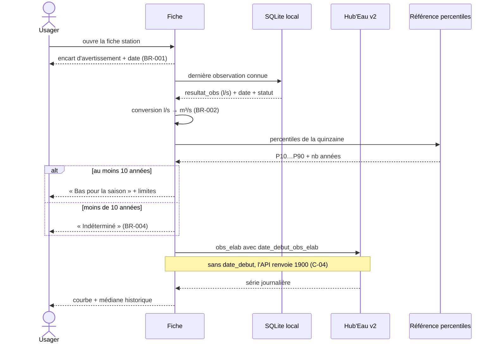

# UC-003 — Consulter le détail d'une station hydrométrique

- **Statut :** Accepté
- **Date :** 2026-07-30
- **Contexte borné :** Hydrometrie
- **Acteur principal :** Usager de loisir (P4) · **Acteurs secondaires :** Citoyen riverain (P1), Hub'Eau v2, asset percentiles

## Objectif

Connaître le débit actuel d'un point de rivière, son évolution récente, et savoir si cette valeur est inhabituelle pour la saison.

## Préconditions

- L'avertissement initial a été acquitté (`BR-012`).
- La station est identifiée par son **code station à 10 caractères** (`BR-011`, contrainte `C-05`).

## Déclencheur

L'usager tape « Voir la fiche » depuis la carte, ou ouvre un favori.

## Flux nominal

1. L'encart d'avertissement s'affiche en tête, **avec la date de la mesure** : *« Mesure brute du {date} à {heure}, non validée. La station ne voit pas les lâchers de barrage. »*
2. Le débit s'affiche en **m³/s**, converti depuis les l/s de l'API (`BR-002`), avec sa date, son statut et sa qualification (`BR-006`).
3. L'asset de référence est consulté pour la quinzaine calendaire courante.
4. Si l'historique compte au moins 10 années, le niveau relatif s'affiche — *« Bas pour la saison »* — avec son percentile, le nombre d'années de référence, et le sous-texte *« Comparaison statistique. Ce n'est pas un seuil réglementaire. »*
5. La courbe d'évolution se charge depuis `obs_elab`, sur 7, 30 ou 90 jours, avec la médiane historique en repère.
6. L'usager peut mettre en favori, télécharger la zone hors-ligne, ou partager.

## Flux alternatifs / erreurs

- **A1 — Historique insuffisant :** niveau « Indéterminé ». La **valeur de débit reste affichée** ; c'est la qualification qui manque (`BR-004`).
- **A2 — Mesure de plus de 24 h :** avertissement explicite indiquant depuis quand la station n'a rien transmis (`BR-005`). Cas réel : une station mesurée le 2026-07-30 avait 9 jours de retard.
- **A3 — Valeur manquante :** *« La station n'a pas transmis de valeur pour ce paramètre. Cela arrive lors des pannes, de la maintenance ou du gel. »* Jamais un zéro.
- **A4 — Courbe indisponible :** la valeur courante reste affichée. La zone de courbe porte un message, l'écran n'est pas vidé.
- **A5 — Station hors service :** accessible par recherche directe, signalée comme fermée, exclue de la carte.
- **A6 — Doublons :** ne survient pas si un code station est utilisé. Une interrogation par code site renverrait chaque mesure deux fois, dont une à `code_station` nul (`C-05`).

## Postconditions

- L'observation et la série consultée sont en cache (TTL 20 min et 12 h).
- Aucun appel n'a été fait à l'asset de percentiles : il est embarqué, lu localement.

## Règles métier référencées

- `BR-001` — date obligatoire · `BR-002` — m³/s · `BR-003` — jamais « suffisant »
- `BR-004` — indéterminé · `BR-005` — péremption · `BR-006` — statut de qualification
- `BR-014` — aucun verbe d'instruction

## Liens

- ADR : `ADR-001`, `ADR-002`, `ADR-003` · Écran : [`04-ui.md § 1`](../04-ui.md)
