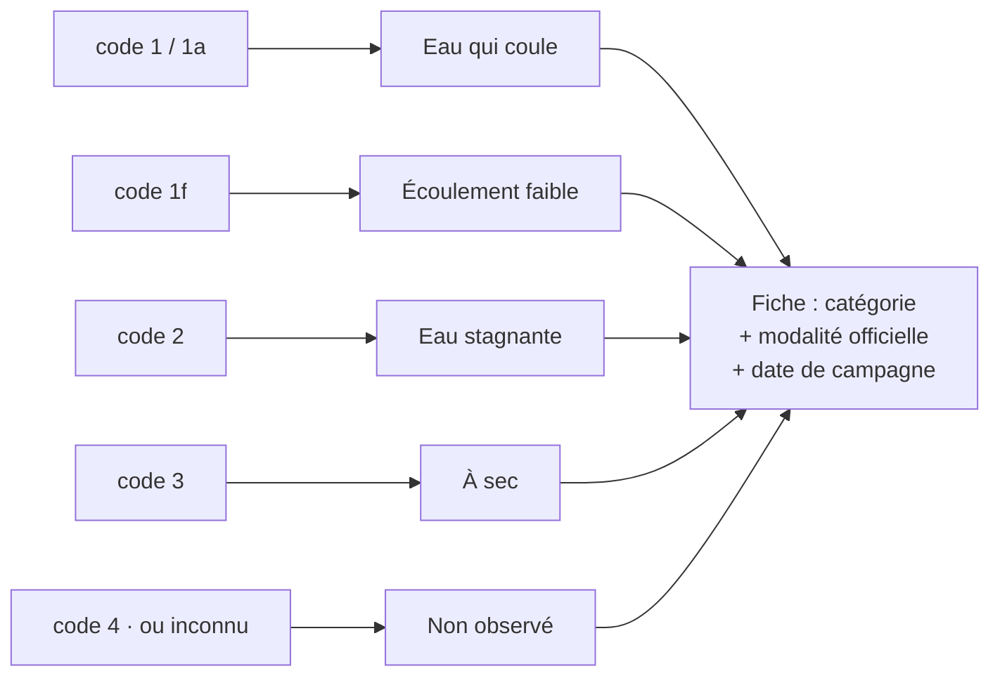

# UC-004 — Consulter un point d'observation ONDE

- **Statut :** Accepté
- **Date :** 2026-07-30
- **Contexte borné :** Ecoulement
- **Acteur principal :** Pêcheur (P3) · **Acteurs secondaires :** Citoyen riverain (P1), Hub'Eau v1 écoulement

## Objectif

Savoir si un petit cours d'eau était à sec lors du dernier passage d'un observateur, et depuis quand cette information date.

## Préconditions

- L'avertissement initial a été acquitté (`BR-012`).
- Le point ONDE existe au référentiel (3 548 points, France hexagonale et Corse).

## Déclencheur

L'usager tape un marqueur ONDE sur la carte, puis « Voir la fiche ».

## Flux nominal

1. L'encart d'avertissement s'affiche en tête, en version renforcée pour ONDE : *« Observation du {date}, lors d'une campagne ponctuelle. Ce n'est pas une mesure de débit, et la situation a pu changer depuis. »*
2. La catégorie s'affiche avec sa forme et son libellé — par exemple **À sec** — et la **date de la campagne** (`BR-001`, `BR-010`).
3. La **modalité officielle exacte** est affichée en second niveau : *« code 3 — Assec »*. Le regroupement en 4 catégories (`ADR-006`) ne masque jamais la source.
4. L'historique des campagnes précédentes s'affiche, chacune avec sa date et son état.
5. Un rappel permanent précise le rythme réel : *« Campagnes de mai à septembre seulement, environ une par mois. Entre deux campagnes, personne n'observe ce point. »*

## Flux alternatifs / erreurs

- **A1 — Hors saison (octobre à avril) :** la dernière campagne a couramment plusieurs mois. Au-delà de 60 jours, l'état passe en gris avec la mention « dernière observation le JJ/MM » (`BR-010`).
- **A2 — Observation impossible (code 4) :** *« Ce point n'a pas pu être observé lors de la dernière campagne. Aucune information disponible ici. »* (`BR-007`)
- **A3 — Code d'écoulement inconnu :** « non renseigné », sans erreur. Les codes sont des **chaînes** (`"1a"`, `"1f"`), pas des entiers (`BR-011`, `C-10`).
- **A4 — Aucune campagne pour ce point :** le point est affiché avec l'état « Non observé », jamais absent de la carte.
- **A5 — Point hors couverture :** aucun point ONDE en outre-mer — département 974 vérifié à 0 station. Le message nomme le périmètre réel.

## Postconditions

- Les deux dernières campagnes du point sont en cache (TTL 30 j en saison, 90 j hors saison).

## Règles métier référencées

- `BR-001` — date obligatoire
- `BR-007` — l'absence n'est jamais un état neutre
- `BR-010` — âge de campagne affiché
- `BR-011` — nomenclature tolérante à l'inconnu

## Liens

- ADR : `ADR-006` · Écran : [`04-ui.md § 1`](../04-ui.md)
