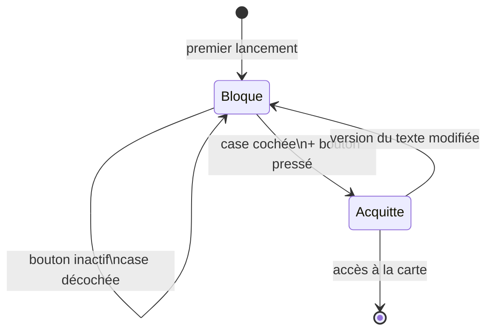

# UC-006 — Acquitter l'avertissement initial

- **Statut :** Accepté
- **Date :** 2026-07-30
- **Contexte borné :** Avertissement
- **Acteur principal :** Tout usager · **Acteurs secondaires :** stockage local des préférences

## Objectif

Garantir que chaque usager a lu, une fois, les limites réelles des données — avant d'avoir une carte sous les yeux.

> Ce n'est pas un artifice juridique. C'est le seul moment où l'usager lit les limites : après, il regarde la carte.

## Préconditions

- Aucune. C'est le premier écran de l'application.

## Déclencheur

Premier lancement, ou lancement suivant une modification substantielle du texte d'avertissement.

## Flux nominal

1. L'écran bloquant s'affiche. Aucune fonctionnalité n'est accessible — y compris par lien profond.
2. Le texte énonce : données publiques Hub'Eau, **indicatives, partielles, parfois anciennes, non validées** ; **elles ne tiennent pas compte des lâchers de barrage** ; elles ne remplacent **jamais** un arrêté préfectoral, une décision d'irrigation, ni une évaluation de sécurité avant de se baigner, naviguer ou traverser.
3. Le bouton **« J'ai compris ces limites »** est **inactif**.
4. L'usager coche : *« J'ai lu et compris que ces données ne valent ni autorisation ni consigne de sécurité. »*
5. Le bouton s'active. L'usager le presse.
6. La **version du texte acquittée** est enregistrée localement, puis la carte s'ouvre.

## Flux alternatifs / erreurs

- **A1 — L'usager ferme l'application sans acquitter :** l'écran réapparaît au lancement suivant. Aucun contournement.
- **A2 — Lien profond ou notification vers une fiche :** la cible est mémorisée, l'écran d'acquittement s'affiche d'abord, la navigation reprend ensuite.
- **A3 — Texte modifié après une release :** la version stockée ne correspond plus, l'écran est réaffiché. Un simple booléen ne suffit pas.
- **A4 — Taille de police à 200 % :** le texte défile, il n'est jamais tronqué. La case et le bouton restent atteignables.
- **A5 — Lecteur d'écran :** le texte est lu intégralement, l'état inactif du bouton est annoncé, ainsi que son activation.
- **A6 — Échec d'enregistrement de l'acquittement (arbitrage du commanditaire du 2026-09-22, point 37) :** l'écriture locale de la version acquittée échoue. La phrase **« Votre choix n'a pas pu être enregistré. Vous pouvez réessayer. »** s'affiche sous le bouton. L'écran reste bloqué (`BR-012`) : aucun accès à la carte. Un nouvel essai reste possible — presser à nouveau le bouton relance l'écriture ; un essai réussi fait disparaître la phrase et enregistre l'acquittement normalement.

## Postconditions

- La version acquittée est persistée localement.
- Les trois autres emplacements d'avertissement restent actifs pour toute la durée de vie de l'application : bandeau de carte (affiché à chaque lancement, fermable pour la session, rappelable par le menu — amendement du 2026-09-23, `W3b`), encart de fiche, encart renforcé (`BR-013`). ⚠️ **Amendement du 2026-09-23 (arbitrage du commanditaire, `W3c`)**, qui remplace le précédent : le bandeau de carte et l'encart de fiche deviennent **un même contrôle « ⚠ Avertissement »** — sur la carte et en tête de chaque fiche —, qui rouvre en lecture seule le texte de cet écran, complété sur une fiche par sa phrase datée. Cet écran-ci (emplacement 1) et l'encart renforcé sont inchangés. **L'acquittement n'en dispense d'aucun.**

## Règles métier référencées

- `BR-012` — acquittement explicite au premier lancement
- `BR-013` — avertissement renforcé sur les écrans de ressource
- `BR-014` — aucun verbe d'instruction

## Liens

- Écran : [`04-ui.md § 1`](../04-ui.md) et [`§ 5`](../04-ui.md)
