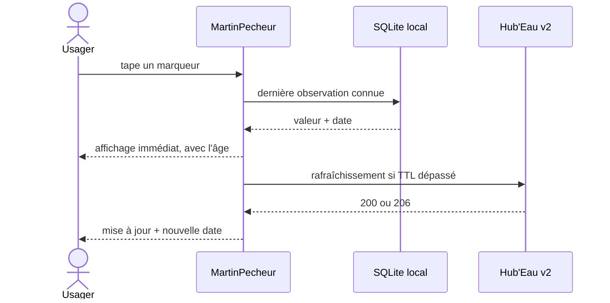

<!--
Copier ce fichier en `UC-NNN-slug.md` (ex: UC-007-rechercher-cours-eau.md).
Diagrammes mermaid dispersés À CÔTÉ de la sous-partie qu'ils illustrent (pas de section
dédiée) — autant que nécessaire, et seulement si utiles. Supprimer ces commentaires.
-->

# UC-NNN — Titre du cas d'usage

- **Statut :** Proposé | Accepté | Remplacé par UC-0xx
- **Date :** AAAA-MM-JJ
- **Contexte borné :** Hydrometrie (ex.)
- **Acteur principal :** Citoyen riverain (ex.) · **Acteurs secondaires :** Hub'Eau, VigiEau, cache local

## Objectif

Une phrase : ce que l'acteur veut accomplir et la valeur produite.

## Préconditions

- Ce qui doit être vrai avant de démarrer (ex : l'avertissement initial a été acquitté).

## Déclencheur

L'événement qui lance le scénario (ex : l'usager tape un marqueur sur la carte).

## Flux nominal

1. …
2. …

<!-- Intégrer le diagramme de séquence ICI, au fil du flux, s'il aide à visualiser l'interaction -->

## Flux alternatifs / erreurs

- **A1 — Hors ligne :** … (cf. `BR-0xx`)
- **A2 — Donnée périmée :** …

<!-- Intégrer un flowchart ICI si les branches méritent d'être visualisées -->

## Postconditions

- État du système après succès.

## Règles métier référencées

- `BR-0xx — …`

## Liens

- ADR : `ADR-0xx` · Écran : [`04-ui.md`](../04-ui.md)
